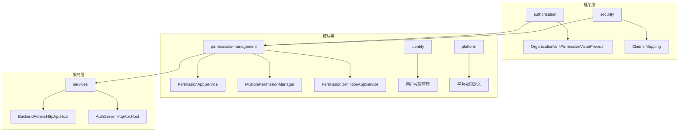
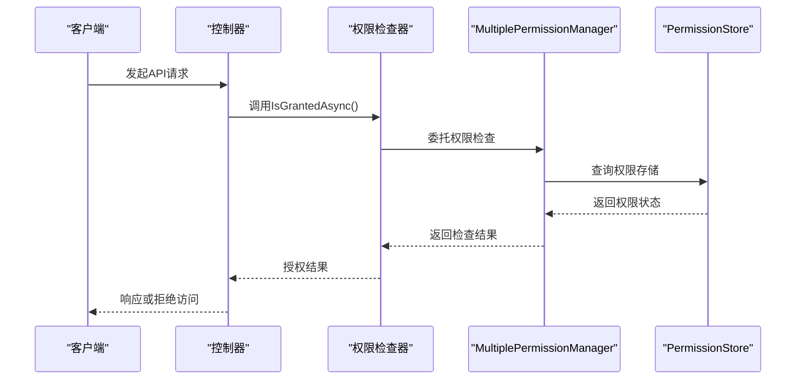
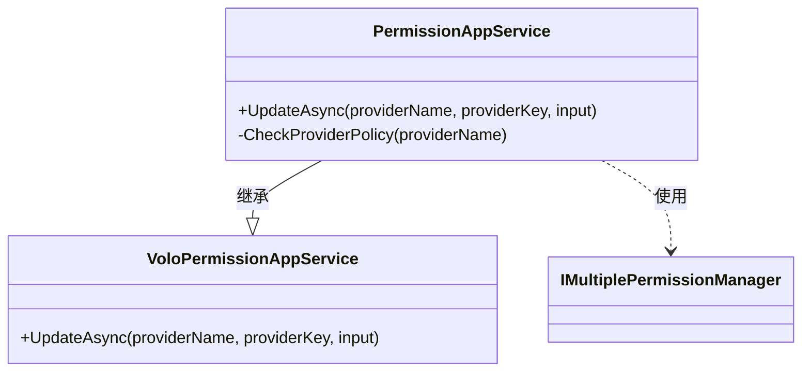
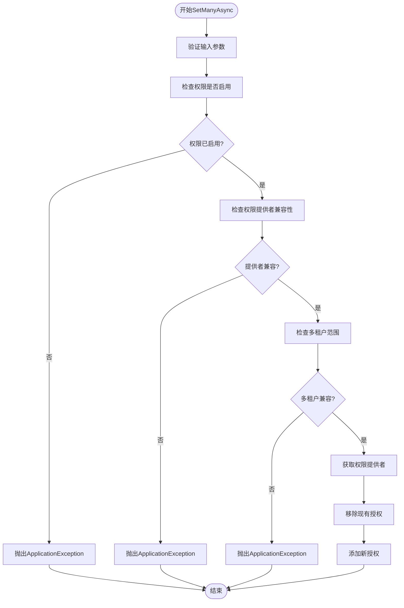
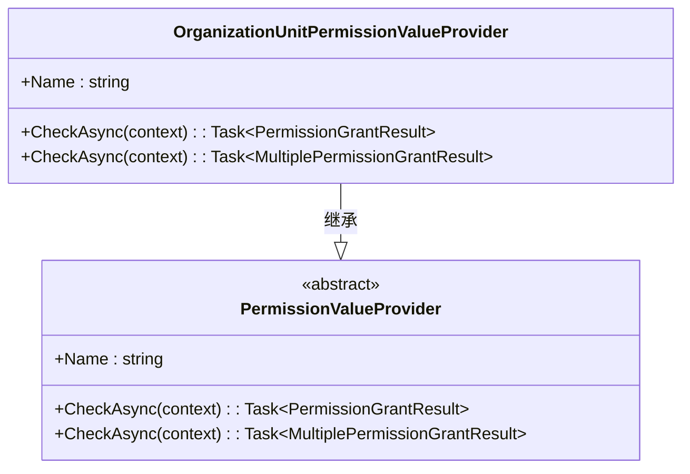
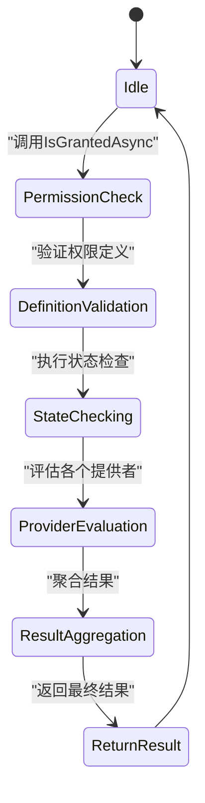
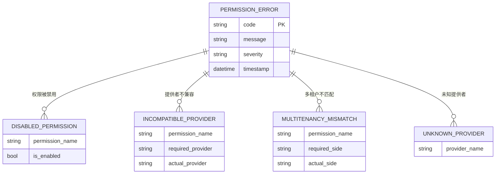

# 权限验证

<cite>
**本文档中引用的文件**  
- [PermissionAppService.cs](file://aspnet-core\modules\permissions-management\LINGYUN.Abp.PermissionManagement.Application\LINGYUN\Abp\PermissionManagement\PermissionAppService.cs)
- [MultiplePermissionManager.cs](file://aspnet-core\modules\permissions-management\LINGYUN.Abp.PermissionManagement.Application\LINGYUN\Abp\PermissionManagement\MultiplePermissionManager.cs)
- [OrganizationUnitPermissionValueProvider.cs](file://aspnet-core\framework\authorization\LINGYUN.Abp.Authorization.OrganizationUnits\LINGYUN\Abp\Authorization\Permissions\OrganizationUnitPermissionValueProvider.cs)
- [PermissionDefinitionAppService.cs](file://aspnet-core\modules\permissions-management\LINGYUN.Abp.PermissionManagement.Application\LINGYUN\Abp\PermissionManagement\Definitions\PermissionDefinitionAppService.cs)
- [PermissionManagementPermissionNames.cs](file://aspnet-core\modules\permissions-management\LINGYUN.Abp.PermissionManagement.Application.Contracts\LINGYUN\Abp\PermissionManagement\Permissions\PermissionManagementPermissionNames.cs)
- [PermissionManagementPermissionDefinitionProvider.cs](file://aspnet-core\modules\permissions-management\LINGYUN.Abp.PermissionManagement.Application.Contracts\LINGYUN\Abp\PermissionManagement\Permissions\PermissionManagementPermissionDefinitionProvider.cs)
- [AbpPermissionManagementDomainOrganizationUnitsModule.cs](file://aspnet-core\modules\permissions-management\LINGYUN.Abp.PermissionManagement.Domain.OrganizationUnits\LINGYUN\Abp\PermissionManagement\OrganizationUnits\AbpPermissionManagementDomainOrganizationUnitsModule.cs)
- [PermissionChangeState.cs](file://aspnet-core\modules\permissions-management\LINGYUN.Abp.PermissionManagement.Application\LINGYUN\Abp\PermissionManagement\PermissionChangeState.cs)
- [PermissionManagementErrorCodes.cs](file://aspnet-core\modules\permissions-management\LINGYUN.Abp.PermissionManagement.Application.Contracts\LINGYUN\Abp\PermissionManagement\PermissionManagementErrorCodes.cs)
</cite>

## 目录
1. [简介](#简介)
2. [项目结构](#项目结构)
3. [核心组件](#核心组件)
4. [权限验证架构概述](#权限验证架构概述)
5. [详细组件分析](#详细组件分析)
6. [基于策略的授权实现](#基于策略的授权实现)
7. [基于要求的授权实现](#基于要求的授权实现)
8. [异常处理机制](#异常处理机制)
9. [性能优化建议](#性能优化建议)
10. [常见问题解决方案](#常见问题解决方案)
11. [结论](#结论)

## 简介
本文档深入解析 abp-next-admin 项目的权限验证机制，涵盖运行时权限检查的实现原理、请求拦截流程、权限校验逻辑和异常处理机制。重点描述基于策略的授权（Policy-based Authorization）和基于要求的授权（Requirement-based Authorization）的具体实现方式，并提供性能优化建议与常见问题解决方案，确保权限验证系统的高效性与安全性。

## 项目结构
abp-next-admin 项目的权限管理功能主要分布在 `aspnet-core` 目录下的多个模块中，形成了分层清晰的权限管理体系：

**Diagram sources**
- [OrganizationUnitPermissionValueProvider.cs](file://aspnet-core\framework\authorization\LINGYUN.Abp.Authorization.OrganizationUnits\LINGYUN\Abp\Authorization\Permissions\OrganizationUnitPermissionValueProvider.cs)
- [PermissionAppService.cs](file://aspnet-core\modules\permissions-management\LINGYUN.Abp.PermissionManagement.Application\LINGYUN\Abp\PermissionManagement\PermissionAppService.cs)
- [BackendAdmin.HttpApi.Host](file://aspnet-core\services\LY.MicroService.BackendAdmin.HttpApi.Host)

**Section sources**
- [project_structure](file://project_structure#L1-L200)

## 核心组件
权限验证系统的核心组件包括权限应用服务、多权限管理器、权限值提供者和权限定义服务，它们协同工作以实现完整的权限控制流程。

**Section sources**
- [PermissionAppService.cs](file://aspnet-core\modules\permissions-management\LINGYUN.Abp.PermissionManagement.Application\LINGYUN\Abp\PermissionManagement\PermissionAppService.cs)
- [MultiplePermissionManager.cs](file://aspnet-core\modules\permissions-management\LINGYUN.Abp.PermissionManagement.Application\LINGYUN\Abp\PermissionManagement\MultiplePermissionManager.cs)

## 权限验证架构概述
系统采用分层架构实现权限验证，从请求拦截到最终的权限决策形成闭环。

**Diagram sources**
- [PermissionAppService.cs](file://aspnet-core\modules\permissions-management\LINGYUN.Abp.PermissionManagement.Application\LINGYUN\Abp\PermissionManagement\PermissionAppService.cs)
- [MultiplePermissionManager.cs](file://aspnet-core\modules\permissions-management\LINGYUN.Abp.PermissionManagement.Application\LINGYUN\Abp\PermissionManagement\MultiplePermissionManager.cs)

## 详细组件分析

### 权限应用服务分析
`PermissionAppService` 是权限管理的主要入口点，通过替换默认服务实现了增强的权限管理功能。

**Diagram sources**
- [PermissionAppService.cs](file://aspnet-core\modules\permissions-management\LINGYUN.Abp.PermissionManagement.Application\LINGYUN\Abp\PermissionManagement\PermissionAppService.cs)

**Section sources**
- [PermissionAppService.cs](file://aspnet-core\modules\permissions-management\LINGYUN.Abp.PermissionManagement.Application\LINGYUN\Abp\PermissionManagement\PermissionAppService.cs)

### 多权限管理器分析
`MultiplePermissionManager` 实现了批量权限设置的核心逻辑，包含完整的权限验证流程。

**Diagram sources**
- [MultiplePermissionManager.cs](file://aspnet-core\modules\permissions-management\LINGYUN.Abp.PermissionManagement.Application\LINGYUN\Abp\PermissionManagement\MultiplePermissionManager.cs)

**Section sources**
- [MultiplePermissionManager.cs](file://aspnet-core\modules\permissions-management\LINGYUN.Abp.PermissionManagement.Application\LINGYUN\Abp\PermissionManagement\MultiplePermissionManager.cs)

## 基于策略的授权实现
系统通过组织单元权限值提供者实现了基于策略的授权机制，允许根据不同的策略进行权限判断。

该实现通过以下步骤完成策略授权：
1. 从主体声明中提取组织单元信息
2. 遍历所有相关组织单元
3. 在权限存储中查询特定组织单元的权限授予状态
4. 返回相应的授权结果

**Diagram sources**
- [OrganizationUnitPermissionValueProvider.cs](file://aspnet-core\framework\authorization\LINGYUN.Abp.Authorization.OrganizationUnits\LINGYUN\Abp\Authorization\Permissions\OrganizationUnitPermissionValueProvider.cs)

**Section sources**
- [OrganizationUnitPermissionValueProvider.cs](file://aspnet-core\framework\authorization\LINGYUN.Abp.Authorization.OrganizationUnits\LINGYUN\Abp\Authorization\Permissions\OrganizationUnitPermissionValueProvider.cs)

## 基于要求的授权实现
系统通过权限定义管理器和权限检查上下文实现了基于要求的授权模式，支持复杂的权限需求验证。

这种实现方式允许系统根据预定义的要求集合来决定是否授予访问权限，支持动态权限管理和实时权限变更。

**Diagram sources**
- [PermissionDefinitionAppService.cs](file://aspnet-core\modules\permissions-management\LINGYUN.Abp.PermissionManagement.Application\LINGYUN\Abp\PermissionManagement\Definitions\PermissionDefinitionAppService.cs)

**Section sources**
- [PermissionDefinitionAppService.cs](file://aspnet-core\modules\permissions-management\LINGYUN.Abp.PermissionManagement.Application\LINGYUN\Abp\PermissionManagement\Definitions\PermissionDefinitionAppService.cs)

## 异常处理机制
权限系统实现了完善的异常处理机制，能够准确识别和报告各种权限相关的错误情况。

当检测到无效权限、不兼容的权限提供者或多租户范围不匹配等情况时，系统会抛出相应的应用程序异常，提供详细的错误信息以便调试和处理。

**Diagram sources**
- [MultiplePermissionManager.cs](file://aspnet-core\modules\permissions-management\LINGYUN.Abp.PermissionManagement.Application\LINGYUN\Abp\PermissionManagement\MultiplePermissionManager.cs)
- [PermissionManagementErrorCodes.cs](file://aspnet-core\modules\permissions-management\LINGYUN.Abp.PermissionManagement.Application.Contracts\LINGYUN\Abp\PermissionManagement\PermissionManagementErrorCodes.cs)

**Section sources**
- [MultiplePermissionManager.cs](file://aspnet-core\modules\permissions-management\LINGYUN.Abp.PermissionManagement.Application\LINGYUN\Abp\PermissionManagement\MultiplePermissionManager.cs)
- [PermissionManagementErrorCodes.cs](file://aspnet-core\modules\permissions-management\LINGYUN.Abp.PermissionManagement.Application.Contracts\LINGYUN\Abp\PermissionManagement\PermissionManagementErrorCodes.cs)

## 性能优化建议
为了提高权限验证系统的性能，建议采取以下优化措施：

1. **缓存策略**：利用分布式缓存存储频繁访问的权限数据，减少数据库查询次数
2. **批量操作**：使用 `SetManyAsync` 方法进行批量权限更新，减少数据库事务开销
3. **索引优化**：在权限表的关键字段上创建适当的数据库索引
4. **异步处理**：确保所有权限检查操作都以异步方式进行，避免阻塞主线程
5. **权限预加载**：在用户登录时预加载其权限信息，减少后续请求的验证延迟

这些优化措施可以显著提升系统的响应速度和吞吐量，特别是在高并发场景下表现更为明显。

## 常见问题解决方案
针对权限验证过程中可能遇到的常见问题，提供以下解决方案：

1. **权限不生效**：检查权限提供者的配置是否正确，确认 `ProviderPolicies` 设置无误
2. **性能瓶颈**：启用分布式缓存并监控数据库查询性能，必要时增加索引
3. **多租户权限冲突**：严格遵循多租户侧边标志的设置规则，避免跨租户权限泄露
4. **权限继承问题**：确保父级权限的正确配置，验证权限树结构的完整性
5. **动态权限更新延迟**：调整缓存过期策略，确保权限变更能够及时反映

通过实施这些解决方案，可以有效解决大多数权限管理中的实际问题。

## 结论
abp-next-admin 的权限验证机制采用了先进的设计模式，结合了基于策略和基于要求的授权方式，提供了灵活而强大的权限控制能力。系统通过分层架构实现了关注点分离，确保了代码的可维护性和扩展性。同时，完善的异常处理机制和性能优化建议为构建安全高效的权限管理系统提供了坚实的基础。