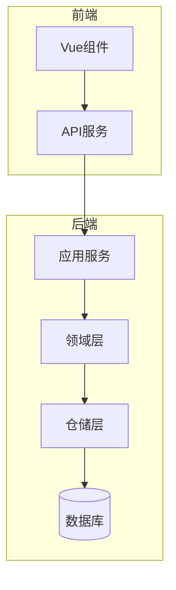
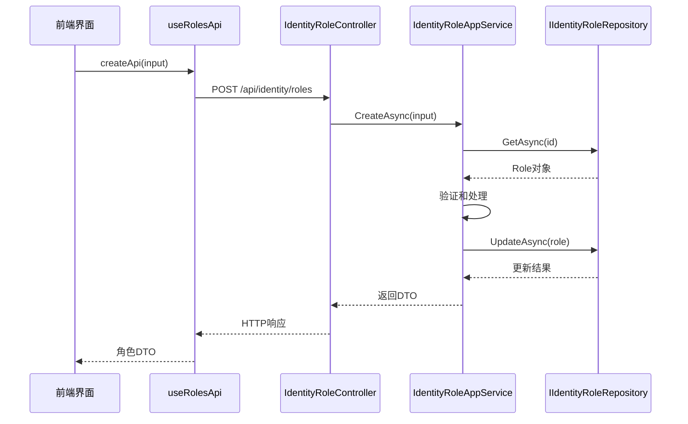
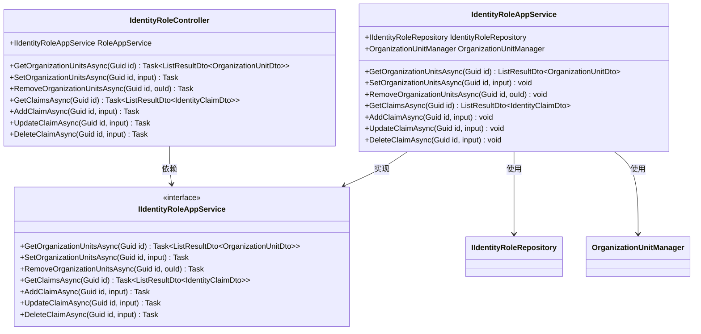
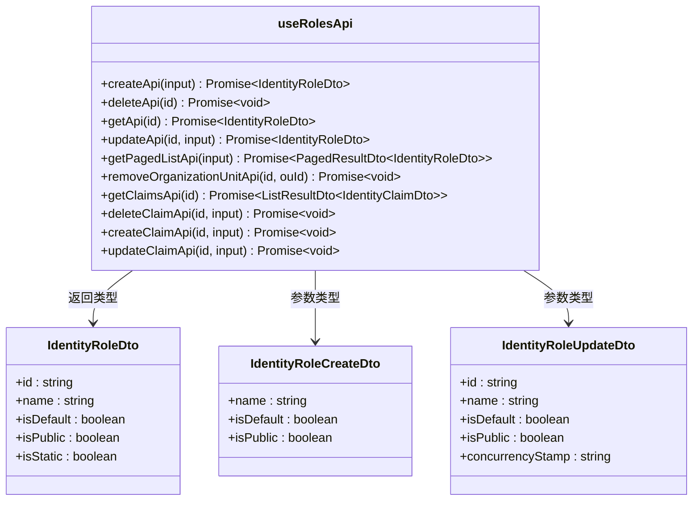
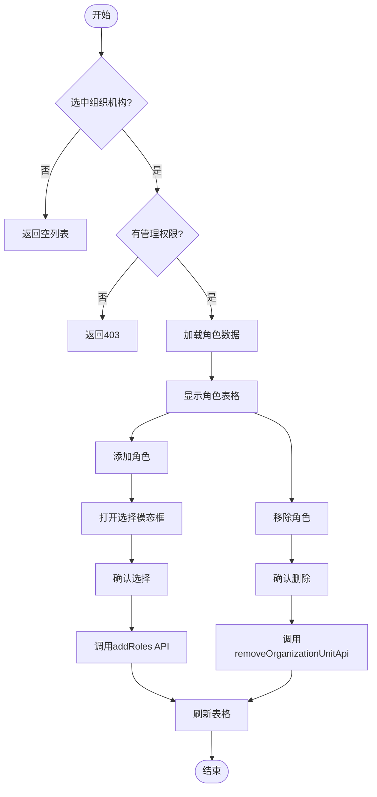
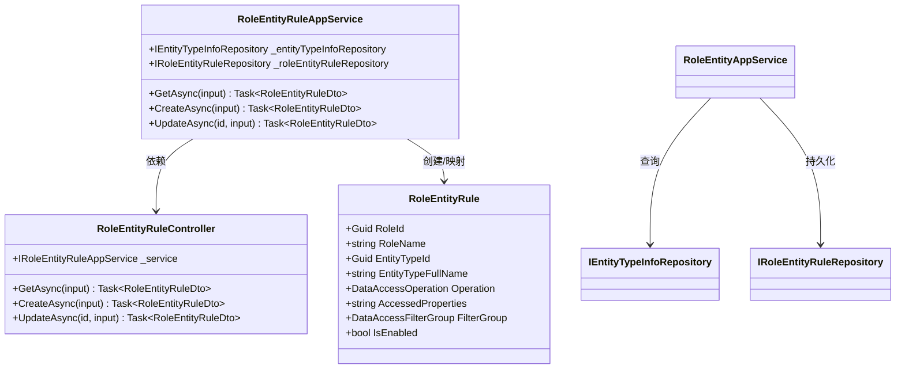
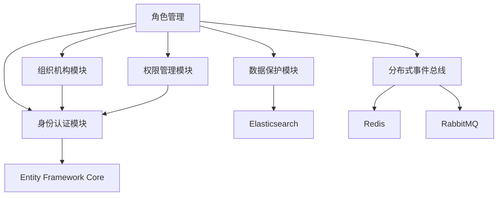

# 角色管理

<cite>
**本文档引用的文件**  
- [IdentityRoleAppService.cs](file://aspnet-core/modules/identity/LINGYUN.Abp.Identity.Application/LINGYUN/Abp/Identity/IdentityRoleAppService.cs)
- [IIdentityRoleAppService.cs](file://aspnet-core/modules/identity/LINGYUN.Abp.Identity.Application.Contracts/LINGYUN/Abp/Identity/IIdentityRoleAppService.cs)
- [IdentityRoleController.cs](file://aspnet-core/modules/identity/LINGYUN.Abp.Identity.HttpApi/LINGYUN/Abp/Identity/IdentityRoleController.cs)
- [useRolesApi.ts](file://apps/vben5/packages/@abp/identity/src/api/useRolesApi.ts)
- [roles.ts](file://apps/vben5/packages/@abp/identity/src/types/roles.ts)
- [OrganizationUnitRoleTable.vue](file://apps/vben5/packages/@abp/identity/src/components/organization-units/OrganizationUnitRoleTable.vue)
- [RoleEntityRuleAppService.cs](file://aspnet-core/modules/data-protection/LINGYUN.Abp.DataProtectionManagement.Application/LINGYUN/Abp/DataProtectionManagement/RoleEntityRuleAppService.cs)
- [RoleEntityRuleController.cs](file://aspnet-core/modules/data-protection/LINGYUN.Abp.DataProtectionManagement.HttpApi/LINGYUN/Abp/DataProtectionManagement/RoleEntityRuleController.cs)
- [IdentityPermissions.cs](file://aspnet-core/modules/identity/LINGYUN.Abp.Identity.Application.Contracts/LINGYUN/Abp/Identity/IdentityPermissions.cs)
</cite>

## 目录
1. [简介](#简介)
2. [项目结构](#项目结构)
3. [核心组件](#核心组件)
4. [架构概述](#架构概述)
5. [详细组件分析](#详细组件分析)
6. [依赖分析](#依赖分析)
7. [性能考虑](#性能考虑)
8. [故障排除指南](#故障排除指南)
9. [结论](#结论)

## 简介
本项目基于ABP框架实现了一套完整的角色管理功能，支持角色的创建、编辑、删除和分配操作。系统通过分层架构设计，将角色管理功能划分为应用服务、领域层、数据访问层和前端界面。角色与用户、权限的关联通过声明（Claim）机制实现，支持组织机构层级的角色分配。系统还实现了基于角色的数据保护规则，允许为不同角色配置数据访问权限。

## 项目结构
角色管理功能主要分布在后端模块和前端包中，采用分层架构设计。

**图示来源**
- [useRolesApi.ts](file://apps/vben5/packages/@abp/identity/src/api/useRolesApi.ts)
- [IdentityRoleAppService.cs](file://aspnet-core/modules/identity/LINGYUN.Abp.Identity.Application/LINGYUN/Abp/Identity/IdentityRoleAppService.cs)

**本节来源**
- [IdentityRoleAppService.cs](file://aspnet-core/modules/identity/LINGYUN.Abp.Identity.Application/LINGYUN/Abp/Identity/IdentityRoleAppService.cs)
- [useRolesApi.ts](file://apps/vben5/packages/@abp/identity/src/api/useRolesApi.ts)

## 核心组件
角色管理功能的核心组件包括后端应用服务、HTTP API控制器和前端API服务。后端通过`IdentityRoleAppService`实现角色管理业务逻辑，`IdentityRoleController`暴露RESTful API接口。前端通过`useRolesApi`封装API调用，提供类型安全的接口访问。系统支持角色与组织机构的关联管理，以及角色声明的增删改查操作。

**本节来源**
- [IdentityRoleAppService.cs](file://aspnet-core/modules/identity/LINGYUN.Abp.Identity.Application/LINGYUN/Abp/Identity/IdentityRoleAppService.cs)
- [IdentityRoleController.cs](file://aspnet-core/modules/identity/LINGYUN.Abp.Identity.HttpApi/LINGYUN/Abp/Identity/IdentityRoleController.cs)
- [useRolesApi.ts](file://apps/vben5/packages/@abp/identity/src/api/useRolesApi.ts)

## 架构概述
系统采用典型的分层架构，前端通过API服务调用后端RESTful接口，后端服务通过应用服务协调领域对象和仓储层完成业务逻辑。

**图示来源**
- [useRolesApi.ts](file://apps/vben5/packages/@abp/identity/src/api/useRolesApi.ts)
- [IdentityRoleController.cs](file://aspnet-core/modules/identity/LINGYUN.Abp.Identity.HttpApi/LINGYUN/Abp/Identity/IdentityRoleController.cs)
- [IdentityRoleAppService.cs](file://aspnet-core/modules/identity/LINGYUN.Abp.Identity.Application/LINGYUN/Abp/Identity/IdentityRoleAppService.cs)

## 详细组件分析

### 角色管理服务分析
角色管理服务实现了角色的增删改查以及与组织机构、声明的关联操作。服务通过依赖注入获取仓储实例，使用工作单元模式确保事务一致性。

**图示来源**
- [IdentityRoleAppService.cs](file://aspnet-core/modules/identity/LINGYUN.Abp.Identity.Application/LINGYUN/Abp/Identity/IdentityRoleAppService.cs)
- [IIdentityRoleAppService.cs](file://aspnet-core/modules/identity/LINGYUN.Abp.Identity.Application.Contracts/LINGYUN/Abp/Identity/IIdentityRoleAppService.cs)
- [IdentityRoleController.cs](file://aspnet-core/modules/identity/LINGYUN.Abp.Identity.HttpApi/LINGYUN/Abp/Identity/IdentityRoleController.cs)

**本节来源**
- [IdentityRoleAppService.cs](file://aspnet-core/modules/identity/LINGYUN.Abp.Identity.Application/LINGYUN/Abp/Identity/IdentityRoleAppService.cs)
- [IdentityRoleController.cs](file://aspnet-core/modules/identity/LINGYUN.Abp.Identity.HttpApi/LINGYUN/Abp/Identity/IdentityRoleController.cs)

### 前端API服务分析
前端API服务封装了角色管理的所有HTTP请求，提供类型安全的接口调用方法。

**图示来源**
- [useRolesApi.ts](file://apps/vben5/packages/@abp/identity/src/api/useRolesApi.ts)
- [roles.ts](file://apps/vben5/packages/@abp/identity/src/types/roles.ts)

**本节来源**
- [useRolesApi.ts](file://apps/vben5/packages/@abp/identity/src/api/useRolesApi.ts)
- [roles.ts](file://apps/vben5/packages/@abp/identity/src/types/roles.ts)

### 组织机构角色管理分析
组织机构角色管理组件实现了在组织机构上下文中管理角色分配的功能。

**图示来源**
- [OrganizationUnitRoleTable.vue](file://apps/vben5/packages/@abp/identity/src/components/organization-units/OrganizationUnitRoleTable.vue)
- [useOrganizationUnitsApi.ts](file://apps/vben5/packages/@abp/identity/src/api/useOrganizationUnitsApi.ts)

**本节来源**
- [OrganizationUnitRoleTable.vue](file://apps/vben5/packages/@abp/identity/src/components/organization-units/OrganizationUnitRoleTable.vue)

### 数据保护角色规则分析
数据保护模块实现了基于角色的数据访问规则管理功能。

**图示来源**
- [RoleEntityRuleAppService.cs](file://aspnet-core/modules/data-protection/LINGYUN.Abp.DataProtectionManagement.Application/LINGYUN/Abp/DataProtectionManagement/RoleEntityRuleAppService.cs)
- [RoleEntityRuleController.cs](file://aspnet-core/modules/data-protection/LINGYUN.Abp.DataProtectionManagement.HttpApi/LINGYUN/Abp/DataProtectionManagement/RoleEntityRuleController.cs)

**本节来源**
- [RoleEntityRuleAppService.cs](file://aspnet-core/modules/data-protection/LINGYUN.Abp.DataProtectionManagement.Application/LINGYUN/Abp/DataProtectionManagement/RoleEntityRuleAppService.cs)
- [RoleEntityRuleController.cs](file://aspnet-core/modules/data-protection/LINGYUN.Abp.DataProtectionManagement.HttpApi/LINGYUN/Abp/DataProtectionManagement/RoleEntityRuleController.cs)

## 依赖分析
角色管理功能依赖于多个核心模块和外部服务。

**图示来源**
- [IdentityPermissions.cs](file://aspnet-core/modules/identity/LINGYUN.Abp.Identity.Application.Contracts/LINGYUN/Abp/Identity/IdentityPermissions.cs)
- [RoleEntityRuleAppService.cs](file://aspnet-core/modules/data-protection/LINGYUN.Abp.DataProtectionManagement.Application/LINGYUN/Abp/DataProtectionManagement/RoleEntityRuleAppService.cs)

**本节来源**
- [IdentityPermissions.cs](file://aspnet-core/modules/identity/LINGYUN.Abp.Identity.Application.Contracts/LINGYUN/Abp/Identity/IdentityPermissions.cs)

## 性能考虑
角色管理功能在设计时考虑了性能优化，通过缓存、批量操作和异步处理提高系统响应速度。建议在大规模用户场景下启用Redis缓存角色信息，避免频繁数据库查询。对于组织机构层级较深的场景，建议优化树形结构查询算法，减少递归调用。数据保护规则的查询应使用Elasticsearch等搜索引擎，避免在关系型数据库中进行复杂查询。

## 故障排除指南
常见问题包括角色无法创建、权限不足、数据不一致等。检查步骤包括：验证用户权限是否包含`IdentityPermissions.Roles.Default`，确认数据库连接正常，检查工作单元是否正确提交，验证输入数据格式是否符合要求。对于分布式场景，还需检查事件总线配置和消息队列状态。

**本节来源**
- [IdentityRoleAppService.cs](file://aspnet-core/modules/identity/LINGYUN.Abp.Identity.Application/LINGYUN/Abp/Identity/IdentityRoleAppService.cs)
- [IdentityPermissions.cs](file://aspnet-core/modules/identity/LINGYUN.Abp.Identity.Application.Contracts/LINGYUN/Abp/Identity/IdentityPermissions.cs)

## 结论
本角色管理功能实现了完整的角色生命周期管理，支持与组织机构、权限系统的深度集成。系统采用模块化设计，前后端分离架构，具有良好的扩展性和维护性。通过数据保护规则，实现了细粒度的数据访问控制。建议在生产环境中根据实际需求调整缓存策略和权限配置，确保系统性能和安全性。