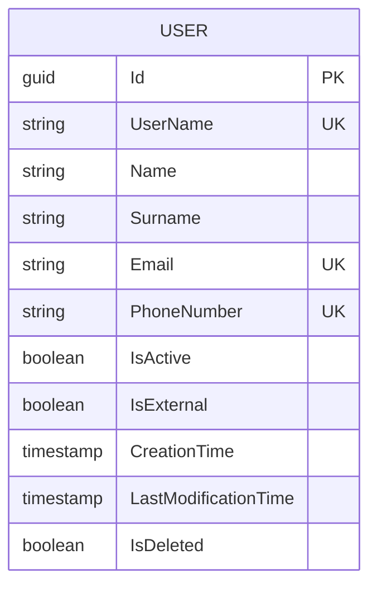
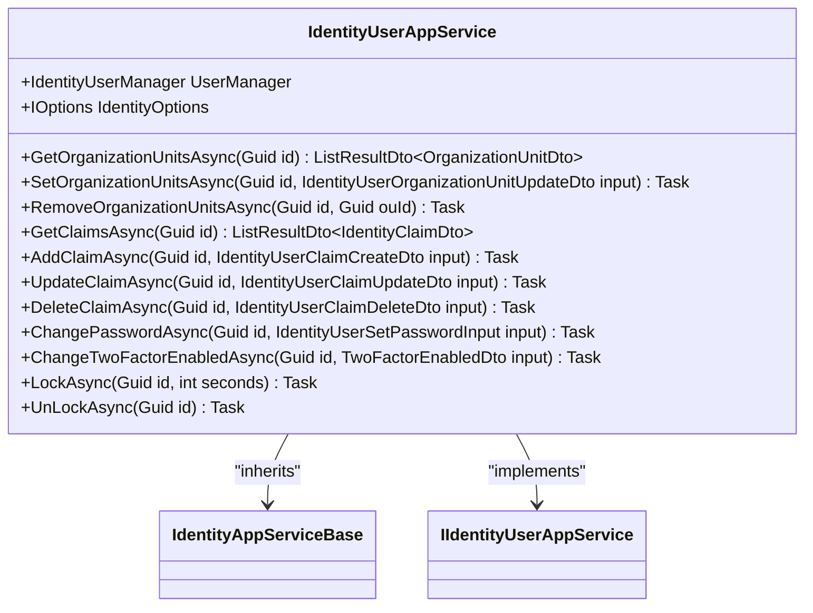
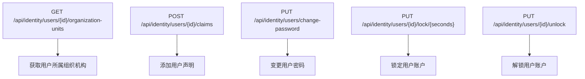
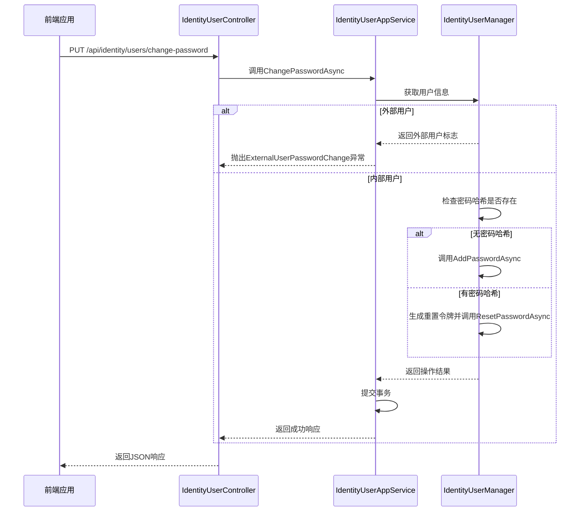

# 用户基本信息管理

<cite>
**本文档引用文件**   
- [IdentityUserAppService.cs](file://aspnet-core/modules/identity/LINGYUN.Abp.Identity.Application/LINGYUN/Abp/Identity/IdentityUserAppService.cs)
- [IdentityUserController.cs](file://aspnet-core/modules/identity/LINGYUN.Abp.Identity.HttpApi/LINGYUN/Abp/Identity/IdentityUserController.cs)
- [IIdentityUserAppService.cs](file://aspnet-core/modules/identity/LINGYUN.Abp.Identity.Application.Contracts/LINGYUN/Abp/Identity/IIdentityUserAppService.cs)
- [SingleMigrationsDbContextModelSnapshot.cs](file://aspnet-core/migrations/LY.MicroService.Applications.Single.EntityFrameworkCore.MySql/Migrations/SingleMigrationsDbContextModelSnapshot.cs)
</cite>

## 目录
1. [简介](#简介)
2. [用户实体模型设计](#用户实体模型设计)
3. [核心操作实现机制](#核心操作实现机制)
4. [用户管理API接口](#用户管理api接口)
5. [前后端交互流程](#前后端交互流程)
6. [数据验证规则](#数据验证规则)

## 简介
本文档详细阐述了abp-next-admin项目中用户基本信息管理功能的实现机制。系统基于ABP框架构建，提供了完整的用户创建、编辑、删除和查询等核心操作。通过分层架构设计，将应用服务、领域逻辑和数据访问分离，确保了系统的可维护性和扩展性。

## 用户实体模型设计

### 用户属性定义
用户实体模型包含以下核心属性：

| 属性名称 | 类型 | 说明 |
|---------|------|------|
| Id | Guid | 用户唯一标识符 |
| UserName | string | 用户名，最大长度64字符 |
| Name | string | 姓名，最大长度64字符 |
| Surname | string | 姓氏，最大长度64字符 |
| Email | string | 邮箱地址，最大长度256字符 |
| PhoneNumber | string | 手机号码，最大长度16字符 |
| IsActive | bool | 账户状态（启用/禁用） |
| IsExternal | bool | 是否为外部认证用户 |
| CreationTime | DateTime | 创建时间 |
| LastModificationTime | DateTime? | 最后修改时间 |



**图表来源**
- [SingleMigrationsDbContextModelSnapshot.cs](file://aspnet-core/migrations/LY.MicroService.Applications.Single.EntityFrameworkCore.MySql/Migrations/SingleMigrationsDbContextModelSnapshot.cs)

### 状态管理
用户状态通过`IsActive`字段进行管理：
- `IsActive = true`：账户处于启用状态，可以正常登录和使用系统
- `IsActive = false`：账户被禁用，无法登录系统

此外，系统还支持锁定机制，通过`LockAsync`和`UnLockAsync`方法实现临时锁定功能，用于安全控制场景。

**章节来源**
- [SingleMigrationsDbContextModelSnapshot.cs](file://aspnet-core/migrations/LY.MicroService.Applications.Single.EntityFrameworkCore.MySql/Migrations/SingleMigrationsDbContextModelSnapshot.cs)

## 核心操作实现机制

### 应用服务层
用户管理的核心业务逻辑由`IdentityUserAppService`类实现，该类继承自`IdentityAppServiceBase`并实现了`IIdentityUserAppService`接口。



**图表来源**
- [IdentityUserAppService.cs](file://aspnet-core/modules/identity/LINGYUN.Abp.Identity.Application/LINGYUN/Abp/Identity/IdentityUserAppService.cs)

### 权限控制
系统采用基于角色的访问控制（RBAC）机制，通过`[Authorize]`特性实现细粒度权限管理：

- `IdentityPermissions.Users.Default`：基础用户权限
- `IdentityPermissions.Users.ManageOrganizationUnits`：组织机构管理权限
- `IdentityPermissions.Users.ManageClaims`：声明管理权限
- `IdentityPermissions.Users.ResetPassword`：密码重置权限
- `IdentityPermissions.Users.Update`：用户信息更新权限

**章节来源**
- [IdentityUserAppService.cs](file://aspnet-core/modules/identity/LINGYUN.Abp.Identity.Application/LINGYUN/Abp/Identity/IdentityUserAppService.cs)

## 用户管理API接口

### HTTP方法与URL路径
系统提供RESTful风格的API接口，遵循标准HTTP协议规范：



**图表来源**
- [IdentityUserController.cs](file://aspnet-core/modules/identity/LINGYUN.Abp.Identity.HttpApi/LINGYUN/Abp/Identity/IdentityUserController.cs)

### 请求参数结构
#### 添加用户声明
```json
{
  "claimType": "string",
  "claimValue": "string"
}
```

#### 变更密码
```json
{
  "id": "guid",
  "password": "string"
}
```

### 响应格式
所有API接口返回统一的响应格式：
```json
{
  "success": true,
  "result": {},
  "error": null,
  "unAuthorizedRequest": false
}
```

### 常见错误码
| 错误码 | 说明 |
|-------|------|
| Volo.Abp.Identity:UserLockoutNotEnabled | 用户锁定功能未启用 |
| ExternalUserPasswordChange | 外部用户不允许修改密码 |
| UserClaimAlreadyExists | 用户声明已存在 |

**章节来源**
- [IdentityUserController.cs](file://aspnet-core/modules/identity/LINGYUN.Abp.Identity.HttpApi/LINGYUN/Abp/Identity/IdentityUserController.cs)
- [IIdentityUserAppService.cs](file://aspnet-core/modules/identity/LINGYUN.Abp.Identity.Application.Contracts/LINGYUN/Abp/Identity/IIdentityUserAppService.cs)

## 前后端交互流程

### 用户密码变更流程


**图表来源**
- [IdentityUserAppService.cs](file://aspnet-core/modules/identity/LINGYUN.Abp.Identity.Application/LINGYUN/Abp/Identity/IdentityUserAppService.cs)
- [IdentityUserController.cs](file://aspnet-core/modules/identity/LINGYUN.Abp.Identity.HttpApi/LINGYUN/Abp/Identity/IdentityUserController.cs)

## 数据验证规则
系统在多个层次实施数据验证，确保数据完整性和安全性：

1. **数据库层面**：
   - Email字段最大长度限制为256字符
   - 必填字段设置`IsRequired()`约束
   - 唯一性约束通过数据库索引保证

2. **应用服务层面**：
   - 使用`[Authorize]`特性验证用户权限
   - 在变更密码时检查用户是否为外部用户
   - 添加声明前验证声明是否已存在

3. **领域逻辑层面**：
   - 通过`IdentityOptions`配置项控制密码复杂度、锁定策略等安全设置
   - 使用工作单元模式（UnitOfWork）确保数据一致性

**章节来源**
- [IdentityUserAppService.cs](file://aspnet-core/modules/identity/LINGYUN.Abp.Identity.Application/LINGYUN/Abp/Identity/IdentityUserAppService.cs)
- [SingleMigrationsDbContextModelSnapshot.cs](file://aspnet-core/migrations/LY.MicroService.Applications.Single.EntityFrameworkCore.MySql/Migrations/SingleMigrationsDbContextModelSnapshot.cs)