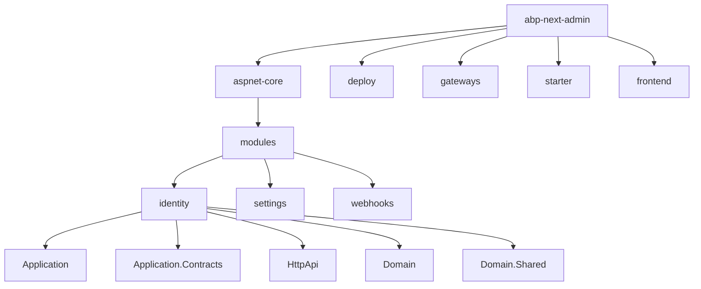
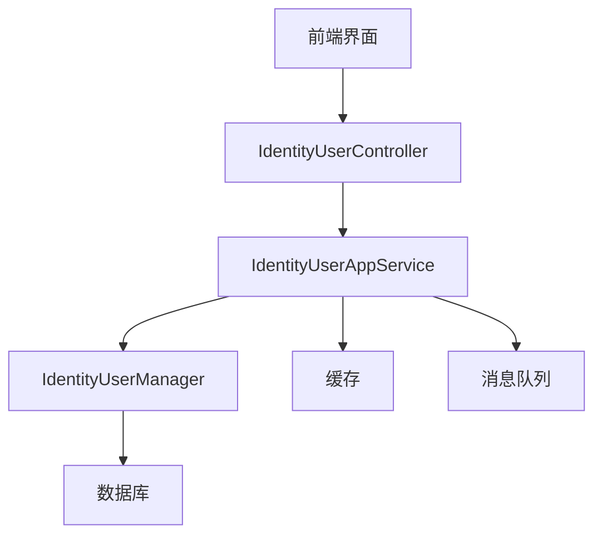
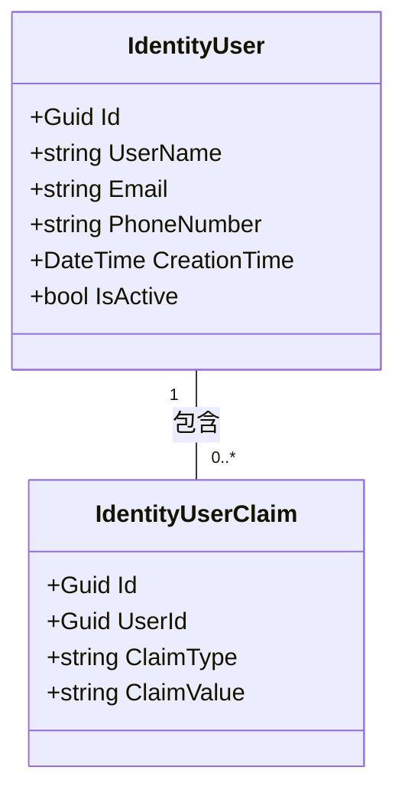
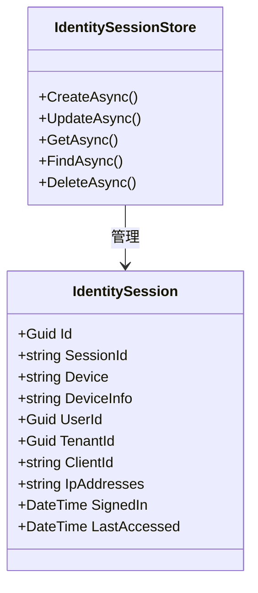
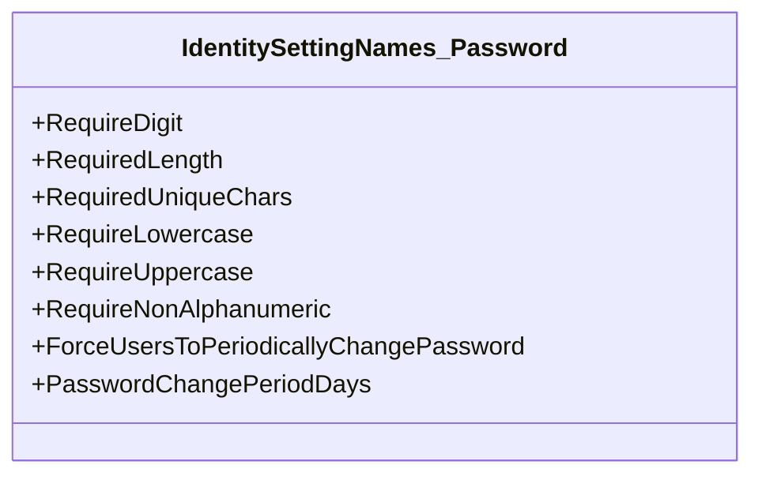
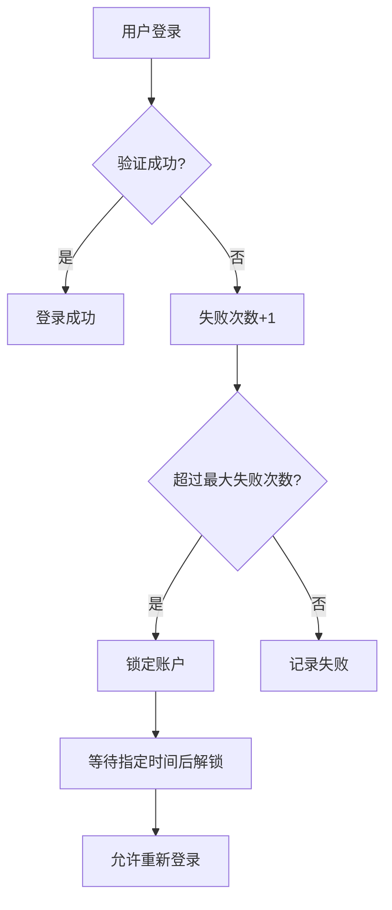
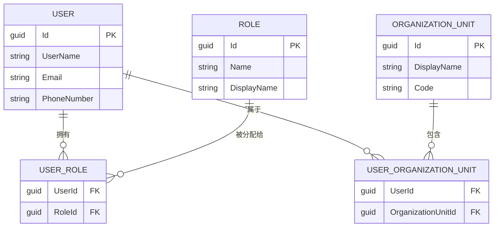
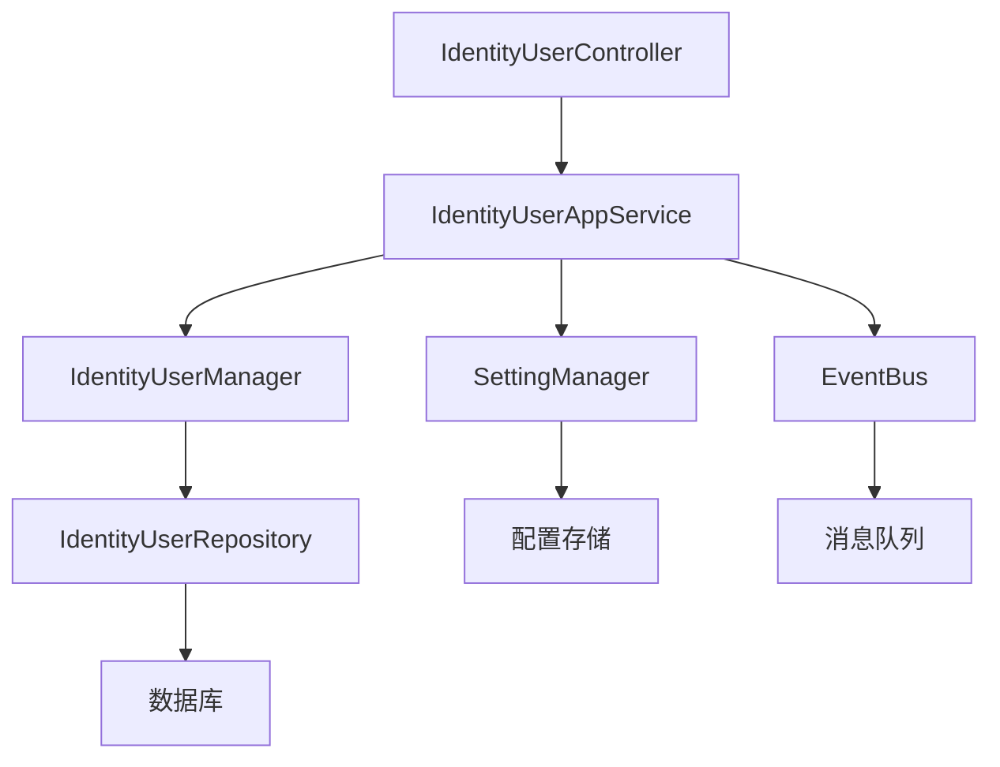

# 用户管理

<cite>
**本文档引用的文件**  
- [IdentityUserAppService.cs](file://aspnet-core/modules/identity/LINGYUN.Abp.Identity.Application/LINGYUN/Abp/Identity/IdentityUserAppService.cs)
- [IdentityUserController.cs](file://aspnet-core/modules/identity/LINGYUN.Abp.Identity.HttpApi/LINGYUN/Abp/Identity/IdentityUserController.cs)
- [IdentityPermissionDefinitionProvider.cs](file://aspnet-core/modules/identity/LINGYUN.Abp.Identity.Application.Contracts/LINGYUN/Abp/Identity/IdentityPermissionDefinitionProvider.cs)
- [IdentitySettingNames.cs](file://aspnet-core/modules/identity/LINGYUN.Abp.Identity.Domain.Shared/LINGYUN/Abp/Identity/Settings/IdentitySettingNames.cs)
- [SettingAppService.cs](file://aspnet-core/modules/settings/LINGYUN.Abp.SettingManagement.Application/LINGYUN/Abp/SettingManagement/SettingAppService.cs)
- [AbpUINavigationVueVbenAdminNavigationDefinitionProvider.cs](file://aspnet-core/modules/platform/LINGYUN.Abp.UI.Navigation.VueVbenAdmin/LINGYUN/Abp/UI/Navigation/VueVbenAdmin/AbpUINavigationVueVbenAdminNavigationDefinitionProvider.cs)
- [IdentityWebhookDefinitionProvider.cs](file://aspnet-core/modules/webhooks/LINGYUN.Abp.Webhooks.Identity/LINGYUN/Abp/Webhooks/Identity/IdentityWebhookDefinitionProvider.cs)
</cite>

## 目录

1. [简介](#简介)
2. [项目结构](#项目结构)
3. [核心组件](#核心组件)
4. [架构概览](#架构概览)
5. [详细组件分析](#详细组件分析)
6. [依赖分析](#依赖分析)
7. [性能考虑](#性能考虑)
8. [故障排除指南](#故障排除指南)
9. [结论](#结论)

## 简介

本项目是一个基于 ABP 框架的微服务架构系统，专注于用户管理功能。它提供了完整的用户生命周期管理，包括用户创建、编辑、删除、查询等操作。系统支持用户与角色、组织机构的关联关系管理，以及批量操作和导入导出功能。通过 RESTful API 接口，前端界面可以与后端服务进行交互，实现用户管理任务。系统还集成了密码策略、账户锁定机制和会话管理等安全特性。

## 项目结构

该项目采用模块化设计，主要分为以下几个部分：

- **aspnet-core**: 包含核心业务逻辑和服务
- **deploy**: 部署相关配置
- **gateways**: 网关服务
- **starter**: 启动脚本
- **frontend**: 前端项目（未在当前上下文中显示）

在 `aspnet-core` 目录下，`modules` 子目录包含了多个功能模块，其中与用户管理相关的模块包括 `identity`、`settings` 和 `webhooks`。



**图源**  
- [IdentityUserAppService.cs](file://aspnet-core/modules/identity/LINGYUN.Abp.Identity.Application/LINGYUN/Abp/Identity/IdentityUserAppService.cs)
- [IdentityUserController.cs](file://aspnet-core/modules/identity/LINGYUN.Abp.Identity.HttpApi/LINGYUN/Abp/Identity/IdentityUserController.cs)

## 核心组件

### 用户应用服务

`IdentityUserAppService` 是用户管理的核心服务类，负责处理所有用户相关的业务逻辑。该服务继承自 `IdentityAppServiceBase` 并实现了 `IIdentityUserAppService` 接口。

**节源**  
- [IdentityUserAppService.cs](file://aspnet-core/modules/identity/LINGYUN.Abp.Identity.Application/LINGYUN/Abp/Identity/IdentityUserAppService.cs#L14-L171)

### 用户控制器

`IdentityUserController` 是用户管理的 API 控制器，负责接收 HTTP 请求并调用相应的应用服务方法。

**节源**  
- [IdentityUserController.cs](file://aspnet-core/modules/identity/LINGYUN.Abp.Identity.HttpApi/LINGYUN/Abp/Identity/IdentityUserController.cs#L17-L120)

## 架构概览

整个用户管理系统采用分层架构设计，主要包括以下几个层次：

- **表现层**: 由 `IdentityUserController` 组成，负责处理 HTTP 请求和响应
- **应用层**: 由 `IdentityUserAppService` 组成，负责业务逻辑处理
- **领域层**: 包含用户、角色、组织机构等实体和仓储接口
- **基础设施层**: 包括数据库访问、缓存、消息队列等



**图源**  
- [IdentityUserAppService.cs](file://aspnet-core/modules/identity/LINGYUN.Abp.Identity.Application/LINGYUN/Abp/Identity/IdentityUserAppService.cs#L14-L171)
- [IdentityUserController.cs](file://aspnet-core/modules/identity/LINGYUN.Abp.Identity.HttpApi/LINGYUN/Abp/Identity/IdentityUserController.cs#L17-L120)

## 详细组件分析

### 用户属性定义

用户属性主要通过 `IdentityUser` 实体类定义，包含基本的用户信息如用户名、邮箱、电话号码等。此外，系统还支持自定义声明（Claims）来扩展用户属性。



**图源**  
- [IdentityUserAppService.cs](file://aspnet-core/modules/identity/LINGYUN.Abp.Identity.Application/LINGYUN/Abp/Identity/IdentityUserAppService.cs#L14-L171)

### 状态管理

系统通过 `IdentitySessionStore` 类管理用户会话状态。每个用户登录时会创建一个会话记录，包含会话ID、设备信息、IP地址等。



**图源**  
- [IdentitySessionStore.cs](file://aspnet-core/modules/identity/LINGYUN.Abp.Identity.Domain/LINGYUN/Abp/Identity/Session/IdentitySessionStore.cs#L40-L82)

### 密码策略

密码策略由 `IdentitySettingNames.Password` 类中的常量定义，包括密码长度、复杂度要求等。



**图源**  
- [IdentitySettingNames.cs](file://aspnet-core/modules/identity/LINGYUN.Abp.Identity.Domain.Shared/LINGYUN/Abp/Identity/Settings/IdentitySettingNames.cs#L2-L44)

### 账户锁定机制

账户锁定机制通过 `LockAsync` 和 `UnLockAsync` 方法实现。当用户连续多次登录失败时，系统会自动锁定账户。



**图源**  
- [IdentityUserAppService.cs](file://aspnet-core/modules/identity/LINGYUN.Abp.Identity.Application/LINGYUN/Abp/Identity/IdentityUserAppService.cs#L14-L171)

### 用户与角色、组织机构的关联关系

用户可以属于一个或多个组织机构，并拥有一个或多个角色。这种多对多的关系通过中间表实现。



**图源**  
- [IdentityUserAppService.cs](file://aspnet-core/modules/identity/LINGYUN.Abp.Identity.Application/LINGYUN/Abp/Identity/IdentityUserAppService.cs#L14-L171)

### 批量操作和导入导出功能

虽然当前代码片段中没有直接显示批量操作和导入导出功能的实现，但系统通过 `IdentityUserAppService` 提供了基础的 CRUD 操作，为实现这些高级功能奠定了基础。

### API接口文档

#### 请求参数

| 参数 | 类型 | 必填 | 描述 |
|------|------|------|------|
| id | Guid | 是 | 用户ID |
| input | DTO对象 | 是 | 操作数据 |

#### 响应格式

```json
{
    "success": true,
    "result": {},
    "error": null,
    "targetUrl": null,
    "unAuthorizedRequest": false,
    "__abp": true
}
```

#### 错误码说明

| 错误码 | 描述 |
|--------|------|
| Volo.Abp.Identity:ExternalUserPasswordChange | 外部用户不能更改密码 |
| UserClaimAlreadyExists | 用户声明已存在 |

**节源**  
- [IdentityUserController.cs](file://aspnet-core/modules/identity/LINGYUN.Abp.Identity.HttpApi/LINGYUN/Abp/Identity/IdentityUserController.cs#L17-L120)

## 依赖分析

### 组件依赖



**图源**  
- [IdentityUserAppService.cs](file://aspnet-core/modules/identity/LINGYUN.Abp.Identity.Application/LINGYUN/Abp/Identity/IdentityUserAppService.cs#L14-L171)
- [IdentityUserController.cs](file://aspnet-core/modules/identity/LINGYUN.Abp.Identity.HttpApi/LINGYUN/Abp/Identity/IdentityUserController.cs#L17-L120)

### 外部依赖

- **数据库**: 用于持久化用户数据
- **缓存**: 用于提高查询性能
- **消息队列**: 用于异步处理任务
- **外部认证服务**: 如微信、QQ等

**节源**  
- [IdentityUserAppService.cs](file://aspnet-core/modules/identity/LINGYUN.Abp.Identity.Application/LINGYUN/Abp/Identity/IdentityUserAppService.cs#L14-L171)

## 性能考虑

### 缓存策略

系统通过 `IdentitySessionStore` 和 `SettingManager` 使用缓存来减少数据库访问次数，提高响应速度。

### 异步处理

所有数据库操作都采用异步方式执行，避免阻塞主线程，提高系统吞吐量。

### 分页查询

对于大量数据的查询，建议使用分页机制，避免一次性加载过多数据导致内存溢出。

## 故障排除指南

### 常见问题

1. **用户无法登录**
   - 检查账户是否被锁定
   - 确认密码是否正确
   - 检查邮箱或手机号是否已验证

2. **权限不足**
   - 确认用户是否具有相应角色
   - 检查角色权限配置

3. **API调用失败**
   - 检查请求参数是否正确
   - 确认认证令牌是否有效

**节源**  
- [IdentityUserAppService.cs](file://aspnet-core/modules/identity/LINGYUN.Abp.Identity.Application/LINGYUN/Abp/Identity/IdentityUserAppService.cs#L14-L171)
- [IdentityUserController.cs](file://aspnet-core/modules/identity/LINGYUN.Abp.Identity.HttpApi/LINGYUN/Abp/Identity/IdentityUserController.cs#L17-L120)

## 结论

本用户管理系统提供了完整的用户管理功能，包括用户创建、编辑、删除、查询等操作。系统支持用户与角色、组织机构的关联关系管理，以及批量操作和导入导出功能。通过 RESTful API 接口，前端界面可以与后端服务进行交互，实现用户管理任务。系统还集成了密码策略、账户锁定机制和会话管理等安全特性。整体架构清晰，易于扩展和维护。