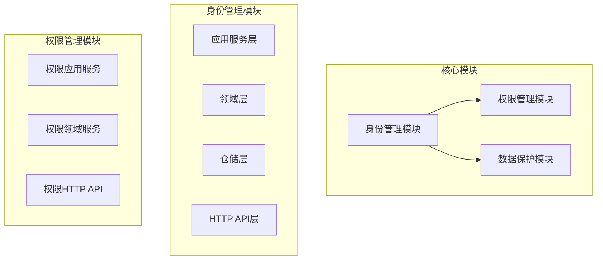
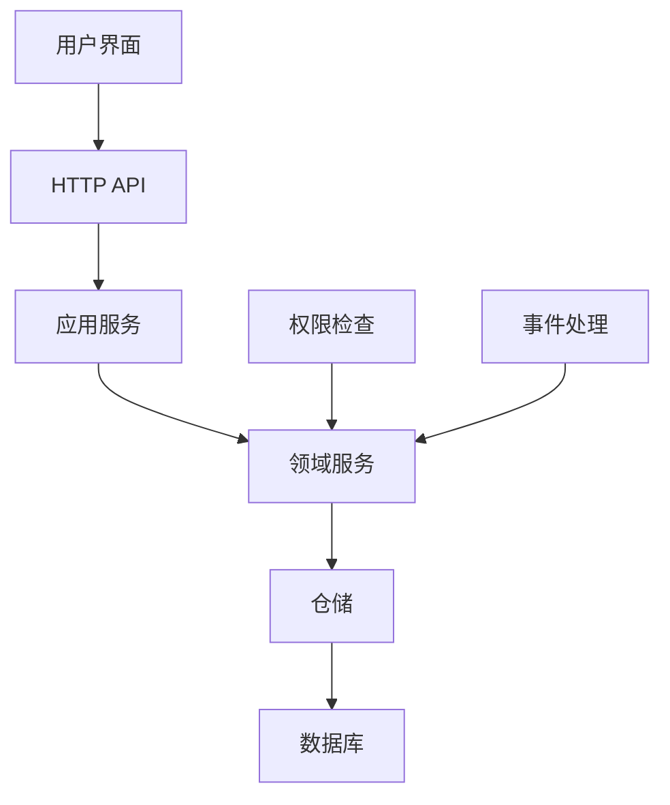
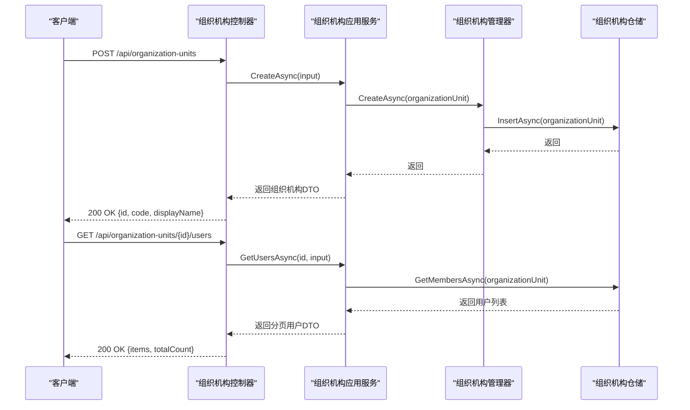
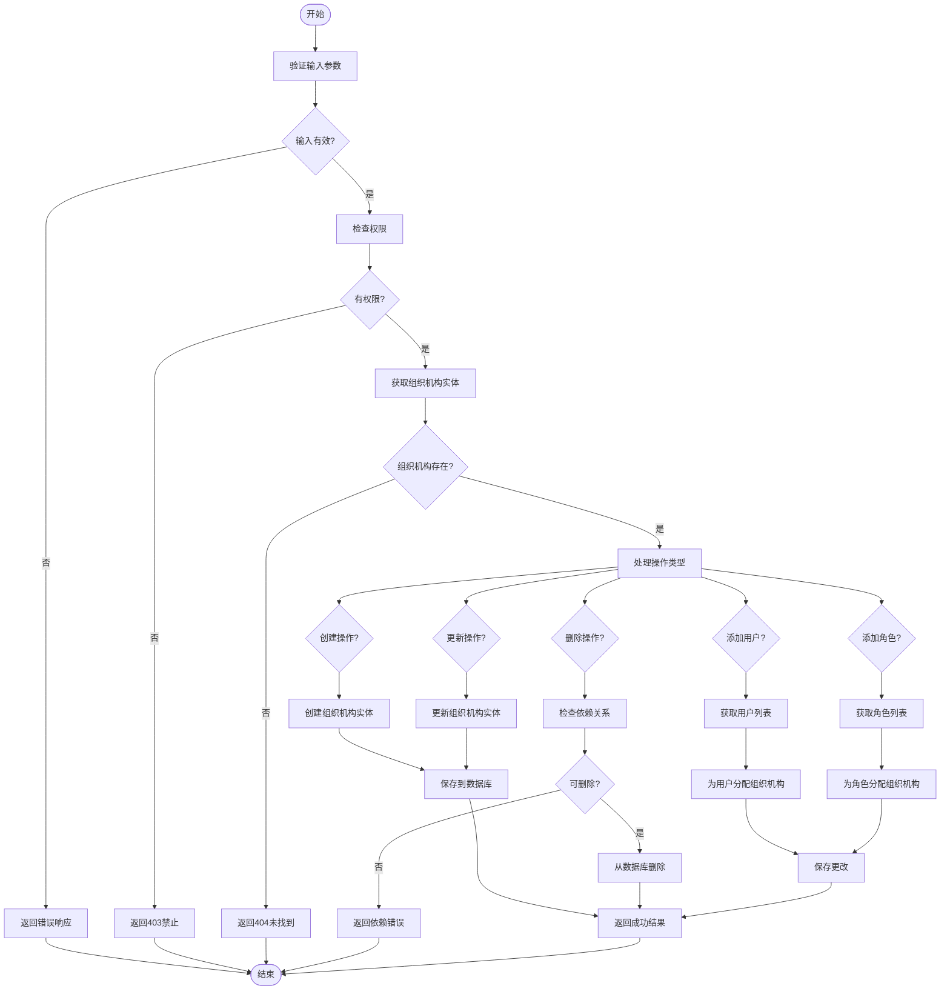
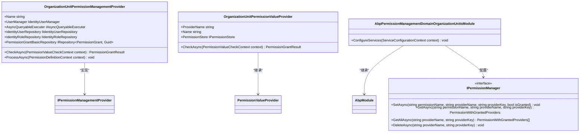
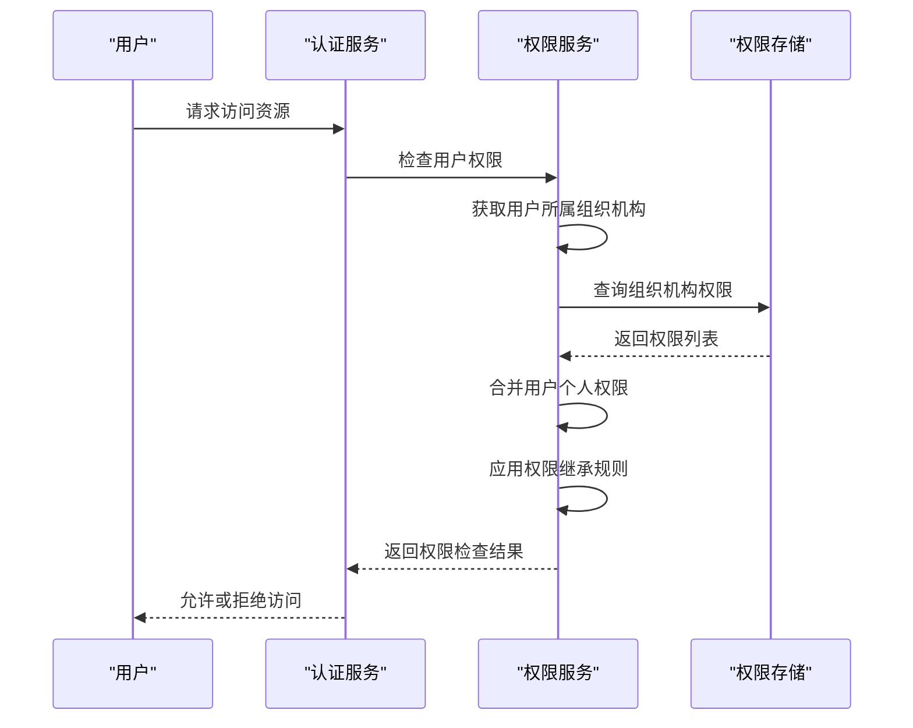
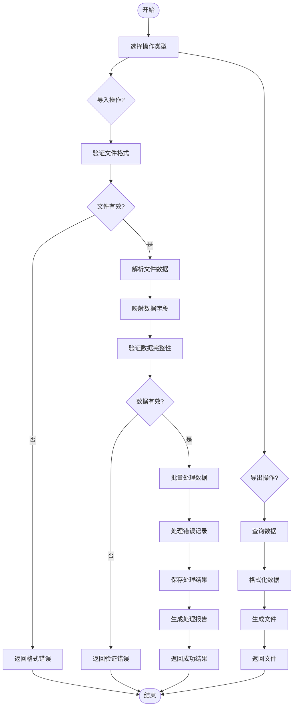
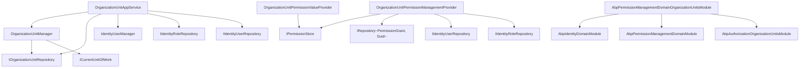

# 组织机构与角色关联

<cite>
**本文档引用的文件**   
- [OrganizationUnitAppService.cs](file://aspnet-core\modules\identity\LINGYUN.Abp.Identity.Application\LINGYUN\Abp\Identity\OrganizationUnitAppService.cs)
- [IdentityRoleAppService.cs](file://aspnet-core\modules\identity\LINGYUN.Abp.Identity.Application\LINGYUN\Abp\Identity\IdentityRoleAppService.cs)
- [EfCoreOrganizationUnitRepository.cs](file://aspnet-core\modules\identity\LINGYUN.Abp.Identity.EntityFrameworkCore\LINGYUN\Abp\Identity\EntityFrameworkCore\EfCoreOrganizationUnitRepository.cs)
- [OrganizationUnitPermissionManagementProvider.cs](file://aspnet-core\modules\permissions-management\LINGYUN.Abp.PermissionManagement.Domain.OrganizationUnits\LINGYUN\Abp\PermissionManagement\OrganizationUnits\OrganizationUnitPermissionManagementProvider.cs)
- [OrganizationUnitPermissionValueProvider.cs](file://aspnet-core\framework\authorization\LINGYUN.Abp.Authorization.OrganizationUnits\LINGYUN\Abp\Authorization\Permissions\OrganizationUnitPermissionValueProvider.cs)
- [OrganizationUnitDto.cs](file://aspnet-core\modules\identity\LINGYUN.Abp.Identity.Application.Contracts\LINGYUN\Abp\Identity\Dto\OrganizationUnitDto.cs)
- [OrganizationUnitCreateDto.cs](file://aspnet-core\modules\identity\LINGYUN.Abp.Identity.Application.Contracts\LINGYUN\Abp\Identity\Dto\OrganizationUnitCreateDto.cs)
- [OrganizationUnitUpdateDto.cs](file://aspnet-core\modules\identity\LINGYUN.Abp.Identity.Application.Contracts\LINGYUN\Abp\Identity\Dto\OrganizationUnitUpdateDto.cs)
- [OrganizationUnitAddUserDto.cs](file://aspnet-core\modules\identity\LINGYUN.Abp.Identity.Application.Contracts\LINGYUN\Abp\Identity\Dto\OrganizationUnitAddUserDto.cs)
- [OrganizationUnitAddRoleDto.cs](file://aspnet-core\modules\identity\LINGYUN.Abp.Identity.Application.Contracts\LINGYUN\Abp\Identity\Dto\OrganizationUnitAddRoleDto.cs)
</cite>

## 目录
1. [简介](#简介)
2. [项目结构](#项目结构)
3. [核心组件](#核心组件)
4. [架构概述](#架构概述)
5. [详细组件分析](#详细组件分析)
6. [依赖关系分析](#依赖关系分析)
7. [性能考虑](#性能考虑)
8. [故障排除指南](#故障排除指南)
9. [结论](#结论)

## 简介
本文档深入探讨了ABP Next Admin系统中的组织机构与角色关联功能。该系统提供了一套完整的用户与组织机构（部门）层级关系管理机制，支持复杂的用户-角色权限模型和批量用户管理功能。文档将详细解释组织机构树的构建、用户分配到特定部门的操作实现、角色继承机制以及批量导入导出的实现细节。

## 项目结构
该项目是一个基于ABP框架的微服务架构应用，主要包含身份认证、权限管理、组织机构管理等模块。组织机构与角色关联功能主要分布在`aspnet-core/modules/identity`和`aspnet-core/modules/permissions-management`目录下。

**图表来源**
- [OrganizationUnitAppService.cs](file://aspnet-core\modules\identity\LINGYUN.Abp.Identity.Application\LINGYUN\Abp\Identity\OrganizationUnitAppService.cs)
- [OrganizationUnitPermissionManagementProvider.cs](file://aspnet-core\modules\permissions-management\LINGYUN.Abp.PermissionManagement.Domain.OrganizationUnits\LINGYUN\Abp\PermissionManagement\OrganizationUnits\OrganizationUnitPermissionManagementProvider.cs)

**章节来源**
- [OrganizationUnitAppService.cs](file://aspnet-core\modules\identity\LINGYUN.Abp.Identity.Application\LINGYUN\Abp\Identity\OrganizationUnitAppService.cs)
- [IdentityRoleAppService.cs](file://aspnet-core\modules\identity\LINGYUN.Abp.Identity.Application\LINGYUN\Abp\Identity\IdentityRoleAppService.cs)

## 核心组件
系统的核心组件包括组织机构应用服务、角色应用服务、组织机构仓储和权限管理服务。这些组件协同工作，实现了组织机构与角色的关联管理功能。

**章节来源**
- [OrganizationUnitAppService.cs](file://aspnet-core\modules\identity\LINGYUN.Abp.Identity.Application\LINGYUN\Abp\Identity\OrganizationUnitAppService.cs)
- [IdentityRoleAppService.cs](file://aspnet-core\modules\identity\LINGYUN.Abp.Identity.Application\LINGYUN\Abp\Identity\IdentityRoleAppService.cs)

## 架构概述
系统采用分层架构设计，从上到下分为应用服务层、领域服务层和数据访问层。组织机构与角色关联功能通过清晰的职责划分，确保了系统的可维护性和扩展性。

**图表来源**
- [OrganizationUnitAppService.cs](file://aspnet-core\modules\identity\LINGYUN.Abp.Identity.Application\LINGYUN\Abp\Identity\OrganizationUnitAppService.cs)
- [EfCoreOrganizationUnitRepository.cs](file://aspnet-core\modules\identity\LINGYUN.Abp.Identity.EntityFrameworkCore\LINGYUN\Abp\Identity\EntityFrameworkCore\EfCoreOrganizationUnitRepository.cs)

## 详细组件分析

### 组织机构应用服务分析
组织机构应用服务是组织机构管理的核心，提供了创建、删除、更新组织机构以及管理用户和角色分配的功能。

#### 对于面向对象的组件：

```mermaid
classDiagram
class OrganizationUnitAppService {
+OrganizationUnitManager OrganizationUnitManager
+IOrganizationUnitRepository OrganizationUnitRepository
+IdentityUserManager UserManager
+IIdentityRoleRepository RoleRepository
+IIdentityUserRepository UserRepository
+CreateAsync(OrganizationUnitCreateDto input) OrganizationUnitDto
+DeleteAsync(Guid id) void
+GetRootAsync() ListResultDto~OrganizationUnitDto~
+FindChildrenAsync(OrganizationUnitGetChildrenDto input) ListResultDto~OrganizationUnitDto~
+GetAsync(Guid id) OrganizationUnitDto
+GetLastChildOrNullAsync(Guid? parentId) OrganizationUnitDto
+GetAllListAsync() ListResultDto~OrganizationUnitDto~
+GetListAsync(OrganizationUnitGetByPagedDto input) PagedResultDto~OrganizationUnitDto~
+GetRoleNamesAsync(Guid id) ListResultDto~string~
+GetUnaddedRolesAsync(Guid id, OrganizationUnitGetUnaddedRoleByPagedDto input) PagedResultDto~IdentityRoleDto~
+GetRolesAsync(Guid id, PagedAndSortedResultRequestDto input) PagedResultDto~IdentityRoleDto~
+GetUnaddedUsersAsync(Guid id, OrganizationUnitGetUnaddedUserByPagedDto input) PagedResultDto~IdentityUserDto~
+GetUsersAsync(Guid id, GetIdentityUsersInput input) PagedResultDto~IdentityUserDto~
+MoveAsync(Guid id, OrganizationUnitMoveDto input) void
+UpdateAsync(Guid id, OrganizationUnitUpdateDto input) OrganizationUnitDto
+AddUsersAsync(Guid id, OrganizationUnitAddUserDto input) void
+AddRolesAsync(Guid id, OrganizationUnitAddRoleDto input) void
}
class IOrganizationUnitAppService {
<<interface>>
+GetAllListAsync() ListResultDto~OrganizationUnitDto~
+GetLastChildOrNullAsync(Guid? parentId) OrganizationUnitDto
+MoveAsync(Guid id, OrganizationUnitMoveDto input) void
+GetRootAsync() ListResultDto~OrganizationUnitDto~
+FindChildrenAsync(OrganizationUnitGetChildrenDto input) ListResultDto~OrganizationUnitDto~
+GetRoleNamesAsync(Guid id) ListResultDto~string~
+GetUnaddedRolesAsync(Guid id, OrganizationUnitGetUnaddedRoleByPagedDto input) PagedResultDto~IdentityRoleDto~
+GetRolesAsync(Guid id, PagedAndSortedResultRequestDto input) PagedResultDto~IdentityRoleDto~
+AddRolesAsync(Guid id, OrganizationUnitAddRoleDto input) void
+GetUnaddedUsersAsync(Guid id, OrganizationUnitGetUnaddedUserByPagedDto input) PagedResultDto~IdentityUserDto~
+GetUsersAsync(Guid id, GetIdentityUsersInput input) PagedResultDto~IdentityUserDto~
+AddUsersAsync(Guid id, OrganizationUnitAddUserDto input) void
}
class OrganizationUnitManager {
+CreateAsync(OrganizationUnit organizationUnit) void
+DeleteAsync(Guid id) void
+FindChildrenAsync(Guid? parentId, bool recursive) OrganizationUnit[]
+GetLastChildOrNullAsync(Guid? parentId) OrganizationUnit
+UpdateAsync(OrganizationUnit organizationUnit) void
+MoveAsync(Guid id, Guid? parentId) void
+AddRoleToOrganizationUnitAsync(IdentityRole role, OrganizationUnit organizationUnit) void
+RemoveRoleFromOrganizationUnitAsync(IdentityRole role, OrganizationUnit organizationUnit) void
}
class IOrganizationUnitRepository {
<<interface>>
+GetCountAsync(ISpecification~OrganizationUnit~ specification) int
+GetListAsync(ISpecification~OrganizationUnit~ specification, string sorting, int maxResultCount, int skipCount, bool includeDetails) OrganizationUnit[]
}
OrganizationUnitAppService --> IOrganizationUnitAppService : "实现"
OrganizationUnitAppService --> OrganizationUnitManager : "使用"
OrganizationUnitAppService --> IOrganizationUnitRepository : "使用"
OrganizationUnitAppService --> IdentityUserManager : "使用"
OrganizationUnitAppService --> IIdentityRoleRepository : "使用"
OrganizationUnitAppService --> IIdentityUserRepository : "使用"
```

**图表来源**
- [OrganizationUnitAppService.cs](file://aspnet-core\modules\identity\LINGYUN.Abp.Identity.Application\LINGYUN\Abp\Identity\OrganizationUnitAppService.cs)
- [OrganizationUnitDto.cs](file://aspnet-core\modules\identity\LINGYUN.Abp.Identity.Application.Contracts\LINGYUN\Abp\Identity\Dto\OrganizationUnitDto.cs)

#### 对于API/服务组件：

**图表来源**
- [OrganizationUnitAppService.cs](file://aspnet-core\modules\identity\LINGYUN.Abp.Identity.Application\LINGYUN\Abp\Identity\OrganizationUnitAppService.cs)
- [OrganizationUnitController.cs](file://aspnet-core\modules\identity\LINGYUN.Abp.Identity.HttpApi\LINGYUN\Abp\Identity\OrganizationUnitController.cs)

#### 对于复杂逻辑组件：

**图表来源**
- [OrganizationUnitAppService.cs](file://aspnet-core\modules\identity\LINGYUN.Abp.Identity.Application\LINGYUN\Abp\Identity\OrganizationUnitAppService.cs)
- [IdentityRoleAppService.cs](file://aspnet-core\modules\identity\LINGYUN.Abp.Identity.Application\LINGYUN\Abp\Identity\IdentityRoleAppService.cs)

**章节来源**
- [OrganizationUnitAppService.cs](file://aspnet-core\modules\identity\LINGYUN.Abp.Identity.Application\LINGYUN\Abp\Identity\OrganizationUnitAppService.cs)
- [IdentityRoleAppService.cs](file://aspnet-core\modules\identity\LINGYUN.Abp.Identity.Application\LINGYUN\Abp\Identity\IdentityRoleAppService.cs)

### 用户-角色权限模型分析
系统实现了基于组织机构的用户-角色权限模型，支持灵活的权限分配和继承机制。

#### 权限管理类图

**图表来源**
- [OrganizationUnitPermissionManagementProvider.cs](file://aspnet-core\modules\permissions-management\LINGYUN.Abp.PermissionManagement.Domain.OrganizationUnits\LINGYUN\Abp\PermissionManagement\OrganizationUnits\OrganizationUnitPermissionManagementProvider.cs)
- [OrganizationUnitPermissionValueProvider.cs](file://aspnet-core\framework\authorization\LINGYUN.Abp.Authorization.OrganizationUnits\LINGYUN\Abp\Authorization\Permissions\OrganizationUnitPermissionValueProvider.cs)

#### 角色继承序列图

**图表来源**
- [OrganizationUnitPermissionManagementProvider.cs](file://aspnet-core\modules\permissions-management\LINGYUN.Abp.PermissionManagement.Domain.OrganizationUnits\LINGYUN\Abp\PermissionManagement\OrganizationUnits\OrganizationUnitPermissionManagementProvider.cs)
- [OrganizationUnitPermissionValueProvider.cs](file://aspnet-core\framework\authorization\LINGYUN.Abp.Authorization.OrganizationUnits\LINGYUN\Abp\Authorization\Permissions\OrganizationUnitPermissionValueProvider.cs)

**章节来源**
- [OrganizationUnitPermissionManagementProvider.cs](file://aspnet-core\modules\permissions-management\LINGYUN.Abp.PermissionManagement.Domain.OrganizationUnits\LINGYUN\Abp\PermissionManagement\OrganizationUnits\OrganizationUnitPermissionManagementProvider.cs)
- [OrganizationUnitPermissionValueProvider.cs](file://aspnet-core\framework\authorization\LINGYUN.Abp.Authorization.OrganizationUnits\LINGYUN\Abp\Authorization\Permissions\OrganizationUnitPermissionValueProvider.cs)

### 批量用户管理功能分析
系统提供了完善的批量用户管理功能，支持用户和角色的批量导入导出。

#### 批量操作流程图

**图表来源**
- [OrganizationUnitAppService.cs](file://aspnet-core\modules\identity\LINGYUN.Abp.Identity.Application\LINGYUN\Abp\Identity\OrganizationUnitAppService.cs)
- [OrganizationUnitAddUserDto.cs](file://aspnet-core\modules\identity\LINGYUN.Abp.Identity.Application.Contracts\LINGYUN\Abp\Identity\Dto\OrganizationUnitAddUserDto.cs)

**章节来源**
- [OrganizationUnitAppService.cs](file://aspnet-core\modules\identity\LINGYUN.Abp.Identity.Application\LINGYUN\Abp\Identity\OrganizationUnitAppService.cs)
- [OrganizationUnitAddUserDto.cs](file://aspnet-core\modules\identity\LINGYUN.Abp.Identity.Application.Contracts\LINGYUN\Abp\Identity\Dto\OrganizationUnitAddUserDto.cs)

## 依赖关系分析
系统各组件之间存在明确的依赖关系，确保了功能的模块化和可测试性。

**图表来源**
- [OrganizationUnitAppService.cs](file://aspnet-core\modules\identity\LINGYUN.Abp.Identity.Application\LINGYUN\Abp\Identity\OrganizationUnitAppService.cs)
- [OrganizationUnitPermissionManagementProvider.cs](file://aspnet-core\modules\permissions-management\LINGYUN.Abp.PermissionManagement.Domain.OrganizationUnits\LINGYUN\Abp\PermissionManagement\OrganizationUnits\OrganizationUnitPermissionManagementProvider.cs)

**章节来源**
- [OrganizationUnitAppService.cs](file://aspnet-core\modules\identity\LINGYUN.Abp.Identity.Application\LINGYUN\Abp\Identity\OrganizationUnitAppService.cs)
- [OrganizationUnitPermissionManagementProvider.cs](file://aspnet-core\modules\permissions-management\LINGYUN.Abp.PermissionManagement.Domain.OrganizationUnits\LINGYUN\Abp\PermissionManagement\OrganizationUnits\OrganizationUnitPermissionManagementProvider.cs)

## 性能考虑
在组织机构与角色关联功能的设计中，考虑了以下性能优化措施：

1. **缓存机制**：对频繁访问的组织机构树结构进行缓存，减少数据库查询次数。
2. **批量操作**：支持批量添加用户和角色到组织机构，减少数据库事务开销。
3. **分页查询**：对用户和角色列表采用分页查询，避免一次性加载大量数据。
4. **异步处理**：关键操作采用异步方式执行，提高系统响应速度。
5. **索引优化**：在数据库中为组织机构代码、父级ID等常用查询字段建立索引。

## 故障排除指南
在使用组织机构与角色关联功能时，可能会遇到以下常见问题及解决方案：

1. **无法创建组织机构**：检查当前用户是否具有`OrganizationUnits.Create`权限。
2. **用户无法分配到组织机构**：确认用户ID和组织机构ID的有效性，检查是否存在循环引用。
3. **权限继承不生效**：验证组织机构权限值提供者是否正确注册，检查权限存储中的数据。
4. **批量导入失败**：检查文件格式是否符合要求，验证数据字段映射是否正确。
5. **性能问题**：对于大型组织机构树，考虑启用缓存或优化数据库查询。

**章节来源**
- [OrganizationUnitAppService.cs](file://aspnet-core\modules\identity\LINGYUN.Abp.Identity.Application\LINGYUN\Abp\Identity\OrganizationUnitAppService.cs)
- [OrganizationUnitPermissionManagementProvider.cs](file://aspnet-core\modules\permissions-management\LINGYUN.Abp.PermissionManagement.Domain.OrganizationUnits\LINGYUN\Abp\PermissionManagement\OrganizationUnits\OrganizationUnitPermissionManagementProvider.cs)

## 结论
ABP Next Admin系统的组织机构与角色关联功能提供了一套完整且灵活的管理机制。通过清晰的分层架构和模块化设计，系统实现了组织机构树的构建、用户分配、角色继承和批量管理等核心功能。权限模型支持基于组织机构的细粒度控制，确保了系统的安全性和可扩展性。未来可以进一步优化性能，增加更多自动化功能，提升用户体验。