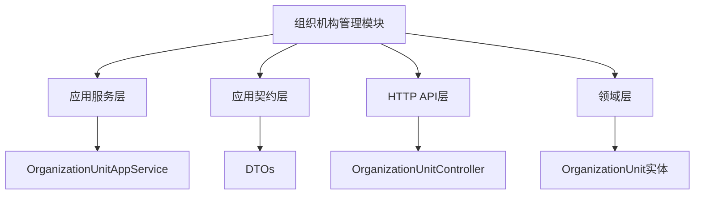
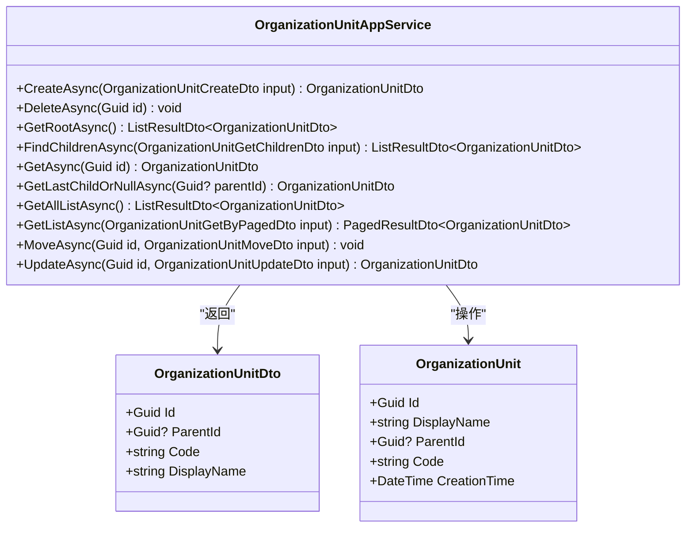
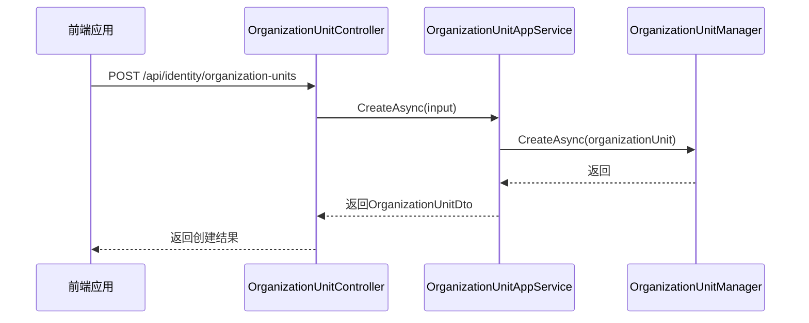
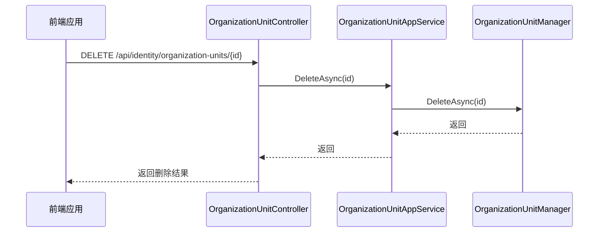
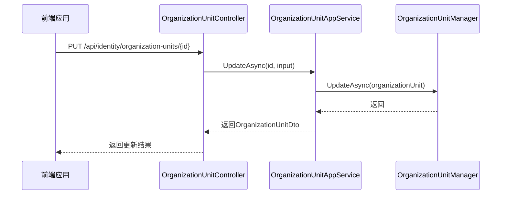
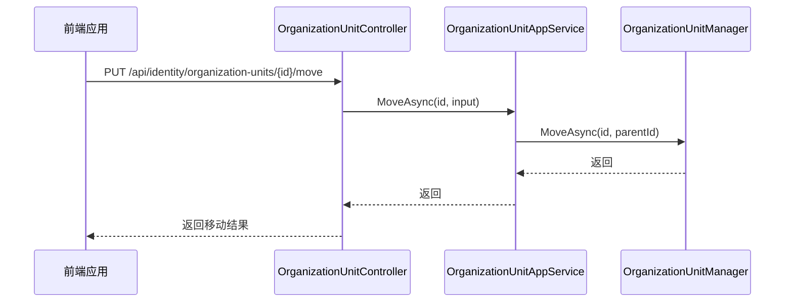
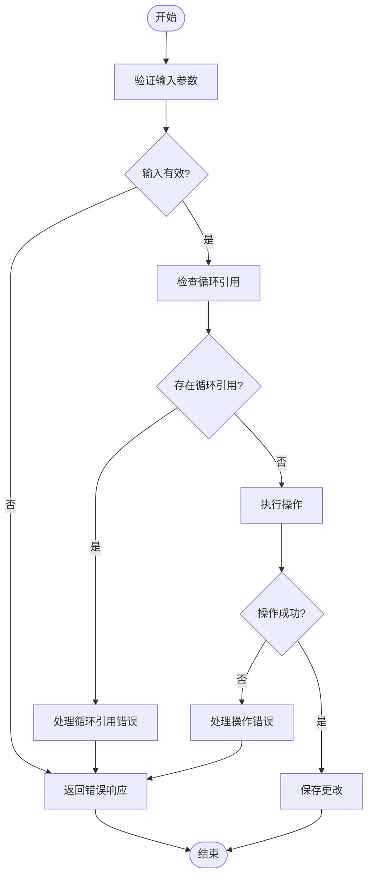
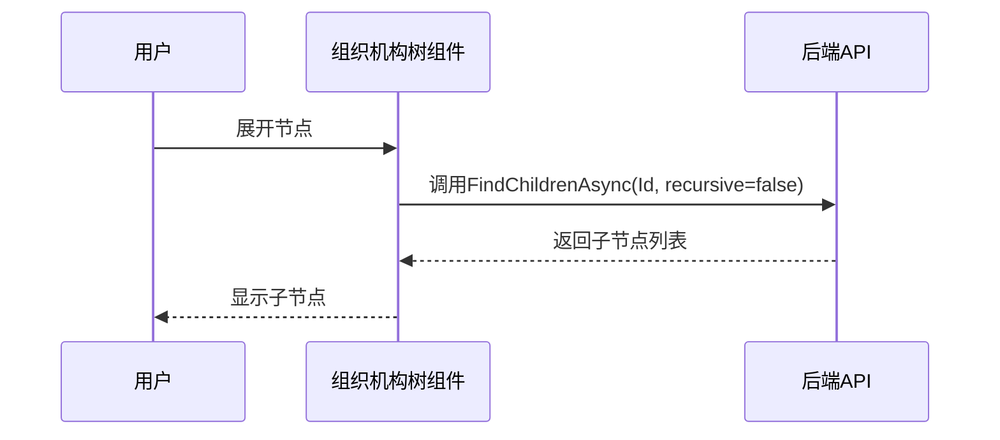
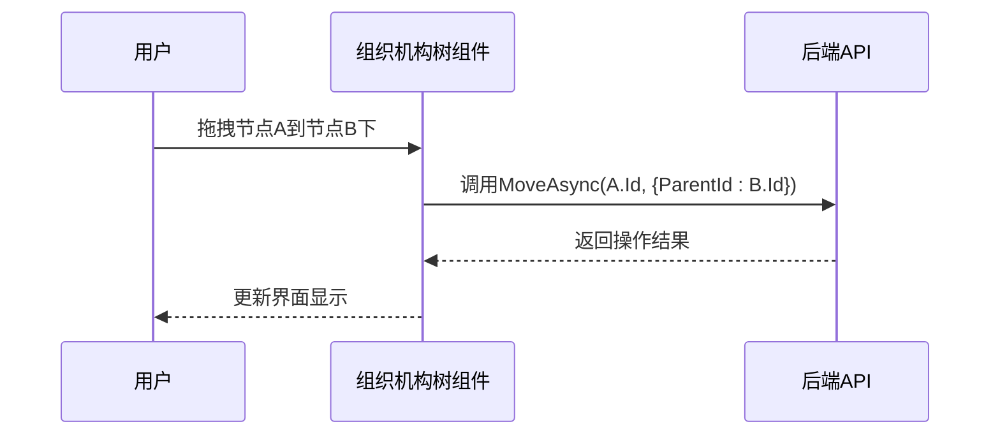
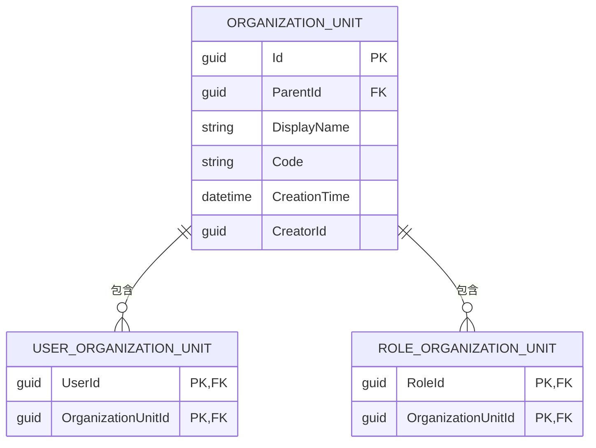

# 组织机构管理

<cite>
**本文档中引用的文件**  
- [OrganizationUnitAppService.cs](file://aspnet-core/modules/identity/LINGYUN.Abp.Identity.Application/LINGYUN/Abp/Identity/OrganizationUnitAppService.cs)
- [OrganizationUnitDto.cs](file://aspnet-core/modules/identity/LINGYUN.Abp.Identity.Application.Contracts/LINGYUN/Abp/Identity/Dto/OrganizationUnitDto.cs)
- [OrganizationUnitCreateDto.cs](file://aspnet-core/modules/identity/LINGYUN.Abp.Identity.Application.Contracts/LINGYUN/Abp/Identity/Dto/OrganizationUnitCreateDto.cs)
- [OrganizationUnitUpdateDto.cs](file://aspnet-core/modules/identity/LINGYUN.Abp.Identity.Application.Contracts/LINGYUN/Abp/Identity/Dto/OrganizationUnitUpdateDto.cs)
- [OrganizationUnitMoveDto.cs](file://aspnet-core/modules/identity/LINGYUN.Abp.Identity.Application.Contracts/LINGYUN/Abp/Identity/Dto/OrganizationUnitMoveDto.cs)
- [OrganizationUnitController.cs](file://aspnet-core/modules/identity/LINGYUN.Abp.Identity.HttpApi/LINGYUN/Abp/Identity/OrganizationUnitController.cs)
- [OrganizationUnitEntityRuleAppService.cs](file://aspnet-core/modules/data-protection/LINGYUN.Abp.DataProtectionManagement.Application/LINGYUN/Abp/DataProtectionManagement/OrganizationUnitEntityRuleAppService.cs)
</cite>

## 目录
1. [项目结构](#项目结构)
2. [核心组件](#核心组件)
3. [组织机构树构建与维护](#组织机构树构建与维护)
4. [增删改查操作API](#增删改查操作api)
5. [边界情况处理](#边界情况处理)
6. [前端组织机构树组件](#前端组织机构树组件)
7. [权限控制](#权限控制)
8. [数据持久化存储方案](#数据持久化存储方案)
9. [核心方法调用示例](#核心方法调用示例)

## 项目结构



**图表来源**
- [OrganizationUnitAppService.cs](file://aspnet-core/modules/identity/LINGYUN.Abp.Identity.Application/LINGYUN/Abp/Identity/OrganizationUnitAppService.cs)
- [OrganizationUnitDto.cs](file://aspnet-core/modules/identity/LINGYUN.Abp.Identity.Application.Contracts/LINGYUN/Abp/Identity/Dto/OrganizationUnitDto.cs)
- [OrganizationUnitController.cs](file://aspnet-core/modules/identity/LINGYUN.Abp.Identity.HttpApi/LINGYUN/Abp/Identity/OrganizationUnitController.cs)

**章节来源**
- [OrganizationUnitAppService.cs](file://aspnet-core/modules/identity/LINGYUN.Abp.Identity.Application/LINGYUN/Abp/Identity/OrganizationUnitAppService.cs)
- [OrganizationUnitDto.cs](file://aspnet-core/modules/identity/LINGYUN.Abp.Identity.Application.Contracts/LINGYUN/Abp/Identity/Dto/OrganizationUnitDto.cs)

## 核心组件

组织机构管理功能的核心组件包括应用服务、数据传输对象（DTO）、控制器和实体类。这些组件协同工作，实现组织机构的完整生命周期管理。

**章节来源**
- [OrganizationUnitAppService.cs](file://aspnet-core/modules/identity/LINGYUN.Abp.Identity.Application/LINGYUN/Abp/Identity/OrganizationUnitAppService.cs)
- [OrganizationUnitDto.cs](file://aspnet-core/modules/identity/LINGYUN.Abp.Identity.Application.Contracts/LINGYUN/Abp/Identity/Dto/OrganizationUnitDto.cs)

## 组织机构树构建与维护

组织机构树采用父子节点关系模型，通过ParentId属性建立层级结构。系统提供了多种方法来查询和维护树形结构：

- `GetRootAsync`：获取根节点
- `FindChildrenAsync`：查找子节点（支持递归）
- `GetAllListAsync`：获取所有组织机构列表
- `GetLastChildOrNullAsync`：获取最后一个子节点

树形结构的维护通过移动节点（MoveAsync）和更新节点（UpdateAsync）操作实现，确保组织架构的灵活性和可维护性。



**图表来源**
- [OrganizationUnitAppService.cs](file://aspnet-core/modules/identity/LINGYUN.Abp.Identity.Application/LINGYUN/Abp/Identity/OrganizationUnitAppService.cs)
- [OrganizationUnitDto.cs](file://aspnet-core/modules/identity/LINGYUN.Abp.Identity.Application.Contracts/LINGYUN/Abp/Identity/Dto/OrganizationUnitDto.cs)

**章节来源**
- [OrganizationUnitAppService.cs](file://aspnet-core/modules/identity/LINGYUN.Abp.Identity.Application/LINGYUN/Abp/Identity/OrganizationUnitAppService.cs)

## 增删改查操作API

组织机构管理提供完整的CRUD操作API，通过HTTP RESTful接口暴露给前端使用：

### 创建操作


### 删除操作


### 更新操作


### 移动操作


**图表来源**
- [OrganizationUnitAppService.cs](file://aspnet-core/modules/identity/LINGYUN.Abp.Identity.Application/LINGYUN/Abp/Identity/OrganizationUnitAppService.cs)
- [OrganizationUnitController.cs](file://aspnet-core/modules/identity/LINGYUN.Abp.Identity.HttpApi/LINGYUN/Abp/Identity/OrganizationUnitController.cs)

**章节来源**
- [OrganizationUnitAppService.cs](file://aspnet-core/modules/identity/LINGYUN.Abp.Identity.Application/LINGYUN/Abp/Identity/OrganizationUnitAppService.cs)

## 边界情况处理

系统在设计时充分考虑了各种边界情况，特别是循环引用等复杂场景的处理：

### 循环引用检测
当尝试将一个组织机构移动到其自身或其子机构下时，系统会自动检测并阻止这种操作，防止形成循环引用。这通过组织机构管理器（OrganizationUnitManager）内部的逻辑实现。

### 数据完整性验证
- **创建时验证**：确保DisplayName不为空且长度符合要求
- **移动时验证**：确保目标父节点存在且不会形成循环引用
- **删除时验证**：先检查是否存在子节点，如有则需要先处理子节点

### 异常处理
系统定义了专门的业务异常来处理各种错误情况：
- `BusinessException`用于处理业务规则违反的情况
- 特定的错误代码如`OrganizationUnitEntityRule.DuplicateEntityRule`用于标识重复规则



**图表来源**
- [OrganizationUnitAppService.cs](file://aspnet-core/modules/identity/LINGYUN.Abp.Identity.Application/LINGYUN/Abp/Identity/OrganizationUnitAppService.cs)
- [OrganizationUnitEntityRuleAppService.cs](file://aspnet-core/modules/data-protection/LINGYUN.Abp.DataProtectionManagement.Application/LINGYUN/Abp/DataProtectionManagement/OrganizationUnitEntityRuleAppService.cs)

**章节来源**
- [OrganizationUnitAppService.cs](file://aspnet-core/modules/identity/LINGYUN.Abp.Identity.Application/LINGYUN/Abp/Identity/OrganizationUnitAppService.cs)

## 前端组织机构树组件

前端组织机构树组件实现了以下关键功能：

### 懒加载策略
组件采用懒加载策略，只在用户展开某个节点时才从服务器获取其子节点数据，提高初始加载性能。



### 节点拖拽排序
支持节点间的拖拽排序功能，允许用户直观地调整组织架构。



**图表来源**
- [OrganizationUnitAppService.cs](file://aspnet-core/modules/identity/LINGYUN.Abp.Identity.Application/LINGYUN/Abp/Identity/OrganizationUnitAppService.cs)
- [OrganizationUnitController.cs](file://aspnet-core/modules/identity/LINGYUN.Abp.Identity.HttpApi/LINGYUN/Abp/Identity/OrganizationUnitController.cs)

**章节来源**
- [OrganizationUnitAppService.cs](file://aspnet-core/modules/identity/LINGYUN.Abp.Identity.Application/LINGYUN/Abp/Identity/OrganizationUnitAppService.cs)

## 权限控制

系统实现了细粒度的权限控制机制，确保组织机构操作的安全性：

### 权限定义
- `OrganizationUnits.Default`：基本访问权限
- `OrganizationUnits.Create`：创建权限
- `OrganizationUnits.Update`：更新权限
- `OrganizationUnits.Delete`：删除权限
- `OrganizationUnits.ManageUsers`：管理用户权限
- `OrganizationUnits.ManageRoles`：管理角色权限

### 权限应用
通过`[Authorize]`特性在应用服务方法上声明所需权限：

```csharp
[Authorize(IdentityPermissions.OrganizationUnits.Create)]
public async virtual Task<OrganizationUnitDto> CreateAsync(OrganizationUnitCreateDto input)

[Authorize(IdentityPermissions.OrganizationUnits.Delete)]
public async virtual Task DeleteAsync(Guid id)

[Authorize(IdentityPermissions.OrganizationUnits.Update)]
public async virtual Task<OrganizationUnitDto> UpdateAsync(Guid id, OrganizationUnitUpdateDto input)
```

### 声明类型
系统定义了组织机构相关的声明类型，用于身份验证和授权：

```csharp
public static class AbpOrganizationUnitClaimTypes
{
    public static string OrganizationUnit { get; set; } = "ou_code";
}
```

**图表来源**
- [OrganizationUnitAppService.cs](file://aspnet-core/modules/identity/LINGYUN.Abp.Identity.Application/LINGYUN/Abp/Identity/OrganizationUnitAppService.cs)
- [AbpOrganizationUnitClaimTypes.cs](file://aspnet-core/framework/authorization/LINGYUN.Abp.Authorization.OrganizationUnits/LINGYUN/Abp/Authorization/OrganizationUnits/AbpOrganizationUnitClaimTypes.cs)

**章节来源**
- [OrganizationUnitAppService.cs](file://aspnet-core/modules/identity/LINGYUN.Abp.Identity.Application/LINGYUN/Abp/Identity/OrganizationUnitAppService.cs)

## 数据持久化存储方案

组织机构数据采用关系型数据库存储，通过Entity Framework Core实现ORM映射：

### 数据库表结构
组织机构信息存储在专门的数据库表中，包含以下主要字段：
- Id：唯一标识符（GUID）
- ParentId：父节点ID（可为空）
- DisplayName：显示名称
- Code：编码
- CreationTime：创建时间
- CreatorId：创建者ID

### 实体关系
- 一对多关系：一个父组织机构可以有多个子组织机构
- 多对多关系：组织机构与用户、角色之间的关联

### 数据访问
通过`IOrganizationUnitRepository`接口提供数据访问能力，支持：
- 获取单个组织机构
- 获取组织机构列表
- 分页查询
- 条件筛选
- 子节点查询



**图表来源**
- [OrganizationUnitAppService.cs](file://aspnet-core/modules/identity/LINGYUN.Abp.Identity.Application/LINGYUN/Abp/Identity/OrganizationUnitAppService.cs)
- [OrganizationUnitDto.cs](file://aspnet-core/modules/identity/LINGYUN.Abp.Identity.Application.Contracts/LINGYUN/Abp/Identity/Dto/OrganizationUnitDto.cs)

**章节来源**
- [OrganizationUnitAppService.cs](file://aspnet-core/modules/identity/LINGYUN.Abp.Identity.Application/LINGYUN/Abp/Identity/OrganizationUnitAppService.cs)

## 核心方法调用示例

以下是组织机构服务核心方法的实际调用示例：

### 创建组织机构
```csharp
var input = new OrganizationUnitCreateDto 
{ 
    DisplayName = "技术部", 
    ParentId = parentId 
};
var result = await organizationUnitAppService.CreateAsync(input);
```

### 查询子组织机构
```csharp
var input = new OrganizationUnitGetChildrenDto 
{ 
    Id = parentId, 
    Recursive = false 
};
var children = await organizationUnitAppService.FindChildrenAsync(input);
```

### 移动组织机构
```csharp
var input = new OrganizationUnitMoveDto { ParentId = newParentId };
await organizationUnitAppService.MoveAsync(unitId, input);
```

### 更新组织机构
```csharp
var input = new OrganizationUnitUpdateDto { DisplayName = "技术研发部" };
var result = await organizationUnitAppService.UpdateAsync(unitId, input);
```

### 添加用户到组织机构
```csharp
var input = new OrganizationUnitAddUserDto { UserIds = userIds };
await organizationUnitAppService.AddUsersAsync(unitId, input);
```

### 添加角色到组织机构
```csharp
var input = new OrganizationUnitAddRoleDto { RoleIds = roleIds };
await organizationUnitAppService.AddRolesAsync(unitId, input);
```

**章节来源**
- [OrganizationUnitAppService.cs](file://aspnet-core/modules/identity/LINGYUN.Abp.Identity.Application/LINGYUN/Abp/Identity/OrganizationUnitAppService.cs)