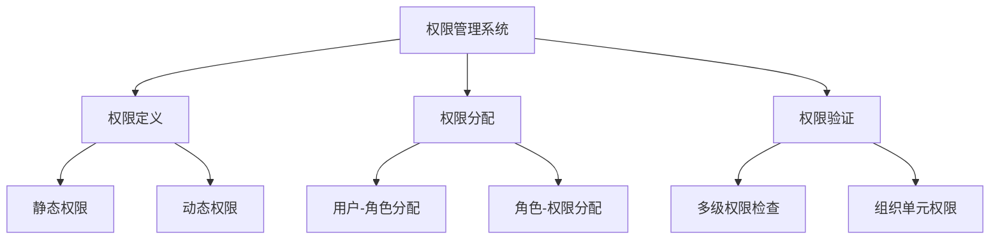
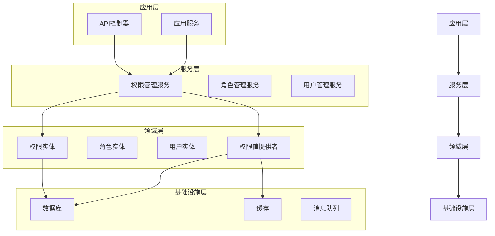
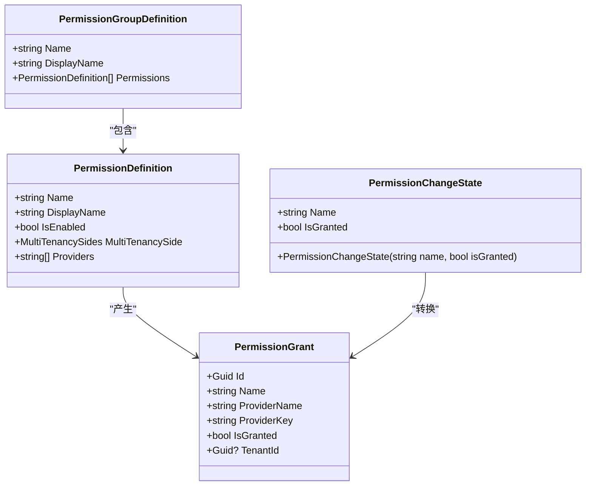
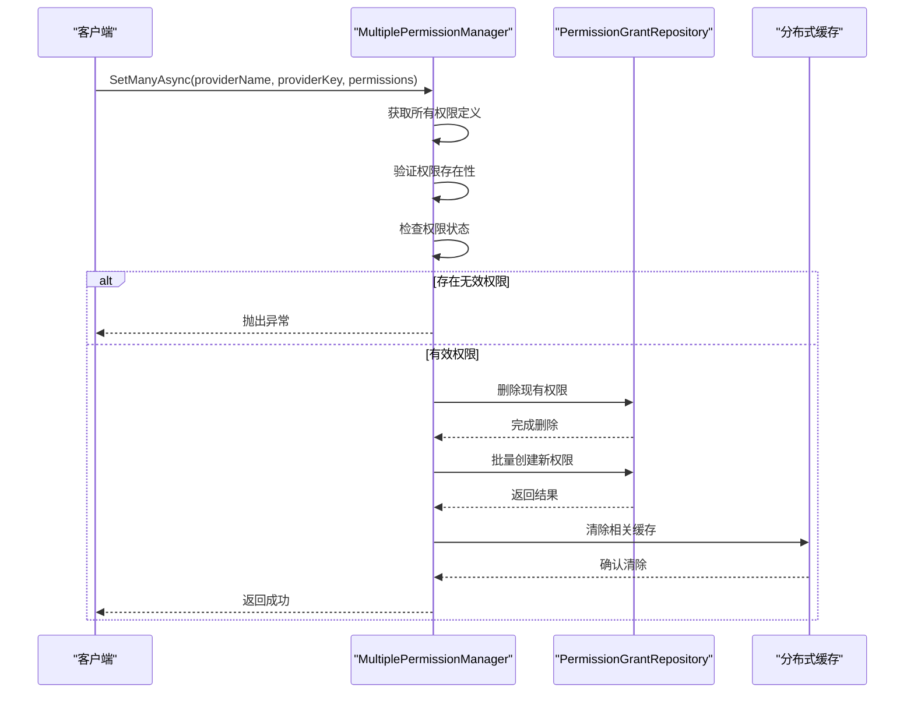
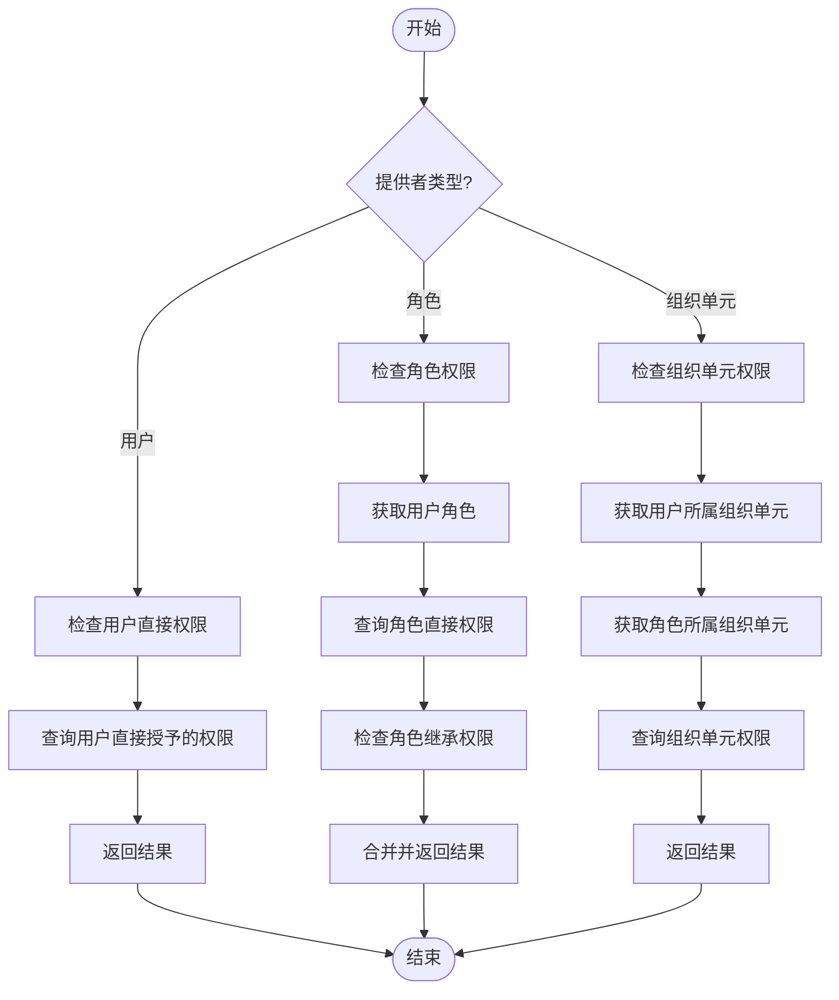
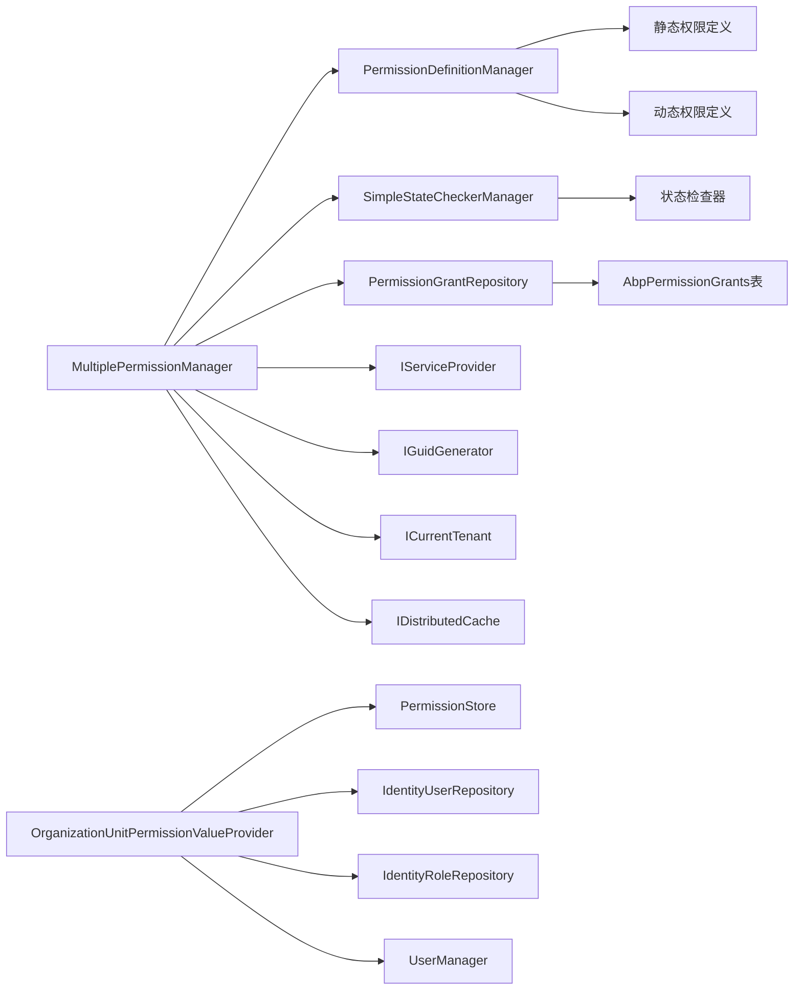

# 角色权限分配

<cite>
**本文档引用的文件**
- [MultiplePermissionManager.cs](file://aspnet-core\modules\permissions-management\LINGYUN.Abp.PermissionManagement.Application\LINGYUN\Abp\PermissionManagement\MultiplePermissionManager.cs)
- [PermissionChangeState.cs](file://aspnet-core\modules\permissions-management\LINGYUN.Abp.PermissionManagement.Application\LINGYUN\Abp\PermissionManagement\PermissionChangeState.cs)
- [PlatformPermissionDefinitionProvider.cs](file://aspnet-core\modules\platform\LINGYUN.Platform.Application.Contracts\LINGYUN\Platform\Permissions\PlatformPermissionDefinitionProvider.cs)
- [IdentityPermissionDefinitionProvider.cs](file://aspnet-core\modules\identity\LINGYUN.Abp.Identity.Application.Contracts\LINGYUN\Abp\Identity\IdentityPermissionDefinitionProvider.cs)
- [PermissionManagementPermissionDefinitionProvider.cs](file://aspnet-core\modules\permissions-management\LINGYUN.Abp.PermissionManagement.Application.Contracts\LINGYUN\Abp\PermissionManagement\Permissions\PermissionManagementPermissionDefinitionProvider.cs)
- [OrganizationUnitPermissionManagementProvider.cs](file://aspnet-core\modules\permissions-management\LINGYUN.Abp.PermissionManagement.Domain.OrganizationUnits\LINGYUN\Abp\PermissionManagement\OrganizationUnits\OrganizationUnitPermissionManagementProvider.cs)
- [Initial-Single-Project.cs](file://aspnet-core\migrations\LY.MicroService.Applications.Single.EntityFrameworkCore.MySql\Migrations\20231012032107_Initial-Single-Project.cs)
</cite>

## 目录
1. [简介](#简介)
2. [项目结构](#项目结构)
3. [核心组件](#核心组件)
4. [架构概述](#架构概述)
5. [详细组件分析](#详细组件分析)
6. [依赖关系分析](#依赖关系分析)
7. [性能考虑](#性能考虑)
8. [故障排除指南](#故障排除指南)
9. [结论](#结论)

## 简介
本文档深入解释了ABP Next Admin项目中的用户-角色权限模型实现机制。重点介绍角色定义、权限粒度控制和多租户环境下的权限隔离策略。详细描述为用户分配角色的操作流程，说明角色继承机制的工作原理和性能优化措施。提供批量角色分配功能的实现细节，包括事务处理、并发控制和错误回滚策略。

## 项目结构
该项目采用模块化设计，主要包含以下几个关键部分：
- **framework**: 包含审计、认证、授权等基础框架功能
- **migrations**: 数据库迁移脚本，包含权限授予表的定义
- **modules**: 核心业务模块，包括权限管理、身份管理、平台管理等
- **services**: 各个微服务的实现
- **templates**: 项目模板

权限管理功能主要分布在`permissions-management`模块中，同时与`identity`、`platform`等模块紧密集成。

**图表来源**
- [MultiplePermissionManager.cs](file://aspnet-core\modules\permissions-management\LINGYUN.Abp.PermissionManagement.Application\LINGYUN\Abp\PermissionManagement\MultiplePermissionManager.cs)
- [OrganizationUnitPermissionManagementProvider.cs](file://aspnet-core\modules\permissions-management\LINGYUN.Abp.PermissionManagement.Domain.OrganizationUnits\LINGYUN\Abp\PermissionManagement\OrganizationUnits\OrganizationUnitPermissionManagementProvider.cs)

**章节来源**
- [MultiplePermissionManager.cs](file://aspnet-core\modules\permissions-management\LINGYUN.Abp.PermissionManagement.Application\LINGYUN\Abp\PermissionManagement\MultiplePermissionManager.cs)
- [Initial-Single-Project.cs](file://aspnet-core\migrations\LY.MicroService.Applications.Single.EntityFrameworkCore.MySql\Migrations\20231012032107_Initial-Single-Project.cs)

## 核心组件
系统的核心权限管理组件包括：

1. **权限定义管理器**：负责管理所有权限的定义和元数据
2. **权限授予存储**：持久化权限分配关系
3. **权限值提供者**：实现不同层级的权限检查逻辑
4. **批量权限管理器**：支持高效的批量权限操作

这些组件共同构成了一个灵活且可扩展的权限管理体系，支持细粒度的权限控制和复杂的权限继承关系。

**章节来源**
- [MultiplePermissionManager.cs](file://aspnet-core\modules\permissions-management\LINGYUN.Abp.PermissionManagement.Application\LINGYUN\Abp\PermissionManagement\MultiplePermissionManager.cs)
- [PermissionChangeState.cs](file://aspnet-core\modules\permissions-management\LINGYUN.Abp.PermissionManagement.Application\LINGYUN\Abp\PermissionManagement\PermissionChangeState.cs)

## 架构概述
系统的权限架构采用分层设计，从上到下分为：

**图表来源**
- [MultiplePermissionManager.cs](file://aspnet-core\modules\permissions-management\LINGYUN.Abp.PermissionManagement.Application\LINGYUN\Abp\PermissionManagement\MultiplePermissionManager.cs)
- [OrganizationUnitPermissionManagementProvider.cs](file://aspnet-core\modules\permissions-management\LINGYUN.Abp.PermissionManagement.Domain.OrganizationUnits\LINGYUN\Abp\PermissionManagement\OrganizationUnits\OrganizationUnitPermissionManagementProvider.cs)

## 详细组件分析

### 权限模型分析
系统实现了基于ABP框架的扩展权限模型，支持多种权限提供者和复杂的权限继承关系。

#### 权限定义类图

**图表来源**
- [PermissionChangeState.cs](file://aspnet-core\modules\permissions-management\LINGYUN.Abp.PermissionManagement.Application\LINGYUN\Abp\PermissionManagement\PermissionChangeState.cs)
- [PlatformPermissionDefinitionProvider.cs](file://aspnet-core\modules\platform\LINGYUN.Platform.Application.Contracts\LINGYUN\Platform\Permissions\PlatformPermissionDefinitionProvider.cs)

#### 批量权限分配序列图

**图表来源**
- [MultiplePermissionManager.cs](file://aspnet-core\modules\permissions-management\LINGYUN.Abp.PermissionManagement.Application\LINGYUN\Abp\PermissionManagement\MultiplePermissionManager.cs)
- [PermissionChangeState.cs](file://aspnet-core\modules\permissions-management\LINGYUN.Abp.PermissionManagement.Application\LINGYUN\Abp\PermissionManagement\PermissionChangeState.cs)

#### 权限检查流程图

**图表来源**
- [OrganizationUnitPermissionManagementProvider.cs](file://aspnet-core\modules\permissions-management\LINGYUN.Abp.PermissionManagement.Domain.OrganizationUnits\LINGYUN\Abp\PermissionManagement\OrganizationUnits\OrganizationUnitPermissionManagementProvider.cs)
- [IdentityPermissionDefinitionProvider.cs](file://aspnet-core\modules\identity\LINGYUN.Abp.Identity.Application.Contracts\LINGYUN\Abp\Identity\IdentityPermissionDefinitionProvider.cs)

**章节来源**
- [MultiplePermissionManager.cs](file://aspnet-core\modules\permissions-management\LINGYUN.Abp.PermissionManagement.Application\LINGYUN\Abp\PermissionManagement\MultiplePermissionManager.cs)
- [OrganizationUnitPermissionManagementProvider.cs](file://aspnet-core\modules\permissions-management\LINGYUN.Abp.PermissionManagement.Domain.OrganizationUnits\LINGYUN\Abp\PermissionManagement\OrganizationUnits\OrganizationUnitPermissionManagementProvider.cs)

### 权限粒度控制
系统实现了多层次的权限粒度控制：

1. **模块级权限**：如平台管理、身份管理等大模块的访问权限
2. **功能级权限**：具体功能的操作权限，如创建、更新、删除
3. **数据级权限**：基于组织单元的数据访问控制
4. **字段级权限**：特定字段的读写控制

这种分层的权限控制体系确保了系统的安全性和灵活性。

**章节来源**
- [PlatformPermissionDefinitionProvider.cs](file://aspnet-core\modules\platform\LINGYUN.Platform.Application.Contracts\LINGYUN\Platform\Permissions\PlatformPermissionDefinitionProvider.cs)
- [IdentityPermissionDefinitionProvider.cs](file://aspnet-core\modules\identity\LINGYUN.Abp.Identity.Application.Contracts\LINGYUN\Abp\Identity\IdentityPermissionDefinitionProvider.cs)

### 多租户权限隔离
系统通过以下机制实现多租户环境下的权限隔离：

1. **租户ID标识**：每个权限授予记录都关联特定的租户ID
2. **权限作用域**：权限定义时指定其适用的租户范围（主机、租户或两者）
3. **查询过滤**：在权限检查时自动添加租户过滤条件
4. **缓存隔离**：不同租户的权限缓存相互隔离

这些机制确保了不同租户之间的权限数据完全隔离，防止越权访问。

**章节来源**
- [PermissionManagementPermissionDefinitionProvider.cs](file://aspnet-core\modules\permissions-management\LINGYUN.Abp.PermissionManagement.Application.Contracts\LINGYUN\Abp\PermissionManagement\Permissions\PermissionManagementPermissionDefinitionProvider.cs)
- [PlatformPermissionDefinitionProvider.cs](file://aspnet-core\modules\platform\LINGYUN.Platform.Application.Contracts\LINGYUN\Platform\Permissions\PlatformPermissionDefinitionProvider.cs)

## 依赖关系分析
系统各组件之间的依赖关系如下：

**图表来源**
- [MultiplePermissionManager.cs](file://aspnet-core\modules\permissions-management\LINGYUN.Abp.PermissionManagement.Application\LINGYUN\Abp\PermissionManagement\MultiplePermissionManager.cs)
- [OrganizationUnitPermissionManagementProvider.cs](file://aspnet-core\modules\permissions-management\LINGYUN.Abp.PermissionManagement.Domain.OrganizationUnits\LINGYUN\Abp\PermissionManagement\OrganizationUnits\OrganizationUnitPermissionManagementProvider.cs)

**章节来源**
- [MultiplePermissionManager.cs](file://aspnet-core\modules\permissions-management\LINGYUN.Abp.PermissionManagement.Application\LINGYUN\Abp\PermissionManagement\MultiplePermissionManager.cs)
- [OrganizationUnitPermissionManagementProvider.cs](file://aspnet-core\modules\permissions-management\LINGYUN.Abp.PermissionManagement.Domain.OrganizationUnits\LINGYUN\Abp\PermissionManagement\OrganizationUnits\OrganizationUnitPermissionManagementProvider.cs)

## 性能考虑
系统在权限管理方面采取了多项性能优化措施：

1. **缓存机制**：使用分布式缓存存储权限检查结果，减少数据库查询
2. **批量操作**：支持批量设置权限，减少数据库交互次数
3. **索引优化**：在权限授予表的关键字段上建立复合索引
4. **异步处理**：权限检查和更新操作支持异步执行
5. **懒加载**：按需加载权限数据，避免一次性加载过多数据

这些优化措施确保了即使在大规模用户和复杂权限场景下，系统仍能保持良好的性能表现。

## 故障排除指南
常见问题及解决方案：

1. **权限不生效**：检查缓存是否正确清除，确认权限授予记录已持久化
2. **批量分配失败**：检查事务完整性，验证权限定义是否存在
3. **多租户权限混淆**：确认租户ID正确传递，检查查询过滤条件
4. **性能下降**：监控缓存命中率，检查数据库索引使用情况

建议定期审查权限配置，确保权限分配的准确性和安全性。

**章节来源**
- [MultiplePermissionManager.cs](file://aspnet-core\modules\permissions-management\LINGYUN.Abp.PermissionManagement.Application\LINGYUN\Abp\PermissionManagement\MultiplePermissionManager.cs)
- [OrganizationUnitPermissionManagementProvider.cs](file://aspnet-core\modules\permissions-management\LINGYUN.Abp.PermissionManagement.Domain.OrganizationUnits\LINGYUN\Abp\PermissionManagement\OrganizationUnits\OrganizationUnitPermissionManagementProvider.cs)

## 结论
ABP Next Admin项目的角色权限分配功能实现了完整而灵活的权限管理体系。通过模块化的设计和分层的架构，系统支持细粒度的权限控制、多租户隔离和高效的批量操作。权限模型的设计充分考虑了实际业务需求，提供了丰富的扩展点，能够满足复杂的企业级应用场景。