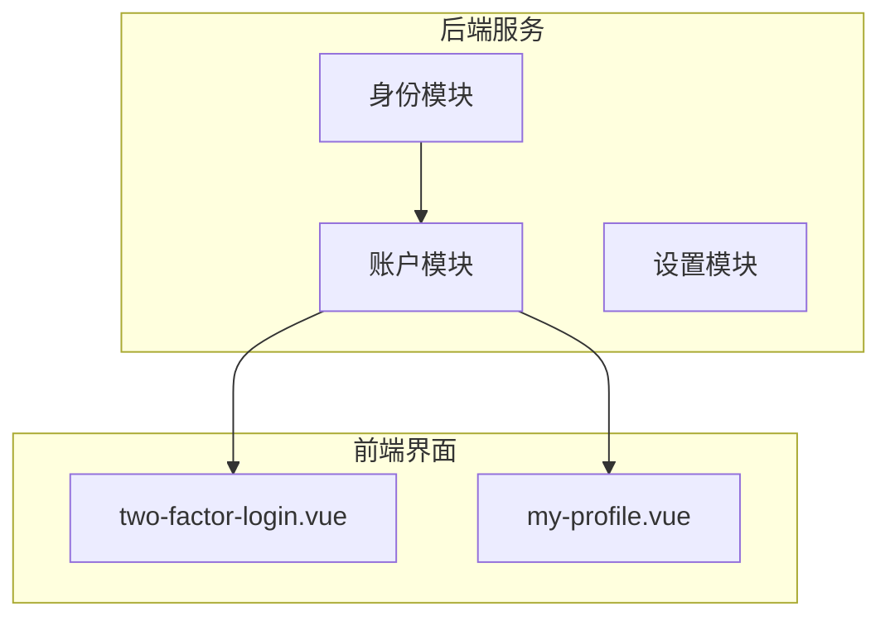
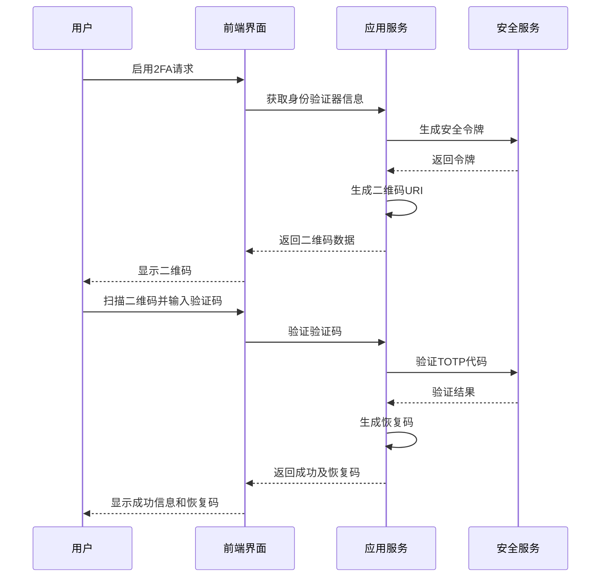
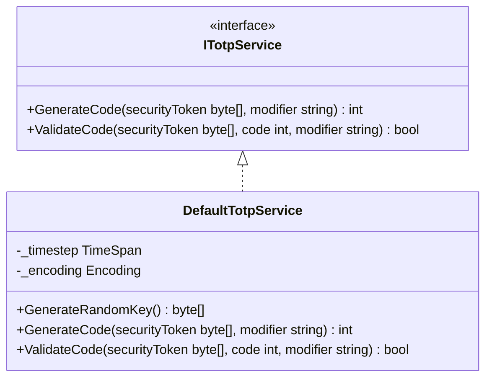
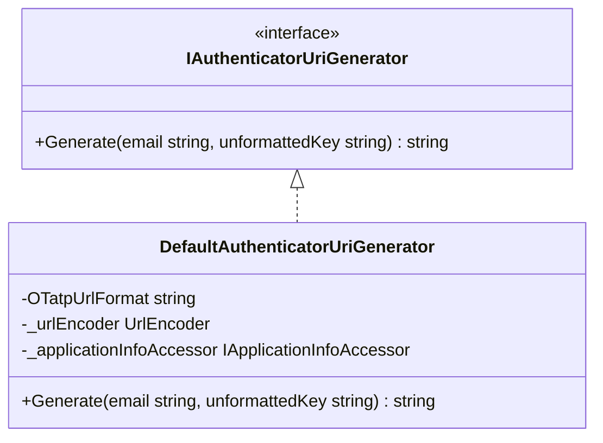
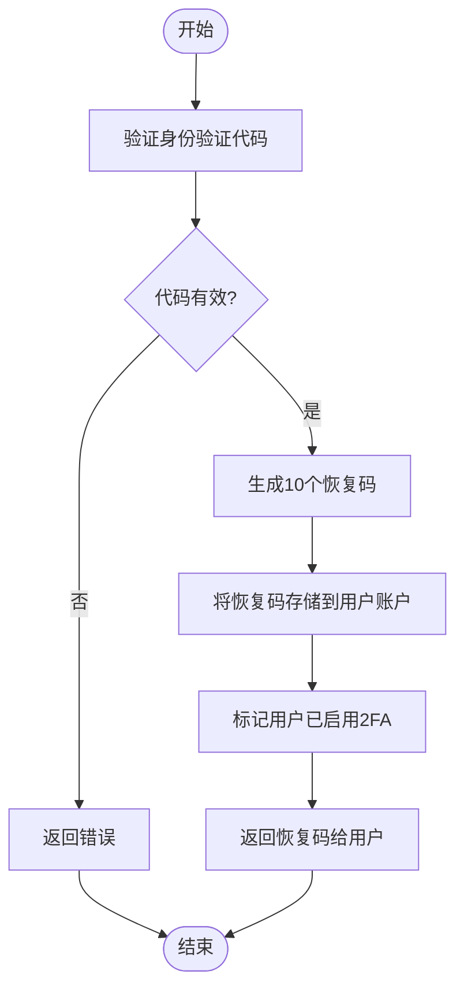
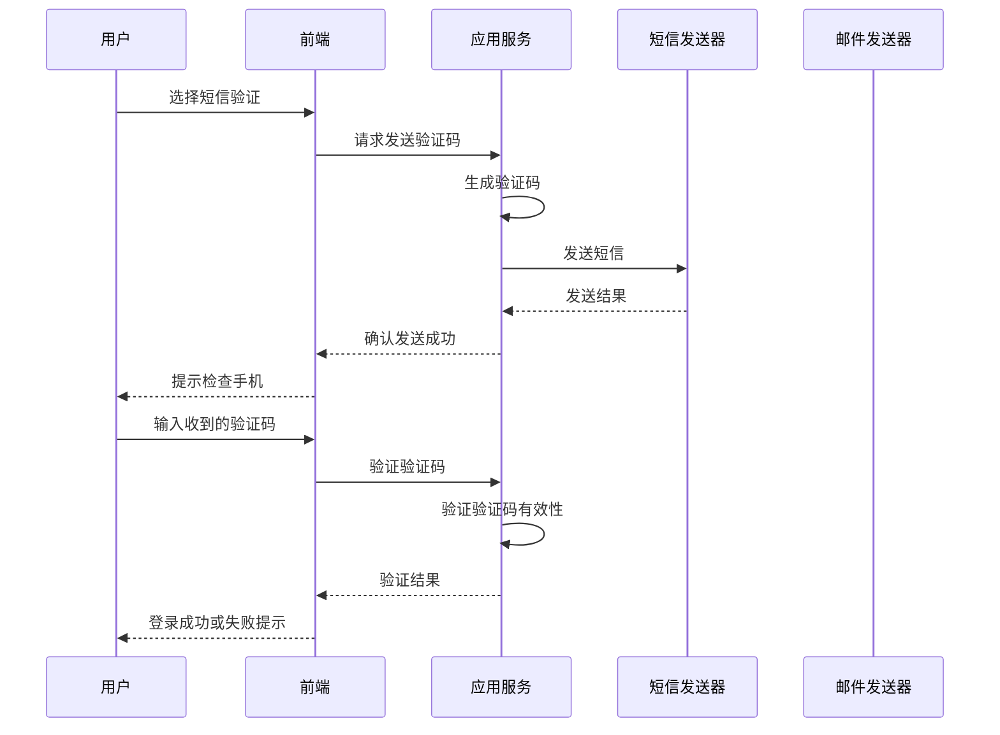
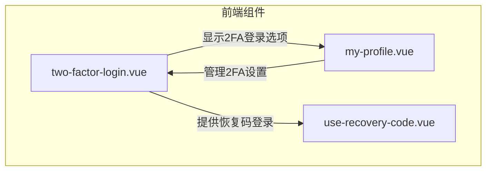
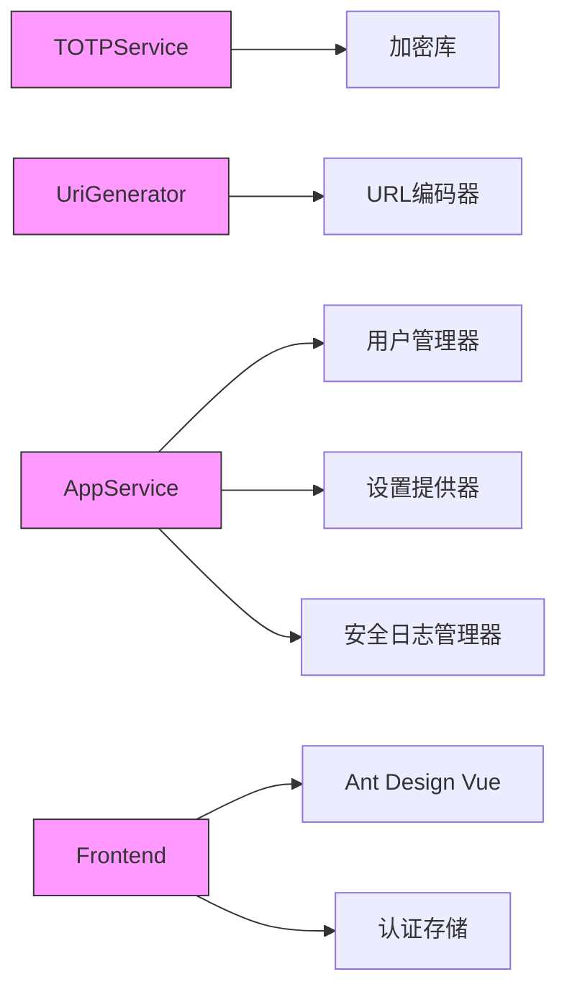

# 双因素认证(2FA)

<cite>
**本文档引用的文件**
- [DefaultTotpService.cs](file://aspnet-core/modules/identity/LINGYUN.Abp.Identity.Domain/LINGYUN/Abp/Identity/Security/DefaultTotpService.cs)
- [DefaultAuthenticatorUriGenerator.cs](file://aspnet-core/modules/identity/LINGYUN.Abp.Identity.Domain/LINGYUN/Abp/Identity/Security/DefaultAuthenticatorUriGenerator.cs)
- [MyProfileAppService.cs](file://aspnet-core/modules/account/LINGYUN.Abp.Account.Application/LINGYUN/Abp/Account/MyProfileAppService.cs)
- [two-factor-login.vue](file://apps/vben5/apps/app-antd/src/views/_core/authentication/two-factor-login.vue)
- [ITotpService.cs](file://aspnet-core/modules/identity/LINGYUN.Abp.Identity.Domain/LINGYUN/Abp/Identity/Security/ITotpService.cs)
- [IAuthenticatorUriGenerator.cs](file://aspnet-core/modules/identity/LINGYUN.Abp.Identity.Domain/LINGYUN/Abp/Identity/Security/IAuthenticatorUriGenerator.cs)
- [AuthenticatorDto.cs](file://aspnet-core/modules/account/LINGYUN.Abp.Account.Application.Contracts/LINGYUN/Abp/Account/Dto/AuthenticatorDto.cs)
- [TwoFactorEnabledDto.cs](file://aspnet-core/modules/account/LINGYUN.Abp.Account.Application.Contracts/LINGYUN/Abp/Account/Dto/TwoFactorEnabledDto.cs)
- [VerifyAuthenticatorCodeInput.cs](file://aspnet-core/modules/account/LINGYUN.Abp.Account.Application.Contracts/LINGYUN/Abp/Account/Dto/VerifyAuthenticatorCodeInput.cs)
- [AccountController.cs](file://aspnet-core/modules/account/LINGYUN.Abp.Account.HttpApi/LINGYUN/Abp/Account/AccountController.cs)
</cite>

## 目录
1. [简介](#简介)
2. [项目结构](#项目结构)
3. [核心组件](#核心组件)
4. [架构概述](#架构概述)
5. [详细组件分析](#详细组件分析)
6. [依赖分析](#依赖分析)
7. [性能考虑](#性能考虑)
8. [故障排除指南](#故障排除指南)
9. [结论](#结论)
10. [附录](#附录)（如有必要）

## 简介
本文档深入解释了基于TOTP（基于时间的一次性密码）的双因素认证(2FA)实现机制。文档涵盖了二维码生成、密钥存储、验证码验证流程，以及短信、邮件等备用验证方式的集成方法。同时说明了恢复码的生成与使用策略，并提供了用户启用/禁用2FA的界面交互逻辑和安全考虑。

## 项目结构
本项目的双因素认证功能主要分布在以下几个模块中：
- `aspnet-core/modules/identity`：包含TOTP算法服务、身份验证器URI生成器等核心安全组件
- `aspnet-core/modules/account`：提供账户管理相关的应用服务和Web界面
- `apps/vben5/apps/app-antd/src/views/_core/authentication/`：前端Vue.js实现的2FA登录界面

**Diagram sources**
- [DefaultTotpService.cs](file://aspnet-core/modules/identity/LINGYUN.Abp.Identity.Domain/LINGYUN/Abp/Identity/Security/DefaultTotpService.cs)
- [MyProfileAppService.cs](file://aspnet-core/modules/account/LINGYUN.Abp.Account.Application/LINGYUN/Abp/Account/MyProfileAppService.cs)
- [two-factor-login.vue](file://apps/vben5/apps/app-antd/src/views/_core/authentication/two-factor-login.vue)

**Section sources**
- [DefaultTotpService.cs](file://aspnet-core/modules/identity/LINGYUN.Abp.Identity.Domain/LINGYUN/Abp/Identity/Security/DefaultTotpService.cs)
- [MyProfileAppService.cs](file://aspnet-core/modules/account/LINGYUN.Abp.Account.Application/LINGYUN/Abp/Account/MyProfileAppService.cs)
- [two-factor-login.vue](file://apps/vben5/apps/app-antd/src/views/_core/authentication/two-factor-login.vue)

## 核心组件
双因素认证系统的核心组件包括TOTP服务、身份验证器URI生成器、恢复码管理以及多种备用验证方式。这些组件共同构成了一个完整的2FA解决方案，确保用户账户的安全性。

**Section sources**
- [DefaultTotpService.cs](file://aspnet-core/modules/identity/LINGYUN.Abp.Identity.Domain/LINGYUN/Abp/Identity/Security/DefaultTotpService.cs)
- [DefaultAuthenticatorUriGenerator.cs](file://aspnet-core/modules/identity/LINGYUN.Abp.Identity.Domain/LINGYUN/Abp/Identity/Security/DefaultAuthenticatorUriGenerator.cs)
- [MyProfileAppService.cs](file://aspnet-core/modules/account/LINGYUN.Abp.Account.Application/LINGYUN/Abp/Account/MyProfileAppService.cs)

## 架构概述
双因素认证系统的架构分为前端界面、应用服务层和核心安全服务层三个主要部分。用户通过前端界面与系统交互，应用服务层处理业务逻辑，核心安全服务层实现具体的认证算法。

**Diagram sources**
- [DefaultTotpService.cs](file://aspnet-core/modules/identity/LINGYUN.Abp.Identity.Domain/LINGYUN/Abp/Identity/Security/DefaultTotpService.cs)
- [MyProfileAppService.cs](file://aspnet-core/modules/account/LINGYUN.Abp.Account.Application/LINGYUN/Abp/Account/MyProfileAppService.cs)
- [two-factor-login.vue](file://apps/vben5/apps/app-antd/src/views/_core/authentication/two-factor-login.vue)

## 详细组件分析

### TOTP服务分析
TOTP（基于时间的一次性密码）服务是双因素认证的核心，负责生成和验证一次性密码。

#### 类图

**Diagram sources**
- [ITotpService.cs](file://aspnet-core/modules/identity/LINGYUN.Abp.Identity.Domain/LINGYUN/Abp/Identity/Security/ITotpService.cs)
- [DefaultTotpService.cs](file://aspnet-core/modules/identity/LINGYUN.Abp.Identity.Domain/LINGYUN/Abp/Identity/Security/DefaultTotpService.cs)

#### 实现细节
TOTP服务实现了RFC 6238标准，使用HMAC-SHA1算法生成基于时间的一次性密码。密码的有效期为3分钟，系统允许±9分钟的时间偏差（即前后各3个时间步长），以应对客户端和服务器之间的时间不同步问题。

**Section sources**
- [DefaultTotpService.cs](file://aspnet-core/modules/identity/LINGYUN.Abp.Identity.Domain/LINGYUN/Abp/Identity/Security/DefaultTotpService.cs)

### 身份验证器URI生成器分析
身份验证器URI生成器负责生成符合otpauth协议的URI，用于生成二维码。

#### 类图

**Diagram sources**
- [IAuthenticatorUriGenerator.cs](file://aspnet-core/modules/identity/LINGYUN.Abp.Identity.Domain/LINGYUN/Abp/Identity/Security/IAuthenticatorUriGenerator.cs)
- [DefaultAuthenticatorUriGenerator.cs](file://aspnet-core/modules/identity/LINGYUN.Abp.Identity.Domain/LINGYUN/Abp/Identity/Security/DefaultAuthenticatorUriGenerator.cs)

#### 实现细节
身份验证器URI生成器遵循Google Authenticator的otpauth URL格式规范，生成的URI包含以下信息：
- 协议标识：otpauth://totp
- 发行者名称：应用程序名称
- 账户名称：用户邮箱
- 密钥：Base32编码的安全令牌
- 参数：digits=6（6位数字）

**Section sources**
- [DefaultAuthenticatorUriGenerator.cs](file://aspnet-core/modules/identity/LINGYUN.Abp.Identity.Domain/LINGYUN/Abp/Identity/Security/DefaultAuthenticatorUriGenerator.cs)

### 恢复码管理分析
恢复码为用户提供了一种在无法访问主要2FA设备时的备用登录方式。

#### 流程图

**Diagram sources**
- [MyProfileAppService.cs](file://aspnet-core/modules/account/LINGYUN.Abp.Account.Application/LINGYUN/Abp/Account/MyProfileAppService.cs)

#### 实现细节
当用户首次成功验证TOTP代码后，系统会生成10个恢复码。这些恢复码以加密形式存储在用户账户中，每个恢复码只能使用一次。用户需要妥善保管这些恢复码，因为它们是紧急情况下恢复账户访问权限的关键。

**Section sources**
- [MyProfileAppService.cs](file://aspnet-core/modules/account/LINGYUN.Abp.Account.Application/LINGYUN/Abp/Account/MyProfileAppService.cs)

### 备用验证方式分析
系统支持多种备用验证方式，包括短信和邮件验证。

#### 序列图

**Diagram sources**
- [AccountController.cs](file://aspnet-core/modules/account/LINGYUN.Abp.Account.HttpApi/LINGYUN/Abp/Account/AccountController.cs)
- [MyProfileAppService.cs](file://aspnet-core/modules/account/LINGYUN.Abp.Account.Application/LINGYUN/Abp/Account/MyProfileAppService.cs)

#### 实现细节
备用验证方式通过ABP框架的用户管理器(UserManager)实现。系统支持Email和Phone两种备用验证方式，用户可以在登录时选择其中一种。验证码通过相应的发送器(SmsSender/EmailSender)发送，并在一定时间内有效。

**Section sources**
- [AccountController.cs](file://aspnet-core/modules/account/LINGYUN.Abp.Account.HttpApi/LINGYUN/Abp/Account/AccountController.cs)
- [MyProfileAppService.cs](file://aspnet-core/modules/account/LINGYUN.Abp.Account.Application/LINGYUN/Abp/Account/MyProfileAppService.cs)

### 用户界面交互分析
前端界面提供了完整的2FA用户体验，包括启用、禁用和使用2FA的功能。

#### 组件关系图

**Diagram sources**
- [two-factor-login.vue](file://apps/vben5/apps/app-antd/src/views/_core/authentication/two-factor-login.vue)
- [my-profile.vue](file://apps/vben5/apps/app-antd/src/views/account/my-profile/index.vue)

#### 交互逻辑
用户可以通过个人资料页面启用或禁用2FA。启用时，系统会显示一个二维码供用户扫描，并提供手动输入密钥的选项。登录时，如果用户启用了2FA，系统会要求输入额外的验证码。用户可以选择使用身份验证器应用、短信或邮件接收验证码。

**Section sources**
- [two-factor-login.vue](file://apps/vben5/apps/app-antd/src/views/_core/authentication/two-factor-login.vue)
- [my-profile.vue](file://apps/vben5/apps/app-antd/src/views/account/my-profile/index.vue)

## 依赖分析
双因素认证系统依赖于多个ABP框架组件和外部服务。

**Diagram sources**
- [DefaultTotpService.cs](file://aspnet-core/modules/identity/LINGYUN.Abp.Identity.Domain/LINGYUN/Abp/Identity/Security/DefaultTotpService.cs)
- [MyProfileAppService.cs](file://aspnet-core/modules/account/LINGYUN.Abp.Account.Application/LINGYUN/Abp/Account/MyProfileAppService.cs)
- [two-factor-login.vue](file://apps/vben5/apps/app-antd/src/views/_core/authentication/two-factor-login.vue)

**Section sources**
- [DefaultTotpService.cs](file://aspnet-core/modules/identity/LINGYUN.Abp.Identity.Domain/LINGYUN/Abp/Identity/Security/DefaultTotpService.cs)
- [MyProfileAppService.cs](file://aspnet-core/modules/account/LINGYUN.Abp.Account.Application/LINGYUN/Abp/Account/MyProfileAppService.cs)

## 性能考虑
双因素认证系统的性能主要受以下因素影响：

1. **加密计算性能**：TOTP代码的生成和验证涉及HMAC-SHA1加密计算，虽然现代CPU可以快速完成，但在高并发场景下仍可能成为瓶颈。
2. **数据库访问**：每次2FA验证都需要访问数据库获取用户信息和安全令牌，建议对相关查询进行优化和缓存。
3. **网络延迟**：短信和邮件验证方式受第三方服务响应时间影响，应设置合理的超时机制。
4. **时间同步**：TOTP算法依赖于准确的时间同步，服务器和客户端之间的时间偏差不应超过±9分钟。

系统通过以下方式优化性能：
- 使用单例模式的TOTP服务，避免重复创建加密对象
- 对频繁访问的用户信息进行缓存
- 异步发送短信和邮件验证码，避免阻塞主流程

## 故障排除指南

### 常见问题及解决方案

| 问题 | 可能原因 | 解决方案 |
|------|---------|----------|
| 无法扫描二维码 | 二维码图像损坏或太小 | 刷新页面重新生成二维码，或使用"手动输入密钥"选项 |
| 验证码无效 | 时间不同步 | 检查设备时间是否准确，建议启用自动时间同步 |
| 收不到短信验证码 | 手机号码错误或运营商问题 | 确认手机号码正确，检查手机信号，等待一段时间后重试 |
| 恢复码无法使用 | 已经使用过或输入错误 | 每个恢复码只能使用一次，确认输入无误，如全部失效需联系管理员 |
| 2FA设置无法保存 | 权限不足或网络问题 | 确认有足够的权限，检查网络连接，刷新页面重试 |

**Section sources**
- [MyProfileAppService.cs](file://aspnet-core/modules/account/LINGYUN.Abp.Account.Application/LINGYUN/Abp/Account/MyProfileAppService.cs)
- [two-factor-login.vue](file://apps/vben5/apps/app-antd/src/views/_core/authentication/two-factor-login.vue)

### 安全审计
系统记录所有与2FA相关的安全事件，包括：
- 2FA启用/禁用操作
- 验证码生成和使用
- 登录尝试（成功和失败）
- 恢复码使用

这些日志可用于安全审计和异常行为检测。

**Section sources**
- [MyProfileAppService.cs](file://aspnet-core/modules/account/LINGYUN.Abp.Account.Application/LINGYUN/Abp/Account/MyProfileAppService.cs)

## 结论
本文档详细介绍了ABP Next Admin系统中双因素认证功能的实现机制。系统采用标准的TOTP算法，结合二维码技术，为用户提供安全便捷的二次验证方式。通过完善的恢复码机制和多种备用验证方式，确保了在各种情况下的账户可访问性。前端界面设计友好，交互流畅，为用户提供了良好的使用体验。整体实现遵循安全最佳实践，为系统提供了强大的身份验证安全保障。

## 附录

### TOTP算法参数
- **时间步长**：3分钟
- **密码长度**：6位数字
- **哈希算法**：HMAC-SHA1
- **允许时间偏差**：±9分钟（5个时间步长）

### 恢复码策略
- 每次生成10个恢复码
- 每个恢复码只能使用一次
- 恢复码长度：16个字符（字母和数字组合）
- 恢复码区分大小写

### 安全建议
1. 建议用户将恢复码打印出来并存放在安全的地方
2. 不要将恢复码存储在电子设备中，以防被黑客窃取
3. 定期检查账户的活动日志，及时发现异常登录
4. 如果怀疑账户安全受到威胁，立即禁用2FA并联系管理员