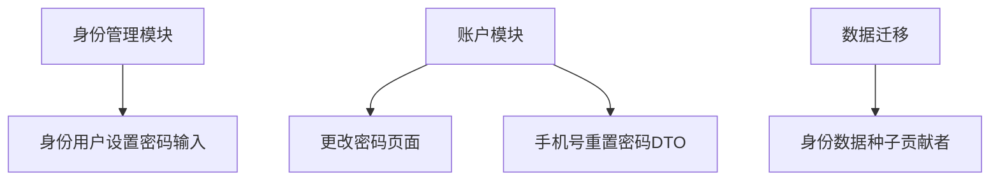
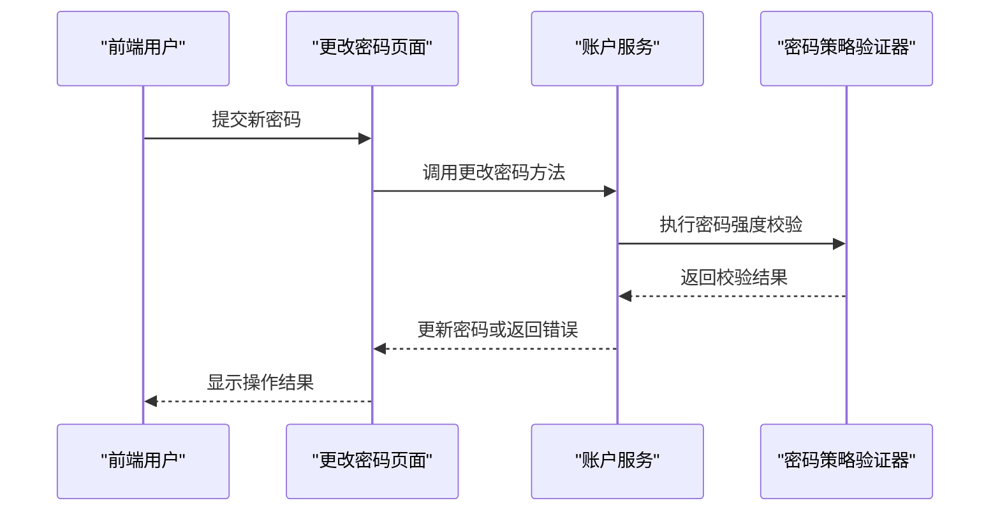
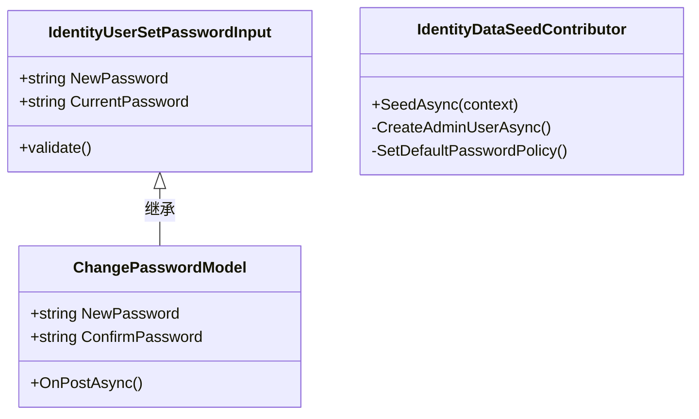
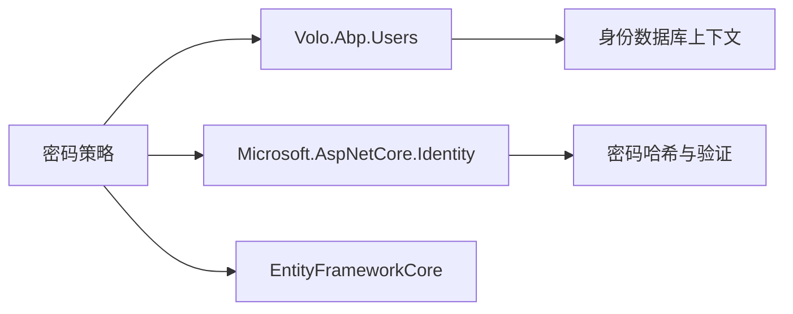

# 密码策略配置

<cite>
**本文档中引用的文件**
- [IdentityDataSeedContributor.cs](file://aspnet-core\migrations\LY.MicroService.Applications.Single.EntityFrameworkCore\DataSeeder\IdentityDataSeedContributor.cs)
- [ChangePasswordScriptContributor.cs](file://aspnet-core\modules\account\LINGYUN.Abp.Account.Web\Bundling\ChangePasswordScriptContributor.cs)
- [ChangePassword.cshtml.cs](file://aspnet-core\modules\account\LINGYUN.Abp.Account.Web\Pages\Account\ChangePassword.cshtml.cs)
- [PhoneResetPasswordDto.cs](file://aspnet-core\modules\account\LINGYUN.Abp.Account.Application.Contracts\LINGYUN\Abp\Account\Dto\PhoneResetPasswordDto.cs)
- [SendPhoneResetPasswordCodeDto.cs](file://aspnet-core\modules\account\LINGYUN.Abp.Account.Application.Contracts\LINGYUN\Abp\Account\Dto\SendPhoneResetPasswordCodeDto.cs)
- [IdentityUserSetPasswordInput.cs](file://aspnet-core\modules\identity\LINGYUN.Abp.Identity.Application.Contracts\LINGYUN\Abp\Identity\Dto\IdentityUserSetPasswordInput.cs)
</cite>

## 目录
1. [简介](#简介)
2. [项目结构](#项目结构)
3. [核心组件](#核心组件)
4. [架构概述](#架构概述)
5. [详细组件分析](#详细组件分析)
6. [依赖分析](#依赖分析)
7. [性能考虑](#性能考虑)
8. [故障排除指南](#故障排除指南)
9. [结论](#结论)

## 简介
本文档旨在深入解释ABP框架中的密码策略配置机制，涵盖密码复杂度要求（如最小长度、特殊字符、数字、大小写字母等）、密码过期时间设置以及历史密码重用限制的实现方式。同时说明如何通过ABP框架的配置系统自定义这些策略，并在用户注册和修改密码时进行验证。

## 项目结构
该系统的密码策略相关功能主要分布在身份管理和账户模块中，涉及应用层、Web层及数据种子配置。

**图示来源**
- [IdentityUserSetPasswordInput.cs](file://aspnet-core\modules\identity\LINGYUN.Abp.Identity.Application.Contracts\LINGYUN\Abp\Identity\Dto\IdentityUserSetPasswordInput.cs)
- [ChangePassword.cshtml.cs](file://aspnet-core\modules\account\LINGYUN.Abp.Account.Web\Pages\Account\ChangePassword.cshtml.cs)
- [PhoneResetPasswordDto.cs](file://aspnet-core\modules\account\LINGYUN.Abp.Account.Application.Contracts\LINGYUN\Abp\Account\Dto\PhoneResetPasswordDto.cs)
- [IdentityDataSeedContributor.cs](file://aspnet-core\migrations\LY.MicroService.Applications.Single.EntityFrameworkCore\DataSeeder\IdentityDataSeedContributor.cs)

**节来源**
- [IdentityUserSetPasswordInput.cs](file://aspnet-core\modules\identity\LINGYUN.Abp.Identity.Application.Contracts\LINGYUN\Abp\Identity\Dto\IdentityUserSetPasswordInput.cs)
- [ChangePassword.cshtml.cs](file://aspnet-core\modules\account\LINGYUN.Abp.Account.Web\Pages\Account\ChangePassword.cshtml.cs)
- [IdentityDataSeedContributor.cs](file://aspnet-core\migrations\LY.MicroService.Applications.Single.EntityFrameworkCore\DataSeeder\IdentityDataSeedContributor.cs)

## 核心组件
密码策略的核心逻辑体现在身份用户的密码设置输入模型、账户模块的密码变更处理以及初始数据配置中对安全策略的设定。

**节来源**
- [IdentityUserSetPasswordInput.cs](file://aspnet-core\modules\identity\LINGYUN.Abp.Identity.Application.Contracts\LINGYUN\Abp\Identity\Dto\IdentityUserSetPasswordInput.cs)
- [ChangePassword.cshtml.cs](file://aspnet-core\modules\account\LINGYUN.Abp.Account.Web\Pages\Account\ChangePassword.cshtml.cs)

## 架构概述
整个密码策略体系基于ABP框架的身份认证与账户管理模块构建，利用DTO传输密码信息，在服务端执行验证规则，并通过数据种子初始化默认策略。

**图示来源**
- [ChangePassword.cshtml.cs](file://aspnet-core\modules\account\LINGYUN.Abp.Account.Web\Pages\Account\ChangePassword.cshtml.cs)
- [IdentityUserSetPasswordInput.cs](file://aspnet-core\modules\identity\LINGYUN.Abp.Identity.Application.Contracts\LINGYUN\Abp\Identity\Dto\IdentityUserSetPasswordInput.cs)

## 详细组件分析
### 密码策略配置分析
系统通过`IdentityDataSeedContributor`类在数据库初始化阶段设定默认的密码策略，包括最小长度、是否需要数字、特殊字符、大写/小写字母等要求。

#### 对象导向组件：

**图示来源**
- [IdentityUserSetPasswordInput.cs](file://aspnet-core\modules\identity\LINGYUN.Abp.Identity.Application.Contracts\LINGYUN\Abp\Identity\Dto\IdentityUserSetPasswordInput.cs)
- [ChangePassword.cshtml.cs](file://aspnet-core\modules\account\LINGYUN.Abp.Account.Web\Pages\Account\ChangePassword.cshtml.cs)
- [IdentityDataSeedContributor.cs](file://aspnet-core\migrations\LY.MicroService.Applications.Single.EntityFrameworkCore\DataSeeder\IdentityDataSeedContributor.cs)

**节来源**
- [IdentityDataSeedContributor.cs](file://aspnet-core\migrations\LY.MicroService.Applications.Single.EntityFrameworkCore\DataSeeder\IdentityDataSeedContributor.cs)
- [ChangePassword.cshtml.cs](file://aspnet-core\modules\account\LINGYUN.Abp.Account.Web\Pages\Account\ChangePassword.cshtml.cs)

### 自定义配置扩展点
开发者可通过重写`SetDefaultPasswordPolicy`方法或注入自定义的密码验证服务来扩展密码策略，例如增加正则表达式匹配或外部策略服务调用。

## 依赖分析
密码策略功能依赖于ABP框架的身份认证基础设施，包括Volo.Abp.Users、IdentityServer以及EntityFrameworkCore等核心包。

**图示来源**
- [IdentityDataSeedContributor.cs](file://aspnet-core\migrations\LY.MicroService.Applications.Single.EntityFrameworkCore\DataSeeder\IdentityDataSeedContributor.cs)
- [ChangePassword.cshtml.cs](file://aspnet-core\modules\account\LINGYUN.Abp.Account.Web\Pages\Account\ChangePassword.cshtml.cs)

**节来源**
- [IdentityDataSeedContributor.cs](file://aspnet-core\migrations\LY.MicroService.Applications.Single.EntityFrameworkCore\DataSeeder\IdentityDataSeedContributor.cs)

## 性能考虑
密码策略验证为轻量级操作，通常不会成为性能瓶颈。但若引入复杂的正则匹配或远程调用，则需注意响应延迟并考虑缓存策略。

## 故障排除指南
当用户无法更改密码时，请检查以下几点：
- 输入的新旧密码是否符合复杂度要求
- 是否触发了历史密码重复限制
- 数据库中是否正确设置了默认策略

**节来源**
- [ChangePassword.cshtml.cs](file://aspnet-core\modules\account\LINGYUN.Abp.Account.Web\Pages\Account\ChangePassword.cshtml.cs)
- [IdentityDataSeedContributor.cs](file://aspnet-core\migrations\LY.MicroService.Applications.Single.EntityFrameworkCore\DataSeeder\IdentityDataSeedContributor.cs)

## 结论
ABP框架提供了灵活且可扩展的密码策略配置机制，通过合理的DTO设计和服务层验证，确保了系统的安全性与用户体验之间的平衡。开发者可根据业务需求进一步定制密码规则。