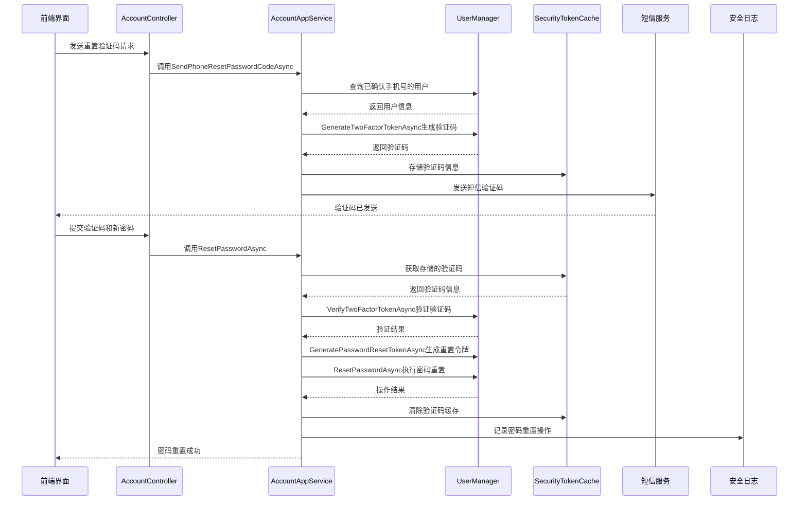
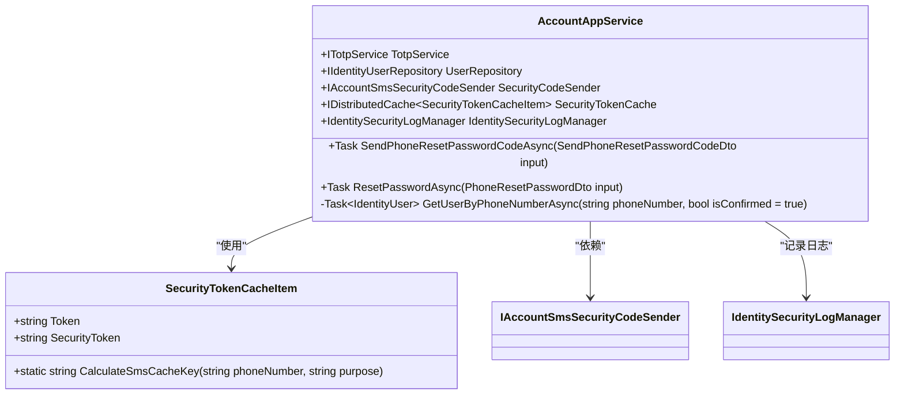
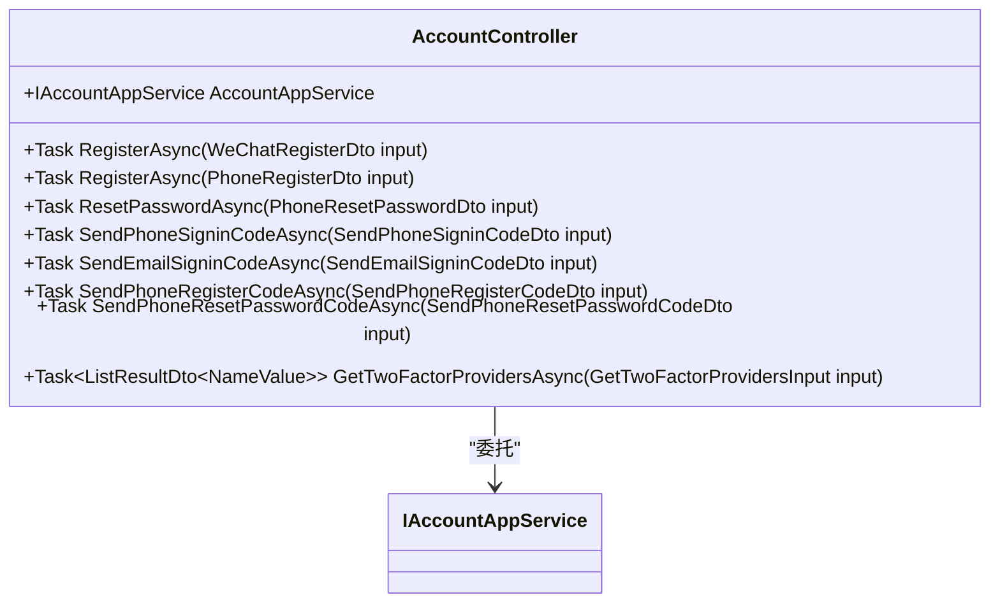
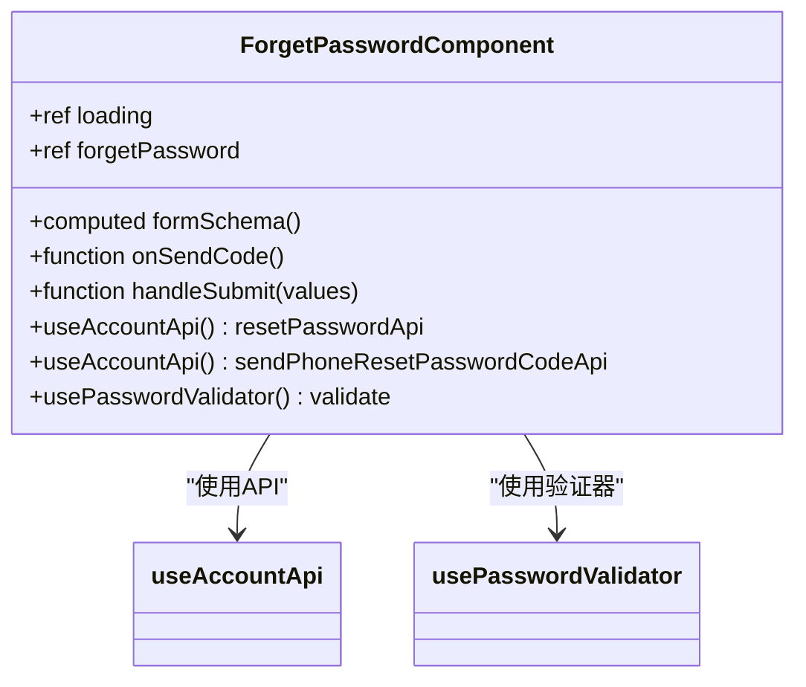
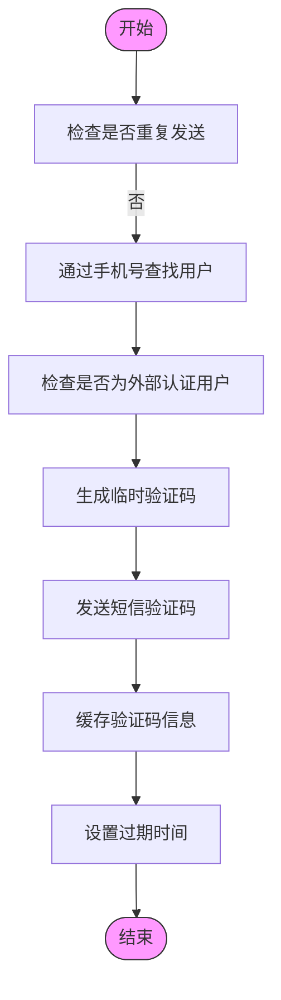
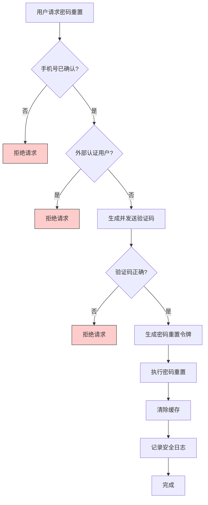
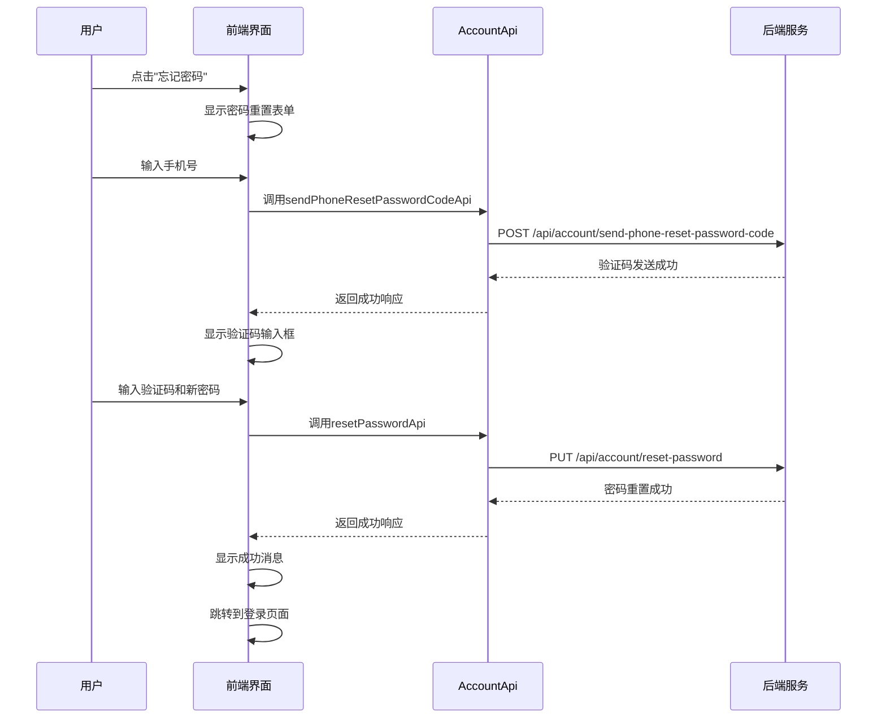
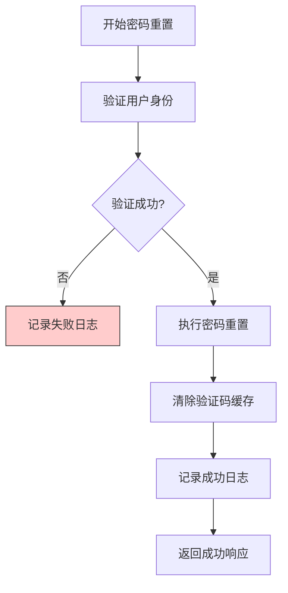

# 密码重置流程

<cite>
**本文档引用的文件**
- [AccountAppService.cs](file://aspnet-core/modules/account/LINGYUN.Abp.Account.Application/LINGYUN/Abp/Account/AccountAppService.cs)
- [AccountController.cs](file://aspnet-core/modules/account/LINGYUN.Abp.Account.HttpApi/LINGYUN/Abp/Account/AccountController.cs)
- [PhoneResetPasswordDto.cs](file://aspnet-core/modules/account/LINGYUN.Abp.Account.Application.Contracts/LINGYUN/Abp/Account/Dto/PhoneResetPasswordDto.cs)
- [SendPhoneResetPasswordCodeDto.cs](file://aspnet-core/modules/account/LINGYUN.Abp.Account.Application.Contracts/LINGYUN/Abp/Account/Dto/SendPhoneResetPasswordCodeDto.cs)
- [SecurityTokenCacheItem.cs](file://aspnet-core/modules/identity/LINGYUN.Abp.Identity.Domain/LINGYUN/Abp/Identity/SecurityTokenCacheItem.cs)
- [forget-password.vue](file://apps/vben5/apps/app-antd/src/views/_core/authentication/forget-password.vue)
- [IdentitySettingNames.cs](file://aspnet-core/modules/identity/LINGYUN.Abp.Identity.Domain.Shared/LINGYUN/Abp/Identity/Settings/IdentitySettingNames.cs)
</cite>

## 目录
1. [简介](#简介)
2. [密码重置流程概述](#密码重置流程概述)
3. [核心组件分析](#核心组件分析)
4. [令牌生成与有效期管理](#令牌生成与有效期管理)
5. [安全性保障措施](#安全性保障措施)
6. [前端页面跳转逻辑](#前端页面跳转逻辑)
7. [表单验证规则](#表单验证规则)
8. [会话处理策略](#会话处理策略)
9. [安全防护措施](#安全防护措施)

## 简介
本文档详细描述了ABP框架中密码重置流程的实现机制，包括通过短信发送验证码的方式进行密码重置。文档涵盖了从后端服务到前端界面的完整流程，重点介绍了令牌生成、有效期管理、安全性保障等关键环节。

## 密码重置流程概述
系统采用基于短信验证码的密码重置机制，用户通过已验证的手机号接收一次性验证码来完成身份验证和密码重置操作。整个流程分为两个主要步骤：发送重置验证码和执行密码重置。



**图表来源**
- [AccountAppService.cs](file://aspnet-core/modules/account/LINGYUN.Abp.Account.Application/LINGYUN/Abp/Account/AccountAppService.cs#L177-L282)
- [AccountController.cs](file://aspnet-core/modules/account/LINGYUN.Abp.Account.HttpApi/LINGYUN/Abp/Account/AccountController.cs#L49-L76)

## 核心组件分析

### 后端服务组件
系统密码重置功能主要由`AccountAppService`类实现，该服务提供了发送验证码和重置密码的核心业务逻辑。



**图表来源**
- [AccountAppService.cs](file://aspnet-core/modules/account/LINGYUN.Abp.Account.Application/LINGYUN/Abp/Account/AccountAppService.cs#L0-L386)
- [SecurityTokenCacheItem.cs](file://aspnet-core/modules/identity/LINGYUN.Abp.Identity.Domain/LINGYUN/Abp/Identity/SecurityTokenCacheItem.cs#L0-L48)

**章节来源**
- [AccountAppService.cs](file://aspnet-core/modules/account/LINGYUN.Abp.Account.Application/LINGYUN/Abp/Account/AccountAppService.cs#L177-L282)

### API控制器
`AccountController`作为HTTP API的入口点，暴露了密码重置相关的RESTful接口。



**图表来源**
- [AccountController.cs](file://aspnet-core/modules/account/LINGYUN.Abp.Account.HttpApi/LINGYUN/Abp/Account/AccountController.cs#L0-L77)

**章节来源**
- [AccountController.cs](file://aspnet-core/modules/account/LINGYUN.Abp.Account.HttpApi/LINGYUN/Abp/Account/AccountController.cs#L49-L76)

### 前端组件
前端使用Vue.js框架实现了密码重置界面，通过`forget-password.vue`组件提供用户交互界面。



**图表来源**
- [forget-password.vue](file://apps/vben5/apps/app-antd/src/views/_core/authentication/forget-password.vue#L0-L165)

**章节来源**
- [forget-password.vue](file://apps/vben5/apps/app-antd/src/views/_core/authentication/forget-password.vue#L0-L165)

## 令牌生成与有效期管理
系统采用双重令牌机制来确保密码重置过程的安全性，包括临时验证码和最终的密码重置令牌。

### 临时验证码生成
系统利用ASP.NET Core Identity框架的双因素认证机制生成临时验证码：

1. 使用`UserManager.GenerateTwoFactorTokenAsync`方法生成基于TOTP算法的验证码
2. 验证码具有时间限制，通常为几分钟的有效期
3. 验证码通过短信服务发送给用户

### 最终密码重置令牌
在验证码验证通过后，系统生成真正的密码重置令牌：

1. 使用`UserManager.GeneratePasswordResetTokenAsync`方法生成安全令牌
2. 该令牌用于最终的密码重置操作
3. 令牌在使用后立即失效



**图表来源**
- [AccountAppService.cs](file://aspnet-core/modules/account/LINGYUN.Abp.Account.Application/LINGYUN/Abp/Account/AccountAppService.cs#L177-L226)

**章节来源**
- [AccountAppService.cs](file://aspnet-core/modules/account/LINGYUN.Abp.Account.Application/LINGYUN/Abp/Account/AccountAppService.cs#L177-L226)

## 安全性保障措施
系统实施了多层次的安全保障措施来防止密码重置功能被滥用。

### 验证码安全机制
系统采用以下安全措施确保验证码的安全性：

- **TOTP算法**: 使用基于时间的一次性密码算法生成验证码，具有时间限制
- **缓存验证**: 将验证码信息存储在分布式缓存中，包含安全戳以防止重放攻击
- **单次使用**: 验证码验证通过后立即从缓存中清除

### 用户身份验证
在执行密码重置前，系统严格验证用户身份：

- 必须是已确认手机号的用户才能进行密码重置
- 外部认证用户（如微信、QQ登录）不允许修改密码
- 需要通过双因素认证验证才能生成密码重置令牌



**图表来源**
- [AccountAppService.cs](file://aspnet-core/modules/account/LINGYUN.Abp.Account.Application/LINGYUN/Abp/Account/AccountAppService.cs#L203-L250)

**章节来源**
- [AccountAppService.cs](file://aspnet-core/modules/account/LINGYUN.Abp.Account.Application/LINGYUN/Abp/Account/AccountAppService.cs#L203-L250)

## 前端页面跳转逻辑
前端实现了完整的密码重置流程用户界面和导航逻辑。

### 页面跳转流程
当用户点击"忘记密码"链接时，系统执行以下跳转逻辑：

1. 导航到`forget-password.vue`页面
2. 用户输入手机号并请求验证码
3. 验证码发送成功后，显示验证码输入框
4. 用户输入验证码和新密码
5. 提交表单后，调用API执行密码重置
6. 成功后跳转到登录页面

### API调用流程
前端通过`useAccountApi`钩子调用后端API：



**图表来源**
- [forget-password.vue](file://apps/vben5/apps/app-antd/src/views/_core/authentication/forget-password.vue#L0-L165)

**章节来源**
- [forget-password.vue](file://apps/vben5/apps/app-antd/src/views/_core/authentication/forget-password.vue#L0-L165)

## 表单验证规则
系统在前后端都实施了严格的表单验证规则，确保数据的完整性和安全性。

### 前端验证规则
前端使用Zod库定义了详细的验证规则：

| 字段 | 验证规则 |
|------|---------|
| 手机号 | 必填、有效的手机号格式、长度符合要求 |
| 验证码 | 必填、6位数字 |
| 新密码 | 必填、符合密码策略、与旧密码不同、与确认密码一致 |
| 确认密码 | 必填、与新密码一致 |

### 后端DTO验证
后端通过Data Annotations定义了DTO的验证规则：

```csharp
public class PhoneResetPasswordDto
{
    [Required]
    [Phone]
    [DynamicStringLength(typeof(IdentityUserConsts), nameof(IdentityUserConsts.MaxPhoneNumberLength))]
    public string PhoneNumber { get; set; }

    [Required]
    [DynamicStringLength(typeof(IdentityUserConsts), nameof(IdentityUserConsts.MaxPasswordLength))]
    [DataType(DataType.Password)]
    [DisableAuditing]
    public string NewPassword { get; set; }

    [Required]
    [StringLength(6)]
    [DisableAuditing]
    [Display(Name = "DisplayName:SmsVerifyCode")]
    public string Code { get; set; }
}
```

**图表来源**
- [PhoneResetPasswordDto.cs](file://aspnet-core/modules/account/LINGYUN.Abp.Account.Application.Contracts/LINGYUN/Abp/Account/Dto/PhoneResetPasswordDto.cs#L0-L31)
- [forget-password.vue](file://apps/vben5/apps/app-antd/src/views/_core/authentication/forget-password.vue#L0-L165)

**章节来源**
- [PhoneResetPasswordDto.cs](file://aspnet-core/modules/account/LINGYUN.Abp.Account.Application.Contracts/LINGYUN/Abp/Account/Dto/PhoneResetPasswordDto.cs#L0-L31)

## 会话处理策略
系统在密码重置成功后实施了特定的会话处理策略。

### 会话清理
密码重置成功后，系统执行以下会话相关操作：

- 清除验证码缓存，防止重复使用
- 记录安全日志，追踪密码重置操作
- 不自动登录用户，需要用户重新登录

### 安全日志记录
系统通过`IdentitySecurityLogManager`记录所有密码重置操作：



**图表来源**
- [AccountAppService.cs](file://aspnet-core/modules/account/LINGYUN.Abp.Account.Application/LINGYUN/Abp/Account/AccountAppService.cs#L250-L282)

**章节来源**
- [AccountAppService.cs](file://aspnet-core/modules/account/LINGYUN.Abp.Account.Application/LINGYUN/Abp/Account/AccountAppService.cs#L250-L282)

## 安全防护措施
系统实施了多种安全防护措施来防止密码重置功能被滥用。

### 速率限制
系统通过缓存机制实现速率限制，防止频繁发送验证码：

- 使用`SecurityTokenCache`存储发送记录
- 设置`SmsRepetInterval`配置项控制最小发送间隔
- 如果在间隔时间内重复请求，返回错误提示

### 操作审计
系统记录所有密码重置相关操作，便于审计和追踪：

- 记录密码重置成功和失败的日志
- 包含客户端ID、用户名、操作类型等信息
- 用于安全分析和异常检测

### 配置管理
系统通过设置管理模块配置密码重置相关参数：

| 配置项 | 描述 |
|-------|------|
| Abp.Identity.User.SmsResetPassword | 重置密码短信模板 |
| Abp.Identity.User.SmsRepetInterval | 短信验证码重复间隔时间（分钟） |
| Abp.Identity.User.IsEmailUpdateEnabled | 是否允许更新邮箱 |
| Abp.Identity.User.IsUserNameUpdateEnabled | 是否允许更新用户名 |

**图表来源**
- [IdentitySettingNames.cs](file://aspnet-core/modules/identity/LINGYUN.Abp.Identity.Domain.Shared/LINGYUN/Abp/Identity/Settings/IdentitySettingNames.cs#L0-L34)
- [AccountAppService.cs](file://aspnet-core/modules/account/LINGYUN.Abp.Account.Application/LINGYUN/Abp/Account/AccountAppService.cs#L203-L226)

**章节来源**
- [IdentitySettingNames.cs](file://aspnet-core/modules/identity/LINGYUN.Abp.Identity.Domain.Shared/LINGYUN/Abp/Identity/Settings/IdentitySettingNames.cs#L0-L34)