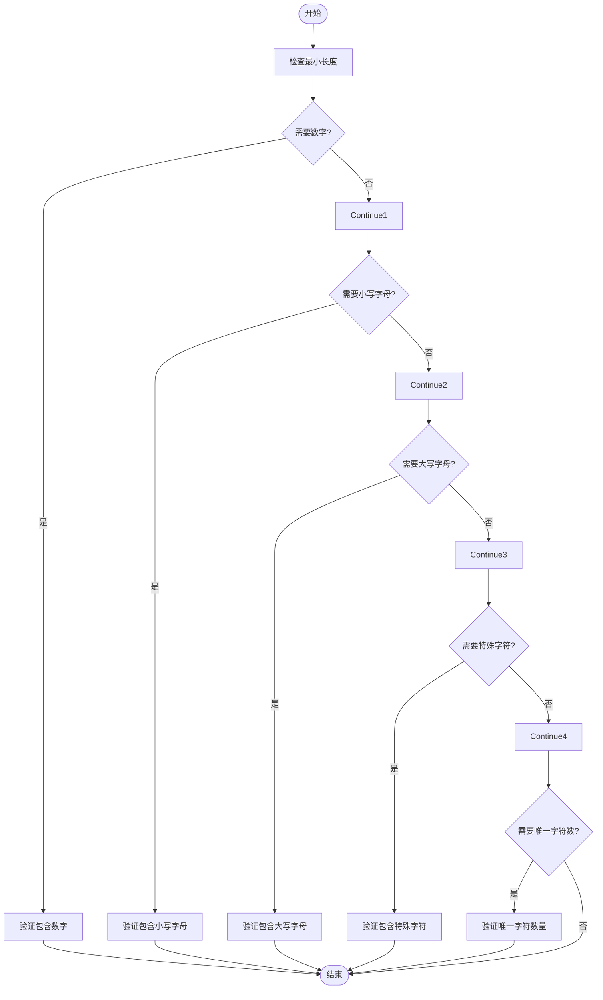
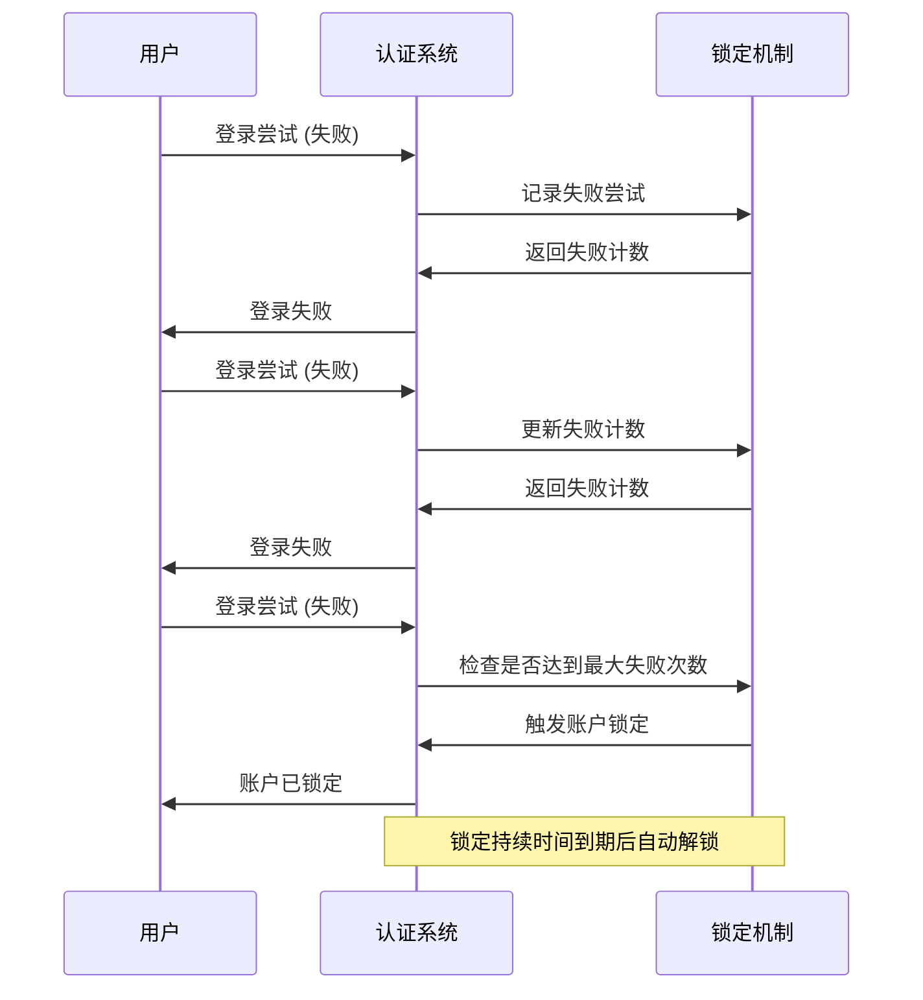
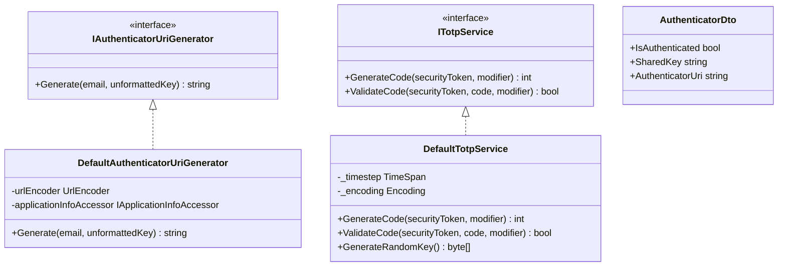
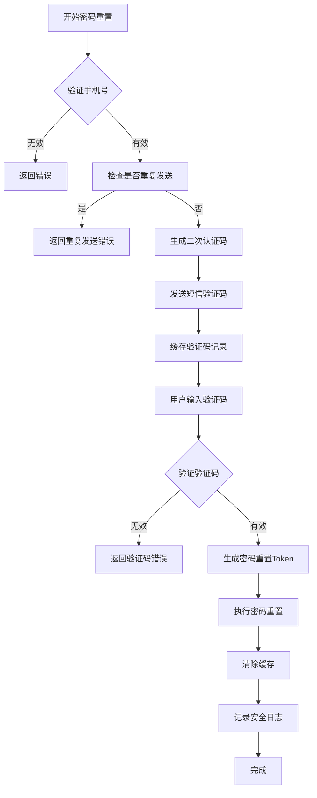
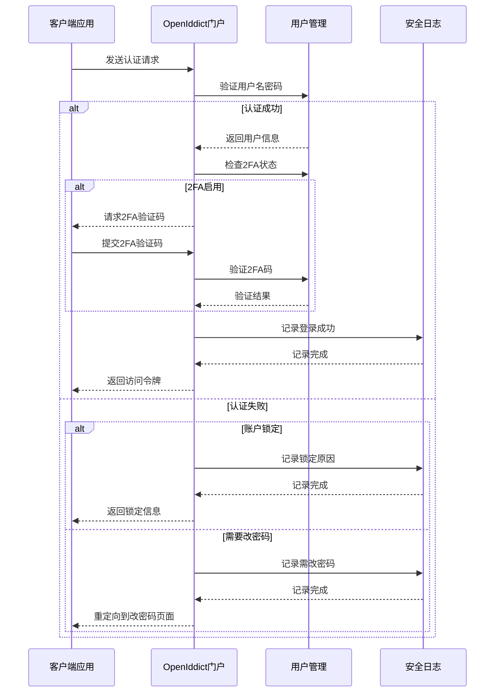
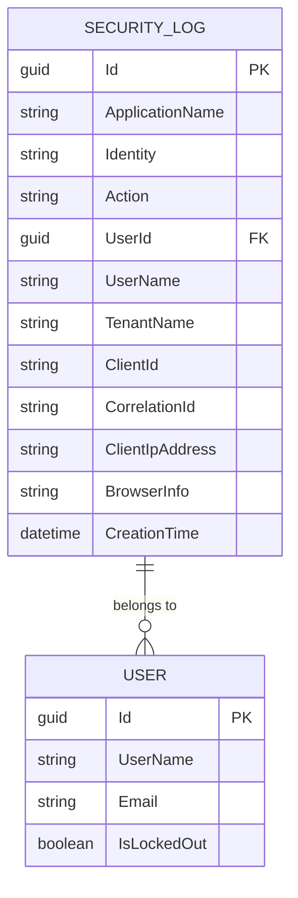

# 账户安全与认证

<cite>
**本文档引用的文件**
- [AccountAppService.cs](file://aspnet-core/modules/account/LINGYUN.Abp.Account.Application/LINGYUN/Abp/Account/AccountAppService.cs)
- [MyProfileAppService.cs](file://aspnet-core/modules/account/LINGYUN.Abp.Account.Application/LINGYUN/Abp/Account/MyProfileAppService.cs)
- [IdentityUserAppService.cs](file://aspnet-core/modules/identity/LINGYUN.Abp.Identity.Application/LINGYUN/Abp/Identity/IdentityUserAppService.cs)
- [SettingAppService.cs](file://aspnet-core/modules/settings/LINGYUN.Abp.SettingManagement.Application/LINGYUN/Abp/SettingManagement/SettingAppService.cs)
- [UserSettingAppService.cs](file://aspnet-core/modules/settings/LINGYUN.Abp.SettingManagement.Application/LINGYUN/Abp/SettingManagement/UserSettingAppService.cs)
- [SecurityLogManager.cs](file://aspnet-core/framework/auditing/LINGYUN.Abp.AuditLogging.EntityFrameworkCore/LINGYUN/Abp/AuditLogging/EntityFrameworkCore/SecurityLogManager.cs)
- [MySecurityLogAppService.cs](file://aspnet-core/modules/account/LINGYUN.Abp.Account.Application/LINGYUN/Abp/Account/MySecurityLogAppService.cs)
- [PortalTokenExtensionGrant.cs](file://aspnet-core/modules/openIddict/LINGYUN.Abp.OpenIddict.Portal/LINGYUN/Abp/OpenIddict/Portal/PortalTokenExtensionGrant.cs)
- [DefaultAuthenticatorUriGenerator.cs](file://aspnet-core/modules/identity/LINGYUN.Abp.Identity.Domain/LINGYUN/Abp/Identity/Security/DefaultAuthenticatorUriGenerator.cs)
- [DefaultTotpService.cs](file://aspnet-core/modules/identity/LINGYUN.Abp.Identity.Domain/LINGYUN/Abp/Identity/Security/DefaultTotpService.cs)
</cite>

## 目录
1. [简介](#简介)
2. [密码策略配置](#密码策略配置)
3. [账户锁定机制](#账户锁定机制)
4. [双因素认证支持](#双因素认证支持)
5. [密码重置流程](#密码重置流程)
6. [身份认证服务集成](#身份认证服务集成)
7. [安全日志管理](#安全日志管理)
8. [API接口文档](#api接口文档)

## 简介
本项目实现了全面的账户安全与认证功能，基于ABP框架构建。系统提供了完善的密码策略、账户锁定、双因素认证和密码重置机制。通过OpenIddict实现OAuth 2.0和OpenID Connect协议，支持令牌颁发和验证。所有安全操作都被记录在安全日志中，便于审计和监控。

**Section sources**
- [AccountAppService.cs](file://aspnet-core/modules/account/LINGYUN.Abp.Account.Application/LINGYUN/Abp/Account/AccountAppService.cs)
- [SettingAppService.cs](file://aspnet-core/modules/settings/LINGYUN.Abp.SettingManagement.Application/LINGYUN/Abp/SettingManagement/SettingAppService.cs)

## 密码策略配置
系统提供灵活的密码策略配置，允许管理员根据安全需求设置不同的密码复杂度要求。这些策略通过设置管理系统进行配置和管理。

**Diagram sources**
- [SettingAppService.cs](file://aspnet-core/modules/settings/LINGYUN.Abp.SettingManagement.Application/LINGYUN/Abp/SettingManagement/SettingAppService.cs)
- [UserSettingAppService.cs](file://aspnet-core/modules/settings/LINGYUN.Abp.SettingManagement.Application/LINGYUN/Abp/SettingManagement/UserSettingAppService.cs)

### 密码复杂度要求
系统支持多种密码复杂度配置选项：

- **最小长度**: 配置密码所需的最小字符数
- **必须包含数字**: 要求密码中至少包含一个数字字符
- **必须包含小写字母**: 要求密码中至少包含一个小写字母
- **必须包含大写字母**: 要求密码中至少包含一个大写字母
- **必须包含特殊字符**: 要求密码中至少包含一个非字母数字字符
- **唯一字符数**: 要求密码中至少包含指定数量的不同字符

### 密码过期时间
系统支持周期性强制用户更改密码的功能：

- **强制定期更改密码**: 启用后，用户必须在指定天数内更改密码
- **密码更改周期(天)**: 设置用户必须更改密码的时间间隔（以天为单位）

**Section sources**
- [SettingAppService.cs](file://aspnet-core/modules/settings/LINGYUN.Abp.SettingManagement.Application/LINGYUN/Abp/SettingManagement/SettingAppService.cs)
- [UserSettingAppService.cs](file://aspnet-core/modules/settings/LINGYUN.Abp.SettingManagement.Application/LINGYUN/Abp/SettingManagement/UserSettingAppService.cs)

## 账户锁定机制
系统实现了基于失败登录尝试次数的账户锁定机制，有效防止暴力破解攻击。

**Diagram sources**
- [SettingAppService.cs](file://aspnet-core/modules/settings/LINGYUN.Abp.SettingManagement.Application/LINGYUN/Abp/SettingManagement/SettingAppService.cs)
- [PortalTokenExtensionGrant.cs](file://aspnet-core/modules/openIddict/LINGYUN.Abp.OpenIddict.Portal/LINGYUN/Abp/OpenIddict/Portal/PortalTokenExtensionGrant.cs)

### 锁定配置参数
账户锁定机制可通过以下参数进行配置：

- **新用户允许锁定**: 决定新创建的用户是否受锁定策略影响
- **锁定时长**: 账户被锁定的时间长度（分钟）
- **最大失败访问尝试次数**: 在账户被锁定前允许的最大连续失败登录尝试次数

### 锁定状态管理
系统提供了对账户锁定状态的管理功能：

- **手动锁定**: 管理员可以主动锁定特定用户账户
- **手动解锁**: 管理员可以解除对用户账户的锁定
- **自动解锁**: 根据配置的锁定时长，系统会在指定时间后自动解锁账户

**Section sources**
- [SettingAppService.cs](file://aspnet-core/modules/settings/LINGYUN.Abp.SettingManagement.Application/LINGYUN/Abp/SettingManagement/SettingAppService.cs)
- [PortalTokenExtensionGrant.cs](file://aspnet-core/modules/openIddict/LINGYUN.Abp.OpenIddict.Portal/LINGYUN/Abp/OpenIddict/Portal/PortalTokenExtensionGrant.cs)

## 双因素认证支持
系统实现了完整的双因素认证(2FA)功能，支持基于TOTP(Time-based One-Time Password)算法的身份验证器应用。

**Diagram sources**
- [DefaultAuthenticatorUriGenerator.cs](file://aspnet-core/modules/identity/LINGYUN.Abp.Identity.Domain/LINGYUN/Abp/Identity/Security/DefaultAuthenticatorUriGenerator.cs)
- [DefaultTotpService.cs](file://aspnet-core/modules/identity/LINGYUN.Abp.Identity.Domain/LINGYUN/Abp/Identity/Security/DefaultTotpService.cs)
- [AuthenticatorDto.cs](file://aspnet-core/modules/account/LINGYUN.Abp.Account.Application.Contracts/LINGYUN/Abp/Account/Dto/AuthenticatorDto.cs)

### 2FA工作流程
双因素认证的完整流程如下：

1. **启用2FA**: 用户在个人资料页面启用双因素认证
2. **生成密钥**: 系统生成一个唯一的共享密钥
3. **显示二维码**: 系统生成包含密钥信息的二维码供身份验证器应用扫描
4. **验证代码**: 用户输入身份验证器应用生成的验证码进行验证
5. **保存恢复代码**: 系统生成并显示恢复代码，供用户在丢失设备时使用

### 2FA管理功能
系统提供了完整的2FA管理界面和API：

- **获取2FA状态**: 查询用户的2FA启用状态
- **启用/禁用2FA**: 允许用户开启或关闭双因素认证
- **重置验证器**: 当用户更换设备时，可以重置2FA配置
- **恢复代码管理**: 生成和管理用于账户恢复的备用代码

**Section sources**
- [MyProfileAppService.cs](file://aspnet-core/modules/account/LINGYUN.Abp.Account.Application/LINGYUN/Abp/Account/MyProfileAppService.cs)
- [DefaultAuthenticatorUriGenerator.cs](file://aspnet-core/modules/identity/LINGYUN.Abp.Identity.Domain/LINGYUN/Abp/Identity/Security/DefaultAuthenticatorUriGenerator.cs)
- [DefaultTotpService.cs](file://aspnet-core/modules/identity/LINGYUN.Abp.Identity.Domain/LINGYUN/Abp/Identity/Security/DefaultTotpService.cs)

## 密码重置流程
系统提供了安全的密码重置机制，支持通过手机号验证进行密码重置。

**Diagram sources**
- [AccountAppService.cs](file://aspnet-core/modules/account/LINGYUN.Abp.Account.Application/LINGYUN/Abp/Account/AccountAppService.cs)

### 重置流程步骤
密码重置的具体实现步骤：

1. **手机号验证**: 验证用户提供的手机号是否存在于系统中且已确认
2. **防重复机制**: 检查是否在规定时间内重复发送验证码，防止滥用
3. **二次认证码生成**: 使用TOTP算法生成有时间限制的验证码
4. **短信发送**: 将验证码通过短信服务发送到用户手机
5. **验证码缓存**: 将验证码和用户安全戳缓存在分布式缓存中
6. **验证码验证**: 验证用户输入的验证码是否正确
7. **密码重置执行**: 使用ASP.NET Core Identity的ResetPasswordAsync方法重置密码
8. **清理缓存**: 成功重置后清除验证码缓存

### 安全考虑
密码重置流程中的安全措施：

- **时间限制**: 验证码具有有效期，过期后无法使用
- **频率限制**: 防止短时间内重复发送验证码
- **仅限已确认号码**: 只能向已验证的手机号发送重置码
- **外部用户限制**: 外部认证用户不允许通过此方式重置密码

**Section sources**
- [AccountAppService.cs](file://aspnet-core/modules/account/LINGYUN.Abp.Account.Application/LINGYUN/Abp/Account/AccountAppService.cs)

## 身份认证服务集成
系统通过OpenIddict实现身份认证服务，与用户管理模块深度集成。

**Diagram sources**
- [PortalTokenExtensionGrant.cs](file://aspnet-core/modules/openIddict/LINGYUN.Abp.OpenIddict.Portal/LINGYUN/Abp/OpenIddict/Portal/PortalTokenExtensionGrant.cs)
- [SecurityLogManager.cs](file://aspnet-core/framework/auditing/LINGYUN.Abp.AuditLogging.EntityFrameworkCore/LINGYUN/Abp/AuditLogging/EntityFrameworkCore/SecurityLogManager.cs)

### 令牌颁发流程
身份认证服务的令牌颁发过程：

- **认证请求处理**: 接收来自客户端的认证请求
- **用户凭证验证**: 验证用户名和密码的正确性
- **2FA检查**: 如果用户启用了2FA，则需要额外的验证步骤
- **令牌生成**: 验证通过后生成JWT访问令牌
- **安全日志记录**: 记录认证成功或失败的详细信息

### 验证流程
系统的验证流程包括：

- **多因素验证**: 支持密码、短信验证码、身份验证器等多种验证方式
- **会话管理**: 维护用户登录状态和会话信息
- **令牌刷新**: 支持访问令牌的刷新机制
- **注销处理**: 处理用户注销请求，清除相关会话

### 安全配置
关键的安全配置项：

- **认证方案**: 使用OpenIddict作为主要认证方案
- **令牌配置**: 配置令牌的有效期、签名算法等参数
- **跨域设置**: 配置CORS策略，确保安全的跨域请求
- **HTTPS要求**: 强制在生产环境中使用HTTPS

**Section sources**
- [PortalTokenExtensionGrant.cs](file://aspnet-core/modules/openIddict/LINGYUN.Abp.OpenIddict.Portal/LINGYUN/Abp/OpenIddict/Portal/PortalTokenExtensionGrant.cs)
- [SettingAppService.cs](file://aspnet-core/modules/settings/LINGYUN.Abp.SettingManagement.Application/LINGYUN/Abp/SettingManagement/SettingAppService.cs)

## 安全日志管理
系统实现了全面的安全日志功能，记录所有重要的安全相关事件。

**Diagram sources**
- [SecurityLogManager.cs](file://aspnet-core/framework/auditing/LINGYUN.Abp.AuditLogging.EntityFrameworkCore/LINGYUN/Abp/AuditLogging/EntityFrameworkCore/SecurityLogManager.cs)
- [SecurityLogDto.cs](file://aspnet-core/modules/account/LINGYUN.Abp.Account.Application.Contracts/LINGYUN/Abp/Account/Dto/SecurityLogDto.cs)

### 日志类型
系统记录的安全日志类型包括：

- **登录成功**: 用户成功登录系统
- **登录失败**: 用户登录尝试失败
- **账户锁定**: 用户因多次失败尝试被锁定
- **密码重置**: 用户执行了密码重置操作
- **2FA变更**: 用户启用了或禁用了双因素认证
- **会话管理**: 用户登录、注销等会话相关操作

### 日志查询功能
安全日志提供了丰富的查询功能：

- **按时间范围查询**: 可以指定开始和结束时间来过滤日志
- **按应用名称查询**: 根据应用程序名称筛选日志
- **按用户查询**: 根据用户名或用户ID查找相关日志
- **按客户端查询**: 根据客户端ID筛选日志
- **按IP地址查询**: 根据客户端IP地址查找日志
- **按关联ID查询**: 根据关联ID追踪特定操作链

### 日志存储
安全日志的存储机制：

- **数据库存储**: 主要存储在关系型数据库中
- **Elasticsearch支持**: 可选地将日志存储到Elasticsearch中，便于搜索和分析
- **分布式缓存**: 使用Redis等分布式缓存提高查询性能
- **数据保留策略**: 配置日志的保留期限，自动清理过期日志

**Section sources**
- [SecurityLogManager.cs](file://aspnet-core/framework/auditing/LINGYUN.Abp.AuditLogging.EntityFrameworkCore/LINGYUN/Abp/AuditLogging/EntityFrameworkCore/SecurityLogManager.cs)
- [MySecurityLogAppService.cs](file://aspnet-core/modules/account/LINGYUN.Abp.Account.Application/LINGYUN/Abp/Account/MySecurityLogAppService.cs)

## API接口文档
以下是账户安全与认证相关的API接口文档。

### 密码策略相关API
| 接口 | HTTP方法 | 描述 | 参数 | 返回值 |
|------|---------|------|-------|--------|
| /api/setting-management/settings | GET | 获取设置信息 | providerName, providerKey | 包含密码策略的设置组 |
| /api/setting-management/users/settings | GET | 获取用户设置 | providerName, providerKey | 包含密码策略的用户设置 |

### 账户锁定相关API
| 接口 | HTTP方法 | 描述 | 参数 | 返回值 |
|------|---------|------|-------|--------|
| /api/identity/users/{id}/lock | PUT | 锁定用户账户 | id, seconds |