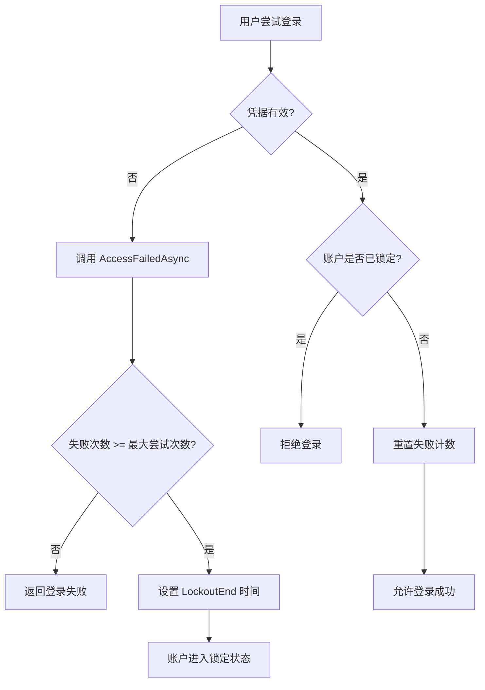
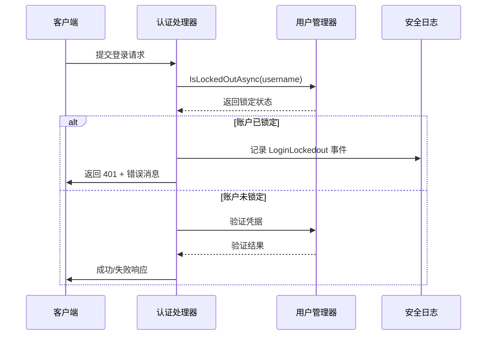

# 账户锁定机制

<cite>
**本文档引用的文件**  
- [IdentitySettingNames.cs](file://aspnet-core/modules/identity/LINGYUN.Abp.Identity.Domain.Shared/LINGYUN/Abp/Identity/Settings/IdentitySettingNames.cs)
- [QrCodeTokenExtensionGrant.cs](file://aspnet-core/modules/openIddict/LINGYUN.Abp.OpenIddict.QrCode/LINGYUN/Abp/OpenIddict/QrCode/QrCodeTokenExtensionGrant.cs)
- [PortalTokenExtensionGrant.cs](file://aspnet-core/modules/openIddict/LINGYUN.Abp.OpenIddict.Portal/LINGYUN/Abp/OpenIddict/Portal/PortalTokenExtensionGrant.cs)
- [SmsTokenGrantValidator.cs](file://aspnet-core/modules/identityServer/LINGYUN.Abp.IdentityServer.SmsValidator/LINGYUN/Abp/IdentityServer/SmsValidator/SmsTokenGrantValidator.cs)
- [VerifyAuthenticatorCode.cshtml.cs](file://aspnet-core/templates/aio/content/host/PackageName.CompanyName.ProjectName.AIO.Host/Pages/Account/VerifyAuthenticatorCode.cshtml.cs)
- [LY.MicroService.Applications.Single.EntityFrameworkCore.MySql/Migrations/*.Designer.cs](file://aspnet-core/migrations/LY.MicroService.Applications.Single.EntityFrameworkCore.MySql/Migrations/)
</cite>

## 目录
1. [简介](#简介)
2. [账户锁定机制概述](#账户锁定机制概述)
3. [失败计数器与锁定逻辑](#失败计数器与锁定逻辑)
4. [锁定时间窗口配置](#锁定时间窗口配置)
5. [锁定策略维度分析](#锁定策略维度分析)
6. [认证流程中的锁定状态处理](#认证流程中的锁定状态处理)
7. [管理员解锁功能实现](#管理员解锁功能实现)
8. [事件处理与日志记录最佳实践](#事件处理与日志记录最佳实践)

## 简介
本文档详细描述了ABP框架中账户锁定机制的实现方式，涵盖登录失败次数限制、失败计数器存储与重置逻辑、锁定时间窗口配置、基于用户名或IP地址的锁定策略。同时说明账户锁定状态对认证流程的影响，以及管理员如何执行解锁操作，并提供相关事件处理和日志记录的最佳实践建议。

## 账户锁定机制概述
系统通过集成ASP.NET Core Identity框架提供的账户安全功能，实现了基于多次登录失败后的自动账户锁定机制。该机制旨在防止暴力破解攻击，保护用户账户安全。当用户在指定时间内连续输入错误密码达到预设阈值时，账户将被临时锁定，在锁定期间无法进行正常登录。

核心组件包括：
- **失败尝试计数器**：跟踪每个用户的登录失败次数。
- **锁定启用标志（LockoutEnabled）**：控制是否启用账户锁定功能。
- **锁定结束时间（LockoutEnd）**：记录账户被锁定至何时。
- **最大失败尝试次数设置（MaxFailedAccessAttempts）**：定义触发锁定所需的失败次数。
- **锁定持续时间设置（LockoutDuration）**：定义账户被锁定的时间长度。

这些字段均映射到数据库表中，确保数据持久化与一致性。

**Section sources**
- [IdentitySettingNames.cs](file://aspnet-core/modules/identity/LINGYUN.Abp.Identity.Domain.Shared/LINGYUN/Abp/Identity/Settings/IdentitySettingNames.cs)
- [LY.MicroService.Applications.Single.EntityFrameworkCore.MySql/Migrations/20231012032107_Initial-Single-Project.Designer.cs#L3142-L3148)

## 失败计数器与锁定逻辑
系统使用`userManager.AccessFailedAsync(user)`方法来递增用户的失败登录计数。每当用户尝试登录但凭据无效时，此方法会被调用，增加失败次数。一旦失败次数达到由`IdentitySettingNames.Lockout.MaxFailedAccessAttempts`配置的最大允许值，系统会自动调用`userManager.SetLockoutEndDateAsync()`将用户账户标记为已锁定状态。

锁定后，`IsLockedOutAsync(user)`方法返回true，阻止后续的认证请求成功。若用户在锁定期内再次尝试登录，系统将直接拒绝并返回“账户已被锁定”的提示信息。

失败计数的重置发生在以下两种情况之一：
1. 用户成功登录，此时所有失败计数将被清零；
2. 账户处于未锁定状态且失败次数未达上限。

**Diagram sources**
- [QrCodeTokenExtensionGrant.cs](file://aspnet-core/modules/openIddict/LINGYUN.Abp.OpenIddict.QrCode/LINGYUN/Abp/OpenIddict/QrCode/QrCodeTokenExtensionGrant.cs#L89-L110)
- [PortalTokenExtensionGrant.cs](file://aspnet-core/modules/openIddict/LINGYUN.Abp.OpenIddict.Portal/LINGYUN/Abp/OpenIddict/Portal/PortalTokenExtensionGrant.cs#L151-L177)

**Section sources**
- [QrCodeTokenExtensionGrant.cs](file://aspnet-core/modules/openIddict/LINGYUN.Abp.OpenIddict.QrCode/LINGYUN/Abp/OpenIddict/QrCode/QrCodeTokenExtensionGrant.cs#L89-L110)
- [PortalTokenExtensionGrant.cs](file://aspnet-core/modules/openIddict/LINGYUN.Abp.OpenIddict.Portal/LINGYUN/Abp/OpenIddict/Portal/PortalTokenExtensionGrant.cs#L151-L177)

## 锁定时间窗口配置
锁定时间窗口由两个关键参数决定：

| 配置项 | 设置名称 | 描述 |
|--------|----------|------|
| 最大失败尝试次数 | `IdentitySettingNames.Lockout.MaxFailedAccessAttempts` | 在锁定发生前允许的最大连续失败登录次数，默认通常为5次 |
| 锁定持续时间（分钟） | `IdentitySettingNames.Lockout.LockoutDuration` | 账户被锁定的时间长度，单位为分钟 |

这些设置可通过系统的配置管理模块进行动态调整，支持租户级和全局级别的覆盖。例如，企业可根据安全策略要求提高敏感账户的锁定阈值或延长锁定时间。

此外，还存在一个开关配置`IdentitySettingNames.Lockout.AllowedForNewUsers`，用于控制新创建的用户是否立即启用锁定功能。

**Section sources**
- [IdentitySettingNames.cs](file://aspnet-core/modules/identity/LINGYUN.Abp.Identity.Domain.Shared/LINGYUN/Abp/Identity/Settings/IdentitySettingNames.cs)
- [SettingAppService.cs](file://aspnet-core/modules/settings/LINGYUN.Abp.SettingManagement.Application/LINGYUN/Abp/SettingManagement/SettingAppService.cs#L191-L217)

## 锁定策略维度分析
当前实现主要基于**用户名维度**进行账户锁定。即同一用户名在短时间内多次失败会导致该账户被锁定，而与其他因素如IP地址无关。

虽然代码库中存在与IP相关的安全常量（如`InvalidAccessWithIpAddress`），但目前并未实现基于IP地址的锁定策略。这意味着即使来自不同IP的请求针对同一账户频繁失败，仍会累积计入该账户的失败计数。

未来可扩展的方向包括：
- 实现基于IP+用户名组合的锁定策略
- 引入滑动时间窗口算法计算失败频率
- 对异常IP实施独立限流或封禁

这种设计简化了逻辑复杂度，但也可能面临分布式暴力破解的风险，需结合其他防护措施（如验证码、设备指纹）共同防御。

**Section sources**
- [OpenApiConsts.cs](file://aspnet-core/framework/open-api/LINGYUN.Abp.OpenApi/LINGYUN/Abp/OpenApi/AbpOpenApiConsts.cs#L37-L56)
- [IdentitySettingNames.cs](file://aspnet-core/modules/identity/LINGYUN.Abp.Identity.Domain.Shared/LINGYUN/Abp/Identity/Settings/IdentitySettingNames.cs)

## 认证流程中的锁定状态处理
在各类认证流程中，系统均会对账户锁定状态进行检查：

1. **标准密码登录**：在验证密码前先检查`IsLockedOutAsync()`，若已锁定则直接拒绝。
2. **短信验证码登录**：在`SmsTokenGrantValidator.cs`中，若检测到账户已锁定，则返回相应错误码。
3. **二维码登录**：在`QrCodeTokenExtensionGrant.cs`中同样执行锁定状态判断。
4. **双因素认证**：在`VerifyAuthenticatorCode.cshtml.cs`中，若账户已锁定，则显示警告信息“User account locked out”。

所有认证入口均保持一致的行为模式：优先检查锁定状态 → 若锁定则记录安全日志并拒绝访问 → 否则继续认证流程。

**Diagram sources**
- [SmsTokenGrantValidator.cs](file://aspnet-core/modules/identityServer/LINGYUN.Abp.IdentityServer.SmsValidator/LINGYUN/Abp/IdentityServer/SmsValidator/SmsTokenGrantValidator.cs#L78-L103)
- [VerifyAuthenticatorCode.cshtml.cs](file://aspnet-core/templates/aio/content/host/PackageName.CompanyName.ProjectName.AIO.Host/Pages/Account/VerifyAuthenticatorCode.cshtml.cs#L38-L58)

**Section sources**
- [SmsTokenGrantValidator.cs](file://aspnet-core/modules/identityServer/LINGYUN.Abp.IdentityServer.SmsValidator/LINGYUN/Abp/IdentityServer/SmsValidator/SmsTokenGrantValidator.cs#L78-L103)
- [VerifyAuthenticatorCode.cshtml.cs](file://aspnet-core/templates/aio/content/host/PackageName.CompanyName.ProjectName.AIO.Host/Pages/Account/VerifyAuthenticatorCode.cshtml.cs#L38-L58)

## 管理员解锁功能实现
系统支持管理员手动解除账户锁定。通过调用`userManager.SetLockoutEndDateAsync(user, null)`方法，可将用户的锁定结束时间设置为null，从而立即解锁账户。

典型应用场景包括：
- 用户联系客服确认身份后请求解锁
- 安全团队发现误锁情况需紧急恢复
- 测试环境中快速重置账户状态

前端管理界面通常提供“解锁账户”按钮，点击后触发后端服务调用上述API完成操作。操作过程应记录审计日志，包含操作人、目标账户、操作时间等信息，以满足合规性要求。

**Section sources**
- [QrCodeTokenExtensionGrant.cs](file://aspnet-core/modules/openIddict/LINGYUN.Abp.OpenIddict.QrCode/LINGYUN/Abp/OpenIddict/QrCode/QrCodeTokenExtensionGrant.cs#L89-L110)
- [PortalTokenExtensionGrant.cs](file://aspnet-core/modules/openIddict/LINGYUN.Abp.OpenIddict.Portal/LINGYUN/Abp/OpenIddict/Portal/PortalTokenExtensionGrant.cs#L151-L177)

## 事件处理与日志记录最佳实践
系统在账户锁定相关操作中集成了完善的安全日志机制：

### 日志记录要点
- **登录失败**：每次失败调用`AccessFailedAsync`时记录
- **账户锁定**：调用`SaveSecurityLogAsync(context, user, OpenIddictSecurityLogActionConsts.LoginLockedout)`
- **手动解锁**：记录管理员操作行为
- **成功登录**：清除失败计数并记录会话信息

### 推荐最佳实践
1. **集中式日志收集**：使用Elasticsearch、Serilog等工具聚合日志便于分析。
2. **实时告警机制**：对短时间内大量锁定事件发出警报，识别潜在攻击。
3. **保留足够日志周期**：至少保留90天以上以便审计追溯。
4. **脱敏处理**：避免在日志中明文记录敏感信息如密码、完整身份证号。
5. **结构化日志格式**：采用JSON等结构化格式便于机器解析与查询。

通过以上措施，不仅能有效防御攻击，还能为事后调查提供有力支撑。

**Section sources**
- [QrCodeTokenExtensionGrant.cs](file://aspnet-core/modules/openIddict/LINGYUN.Abp.OpenIddict.QrCode/LINGYUN/Abp/OpenIddict/QrCode/QrCodeTokenExtensionGrant.cs#L89-L110)
- [logging/LINGYUN.Abp.Logging](file://aspnet-core/framework/logging/LINGYUN.Abp.Logging)