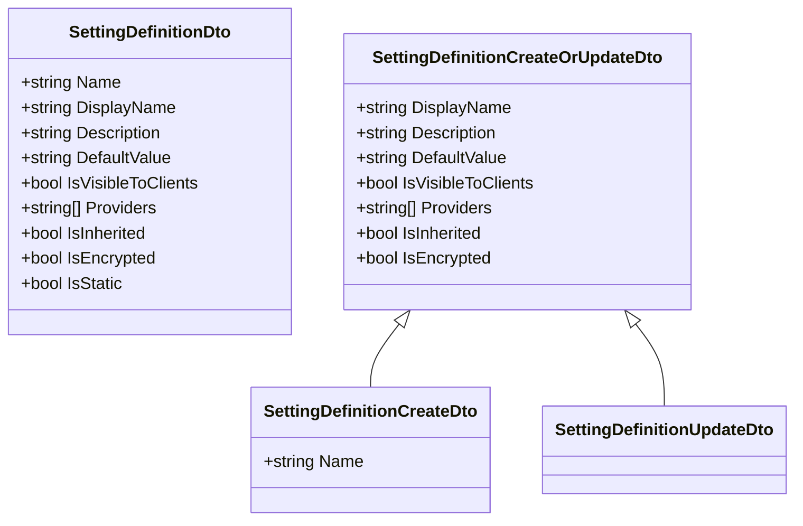
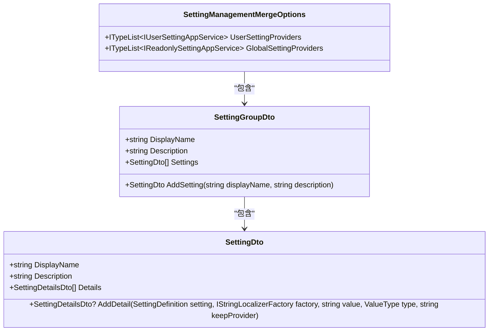
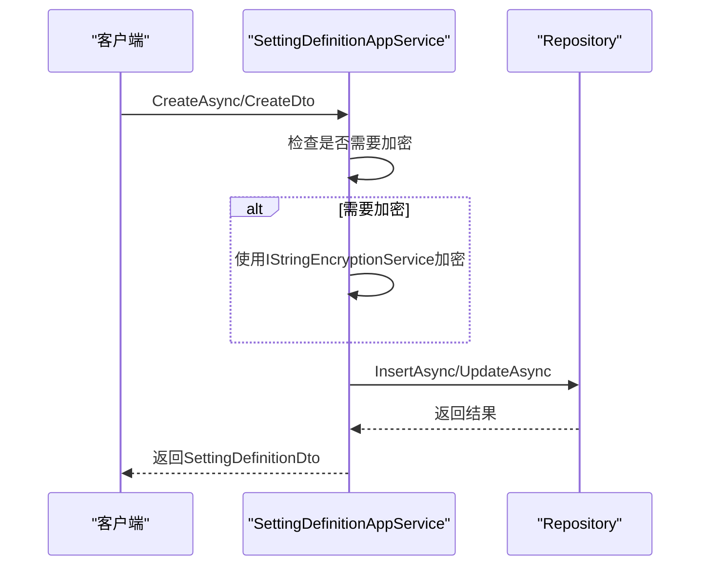

# 系统配置

<cite>
**本文档中引用的文件**
- [SettingDefinitionAppService.cs](file://aspnet-core/modules/settings/LINGYUN.Abp.SettingManagement.Application/LINGYUN/Abp/SettingManagement/SettingDefinitionAppService.cs)
- [ISettingDefinitionAppService.cs](file://aspnet-core/modules/settings/LINGYUN.Abp.SettingManagement.Application/LINGYUN/Abp/SettingManagement/ISettingDefinitionAppService.cs)
- [SettingDefinitionDto.cs](file://aspnet-core/modules/settings/LINGYUN.Abp.SettingManagement.Application/LINGYUN/Abp/SettingManagement/Dto/SettingDefinitionDto.cs)
- [SettingDefinitionCreateOrUpdateDto.cs](file://aspnet-core/modules/settings/LINGYUN.Abp.SettingManagement.Application/LINGYUN/Abp/SettingManagement/Dto/SettingDefinitionCreateOrUpdateDto.cs)
- [SettingGroupDto.cs](file://aspnet-core/framework/settings/LINGYUN.Abp.SettingManagement.Application.Contracts/LINGYUN/Abp/SettingManagement/Dto/SettingGroupDto.cs)
- [SettingManagementMergeOptions.cs](file://aspnet-core/framework/settings/LINGYUN.Abp.SettingManagement.Application.Contracts/LINGYUN/Abp/SettingManagement/SettingManagementMergeOptions.cs)
</cite>

## 目录
1. [系统配置](#系统配置)
2. [核心组件](#核心组件)
3. [配置项定义与管理](#配置项定义与管理)
4. [多层级配置优先级](#多层级配置优先级)
5. [配置变更实时生效机制](#配置变更实时生效机制)
6. [安全控制与审计](#安全控制与审计)
7. [API接口文档](#api接口文档)
8. [后台界面配置管理](#后台界面配置管理)

## 核心组件

系统配置模块的核心组件包括配置定义服务、配置项数据传输对象（DTO）以及配置分组管理。`SettingDefinitionAppService` 类作为配置管理的核心服务，实现了 `ISettingDefinitionAppService` 接口，提供了配置项的增删改查功能。该服务通过依赖注入获取 `IStringEncryptionService`、`ISettingDefinitionManager` 等服务，实现配置项的加密存储和定义管理。

**本节来源**
- [SettingDefinitionAppService.cs](file://aspnet-core/modules/settings/LINGYUN.Abp.SettingManagement.Application/LINGYUN/Abp/SettingManagement/SettingDefinitionAppService.cs#L1-L31)
- [ISettingDefinitionAppService.cs](file://aspnet-core/modules/settings/LINGYUN.Abp.SettingManagement.Application/LINGYUN/Abp/SettingManagement/ISettingDefinitionAppService.cs#L1-L17)

## 配置项定义与管理

配置项的定义与管理通过 `SettingDefinitionDto` 和 `SettingDefinitionCreateOrUpdateDto` 两个数据传输对象实现。`SettingDefinitionDto` 用于表示配置项的详细信息，包括名称、显示名称、描述、默认值、是否对客户端可见、提供者列表、是否继承、是否加密以及是否为静态配置等属性。`SettingDefinitionCreateOrUpdateDto` 作为创建和更新配置项的输入模型，包含了显示名称、描述、默认值、可见性、提供者、继承性、加密性等可配置属性。

**图表来源**
- [SettingDefinitionDto.cs](file://aspnet-core/modules/settings/LINGYUN.Abp.SettingManagement.Application/LINGYUN/Abp/SettingManagement/Dto/SettingDefinitionDto.cs#L1-L28)
- [SettingDefinitionCreateOrUpdateDto.cs](file://aspnet-core/modules/settings/LINGYUN.Abp.SettingManagement.Application/LINGYUN/Abp/SettingManagement/Dto/SettingDefinitionCreateOrUpdateDto.cs#L1-L34)

**本节来源**
- [SettingDefinitionDto.cs](file://aspnet-core/modules/settings/LINGYUN.Abp.SettingManagement.Application/LINGYUN/Abp/SettingManagement/Dto/SettingDefinitionDto.cs#L1-L28)
- [SettingDefinitionCreateOrUpdateDto.cs](file://aspnet-core/modules/settings/LINGYUN.Abp.SettingManagement.Application/LINGYUN/Abp/SettingManagement/Dto/SettingDefinitionCreateOrUpdateDto.cs#L1-L34)

## 多层级配置优先级

系统支持全局、租户、用户三个层级的配置优先级管理。通过 `SettingManagementMergeOptions` 类中的 `UserSettingProviders` 和 `GlobalSettingProviders` 属性，系统能够合并不同层级的配置提供者。配置项的优先级遵循用户级 > 租户级 > 全局级的原则，确保更具体的配置能够覆盖更通用的配置。`SettingGroupDto` 类用于组织和管理配置分组，每个分组包含多个配置项，便于在界面中进行分类展示和管理。

**图表来源**
- [SettingManagementMergeOptions.cs](file://aspnet-core/framework/settings/LINGYUN.Abp.SettingManagement.Application.Contracts/LINGYUN/Abp/SettingManagement/SettingManagementMergeOptions.cs#L1-L12)
- [SettingGroupDto.cs](file://aspnet-core/framework/settings/LINGYUN.Abp.SettingManagement.Application.Contracts/LINGYUN/Abp/SettingManagement/Dto/SettingGroupDto.cs#L1-L29)

**本节来源**
- [SettingManagementMergeOptions.cs](file://aspnet-core/framework/settings/LINGYUN.Abp.SettingManagement.Application.Contracts/LINGYUN/Abp/SettingManagement/SettingManagementMergeOptions.cs#L1-L12)
- [SettingGroupDto.cs](file://aspnet-core/framework/settings/LINGYUN.Abp.SettingManagement.Application.Contracts/LINGYUN/Abp/SettingManagement/Dto/SettingGroupDto.cs#L1-L29)

## 配置变更实时生效机制

配置变更的实时生效机制通过 `SettingDefinitionAppService` 类中的 `CreateAsync` 和 `UpdateAsync` 方法实现。当创建或更新配置项时，系统会检查配置项的默认值是否需要加密，如果需要则使用 `IStringEncryptionService` 进行加密处理。更新操作会比较新旧值的差异，仅当值发生变化时才进行数据库更新，以提高性能。配置项的变更会立即保存到数据库，并通过缓存机制确保在应用中实时生效。

**图表来源**
- [SettingDefinitionAppService.cs](file://aspnet-core/modules/settings/LINGYUN.Abp.SettingManagement.Application/LINGYUN/Abp/SettingManagement/SettingDefinitionAppService.cs#L148-L183)
- [SettingDefinitionAppService.cs](file://aspnet-core/modules/settings/LINGYUN.Abp.SettingManagement.Application/LINGYUN/Abp/SettingManagement/SettingDefinitionAppService.cs#L179-L212)

**本节来源**
- [SettingDefinitionAppService.cs](file://aspnet-core/modules/settings/LINGYUN.Abp.SettingManagement.Application/LINGYUN/Abp/SettingManagement/SettingDefinitionAppService.cs#L148-L183)
- [SettingDefinitionAppService.cs](file://aspnet-core/modules/settings/LINGYUN.Abp.SettingManagement.Application/LINGYUN/Abp/SettingManagement/SettingDefinitionAppService.cs#L179-L212)

## 安全控制与审计

系统配置模块的安全控制通过 `Authorize` 特性实现，`SettingDefinitionAppService` 类上的 `[Authorize(SettingManagementPermissions.Definition.Default)]` 确保只有具有相应权限的用户才能进行配置项的管理操作。配置项的加密存储通过 `IStringEncryptionService` 实现，敏感配置项的值在存储前会被加密，确保数据安全。系统还通过 `ExtraProperties` 字典支持配置项的扩展属性，便于审计和追踪配置变更历史。

**本节来源**
- [SettingDefinitionAppService.cs](file://aspnet-core/modules/settings/LINGYUN.Abp.SettingManagement.Application/LINGYUN/Abp/SettingManagement/SettingDefinitionAppService.cs#L1-L31)
- [SettingDefinitionCreateOrUpdateDto.cs](file://aspnet-core/modules/settings/LINGYUN.Abp.SettingManagement.Application/LINGYUN/Abp/SettingManagement/Dto/SettingDefinitionCreateOrUpdateDto.cs#L1-L34)

## API接口文档

系统配置模块提供了完整的API接口，用于配置项的管理。主要接口包括：
- `GetAsync(string name)`：根据名称获取单个配置项
- `GetListAsync(SettingDefinitionGetListInput input)`：根据条件获取配置项列表
- `CreateAsync(SettingDefinitionCreateDto input)`：创建新的配置项
- `UpdateAsync(string name, SettingDefinitionUpdateDto input)`：更新指定名称的配置项
- `DeleteOrRestoreAsync(string name)`：删除或恢复指定名称的配置项

这些接口通过 `ISettingDefinitionAppService` 接口定义，并由 `SettingDefinitionAppService` 类实现，支持异步操作，确保高并发场景下的性能。

**本节来源**
- [ISettingDefinitionAppService.cs](file://aspnet-core/modules/settings/LINGYUN.Abp.SettingManagement.Application/LINGYUN/Abp/SettingManagement/ISettingDefinitionAppService.cs#L1-L17)

## 后台界面配置管理

后台界面的配置管理通过 `SettingGroupDto` 和 `SettingDto` 类实现配置项的分组和展示。每个配置分组包含一个显示名称和描述，以及多个配置项。配置项在界面中以列表形式展示，支持对配置项的增删改查操作。通过 `AddSetting` 方法可以向配置分组中添加新的配置项，便于在界面中动态构建配置管理页面。

**本节来源**
- [SettingGroupDto.cs](file://aspnet-core/framework/settings/LINGYUN.Abp.SettingManagement.Application.Contracts/LINGYUN/Abp/SettingManagement/Dto/SettingGroupDto.cs#L1-L29)
- [SettingDto.cs](file://aspnet-core/framework/settings/LINGYUN.Abp.SettingManagement.Application.Contracts/LINGYUN/Abp/SettingManagement/Dto/SettingDto.cs#L1-L63)