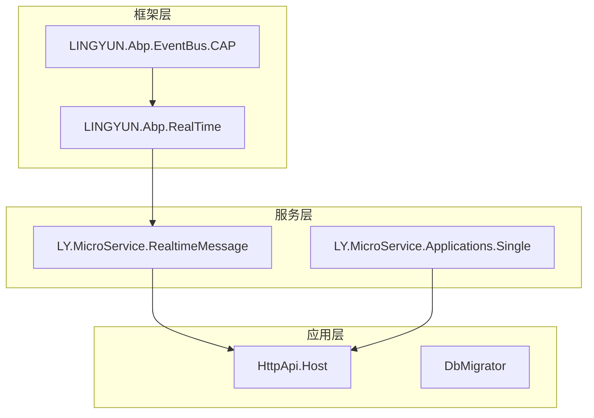
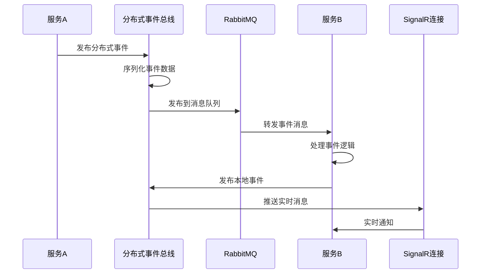
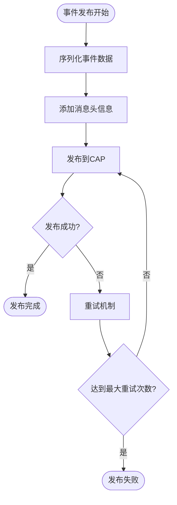
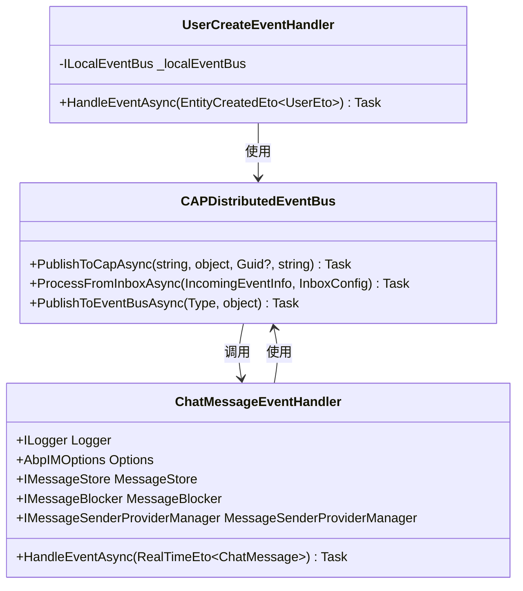
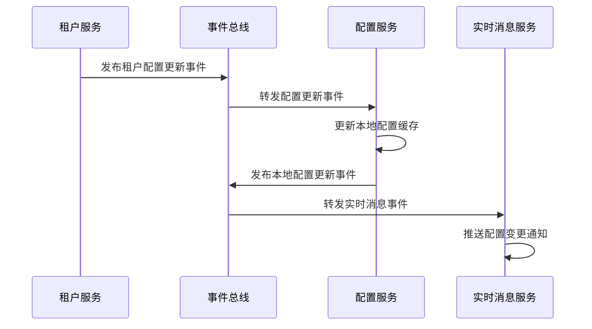
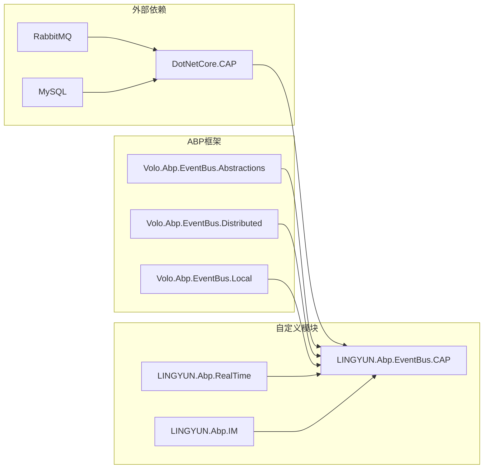

# 事件总线集成

<cite>
**本文档中引用的文件**
- [CAPDistributedEventBus.cs](file://aspnet-core/framework/common/LINGYUN.Abp.EventBus.CAP/LINGYUN/Abp/EventBus/CAP/CAPDistributedEventBus.cs)
- [RealTimeEto.cs](file://aspnet-core/framework/common/LINGYUN.Abp.RealTime/LINGYUN/Abp/RealTime/RealTimeEto.cs)
- [UserCreateEventHandler.cs](file://aspnet-core/services/LY.MicroService.RealtimeMessage.HttpApi.Host/EventBus/Distributed/UserCreateEventHandler.cs)
- [ChatMessageEventHandler.cs](file://aspnet-core/services/LY.MicroService.Applications.Single/EventBus/Distributed/ChatMessageEventHandler.cs)
- [AbpRealTimeModule.cs](file://aspnet-core/framework/common/LINGYUN.Abp.RealTime/LINGYUN/Abp/RealTime/AbpRealTimeModule.cs)
- [RealtimeMessageHttpApiHostModule.Configure.cs](file://aspnet-core/services/LY.MicroService.RealtimeMessage.HttpApi.Host/RealtimeMessageHttpApiHostModule.Configure.cs)
- [AbpCAPEventBusOptions.cs](file://aspnet-core/framework/common/LINGYUN.Abp.EventBus.CAP/LINGYUN/Abp/EventBus/CAP/AbpCAPEventBusOptions.cs)
</cite>

## 目录
1. [简介](#简介)
2. [项目结构](#项目结构)
3. [核心组件](#核心组件)
4. [架构概览](#架构概览)
5. [详细组件分析](#详细组件分析)
6. [依赖关系分析](#依赖关系分析)
7. [性能考虑](#性能考虑)
8. [故障排除指南](#故障排除指南)
9. [结论](#结论)

## 简介

事件总线集成是ABP Next Admin框架中的核心通信机制，它通过分布式事件总线实现了微服务之间的实时消息传递和事件处理。该系统基于CAP（Consistency, Availability, and Partition tolerance）模式，提供了可靠的消息传递、事件序列化、传输安全和错误重试策略。

本文档深入解释了实时消息服务如何通过分布式事件总线与其他微服务进行通信，描述租户配置同步机制和用户创建事件的处理流程，详细说明本地事件和分布式事件的区别及使用场景，并提供实际代码示例展示如何订阅和处理来自其他服务的事件，并触发相应的实时消息推送。

## 项目结构

事件总线集成在ABP Next Admin框架中采用分层架构设计，主要包含以下关键目录：



**图表来源**
- [CAPDistributedEventBus.cs](file://aspnet-core/framework/common/LINGYUN.Abp.EventBus.CAP/LINGYUN/Abp/EventBus/CAP/CAPDistributedEventBus.cs#L1-L50)
- [AbpRealTimeModule.cs](file://aspnet-core/framework/common/LINGYUN.Abp.RealTime/LINGYUN/Abp/RealTime/AbpRealTimeModule.cs#L1-L8)

**章节来源**
- [CAPDistributedEventBus.cs](file://aspnet-core/framework/common/LINGYUN.Abp.EventBus.CAP/LINGYUN/Abp/EventBus/CAP/CAPDistributedEventBus.cs#L1-L297)
- [RealTimeEto.cs](file://aspnet-core/framework/common/LINGYUN.Abp.RealTime/LINGYUN/Abp/RealTime/RealTimeEto.cs#L1-L21)

## 核心组件

### CAP分布式事件总线

CAP分布式事件总线是整个事件系统的核心组件，它继承自`DistributedEventBusBase`并实现了`IDistributedEventBus`接口。该组件负责：

- **消息发布与订阅**：通过CAP框架实现分布式消息的发布和订阅
- **事件序列化**：使用JSON序列化器对事件数据进行序列化和反序列化
- **事务一致性**：确保事件发布与数据库操作的事务一致性
- **错误处理**：提供重试机制和错误回调处理

```csharp
[Dependency(ServiceLifetime.Singleton, ReplaceServices = true)]
[ExposeServices(typeof(IDistributedEventBus), typeof(CAPDistributedEventBus))]
public class CAPDistributedEventBus : DistributedEventBusBase, IDistributedEventBus
{
    protected ICapPublisher CapPublisher { get; }
    protected ICustomDistributedEventSubscriber CustomDistributedEventSubscriber { get; }
    protected ConcurrentDictionary<Type, List<IEventHandlerFactory>> HandlerFactories { get; }
    protected ConcurrentDictionary<string, Type> EventTypes { get; }
}
```

### 实时事件实体

`RealTimeEto<T>`是实时事件的标准实体类，它封装了需要实时传输的数据：

```csharp
[Serializable]
[GenericEventName(Prefix = "abp.realtime.")]
public class RealTimeEto<T> : EtoBase
{
    public T Data { get; set; }
    public RealTimeEto() : base() { }
    public RealTimeEto(T data) : base() { Data = data; }
}
```

**章节来源**
- [CAPDistributedEventBus.cs](file://aspnet-core/framework/common/LINGYUN.Abp.EventBus.CAP/LINGYUN/Abp/EventBus/CAP/CAPDistributedEventBus.cs#L25-L45)
- [RealTimeEto.cs](file://aspnet-core/framework/common/LINGYUN.Abp.RealTime/LINGYUN/Abp/RealTime/RealTimeEto.cs#L8-L20)

## 架构概览

事件总线集成采用多层架构设计，支持本地事件和分布式事件的混合使用：



**图表来源**
- [CAPDistributedEventBus.cs](file://aspnet-core/framework/common/LINGYUN.Abp.EventBus.CAP/LINGYUN/Abp/EventBus/CAP/CAPDistributedEventBus.cs#L150-L200)
- [ChatMessageEventHandler.cs](file://aspnet-core/services/LY.MicroService.Applications.Single/EventBus/Distributed/ChatMessageEventHandler.cs#L35-L55)

## 详细组件分析

### 事件发布机制

事件发布机制分为两个层次：分布式事件发布和本地事件发布。

#### 分布式事件发布

分布式事件发布通过CAP框架实现，支持跨服务通信：



**图表来源**
- [CAPDistributedEventBus.cs](file://aspnet-core/framework/common/LINGYUN.Abp.EventBus.CAP/LINGYUN/Abp/EventBus/CAP/CAPDistributedEventBus.cs#L250-L297)

#### 本地事件发布

本地事件发布用于同一服务内的组件通信：

```csharp
public async Task HandleEventAsync(EntityCreatedEto<UserEto> eventData)
{
    var localUserCreateEventData = new EntityCreatedEventData<UserEto>(eventData.Entity);
    await _localEventBus.PublishAsync(localUserCreateEventData);
}
```

### 事件处理流程

事件处理流程展示了从事件接收到底层消息推送的完整过程：



**图表来源**
- [UserCreateEventHandler.cs](file://aspnet-core/services/LY.MicroService.RealtimeMessage.HttpApi.Host/EventBus/Distributed/UserCreateEventHandler.cs#L10-L30)
- [ChatMessageEventHandler.cs](file://aspnet-core/services/LY.MicroService.Applications.Single/EventBus/Distributed/ChatMessageEventHandler.cs#L10-L50)

**章节来源**
- [UserCreateEventHandler.cs](file://aspnet-core/services/LY.MicroService.RealtimeMessage.HttpApi.Host/EventBus/Distributed/UserCreateEventHandler.cs#L20-L30)
- [ChatMessageEventHandler.cs](file://aspnet-core/services/LY.MicroService.Applications.Single/EventBus/Distributed/ChatMessageEventHandler.cs#L35-L55)

### 租户配置同步机制

租户配置同步通过分布式事件实现，确保多租户环境下的配置一致性：



**图表来源**
- [UserCreateEventHandler.cs](file://aspnet-core/services/LY.MicroService.RealtimeMessage.HttpApi.Host/EventBus/Distributed/UserCreateEventHandler.cs#L20-L30)

### 实时消息推送

实时消息推送通过SignalR实现，结合事件总线提供即时通信能力：

```csharp
public async virtual Task HandleEventAsync(RealTimeEto<ChatMessage> eventData)
{
    Logger.LogDebug($"Persistent chat message.");
    
    var message = eventData.Data;
    // 消息拦截
    await MessageBlocker.InterceptAsync(message);
    
    await MessageStore.StoreMessageAsync(message);
    
    // 发送消息
    foreach (var provider in MessageSenderProviderManager.Providers)
    {
        Logger.LogDebug($"Sending message with provider {provider.Name}");
        await provider.SendMessageAsync(message);
    }
}
```

**章节来源**
- [ChatMessageEventHandler.cs](file://aspnet-core/services/LY.MicroService.Applications.Single/EventBus/Distributed/ChatMessageEventHandler.cs#L35-L55)

## 依赖关系分析

事件总线集成的依赖关系展现了系统的模块化设计：



**图表来源**
- [CAPDistributedEventBus.cs](file://aspnet-core/framework/common/LINGYUN.Abp.EventBus.CAP/LINGYUN/Abp/EventBus/CAP/CAPDistributedEventBus.cs#L1-L20)

**章节来源**
- [CAPDistributedEventBus.cs](file://aspnet-core/framework/common/LINGYUN.Abp.EventBus.CAP/LINGYUN/Abp/EventBus/CAP/CAPDistributedEventBus.cs#L1-L25)

## 性能考虑

### 消息序列化优化

系统采用高效的JSON序列化策略，支持多种序列化器：

- **System.Text.Json**：高性能JSON序列化
- **Newtonsoft.Json**：兼容性更好的JSON序列化
- **自定义编码器**：支持中文字符的正确编码

### 并发处理机制

事件总线使用`ConcurrentDictionary`确保线程安全：

```csharp
protected ConcurrentDictionary<Type, List<IEventHandlerFactory>> HandlerFactories { get; }
protected ConcurrentDictionary<string, Type> EventTypes { get; }
```

### 缓存策略

系统实现了多级缓存策略：
- **事件类型缓存**：缓存事件类型映射关系
- **处理器工厂缓存**：缓存事件处理器工厂
- **配置缓存**：缓存租户配置信息

## 故障排除指南

### 常见问题及解决方案

#### 1. 事件发布失败

**症状**：事件无法正常发布到消息队列
**原因**：网络连接问题或消息队列配置错误
**解决方案**：
- 检查RabbitMQ连接配置
- 验证CAP配置参数
- 查看日志中的具体错误信息

#### 2. 事件处理超时

**症状**：事件处理时间过长导致超时
**原因**：事件处理逻辑复杂或外部服务响应慢
**解决方案**：
- 优化事件处理逻辑
- 引入异步处理机制
- 设置合理的超时时间

#### 3. 消息重复消费

**症状**：同一条消息被多次处理
**原因**：消息确认机制配置不当
**解决方案**：
- 启用消息确认机制
- 实现幂等性处理逻辑
- 使用消息去重策略

**章节来源**
- [CAPDistributedEventBus.cs](file://aspnet-core/framework/common/LINGYUN.Abp.EventBus.CAP/LINGYUN/Abp/EventBus/CAP/CAPDistributedEventBus.cs#L250-L297)

## 结论

事件总线集成为ABP Next Admin框架提供了强大的分布式通信能力。通过CAP框架的支持，系统实现了高可用性和最终一致性保证。实时消息服务通过事件总线与其他微服务无缝集成，提供了完整的租户配置同步和用户创建事件处理机制。

该架构具有以下优势：
- **可扩展性**：支持水平扩展和微服务部署
- **可靠性**：提供消息持久化和重试机制
- **实时性**：结合SignalR实现实时消息推送
- **安全性**：支持消息加密和身份验证

通过合理配置和使用事件总线集成，开发者可以构建高效、可靠的分布式应用程序。