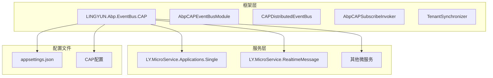
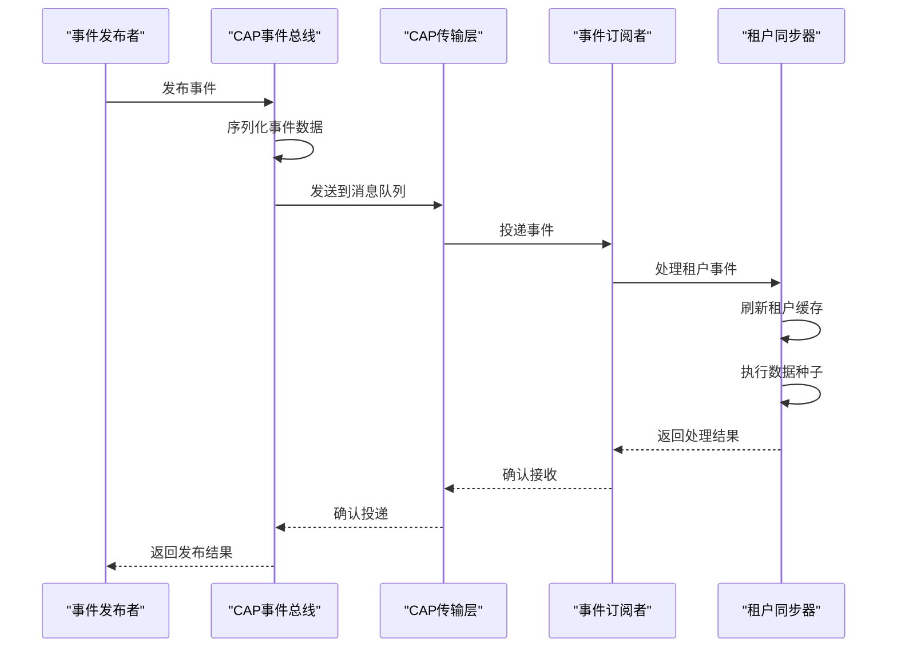
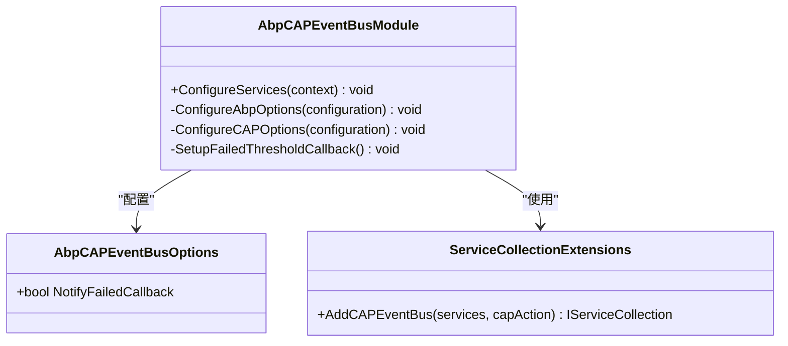
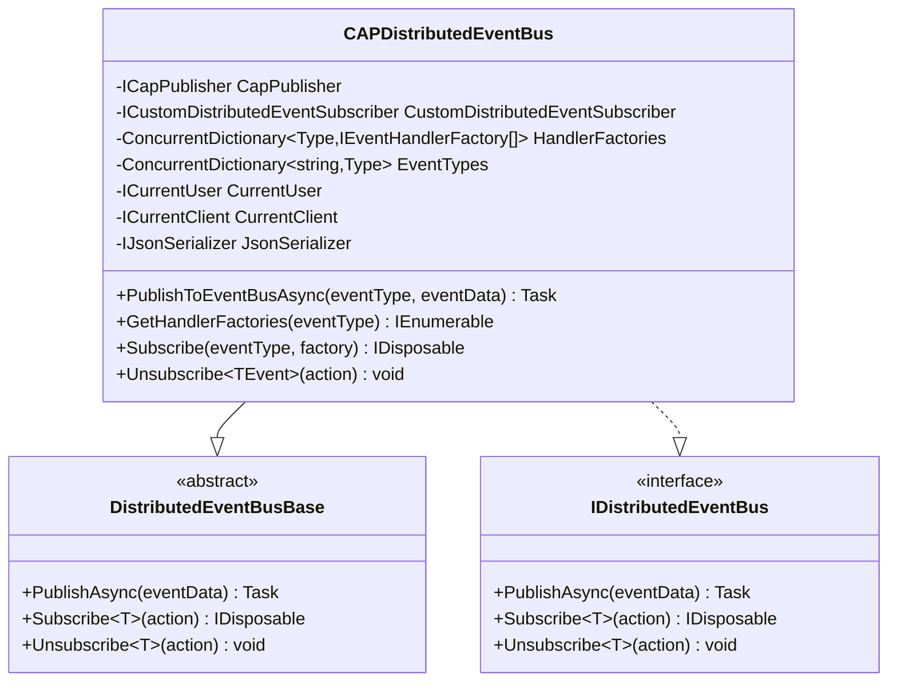
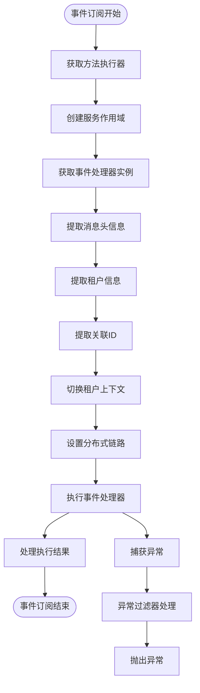
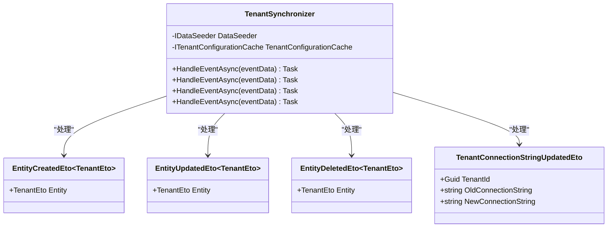
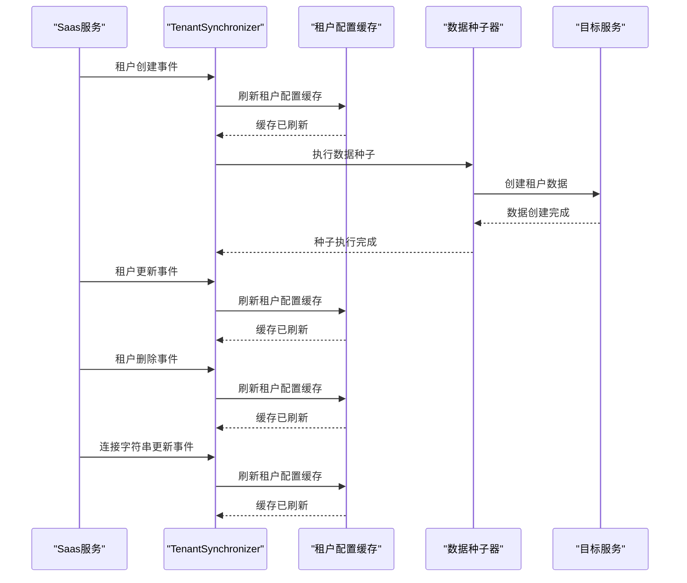
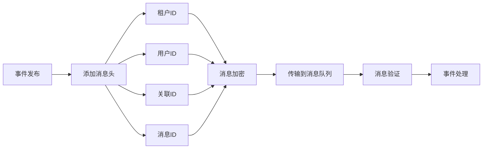
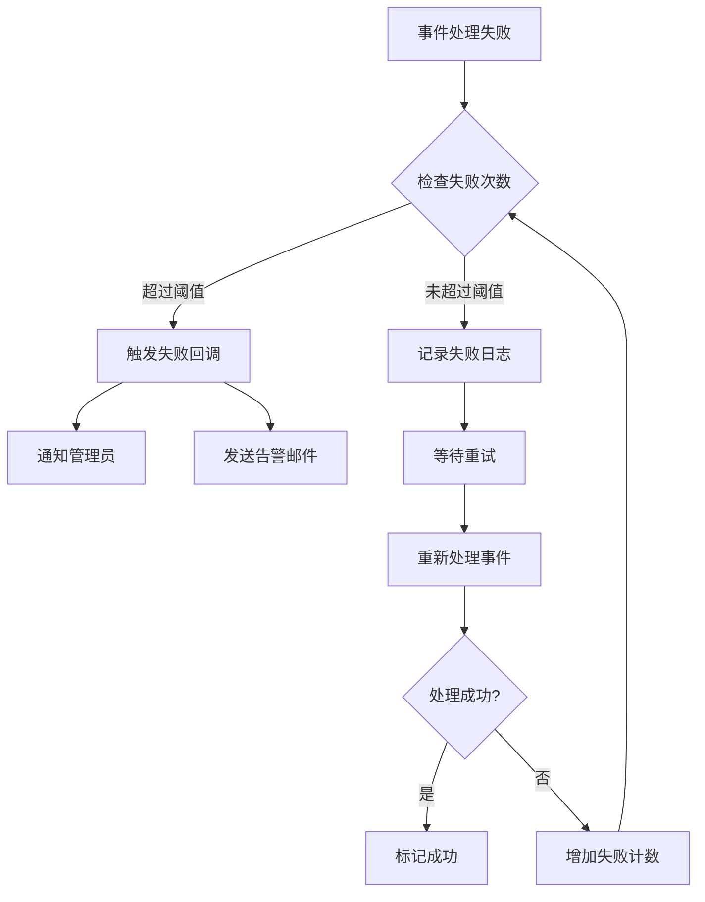

# 分布式事件总线

<cite>
**本文档引用的文件**
- [AbpCAPEventBusModule.cs](file://aspnet-core/framework/common/LINGYUN.Abp.EventBus.CAP/LINGYUN/Abp/EventBus/CAP/AbpCAPEventBusModule.cs)
- [AbpCAPSubscribeInvoker.cs](file://aspnet-core/framework/common/LINGYUN.Abp.EventBus.CAP/LINGYUN/Abp/EventBus/CAP/AbpCAPSubscribeInvoker.cs)
- [CAPDistributedEventBus.cs](file://aspnet-core/framework/common/LINGYUN.Abp.EventBus.CAP/LINGYUN/Abp/EventBus/CAP/CAPDistributedEventBus.cs)
- [TenantSynchronizer.cs](file://aspnet-core/services/LY.MicroService.Applications.Single/EventBus/Distributed/TenantSynchronizer.cs)
- [AbpCAPMessageExtensions.cs](file://aspnet-core/framework/common/LINGYUN.Abp.EventBus.CAP/LINGYUN/Abp/EventBus/CAP/AbpCAPMessageExtensions.cs)
- [AbpCAPHeaders.cs](file://aspnet-core/framework/common/LINGYUN.Abp.EventBus.CAP/LINGYUN/Abp/EventBus/CAP/AbpCAPHeaders.cs)
- [AbpCAPEventBusOptions.cs](file://aspnet-core/framework/common/LINGYUN.Abp.EventBus.CAP/LINGYUN/Abp/EventBus/CAP/AbpCAPEventBusOptions.cs)
- [appsettings.json](file://aspnet-core/services/LY.MicroService.Applications.Single/appsettings.json)
</cite>

## 目录
1. [简介](#简介)
2. [项目结构](#项目结构)
3. [核心组件](#核心组件)
4. [架构概览](#架构概览)
5. [详细组件分析](#详细组件分析)
6. [事件发布与订阅](#事件发布与订阅)
7. [租户配置同步机制](#租户配置同步机制)
8. [序列化与传输安全](#序列化与传输安全)
9. [错误处理与重试机制](#错误处理与重试机制)
10. [性能考虑](#性能考虑)
11. [故障排除指南](#故障排除指南)
12. [结论](#结论)

## 简介

分布式事件总线是现代微服务架构中的关键基础设施，它提供了服务间异步通信的能力。本文档深入介绍了基于CAP（Cloud Events Application Protocol）的分布式事件总线实现，重点描述了实时消息服务如何通过CAP分布式事件总线与其他微服务进行通信。

CAP是一个轻量级的消息队列解决方案，专为.NET生态系统设计。它提供了发布-订阅模式的消息传递能力，支持多种传输协议，并具有强大的错误处理和重试机制。在本系统中，CAP被用来实现租户配置同步、事件分发和跨服务通信等核心功能。

## 项目结构

分布式事件总线的实现主要集中在以下目录结构中：

**图表来源**
- [AbpCAPEventBusModule.cs](file://aspnet-core/framework/common/LINGYUN.Abp.EventBus.CAP/LINGYUN/Abp/EventBus/CAP/AbpCAPEventBusModule.cs#L1-L52)
- [CAPDistributedEventBus.cs](file://aspnet-core/framework/common/LINGYUN.Abp.EventBus.CAP/LINGYUN/Abp/EventBus/CAP/CAPDistributedEventBus.cs#L1-L297)

**章节来源**
- [AbpCAPEventBusModule.cs](file://aspnet-core/framework/common/LINGYUN.Abp.EventBus.CAP/LINGYUN/Abp/EventBus/CAP/AbpCAPEventBusModule.cs#L1-L52)
- [appsettings.json](file://aspnet-core/services/LY.MicroService.Applications.Single/appsettings.json#L1-L96)

## 核心组件

分布式事件总线系统包含以下核心组件：

### 1. AbpCAPEventBusModule
这是CAP事件总线的主要模块，负责配置和初始化整个事件总线系统。

### 2. CAPDistributedEventBus
实现了IDistributedEventBus接口，提供了事件发布的统一入口点。

### 3. AbpCAPSubscribeInvoker
重写了CAP的默认订阅器，增加了对多租户、分布式链路追踪等功能的支持。

### 4. TenantSynchronizer
专门用于处理租户相关事件的同步器，确保租户配置的一致性。

**章节来源**
- [AbpCAPEventBusModule.cs](file://aspnet-core/framework/common/LINGYUN.Abp.EventBus.CAP/LINGYUN/Abp/EventBus/CAP/AbpCAPEventBusModule.cs#L1-L52)
- [CAPDistributedEventBus.cs](file://aspnet-core/framework/common/LINGYUN.Abp.EventBus.CAP/LINGYUN/Abp/EventBus/CAP/CAPDistributedEventBus.cs#L1-L297)
- [AbpCAPSubscribeInvoker.cs](file://aspnet-core/framework/common/LINGYUN.Abp.EventBus.CAP/LINGYUN/Abp/EventBus/CAP/AbpCAPSubscribeInvoker.cs#L1-L278)

## 架构概览

分布式事件总线采用发布-订阅模式，通过CAP作为底层传输机制：

**图表来源**
- [CAPDistributedEventBus.cs](file://aspnet-core/framework/common/LINGYUN.Abp.EventBus.CAP/LINGYUN/Abp/EventBus/CAP/CAPDistributedEventBus.cs#L150-L178)
- [AbpCAPSubscribeInvoker.cs](file://aspnet-core/framework/common/LINGYUN.Abp.EventBus.CAP/LINGYUN/Abp/EventBus/CAP/AbpCAPSubscribeInvoker.cs#L50-L150)

## 详细组件分析

### AbpCAPEventBusModule 分析

AbpCAPEventBusModule是整个CAP事件总线系统的入口点，负责配置和初始化：

**图表来源**
- [AbpCAPEventBusModule.cs](file://aspnet-core/framework/common/LINGYUN.Abp.EventBus.CAP/LINGYUN/Abp/EventBus/CAP/AbpCAPEventBusModule.cs#L1-L52)
- [AbpCAPEventBusOptions.cs](file://aspnet-core/framework/common/LINGYUN.Abp.EventBus.CAP/LINGYUN/Abp/EventBus/CAP/AbpCAPEventBusOptions.cs#L1-L12)

该模块的主要职责包括：
- 加载CAP配置选项
- 注册失败阈值回调通知器
- 配置CAP事件总线选项
- 设置失败处理回调函数

**章节来源**
- [AbpCAPEventBusModule.cs](file://aspnet-core/framework/common/LINGYUN.Abp.EventBus.CAP/LINGYUN/Abp/EventBus/CAP/AbpCAPEventBusModule.cs#L1-L52)

### CAPDistributedEventBus 分析

CAPDistributedEventBus是事件总线的核心实现，继承自DistributedEventBusBase：

**图表来源**
- [CAPDistributedEventBus.cs](file://aspnet-core/framework/common/LINGYUN.Abp.EventBus.CAP/LINGYUN/Abp/EventBus/CAP/CAPDistributedEventBus.cs#L25-L100)

**章节来源**
- [CAPDistributedEventBus.cs](file://aspnet-core/framework/common/LINGYUN.Abp.EventBus.CAP/LINGYUN/Abp/EventBus/CAP/CAPDistributedEventBus.cs#L1-L297)

### AbpCAPSubscribeInvoker 分析

AbpCAPSubscribeInvoker负责处理事件订阅和执行，特别增强了对多租户和分布式链路的支持：

**图表来源**
- [AbpCAPSubscribeInvoker.cs](file://aspnet-core/framework/common/LINGYUN.Abp.EventBus.CAP/LINGYUN/Abp/EventBus/CAP/AbpCAPSubscribeInvoker.cs#L50-L200)

**章节来源**
- [AbpCAPSubscribeInvoker.cs](file://aspnet-core/framework/common/LINGYUN.Abp.EventBus.CAP/LINGYUN/Abp/EventBus/CAP/AbpCAPSubscribeInvoker.cs#L1-L278)

## 事件发布与订阅

### 事件发布流程

事件发布遵循以下步骤：

1. **事件序列化**：将事件对象转换为JSON格式
2. **消息头添加**：添加租户ID、关联ID等元数据
3. **消息发送**：通过CAP传输到消息队列
4. **确认机制**：等待消息确认或处理失败

### 事件订阅流程

事件订阅包含以下关键步骤：

1. **消息接收**：从消息队列接收事件消息
2. **租户上下文切换**：根据消息头中的租户ID切换租户
3. **事件反序列化**：将JSON消息转换为事件对象
4. **处理器调用**：执行相应的事件处理器
5. **结果处理**：处理执行结果并返回确认

**章节来源**
- [CAPDistributedEventBus.cs](file://aspnet-core/framework/common/LINGYUN.Abp.EventBus.CAP/LINGYUN/Abp/EventBus/CAP/CAPDistributedEventBus.cs#L150-L178)
- [AbpCAPSubscribeInvoker.cs](file://aspnet-core/framework/common/LINGYUN.Abp.EventBus.CAP/LINGYUN/Abp/EventBus/CAP/AbpCAPSubscribeInvoker.cs#L50-L150)

## 租户配置同步机制

TenantSynchronizer类实现了租户配置同步的核心逻辑：

**图表来源**
- [TenantSynchronizer.cs](file://aspnet-core/services/LY.MicroService.Applications.Single/EventBus/Distributed/TenantSynchronizer.cs#L1-L54)

### 租户同步工作流程

**图表来源**
- [TenantSynchronizer.cs](file://aspnet-core/services/LY.MicroService.Applications.Single/EventBus/Distributed/TenantSynchronizer.cs#L25-L54)

**章节来源**
- [TenantSynchronizer.cs](file://aspnet-core/services/LY.MicroService.Applications.Single/EventBus/Distributed/TenantSynchronizer.cs#L1-L54)

## 序列化与传输安全

### 消息序列化格式

CAP事件总线使用JSON格式进行消息序列化，支持以下特性：

1. **标准JSON序列化**：使用IJsonSerializer接口
2. **类型安全**：保持事件对象的类型信息
3. **扩展性**：支持自定义序列化器

### 传输安全机制

**图表来源**
- [AbpCAPHeaders.cs](file://aspnet-core/framework/common/LINGYUN.Abp.EventBus.CAP/LINGYUN/Abp/EventBus/CAP/AbpCAPHeaders.cs#L1-L15)
- [AbpCAPMessageExtensions.cs](file://aspnet-core/framework/common/LINGYUN.Abp.EventBus.CAP/LINGYUN/Abp/EventBus/CAP/AbpCAPMessageExtensions.cs#L1-L72)

### 消息头管理

系统定义了标准的消息头常量：

- `cap-abp-tenant-id`: 租户标识
- `cap-abp-user-id`: 用户标识  
- `cap-abp-correlation-id`: 关联ID
- `cap-abp-message-id`: 消息唯一标识
- `cap-abp-client-id`: 客户端标识

**章节来源**
- [AbpCAPHeaders.cs](file://aspnet-core/framework/common/LINGYUN.Abp.EventBus.CAP/LINGYUN/Abp/EventBus/CAP/AbpCAPHeaders.cs#L1-L15)
- [AbpCAPMessageExtensions.cs](file://aspnet-core/framework/common/LINGYUN.Abp.EventBus.CAP/LINGYUN/Abp/EventBus/CAP/AbpCAPMessageExtensions.cs#L1-L72)

## 错误处理与重试机制

### 失败阈值回调

系统实现了智能的失败处理机制：

### 重试策略

1. **指数退避**：失败后等待时间逐渐增加
2. **最大重试次数**：防止无限重试导致资源耗尽
3. **死信队列**：永久失败的消息进入死信队列
4. **监控告警**：自动监控失败率并发送告警

**章节来源**
- [AbpCAPEventBusModule.cs](file://aspnet-core/framework/common/LINGYUN.Abp.EventBus.CAP/LINGYUN/Abp/EventBus/CAP/AbpCAPEventBusModule.cs#L25-L45)

## 性能考虑

### 并发处理

- 使用ConcurrentDictionary确保线程安全
- 异步处理避免阻塞主线程
- 服务作用域隔离减少内存占用

### 缓存优化

- 租户配置缓存减少数据库查询
- 事件处理器缓存提高响应速度
- 内存池化减少GC压力

### 资源管理

- 及时释放事件处理器实例
- 合理配置连接池大小
- 监控内存使用情况

## 故障排除指南

### 常见问题及解决方案

1. **事件处理失败**
   - 检查事件处理器是否正确注册
   - 验证事件数据格式是否正确
   - 查看异常日志定位具体问题

2. **租户上下文切换失败**
   - 确认租户ID是否有效
   - 检查租户配置缓存状态
   - 验证多租户配置

3. **消息重复消费**
   - 检查消息确认机制
   - 验证幂等性处理逻辑
   - 查看消息去重配置

### 监控指标

- 事件发布成功率
- 事件处理延迟
- 失败事件数量
- 租户同步状态

**章节来源**
- [AbpCAPEventBusModule.cs](file://aspnet-core/framework/common/LINGYUN.Abp.EventBus.CAP/LINGYUN/Abp/EventBus/CAP/AbpCAPEventBusModule.cs#L25-L45)

## 结论

分布式事件总线是现代微服务架构的重要组成部分，通过CAP实现的事件总线提供了可靠、高效的跨服务通信能力。本文档详细介绍了其架构设计、核心组件、工作流程和最佳实践。

关键优势包括：
- **高可靠性**：完善的错误处理和重试机制
- **高性能**：异步处理和并发优化
- **易扩展**：模块化设计便于功能扩展
- **多租户支持**：完整的租户隔离和同步机制

通过合理配置和使用，分布式事件总线能够显著提升系统的可维护性和扩展性，为构建大规模微服务应用奠定坚实基础。