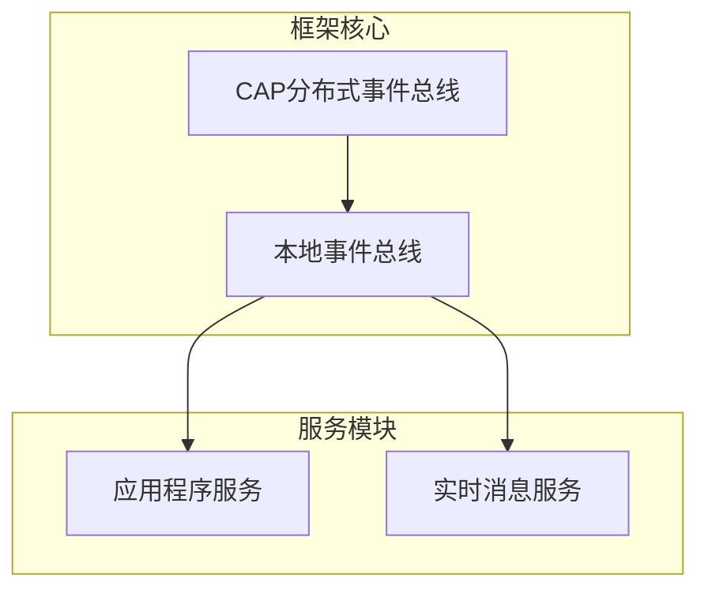
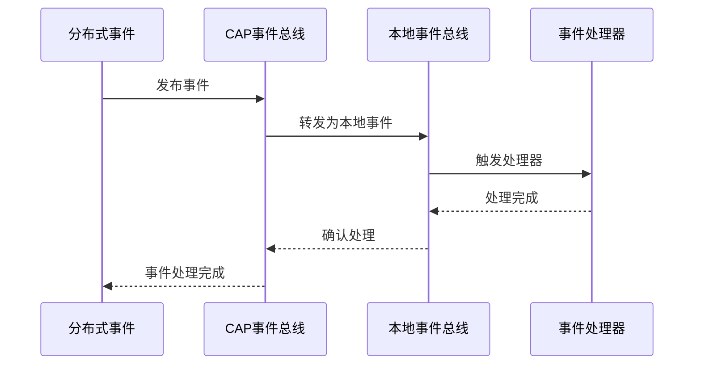
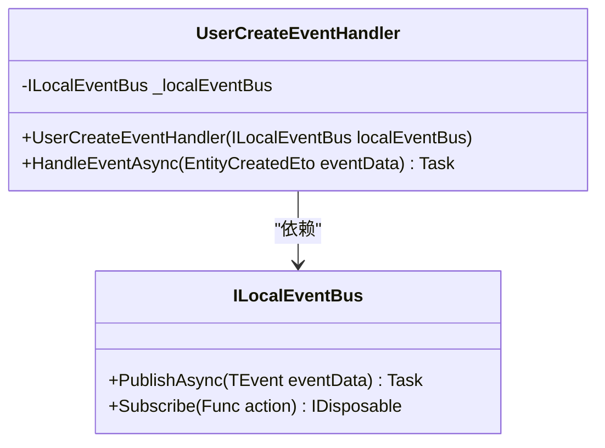
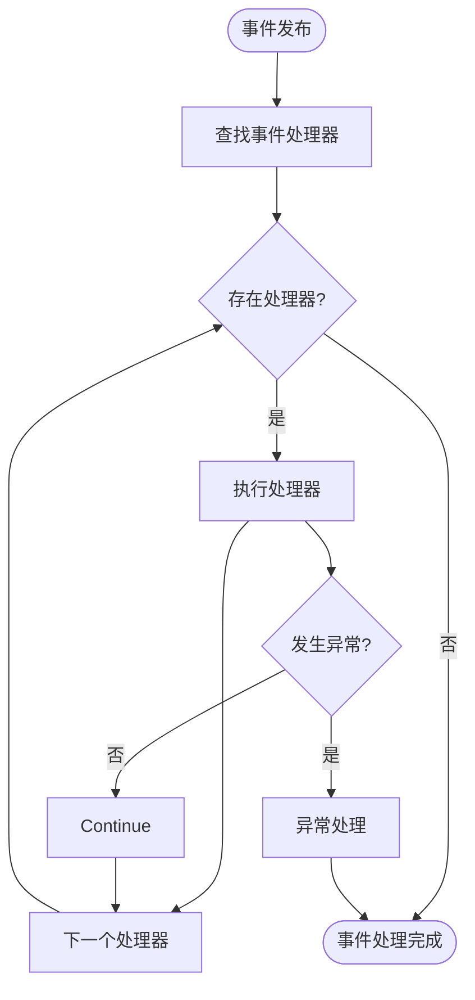
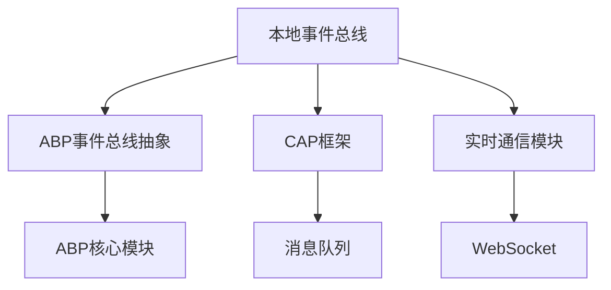

# 本地事件总线

<cite>
**本文档引用的文件**  
- [CAPDistributedEventBus.cs](file://aspnet-core/framework/common/LINGYUN.Abp.EventBus.CAP/LINGYUN/Abp/EventBus/CAP/CAPDistributedEventBus.cs)
- [UserCreateEventHandler.cs](file://aspnet-core/services/LY.MicroService.Applications.Single/EventBus/Distributed/UserCreateEventHandler.cs)
- [UserCreateEventHandler.cs](file://aspnet-core/services/LY.MicroService.RealtimeMessage.HttpApi.Host/EventBus/Distributed/UserCreateEventHandler.cs)
- [AbpBackgroundTasksEventBusModule.cs](file://aspnet-core/modules/task-management/LINGYUN.Abp.BackgroundTasks.EventBus/LINGYUN/Abp/BackgroundTasks/EventBus/AbpBackgroundTasksEventBusModule.cs)
- [AbpRealTimeModule.cs](file://aspnet-core/framework/common/LINGYUN.Abp.RealTime/LINGYUN/Abp/RealTime/AbpRealTimeModule.cs)
</cite>

## 目录
1. [简介](#简介)
2. [项目结构](#项目结构)
3. [核心组件](#核心组件)
4. [架构概述](#架构概述)
5. [详细组件分析](#详细组件分析)
6. [依赖分析](#依赖分析)
7. [性能考量](#性能考量)
8. [故障排除指南](#故障排除指南)
9. [结论](#结论)

## 简介
本文档深入探讨了ABP框架中本地事件总线的实现机制，重点分析了如何在实时消息服务中使用本地事件总线进行组件间通信。文档详细解释了UserCreateSendWelcomeEventHandler类如何处理用户创建事件并发送欢迎消息的实现过程，涵盖本地事件的发布/订阅模式、同步执行机制和异常处理。同时提供了实际代码示例，展示如何定义本地事件数据模型、注册事件处理器、发布事件以及管理事件处理的生命周期。最后，文档对比了本地事件与分布式事件的性能差异和适用场景，为开发者在不同情境下做出正确选择提供指导。

## 项目结构
本项目采用模块化架构，本地事件总线功能主要分布在框架核心模块和各个服务模块中。核心的事件总线实现位于`aspnet-core/framework/common/LINGYUN.Abp.EventBus.CAP`目录下，而具体的事件处理器则分布在各个服务模块中，如`LY.MicroService.Applications.Single`和`LY.MicroService.RealtimeMessage.HttpApi.Host`。

**图示来源**  
- [CAPDistributedEventBus.cs](file://aspnet-core/framework/common/LINGYUN.Abp.EventBus.CAP/LINGYUN/Abp/EventBus/CAP/CAPDistributedEventBus.cs#L41-L78)
- [UserCreateEventHandler.cs](file://aspnet-core/services/LY.MicroService.Applications.Single/EventBus/Distributed/UserCreateEventHandler.cs#L0-L29)

**本节来源**  
- [CAPDistributedEventBus.cs](file://aspnet-core/framework/common/LINGYUN.Abp.EventBus.CAP/LINGYUN/Abp/EventBus/CAP/CAPDistributedEventBus.cs#L41-L78)
- [UserCreateEventHandler.cs](file://aspnet-core/services/LY.MicroService.Applications.Single/EventBus/Distributed/UserCreateEventHandler.cs#L0-L29)

## 核心组件
本地事件总线的核心组件包括事件发布器（ILocalEventBus）、事件处理器（IEventHandler）和事件数据模型。在本项目中，`CAPDistributedEventBus`类实现了分布式事件总线功能，同时管理本地事件的处理。`UserCreateEventHandler`类作为具体的事件处理器，接收用户创建的分布式事件，并将其转换为本地事件进行处理。

**本节来源**  
- [CAPDistributedEventBus.cs](file://aspnet-core/framework/common/LINGYUN.Abp.EventBus.CAP/LINGYUN/Abp/EventBus/CAP/CAPDistributedEventBus.cs#L41-L78)
- [UserCreateEventHandler.cs](file://aspnet-core/services/LY.MicroService.Applications.Single/EventBus/Distributed/UserCreateEventHandler.cs#L0-L29)

## 架构概述
系统的事件处理架构采用分层设计，分布式事件首先由CAP框架接收，然后通过本地事件总线进行内部组件间的通信。这种设计既保证了跨服务的事件传递，又实现了服务内部的高效通信。

**图示来源**  
- [CAPDistributedEventBus.cs](file://aspnet-core/framework/common/LINGYUN.Abp.EventBus.CAP/LINGYUN/Abp/EventBus/CAP/CAPDistributedEventBus.cs#L140-L178)
- [UserCreateEventHandler.cs](file://aspnet-core/services/LY.MicroService.Applications.Single/EventBus/Distributed/UserCreateEventHandler.cs#L0-L29)

## 详细组件分析

### UserCreateEventHandler分析
`UserCreateEventHandler`类实现了`IDistributedEventHandler<EntityCreatedEto<UserEto>>`接口，用于处理用户创建的分布式事件。该处理器通过依赖注入获取`ILocalEventBus`实例，并在接收到用户创建事件后，将其转换为本地事件并发布。

**图示来源**  
- [UserCreateEventHandler.cs](file://aspnet-core/services/LY.MicroService.Applications.Single/EventBus/Distributed/UserCreateEventHandler.cs#L0-L29)
- [CAPDistributedEventBus.cs](file://aspnet-core/framework/common/LINGYUN.Abp.EventBus.CAP/LINGYUN/Abp/EventBus/CAP/CAPDistributedEventBus.cs#L41-L78)

**本节来源**  
- [UserCreateEventHandler.cs](file://aspnet-core/services/LY.MicroService.Applications.Single/EventBus/Distributed/UserCreateEventHandler.cs#L0-L29)
- [CAPDistributedEventBus.cs](file://aspnet-core/framework/common/LINGYUN.Abp.EventBus.CAP/LINGYUN/Abp/EventBus/CAP/CAPDistributedEventBus.cs#L41-L78)

### 本地事件总线机制
本地事件总线采用同步执行机制，确保事件处理的顺序性和一致性。事件处理器通过订阅模式注册到事件总线上，当特定事件发生时，所有订阅该事件的处理器将被依次调用。

**图示来源**  
- [CAPDistributedEventBus.cs](file://aspnet-core/framework/common/LINGYUN.Abp.EventBus.CAP/LINGYUN/Abp/EventBus/CAP/CAPDistributedEventBus.cs#L140-L178)
- [UserCreateEventHandler.cs](file://aspnet-core/services/LY.MicroService.Applications.Single/EventBus/Distributed/UserCreateEventHandler.cs#L0-L29)

**本节来源**  
- [CAPDistributedEventBus.cs](file://aspnet-core/framework/common/LINGYUN.Abp.EventBus.CAP/LINGYUN/Abp/EventBus/CAP/CAPDistributedEventBus.cs#L140-L178)
- [UserCreateEventHandler.cs](file://aspnet-core/services/LY.MicroService.Applications.Single/EventBus/Distributed/UserCreateEventHandler.cs#L0-L29)

## 依赖分析
本地事件总线的实现依赖于多个核心模块，包括ABP事件总线抽象、CAP框架和实时通信模块。这些依赖关系确保了事件总线能够与系统的其他部分无缝集成。

**图示来源**  
- [AbpRealTimeModule.cs](file://aspnet-core/framework/common/LINGYUN.Abp.RealTime/LINGYUN/Abp/RealTime/AbpRealTimeModule.cs#L0-L8)
- [AbpBackgroundTasksEventBusModule.cs](file://aspnet-core/modules/task-management/LINGYUN.Abp.BackgroundTasks.EventBus/LINGYUN/Abp/BackgroundTasks/EventBus/AbpBackgroundTasksEventBusModule.cs#L0-L9)

**本节来源**  
- [AbpRealTimeModule.cs](file://aspnet-core/framework/common/LINGYUN.Abp.RealTime/LINGYUN/Abp/RealTime/AbpRealTimeModule.cs#L0-L8)
- [AbpBackgroundTasksEventBusModule.cs](file://aspnet-core/modules/task-management/LINGYUN.Abp.BackgroundTasks.EventBus/LINGYUN/Abp/BackgroundTasks/EventBus/AbpBackgroundTasksEventBusModule.cs#L0-L9)

## 性能考量
本地事件总线由于在同一个进程内执行，具有较低的延迟和较高的吞吐量。与分布式事件相比，本地事件避免了网络传输开销，适合处理高频、低延迟的内部通信需求。然而，本地事件的同步执行特性可能导致阻塞，需要谨慎处理耗时操作。

## 故障排除指南
当事件处理出现问题时，应首先检查事件处理器的注册状态和依赖注入配置。确保`ILocalEventBus`正确注入到事件处理器中，并验证事件数据模型的序列化兼容性。

**本节来源**  
- [CAPDistributedEventBus.cs](file://aspnet-core/framework/common/LINGYUN.Abp.EventBus.CAP/LINGYUN/Abp/EventBus/CAP/CAPDistributedEventBus.cs#L41-L78)
- [UserCreateEventHandler.cs](file://aspnet-core/services/LY.MicroService.Applications.Single/EventBus/Distributed/UserCreateEventHandler.cs#L0-L29)

## 结论
本地事件总线是ABP框架中实现组件间通信的重要机制。通过合理使用本地事件总线，可以有效解耦系统组件，提高代码的可维护性和可扩展性。在实际应用中，应根据具体需求选择合适的事件处理模式，平衡性能和可靠性。