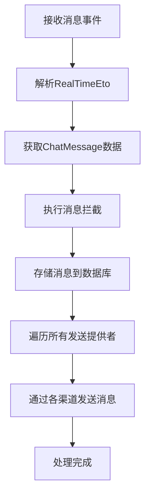
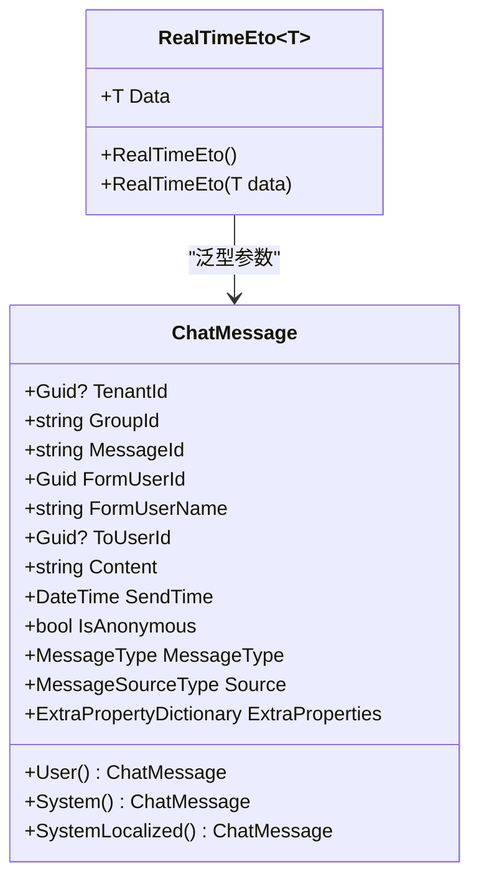
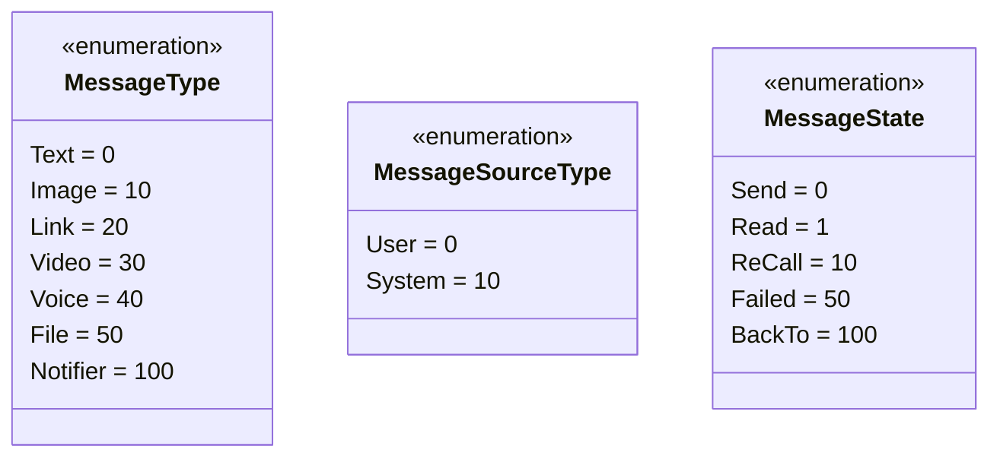
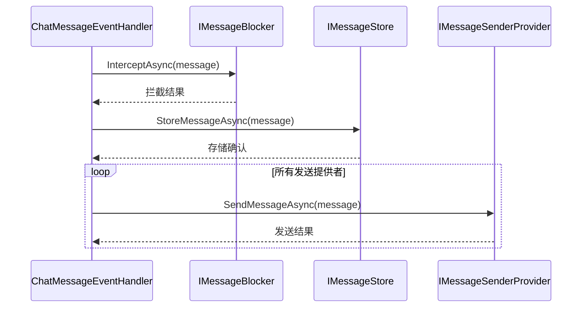
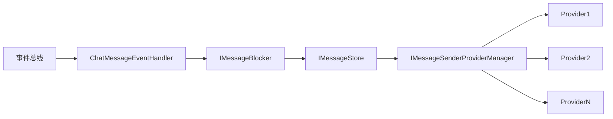

# 消息处理

<cite>
**本文档中引用的文件**  
- [ChatMessageEventHandler.cs](file://aspnet-core/services/LY.AIO.Applications.Single/EventBus/Distributed/ChatMessageEventHandler.cs)
- [ChatMessage.cs](file://aspnet-core/modules/realtime-message/LINGYUN.Abp.IM/LINGYUN/Abp/IM/Messages/ChatMessage.cs)
- [IMessageProcessor.cs](file://aspnet-core/modules/realtime-message/LINGYUN.Abp.IM/LINGYUN/Abp/IM/Messages/IMessageProcessor.cs)
- [IMessageStore.cs](file://aspnet-core/modules/realtime-message/LINGYUN.Abp.IM/LINGYUN/Abp/IM/Messages/IMessageStore.cs)
- [IMessageBlocker.cs](file://aspnet-core/modules/realtime-message/LINGYUN.Abp.IM/LINGYUN/Abp/IM/Messages/IMessageBlocker.cs)
- [IMessageSenderProviderManager.cs](file://aspnet-core/modules/realtime-message/LINGYUN.Abp.IM/LINGYUN/Abp/IM/Messages/IMessageSenderProviderManager.cs)
- [IMessageSenderProvider.cs](file://aspnet-core/modules/realtime-message/LINGYUN.Abp.IM/LINGYUN/Abp/IM/Messages/IMessageSenderProvider.cs)
- [RealTimeEto.cs](file://aspnet-core/framework/common/LINGYUN.Abp.RealTime/LINGYUN/Abp/RealTime/RealTimeEto.cs)
- [MessageType.cs](file://aspnet-core/modules/realtime-message/LINGYUN.Abp.IM/LINGYUN/Abp/IM/Messages/MessageType.cs)
- [MessageState.cs](file://aspnet-core/modules/realtime-message/LINGYUN.Abp.IM/LINGYUN/Abp/IM/Messages/MessageState.cs)
- [MessageSourceType.cs](file://aspnet-core/modules/realtime-message/LINGYUN.Abp.IM/LINGYUN/Abp/IM/Messages/MessageSourceType.cs)
- [AbpIMOptions.cs](file://aspnet-core/modules/realtime-message/LINGYUN.Abp.IM/LINGYUN/Abp/IM/AbpIMOptions.cs)
</cite>

## 目录
1. [引言](#引言)
2. [核心组件](#核心组件)
3. [消息处理流程](#消息处理流程)
4. [消息序列化与数据结构](#消息序列化与数据结构)
5. [消息类型与分类](#消息类型与分类)
6. [消息ID生成策略](#消息id生成策略)
7. [可靠性保障机制](#可靠性保障机制)
8. [消息处理管道实现](#消息处理管道实现)
9. [扩展自定义消息类型](#扩展自定义消息类型)
10. [结论](#结论)

## 引言
本文档详细阐述了即时通讯系统中消息处理机制的设计与实现，重点分析了`ChatMessageEventHandler`在分布式环境下如何处理聊天消息事件。文档涵盖消息的接收、验证、存储、转发全流程，深入解析消息序列化格式、消息类型分类、消息ID生成策略以及消息可靠性保障机制（如确认、重试和幂等性处理），并提供扩展自定义消息类型的指导。

## 核心组件

即时通讯消息处理系统由多个核心接口和实现类构成，共同协作完成消息的全生命周期管理。

**核心组件职责说明：**
- `ChatMessageEventHandler`：分布式事件处理器，负责接收并处理实时消息事件
- `ChatMessage`：消息数据模型，定义消息的结构和属性
- `IMessageProcessor`：消息处理器接口，定义消息处理的核心操作
- `IMessageStore`：消息存储接口，负责消息的持久化操作
- `IMessageBlocker`：消息拦截器接口，用于实现敏感词过滤等拦截逻辑
- `IMessageSenderProviderManager`：消息发送提供者管理器，管理多种消息发送渠道
- `IMessageSenderProvider`：消息发送提供者接口，定义具体的消息发送实现

**本节来源**  
- [ChatMessageEventHandler.cs](file://aspnet-core/services/LY.AIO.Applications.Single/EventBus/Distributed/ChatMessageEventHandler.cs#L1-L60)
- [ChatMessage.cs](file://aspnet-core/modules/realtime-message/LINGYUN.Abp.IM/LINGYUN/Abp/IM/Messages/ChatMessage.cs#L1-L236)
- [IMessageProcessor.cs](file://aspnet-core/modules/realtime-message/LINGYUN.Abp.IM/LINGYUN/Abp/IM/Messages/IMessageProcessor.cs#L1-L23)
- [IMessageStore.cs](file://aspnet-core/modules/realtime-message/LINGYUN.Abp.IM/LINGYUN/Abp/IM/Messages/IMessageStore.cs#L1-L111)
- [IMessageBlocker.cs](file://aspnet-core/modules/realtime-message/LINGYUN.Abp.IM/LINGYUN/Abp/IM/Messages/IMessageBlocker.cs#L1-L12)
- [IMessageSenderProviderManager.cs](file://aspnet-core/modules/realtime-message/LINGYUN.Abp.IM/LINGYUN/Abp/IM/Messages/IMessageSenderProviderManager.cs#L1-L9)
- [IMessageSenderProvider.cs](file://aspnet-core/modules/realtime-message/LINGYUN.Abp.IM/LINGYUN/Abp/IM/Messages/IMessageSenderProvider.cs#L1-L10)

## 消息处理流程

**图示来源**  
- [ChatMessageEventHandler.cs](file://aspnet-core/services/LY.AIO.Applications.Single/EventBus/Distributed/ChatMessageEventHandler.cs#L30-L58)
- [RealTimeEto.cs](file://aspnet-core/framework/common/LINGYUN.Abp.RealTime/LINGYUN/Abp/RealTime/RealTimeEto.cs#L1-L21)

`ChatMessageEventHandler`实现了`IDistributedEventHandler<RealTimeEto<ChatMessage>>`接口，作为分布式事件处理器接收实时消息。处理流程分为三个主要阶段：

1. **消息接收与解析**：通过`HandleEventAsync`方法接收`RealTimeEto<ChatMessage>`类型的事件，从中提取出`ChatMessage`对象
2. **消息验证与拦截**：调用`MessageBlocker.InterceptAsync(message)`执行消息拦截逻辑，可用于敏感词过滤等安全检查
3. **消息持久化与分发**：先通过`MessageStore.StoreMessageAsync(message)`将消息存储到数据库，然后遍历`MessageSenderProviderManager`中的所有提供者，调用`SendMessageAsync`方法将消息发送到各个渠道

**本节来源**  
- [ChatMessageEventHandler.cs](file://aspnet-core/services/LY.AIO.Applications.Single/EventBus/Distributed/ChatMessageEventHandler.cs#L30-L58)
- [RealTimeEto.cs](file://aspnet-core/framework/common/LINGYUN.Abp.RealTime/LINGYUN/Abp/RealTime/RealTimeEto.cs#L1-L21)

## 消息序列化与数据结构

**图示来源**  
- [ChatMessage.cs](file://aspnet-core/modules/realtime-message/LINGYUN.Abp.IM/LINGYUN/Abp/IM/Messages/ChatMessage.cs#L1-L236)
- [RealTimeEto.cs](file://aspnet-core/framework/common/LINGYUN.Abp.RealTime/LINGYUN/Abp/RealTime/RealTimeEto.cs#L1-L21)

消息的序列化格式基于JSON结构，核心数据模型为`ChatMessage`类。该类实现了`IHasExtraProperties`接口，支持通过`ExtraProperties`字典存储扩展属性，提供了高度的灵活性。

**主要属性说明：**
- `TenantId`：租户标识，支持多租户架构
- `GroupId`：群组标识，为空时表示私聊消息
- `MessageId`：消息唯一标识，由系统自动生成
- `FormUserId/FormUserName`：发送者用户ID和名称
- `ToUserId`：接收者用户ID，群聊消息时可为空
- `Content`：消息内容，文本消息直接存储内容，其他类型存储资源链接或标识
- `SendTime`：发送时间，使用系统时钟
- `IsAnonymous`：是否匿名发送
- `MessageType`：消息类型枚举
- `Source`：消息源类型（用户或系统）
- `ExtraProperties`：扩展属性字典，可用于存储自定义数据

**本节来源**  
- [ChatMessage.cs](file://aspnet-core/modules/realtime-message/LINGYUN.Abp.IM/LINGYUN/Abp/IM/Messages/ChatMessage.cs#L1-L236)
- [RealTimeEto.cs](file://aspnet-core/framework/common/LINGYUN.Abp.RealTime/LINGYUN/Abp/RealTime/RealTimeEto.cs#L1-L21)

## 消息类型与分类

**图示来源**  
- [MessageType.cs](file://aspnet-core/modules/realtime-message/LINGYUN.Abp.IM/LINGYUN/Abp/IM/Messages/MessageType.cs#L1-L35)
- [MessageSourceType.cs](file://aspnet-core/modules/realtime-message/LINGYUN.Abp.IM/LINGYUN/Abp/IM/Messages/MessageSourceType.cs#L1-L8)
- [MessageState.cs](file://aspnet-core/modules/realtime-message/LINGYUN.Abp.IM/LINGYUN/Abp/IM/Messages/MessageState.cs#L1-L29)

系统通过枚举类型对消息进行分类管理：

**消息类型（MessageType）：**
- `Text`（0）：普通文本消息
- `Image`（10）：图片消息
- `Link`（20）：链接消息
- `Video`（30）：视频消息
- `Voice`（40）：音频消息
- `File`（50）：文件消息
- `Notifier`（100）：系统通知消息

**消息源类型（MessageSourceType）：**
- `User`（0）：用户发送的消息
- `System`（10）：系统自动发送的消息

**消息状态（MessageState）：**
- `Send`（0）：已发送状态
- `Read`（1）：已读状态
- `ReCall`（10）：已撤回状态
- `Failed`（50）：发送失败状态
- `BackTo`（100）：已退回状态

**本节来源**  
- [MessageType.cs](file://aspnet-core/modules/realtime-message/LINGYUN.Abp.IM/LINGYUN/Abp/IM/Messages/MessageType.cs#L1-L35)
- [MessageSourceType.cs](file://aspnet-core/modules/realtime-message/LINGYUN.Abp.IM/LINGYUN/Abp/IM/Messages/MessageSourceType.cs#L1-L8)
- [MessageState.cs](file://aspnet-core/modules/realtime-message/LINGYUN.Abp.IM/LINGYUN/Abp/IM/Messages/MessageState.cs#L1-L29)

## 消息ID生成策略

系统采用字符串类型的`MessageId`作为消息唯一标识，设计上由服务端自动生成，调用者无需关心其生成逻辑。这种设计确保了消息ID的全局唯一性和安全性。

虽然具体实现细节未在接口层暴露，但根据系统架构和最佳实践，可以推断消息ID生成策略可能采用以下一种或多种技术组合：
- 分布式唯一ID生成算法（如Snowflake）
- GUID/UUID
- 基于时间戳和节点信息的组合键
- 数据库自增ID（转换为字符串）

`MessageId`被设计为字符串类型而非整数，提供了更大的灵活性和扩展性，便于在分布式环境中保证唯一性。

**本节来源**  
- [ChatMessage.cs](file://aspnet-core/modules/realtime-message/LINGYUN.Abp.IM/LINGYUN/Abp/IM/Messages/ChatMessage.cs#L1-L236)

## 可靠性保障机制

**图示来源**  
- [ChatMessageEventHandler.cs](file://aspnet-core/services/LY.AIO.Applications.Single/EventBus/Distributed/ChatMessageEventHandler.cs#L30-L58)
- [IMessageBlocker.cs](file://aspnet-core/modules/realtime-message/LINGYUN.Abp.IM/LINGYUN/Abp/IM/Messages/IMessageBlocker.cs#L1-L12)
- [IMessageStore.cs](file://aspnet-core/modules/realtime-message/LINGYUN.Abp.IM/LINGYUN/Abp/IM/Messages/IMessageStore.cs#L1-L111)
- [IMessageSenderProvider.cs](file://aspnet-core/modules/realtime-message/LINGYUN.Abp.IM/LINGYUN/Abp/IM/Messages/IMessageSenderProvider.cs#L1-L10)

系统通过多层次机制保障消息处理的可靠性：

**消息确认机制：**
- 消息存储确认：通过`IMessageStore.StoreMessageAsync`的异步返回确认消息已成功持久化
- 发送渠道确认：每个`IMessageSenderProvider`在`SendMessageAsync`完成后返回确认

**重试机制：**
- 虽然在接口层面未直接体现，但基于ABP框架的分布式事件总线特性，失败的事件处理会自动进行重试
- 消息发送提供者可自行实现重试逻辑，确保消息最终送达

**幂等性处理：**
- `ChatMessageEventHandler`实现了`ITransientDependency`，确保每次处理都是独立实例
- 消息ID由服务端生成，避免客户端重复提交导致的重复消息
- 系统可通过消息ID进行去重检查，确保相同消息不会被重复处理

**本节来源**  
- [ChatMessageEventHandler.cs](file://aspnet-core/services/LY.AIO.Applications.Single/EventBus/Distributed/ChatMessageEventHandler.cs#L30-L58)
- [IMessageBlocker.cs](file://aspnet-core/modules/realtime-message/LINGYUN.Abp.IM/LINGYUN/Abp/IM/Messages/IMessageBlocker.cs#L1-L12)
- [IMessageStore.cs](file://aspnet-core/modules/realtime-message/LINGYUN.Abp.IM/LINGYUN/Abp/IM/Messages/IMessageStore.cs#L1-L111)
- [IMessageSenderProvider.cs](file://aspnet-core/modules/realtime-message/LINGYUN.Abp.IM/LINGYUN/Abp/IM/Messages/IMessageSenderProvider.cs#L1-L10)

## 消息处理管道实现

**图示来源**  
- [ChatMessageEventHandler.cs](file://aspnet-core/services/LY.AIO.Applications.Single/EventBus/Distributed/ChatMessageEventHandler.cs#L30-L58)
- [IMessageBlocker.cs](file://aspnet-core/modules/realtime-message/LINGYUN.Abp.IM/LINGYUN/Abp/IM/Messages/IMessageBlocker.cs#L1-L12)
- [IMessageStore.cs](file://aspnet-core/modules/realtime-message/LINGYUN.Abp.IM/LINGYUN/Abp/IM/Messages/IMessageStore.cs#L1-L111)
- [IMessageSenderProviderManager.cs](file://aspnet-core/modules/realtime-message/LINGYUN.Abp.IM/LINGYUN/Abp/IM/Messages/IMessageSenderProviderManager.cs#L1-L9)

消息处理管道采用责任链模式和依赖注入设计，各组件通过接口定义契约，实现松耦合。`ChatMessageEventHandler`作为管道的入口，依次调用拦截器、存储器和发送提供者，形成完整的消息处理链条。

管道的关键特性：
- **可扩展性**：通过`IMessageSenderProviderManager`可以动态添加新的