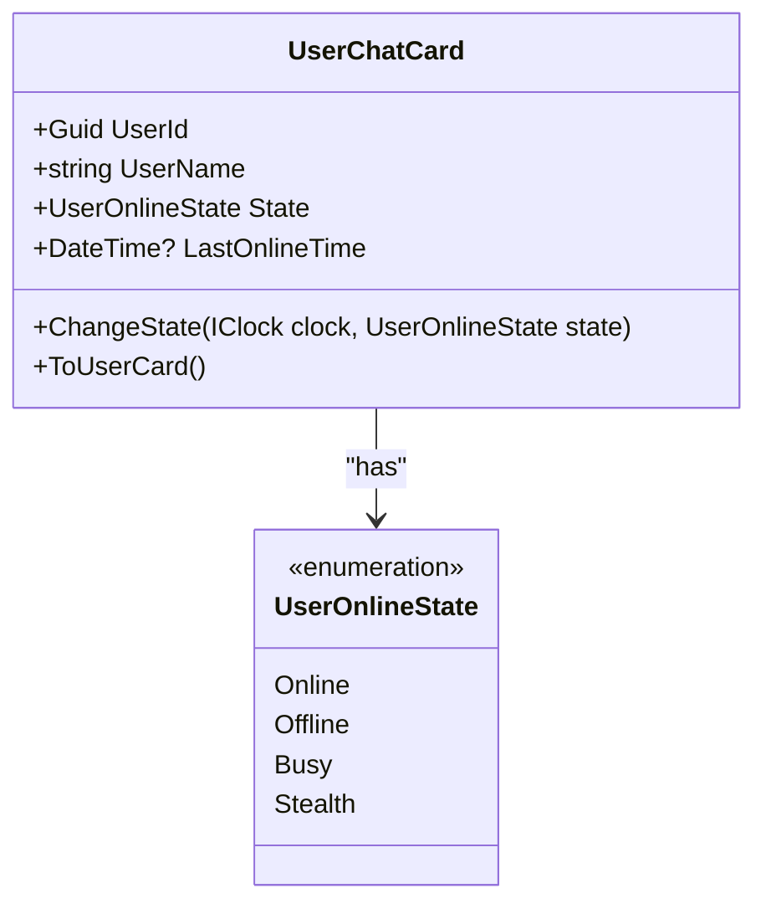
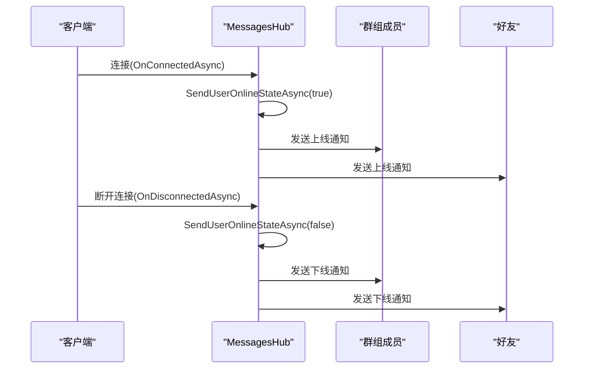
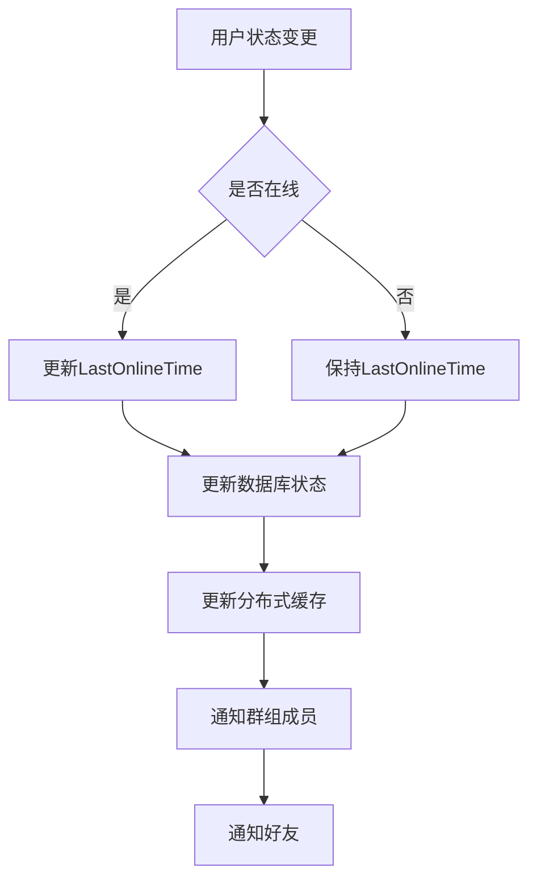
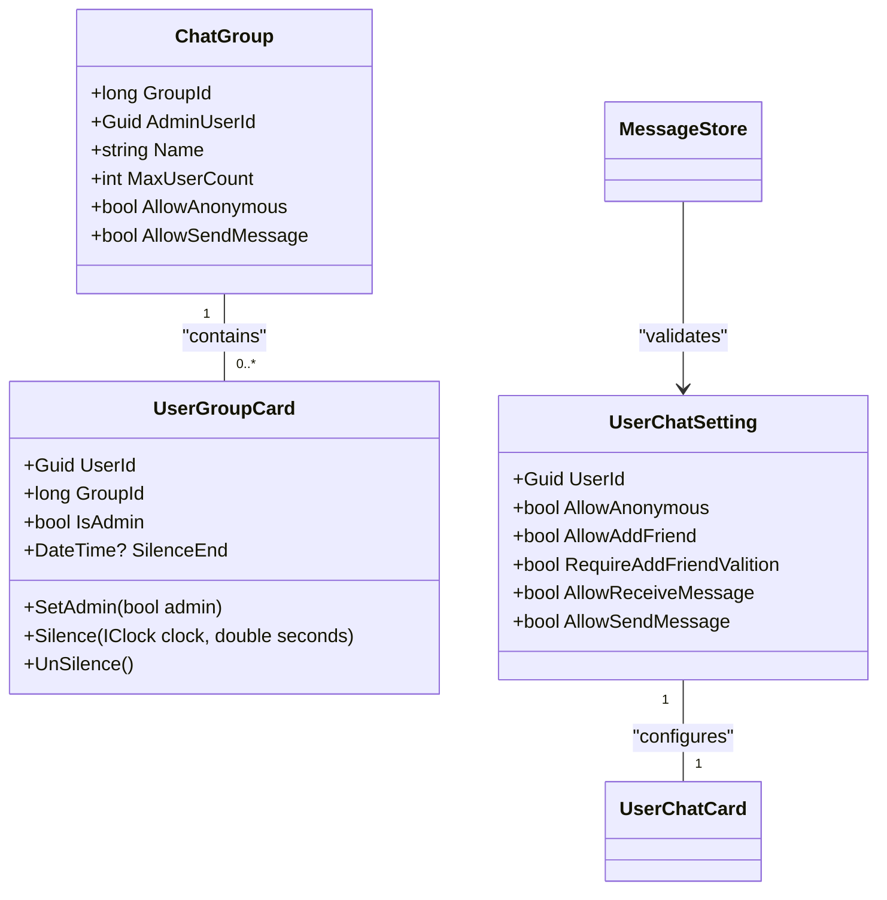
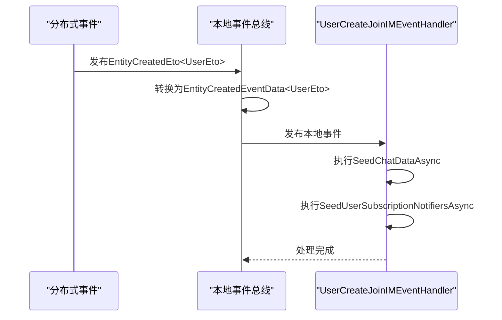

# 用户状态管理

<cite>
**本文档引用的文件**   
- [UserCreateJoinIMEventHandler.cs](file://aspnet-core/services/LY.MicroService.RealtimeMessage.HttpApi.Host/EventBus/Local/UserCreateJoinIMEventHandler.cs)
- [MessagesHub.cs](file://aspnet-core/modules/realtime-message/LINGYUN.Abp.IM.SignalR/LINGYUN/Abp/IM/SignalR/Hubs/MessagesHub.cs)
- [UserChatCard.cs](file://aspnet-core/modules/realtime-message/LINGYUN.Abp.MessageService.Domain/LINGYUN/Abp/MessageService/Chat/UserChatCard.cs)
- [UserOnlineState.cs](file://aspnet-core/modules/realtime-message/LINGYUN.Abp.IM/LINGYUN/Abp/IM/UserOnlineState.cs)
- [AbpIMSignalROptions.cs](file://aspnet-core/modules/realtime-message/LINGYUN.Abp.IM.SignalR/LINGYUN/Abp/IM/SignalR/AbpIMSignalROptions.cs)
- [ChatGroup.cs](file://aspnet-core/modules/realtime-message/LINGYUN.Abp.MessageService.Domain/LINGYUN/Abp/MessageService/Groups/ChatGroup.cs)
- [MessageServiceErrorCodes.cs](file://aspnet-core/modules/realtime-message/LINGYUN.Abp.MessageService.Domain.Shared/LINGYUN/Abp/MessageService/MessageServiceErrorCodes.cs)
- [UserChatSetting.cs](file://aspnet-core/modules/realtime-message/LINGYUN.Abp.MessageService.Domain/LINGYUN/Abp/MessageService/Chat/UserChatSetting.cs)
- [UserGroupCard.cs](file://aspnet-core/modules/realtime-message/LINGYUN.Abp.MessageService.Domain/LINGYUN/Abp/MessageService/Groups/UserGroupCard.cs)
- [MessageStore.cs](file://aspnet-core/modules/realtime-message/LINGYUN.Abp.MessageService.Domain/LINGYUN/Abp/MessageService/Chat/MessageStore.cs)
- [UserFriendCacheItem.cs](file://aspnet-core/modules/realtime-message/LINGYUN.Abp.MessageService.Domain/LINGYUN/Abp/MessageService/Chat/UserFriendCacheItem.cs)
</cite>

## 目录
1. [用户创建与即时通讯系统集成](#用户创建与即时通讯系统集成)
2. [用户在线状态管理](#用户在线状态管理)
3. [WebSocket连接与心跳检测](#websocket连接与心跳检测)
4. [用户在线状态存储方案](#用户在线状态存储方案)
5. [聊天室加入逻辑](#聊天室加入逻辑)
6. [用户状态变化事件监听](#用户状态变化事件监听)

## 用户创建与即时通讯系统集成

当系统中创建新用户时，`UserCreateJoinIMEventHandler` 会监听用户创建事件，并自动将用户加入即时通讯系统。该处理器实现了 `ILocalEventHandler<EntityCreatedEventData<UserEto>>` 接口，用于处理用户实体创建的本地事件。

处理器通过依赖注入获取 `IChatDataSeeder` 和 `INotificationSubscriptionManager` 服务，分别用于初始化用户的聊天数据和订阅通知。当用户创建事件触发时，处理器会调用 `SeedChatDataAsync` 方法初始化用户的IM种子数据，并通过 `SeedUserSubscriptionNotifiersAsync` 方法为用户订阅相关通知。

这种事件驱动的架构确保了用户在系统中创建后能够立即获得完整的即时通讯功能，包括聊天好友关系、群组成员资格和通知订阅等。

**Section sources**
- [UserCreateJoinIMEventHandler.cs](file://aspnet-core/services/LY.MicroService.RealtimeMessage.HttpApi.Host/EventBus/Local/UserCreateJoinIMEventHandler.cs)

## 用户在线状态管理

系统通过 `UserOnlineState` 枚举定义了四种用户状态：在线(Online)、离线(Offline)、忙碌(Busy)和隐身(Stealth)。用户状态的变更通过 `UserChatCard` 实体进行管理，该实体包含了用户的基本信息和状态属性。

当用户连接或断开WebSocket连接时，系统会自动更新用户状态。在 `MessagesHub` 的 `OnConnectedAsync` 和 `OnDisconnectedAsync` 方法中，分别调用了 `SendUserOnlineStateAsync` 方法来通知相关方用户状态的变化。该方法会向用户所在群组和好友发送状态更新消息。

用户状态的变更还会更新 `LastOnlineTime` 属性，该属性记录了用户最后一次在线的时间戳。这个时间戳对于判断用户活跃度和显示"最后在线"信息非常重要。

**Diagram sources**
- [UserOnlineState.cs](file://aspnet-core/modules/realtime-message/LINGYUN.Abp.IM/LINGYUN/Abp/IM/UserOnlineState.cs)
- [UserChatCard.cs](file://aspnet-core/modules/realtime-message/LINGYUN.Abp.MessageService.Domain/LINGYUN/Abp/MessageService/Chat/UserChatCard.cs)

**Section sources**
- [UserChatCard.cs](file://aspnet-core/modules/realtime-message/LINGYUN.Abp.MessageService.Domain/LINGYUN/Abp/MessageService/Chat/UserChatCard.cs)
- [MessagesHub.cs](file://aspnet-core/modules/realtime-message/LINGYUN.Abp.IM.SignalR/LINGYUN/Abp/IM/SignalR/Hubs/MessagesHub.cs)

## WebSocket连接与心跳检测

系统使用SignalR技术实现WebSocket连接管理。`MessagesHub` 类继承自 `AbpHub`，作为即时通讯的核心Hub，处理所有客户端连接和消息传递。

当客户端连接时，`OnConnectedAsync` 方法被调用，系统会向用户所在群组和好友发送"用户上线"通知。同样，当客户端断开连接时，`OnDisconnectedAsync` 方法会发送"用户下线"通知。

系统通过SignalR的内置机制处理连接管理和心跳检测。SignalR会自动处理连接的建立、维持和断开，并在连接异常中断时触发相应的事件。这种机制确保了用户状态的实时性和准确性。

**Diagram sources**
- [MessagesHub.cs](file://aspnet-core/modules/realtime-message/LINGYUN.Abp.IM.SignalR/LINGYUN/Abp/IM/SignalR/Hubs/MessagesHub.cs)

**Section sources**
- [MessagesHub.cs](file://aspnet-core/modules/realtime-message/LINGYUN.Abp.IM.SignalR/LINGYUN/Abp/IM/SignalR/Hubs/MessagesHub.cs)

## 用户在线状态存储方案

用户在线状态信息主要存储在数据库和缓存两个层面。在数据库层面，`UserChatCard` 实体的 `State` 和 `LastOnlineTime` 字段持久化存储用户状态信息。这些数据通过Entity Framework Core映射到数据库表中。

为了提高查询性能，系统还使用了分布式缓存来存储用户状态信息。`UserFriendCacheItem` 类定义了好友列表的缓存结构，包含好友信息列表和缓存键生成方法。这种缓存机制减少了数据库查询次数，提高了系统响应速度。

系统通过 `AbpIMSignalROptions` 配置类定义了状态通知的方法名称，包括 `UserOnlineMethod` 和 `UserOfflineMethod`，这些配置允许客户端自定义接收状态变化消息的方法。

**Diagram sources**
- [UserChatCard.cs](file://aspnet-core/modules/realtime-message/LINGYUN.Abp.MessageService.Domain/LINGYUN/Abp/MessageService/Chat/UserChatCard.cs)
- [UserFriendCacheItem.cs](file://aspnet-core/modules/realtime-message/LINGYUN.Abp.MessageService.Domain/LINGYUN/Abp/MessageService/Chat/UserFriendCacheItem.cs)
- [AbpIMSignalROptions.cs](file://aspnet-core/modules/realtime-message/LINGYUN.Abp.IM.SignalR/LINGYUN/Abp/IM/SignalR/AbpIMSignalROptions.cs)

**Section sources**
- [UserChatCard.cs](file://aspnet-core/modules/realtime-message/LINGYUN.Abp.MessageService.Domain/LINGYUN/Abp/MessageService/Chat/UserChatCard.cs)
- [UserFriendCacheItem.cs](file://aspnet-core/modules/realtime-message/LINGYUN.Abp.MessageService.Domain/LINGYUN/Abp/MessageService/Chat/UserFriendCacheItem.cs)
- [AbpIMSignalROptions.cs](file://aspnet-core/modules/realtime-message/LINGYUN.Abp.IM.SignalR/LINGYUN/Abp/IM/SignalR/AbpIMSignalROptions.cs)

## 聊天室加入逻辑

用户加入聊天室的逻辑涉及权限验证、房间成员同步和历史消息推送等多个步骤。系统通过 `ChatGroup` 实体管理群组信息，包括群组名称、管理员、最大成员数等属性。

权限验证主要通过 `MessageServiceErrorCodes` 定义的错误码来实现，包括：
- `GroupNotFount`: 群组不存在或已解散
- `GroupNotAllowedToSpeak`: 管理员已开启全员禁言
- `GroupUserHasBlack`: 管理员已禁止用户发言
- `GroupNotAllowedToSpeakAnonymously`: 管理员不允许匿名发言

用户加入群组时，系统会检查用户的 `UserChatSetting` 设置，包括是否允许接收消息、是否允许发送消息等。同时，`UserGroupCard` 实体用于管理用户在群组中的角色和权限，如管理员身份和禁言状态。

**Diagram sources**
- [ChatGroup.cs](file://aspnet-core/modules/realtime-message/LINGYUN.Abp.MessageService.Domain/LINGYUN/Abp/MessageService/Groups/ChatGroup.cs)
- [UserGroupCard.cs](file://aspnet-core/modules/realtime-message/LINGYUN.Abp.MessageService.Domain/LINGYUN/Abp/MessageService/Groups/UserGroupCard.cs)
- [UserChatSetting.cs](file://aspnet-core/modules/realtime-message/LINGYUN.Abp.MessageService.Domain/LINGYUN/Abp/MessageService/Chat/UserChatSetting.cs)
- [MessageStore.cs](file://aspnet-core/modules/realtime-message/LINGYUN.Abp.MessageService.Domain/LINGYUN/Abp/MessageService/Chat/MessageStore.cs)

**Section sources**
- [ChatGroup.cs](file://aspnet-core/modules/realtime-message/LINGYUN.Abp.MessageService.Domain/LINGYUN/Abp/MessageService/Groups/ChatGroup.cs)
- [MessageServiceErrorCodes.cs](file://aspnet-core/modules/realtime-message/LINGYUN.Abp.MessageService.Domain.Shared/LINGYUN/Abp/MessageService/MessageServiceErrorCodes.cs)
- [UserChatSetting.cs](file://aspnet-core/modules/realtime-message/LINGYUN.Abp.MessageService.Domain/LINGYUN/Abp/MessageService/Chat/UserChatSetting.cs)
- [UserGroupCard.cs](file://aspnet-core/modules/realtime-message/LINGYUN.Abp.MessageService.Domain/LINGYUN/Abp/MessageService/Groups/UserGroupCard.cs)
- [MessageStore.cs](file://aspnet-core/modules/realtime-message/LINGYUN.Abp.MessageService.Domain/LINGYUN/Abp/MessageService/Chat/MessageStore.cs)

## 用户状态变化事件监听

系统通过事件总线机制监听用户状态变化事件。`UserCreateJoinIMEventHandler` 作为本地事件处理器，监听 `EntityCreatedEventData<UserEto>` 事件，当用户创建时自动执行IM初始化操作。

事件处理流程如下：首先 `UserCreateEventHandler` 处理分布式事件，然后发布本地事件，最后由 `UserCreateJoinIMEventHandler` 处理本地事件并执行具体的业务逻辑。这种分层的事件处理架构确保了事件处理的可靠性和可扩展性。

系统还提供了丰富的事件类型，包括用户关注、取消关注、更新用户等事件，这些事件通过 `[EventName]` 特性进行标记，便于事件总线识别和路由。

**Diagram sources**
- [UserCreateJoinIMEventHandler.cs](file://aspnet-core/services/LY.MicroService.RealtimeMessage.HttpApi.Host/EventBus/Local/UserCreateJoinIMEventHandler.cs)
- [UserCreateEventHandler.cs](file://aspnet-core/services/LY.MicroService.RealtimeMessage.HttpApi.Host/EventBus/Distributed/UserCreateEventHandler.cs)

**Section sources**
- [UserCreateJoinIMEventHandler.cs](file://aspnet-core/services/LY.MicroService.RealtimeMessage.HttpApi.Host/EventBus/Local/UserCreateJoinIMEventHandler.cs)
- [UserCreateEventHandler.cs](file://aspnet-core/services/LY.MicroService.RealtimeMessage.HttpApi.Host/EventBus/Distributed/UserCreateEventHandler.cs)