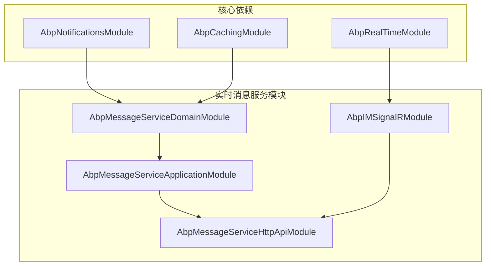
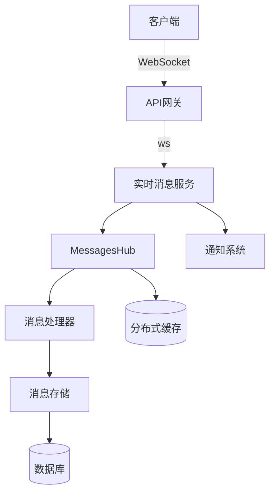
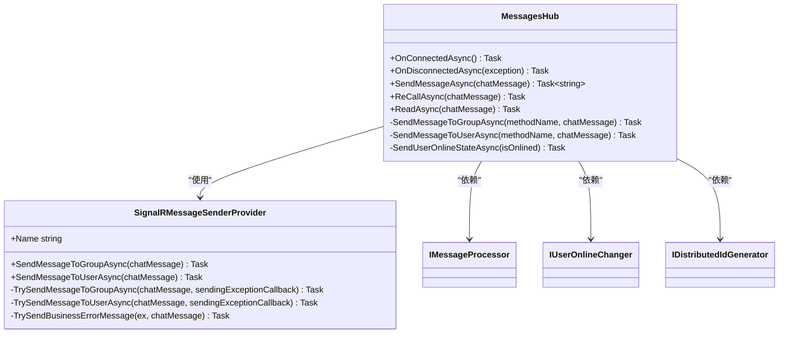
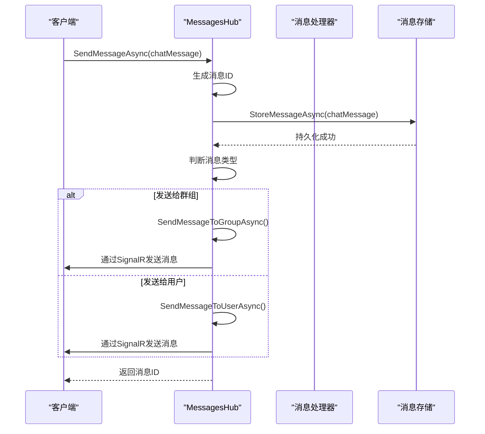
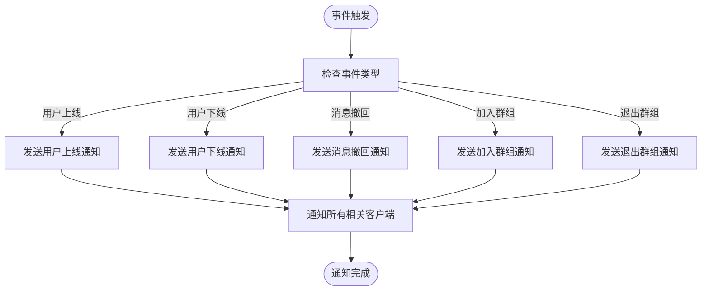
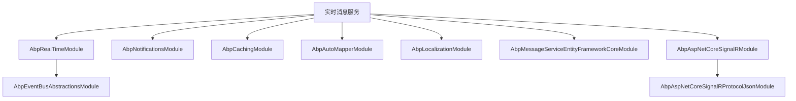

# 实时消息服务

<cite>
**本文档中引用的文件**
- [AbpRealTimeModule.cs](file://aspnet-core/framework/common/LINGYUN.Abp.RealTime/LINGYUN/Abp/RealTime/AbpRealTimeModule.cs)
- [MessagesHub.cs](file://aspnet-core/modules/realtime-message/LINGYUN.Abp.IM.SignalR/LINGYUN/Abp/IM/SignalR/Hubs/MessagesHub.cs)
- [SignalRMessageSenderProvider.cs](file://aspnet-core/modules/realtime-message/LINGYUN.Abp.IM.SignalR/LINGYUN/Abp/IM/SignalR/Messages/SignalRMessageSenderProvider.cs)
- [AbpIMSignalROptions.cs](file://aspnet-core/modules/realtime-message/LINGYUN.Abp.IM.SignalR/LINGYUN/Abp/IM/SignalR/AbpIMSignalROptions.cs)
- [AbpMessageServiceDomainModule.cs](file://aspnet-core/modules/realtime-message/LINGYUN.Abp.MessageService.Domain/LINGYUN/Abp/MessageService/AbpMessageServiceDomainModule.cs)
- [AbpMessageServiceApplicationModule.cs](file://aspnet-core/modules/realtime-message/LINGYUN.Abp.MessageService.Application/LINGYUN/Abp/MessageService/AbpMessageServiceApplicationModule.cs)
- [AbpMessageServiceHttpApiModule.cs](file://aspnet-core/modules/realtime-message/LINGYUN.Abp.MessageService.HttpApi/LINGYUN/Abp/MessageService/AbpMessageServiceHttpApiModule.cs)
- [AbpMessageServiceDomainSharedModule.cs](file://aspnet-core/modules/realtime-message/LINGYUN.Abp.MessageService.Domain.Shared/LINGYUN/Abp/MessageService/AbpMessageServiceDomainSharedModule.cs)
- [RealtimeMessageHttpApiHostModule.cs](file://aspnet-core/services/LY.MicroService.RealtimeMessage.HttpApi.Host/RealtimeMessageHttpApiHostModule.cs)
- [ocelot.json](file://gateways/internal/LINGYUN.MicroService.Internal.ApiGateway/src/LINGYUN.MicroService.Internal.ApiGateway/ocelot.json)
</cite>

## 目录
1. [简介](#简介)
2. [项目结构](#项目结构)
3. [核心组件](#核心组件)
4. [架构概述](#架构概述)
5. [详细组件分析](#详细组件分析)
6. [依赖分析](#依赖分析)
7. [性能考虑](#性能考虑)
8. [故障排除指南](#故障排除指南)
9. [结论](#结论)

## 简介
实时消息服务是ABP框架中的一个关键模块，提供即时通讯、通知中心和消息推送等实时功能。该服务基于SignalR技术实现WebSocket通信，支持跨服务的消息传递和事件通知。文档将深入探讨其架构设计、实现方式以及如何保证消息的可靠性和系统扩展性。

## 项目结构
实时消息服务采用分层架构设计，包含多个模块协同工作。主要模块包括消息服务领域层、应用层、HTTP API层以及SignalR集成层。这些模块共同构成了完整的实时消息处理系统。

**图示来源**
- [AbpMessageServiceDomainModule.cs](file://aspnet-core/modules/realtime-message/LINGYUN.Abp.MessageService.Domain/LINGYUN/Abp/MessageService/AbpMessageServiceDomainModule.cs)
- [AbpMessageServiceApplicationModule.cs](file://aspnet-core/modules/realtime-message/LINGYUN.Abp.MessageService.Application/LINGYUN/Abp/MessageService/AbpMessageServiceApplicationModule.cs)
- [AbpMessageServiceHttpApiModule.cs](file://aspnet-core/modules/realtime-message/LINGYUN.Abp.MessageService.HttpApi/LINGYUN/Abp/MessageService/AbpMessageServiceHttpApiModule.cs)
- [AbpRealTimeModule.cs](file://aspnet-core/framework/common/LINGYUN.Abp.RealTime/LINGYUN/Abp/RealTime/AbpRealTimeModule.cs)

**本节来源**
- [AbpMessageServiceDomainModule.cs](file://aspnet-core/modules/realtime-message/LINGYUN.Abp.MessageService.Domain/LINGYUN/Abp/MessageService/AbpMessageServiceDomainModule.cs)
- [AbpMessageServiceApplicationModule.cs](file://aspnet-core/modules/realtime-message/LINGYUN.Abp.MessageService.Application/LINGYUN/Abp/MessageService/AbpMessageServiceApplicationModule.cs)

## 核心组件
实时消息服务的核心组件包括消息中心、通知系统和WebSocket通信机制。服务通过SignalR实现双向实时通信，支持消息推送、用户在线状态管理、群组消息等功能。消息可靠性通过持久化存储和异常处理机制保证。

**本节来源**
- [MessagesHub.cs](file://aspnet-core/modules/realtime-message/LINGYUN.Abp.IM.SignalR/LINGYUN/Abp/IM/SignalR/Hubs/MessagesHub.cs)
- [SignalRMessageSenderProvider.cs](file://aspnet-core/modules/realtime-message/LINGYUN.Abp.IM.SignalR/LINGYUN/Abp/IM/SignalR/Messages/SignalRMessageSenderProvider.cs)
- [AbpIMSignalROptions.cs](file://aspnet-core/modules/realtime-message/LINGYUN.Abp.IM.SignalR/LINGYUN/Abp/IM/SignalR/AbpIMSignalROptions.cs)

## 架构概述
实时消息服务采用微服务架构，通过SignalR Hub处理客户端连接和消息传递。服务端通过消息存储接口持久化消息，并利用分布式缓存提高性能。整个系统设计考虑了可扩展性和高可用性。

**图示来源**
- [MessagesHub.cs](file://aspnet-core/modules/realtime-message/LINGYUN.Abp.IM.SignalR/LINGYUN/Abp/IM/SignalR/Hubs/MessagesHub.cs)
- [ocelot.json](file://gateways/internal/LINGYUN.MicroService.Internal.ApiGateway/src/LINGYUN.MicroService.Internal.ApiGateway/ocelot.json)
- [AbpMessageServiceDomainModule.cs](file://aspnet-core/modules/realtime-message/LINGYUN.Abp.MessageService.Domain/LINGYUN/Abp/MessageService/AbpMessageServiceDomainModule.cs)

## 详细组件分析

### 消息中心分析
消息中心是实时消息服务的核心，负责处理所有消息的发送、接收和状态管理。它通过SignalR Hub与客户端建立持久连接，实现低延迟的消息传递。

#### 对象导向组件：

**图示来源**
- [MessagesHub.cs](file://aspnet-core/modules/realtime-message/LINGYUN.Abp.IM.SignalR/LINGYUN/Abp/IM/SignalR/Hubs/MessagesHub.cs)
- [SignalRMessageSenderProvider.cs](file://aspnet-core/modules/realtime-message/LINGYUN.Abp.IM.SignalR/LINGYUN/Abp/IM/SignalR/Messages/SignalRMessageSenderProvider.cs)

#### API/服务组件：

**图示来源**
- [MessagesHub.cs](file://aspnet-core/modules/realtime-message/LINGYUN.Abp.IM.SignalR/LINGYUN/Abp/IM/SignalR/Hubs/MessagesHub.cs)
- [SignalRMessageSenderProvider.cs](file://aspnet-core/modules/realtime-message/LINGYUN.Abp.IM.SignalR/LINGYUN/Abp/IM/SignalR/Messages/SignalRMessageSenderProvider.cs)

**本节来源**
- [MessagesHub.cs](file://aspnet-core/modules/realtime-message/LINGYUN.Abp.IM.SignalR/LINGYUN/Abp/IM/SignalR/Hubs/MessagesHub.cs)
- [SignalRMessageSenderProvider.cs](file://aspnet-core/modules/realtime-message/LINGYUN.Abp.IM.SignalR/LINGYUN/Abp/IM/SignalR/Messages/SignalRMessageSenderProvider.cs)

### 通知系统分析
通知系统与消息中心集成，提供系统级通知功能。当用户加入或退出群组、消息被撤回等事件发生时，会触发相应的通知。

**本节来源**
- [AbpMessageServiceNotificationDefinitionProvider.cs](file://aspnet-core/modules/realtime-message/LINGYUN.Abp.MessageService.Domain/LINGYUN/Abp/MessageService/Notifications/AbpMessageServiceNotificationDefinitionProvider.cs)
- [MessagesHub.cs](file://aspnet-core/modules/realtime-message/LINGYUN.Abp.IM.SignalR/LINGYUN/Abp/IM/SignalR/Hubs/MessagesHub.cs)

## 依赖分析
实时消息服务依赖于多个核心模块和外部服务，形成了复杂的依赖关系网络。

**图示来源**
- [AbpRealTimeModule.cs](file://aspnet-core/framework/common/LINGYUN.Abp.RealTime/LINGYUN/Abp/RealTime/AbpRealTimeModule.cs)
- [AbpMessageServiceDomainModule.cs](file://aspnet-core/modules/realtime-message/LINGYUN.Abp.MessageService.Domain/LINGYUN/Abp/MessageService/AbpMessageServiceDomainModule.cs)
- [RealtimeMessageHttpApiHostModule.cs](file://aspnet-core/services/LY.MicroService.RealtimeMessage.HttpApi.Host/RealtimeMessageHttpApiHostModule.cs)

**本节来源**
- [AbpRealTimeModule.cs](file://aspnet-core/framework/common/LINGYUN.Abp.RealTime/LINGYUN/Abp/RealTime/AbpRealTimeModule.cs)
- [AbpMessageServiceDomainModule.cs](file://aspnet-core/modules/realtime-message/LINGYUN.Abp.MessageService.Domain/LINGYUN/Abp/MessageService/AbpMessageServiceDomainModule.cs)
- [RealtimeMessageHttpApiHostModule.cs](file://aspnet-core/services/LY.MicroService.RealtimeMessage.HttpApi.Host/RealtimeMessageHttpApiHostModule.cs)

## 性能考虑
实时消息服务在设计时充分考虑了性能优化。通过使用分布式缓存减少数据库访问，采用异步编程模型提高并发处理能力，并通过消息批量处理优化网络传输效率。服务还实现了连接管理机制，有效控制服务器资源使用。

## 故障排除指南
当遇到实时消息服务问题时，可以检查以下方面：确保SignalR端点正确配置，验证客户端能够成功连接到/ws或/wss端点，检查消息存储是否正常工作，确认分布式缓存服务可用。日志记录可以帮助诊断连接问题和消息传递失败的原因。

**本节来源**
- [MessagesHub.cs](file://aspnet-core/modules/realtime-message/LINGYUN.Abp.IM.SignalR/LINGYUN/Abp/IM/SignalR/Hubs/MessagesHub.cs)
- [SignalRMessageSenderProvider.cs](file://aspnet-core/modules/realtime-message/LINGYUN.Abp.IM.SignalR/LINGYUN/Abp/IM/SignalR/Messages/SignalRMessageSenderProvider.cs)

## 结论
实时消息服务提供了一个完整、可靠的即时通讯解决方案。通过SignalR技术实现高效的WebSocket通信，结合消息持久化和缓存机制，确保了消息的可靠传递和系统的高性能。服务的模块化设计使其易于扩展和维护，能够满足各种实时通信需求。