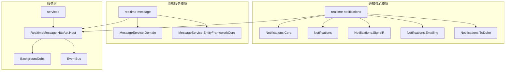
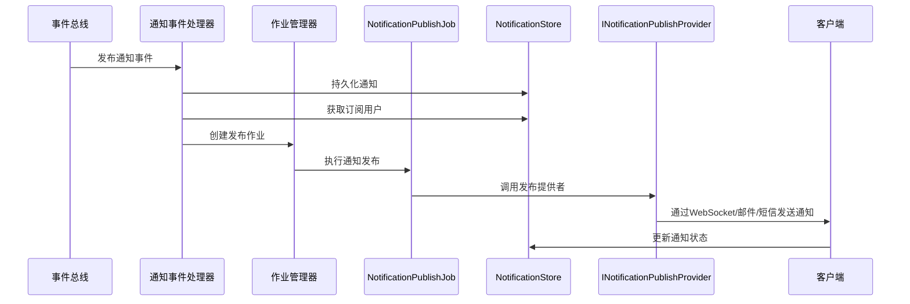
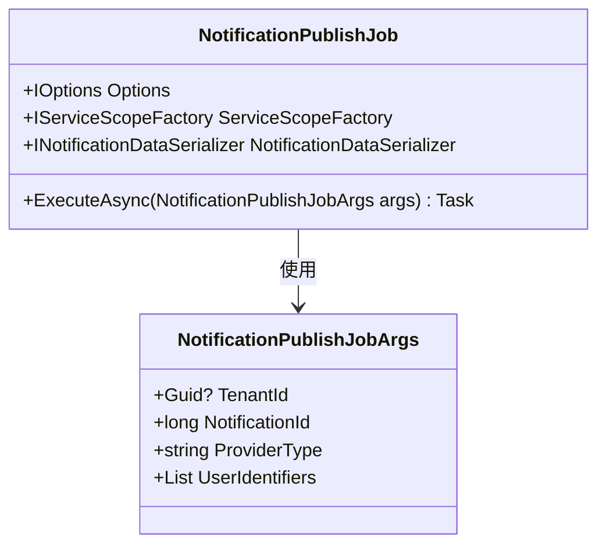
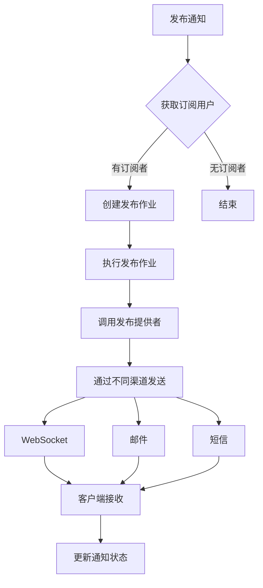

# 通知中心

<cite>
**本文档引用的文件**
- [NotificationPublishJob.cs](file://aspnet-core\services\LY.MicroService.RealtimeMessage.HttpApi.Host\BackgroundJobs\NotificationPublishJob.cs)
- [NotificationPublishJobArgs.cs](file://aspnet-core\services\LY.MicroService.RealtimeMessage.HttpApi.Host\BackgroundJobs\NotificationPublishJobArgs.cs)
- [NotificationInfo.cs](file://aspnet-core\modules\realtime-notifications\LINGYUN.Abp.Notifications.Core\LINGYUN\Abp\Notifications\NotificationInfo.cs)
- [NotificationData.cs](file://aspnet-core\modules\realtime-notifications\LINGYUN.Abp.Notifications.Core\LINGYUN\Abp\Notifications\NotificationData.cs)
- [INotificationPublishProvider.cs](file://aspnet-core\modules\realtime-notifications\LINGYUN.Abp.Notifications\LINGYUN\Abp\Notifications\INotificationPublishProvider.cs)
- [NotificationPublishProvider.cs](file://aspnet-core\modules\realtime-notifications\LINGYUN.Abp.Notifications\LINGYUN\Abp\Notifications\NotificationPublishProvider.cs)
- [SignalRNotificationPublishProvider.cs](file://aspnet-core\modules\realtime-notifications\LINGYUN.Abp.Notifications.SignalR\LINGYUN\Abp\Notifications\SignalR\SignalRNotificationPublishProvider.cs)
- [EmailingNotificationPublishProvider.cs](file://aspnet-core\modules\realtime-notifications\LINGYUN.Abp.Notifications.Emailing\LINGYUN\Abp\Notifications\Emailing\EmailingNotificationPublishProvider.cs)
- [TuiJuheNotificationPublishProvider.cs](file://aspnet-core\modules\realtime-notifications\LINGYUN.Abp.Notifications.TuiJuhe\LINGYUN\Abp\Notifications\TuiJuhe\TuiJuheNotificationPublishProvider.cs)
- [NotificationStore.cs](file://aspnet-core\modules\realtime-notifications\LINGYUN.Abp.Notifications.Domain\LINGYUN\Abp\Notifications\NotificationStore.cs)
- [INotificationStore.cs](file://aspnet-core\modules\realtime-notifications\LINGYUN.Abp.Notifications\LINGYUN\Abp\Notifications\INotificationStore.cs)
- [NotificationSubscriptionManager.cs](file://aspnet-core\modules\realtime-notifications\LINGYUN.Abp.Notifications\LINGYUN\Abp\Notifications\Internal\NotificationSubscriptionManager.cs)
- [INotificationSubscriptionManager.cs](file://aspnet-core\modules\realtime-notifications\LINGYUN.Abp.Notifications\LINGYUN\Abp\Notifications\INotificationSubscriptionManager.cs)
- [NotificationsHub.cs](file://aspnet-core\modules\realtime-notifications\LINGYUN.Abp.Notifications.SignalR\LINGYUN\Abp\Notifications\SignalR\Hubs\NotificationsHub.cs)
- [NotificationDefinition.cs](file://aspnet-core\modules\realtime-notifications\LINGYUN.Abp.Notifications.Core\LINGYUN\Abp\Notifications\NotificationDefinition.cs)
- [NotificationGroupDefinition.cs](file://aspnet-core\modules\realtime-notifications\LINGYUN.Abp.Notifications.Core\LINGYUN\Abp\Notifications\NotificationGroupDefinition.cs)
- [NotificationDefinitionRecord.cs](file://aspnet-core\modules\realtime-notifications\LINGYUN.Abp.Notifications.Domain\LINGYUN\Abp\Notifications\NotificationDefinitionRecord.cs)
- [NotificationEto.cs](file://aspnet-core\modules\realtime-notifications\LINGYUN.Abp.Notifications.Core\LINGYUN\Abp\Notifications\NotificationEto.cs)
- [NotificationLifetime.cs](file://aspnet-core\modules\realtime-notifications\LINGYUN.Abp.Notifications.Core\LINGYUN\Abp\Notifications\NotificationLifetime.cs)
- [NotificationType.cs](file://aspnet-core\modules\realtime-notifications\LINGYUN.Abp.Notifications.Core\LINGYUN\Abp\Notifications\NotificationType.cs)
- [NotificationContentType.cs](file://aspnet-core\modules\realtime-notifications\LINGYUN.Abp.Notifications.Core\LINGYUN\Abp\Notifications\NotificationContentType.cs)
</cite>

## 目录
1. [简介](#简介)
2. [项目结构](#项目结构)
3. [核心组件](#核心组件)
4. [架构概述](#架构概述)
5. [详细组件分析](#详细组件分析)
6. [依赖分析](#依赖分析)
7. [性能考虑](#性能考虑)
8. [故障排除指南](#故障排除指南)
9. [结论](#结论)

## 简介
本文档详细介绍了通知中心的实现机制，重点阐述了NotificationPublishJob作业的调度与执行流程、通知事件的发布-订阅模式、通知消息的持久化存储、状态管理以及推送策略。文档还涵盖了通知的多通道分发（如WebSocket、邮件、短信）实现方式，并提供了自定义通知类型的定义和发送方法，以及客户端如何订阅和处理通知消息的实际代码示例。

## 项目结构
通知中心功能主要分布在以下几个模块中：
- `realtime-notifications`：包含通知核心功能、SignalR集成、邮件通知、推送加(TuiJuhe)通知等
- `realtime-message`：包含消息服务和实时消息相关的功能
- `services`：包含实时消息HTTP API主机服务，其中包含通知发布作业

**Diagram sources**
- [realtime-notifications](file://aspnet-core\modules\realtime-notifications)
- [realtime-message](file://aspnet-core\modules\realtime-message)
- [services](file://aspnet-core\services)

## 核心组件
通知中心的核心组件包括通知发布作业、通知存储、通知订阅管理器、通知发布提供者等。这些组件共同协作，实现了完整的通知系统。

**Section sources**
- [NotificationPublishJob.cs](file://aspnet-core\services\LY.MicroService.RealtimeMessage.HttpApi.Host\BackgroundJobs\NotificationPublishJob.cs)
- [NotificationStore.cs](file://aspnet-core\modules\realtime-notifications\LINGYUN.Abp.Notifications.Domain\LINGYUN\Abp\Notifications\NotificationStore.cs)
- [NotificationSubscriptionManager.cs](file://aspnet-core\modules\realtime-notifications\LINGYUN.Abp.Notifications\LINGYUN\Abp\Notifications\Internal\NotificationSubscriptionManager.cs)

## 架构概述
通知中心采用发布-订阅模式，通过后台作业调度机制实现通知的异步发布。系统支持多通道分发，包括WebSocket、邮件、短信等。通知消息被持久化存储，支持状态管理和生命周期控制。

**Diagram sources**
- [NotificationPublishJob.cs](file://aspnet-core\services\LY.MicroService.RealtimeMessage.HttpApi.Host\BackgroundJobs\NotificationPublishJob.cs)
- [NotificationStore.cs](file://aspnet-core\modules\realtime-notifications\LINGYUN.Abp.Notifications.Domain\LINGYUN\Abp\Notifications\NotificationStore.cs)
- [INotificationPublishProvider.cs](file://aspnet-core\modules\realtime-notifications\LINGYUN.Abp.Notifications\LINGYUN\Abp\Notifications\INotificationPublishProvider.cs)

## 详细组件分析

### NotificationPublishJob作业分析
NotificationPublishJob是通知发布的核心后台作业，负责将通知消息通过不同的渠道发送给订阅用户。

**Diagram sources**
- [NotificationPublishJob.cs](file://aspnet-core\services\LY.MicroService.RealtimeMessage.HttpApi.Host\BackgroundJobs\NotificationPublishJob.cs)
- [NotificationPublishJobArgs.cs](file://aspnet-core\services\LY.MicroService.RealtimeMessage.HttpApi.Host\BackgroundJobs\NotificationPublishJobArgs.cs)

**Section sources**
- [NotificationPublishJob.cs](file://aspnet-core\services\LY.MicroService.RealtimeMessage.HttpApi.Host\BackgroundJobs\NotificationPublishJob.cs)
- [NotificationPublishJobArgs.cs](file://aspnet-core\services\LY.MicroService.RealtimeMessage.HttpApi.Host\BackgroundJobs\NotificationPublishJobArgs.cs)

### 通知发布-订阅模式分析
通知系统采用发布-订阅模式，通过事件总线接收通知事件，然后分发给相应的订阅用户。

**Diagram sources**
- [NotificationEventHandler.cs](file://aspnet-core\services\LY.MicroService.Applications.Single\EventBus\Distributed\NotificationEventHandler.cs)
- [NotificationSubscriptionManager.cs](file://aspnet-core\modules\realtime-notifications\LINGYUN.Abp.Notifications\LINGYUN\Abp\Notifications\Internal\NotificationSubscriptionManager.cs)

**Section sources**
- [NotificationEventHandler.cs](file://asp