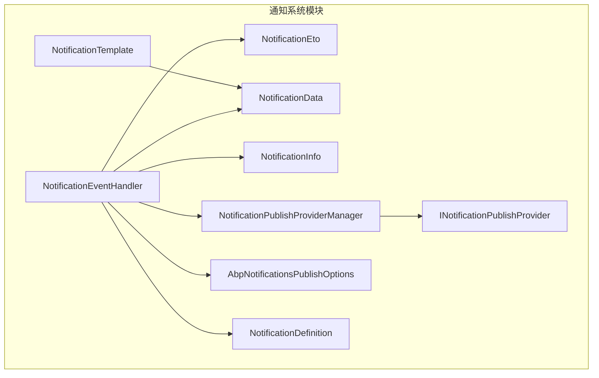
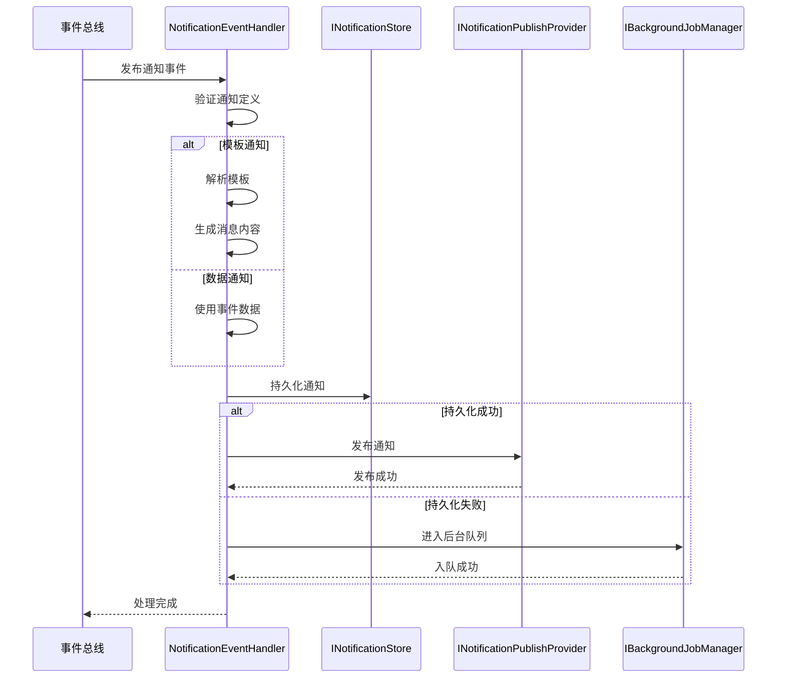
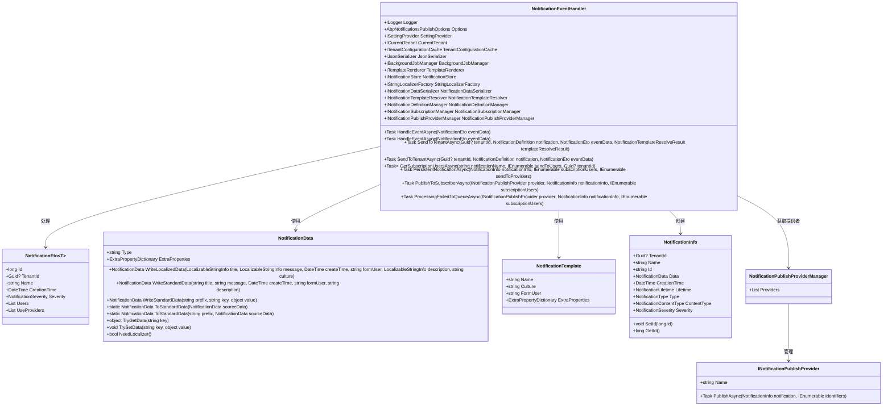
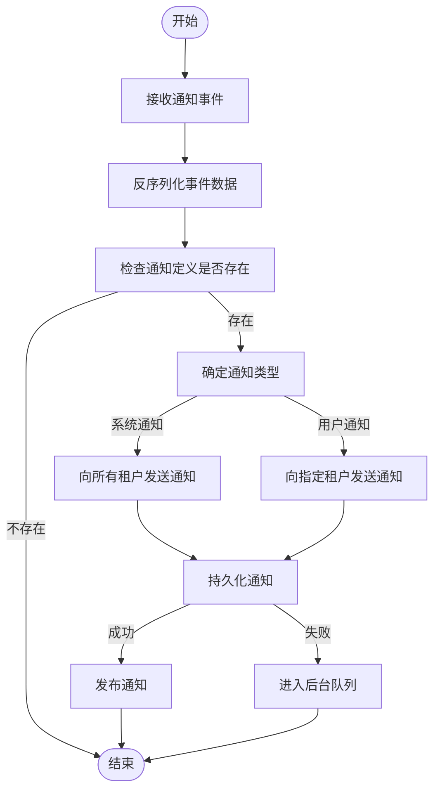
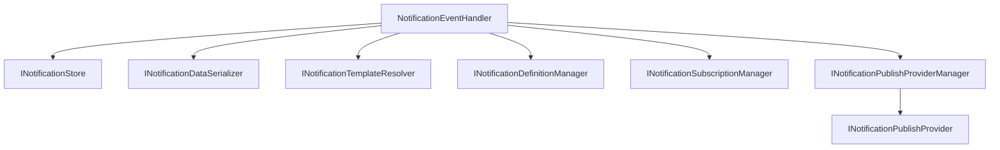

# 通知事件处理器

<cite>
**本文档引用的文件**  
- [NotificationEventHandler.cs](file://aspnet-core/services/LY.MicroService.RealtimeMessage.HttpApi.Host/EventBus/Distributed/NotificationEventHandler.cs)
- [NotificationEto.cs](file://aspnet-core/modules/realtime-notifications/LINGYUN.Abp.Notifications.Core/LINGYUN/Abp/Notifications/NotificationEto.cs)
- [NotificationData.cs](file://aspnet-core/modules/realtime-notifications/LINGYUN.Abp.Notifications.Core/LINGYUN/Abp/Notifications/NotificationData.cs)
- [NotificationTemplate.cs](file://aspnet-core/modules/realtime-notifications/LINGYUN.Abp.Notifications.Core/LINGYUN/Abp/Notifications/NotificationTemplate.cs)
- [NotificationInfo.cs](file://aspnet-core/modules/realtime-notifications/LINGYUN.Abp.Notifications.Core/LINGYUN/Abp/Notifications/NotificationInfo.cs)
- [NotificationPublishProviderManager.cs](file://aspnet-core/modules/realtime-notifications/LINGYUN.Abp.Notifications/LINGYUN/Abp/Notifications/NotificationPublishProviderManager.cs)
- [INotificationPublishProvider.cs](file://aspnet-core/modules/realtime-notifications/LINGYUN.Abp.Notifications/LINGYUN/Abp/Notifications/INotificationPublishProvider.cs)
- [AbpNotificationsPublishOptions.cs](file://aspnet-core/modules/realtime-notifications/LINGYUN.Abp.Notifications/LINGYUN/Abp/Notifications/AbpNotificationsPublishOptions.cs)
- [NotificationDefinition.cs](file://aspnet-core/modules/realtime-notifications/LINGYUN.Abp.Notifications.Core/LINGYUN/Abp/Notifications/NotificationDefinition.cs)
</cite>

## 目录
1. [简介](#简介)
2. [项目结构](#项目结构)
3. [核心组件](#核心组件)
4. [架构概述](#架构概述)
5. [详细组件分析](#详细组件分析)
6. [依赖分析](#依赖分析)
7. [性能考虑](#性能考虑)
8. [故障排除指南](#故障排除指南)
9. [结论](#结论)

## 简介
本文档详细介绍了通知事件处理器（NotificationEventHandler）的设计与实现。该处理器是系统中负责处理通知事件的核心组件，通过事件总线接收通知事件，执行反序列化、业务逻辑处理和状态更新等操作。文档将深入探讨其幂等性设计、事务管理、异常处理以及死信队列机制，并提供代码示例展示事件处理器的注册方式、依赖注入配置以及与CAP或RabbitMQ等消息中间件的集成细节。

## 项目结构
通知事件处理器位于 `aspnet-core/services/LY.MicroService.RealtimeMessage.HttpApi.Host/EventBus/Distributed/` 目录下，是实时消息微服务的一部分。该处理器依赖于多个模块，包括通知核心模块、通知应用模块和通知实体框架核心模块，这些模块共同构成了完整的通知系统。

**图源**  
- [NotificationEventHandler.cs](file://aspnet-core/services/LY.MicroService.RealtimeMessage.HttpApi.Host/EventBus/Distributed/NotificationEventHandler.cs)
- [NotificationEto.cs](file://aspnet-core/modules/realtime-notifications/LINGYUN.Abp.Notifications.Core/LINGYUN/Abp/Notifications/NotificationEto.cs)
- [NotificationData.cs](file://aspnet-core/modules/realtime-notifications/LINGYUN.Abp.Notifications.Core/LINGYUN/Abp/Notifications/NotificationData.cs)
- [NotificationTemplate.cs](file://aspnet-core/modules/realtime-notifications/LINGYUN.Abp.Notifications.Core/LINGYUN/Abp/Notifications/NotificationTemplate.cs)
- [NotificationInfo.cs](file://aspnet-core/modules/realtime-notifications/LINGYUN.Abp.Notifications.Core/LINGYUN/Abp/Notifications/NotificationInfo.cs)
- [NotificationPublishProviderManager.cs](file://aspnet-core/modules/realtime-notifications/LINGYUN.Abp.Notifications/LINGYUN/Abp/Notifications/NotificationPublishProviderManager.cs)
- [INotificationPublishProvider.cs](file://aspnet-core/modules/realtime-notifications/LINGYUN.Abp.Notifications/LINGYUN/Abp/Notifications/INotificationPublishProvider.cs)
- [AbpNotificationsPublishOptions.cs](file://aspnet-core/modules/realtime-notifications/LINGYUN.Abp.Notifications/LINGYUN/Abp/Notifications/AbpNotificationsPublishOptions.cs)
- [NotificationDefinition.cs](file://aspnet-core/modules/realtime-notifications/LINGYUN.Abp.Notifications.Core/LINGYUN/Abp/Notifications/NotificationDefinition.cs)

**节源**  
- [NotificationEventHandler.cs](file://aspnet-core/services/LY.MicroService.RealtimeMessage.HttpApi.Host/EventBus/Distributed/NotificationEventHandler.cs)

## 核心组件
通知事件处理器实现了 `IDistributedEventHandler<NotificationEto<NotificationTemplate>>` 和 `IDistributedEventHandler<NotificationEto<NotificationData>>` 接口，能够处理两种类型的通知事件：模板通知和数据通知。处理器通过依赖注入获取必要的服务，如 `INotificationStore`、`INotificationDataSerializer` 和 `INotificationTemplateResolver`，并在处理事件时使用这些服务完成相应的业务逻辑。

**节源**  
- [NotificationEventHandler.cs](file://aspnet-core/services/LY.MicroService.RealtimeMessage.HttpApi.Host/EventBus/Distributed/NotificationEventHandler.cs#L113-L144)

## 架构概述
通知事件处理器采用事件驱动架构，通过事件总线接收通知事件。处理器首先验证通知定义是否存在，然后根据通知类型（系统通知或用户通知）决定处理逻辑。对于模板通知，处理器会解析模板并生成最终的消息内容；对于数据通知，处理器直接使用事件中的数据。处理完成后，通知信息会被持久化到数据库，并通过指定的通知发布提供者发送给订阅用户。

**图源**  
- [NotificationEventHandler.cs](file://aspnet-core/services/LY.MicroService.RealtimeMessage.HttpApi.Host/EventBus/Distributed/NotificationEventHandler.cs)

## 详细组件分析
### 通知事件处理器分析
通知事件处理器的主要职责是接收并处理来自事件总线的通知事件。处理器通过 `HandleEventAsync` 方法处理两种类型的通知事件：`NotificationEto<NotificationTemplate>` 和 `NotificationEto<NotificationData>`。在处理过程中，处理器会检查通知定义是否存在，如果不存在则直接返回。对于系统通知，处理器会在所有活跃租户中发送通知；对于用户通知，则仅在指定租户中发送。

#### 对象导向组件

**图源**  
- [NotificationEventHandler.cs](file://aspnet-core/services/LY.MicroService.RealtimeMessage.HttpApi.Host/EventBus/Distributed/NotificationEventHandler.cs)
- [NotificationEto.cs](file://aspnet-core/modules/realtime-notifications/LINGYUN.Abp.Notifications.Core/LINGYUN/Abp/Notifications/NotificationEto.cs)
- [NotificationData.cs](file://aspnet-core/modules/realtime-notifications/LINGYUN.Abp.Notifications.Core/LINGYUN/Abp/Notifications/NotificationData.cs)
- [NotificationTemplate.cs](file://aspnet-core/modules/realtime-notifications/LINGYUN.Abp.Notifications.Core/LINGYUN/Abp/Notifications/NotificationTemplate.cs)
- [NotificationInfo.cs](file://aspnet-core/modules/realtime-notifications/LINGYUN.Abp.Notifications.Core/LINGYUN/Abp/Notifications/NotificationInfo.cs)
- [NotificationPublishProviderManager.cs](file://aspnet-core/modules/realtime-notifications/LINGYUN.Abp.Notifications/LINGYUN/Abp/Notifications/NotificationPublishProviderManager.cs)
- [INotificationPublishProvider.cs](file://aspnet-core/modules/realtime-notifications/LINGYUN.Abp.Notifications/LINGYUN/Abp/Notifications/INotificationPublishProvider.cs)

**节源**  
- [NotificationEventHandler.cs](file://aspnet-core/services/LY.MicroService.RealtimeMessage.HttpApi.Host/EventBus/Distributed/NotificationEventHandler.cs)

### 事件处理流程
通知事件处理器的处理流程可以分为以下几个步骤：
1. **事件接收**：处理器通过事件总线接收通知事件。
2. **反序列化**：处理器将事件数据反序列化为具体的对象。
3. **业务逻辑处理**：处理器根据通知类型执行相应的业务逻辑，如解析模板或直接使用数据。
4. **状态更新**：处理器将处理结果持久化到数据库，并通过通知发布提供者发送给订阅用户。

#### 复杂逻辑组件

**图源**  
- [NotificationEventHandler.cs](file://aspnet-core/services/LY.MicroService.RealtimeMessage.HttpApi.Host/EventBus/Distributed/NotificationEventHandler.cs)

**节源**  
- [NotificationEventHandler.cs](file://aspnet-core/services/LY.MicroService.RealtimeMessage.HttpApi.Host/EventBus/Distributed/NotificationEventHandler.cs)

## 依赖分析
通知事件处理器依赖于多个服务和模块，这些依赖关系确保了处理器能够正确地处理通知事件。主要依赖包括：
- `INotificationStore`：用于持久化通知信息。
- `INotificationDataSerializer`：用于序列化和反序列化通知数据。
- `INotificationTemplateResolver`：用于解析通知模板。
- `INotificationDefinitionManager`：用于获取通知定义。
- `INotificationSubscriptionManager`：用于获取用户订阅列表。
- `INotificationPublishProviderManager`：用于管理通知发布提供者。

**图源**  
- [NotificationEventHandler.cs](file://aspnet-core/services/LY.MicroService.RealtimeMessage.HttpApi.Host/EventBus/Distributed/NotificationEventHandler.cs)
- [INotificationPublishProviderManager.cs](file://aspnet-core/modules/realtime-notifications/LINGYUN.Abp.Notifications/LINGYUN/Abp/Notifications/INotificationPublishProviderManager.cs)
- [INotificationPublishProvider.cs](file://aspnet-core/modules/realtime-notifications/LINGYUN.Abp.Notifications/LINGYUN/Abp/Notifications/INotificationPublishProvider.cs)

**节源**  
- [NotificationEventHandler.cs](file://aspnet-core/services/LY.MicroService.RealtimeMessage.HttpApi.Host/EventBus/Distributed/NotificationEventHandler.cs)

## 性能考虑
通知事件处理器在设计时考虑了性能优化，特别是在处理大量通知事件时。处理器通过使用异步方法和后台作业来提高处理效率。此外，处理器还实现了幂等性设计，确保在高并发环境下不会重复处理同一事件。对于持久化失败的情况，处理器会将消息推送到后台队列，避免阻塞主线程。

## 故障排除指南
### 异常处理
通知事件处理器在处理过程中可能会遇到各种异常，如模板解析失败、持久化失败或发布失败。处理器通过日志记录异常信息，并在必要时将消息推送到后台队列。对于模板解析失败，处理器会记录警告日志并丢弃消息；对于持久化失败，处理器会尝试将消息推送到后台队列；对于发布失败，处理器同样会尝试将消息推送到后台队列。

### 死信队列机制
当通知发布失败时，处理器会将消息推送到后台队列。如果后台队列也失败，消息将被丢弃。这种机制确保了系统的稳定性和可靠性，避免了因单个消息处理失败