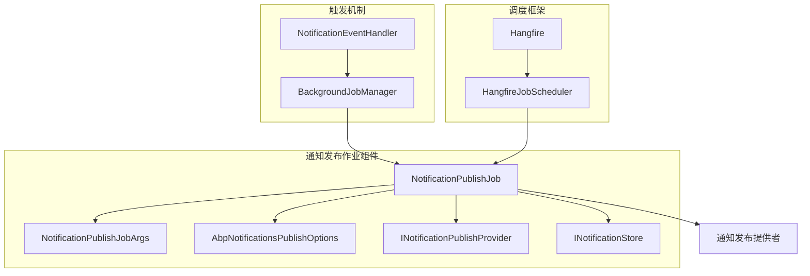
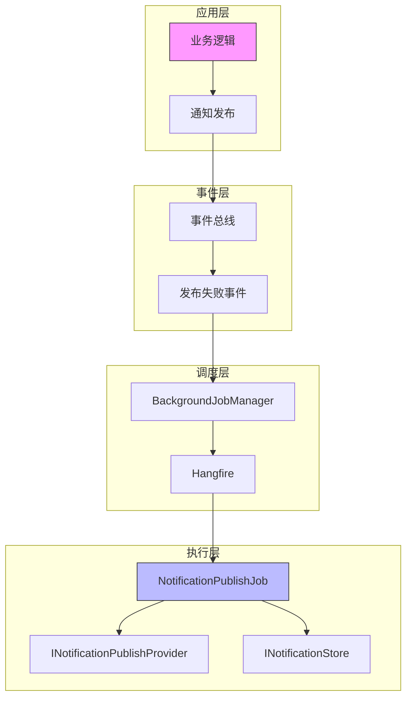
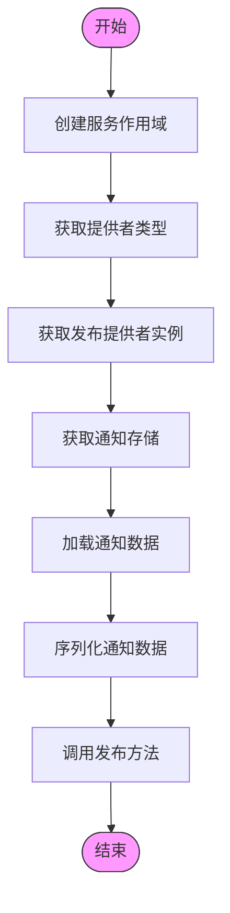
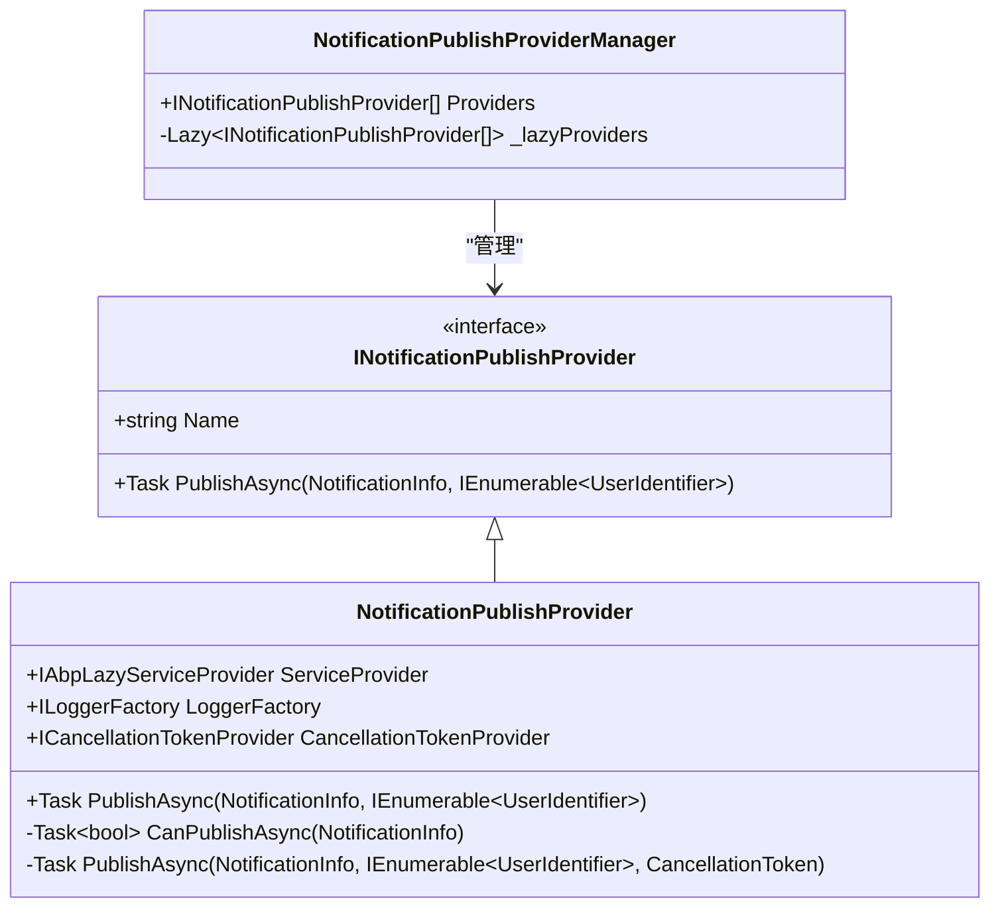
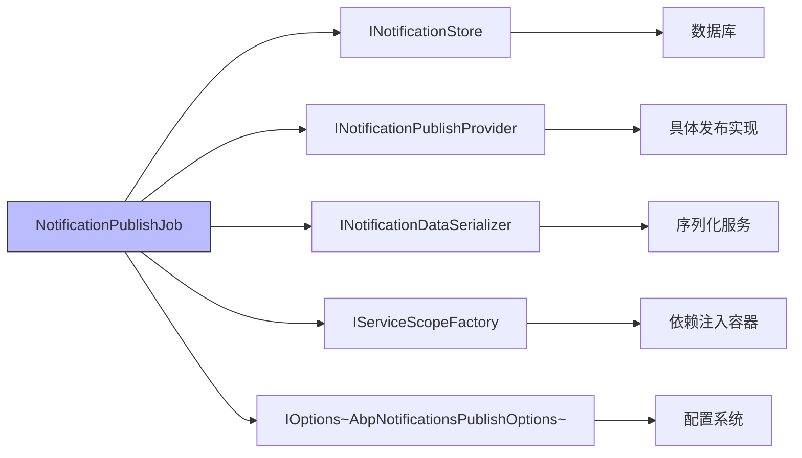

# 通知发布作业

<cite>
**本文档中引用的文件**  
- [NotificationPublishJob.cs](file://aspnet-core/services/LY.MicroService.Applications.Single/BackgroundJobs/NotificationPublishJob.cs)
- [NotificationPublishJobArgs.cs](file://aspnet-core/services/LY.MicroService.Applications.Single/BackgroundJobs/NotificationPublishJobArgs.cs)
- [AbpNotificationsPublishOptions.cs](file://aspnet-core/modules/realtime-notifications/LINGYUN.Abp.Notifications/LINGYUN/Abp/Notifications/AbpNotificationsPublishOptions.cs)
- [NotificationPublishProvider.cs](file://aspnet-core/modules/realtime-notifications/LINGYUN.Abp.Notifications/LINGYUN/Abp/Notifications/NotificationPublishProvider.cs)
- [NotificationEventHandler.cs](file://aspnet-core/services/LY.MicroService.Applications.Single/EventBus/Distributed/NotificationEventHandler.cs)
- [HangfireJobScheduler.cs](file://aspnet-core/modules/task-management/LINGYUN.Abp.BackgroundTasks.Hangfire/LINGYUN/Abp/BackgroundTasks/Hangfire/HangfireJobScheduler.cs)
</cite>

## 目录
1. [简介](#简介)
2. [项目结构](#项目结构)
3. [核心组件](#核心组件)
4. [架构概述](#架构概述)
5. [详细组件分析](#详细组件分析)
6. [依赖分析](#依赖分析)
7. [性能考虑](#性能考虑)
8. [故障排除指南](#故障排除指南)
9. [结论](#结论)

## 简介
通知发布作业（NotificationPublishJob）是系统中负责异步发布通知的核心后台作业。该作业通过事件总线机制接收通知发布请求，在主流程失败时自动将任务转入后台队列进行重试，确保通知的可靠传递。作业支持多租户架构，能够处理不同类型的通知发布提供者，并通过序列化机制保证通知数据的完整性。该作业与Hangfire等后台任务调度框架深度集成，实现了高可用性和可监控性的通知发布系统。

## 项目结构
通知发布作业主要分布在多个微服务应用中，包括LY.MicroService.Applications.Single、LY.AIO.Applications.Single和LY.MicroService.RealtimeMessage.HttpApi.Host等服务。作业的核心实现位于各服务的BackgroundJobs目录下，包含NotificationPublishJob和NotificationPublishJobArgs两个主要类。相关的配置选项定义在realtime-notifications模块中，而作业的触发机制则通过事件总线在EventBus/Distributed目录下的NotificationEventHandler中实现。整个作业系统与后台任务调度框架（如Hangfire）紧密集成，形成了完整的异步通知发布解决方案。

**Diagram sources**
- [NotificationPublishJob.cs](file://aspnet-core/services/LY.MicroService.Applications.Single/BackgroundJobs/NotificationPublishJob.cs)
- [NotificationPublishJobArgs.cs](file://aspnet-core/services/LY.MicroService.Applications.Single/BackgroundJobs/NotificationPublishJobArgs.cs)
- [AbpNotificationsPublishOptions.cs](file://aspnet-core/modules/realtime-notifications/LINGYUN.Abp.Notifications/LINGYUN/Abp/Notifications/AbpNotificationsPublishOptions.cs)
- [NotificationEventHandler.cs](file://aspnet-core/services/LY.MicroService.Applications.Single/EventBus/Distributed/NotificationEventHandler.cs)
- [HangfireJobScheduler.cs](file://aspnet-core/modules/task-management/LINGYUN.Abp.BackgroundTasks.Hangfire/LINGYUN/Abp/BackgroundTasks/Hangfire/HangfireJobScheduler.cs)

**Section sources**
- [NotificationPublishJob.cs](file://aspnet-core/services/LY.MicroService.Applications.Single/BackgroundJobs/NotificationPublishJob.cs)
- [NotificationPublishJobArgs.cs](file://aspnet-core/services/LY.MicroService.Applications.Single/BackgroundJobs/NotificationPublishJobArgs.cs)
- [AbpNotificationsPublishOptions.cs](file://aspnet-core/modules/realtime-notifications/LINGYUN.Abp.Notifications/LINGYUN/Abp/Notifications/AbpNotificationsPublishOptions.cs)

## 核心组件
通知发布作业的核心组件包括NotificationPublishJob、NotificationPublishJobArgs和相关的配置选项。NotificationPublishJob继承自AsyncBackgroundJob<NotificationPublishJobArgs>，负责执行具体的发布逻辑。NotificationPublishJobArgs类封装了作业执行所需的所有参数，包括租户ID、通知ID、提供者类型和用户标识符列表。AbpNotificationsPublishOptions类定义了通知发布的全局配置，如过期时间和日期格式。作业通过IServiceScopeFactory创建服务作用域，确保依赖注入的正确性，并使用INotificationDataSerializer对通知数据进行序列化处理。

**Section sources**
- [NotificationPublishJob.cs](file://aspnet-core/services/LY.MicroService.Applications.Single/BackgroundJobs/NotificationPublishJob.cs)
- [NotificationPublishJobArgs.cs](file://aspnet-core/services/LY.MicroService.Applications.Single/BackgroundJobs/NotificationPublishJobArgs.cs)
- [AbpNotificationsPublishOptions.cs](file://aspnet-core/modules/realtime-notifications/LINGYUN.Abp.Notifications/LINGYUN/Abp/Notifications/AbpNotificationsPublishOptions.cs)

## 架构概述
通知发布作业采用分层架构设计，上层为事件驱动的触发机制，中层为后台作业调度框架，底层为具体的作业执行逻辑。当通知发布失败时，系统通过事件总线将任务推入后台作业队列，由Hangfire等调度框架负责定时执行。作业执行时会根据提供的类型信息动态获取相应的通知发布提供者，并从通知存储中获取原始通知数据。整个架构支持水平扩展，多个工作节点可以并行处理通知发布任务，提高了系统的吞吐量和可靠性。

**Diagram sources**
- [NotificationPublishJob.cs](file://aspnet-core/services/LY.MicroService.Applications.Single/BackgroundJobs/NotificationPublishJob.cs)
- [NotificationEventHandler.cs](file://aspnet-core/services/LY.MicroService.Applications.Single/EventBus/Distributed/NotificationEventHandler.cs)
- [HangfireJobScheduler.cs](file://aspnet-core/modules/task-management/LINGYUN.Abp.BackgroundTasks.Hangfire/LINGYUN/Abp/BackgroundTasks/Hangfire/HangfireJobScheduler.cs)

## 详细组件分析

### 通知发布作业分析
通知发布作业的执行流程始于从数据库读取待发布通知，然后根据作业参数中的提供者类型实例化相应的通知发布提供者。作业使用服务作用域工厂创建独立的服务作用域，确保依赖注入的隔离性。在获取到通知存储服务后，作业会检索指定ID的通知信息，并对其进行序列化处理。最后，作业调用发布提供者的PublishAsync方法完成通知的实际发布。

#### 作业执行流程

**Diagram sources**
- [NotificationPublishJob.cs](file://aspnet-core/services/LY.MicroService.Applications.Single/BackgroundJobs/NotificationPublishJob.cs)

#### 通知发布提供者

**Diagram sources**
- [NotificationPublishProvider.cs](file://aspnet-core/modules/realtime-notifications/LINGYUN.Abp.Notifications/LINGYUN/Abp/Notifications/NotificationPublishProvider.cs)
- [NotificationPublishProviderManager.cs](file://aspnet-core/modules/realtime-notifications/LINGYUN.Abp.Notifications/LINGYUN/Abp/Notifications/NotificationPublishProviderManager.cs)

**Section sources**
- [NotificationPublishJob.cs](file://aspnet-core/services/LY.MicroService.Applications.Single/BackgroundJobs/NotificationPublishJob.cs)
- [NotificationPublishProvider.cs](file://aspnet-core/modules/realtime-notifications/LINGYUN.Abp.Notifications/LINGYUN/Abp/Notifications/NotificationPublishProvider.cs)

### 通知发布作业配置
通知发布作业的配置主要通过AbpNotificationsPublishOptions类进行管理。该类定义了通知发布的全局选项，包括过期时间（默认60天）和日期时间序列化格式（默认为"yyyy-MM-dd HH:mm:ss"）。配置系统还支持自定义通知发布提供者的注册，允许系统扩展支持新的通知渠道。作业的执行参数通过NotificationPublishJobArgs类进行传递，该类包含了租户ID、通知ID、提供者类型和接收用户列表等关键信息。

**Section sources**
- [AbpNotificationsPublishOptions.cs](file://aspnet-core/modules/realtime-notifications/LINGYUN.Abp.Notifications/LINGYUN/Abp/Notifications/AbpNotificationsPublishOptions.cs)
- [NotificationPublishJobArgs.cs](file://aspnet-core/services/LY.MicroService.Applications.Single/BackgroundJobs/NotificationPublishJobArgs.cs)

## 依赖分析
通知发布作业依赖于多个核心服务和接口，形成了复杂的依赖关系网络。作业直接依赖于INotificationStore用于访问通知数据，依赖于INotificationPublishProvider实现具体的发布逻辑，以及INotificationDataSerializer用于数据序列化。这些依赖通过构造函数注入的方式提供，确保了作业的可测试性和松耦合性。作业还依赖于后台任务管理器（BackgroundJobManager）来处理失败任务的重试，与事件总线系统紧密集成。

**Diagram sources**
- [NotificationPublishJob.cs](file://aspnet-core/services/LY.MicroService.Applications.Single/BackgroundJobs/NotificationPublishJob.cs)
- [AbpNotificationsPublishOptions.cs](file://aspnet-core/modules/realtime-notifications/LINGYUN.Abp.Notifications/LINGYUN/Abp/Notifications/AbpNotificationsPublishOptions.cs)

**Section sources**
- [NotificationPublishJob.cs](file://aspnet-core/services/LY.MicroService.Applications.Single/BackgroundJobs/NotificationPublishJob.cs)
- [AbpNotificationsPublishOptions.cs](file://aspnet-core/modules/realtime-notifications/LINGYUN.Abp.Notifications/LINGYUN/Abp/Notifications/AbpNotificationsPublishOptions.cs)

## 性能考虑
通知发布作业在设计时充分考虑了性能因素。作业采用异步执行模式，避免阻塞主线程，提高了系统的响应性。通过服务作用域的合理管理，减少了对象创建和销毁的开销。作业支持批量处理多个用户的通知，减少了数据库访问次数。与Hangfire等调度框架的集成允许作业在低峰时段执行，平衡了系统负载。此外，作业的异常处理机制避免了因单个通知失败而影响整体处理流程，保证了系统的稳定性和吞吐量。

## 故障排除指南
当通知发布作业出现问题时，首先应检查后台任务调度系统的状态，确保Hangfire等框架正常运行。查看作业执行日志，重点关注序列化错误、数据库连接问题和提供者初始化失败等异常。如果作业频繁失败，可能需要调整重试策略或检查通知数据的完整性。对于性能问题，可以监控作业队列的长度和处理速度，必要时增加工作节点或优化数据库查询。确保所有依赖服务（如通知存储和发布提供者）都处于可用状态也是排查问题的关键。

**Section sources**
- [NotificationPublishJob.cs](file://aspnet-core/services/LY.MicroService.Applications.Single/BackgroundJobs/NotificationPublishJob.cs)
- [NotificationEventHandler.cs](file://aspnet-core/services/LY.MicroService.Applications.Single/EventBus/Distributed/NotificationEventHandler.cs)

## 结论
通知发布作业是系统中关键的异步处理组件，通过与事件总线和后台任务调度框架的深度集成，实现了高可靠性的通知发布机制。作业的设计充分考虑了可扩展性、性能和容错能力，支持多租户和多种通知渠道。通过合理的配置和监控，该作业能够稳定高效地处理大量的通知发布任务，为系统的消息传递功能提供了坚实的基础。