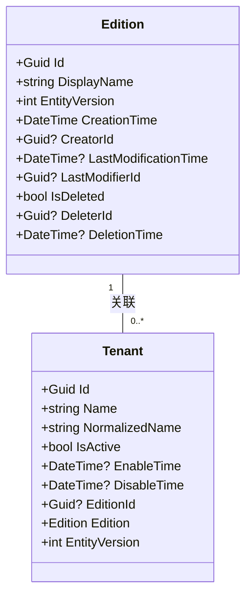
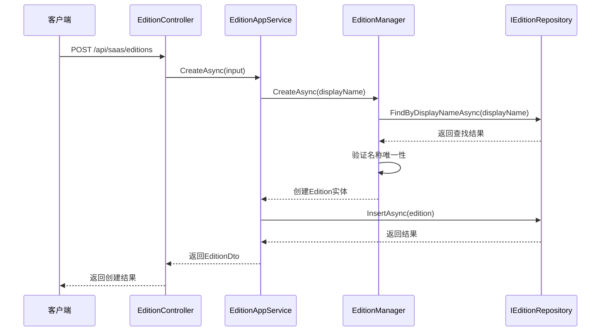
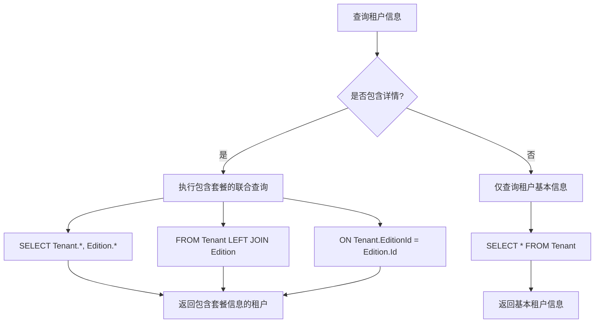
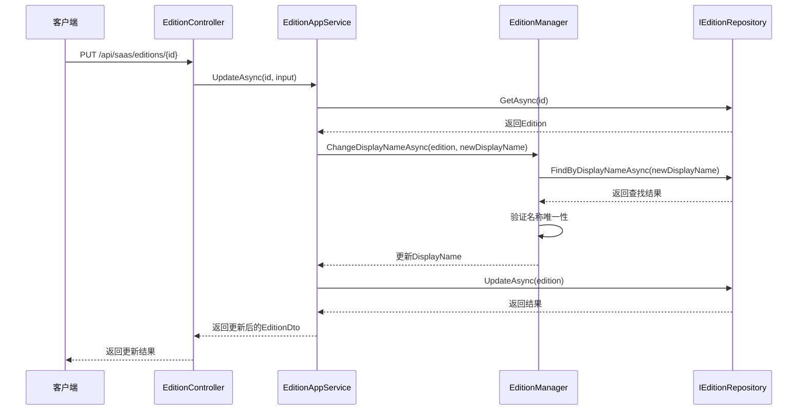
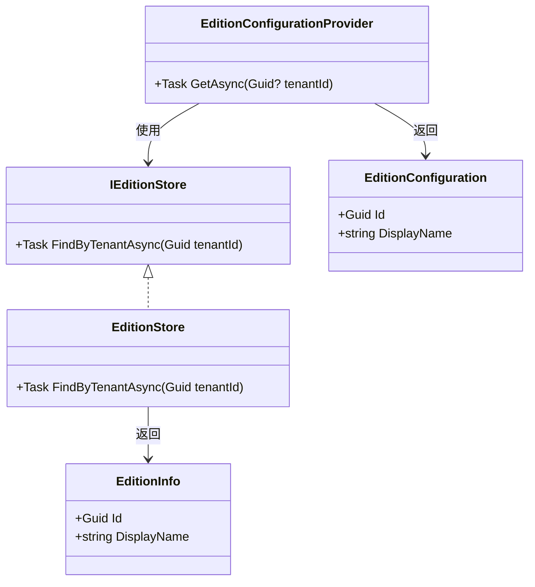
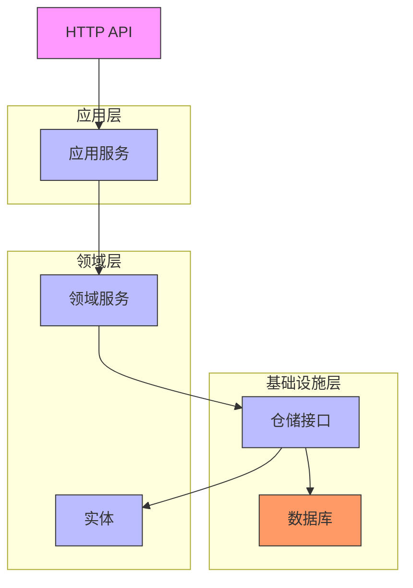

# 套餐管理

<cite>
**本文档引用的文件**  
- [Edition.cs](file://aspnet-core/modules/saas/LINGYUN.Abp.Saas.Domain/LINGYUN/Abp/Saas/Editions/Edition.cs)
- [EditionAppService.cs](file://aspnet-core/modules/saas/LINGYUN.Abp.Saas.Application/LINGYUN/Abp/Saas/Editions/EditionAppService.cs)
- [EditionController.cs](file://aspnet-core/modules/saas/LINGYUN.Abp.Saas.HttpApi/LINGYUN/Abp/Saas/Editions/EditionController.cs)
- [EditionDto.cs](file://aspnet-core/modules/saas/LINGYUN.Abp.Saas.Application.Contracts/LINGYUN/Abp/Saas/Editions/Dto/EditionDto.cs)
- [EditionCreateDto.cs](file://aspnet-core/modules/saas/LINGYUN.Abp.Saas.Application.Contracts/LINGYUN/Abp/Saas/Editions/Dto/EditionCreateDto.cs)
- [EditionUpdateDto.cs](file://aspnet-core/modules/saas/LINGYUN.Abp.Saas.Application.Contracts/LINGYUN/Abp/Saas/Editions/Dto/EditionUpdateDto.cs)
- [EditionGetListInput.cs](file://aspnet-core/modules/saas/LINGYUN.Abp.Saas.Application.Contracts/LINGYUN/Abp/Saas/Editions/Dto/EditionGetListInput.cs)
- [Tenant.cs](file://aspnet-core/modules/saas/LINGYUN.Abp.Saas.Domain/LINGYUN/Abp/Saas/Tenants/Tenant.cs)
- [EfCoreTenantRepository.cs](file://aspnet-core/modules/saas/LINGYUN.Abp.Saas.EntityFrameworkCore/LINGYUN/Abp/Saas/EntityFrameworkCore/EfCoreTenantRepository.cs)
- [EditionManager.cs](file://aspnet-core/modules/saas/LINGYUN.Abp.Saas.Domain/LINGYUN/Abp/Saas/Editions/EditionManager.cs)
- [IEditionRepository.cs](file://aspnet-core/modules/saas/LINGYUN.Abp.Saas.Domain/LINGYUN/Abp/Saas/Editions/IEditionRepository.cs)
- [EfCoreEditionRepository.cs](file://aspnet-core/modules/saas/LINGYUN.Abp.Saas.EntityFrameworkCore/LINGYUN/Abp/Saas/EntityFrameworkCore/EfCoreEditionRepository.cs)
- [EditionStore.cs](file://aspnet-core/modules/saas/LINGYUN.Abp.Saas.Domain/LINGYUN/Abp/Saas/Editions/EditionStore.cs)
- [EditionConfigurationProvider.cs](file://aspnet-core/framework/tenants/LINGYUN.Abp.MultiTenancy.Editions/LINGYUN/Abp/MultiTenancy/Editions/EditionConfigurationProvider.cs)
</cite>

## 目录
1. [简介](#简介)
2. [套餐核心概念](#套餐核心概念)
3. [套餐创建与定价](#套餐创建与定价)
4. [套餐与租户关联机制](#套餐与租户关联机制)
5. [套餐变更处理流程](#套餐变更处理流程)
6. [SaaS分级管理实现](#saas分级管理实现)
7. [API接口文档](#api接口文档)
8. [功能访问限制实现](#功能访问限制实现)
9. [架构概览](#架构概览)

## 简介
本文档详细介绍了ABP框架中套餐管理功能的实现机制。套餐（Edition）是SaaS系统中实现多租户分级服务的核心概念，通过为不同租户分配不同的套餐，可以实现功能限制、资源配额和定价策略的差异化管理。本文档将深入解析套餐的创建、配置、与租户的关联以及变更处理流程。

## 套餐核心概念
套餐（Edition）是SaaS系统中用于区分不同服务级别的基本单位。每个套餐包含一个唯一的显示名称（DisplayName），用于标识该套餐的级别和特性。套餐本身不直接包含功能限制规则，而是通过与全局功能开关（Global Features）结合使用来实现功能的启用和禁用。



**图示来源**  
- [Edition.cs](file://aspnet-core/modules/saas/LINGYUN.Abp.Saas.Domain/LINGYUN/Abp/Saas/Editions/Edition.cs#L1-L30)
- [Tenant.cs](file://aspnet-core/modules/saas/LINGYUN.Abp.Saas.Domain/LINGYUN/Abp/Saas/Tenants/Tenant.cs#L1-L30)

**本节来源**  
- [Edition.cs](file://aspnet-core/modules/saas/LINGYUN.Abp.Saas.Domain/LINGYUN/Abp/Saas/Editions/Edition.cs#L1-L30)
- [Tenant.cs](file://aspnet-core/modules/saas/LINGYUN.Abp.Saas.Domain/LINGYUN/Abp/Saas/Tenants/Tenant.cs#L1-L30)

## 套餐创建与定价
套餐的创建由`EditionManager`领域服务负责，该服务确保套餐名称的唯一性。创建套餐时，系统会验证显示名称是否已存在，如果存在则抛出`DuplicateEditionDisplayName`业务异常。



**图示来源**  
- [EditionController.cs](file://aspnet-core/modules/saas/LINGYUN.Abp.Saas.HttpApi/LINGYUN/Abp/Saas/Editions/EditionController.cs#L1-L60)
- [EditionAppService.cs](file://aspnet-core/modules/saas/LINGYUN.Abp.Saas.Application/LINGYUN/Abp/Saas/Editions/EditionAppService.cs#L1-L30)
- [EditionManager.cs](file://aspnet-core/modules/saas/LINGYUN.Abp.Saas.Domain/LINGYUN/Abp/Saas/Editions/EditionManager.cs#L1-L30)
- [IEditionRepository.cs](file://aspnet-core/modules/saas/LINGYUN.Abp.Saas.Domain/LINGYUN/Abp/Saas/Editions/IEditionRepository.cs#L1-L10)

**本节来源**  
- [EditionAppService.cs](file://aspnet-core/modules/saas/LINGYUN.Abp.Saas.Application/LINGYUN/Abp/Saas/Editions/EditionAppService.cs#L30-L50)
- [EditionManager.cs](file://aspnet-core/modules/saas/LINGYUN.Abp.Saas.Domain/LINGYUN/Abp/Saas/Editions/EditionManager.cs#L30-L55)
- [IEditionRepository.cs](file://aspnet-core/modules/saas/LINGYUN.Abp.Saas.Domain/LINGYUN/Abp/Saas/Editions/IEditionRepository.cs#L10-L20)

## 套餐与租户关联机制
套餐与租户的关联通过`Tenant`实体的`EditionId`属性实现。当租户被创建或更新时，可以指定其所属的套餐。系统通过`EfCoreTenantRepository`在查询租户信息时，自动关联其套餐信息。



**图示来源**  
- [EfCoreTenantRepository.cs](file://aspnet-core/modules/saas/LINGYUN.Abp.Saas.EntityFrameworkCore/LINGYUN/Abp/Saas/EntityFrameworkCore/EfCoreTenantRepository.cs#L100-L160)
- [Tenant.cs](file://aspnet-core/modules/saas/LINGYUN.Abp.Saas.Domain/LINGYUN/Abp/Saas/Tenants/Tenant.cs#L30-L40)

**本节来源**  
- [EfCoreTenantRepository.cs](file://aspnet-core/modules/saas/LINGYUN.Abp.Saas.EntityFrameworkCore/LINGYUN/Abp/Saas/EntityFrameworkCore/EfCoreTenantRepository.cs#L100-L160)
- [Tenant.cs](file://aspnet-core/modules/saas/LINGYUN.Abp.Saas.Domain/LINGYUN/Abp/Saas/Tenants/Tenant.cs#L30-L40)

## 套餐变更处理流程
套餐的变更处理包括套餐信息更新和租户套餐分配变更两种场景。套餐信息更新由`EditionManager`负责，确保更新后的套餐名称不与其他套餐冲突。租户套餐分配变更则通过更新`Tenant`实体的`EditionId`属性实现。



**图示来源**  
- [EditionController.cs](file://aspnet-core/modules/saas/LINGYUN.Abp.Saas.HttpApi/LINGYUN/Abp/Saas/Editions/EditionController.cs#L45-L60)
- [EditionAppService.cs](file://aspnet-core/modules/saas/LINGYUN.Abp.Saas.Application/LINGYUN/Abp/Saas/Editions/EditionAppService.cs#L70-L90)
- [EditionManager.cs](file://aspnet-core/modules/saas/LINGYUN.Abp.Saas.Domain/LINGYUN/Abp/Saas/Editions/EditionManager.cs#L30-L55)

**本节来源**  
- [EditionAppService.cs](file://aspnet-core/modules/saas/LINGYUN.Abp.Saas.Application/LINGYUN/Abp/Saas/Editions/EditionAppService.cs#L70-L90)
- [EditionManager.cs](file://aspnet-core/modules/saas/LINGYUN.Abp.Saas.Domain/LINGYUN/Abp/Saas/Editions/EditionManager.cs#L30-L55)

## SaaS分级管理实现
SaaS分级管理通过套餐与全局功能开关的结合实现。系统使用`EditionConfigurationProvider`从`IEditionStore`获取租户的套餐信息，并将其转换为`EditionConfiguration`，供应用程序在运行时查询当前租户的套餐级别。



**图示来源**  
- [IEditionStore.cs](file://aspnet-core/framework/tenants/LINGYUN.Abp.MultiTenancy.Editions/LINGYUN/Abp/MultiTenancy/Editions/IEditionStore.cs#L1-L10)
- [EditionStore.cs](file://aspnet-core/modules/saas/LINGYUN.Abp.Saas.Domain/LINGYUN/Abp/Saas/Editions/EditionStore.cs#L1-L40)
- [EditionConfigurationProvider.cs](file://aspnet-core/framework/tenants/LINGYUN.Abp.MultiTenancy.Editions/LINGYUN/Abp/MultiTenancy/Editions/EditionConfigurationProvider.cs#L1-L30)

**本节来源**  
- [IEditionStore.cs](file://aspnet-core/framework/tenants/LINGYUN.Abp.MultiTenancy.Editions/LINGYUN/Abp/MultiTenancy/Editions/IEditionStore.cs#L1-L10)
- [EditionStore.cs](file://aspnet-core/modules/saas/LINGYUN.Abp.Saas.Domain/LINGYUN/Abp/Saas/Editions/EditionStore.cs#L1-L40)
- [EditionConfigurationProvider.cs](file://aspnet-core/framework/tenants/LINGYUN.Abp.MultiTenancy.Editions/LINGYUN/Abp/MultiTenancy/Editions/EditionConfigurationProvider.cs#L1-L30)

## API接口文档
套餐管理提供了一套完整的RESTful API接口，支持套餐的增删改查操作。

### 套餐创建
- **端点**: `POST /api/saas/editions`
- **权限**: `AbpSaasPermissions.Editions.Create`
- **请求体**: `EditionCreateDto`
  - `DisplayName` (string): 套餐显示名称
- **响应**: `EditionDto`
  - `Id` (Guid): 套餐ID
  - `DisplayName` (string): 套餐显示名称
  - `CreationTime` (DateTime): 创建时间

### 套餐查询
- **端点**: `GET /api/saas/editions`
- **权限**: 无（需登录）
- **查询参数**: `EditionGetListInput`
  - `Filter` (string): 过滤条件
  - `Sorting` (string): 排序字段
  - `MaxResultCount` (int): 最大结果数
  - `SkipCount` (int): 跳过数量
- **响应**: `PagedResultDto<EditionDto>`

### 套餐更新
- **端点**: `PUT /api/saas/editions/{id}`
- **权限**: `AbpSaasPermissions.Editions.Update`
- **路径参数**: `id` (Guid): 套餐ID
- **请求体**: `EditionUpdateDto`
  - `DisplayName` (string): 新的套餐显示名称
  - `ConcurrencyStamp` (string): 并发标记
- **响应**: `EditionDto`

### 套餐删除
- **端点**: `DELETE /api/saas/editions/{id}`
- **权限**: `AbpSaasPermissions.Editions.Delete`
- **路径参数**: `id` (Guid): 套餐ID
- **响应**: 无

**本节来源**  
- [EditionController.cs](file://aspnet-core/modules/saas/LINGYUN.Abp.Saas.HttpApi/LINGYUN/Abp/Saas/Editions/EditionController.cs#L1-L60)
- [EditionDto.cs](file://aspnet-core/modules/saas/LINGYUN.Abp.Saas.Application.Contracts/LINGYUN/Abp/Saas/Editions/Dto/EditionDto.cs#L1-L15)
- [EditionCreateDto.cs](file://aspnet-core/modules/saas/LINGYUN.Abp.Saas.Application.Contracts/LINGYUN/Abp/Saas/Editions/Dto/EditionCreateDto.cs#L1-L10)
- [EditionUpdateDto.cs](file://aspnet-core/modules/saas/LINGYUN.Abp.Saas.Application.Contracts/LINGYUN/Abp/Saas/Editions/Dto/EditionUpdateDto.cs#L1-L10)
- [EditionGetListInput.cs](file://aspnet-core/modules/saas/LINGYUN.Abp.Saas.Application.Contracts/LINGYUN/Abp/Saas/Editions/Dto/EditionGetListInput.cs#L1-L10)

## 功能访问限制实现
在业务逻辑中，可以通过`EditionConfigurationProvider`获取当前租户的套餐信息，并根据套餐级别限制功能访问。

```csharp
public async Task DoSomething()
{
    var editionConfig = await _editionConfigurationProvider.GetAsync(CurrentTenant.Id);
    if (editionConfig == null || editionConfig.DisplayName != "Premium")
    {
        throw new AbpAuthorizationException("此功能仅限高级套餐用户使用");
    }
    
    // 执行高级功能
}
```

此外，系统还支持通过全局功能开关（Global Features）实现更细粒度的功能控制，可以在运行时动态启用或禁用特定功能。

**本节来源**  
- [EditionConfigurationProvider.cs](file://aspnet-core/framework/tenants/LINGYUN.Abp.MultiTenancy.Editions/LINGYUN/Abp/MultiTenancy/Editions/EditionConfigurationProvider.cs#L1-L30)
- [IEditionConfigurationProvider.cs](file://aspnet-core/framework/tenants/LINGYUN.Abp.MultiTenancy.Editions/LINGYUN/Abp/MultiTenancy/Editions/IEditionConfigurationProvider.cs#L1-L10)

## 架构概览
套餐管理功能采用分层架构设计，包括应用层、领域层和基础设施层。各层职责分明，通过依赖注入实现松耦合。



**图示来源**  
- [EditionController.cs](file://aspnet-core/modules/saas/LINGYUN.Abp.Saas.HttpApi/LINGYUN/Abp/Saas/Editions/EditionController.cs#L1-L60)
- [EditionAppService.cs](file://aspnet-core/modules/saas/LINGYUN.Abp.Saas.Application/LINGYUN/Abp/Saas/Editions/EditionAppService.cs#L1-L90)
- [EditionManager.cs](file://aspnet-core/modules/saas/LINGYUN.Abp.Saas.Domain/LINGYUN/Abp/Saas/Editions/EditionManager.cs#L1-L55)
- [IEditionRepository.cs](file://aspnet-core/modules/saas/LINGYUN.Abp.Saas.Domain/LINGYUN/Abp/Saas/Editions/IEditionRepository.cs#L1-L35)
- [Edition.cs](file://aspnet-core/modules/saas/LINGYUN.Abp.Saas.Domain/LINGYUN/Abp/Saas/Editions/Edition.cs#L1-L30)
- [EfCoreEditionRepository.cs](file://aspnet-core/modules/saas/LINGYUN.Abp.Saas.EntityFrameworkCore/LINGYUN/Abp/Saas/EntityFrameworkCore/EfCoreEditionRepository.cs#L1-L75)

**本节来源**  
- [EditionController.cs](file://aspnet-core/modules/saas/LINGYUN.Abp.Saas.HttpApi/LINGYUN/Abp/Saas/Editions/EditionController.cs#L1-L60)
- [EditionAppService.cs](file://aspnet-core/modules/saas/LINGYUN.Abp.Saas.Application/LINGYUN/Abp/Saas/Editions/EditionAppService.cs#L1-L90)
- [EditionManager.cs](file://aspnet-core/modules/saas/LINGYUN.Abp.Saas.Domain/LINGYUN/Abp/Saas/Editions/EditionManager.cs#L1-L55)
- [IEditionRepository.cs](file://aspnet-core/modules/saas/LINGYUN.Abp.Saas.Domain/LINGYUN/Abp/Saas/Editions/IEditionRepository.cs#L1-L35)
- [Edition.cs](file://aspnet-core/modules/saas/LINGYUN.Abp.Saas.Domain/LINGYUN/Abp/Saas/Editions/Edition.cs#L1-L30)
- [EfCoreEditionRepository.cs](