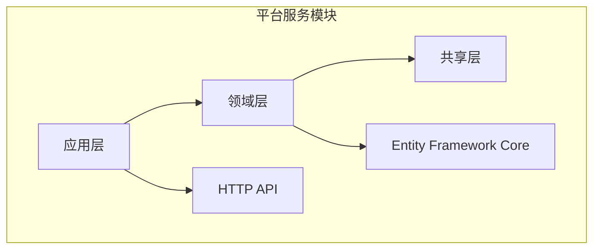
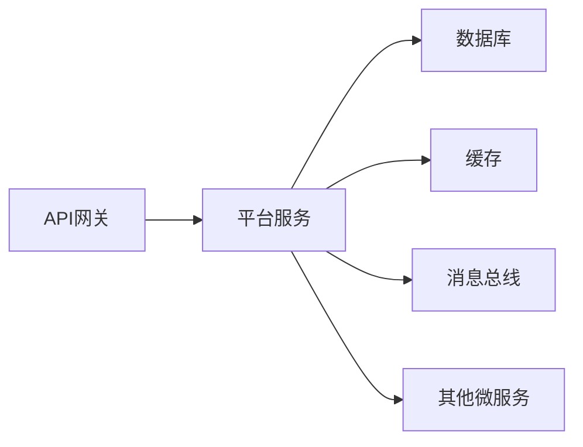
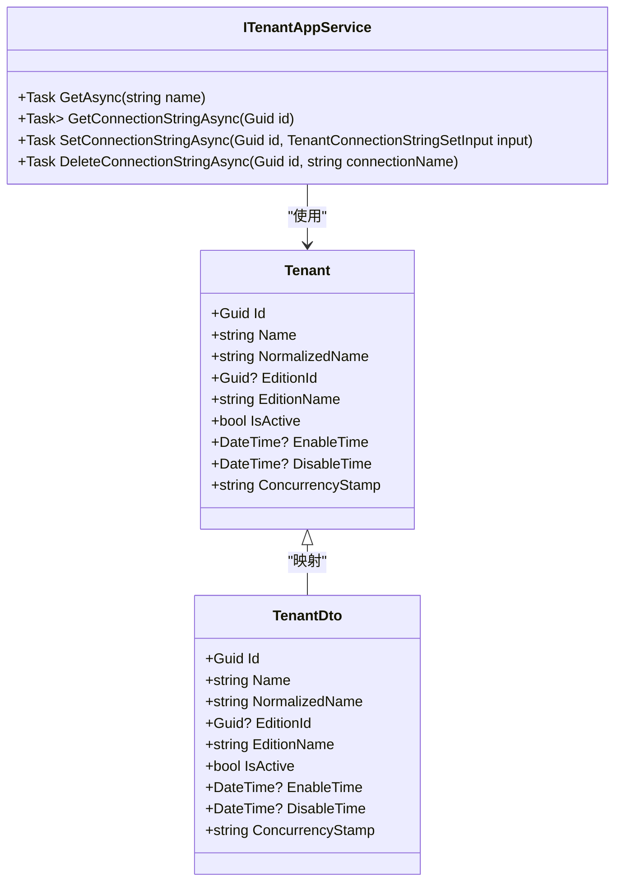
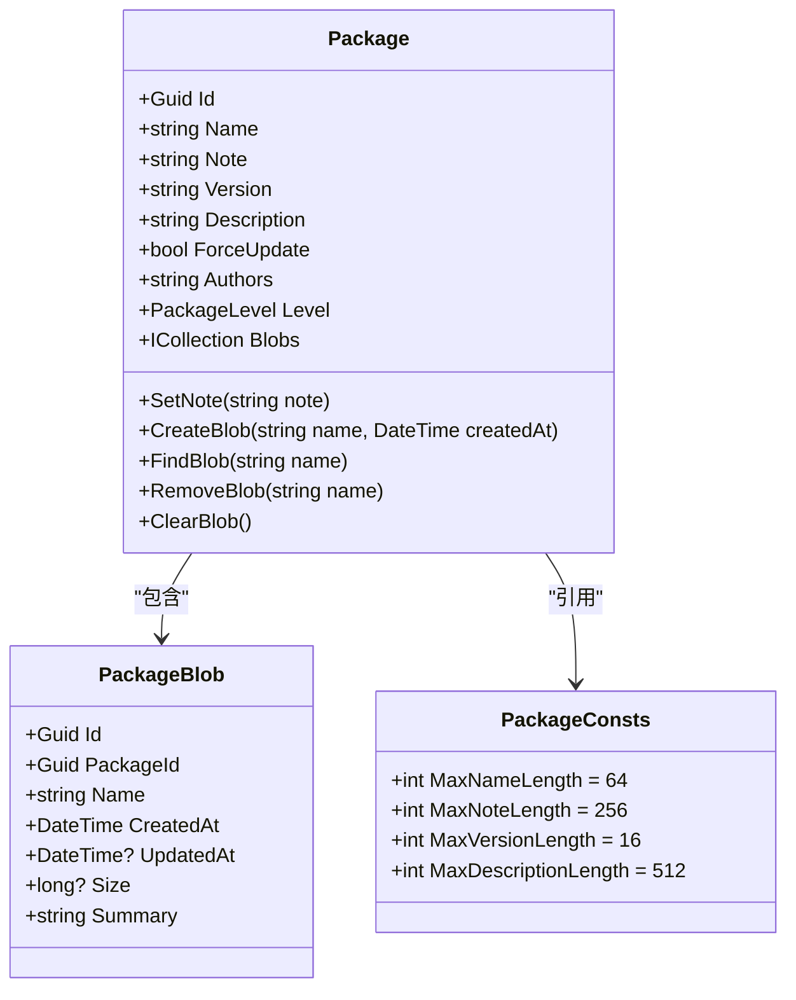
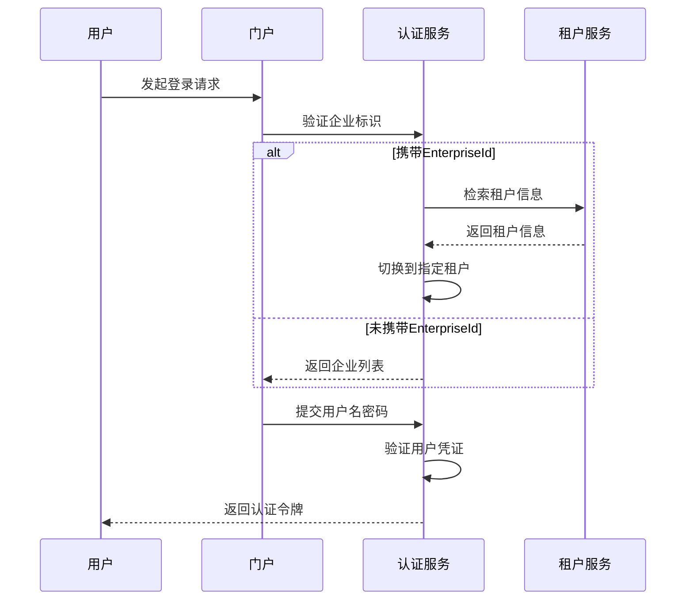
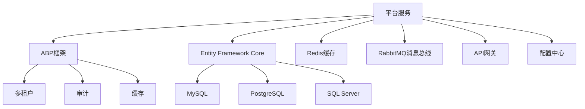

# 平台服务

<cite>
**本文档引用的文件**  
- [PlatformApplicationModule.cs](file://aspnet-core/modules/platform/LINGYUN.Platform.Application/LINGYUN/Platform/PlatformApplicationModule.cs)
- [PlatformDomainModule.cs](file://aspnet-core/modules/platform/LINGYUN.Platform.Domain/LINGYUN/Platform/PlatformDomainModule.cs)
- [PlatformConsts.cs](file://aspnet-core/modules/platform/LINGYUN.Platform.Domain.Shared/LINGYUN/Platform/PlatformConsts.cs)
- [PlatformErrorCodes.cs](file://aspnet-core/modules/platform/LINGYUN.Platform.Domain.Shared/LINGYUN/Platform/PlatformErrorCodes.cs)
- [Package.cs](file://aspnet-core/modules/platform/LINGYUN.Platform.Domain/LINGYUN/Platform/Packages/Package.cs)
- [TenantConfigurationCache.cs](file://aspnet-core/services/LY.MicroService.PlatformManagement.HttpApi.Host/MultiTenancy/TenantConfigurationCache.cs)
- [ITenantAppService.cs](file://aspnet-core/modules/saas/LINGYUN.Abp.Saas.Application.Contracts/LINGYUN/Abp/Saas/Tenants/ITenantAppService.cs)
- [Tenant.cs](file://aspnet-core/modules/saas/LINGYUN.Abp.Saas.Domain/LINGYUN/Abp/Saas/Tenants/Tenant.cs)
- [PortalGrantValidator](file://aspnet-core/modules/identityServer/LINGYUN.Abp.IdentityServer.Portal/README.md)
</cite>

## 目录
1. [简介](#简介)
2. [项目结构](#项目结构)
3. [核心组件](#核心组件)
4. [架构概述](#架构概述)
5. [详细组件分析](#详细组件分析)
6. [依赖分析](#依赖分析)
7. [性能考虑](#性能考虑)
8. [故障排除指南](#故障排除指南)
9. [结论](#结论)

## 简介
平台服务是整个微服务生态系统的核心管理组件，负责租户管理、套餐管理、门户配置等平台级功能。该服务实现了完整的多租户架构，为整个系统提供基础支撑能力。平台服务通过模块化设计，实现了租户生命周期管理、资源配置和计费模型等关键功能，确保了系统的可扩展性和灵活性。

## 项目结构
平台服务采用分层架构设计，包含应用层、领域层和共享层。应用层负责业务逻辑的编排和API暴露，领域层包含核心业务实体和领域逻辑，共享层定义了常量、错误码等共享资源。服务通过Entity Framework Core实现数据持久化，并利用ABP框架提供的多租户支持实现数据隔离。

**图示来源**
- [PlatformApplicationModule.cs](file://aspnet-core/modules/platform/LINGYUN.Platform.Application/LINGYUN/Platform/PlatformApplicationModule.cs)
- [PlatformDomainModule.cs](file://aspnet-core/modules/platform/LINGYUN.Platform.Domain/LINGYUN/Platform/PlatformDomainModule.cs)

**本节来源**
- [PlatformApplicationModule.cs](file://aspnet-core/modules/platform/LINGYUN.Platform.Application/LINGYUN/Platform/PlatformApplicationModule.cs)
- [PlatformDomainModule.cs](file://aspnet-core/modules/platform/LINGYUN.Platform.Domain/LINGYUN/Platform/PlatformDomainModule.cs)

## 核心组件
平台服务的核心组件包括租户管理、套餐管理和门户配置。租户管理实现了完整的租户生命周期，包括创建、激活、停用和删除。套餐管理提供了灵活的版本控制和资源分配机制。门户配置支持企业级门户的认证和个性化设置。这些组件通过领域驱动设计原则进行组织，确保了业务逻辑的清晰性和可维护性。

**本节来源**
- [PlatformApplicationModule.cs](file://aspnet-core/modules/platform/LINGYUN.Platform.Application/LINGYUN/Platform/PlatformApplicationModule.cs)
- [PlatformDomainModule.cs](file://aspnet-core/modules/platform/LINGYUN.Platform.Domain/LINGYUN/Platform/PlatformDomainModule.cs)

## 架构概述
平台服务采用微服务架构，与其他服务通过API网关进行通信。服务内部采用分层架构，遵循领域驱动设计原则。多租户支持通过ABP框架实现，数据隔离策略包括数据库级隔离和表级隔离。缓存机制用于提高租户配置的访问性能，分布式事件用于跨服务的数据同步。

**图示来源**
- [TenantConfigurationCache.cs](file://aspnet-core/services/LY.MicroService.PlatformManagement.HttpApi.Host/MultiTenancy/TenantConfigurationCache.cs)
- [PlatformDomainModule.cs](file://aspnet-core/modules/platform/LINGYUN.Platform.Domain/LINGYUN/Platform/PlatformDomainModule.cs)

## 详细组件分析

### 租户管理分析
租户管理是平台服务的核心功能之一，负责管理系统的租户生命周期。服务提供了完整的租户CRUD操作，包括创建、读取、更新和删除。租户状态管理支持激活和停用，确保资源的合理分配。租户配置缓存机制提高了配置信息的访问性能，减少了数据库查询压力。

**图示来源**
- [Tenant.cs](file://aspnet-core/modules/saas/LINGYUN.Abp.Saas.Domain/LINGYUN/Abp/Saas/Tenants/Tenant.cs)
- [ITenantAppService.cs](file://aspnet-core/modules/saas/LINGYUN.Abp.Saas.Application.Contracts/LINGYUN/Abp/Saas/Tenants/ITenantAppService.cs)

**本节来源**
- [Tenant.cs](file://aspnet-core/modules/saas/LINGYUN.Abp.Saas.Domain/LINGYUN/Abp/Saas/Tenants/Tenant.cs)
- [ITenantAppService.cs](file://aspnet-core/modules/saas/LINGYUN.Abp.Saas.Application.Contracts/LINGYUN/Abp/Saas/Tenants/ITenantAppService.cs)

### 套餐管理分析
套餐管理组件负责管理系统的版本和资源包。每个套餐包含多个资源文件，支持版本控制和强制更新。套餐实体定义了名称、版本、描述等基本信息，并通过集合属性管理关联的资源文件。套餐管理提供了创建、更新、删除资源文件的完整操作接口。

**图示来源**
- [Package.cs](file://aspnet-core/modules/platform/LINGYUN.Platform.Domain/LINGYUN/Platform/Packages/Package.cs)
- [PackageConsts.cs](file://aspnet-core/modules/platform/LINGYUN.Platform.Domain.Shared/LINGYUN/Platform/Packages/PackageConsts.cs)

**本节来源**
- [Package.cs](file://aspnet-core/modules/platform/LINGYUN.Platform.Domain/LINGYUN/Platform/Packages/Package.cs)
- [PackageConsts.cs](file://aspnet-core/modules/platform/LINGYUN.Platform.Domain.Shared/LINGYUN/Platform/Packages/PackageConsts.cs)

### 门户配置分析
门户配置组件支持企业级门户的认证和个性化设置。通过PortalGrantValidator实现门户授权验证，支持企业门户登录和多租户认证。认证流程包括企业标识验证、租户切换和用户密码验证。门户配置还支持企业信息的验证和安全日志记录，确保认证过程的安全性。

**图示来源**
- [PortalGrantValidator](file://aspnet-core/modules/identityServer/LINGYUN.Abp.IdentityServer.Portal/README.md)
- [TenantConfigurationCache.cs](file://aspnet-core/services/LY.MicroService.PlatformManagement.HttpApi.Host/MultiTenancy/TenantConfigurationCache.cs)

**本节来源**
- [PortalGrantValidator](file://aspnet-core/modules/identityServer/LINGYUN.Abp.IdentityServer.Portal/README.md)
- [TenantConfigurationCache.cs](file://aspnet-core/services/LY.MicroService.PlatformManagement.HttpApi.Host/MultiTenancy/TenantConfigurationCache.cs)

## 依赖分析
平台服务依赖于多个核心组件和外部服务。服务依赖ABP框架提供的多租户、审计、缓存等基础功能。数据持久化依赖Entity Framework Core和多种数据库提供程序。服务间通信通过API网关和消息总线实现。配置管理依赖分布式配置中心，确保配置的一致性和实时性。

**图示来源**
- [PlatformDomainModule.cs](file://aspnet-core/modules/platform/LINGYUN.Platform.Domain/LINGYUN/Platform/PlatformDomainModule.cs)
- [PlatformApplicationModule.cs](file://aspnet-core/modules/platform/LINGYUN.Platform.Application/LINGYUN/Platform/PlatformApplicationModule.cs)

**本节来源**
- [PlatformDomainModule.cs](file://aspnet-core/modules/platform/LINGYUN.Platform.Domain/LINGYUN/Platform/PlatformDomainModule.cs)
- [PlatformApplicationModule.cs](file://aspnet-core/modules/platform/LINGYUN.Platform.Application/LINGYUN/Platform/PlatformApplicationModule.cs)

## 性能考虑
平台服务在设计时充分考虑了性能因素。租户配置信息采用分布式缓存存储，减少数据库查询次数。套餐资源文件使用对象存储服务，提高文件访问性能。异步处理机制用于耗时操作，避免阻塞主线程。批量操作接口支持大规模数据处理，提高系统吞吐量。监控和日志系统用于性能分析和问题定位。

## 故障排除指南
常见问题包括租户配置加载失败、套餐版本冲突和门户认证失败。租户配置问题通常与缓存服务有关，检查Redis连接状态和缓存键是否存在。套餐版本冲突可能是由于并发更新导致，检查版本号和更新时间戳。门户认证失败需要检查企业标识、用户名密码和租户状态。日志文件和监控指标是故障排除的重要工具。

**本节来源**
- [PlatformErrorCodes.cs](file://aspnet-core/modules/platform/LINGYUN.Platform.Domain.Shared/LINGYUN/Platform/PlatformErrorCodes.cs)
- [TenantConfigurationCache.cs](file://aspnet-core/services/LY.MicroService.PlatformManagement.HttpApi.Host/MultiTenancy/TenantConfigurationCache.cs)

## 结论
平台服务作为微服务生态系统的管理核心，提供了完整的租户管理、套餐管理和门户配置功能。服务采用现代化的架构设计，具有良好的可扩展性和可维护性。多租户支持和数据隔离策略确保了系统的安全性和稳定性。通过合理的性能优化和错误处理机制，平台服务能够满足大规模企业应用的需求。