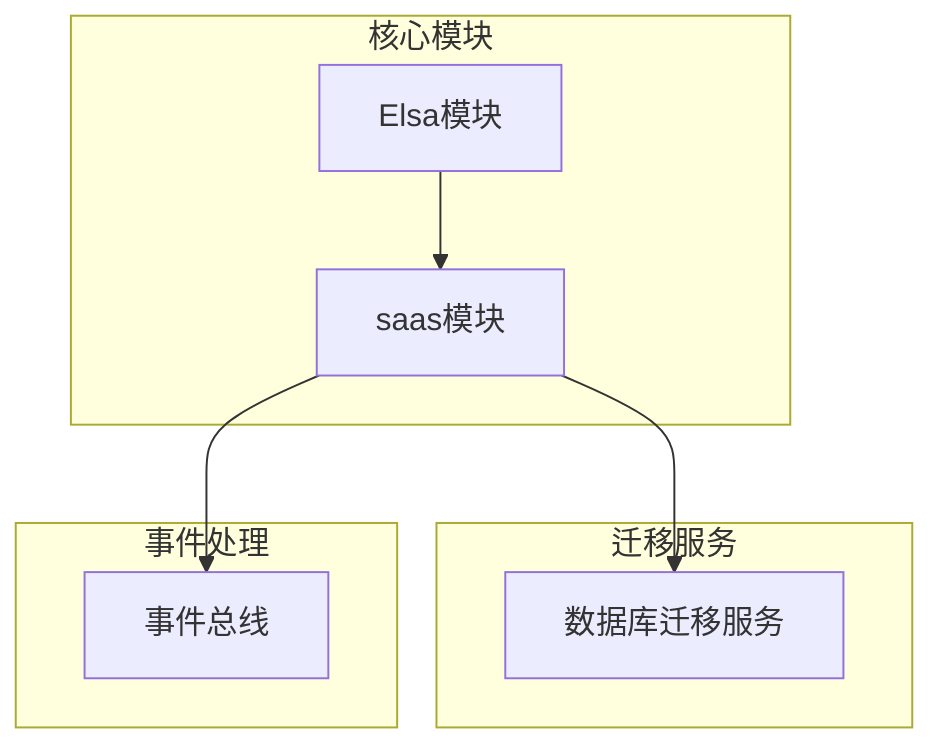
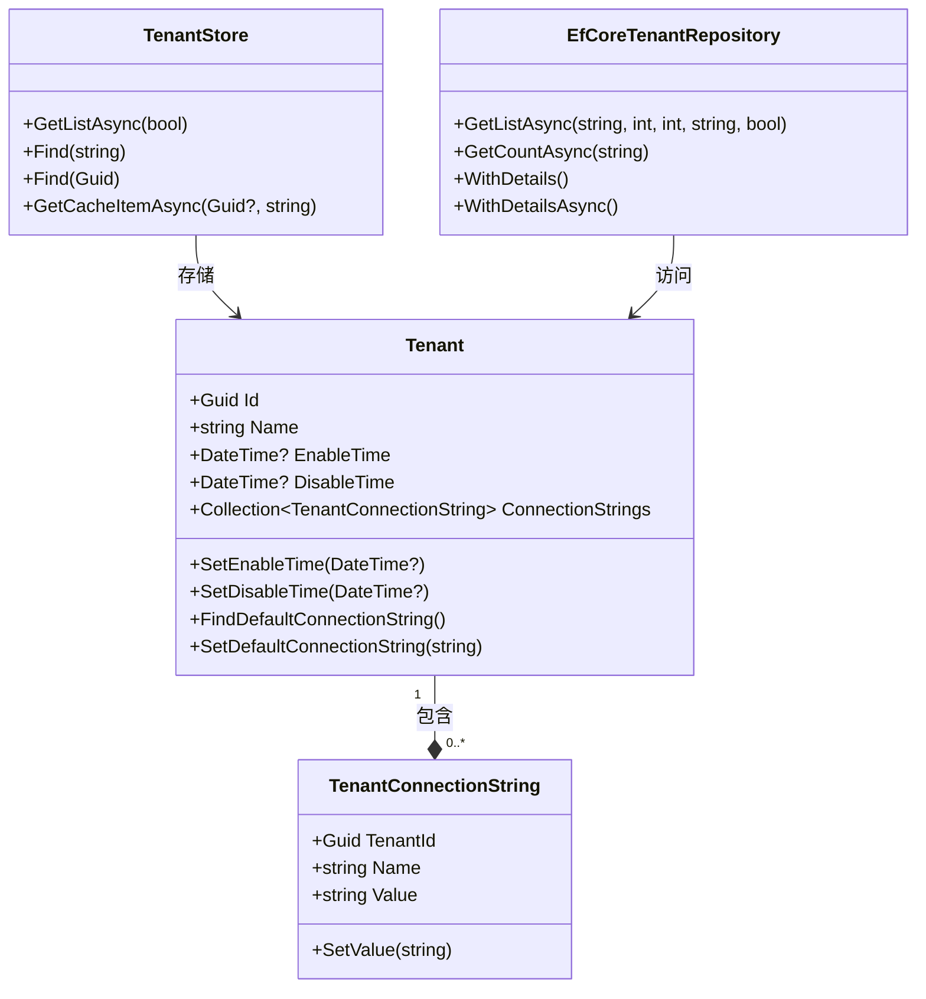
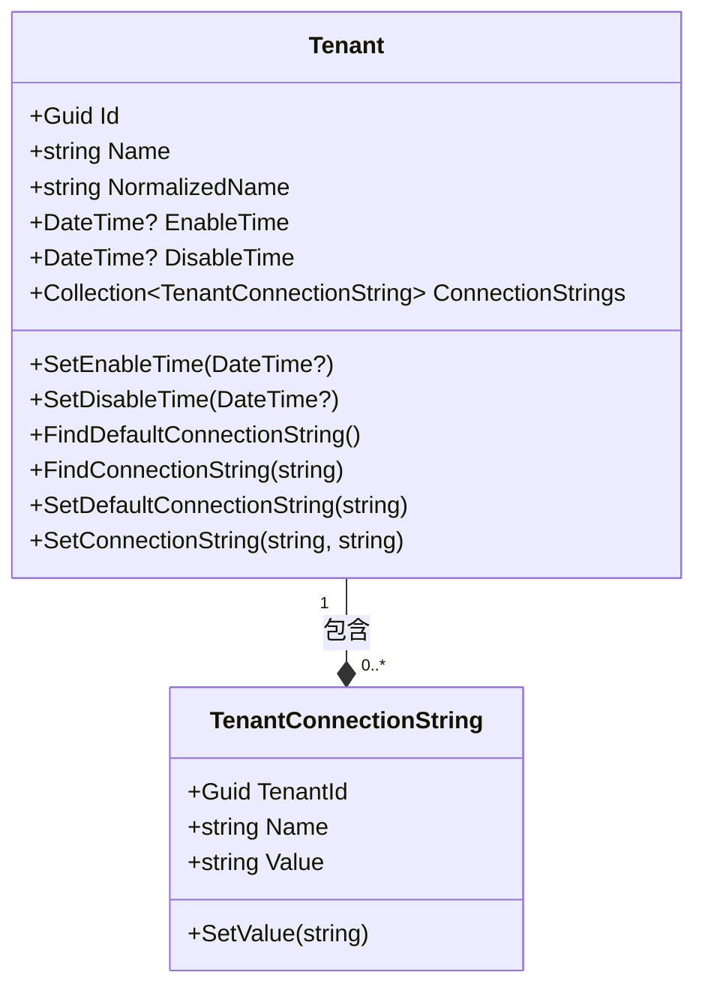
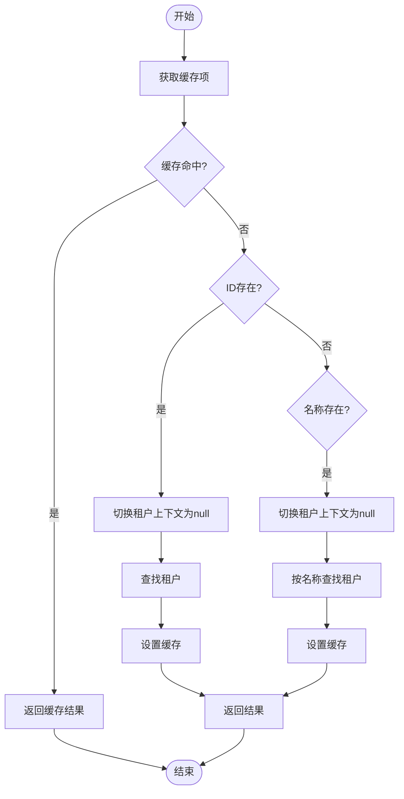
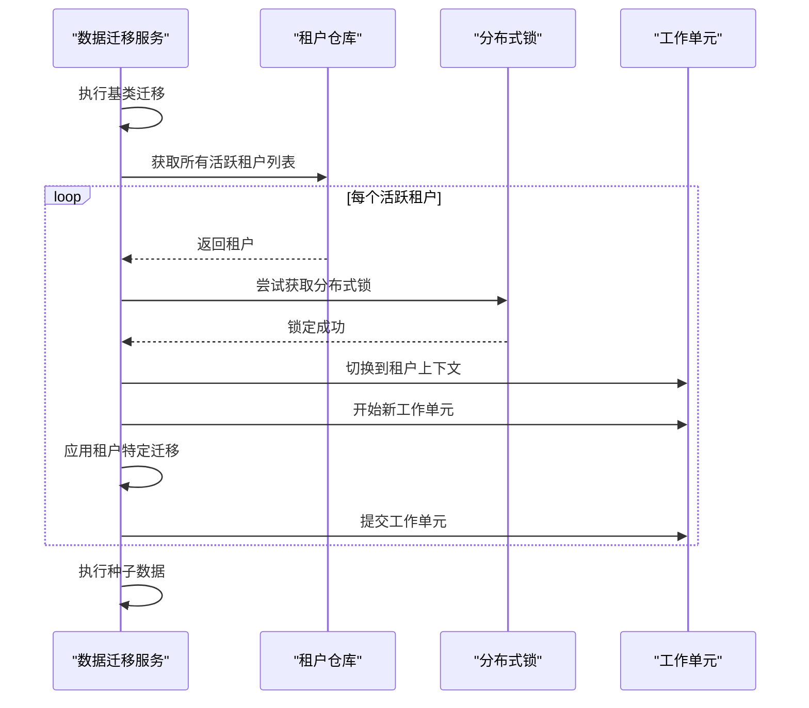
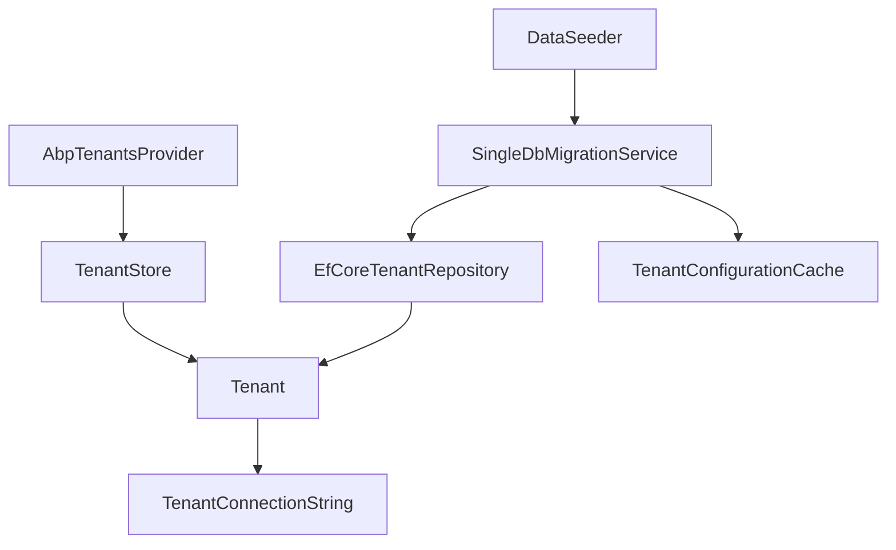

# 数据隔离机制

<cite>
**本文档引用的文件**
- [Tenant.cs](file://aspnet-core/modules/saas/LINGYUN.Abp.Saas.Domain/LINGYUN/Abp/Saas/Tenants/Tenant.cs)
- [EfCoreTenantRepository.cs](file://aspnet-core/modules/saas/LINGYUN.Abp.Saas.EntityFrameworkCore/LINGYUN/Abp/Saas/EntityFrameworkCore/EfCoreTenantRepository.cs)
- [TenantStore.cs](file://aspnet-core/modules/saas/LINGYUN.Abp.Saas.Domain/LINGYUN/Abp/Saas/Tenants/TenantStore.cs)
- [AbpSaasDomainMappingProfile.cs](file://aspnet-core/modules/saas/LINGYUN.Abp.Saas.Domain/LINGYUN/Abp/Saas/AbpSaasDomainMappingProfile.cs)
- [SingleDbMigrationService.cs](file://aspnet-core/migrations/LY.MicroService.Applications.Single.EntityFrameworkCore/SingleDbMigrationService.cs)
- [PlatformDbMigrationService.cs](file://aspnet-core/migrations/LY.MicroService.Platform.EntityFrameworkCore/PlatformDbMigrationService.cs)
- [TenantConnectionString.cs](file://aspnet-core/modules/saas/LINGYUN.Abp.Saas.Domain/LINGYUN/Abp/Saas/Tenants/TenantConnectionString.cs)
- [AbpTenantsProvider.cs](file://aspnet-core/modules/elsa/LINGYUN.Abp.ElsaNext/LINGYUN/Abp/ElsaNext/Multitenancy/AbpTenantsProvider.cs)
</cite>

## 目录
1. [引言](#引言)
2. [项目结构](#项目结构)
3. [核心组件](#核心组件)
4. [架构概述](#架构概述)
5. [详细组件分析](#详细组件分析)
6. [依赖分析](#依赖分析)
7. [性能考虑](#性能考虑)
8. [故障排除指南](#故障排除指南)
9. [结论](#结论)

## 引言
本文档深入探讨了多租户环境下的数据隔离机制实现。系统通过数据库层面的隔离策略和应用层面的过滤机制，确保不同租户的数据安全与独立。文档详细描述了租户上下文的传递方式、数据访问层的租户过滤实现，以及不同隔离级别（共享数据库、共享表、独立数据库）的配置和切换方法。

## 项目结构
项目采用模块化设计，核心的多租户功能主要分布在`aspnet-core/modules/saas`目录下。数据迁移服务位于`aspnet-core/migrations`目录，而事件总线的租户同步器则分布在各个微服务中。

**图表来源**
- [Tenant.cs](file://aspnet-core/modules/saas/LINGYUN.Abp.Saas.Domain/LINGYUN/Abp/Saas/Tenants/Tenant.cs)
- [SingleDbMigrationService.cs](file://aspnet-core/migrations/LY.MicroService.Applications.Single.EntityFrameworkCore/SingleDbMigrationService.cs)

**章节来源**
- [Tenant.cs](file://aspnet-core/modules/saas/LINGYUN.Abp.Saas.Domain/LINGYUN/Abp/Saas/Tenants/Tenant.cs)
- [SingleDbMigrationService.cs](file://aspnet-core/migrations/LY.MicroService.Applications.Single.EntityFrameworkCore/SingleDbMigrationService.cs)

## 核心组件
系统的核心组件包括租户实体(Tenant)、租户存储(TenantStore)、租户连接字符串管理以及数据迁移服务。这些组件协同工作，实现了完整的多租户数据隔离机制。

**章节来源**
- [Tenant.cs](file://aspnet-core/modules/saas/LINGYUN.Abp.Saas.Domain/LINGYUN/Abp/Saas/Tenants/Tenant.cs)
- [TenantStore.cs](file://aspnet-core/modules/saas/LINGYUN.Abp.Saas.Domain/LINGYUN/Abp/Saas/Tenants/TenantStore.cs)

## 架构概述
系统的多租户架构基于ABP框架实现，采用分层设计模式。在数据库层面，支持多种隔离策略；在应用层面，通过租户上下文和过滤器确保数据访问的安全性。

**图表来源**
- [Tenant.cs](file://aspnet-core/modules/saas/LINGYUN.Abp.Saas.Domain/LINGYUN/Abp/Saas/Tenants/Tenant.cs)
- [TenantConnectionString.cs](file://aspnet-core/modules/saas/LINGYUN.Abp.Saas.Domain/LINGYUN/Abp/Saas/Tenants/TenantConnectionString.cs)
- [TenantStore.cs](file://aspnet-core/modules/saas/LINGYUN.Abp.Saas.Domain/LINGYUN/Abp/Saas/Tenants/TenantStore.cs)
- [EfCoreTenantRepository.cs](file://aspnet-core/modules/saas/LINGYUN.Abp.Saas.EntityFrameworkCore/LINGYUN/Abp/Saas/EntityFrameworkCore/EfCoreTenantRepository.cs)

## 详细组件分析

### 租户实体分析
租户实体是多租户系统的核心，包含了租户的基本信息和状态管理。

#### 对象导向组件：

**图表来源**
- [Tenant.cs](file://aspnet-core/modules/saas/LINGYUN.Abp.Saas.Domain/LINGYUN/Abp/Saas/Tenants/Tenant.cs)
- [TenantConnectionString.cs](file://aspnet-core/modules/saas/LINGYUN.Abp.Saas.Domain/LINGYUN/Abp/Saas/Tenants/TenantConnectionString.cs)

**章节来源**
- [Tenant.cs](file://aspnet-core/modules/saas/LINGYUN.Abp.Saas.Domain/LINGYUN/Abp/Saas/Tenants/Tenant.cs)
- [TenantConnectionString.cs](file://aspnet-core/modules/saas/LINGYUN.Abp.Saas.Domain/LINGYUN/Abp/Saas/Tenants/TenantConnectionString.cs)

### 租户存储分析
租户存储组件负责租户配置的缓存和检索，通过缓存机制提高系统性能。

#### 复杂逻辑组件：

**图表来源**
- [TenantStore.cs](file://aspnet-core/modules/saas/LINGYUN.Abp.Saas.Domain/LINGYUN/Abp/Saas/Tenants/TenantStore.cs)

**章节来源**
- [TenantStore.cs](file://aspnet-core/modules/saas/LINGYUN.Abp.Saas.Domain/LINGYUN/Abp/Saas/Tenants/TenantStore.cs)

### 数据迁移服务分析
数据迁移服务负责在多租户环境下执行数据库迁移，确保每个活跃租户的数据库模式都得到正确更新。

#### API/服务组件：

**图表来源**
- [SingleDbMigrationService.cs](file://aspnet-core/migrations/LY.MicroService.Applications.Single.EntityFrameworkCore/SingleDbMigrationService.cs)
- [PlatformDbMigrationService.cs](file://aspnet-core/migrations/LY.MicroService.Platform.EntityFrameworkCore/PlatformDbMigrationService.cs)

**章节来源**
- [SingleDbMigrationService.cs](file://aspnet-core/migrations/LY.MicroService.Applications.Single.EntityFrameworkCore/SingleDbMigrationService.cs)
- [PlatformDbMigrationService.cs](file://aspnet-core/migrations/LY.MicroService.Platform.EntityFrameworkCore/PlatformDbMigrationService.cs)

## 依赖分析
系统各组件之间的依赖关系清晰，形成了一个完整的多租户数据隔离体系。

**图表来源**
- [Tenant.cs](file://aspnet-core/modules/saas/LINGYUN.Abp.Saas.Domain/LINGYUN/Abp/Saas/Tenants/Tenant.cs)
- [TenantConnectionString.cs](file://aspnet-core/modules/saas/LINGYUN.Abp.Saas.Domain/LINGYUN/Abp/Saas/Tenants/TenantConnectionString.cs)
- [TenantStore.cs](file://aspnet-core/modules/saas/LINGYUN.Abp.Saas.Domain/LINGYUN/Abp/Saas/Tenants/TenantStore.cs)
- [EfCoreTenantRepository.cs](file://aspnet-core/modules/saas/LINGYUN.Abp.Saas.EntityFrameworkCore/LINGYUN/Abp/Saas/EntityFrameworkCore/EfCoreTenantRepository.cs)
- [SingleDbMigrationService.cs](file://aspnet-core/migrations/LY.MicroService.Applications.Single.EntityFrameworkCore/SingleDbMigrationService.cs)

**章节来源**
- [Tenant.cs](file://aspnet-core/modules/saas/LINGYUN.Abp.Saas.Domain/LINGYUN/Abp/Saas/Tenants/Tenant.cs)
- [TenantConnectionString.cs](file://aspnet-core/modules/saas/LINGYUN.Abp.Saas.Domain/LINGYUN/Abp/Saas/Tenants/TenantConnectionString.cs)
- [TenantStore.cs](file://aspnet-core/modules/saas/LINGYUN.Abp.Saas.Domain/LINGYUN/Abp/Saas/Tenants/TenantStore.cs)
- [EfCoreTenantRepository.cs](file://aspnet-core/modules/saas/LINGYUN.Abp.Saas.EntityFrameworkCore/LINGYUN/Abp/Saas/EntityFrameworkCore/EfCoreTenantRepository.cs)
- [SingleDbMigrationService.cs](file://aspnet-core/migrations/LY.MicroService.Applications.Single.EntityFrameworkCore/SingleDbMigrationService.cs)

## 性能考虑
系统通过多种机制优化多租户环境下的性能表现。租户配置缓存减少了数据库查询次数，分布式锁确保了迁移操作的线程安全，而工作单元模式则保证了事务的一致性。在高并发场景下，建议合理配置缓存过期时间和分布式锁超时时间，以平衡系统性能和数据一致性。

## 故障排除指南
当遇到多租户数据隔离相关问题时，可按照以下步骤进行排查：

1. 检查租户是否已正确激活（IsActive）
2. 验证租户的启用/禁用时间是否在有效范围内
3. 确认租户连接字符串配置正确
4. 检查分布式锁服务是否正常运行
5. 验证缓存服务是否可用
6. 查看数据迁移日志，确认是否有错误发生

**章节来源**
- [Tenant.cs](file://aspnet-core/modules/saas/LINGYUN.Abp.Saas.Domain/LINGYUN/Abp/Saas/Tenants/Tenant.cs)
- [AbpSaasDomainMappingProfile.cs](file://aspnet-core/modules/saas/LINGYUN.Abp.Saas.Domain/LINGYUN/Abp/Saas/AbpSaasDomainMappingProfile.cs)
- [SingleDbMigrationService.cs](file://aspnet-core/migrations/LY.MicroService.Applications.Single.EntityFrameworkCore/SingleDbMigrationService.cs)

## 结论
本系统通过完善的多租户数据隔离机制，实现了租户间数据的安全隔离。从租户实体定义到存储管理，再到数据迁移和缓存优化，形成了一个完整的解决方案。系统支持灵活的隔离策略配置，能够满足不同业务场景的需求。通过合理的架构设计和性能优化，确保了在多租户环境下的稳定性和高效性。