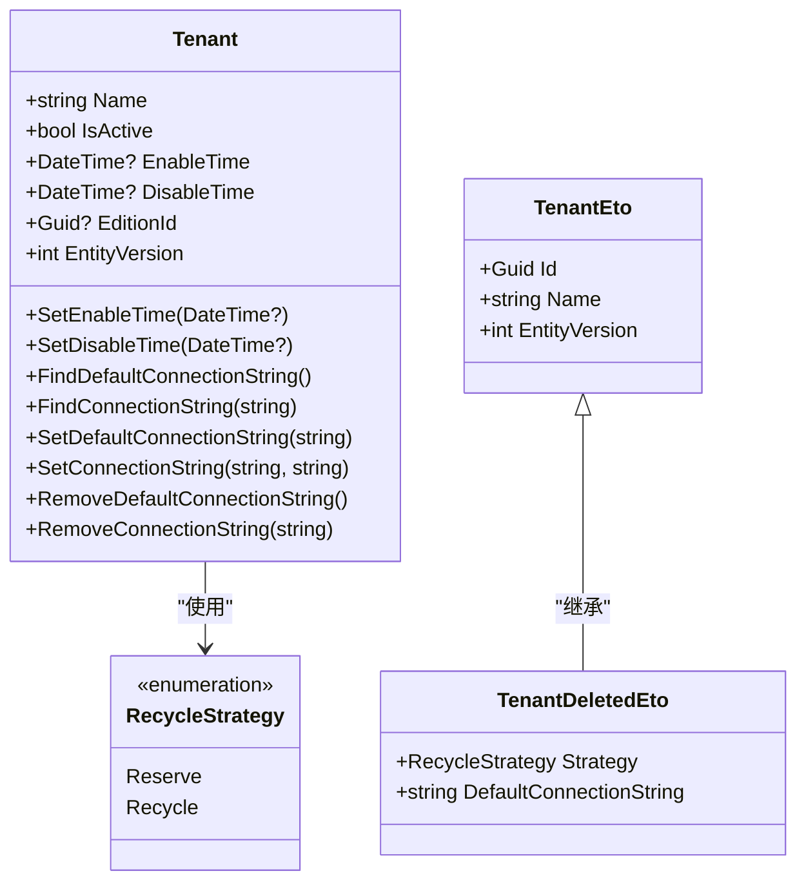
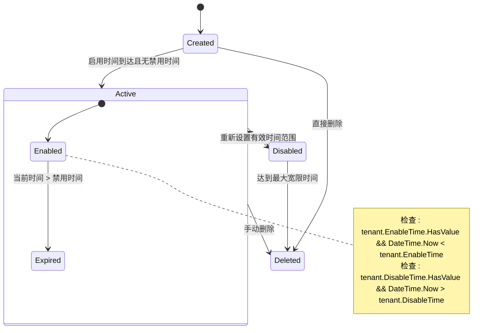
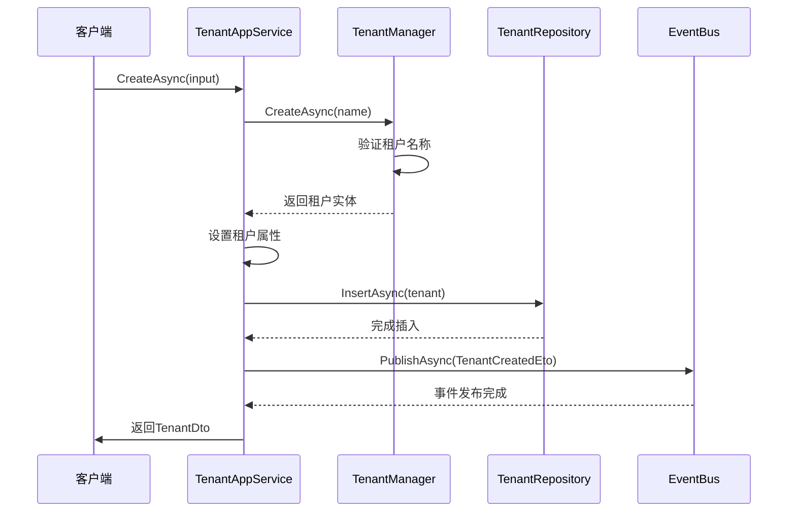
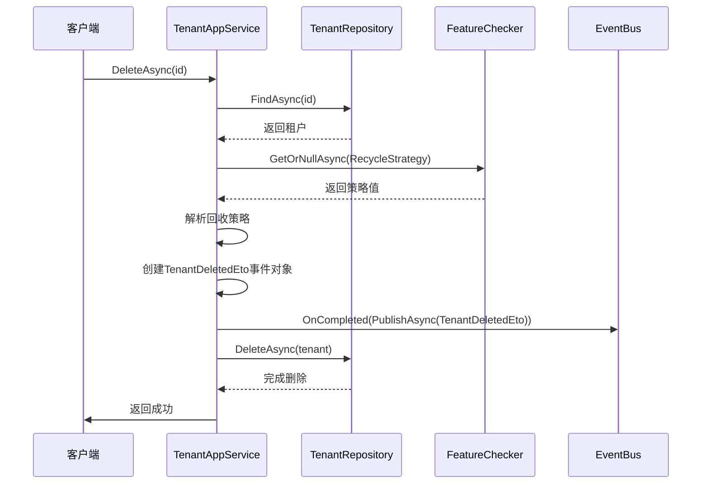
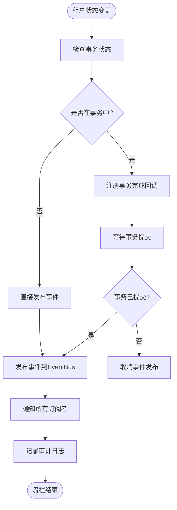

# 租户生命周期

<cite>
**本文档中引用的文件**  
- [Tenant.cs](file://aspnet-core/modules/saas/LINGYUN.Abp.Saas.Domain/LINGYUN/Abp/Saas/Tenants/Tenant.cs)
- [TenantAppService.cs](file://aspnet-core/modules/saas/LINGYUN.Abp.Saas.Application/LINGYUN/Abp/Saas/Tenants/TenantAppService.cs)
- [ITenantAppService.cs](file://aspnet-core/modules/saas/LINGYUN.Abp.Saas.Application.Contracts/LINGYUN/Abp/Saas/Tenants/ITenantAppService.cs)
- [TenantEto.cs](file://aspnet-core/modules/saas/LINGYUN.Abp.Saas.Domain.Shared/LINGYUN/Abp/Saas/Tenants/TenantEto.cs)
- [TenantDeletedEto.cs](file://aspnet-core/modules/saas/LINGYUN.Abp.Saas.Domain.Shared/LINGYUN/Abp/Saas/Tenants/TenantDeletedEto.cs)
- [RecycleStrategy.cs](file://aspnet-core/modules/saas/LINGYUN.Abp.Saas.Domain.Shared/LINGYUN/Abp/Saas/Tenants/RecycleStrategy.cs)
- [AbpSaasDomainMappingProfile.cs](file://aspnet-core/modules/saas/LINGYUN.Abp.Saas.Domain/LINGYUN/Abp/Saas/AbpSaasDomainMappingProfile.cs)
- [TenantManager.cs](file://aspnet-core/modules/saas/LINGYUN.Abp.Saas.Domain/LINGYUN/Abp/Saas/Tenants/TenantManager.cs)
</cite>

## 目录
1. [简介](#简介)
2. [租户状态模型](#租户状态模型)
3. [租户生命周期流程](#租户生命周期流程)
4. [API接口文档](#api接口文档)
5. [状态变更业务逻辑](#状态变更业务逻辑)
6. [审计日志与事件发布](#审计日志与事件发布)
7. [结论](#结论)

## 简介
本文档详细描述了ABP框架中租户从创建到删除的完整生命周期管理。涵盖了租户激活、停用和删除的业务流程，深入解释了状态转换的条件和约束，以及状态变更对系统其他组件的影响。

**Section sources**
- [Tenant.cs](file://aspnet-core/modules/saas/LINGYUN.Abp.Saas.Domain/LINGYUN/Abp/Saas/Tenants/Tenant.cs#L0-L117)

## 租户状态模型
租户状态由多个属性共同决定，包括激活状态、启用时间和禁用时间。这些属性共同构成了租户的生命周期状态。

**Diagram sources**
- [Tenant.cs](file://aspnet-core/modules/saas/LINGYUN.Abp.Saas.Domain/LINGYUN/Abp/Saas/Tenants/Tenant.cs#L0-L117)
- [RecycleStrategy.cs](file://aspnet-core/modules/saas/LINGYUN.Abp.Saas.Domain.Shared/LINGYUN/Abp/Saas/Tenants/RecycleStrategy.cs#L0-L14)
- [TenantEto.cs](file://aspnet-core/modules/saas/LINGYUN.Abp.Saas.Domain.Shared/LINGYUN/Abp/Saas/Tenants/TenantEto.cs#L0-L15)
- [TenantDeletedEto.cs](file://aspnet-core/modules/saas/LINGYUN.Abp.Saas.Domain.Shared/LINGYUN/Abp/Saas/Tenants/TenantDeletedEto.cs#L0-L11)

**Section sources**
- [Tenant.cs](file://aspnet-core/modules/saas/LINGYUN.Abp.Saas.Domain/LINGYUN/Abp/Saas/Tenants/Tenant.cs#L0-L117)
- [RecycleStrategy.cs](file://aspnet-core/modules/saas/LINGYUN.Abp.Saas.Domain.Shared/LINGYUN/Abp/Saas/Tenants/RecycleStrategy.cs#L0-L14)

## 租户生命周期流程
租户的生命周期包含创建、激活、停用和删除四个主要阶段。每个阶段都有特定的条件和约束。

**Diagram sources**
- [Tenant.cs](file://aspnet-core/modules/saas/LINGYUN.Abp.Saas.Domain/LINGYUN/Abp/Saas/Tenants/Tenant.cs#L0-L117)
- [AbpSaasDomainMappingProfile.cs](file://aspnet-core/modules/saas/LINGYUN.Abp.Saas.Domain/LINGYUN/Abp/Saas/AbpSaasDomainMappingProfile.cs#L41-L57)

**Section sources**
- [Tenant.cs](file://aspnet-core/modules/saas/LINGYUN.Abp.Saas.Domain/LINGYUN/Abp/Saas/Tenants/Tenant.cs#L0-L117)
- [AbpSaasDomainMappingProfile.cs](file://aspnet-core/modules/saas/LINGYUN.Abp.Saas.Domain/LINGYUN/Abp/Saas/AbpSaasDomainMappingProfile.cs#L41-L57)

## API接口文档
租户管理提供了完整的CRUD操作API，支持租户的创建、查询、更新和删除。

### 租户操作API
| 接口方法 | HTTP方法 | 路径 | 权限要求 | 描述 |
|---------|--------|------|---------|------|
| GetAsync(Guid) | GET | /api/saas/tenants/{id} | AbpSaasPermissions.Tenants.Default | 根据ID获取租户信息 |
| GetAsync(string) | GET | /api/saas/tenants/by-name/{name} | AbpSaasPermissions.Tenants.Default | 根据名称获取租户信息 |
| GetListAsync | GET | /api/saas/tenants | AbpSaasPermissions.Tenants.Default | 获取租户列表 |
| CreateAsync | POST | /api/saas/tenants | AbpSaasPermissions.Tenants.Create | 创建新租户 |
| UpdateAsync | PUT | /api/saas/tenants/{id} | AbpSaasPermissions.Tenants.Update | 更新租户信息 |
| DeleteAsync | DELETE | /api/saas/tenants/{id} | AbpSaasPermissions.Tenants.Delete | 删除租户 |

### 请求参数说明
#### 创建租户 (CreateAsync)
- **Name**: 租户名称 (必填)
- **IsActive**: 是否激活 (可选，默认true)
- **EditionId**: 版本ID (可选)
- **EnableTime**: 启用时间 (可选)
- **DisableTime**: 禁用时间 (可选)
- **UseSharedDatabase**: 是否使用共享数据库 (可选)
- **DefaultConnectionString**: 默认连接字符串 (当不使用共享数据库时必填)
- **ConnectionStrings**: 连接字符串集合 (可选)

#### 更新租户 (UpdateAsync)
- **IsActive**: 是否激活
- **EditionId**: 版本ID
- **EnableTime**: 启用时间
- **DisableTime**: 禁用时间
- **ConcurrencyStamp**: 并发标记 (用于乐观锁)

**Section sources**
- [ITenantAppService.cs](file://aspnet-core/modules/saas/LINGYUN.Abp.Saas.Application.Contracts/LINGYUN/Abp/Saas/Tenants/ITenantAppService.cs#L0-L35)
- [TenantAppService.cs](file://aspnet-core/modules/saas/LINGYUN.Abp.Saas.Application/LINGYUN/Abp/Saas/Tenants/TenantAppService.cs#L0-L306)

## 状态变更业务逻辑
租户状态变更涉及复杂的业务逻辑，包括权限验证、特征检查和事件发布。

### 创建租户流程

**Diagram sources**
- [TenantAppService.cs](file://aspnet-core/modules/saas/LINGYUN.Abp.Saas.Application/LINGYUN/Abp/Saas/Tenants/TenantAppService.cs#L0-L306)
- [TenantManager.cs](file://aspnet-core/modules/saas/LINGYUN.Abp.Saas.Domain/LINGYUN/Abp/Saas/Tenants/TenantManager.cs#L0-L51)

### 删除租户流程

**Diagram sources**
- [TenantAppService.cs](file://aspnet-core/modules/saas/LINGYUN.Abp.Saas.Application/LINGYUN/Abp/Saas/Tenants/TenantAppService.cs#L146-L184)
- [TenantDeletedEto.cs](file://aspnet-core/modules/saas/LINGYUN.Abp.Saas.Domain.Shared/LINGYUN/Abp/Saas/Tenants/TenantDeletedEto.cs#L0-L11)

**Section sources**
- [TenantAppService.cs](file://aspnet-core/modules/saas/LINGYUN.Abp.Saas.Application/LINGYUN/Abp/Saas/Tenants/TenantAppService.cs#L0-L306)
- [TenantManager.cs](file://aspnet-core/modules/saas/LINGYUN.Abp.Saas.Domain/LINGYUN/Abp/Saas/Tenants/TenantManager.cs#L0-L51)

## 审计日志与事件发布
系统通过事件总线机制实现了租户状态变更的审计日志记录和事件发布功能。

### 事件发布机制
当租户状态发生变更时，系统会发布相应的领域事件：

1. **租户创建事件**: `TenantCreatedEto`
   - 包含租户ID、名称、管理员用户信息等
   - 在事务提交后异步发布

2. **租户删除事件**: `TenantDeletedEto`
   - 包含租户ID、名称、回收策略、默认连接字符串等
   - 在事务提交后异步发布
   - 支持配置不同的回收策略（保留或回收）

### 事件处理流程

**Diagram sources**
- [TenantAppService.cs](file://aspnet-core/modules/saas/LINGYUN.Abp.Saas.Application/LINGYUN/Abp/Saas/Tenants/TenantAppService.cs#L109-L147)
- [TenantAppService.cs](file://aspnet-core/modules/saas/LINGYUN.Abp.Saas.Application/LINGYUN/Abp/Saas/Tenants/TenantAppService.cs#L146-L184)
- [TenantDeletedEto.cs](file://aspnet-core/modules/saas/LINGYUN.Abp.Saas.Domain.Shared/LINGYUN/Abp/Saas/Tenants/TenantDeletedEto.cs#L0-L11)

**Section sources**
- [TenantAppService.cs](file://aspnet-core/modules/saas/LINGYUN.Abp.Saas.Application/LINGYUN/Abp/Saas/Tenants/TenantAppService.cs#L0-L306)
- [TenantDeletedEto.cs](file://aspnet-core/modules/saas/LINGYUN.Abp.Saas.Domain.Shared/LINGYUN/Abp/Saas/Tenants/TenantDeletedEto.cs#L0-L11)

## 结论
本文档详细阐述了ABP框架中租户生命周期管理的完整实现。系统通过清晰的状态模型、完善的API接口、严谨的业务逻辑和可靠的事件发布机制，确保了租户管理的安全性和可靠性。租户状态变更不仅影响租户自身的可用性，还会触发相应的领域事件，通知系统中的其他组件进行相应的处理。