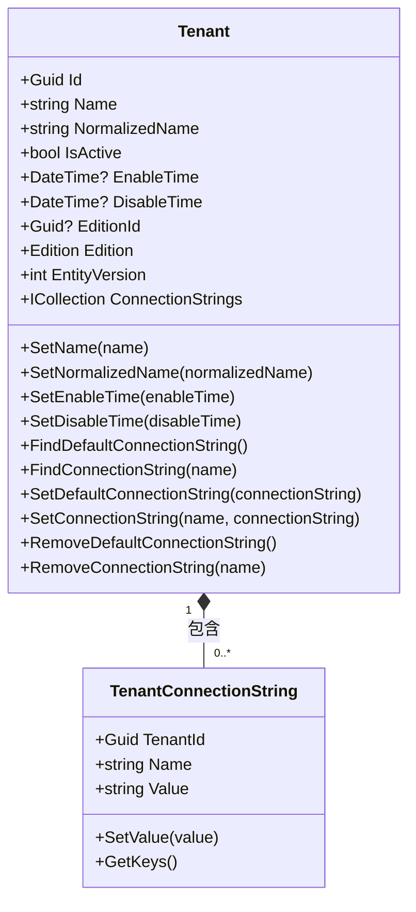
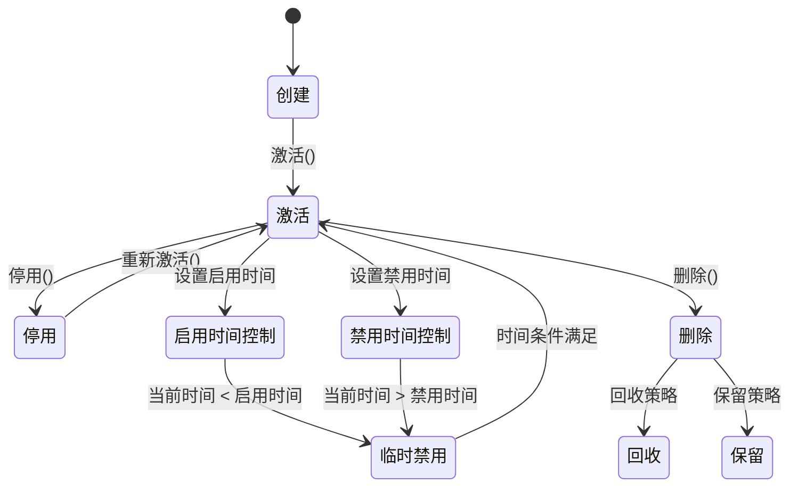
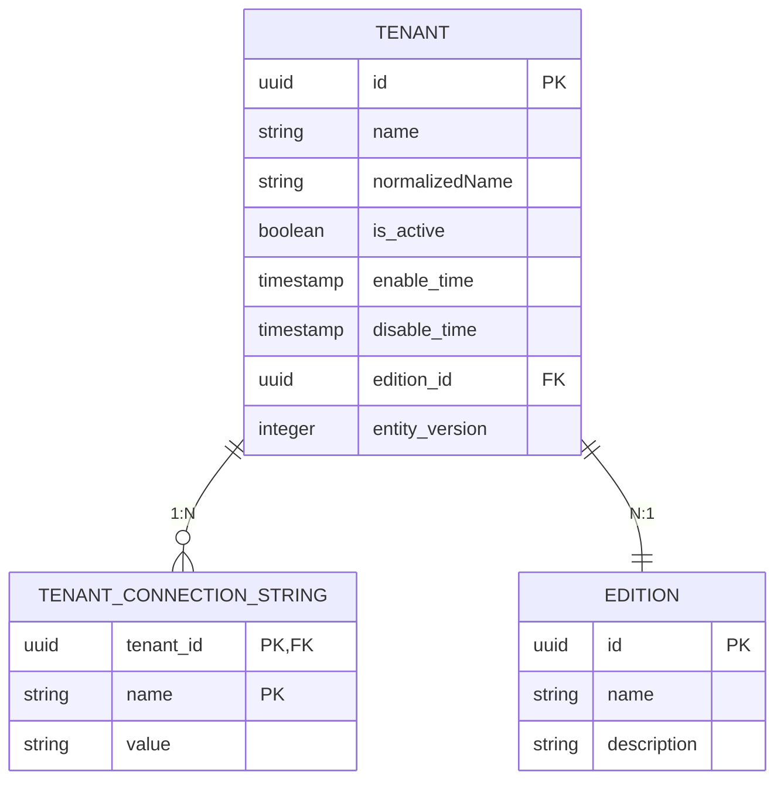
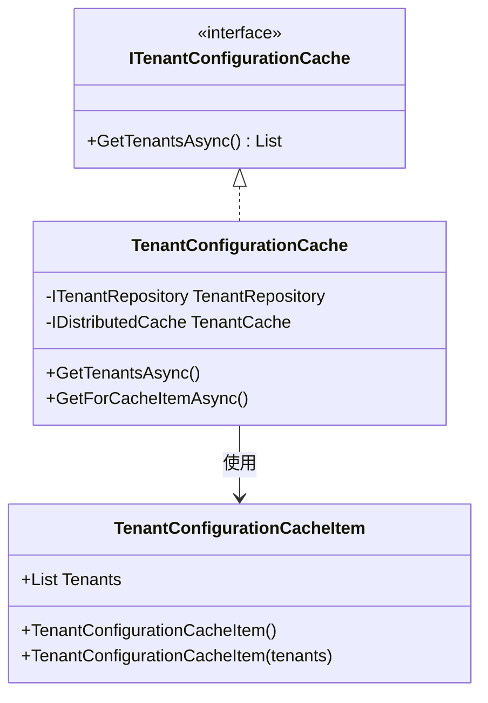
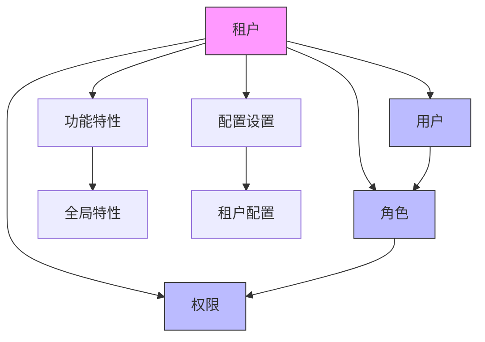
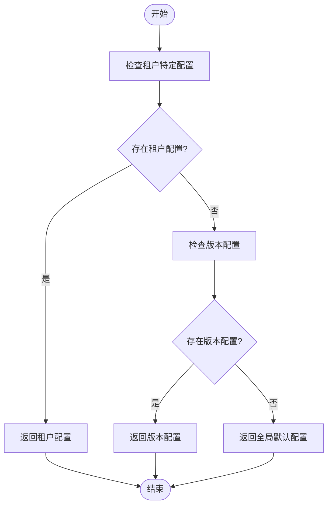
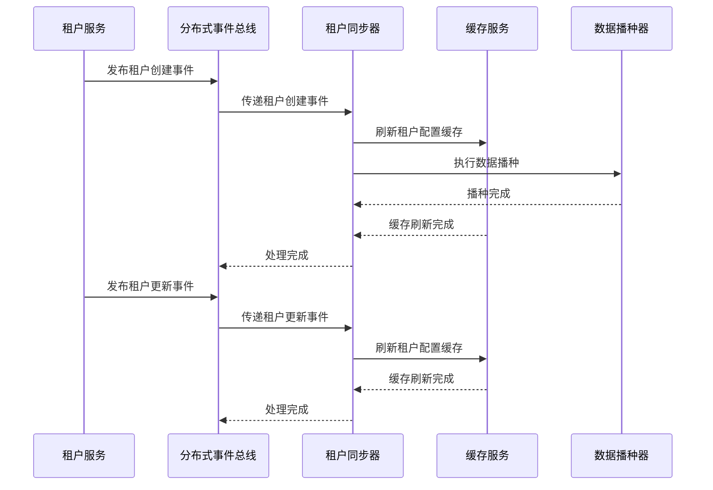
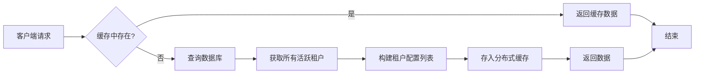

# 租户管理

<cite>
**本文档引用的文件**
- [Tenant.cs](file://aspnet-core/modules/saas/LINGYUN.Abp.Saas.Domain/LINGYUN/Abp/Saas/Tenants/Tenant.cs)
- [TenantConnectionString.cs](file://aspnet-core/modules/saas/LINGYUN.Abp.Saas.Domain/LINGYUN/Abp/Saas/Tenants/TenantConnectionString.cs)
- [AbpSaasDomainModule.cs](file://aspnet-core/modules/saas/LINGYUN.Abp.Saas.Domain/LINGYUN/Abp/Saas/AbpSaasDomainModule.cs)
- [TenantConfigurationCache.cs](file://aspnet-core/services/LY.MicroService.PlatformManagement.HttpApi.Host/MultiTenancy/TenantConfigurationCache.cs)
- [TenantConfigurationCacheItem.cs](file://aspnet-core/services/LY.MicroService.PlatformManagement.HttpApi.Host/MultiTenancy/TenantConfigurationCacheItem.cs)
- [ITenantConfigurationCache.cs](file://aspnet-core/services/LY.MicroService.PlatformManagement.HttpApi.Host/MultiTenancy/ITenantConfigurationCache.cs)
- [ITenantRepository.cs](file://aspnet-core/modules/saas/LINGYUN.Abp.Saas.Domain/LINGYUN/Abp/Saas/Tenants/ITenantRepository.cs)
- [EfCoreTenantRepository.cs](file://aspnet-core/modules/saas/LINGYUN.Abp.Saas.EntityFrameworkCore/LINGYUN/Abp/Saas/EntityFrameworkCore/EfCoreTenantRepository.cs)
- [TenantSynchronizer.cs](file://aspnet-core/services/LY.MicroService.Applications.Single/EventBus/Distributed/TenantSynchronizer.cs)
- [TenantEto.cs](file://aspnet-core/modules/saas/LINGYUN.Abp.Saas.Domain.Shared/LINGYUN/Abp/Saas/Tenants/TenantEto.cs)
- [TenantDeletedEto.cs](file://aspnet-core/modules/saas/LINGYUN.Abp.Saas.Domain.Shared/LINGYUN/Abp/Saas/Tenants/TenantDeletedEto.cs)
- [RecycleStrategy.cs](file://aspnet-core/modules/saas/LINGYUN.Abp.Saas.Domain.Shared/LINGYUN/Abp/Saas/Tenants/RecycleStrategy.cs)
</cite>

## 目录
1. [简介](#简介)
2. [核心实体与数据结构](#核心实体与数据结构)
3. [租户生命周期管理](#租户生命周期管理)
4. [多租户数据隔离机制](#多租户数据隔离机制)
5. [租户上下文传递](#租户上下文传递)
6. [租户与用户、角色、权限的关联](#租户与用户角色权限的关联)
7. [API接口文档](#api接口文档)
8. [租户配置继承与覆盖](#租户配置继承与覆盖)
9. [事件处理与数据同步](#事件处理与数据同步)
10. [缓存机制](#缓存机制)

## 简介
本系统实现了完整的多租户管理功能，支持租户的创建、配置、状态管理和生命周期控制。系统采用基于租户ID的数据隔离机制，确保不同租户间的数据安全。租户管理功能与用户、角色、权限系统深度集成，为每个租户提供独立的资源管理环境。通过分布式事件机制，租户变更能够及时同步到所有相关服务，保证系统一致性。

## 核心实体与数据结构

### 租户实体(Tenant)
租户实体是多租户系统的核心，包含租户的基本信息和状态控制。

**图示来源**
- [Tenant.cs](file://aspnet-core/modules/saas/LINGYUN.Abp.Saas.Domain/LINGYUN/Abp/Saas/Tenants/Tenant.cs)
- [TenantConnectionString.cs](file://aspnet-core/modules/saas/LINGYUN.Abp.Saas.Domain/LINGYUN/Abp/Saas/Tenants/TenantConnectionString.cs)

**本节来源**
- [Tenant.cs](file://aspnet-core/modules/saas/LINGYUN.Abp.Saas.Domain/LINGYUN/Abp/Saas/Tenants/Tenant.cs)
- [TenantConnectionString.cs](file://aspnet-core/modules/saas/LINGYUN.Abp.Saas.Domain/LINGYUN/Abp/Saas/Tenants/TenantConnectionString.cs)

## 租户生命周期管理

### 租户状态控制
租户实体提供了完整的生命周管理功能，包括激活、停用、启用时间和禁用时间的设置。

**图示来源**
- [Tenant.cs](file://aspnet-core/modules/saas/LINGYUN.Abp.Saas.Domain/LINGYUN/Abp/Saas/Tenants/Tenant.cs)
- [TenantDeletedEto.cs](file://aspnet-core/modules/saas/LINGYUN.Abp.Saas.Domain.Shared/LINGYUN/Abp/Saas/Tenants/TenantDeletedEto.cs)
- [RecycleStrategy.cs](file://aspnet-core/modules/saas/LINGYUN.Abp.Saas.Domain.Shared/LINGYUN/Abp/Saas/Tenants/RecycleStrategy.cs)

**本节来源**
- [Tenant.cs](file://aspnet-core/modules/saas/LINGYUN.Abp.Saas.Domain/LINGYUN/Abp/Saas/Tenants/Tenant.cs)
- [TenantDeletedEto.cs](file://aspnet-core/modules/saas/LINGYUN.Abp.Saas.Domain.Shared/LINGYUN/Abp/Saas/Tenants/TenantDeletedEto.cs)

## 多租户数据隔离机制

### 数据库连接管理
系统通过租户连接字符串实现多数据库支持，每个租户可以配置独立的数据库连接。

**图示来源**
- [Tenant.cs](file://aspnet-core/modules/saas/LINGYUN.Abp.Saas.Domain/LINGYUN/Abp/Saas/Tenants/Tenant.cs)
- [TenantConnectionString.cs](file://aspnet-core/modules/saas/LINGYUN.Abp.Saas.Domain/LINGYUN/Abp/Saas/Tenants/TenantConnectionString.cs)

**本节来源**
- [TenantConnectionString.cs](file://aspnet-core/modules/saas/LINGYUN.Abp.Saas.Domain/LINGYUN/Abp/Saas/Tenants/TenantConnectionString.cs)
- [EfCoreTenantRepository.cs](file://aspnet-core/modules/saas/LINGYUN.Abp.Saas.EntityFrameworkCore/LINGYUN/Abp/Saas/EntityFrameworkCore/EfCoreTenantRepository.cs)

## 租户上下文传递

### 租户配置缓存
系统使用分布式缓存存储租户配置，确保租户上下文在微服务间高效传递。

**图示来源**
- [ITenantConfigurationCache.cs](file://aspnet-core/services/LY.MicroService.PlatformManagement.HttpApi.Host/MultiTenancy/ITenantConfigurationCache.cs)
- [TenantConfigurationCache.cs](file://aspnet-core/services/LY.MicroService.PlatformManagement.HttpApi.Host/MultiTenancy/TenantConfigurationCache.cs)
- [TenantConfigurationCacheItem.cs](file://aspnet-core/services/LY.MicroService.PlatformManagement.HttpApi.Host/MultiTenancy/TenantConfigurationCacheItem.cs)

**本节来源**
- [ITenantConfigurationCache.cs](file://aspnet-core/services/LY.MicroService.PlatformManagement.HttpApi.Host/MultiTenancy/ITenantConfigurationCache.cs)
- [TenantConfigurationCache.cs](file://aspnet-core/services/LY.MicroService.PlatformManagement.HttpApi.Host/MultiTenancy/TenantConfigurationCache.cs)

## 租户与用户角色权限的关联

### 租户与权限系统集成
租户管理与用户、角色、权限系统深度集成，为每个租户提供独立的安全上下文。

**本节来源**
- [Tenant.cs](file://aspnet-core/modules/saas/LINGYUN.Abp.Saas.Domain/LINGYUN/Abp/Saas/Tenants/Tenant.cs)
- [AbpSaasDomainModule.cs](file://aspnet-core/modules/saas/LINGYUN.Abp.Saas.Domain/LINGYUN/Abp/Saas/AbpSaasDomainModule.cs)

## API接口文档

### 租户管理API
系统提供标准的RESTful API接口用于租户管理操作。

| 接口 | HTTP方法 | 请求路径 | 请求参数 | 响应格式 |
|------|---------|---------|---------|---------|
| 获取租户列表 | GET | /api/saas/tenants | sorting, maxResultCount, skipCount, filter | PagedResultDto<TenantDto> |
| 创建租户 | POST | /api/saas/tenants | name, editionId | TenantDto |
| 获取租户详情 | GET | /api/saas/tenants/{id} | id | TenantDto |
| 更新租户 | PUT | /api/saas/tenants/{id} | id, name, editionId, isActive | TenantDto |
| 删除租户 | DELETE | /api/saas/tenants/{id} | id, recycleStrategy | void |
| 设置连接字符串 | PUT | /api/saas/tenants/{id}/connection-string | id, name, connectionString | void |
| 获取连接字符串 | GET | /api/saas/tenants/{id}/connection-string | id, name | string |

**本节来源**
- [TenantEto.cs](file://aspnet-core/modules/saas/LINGYUN.Abp.Saas.Domain.Shared/LINGYUN/Abp/Saas/Tenants/TenantEto.cs)
- [TenantDeletedEto.cs](file://aspnet-core/modules/saas/LINGYUN.Abp.Saas.Domain.Shared/LINGYUN/Abp/Saas/Tenants/TenantDeletedEto.cs)

## 租户配置继承与覆盖

### 配置继承机制
租户配置支持继承和覆盖策略，允许租户继承全局配置并进行个性化覆盖。

**本节来源**
- [Tenant.cs](file://aspnet-core/modules/saas/LINGYUN.Abp.Saas.Domain/LINGYUN/Abp/Saas/Tenants/Tenant.cs)
- [AbpSaasDomainModule.cs](file://aspnet-core/modules/saas/LINGYUN.Abp.Saas.Domain/LINGYUN/Abp/Saas/AbpSaasDomainModule.cs)

## 事件处理与数据同步

### 租户事件同步机制
系统使用分布式事件总线确保租户变更在所有服务间同步。

**图示来源**
- [TenantSynchronizer.cs](file://aspnet-core/services/LY.MicroService.Applications.Single/EventBus/Distributed/TenantSynchronizer.cs)
- [TenantEto.cs](file://aspnet-core/modules/saas/LINGYUN.Abp.Saas.Domain.Shared/LINGYUN/Abp/Saas/Tenants/TenantEto.cs)

**本节来源**
- [TenantSynchronizer.cs](file://aspnet-core/services/LY.MicroService.Applications.Single/EventBus/Distributed/TenantSynchronizer.cs)
- [AbpSaasDomainModule.cs](file://aspnet-core/modules/saas/LINGYUN.Abp.Saas.Domain/LINGYUN/Abp/Saas/AbpSaasDomainModule.cs)

## 缓存机制

### 租户配置缓存流程
系统采用两级缓存策略，确保租户配置的高性能访问。

**本节来源**
- [TenantConfigurationCache.cs](file://aspnet-core/services/LY.MicroService.PlatformManagement.HttpApi.Host/MultiTenancy/TenantConfigurationCache.cs)
- [TenantConfigurationCacheItem.cs](file://aspnet-core/services/LY.MicroService.PlatformManagement.HttpApi.Host/MultiTenancy/TenantConfigurationCacheItem.cs)