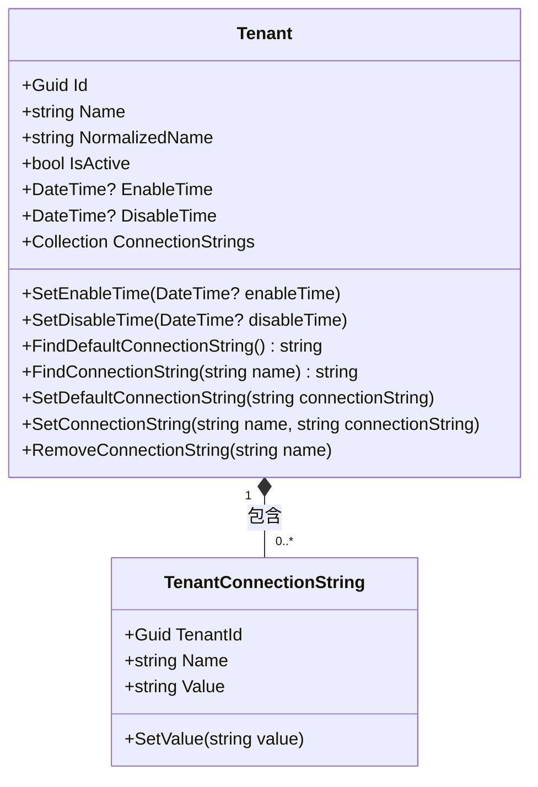
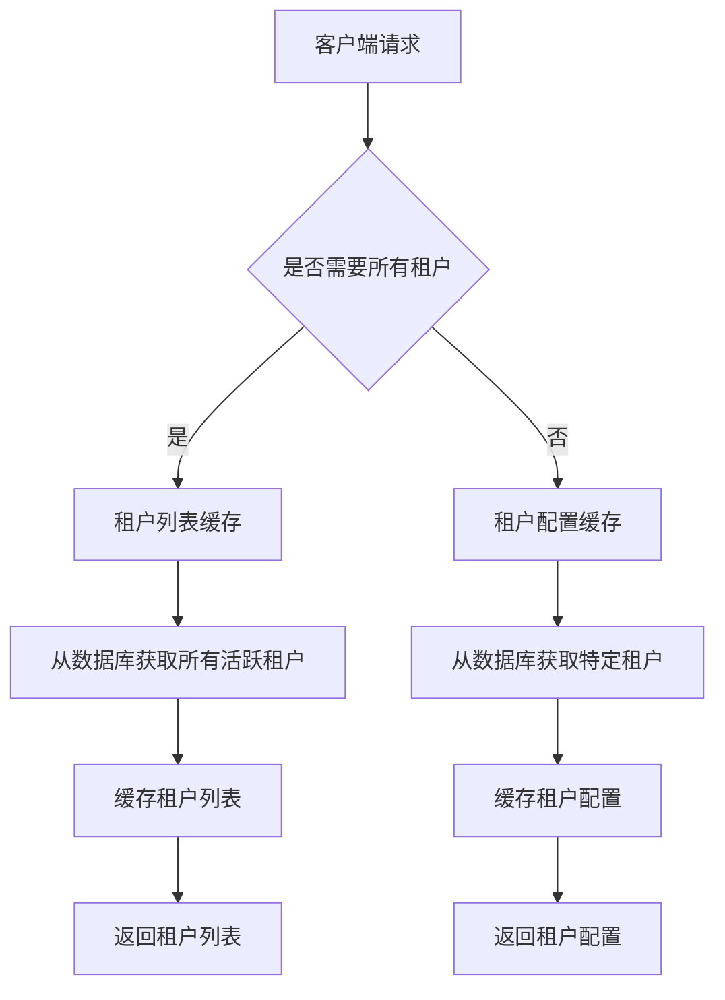
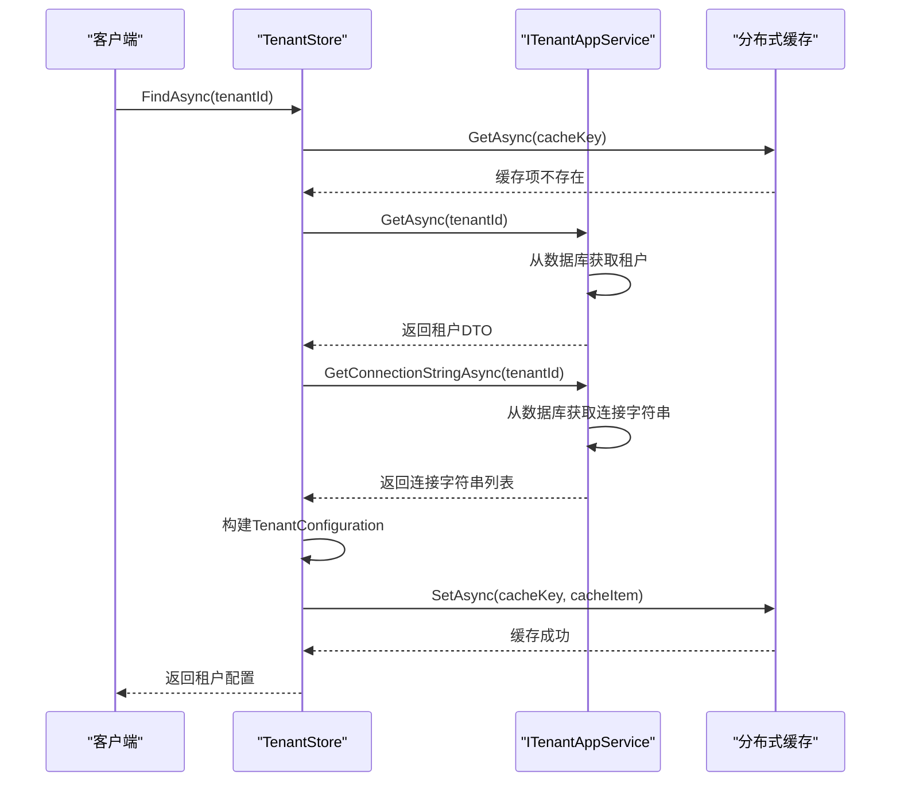

# 租户配置

<cite>
**本文档引用的文件**  
- [TenantConfigurationCache.cs](file://aspnet-core/services/LY.MicroService.PlatformManagement.HttpApi.Host/MultiTenancy/TenantConfigurationCache.cs)
- [TenantConfigurationCacheItem.cs](file://aspnet-core/services/LY.MicroService.PlatformManagement.HttpApi.Host/MultiTenancy/TenantConfigurationCacheItem.cs)
- [ITenantConfigurationCache.cs](file://aspnet-core/services/LY.MicroService.PlatformManagement.HttpApi.Host/MultiTenancy/ITenantConfigurationCache.cs)
- [TenantStore.cs](file://aspnet-core/modules/saas/LINGYUN.Abp.MultiTenancy.Saas/LINGYUN/Abp/MultiTenancy/Saas/TenantStore.cs)
- [Tenant.cs](file://aspnet-core/modules/saas/LINGYUN.Abp.Saas.Domain/LINGYUN/Abp/Saas/Tenants/Tenant.cs)
- [TenantConnectionString.cs](file://aspnet-core/modules/saas/LINGYUN.Abp.Saas.Domain/LINGYUN/Abp/Saas/Tenants/TenantConnectionString.cs)
- [ITenantAppService.cs](file://aspnet-core/modules/saas/LINGYUN.Abp.Saas.Application.Contracts/LINGYUN/Abp/Saas/Tenants/ITenantAppService.cs)
- [TenantAppService.cs](file://aspnet-core/modules/saas/LINGYUN.Abp.Saas.Application/LINGYUN/Abp/Saas/Tenants/TenantAppService.cs)
- [TenantController.cs](file://aspnet-core/modules/saas/LINGYUN.Abp.Saas.HttpApi/LINGYUN/Abp/Saas/Tenants/TenantController.cs)
- [TenantSynchronizer.cs](file://aspnet-core/services/LY.MicroService.Applications.Single/EventBus/Distributed/TenantSynchronizer.cs)
- [ISettingAppService.cs](file://aspnet-core/framework/settings/LINGYUN.Abp.SettingManagement.Application.Contracts/LINGYUN/Abp/SettingManagement/ISettingAppService.cs)
- [IReadonlySettingAppService.cs](file://aspnet-core/framework/settings/LINGYUN.Abp.SettingManagement.Application.Contracts/LINGYUN/Abp/SettingManagement/IReadonlySettingAppService.cs)
- [SettingGroupResult.cs](file://aspnet-core/framework/settings/LINGYUN.Abp.SettingManagement.Application.Contracts/LINGYUN/Abp/SettingManagement/Dto/SettingGroupResult.cs)
- [SettingGroupDto.cs](file://aspnet-core/framework/settings/LINGYUN.Abp.SettingManagement.Application.Contracts/LINGYUN/Abp/SettingManagement/Dto/SettingGroupDto.cs)
</cite>

## 目录
1. [简介](#简介)
2. [配置项定义与存储](#配置项定义与存储)
3. [租户配置层级结构与继承机制](#租户配置层级结构与继承机制)
4. [配置覆盖策略](#配置覆盖策略)
5. [API接口文档](#api接口文档)
6. [配置变更事件通知机制](#配置变更事件通知机制)
7. [缓存策略](#缓存策略)
8. [业务逻辑中的配置应用](#业务逻辑中的配置应用)
9. [结论](#结论)

## 简介
本文档详细阐述了ABP框架中租户配置功能的实现机制。系统通过多租户架构支持不同租户的独立配置管理，包括租户基本信息、连接字符串和系统设置等。配置系统采用分层结构，支持全局、租户和用户级别的配置继承与覆盖。文档深入分析了配置的定义、存储、继承机制和API接口，以及配置变更的事件通知和缓存策略。

## 配置项定义与存储
租户配置系统定义了多种配置项，包括租户基本信息、连接字符串和系统设置等。这些配置项通过领域模型进行定义和存储。

### 租户基本信息
租户基本信息在`Tenant`实体中定义，包含租户ID、名称、规范化名称、激活状态以及启用/禁用时间等属性。租户实体还维护了与连接字符串的聚合关系。



**图表来源**
- [Tenant.cs](file://aspnet-core/modules/saas/LINGYUN.Abp.Saas.Domain/LINGYUN/Abp/Saas/Tenants/Tenant.cs)
- [TenantConnectionString.cs](file://aspnet-core/modules/saas/LINGYUN.Abp.Saas.Domain/LINGYUN/Abp/Saas/Tenants/TenantConnectionString.cs)

### 连接字符串管理
连接字符串通过`TenantConnectionString`实体进行管理，每个连接字符串包含名称和值两个主要属性。租户实体提供了便捷的方法来查找、设置和删除连接字符串。系统支持多个命名的连接字符串，允许租户为不同的数据库或服务配置不同的连接信息。

**配置项定义**
- **连接字符串名称**: 最大长度64个字符，用于标识连接字符串
- **连接字符串值**: 最大长度1024个字符，存储实际的连接信息
- **默认连接字符串**: 特殊命名的连接字符串，用于系统默认数据库连接

**配置项来源**
- [TenantConnectionStringConsts.cs](file://aspnet-core/modules/saas/LINGYUN.Abp.Saas.Domain.Shared/LINGYUN/Abp/Saas/Tenants/TenantConnectionStringConsts.cs)

## 租户配置层级结构与继承机制
租户配置系统采用分层的层级结构，支持配置的继承和覆盖。系统通过缓存机制优化配置的读取性能。

### 配置层级结构
系统实现了两级配置缓存结构：租户配置缓存和租户列表缓存。租户配置缓存存储单个租户的详细配置，而租户列表缓存存储所有活跃租户的概要信息。



**图表来源**
- [TenantConfigurationCache.cs](file://aspnet-core/services/LY.MicroService.PlatformManagement.HttpApi.Host/MultiTenancy/TenantConfigurationCache.cs)
- [TenantStore.cs](file://aspnet-core/modules/saas/LINGYUN.Abp.MultiTenancy.Saas/LINGYUN/Abp/MultiTenancy/Saas/TenantStore.cs)

### 配置继承机制
配置继承机制通过`TenantStore`实现，该服务负责从应用服务获取租户配置并将其缓存。当请求租户配置时，系统首先检查缓存，如果缓存中不存在，则从数据库获取并填充缓存。



**图表来源**
- [TenantStore.cs](file://aspnet-core/modules/saas/LINGYUN.Abp.MultiTenancy.Saas/LINGYUN/Abp/MultiTenancy/Saas/TenantStore.cs)
- [ITenantAppService.cs](file://aspnet-core/modules/saas/LINGYUN.Abp.Saas.Application.Contracts/LINGYUN/Abp/Saas/Tenants/ITenantAppService.cs)

**本节来源**
- [TenantStore.cs](file://aspnet-core/modules/saas/LINGYUN.Abp.MultiTenancy.Saas/LINGYUN/Abp/MultiTenancy/Saas/TenantStore.cs)
- [TenantConfigurationCache.cs](file://aspnet-core/services/LY.MicroService.PlatformManagement.HttpApi.Host/MultiTenancy/TenantConfigurationCache.cs)

## 配置覆盖策略
系统实现了灵活的配置覆盖策略，允许在不同层级上对配置进行覆盖和继承。

### 全局与租户配置覆盖
系统支持全局配置和租户特定配置的覆盖机制。当获取配置时，系统会优先返回租户特定的配置，如果租户没有特定配置，则返回全局配置。

```mermaid
flowchart TD
    Start([获取配置])