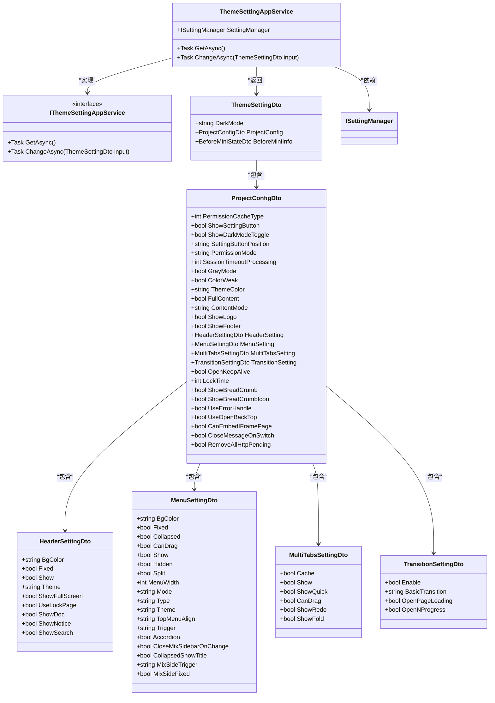

# 主题配置

<cite>
**本文档引用的文件**  
- [ThemeSettingAppService.cs](file://aspnet-core/modules/platform/LINGYUN.Platform.Theme.VueVbenAdmin/LINGYUN/Platform/Theme/VueVbenAdmin/ThemeSettingAppService.cs)
- [VueVbenAdminSettingNames.cs](file://aspnet-core/modules/platform/LINGYUN.Platform.Settings.VueVbenAdmin/LINGYUN/Platform/Settings/VueVbenAdmin/VueVbenAdminSettingNames.cs)
- [VueVbenAdminSettingDefinitionProvider.cs](file://aspnet-core/modules/platform/LINGYUN.Platform.Settings.VueVbenAdmin/LINGYUN/Platform/Settings/VueVbenAdmin/VueVbenAdminSettingDefinitionProvider.cs)
- [ThemeSettingDto.cs](file://aspnet-core/modules/platform/LINGYUN.Platform.Theme.VueVbenAdmin/LINGYUN/Platform/Theme/VueVbenAdmin/ThemeSettingDto.cs)
- [ProjectConfigDto.cs](file://aspnet-core/modules/platform/LINGYUN.Platform.Theme.VueVbenAdmin/LINGYUN/Platform/Theme/VueVbenAdmin/ProjectConfigDto.cs)
- [HeaderSettingDto.cs](file://aspnet-core/modules/platform/LINGYUN.Platform.Theme.VueVbenAdmin/LINGYUN/Platform/Theme/VueVbenAdmin/HeaderSettingDto.cs)
- [MenuSettingDto.cs](file://aspnet-core/modules/platform/LINGYUN.Platform.Theme.VueVbenAdmin/LINGYUN/Platform/Theme/VueVbenAdmin/MenuSettingDto.cs)
- [MultiTabsSettingDto.cs](file://aspnet-core/modules/platform/LINGYUN.Platform.Theme.VueVbenAdmin/LINGYUN/Platform/Theme/VueVbenAdmin/MultiTabsSettingDto.cs)
- [TransitionSettingDto.cs](file://aspnet-core/modules/platform/LINGYUN.Platform.Theme.VueVbenAdmin/LINGYUN/Platform/Theme/VueVbenAdmin/TransitionSettingDto.cs)
- [themeConfig.ts](file://apps/vue/build/config/themeConfig.ts)
- [generateModifyVars.ts](file://apps/vue/build/generate/generateModifyVars.ts)
- [config.less](file://apps/vue/src/design/config.less)
- [vite.config.ts](file://apps/vue/vite.config.ts)
- [sdk.gen.ts](file://apps/react-admin/src/api/gen/sdk.gen.ts)
- [types.gen.ts](file://apps/react-admin/src/api/gen/types.gen.ts)
</cite>

## 目录

1. [简介](#简介)
2. [主题配置实现机制](#主题配置实现机制)
3. [UI样式定义与应用](#ui样式定义与应用)
4. [主题配置继承与覆盖规则](#主题配置继承与覆盖规则)
5. [多租户差异化主题展示](#多租户差异化主题展示)
6. [主题配置数据存储结构](#主题配置数据存储结构)
7. [缓存策略](#缓存策略)
8. [API接口文档](#api接口文档)
9. [前端VueVbenAdmin应用示例](#前端vuevbenadmin应用示例)
10. [结论](#结论)

## 简介

主题配置功能是VueVbenAdmin前端框架的核心组成部分，提供了一套完整的主题、布局、菜单等UI样式的配置管理机制。该功能通过后端服务与前端应用的协同工作，实现了用户界面的个性化定制，支持暗黑模式、灰色模式、色弱模式等多种视觉效果，以及丰富的布局和导航配置选项。

本系统基于ABP框架构建，采用模块化设计，将主题配置功能封装在独立的模块中，便于集成和扩展。主题配置不仅支持全局默认设置，还支持用户级别的个性化配置，满足不同用户的需求。同时，系统还提供了完善的API接口，方便前端应用获取和更新主题配置。

**主题配置的主要特性包括**：
- **主题设置**：支持暗黑模式、灰色模式、色弱模式和主题色配置
- **布局设置**：支持全屏模式、内容模式、页脚显示等
- **菜单设置**：支持多种菜单模式、主题、宽度、折叠状态等
- **标题栏设置**：支持固定头部、头部主题、全屏按钮等功能
- **多标签页设置**：支持标签页缓存、拖拽、刷新、折叠等操作

## 主题配置实现机制

主题配置功能的实现基于ABP框架的设置管理模块，通过定义一系列设置项来存储和管理主题相关的配置信息。系统采用分层的配置结构，将不同的配置项组织在不同的类别中，便于管理和维护。

### 配置项定义

主题配置的所有设置项都定义在`VueVbenAdminSettingNames`类中，采用常量字符串的形式表示。这些设置项按照功能划分为多个类别，包括基本主题设置、项目配置、头部设置、菜单设置、多标签页设置和过渡效果设置等。

```csharp
public static class VueVbenAdminSettingNames
{
    public const string GroupName = PlatformSettingNames.GroupName + ".Theme.VueVbenAdmin";

    public const string DarkMode = GroupName + ".DarkMode";

    public static class ProjectConfig
    {
        public const string Prefix = GroupName + ".ProjectConfig";
        public const string PermissionCacheType = Prefix + ".PermissionCacheType";
        public const string ShowSettingButton = Prefix + ".ShowSettingButton";
        // ... 其他配置项
    }

    public static class HeaderSetting
    {
        public const string Prefix = ProjectConfig.Prefix + ".HeaderSetting";
        public const string BgColor = Prefix + ".BgColor";
        public const string Fixed = Prefix + ".Fixed";
        // ... 其他配置项
    }
    // ... 其他类别
}
```

### 配置项注册

所有主题配置项都需要在系统启动时注册到ABP框架的设置定义提供者中。`VueVbenAdminSettingDefinitionProvider`类负责定义和注册所有的主题配置项，为每个配置项指定默认值、显示名称和描述信息。

```csharp
public class VueVbenAdminSettingDefinitionProvider : SettingDefinitionProvider
{
    public override void Define(ISettingDefinitionContext context)
    {
        context.Add(CreateThemeBasicSettings());
        context.Add(CreateProjectConfigSettings());
        context.Add(CreateHeaderConfigSettings());
        // ... 添加其他配置项
    }

    protected SettingDefinition[] CreateThemeBasicSettings()
    {
        return new SettingDefinition[]
        {
            CreateSetting(
                name: VueVbenAdminSettingNames.DarkMode,
                defaultValue: "light",
                displayName: L("DisplayName:DarkMode"),
                description: L("Description:DarkMode")),
        };
    }
    // ... 其他配置项创建方法
}
```

### 配置服务实现

`ThemeSettingAppService`类是主题配置功能的核心服务，提供了获取和更新主题配置的API接口。该服务通过`ISettingManager`接口与ABP框架的设置管理模块交互，实现配置项的读取和写入操作。



**Diagram sources**
- [ThemeSettingAppService.cs](file://aspnet-core/modules/platform/LINGYUN.Platform.Theme.VueVbenAdmin/LINGYUN/Platform/Theme/VueVbenAdmin/ThemeSettingAppService.cs#L0-L265)
- [ThemeSettingDto.cs](file://aspnet-core/modules/platform/LINGYUN.Platform.Theme.VueVbenAdmin/LINGYUN/Platform/Theme/VueVbenAdmin/ThemeSettingDto.cs#L0-L7)
- [ProjectConfigDto.cs](file://aspnet-core/modules/platform/LINGYUN.Platform.Theme.VueVbenAdmin/LINGYUN/Platform/Theme/VueVbenAdmin/ProjectConfigDto.cs#L0-L30)
- [HeaderSettingDto.cs](file://aspnet-core/modules/platform/LINGYUN.Platform.Theme.VueVbenAdmin/LINGYUN/Platform/Theme/VueVbenAdmin/HeaderSettingDto.cs#L0-L13)
- [MenuSettingDto.cs](file://aspnet-core/modules/platform/LINGYUN.Platform.Theme.VueVbenAdmin/LINGYUN/Platform/Theme/VueVbenAdmin/MenuSettingDto.cs#L0-L20)
- [MultiTabsSettingDto.cs](file://aspnet-core/modules/platform/LINGYUN.Platform.Theme.VueVbenAdmin/LINGYUN/Platform/Theme/VueVbenAdmin/MultiTabsSettingDto.cs#L0-L10)
- [TransitionSettingDto.cs](file://aspnet-core/modules/platform/LINGYUN.Platform.Theme.VueVbenAdmin/LINGYUN/Platform/Theme/VueVbenAdmin/TransitionSettingDto.cs#L0-L8)

**Section sources**
- [ThemeSettingAppService.cs](file://aspnet-core/modules/platform/LINGYUN.Platform.Theme.VueVbenAdmin/LINGYUN/Platform/Theme/VueVbenAdmin/ThemeSettingAppService.cs#L0-L265)
- [VueVbenAdminSettingNames.cs](file://aspnet-core/modules/platform/LINGYUN.Platform.Settings.VueVbenAdmin/LINGYUN/Platform/Settings/VueVbenAdmin/VueVbenAdminSettingNames.cs#L0-L101)
- [VueVbenAdminSettingDefinitionProvider.cs](file://aspnet-core/modules/platform/LINGYUN.Platform.Settings.VueVbenAdmin/LINGYUN/Platform/Settings/VueVbenAdmin/VueVbenAdminSettingDefinitionProvider.cs#L0-L410)

## UI样式定义与应用

主题配置功能不仅管理配置项，还负责将这些配置项应用到用户界面中，实现UI样式的动态调整。系统通过后端配置与前端样式的协同工作，实现了丰富的视觉效果和交互体验。

### 颜色配置

颜色配置是主题设置的核心部分，包括主色调、背景色、文本色等。系统通过`generateModifyVars`函数生成Ant Design Vue组件库的样式变量，实现全局颜色的统一管理。

```typescript
export function generateModifyVars(dark = false) {
  const palettes = generateAntColors(primaryColor);
  const primary = palettes[5];

  const primaryColorObj: Record<string, string> = {};

  for (let index = 0; index < 10; index++) {
    primaryColorObj[`primary-${index + 1}`] = palettes[index];
  }

  const modifyVars = getThemeVariables({ dark });
  return {
    ...modifyVars,
    hack: `${modifyVars.hack} @import (reference) "${resolve('src/design/config.less')}";`,
    'primary-color': primary,
    ...primaryColorObj,
    'info-color': primary,
    'processing-color': primary,
    'success-color': '#55D187',
    'error-color': '#ED6F6F',
    'warning-color': '#EFBD47',
    'font-size-base': '14px',
    'border-radius-base': '2px',
    'link-color': primary,
    'app-content-background': '#fafafa',
  };
}
```

### 字体配置

字体配置主要通过CSS变量和Less变量实现，系统定义了基础字体大小、行高等样式属性，确保界面的一致性和可读性。

```less
// src/design/var/index.less
