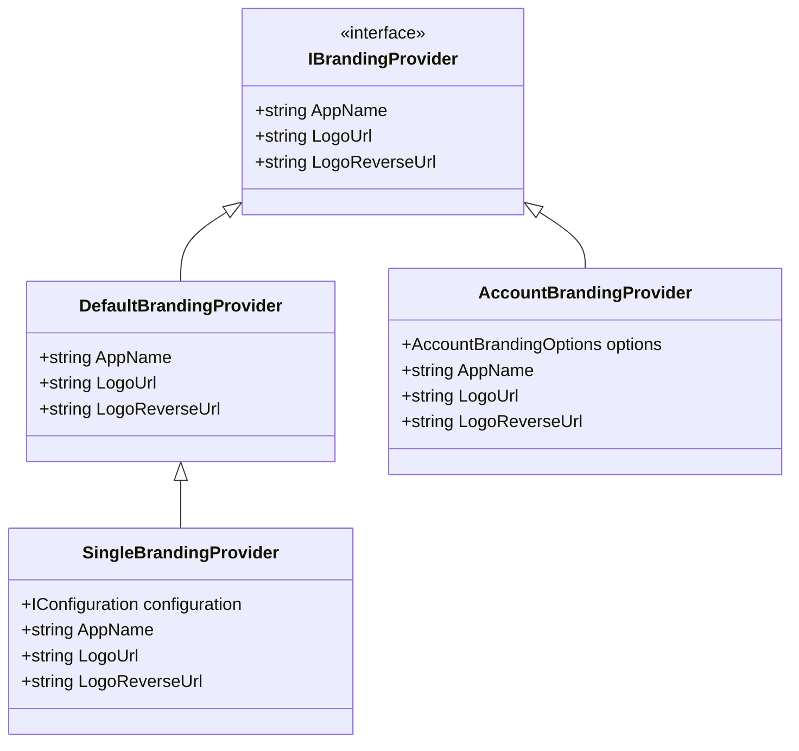
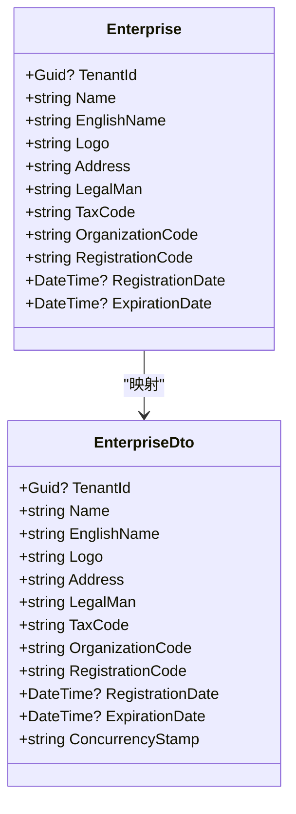
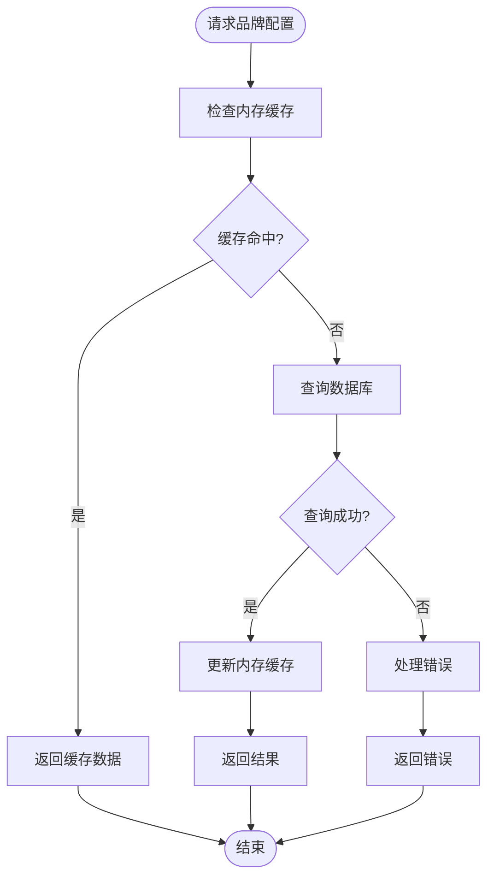
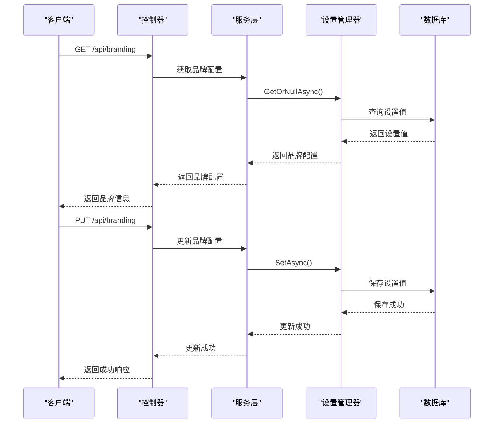
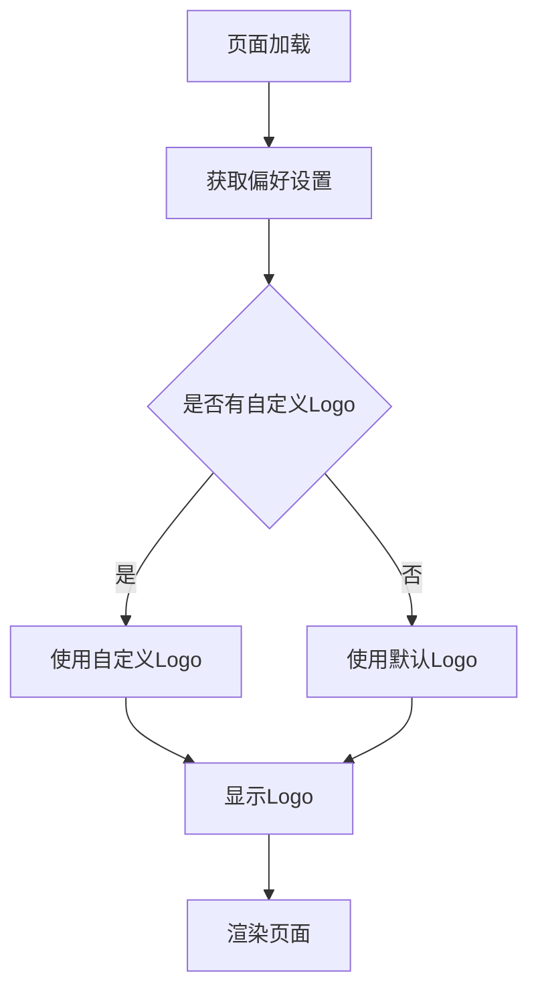

# 品牌配置

<cite>
**本文档中引用的文件**
- [SingleBrandingProvider.cs](file://aspnet-core\services\LY.MicroService.Applications.Single\Branding\SingleBrandingProvider.cs)
- [AccountBrandingProvider.cs](file://aspnet-core\services\LY.MicroService.AuthServer\Ui\Branding\AccountBrandingProvider.cs)
- [Enterprise.cs](file://aspnet-core\modules\platform\LINGYUN.Platform.Domain\LINGYUN\Platform\Portal\Enterprise.cs)
- [EnterpriseDto.cs](file://aspnet-core\modules\platform\LINGYUN.Platform.Application.Contracts\LINGYUN\Platform\Portal\Dto\EnterpriseDto.cs)
- [VueVbenAdminSettingDefinitionProvider.cs](file://aspnet-core\modules\platform\LINGYUN.Platform.Settings.VueVbenAdmin\LINGYUN\Platform\Settings\VueVbenAdmin\VueVbenAdminSettingDefinitionProvider.cs)
- [auth.vue](file://apps\vben5\apps\app-antd\src\layouts\auth.vue)
</cite>

## 目录
1. [简介](#简介)
2. [品牌配置实现机制](#品牌配置实现机制)
3. [多租户品牌展示](#多租户品牌展示)
4. [数据存储与缓存策略](#数据存储与缓存策略)
5. [API接口文档](#api接口文档)
6. [前端应用示例](#前端应用示例)
7. [总结](#总结)

## 简介
本文档详细介绍了ABP框架中的品牌配置功能，包括品牌标识的实现机制、多租户差异化品牌展示、数据存储结构和缓存策略，以及在VueVbenAdmin前端应用中的实际应用。

## 品牌配置实现机制

品牌配置功能通过`IBrandingProvider`接口实现，系统提供了默认的品牌提供者`DefaultBrandingProvider`，并允许通过依赖注入替换为自定义的品牌提供者。在单体应用中，`SingleBrandingProvider`继承自`DefaultBrandingProvider`，通过配置文件获取品牌信息。

**图表来源**
- [SingleBrandingProvider.cs](file://aspnet-core\services\LY.MicroService.Applications.Single\Branding\SingleBrandingProvider.cs)
- [AccountBrandingProvider.cs](file://aspnet-core\services\LY.MicroService.AuthServer\Ui\Branding\AccountBrandingProvider.cs)

**章节来源**
- [SingleBrandingProvider.cs](file://aspnet-core\services\LY.MicroService.Applications.Single\Branding\SingleBrandingProvider.cs)
- [AccountBrandingProvider.cs](file://aspnet-core\services\LY.MicroService.AuthServer\Ui\Branding\AccountBrandingProvider.cs)

## 多租户品牌展示

系统支持多租户架构下的差异化品牌展示，通过企业实体`Enterprise`存储每个租户的品牌信息。每个企业可以配置独立的Logo、名称等品牌元素，实现租户间的品牌隔离。

**图表来源**
- [Enterprise.cs](file://aspnet-core\modules\platform\LINGYUN.Platform.Domain\LINGYUN\Platform\Portal\Enterprise.cs)
- [EnterpriseDto.cs](file://aspnet-core\modules\platform\LINGYUN.Platform.Application.Contracts\LINGYUN\Platform\Portal\Dto\EnterpriseDto.cs)

**章节来源**
- [Enterprise.cs](file://aspnet-core\modules\platform\LINGYUN.Platform.Domain\LINGYUN\Platform\Portal\Enterprise.cs)
- [EnterpriseDto.cs](file://aspnet-core\modules\platform\LINGYUN.Platform.Application.Contracts\LINGYUN\Platform\Portal\Dto\EnterpriseDto.cs)

## 数据存储与缓存策略

品牌配置数据主要存储在数据库的`AppPlatformEnterprises`表中，通过`Logo`字段存储Logo URL。系统采用分层缓存策略，优先从内存缓存读取品牌配置，减少数据库访问压力。

**图表来源**
- [Enterprise.cs](file://aspnet-core\modules\platform\LINGYUN.Platform.Domain\LINGYUN\Platform\Portal\Enterprise.cs)
- [Add-Logo-Property-With-Portal.cs](file://aspnet-core\migrations\LY.MicroService.Platform.EntityFrameworkCore\Migrations\20230509024453_Add-Logo-Property-With-Portal.cs)

**章节来源**
- [Enterprise.cs](file://aspnet-core\modules\platform\LINGYUN.Platform.Domain\LINGYUN\Platform\Portal\Enterprise.cs)
- [Add-Logo-Property-With-Portal.cs](file://aspnet-core\migrations\LY.MicroService.Platform.EntityFrameworkCore\Migrations\20230509024453_Add-Logo-Property-With-Portal.cs)

## API接口文档

品牌配置相关的API接口主要包括品牌信息的读取和更新操作。通过设置管理器`SettingManager`实现品牌配置的持久化存储和读取。

**图表来源**
- [VueVbenAdminSettingDefinitionProvider.cs](file://aspnet-core\modules\platform\LINGYUN.Platform.Settings.VueVbenAdmin\LINGYUN\Platform\Settings\VueVbenAdmin\VueVbenAdminSettingDefinitionProvider.cs)
- [Enterprise.cs](file://aspnet-core\modules\platform\LINGYUN.Platform.Domain\LINGYUN\Platform\Portal\Enterprise.cs)

**章节来源**
- [VueVbenAdminSettingDefinitionProvider.cs](file://aspnet-core\modules\platform\LINGYUN.Platform.Settings.VueVbenAdmin\LINGYUN\Platform\Settings\VueVbenAdmin\VueVbenAdminSettingDefinitionProvider.cs)

## 前端应用示例

在VueVbenAdmin前端应用中，品牌配置通过计算属性`logo`动态获取，并在登录页面和布局组件中应用。

**图表来源**
- [auth.vue](file://apps\vben5\apps\app-antd\src\layouts\auth.vue)

**章节来源**
- [auth.vue](file://apps\vben5\apps\app-antd\src\layouts\auth.vue)

## 总结
品牌配置功能通过灵活的架构设计，实现了品牌信息的集中管理和多租户差异化展示。系统采用分层缓存策略提高性能，并通过标准化的API接口支持前后端分离架构下的品牌配置管理。