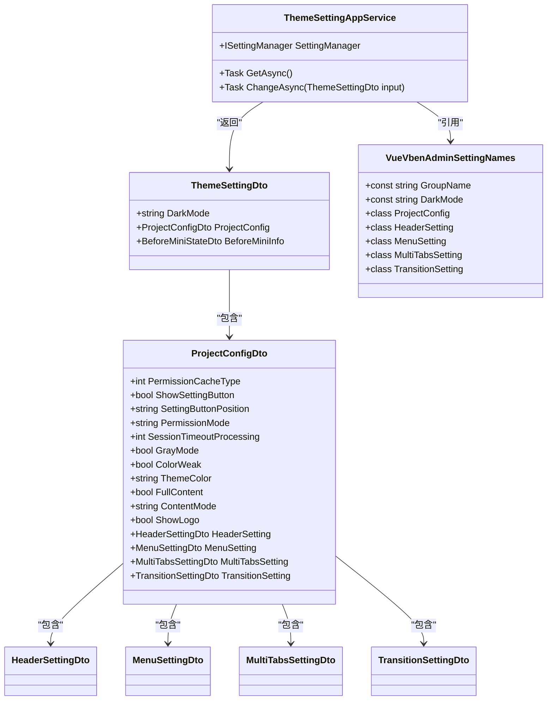
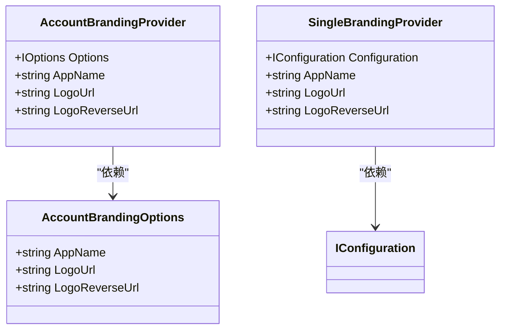

# 门户配置

<cite>
**本文档引用的文件**  
- [ThemeSettingAppService.cs](file://aspnet-core\modules\platform\LINGYUN.Platform.Theme.VueVbenAdmin\LINGYUN\Platform\Theme\VueVbenAdmin\ThemeSettingAppService.cs)
- [ThemeSettingController.cs](file://aspnet-core\modules\platform\LINGYUN.Platform.Theme.VueVbenAdmin\LINGYUN\Platform\Theme\VueVbenAdmin\ThemeSettingController.cs)
- [ThemeSettingDto.cs](file://aspnet-core\modules\platform\LINGYUN.Platform.Theme.VueVbenAdmin\LINGYUN\Platform\Theme\VueVbenAdmin\ThemeSettingDto.cs)
- [VueVbenAdminSettingNames.cs](file://aspnet-core\modules\platform\LINGYUN.Platform.Settings.VueVbenAdmin\LINGYUN\Platform\Settings\VueVbenAdmin\VueVbenAdminSettingNames.cs)
- [VueVbenAdminSettingDefinitionProvider.cs](file://aspnet-core\modules\platform\LINGYUN.Platform.Settings.VueVbenAdmin\LINGYUN\Platform\Settings\VueVbenAdmin\VueVbenAdminSettingDefinitionProvider.cs)
- [AccountBrandingOptions.cs](file://aspnet-core\services\LY.MicroService.AuthServer\Ui\Branding\AccountBrandingOptions.cs)
- [AccountBrandingProvider.cs](file://aspnet-core\services\LY.MicroService.AuthServer\Ui\Branding\AccountBrandingProvider.cs)
- [SingleBrandingProvider.cs](file://aspnet-core\services\LY.MicroService.Applications.Single\Branding\SingleBrandingProvider.cs)
- [StandardMenu.cs](file://aspnet-core\modules\platform\LINGYUN.Platform.Domain\LINGYUN\Platform\Menus\StandardMenu.cs)
- [VueVbenAdminNavigationSeedContributor.cs](file://aspnet-core\modules\platform\LINGYUN.Abp.UI.Navigation.VueVbenAdmin\LINGYUN\Abp\UI\Navigation\VueVbenAdmin\VueVbenAdminNavigationSeedContributor.cs)
- [VueVbenAdmin5NavigationSeedContributor.cs](file://aspnet-core\modules\platform\LINGYUN.Abp.UI.Navigation.VueVbenAdmin5\LINGYUN\Abp\UI\Navigation\VueVbenAdmin5\VueVbenAdmin5NavigationSeedContributor.cs)
</cite>

## 目录
1. [简介](#简介)
2. [门户配置实现机制](#门户配置实现机制)
3. [品牌标识配置](#品牌标识配置)
4. [主题样式配置](#主题样式配置)
5. [导航菜单配置](#导航菜单配置)
6. [多租户差异化配置](#多租户差异化配置)
7. [配置数据存储结构](#配置数据存储结构)
8. [缓存策略](#缓存策略)
9. [API接口文档](#api接口文档)
10. [前端应用集成](#前端应用集成)

## 简介
门户配置功能为VueVbenAdmin前端框架提供全面的主题、布局、菜单等个性化设置管理。系统支持品牌标识、主题样式、导航菜单等多维度配置，通过ABP框架的设置管理模块实现配置的持久化存储和多租户支持。配置数据可按用户、租户等维度进行继承与覆盖，满足不同场景下的个性化需求。

## 门户配置实现机制
门户配置功能基于ABP框架的设置管理模块实现，通过定义配置项、配置定义提供者和应用服务三层架构完成配置的管理。系统将配置分为多个维度，包括主题基础设置、项目配置、头部配置、菜单配置、多标签页配置和过渡动画配置等。

配置的实现遵循以下机制：
- 配置项通过常量类`VueVbenAdminSettingNames`统一定义，确保配置名称的唯一性和可维护性
- 配置定义通过`VueVbenAdminSettingDefinitionProvider`提供，定义每个配置项的默认值、显示名称和描述
- 配置的读取和更新通过`ThemeSettingAppService`应用服务实现，该服务依赖`ISettingManager`进行底层操作
- 配置数据按层级存储，支持全局默认值、租户级配置和用户级配置的继承与覆盖

**图示来源**
- [ThemeSettingAppService.cs](file://aspnet-core\modules\platform\LINGYUN.Platform.Theme.VueVbenAdmin\LINGYUN\Platform\Theme\VueVbenAdmin\ThemeSettingAppService.cs)
- [ThemeSettingDto.cs](file://aspnet-core\modules\platform\LINGYUN.Platform.Theme.VueVbenAdmin\LINGYUN\Platform\Theme\VueVbenAdmin\ThemeSettingDto.cs)
- [VueVbenAdminSettingNames.cs](file://aspnet-core\modules\platform\LINGYUN.Platform.Settings.VueVbenAdmin\LINGYUN\Platform\Settings\VueVbenAdmin\VueVbenAdminSettingNames.cs)

**本节来源**
- [ThemeSettingAppService.cs](file://aspnet-core\modules\platform\LINGYUN.Platform.Theme.VueVbenAdmin\LINGYUN\Platform\Theme\VueVbenAdmin\ThemeSettingAppService.cs)
- [ThemeSettingDto.cs](file://aspnet-core\modules\platform\LINGYUN.Platform.Theme.VueVbenAdmin\LINGYUN\Platform\Theme\VueVbenAdmin\ThemeSettingDto.cs)
- [VueVbenAdminSettingNames.cs](file://aspnet-core\modules\platform\LINGYUN.Platform.Settings.VueVbenAdmin\LINGYUN\Platform\Settings\VueVbenAdmin\VueVbenAdminSettingNames.cs)

## 品牌标识配置
品牌标识配置允许自定义应用程序的品牌信息，包括应用名称、Logo和反色Logo等。系统通过`AccountBrandingOptions`类定义品牌配置项，并通过`AccountBrandingProvider`实现品牌信息的提供。

品牌配置的实现方式：
- 在`AccountBrandingOptions`中定义品牌相关的配置属性
- 通过`AccountBrandingProvider`实现`IBrandingProvider`接口，提供品牌信息
- 品牌信息从配置文件中读取，支持多语言环境下的不同配置
- 系统支持单应用品牌的配置，通过`SingleBrandingProvider`实现

**图示来源**
- [AccountBrandingOptions.cs](file://d:\aChina\Github\Abps\ab