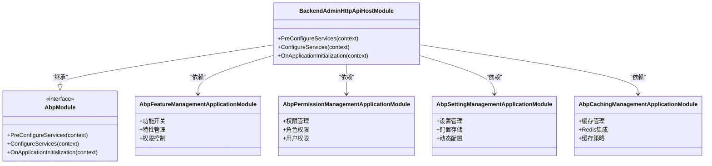

# 微服务架构

<cite>
**本文档引用的文件**   
- [AuthServerModule.cs](file://aspnet-core/services/LY.MicroService.AuthServer/AuthServerModule.cs)
- [BackendAdminHttpApiHostModule.cs](file://aspnet-core/services/LY.MicroService.BackendAdmin.HttpApi.Host/BackendAdminHttpApiHostModule.cs)
- [PlatformManagementHttpApiHostModule.cs](file://aspnet-core/services/LY.MicroService.PlatformManagement.HttpApi.Host/PlatformManagementHttpApiHostModule.cs)
- [yarp.json](file://gateways/web/LY.MicroService.ApiGateway/yarp.json)
- [docker-compose.yml](file://docker-compose.yml)
- [PlatformApplicationModule.cs](file://aspnet-core/modules/platform/LINGYUN.Platform.Application/LINGYUN/Platform/PlatformApplicationModule.cs)
- [AbpDaprModule.cs](file://aspnet-core/framework/dapr/LINGYUN.Abp.Dapr/LINGYUN/Abp/Dapr/AbpDaprModule.cs)
- [AbpDaprClientModule.cs](file://aspnet-core/framework/dapr/LINGYUN.Abp.Dapr.Client/LINGYUN/Abp/Dapr/Client/AbpDaprClientModule.cs)
- [ILoadBalancerFinder.cs](file://gateways/internal/LINGYUN.MicroService.Internal.ApiGateway/src/LINGYUN.MicroService.Internal.ApiGateway/Utils/ILoadBalancerFinder.cs)
- [LoadBalancerFinder.cs](file://gateways/internal/LINGYUN.MicroService.Internal.ApiGateway/src/LINGYUN.MicroService.Internal.ApiGateway/Utils/LoadBalancerFinder.cs)
- [ApiGatewayController.cs](file://gateways/internal/LINGYUN.MicroService.Internal.ApiGateway/src/LINGYUN.MicroService.Internal.ApiGateway/Controllers/ApiGatewayController.cs)
</cite>

## 目录
1. [简介](#简介)
2. [项目结构](#项目结构)
3. [核心组件](#核心组件)
4. [架构概述](#架构概述)
5. [详细组件分析](#详细组件分析)
6. [依赖分析](#依赖分析)
7. [性能考虑](#性能考虑)
8. [故障排除指南](#故障排除指南)
9. [结论](#结论)
10. [附录](#附录)（如有必要）

## 简介
本项目采用微服务架构设计，将复杂的单体应用拆分为多个独立的、可独立部署的服务。这种架构模式提高了系统的可维护性、可扩展性和灵活性。项目通过Docker Compose进行容器化部署，使用YARP作为反向代理网关来管理服务间的通信。微服务之间通过HTTP API进行交互，同时利用CAP事件总线实现异步消息通信。项目还集成了Elasticsearch用于日志和审计数据的存储与查询，SkyWalking用于分布式追踪和性能监控。

## 项目结构

**图示来源**
- [docker-compose.yml](file://docker-compose.yml)
- [yarp.json](file://gateways/web/LY.MicroService.ApiGateway/yarp.json)

**本节来源**
- [docker-compose.yml](file://docker-compose.yml)
- [yarp.json](file://gateways/web/LY.MicroService.ApiGateway/yarp.json)

## 核心组件

本项目的核心组件包括AuthServer、BackendAdmin和Platform等微服务，每个服务都有明确的职责边界。AuthServer负责身份认证和授权，BackendAdmin提供后台管理功能，Platform则管理平台级的资源和配置。这些服务通过API网关对外提供统一的接口，内部通过CAP事件总线进行异步通信。服务间的数据一致性通过事件驱动架构保证，每个服务拥有独立的数据库，实现了数据的物理隔离。

**本节来源**
- [AuthServerModule.cs](file://aspnet-core/services/LY.MicroService.AuthServer/AuthServerModule.cs)
- [BackendAdminHttpApiHostModule.cs](file://aspnet-core/services/LY.MicroService.BackendAdmin.HttpApi.Host/BackendAdminHttpApiHostModule.cs)
- [PlatformManagementHttpApiHostModule.cs](file://aspnet-core/services/LY.MicroService.PlatformManagement.HttpApi.Host/PlatformManagementHttpApiHostModule.cs)

## 架构概述

**图示来源**
- [docker-compose.yml](file://docker-compose.yml)
- [yarp.json](file://gateways/web/LY.MicroService.ApiGateway/yarp.json)

## 详细组件分析

### 认证服务分析

**图示来源**
- [AuthServerModule.cs](file://aspnet-core/services/LY.MicroService.AuthServer/AuthServerModule.cs)

**本节来源**
- [AuthServerModule.cs](file://aspnet-core/services/LY.MicroService.AuthServer/AuthServerModule.cs)

### 后台管理服务分析

**图示来源**
- [BackendAdminHttpApiHostModule.cs](file://aspnet-core/services/LY.MicroService.BackendAdmin.HttpApi.Host/BackendAdminHttpApiHostModule.cs)

**本节来源**
- [BackendAdminHttpApiHostModule.cs](file://aspnet-core/services/LY.MicroService.BackendAdmin.HttpApi.Host/BackendAdminHttpApiHostModule.cs)

### 平台管理服务分析

**图示来源**
- [PlatformManagementHttpApiHostModule.cs](file://aspnet-core/services/LY.MicroService.PlatformManagement.HttpApi.Host/PlatformManagementHttpApiHostModule.cs)

**本节来源**
- [PlatformManagementHttpApiHostModule.cs](file://aspnet-core/services/LY.MicroService.PlatformManagement.HttpApi.Host/PlatformManagementHttpApiHostModule.cs)

### 服务发现与负载均衡分析

**图示来源**
- [ILoadBalancerFinder.cs](file://gateways/internal/LINGYUN.MicroService.Internal.ApiGateway/src/LINGYUN.MicroService.Internal.ApiGateway/Utils/ILoadBalancerFinder.cs)
- [LoadBalancerFinder.cs](file://gateways/internal/LINGYUN.MicroService.Internal.ApiGateway/src/LINGYUN.MicroService.Internal.ApiGateway/Utils/LoadBalancerFinder.cs)
- [ApiGatewayController.cs](file://gateways/internal/LINGYUN.MicroService.Internal.ApiGateway/src/LINGYUN.MicroService.Internal.ApiGateway/Controllers/ApiGatewayController.cs)

**本节来源**
- [ILoadBalancerFinder.cs](file://gateways/internal/LINGYUN.MicroService.Internal.ApiGateway/src/LINGYUN.MicroService.Internal.ApiGateway/Utils/ILoadBalancerFinder.cs)
- [LoadBalancerFinder.cs](file://gateways/internal/LINGYUN.MicroService.Internal.ApiGateway/src/LINGYUN.MicroService.Internal.ApiGateway/Utils/LoadBalancerFinder.cs)
- [ApiGatewayController.cs](file://gateways/internal/LINGYUN.MicroService.Internal.ApiGateway/src/LINGYUN.MicroService.Internal.ApiGateway/Controllers/ApiGatewayController.cs)

## 依赖分析

**图示来源**
- [AuthServerModule.cs](file://aspnet-core/services/LY.MicroService.AuthServer/AuthServerModule.cs)
- [BackendAdminHttpApiHostModule.cs](file://aspnet-core/services/LY.MicroService.BackendAdmin.HttpApi.Host/BackendAdminHttpApiHostModule.cs)
- [PlatformManagementHttpApiHostModule.cs](file://aspnet-core/services/LY.MicroService.PlatformManagement.HttpApi.Host/PlatformManagementHttpApiHostModule.cs)

**本节来源**
- [AuthServerModule.cs](file://aspnet-core/services/LY.MicroService.AuthServer/AuthServerModule.cs)
- [BackendAdminHttpApiHostModule.cs](file://aspnet-core/services/LY.MicroService.BackendAdmin.HttpApi.Host/BackendAdminHttpApiHostModule.cs)
- [PlatformManagementHttpApiHostModule.cs](file://aspnet-core/services/LY.MicroService.PlatformManagement.HttpApi.Host/PlatformManagementHttpApiHostModule.cs)

## 性能考虑

本项目通过多种机制优化微服务架构的性能。首先，使用Redis作为分布式缓存，减少数据库访问频率。其次，通过CAP事件总线实现异步处理，提高系统的响应速度。再者，利用SkyWalking进行分布式追踪，帮助识别性能瓶颈。此外，每个微服务都配置了健康检查，确保服务的高可用性。API网关层实现了请求的负载均衡，避免单个服务实例过载。最后，通过Elasticsearch对日志进行高效存储和查询，便于性能分析和问题排查。

## 故障排除指南

当微服务出现故障时，可以按照以下步骤进行排查：首先检查Docker容器的运行状态，确保所有服务都正常启动。然后查看各服务的日志文件，特别是Elasticsearch中的审计日志，定位错误信息。如果涉及服务间通信问题，检查YARP网关的配置和路由规则。对于数据库相关问题，确认数据库连接字符串和迁移状态。若出现性能问题，使用SkyWalking分析调用链，找出瓶颈所在。对于缓存问题，检查Redis的连接和数据一致性。最后，确保Dapr边车和CAP消息总线正常运行，以保证事件驱动架构的正确性。

**本节来源**
- [docker-compose.yml](file://docker-compose.yml)
- [yarp.json](file://gateways/web/LY.MicroService.ApiGateway/yarp.json)
- [AuthServerModule.cs](file://aspnet-core/services/LY.MicroService.AuthServer/AuthServerModule.cs)

## 结论

本项目成功实现了基于微服务架构的复杂系统。通过将功能拆分为AuthServer、BackendAdmin、Platform等独立服务，提高了系统的可维护性和可扩展性。服务间通过API网关进行通信，利用CAP事件总线实现异步解耦。Dapr的集成增强了服务的分布式能力。尽管微服务架构带来了服务治理、数据一致性和运维复杂性等挑战，但通过合理的架构设计和技术选型，这些问题都得到了有效解决