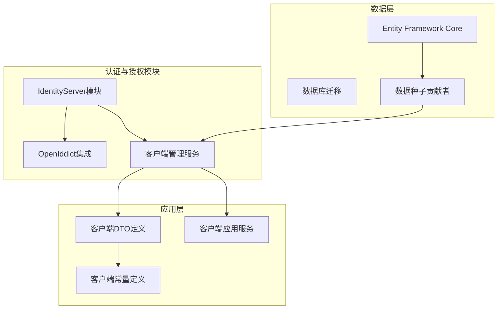
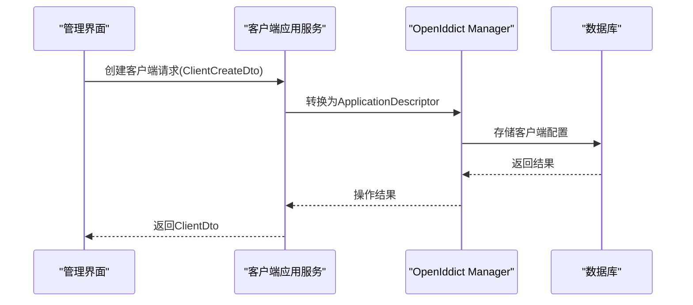
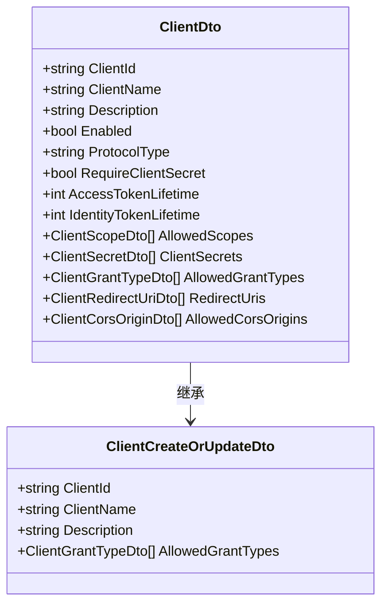
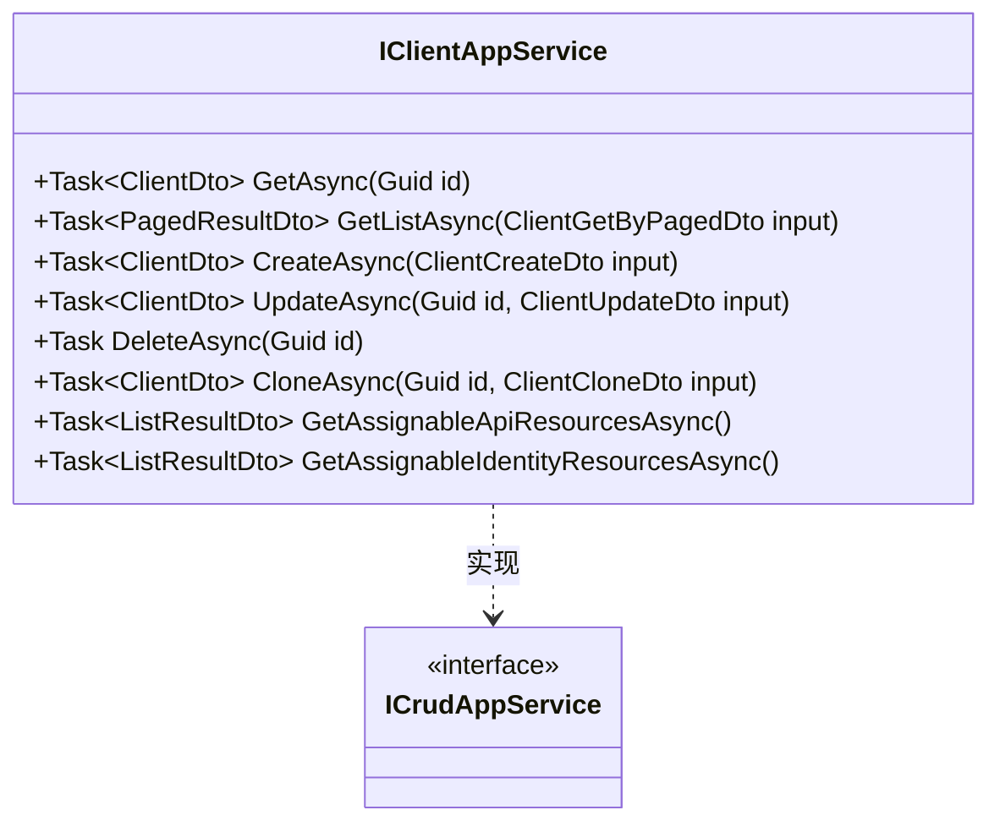
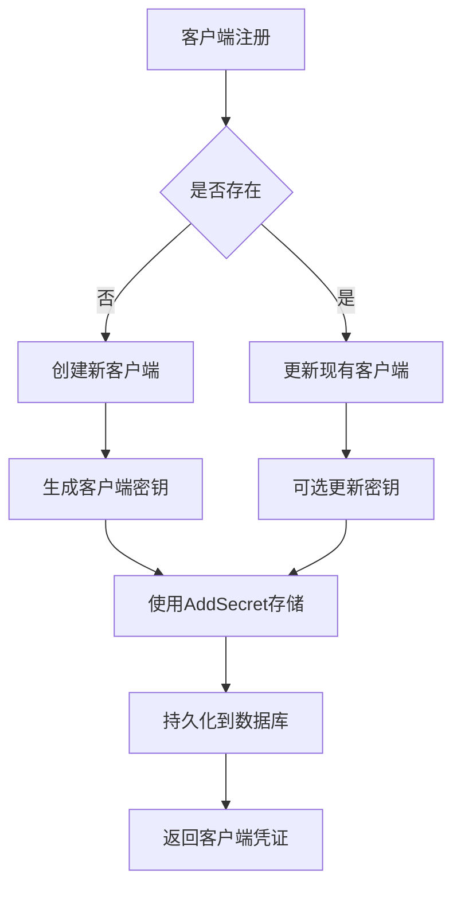
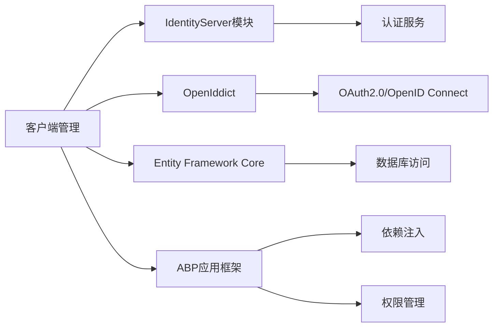

# OAuth客户端配置

<cite>
**本文档引用的文件**
- [ClientDto.cs](file://aspnet-core/modules/identityServer/LINGYUN.Abp.IdentityServer.Application.Contracts/LINGYUN/Abp/IdentityServer/Clients/Dto/ClientDto.cs)
- [IClientAppService.cs](file://aspnet-core/modules/identityServer/LINGYUN.Abp.IdentityServer.Application.Contracts/LINGYUN/Abp/IdentityServer/Clients/IClientAppService.cs)
- [ClientCreateOrUpdateDto.cs](file://aspnet-core/modules/identityServer/LINGYUN.Abp.IdentityServer.Application.Contracts/LINGYUN/Abp/IdentityServer/Clients/Dto/ClientCreateOrUpdateDto.cs)
- [IdentityServerDataSeedContributor.cs](file://aspnet-core/migrations/LY.MicroService.IdentityServer.EntityFrameworkCore/DataSeeder/IdentityServerDataSeedContributor.cs)
- [IdentityServerAppKeyStore.cs](file://aspnet-core/framework/open-api/LINGYUN.Abp.OpenApi.IdentityServer/LINGYUN/Abp/OpenApi/IdentityServer/IdentityServerAppKeyStore.cs)
</cite>

## 目录
1. [简介](#简介)
2. [项目结构](#项目结构)
3. [核心组件](#核心组件)
4. [架构概述](#架构概述)
5. [详细组件分析](#详细组件分析)
6. [依赖关系分析](#依赖关系分析)
7. [性能考虑](#性能考虑)
8. [故障排除指南](#故障排除指南)
9. [结论](#结论)

## 简介
本指南详细说明了如何在系统中配置OAuth客户端应用。文档涵盖了客户端ID、密钥、重定向URI、授权类型和作用域的设置方法，解释了客户端凭证的安全存储机制，并提供了通过API或管理界面创建、更新和删除客户端的完整操作流程。

## 项目结构
该系统基于ABP框架构建，采用模块化设计，其中身份验证和授权功能由IdentityServer模块处理。OAuth客户端配置主要集中在`aspnet-core/modules/identityServer`目录下的应用合约和服务中，而初始数据种子逻辑则位于迁移项目中的`DataSeeder`类。

**Diagram sources**
- [ClientDto.cs](file://aspnet-core/modules/identityServer/LINGYUN.Abp.IdentityServer.Application.Contracts/LINGYUN/Abp/IdentityServer/Clients/Dto/ClientDto.cs)
- [IdentityServerDataSeedContributor.cs](file://aspnet-core/migrations/LY.MicroService.IdentityServer.EntityFrameworkCore/DataSeeder/IdentityServerDataSeedContributor.cs)

**Section sources**
- [ClientDto.cs](file://aspnet-core/modules/identityServer/LINGYUN.Abp.IdentityServer.Application.Contracts/LINGYUN/Abp/IdentityServer/Clients/Dto/ClientDto.cs)
- [IdentityServerDataSeedContributor.cs](file://aspnet-core/migrations/LY.MicroService.IdentityServer.EntityFrameworkCore/DataSeeder/IdentityServerDataSeedContributor.cs)

## 核心组件
系统中的OAuth客户端配置涉及多个核心组件：`ClientDto`用于传输客户端数据，`IClientAppService`提供CRUD操作接口，`ClientCreateOrUpdateDto`定义创建和更新客户端时的数据结构，以及`IdentityServerDataSeedContributor`负责初始化预设客户端。

**Section sources**
- [ClientDto.cs](file://aspnet-core/modules/identityServer/LINGYUN.Abp.IdentityServer.Application.Contracts/LINGYUN/Abp/IdentityServer/Clients/Dto/ClientDto.cs)
- [IClientAppService.cs](file://aspnet-core/modules/identityServer/LINGYUN.Abp.IdentityServer.Application.Contracts/LINGYUN/Abp/IdentityServer/Clients/IClientAppService.cs)
- [ClientCreateOrUpdateDto.cs](file://aspnet-core/modules/identityServer/LINGYUN.Abp.IdentityServer.Application.Contracts/LINGYUN/Abp/IdentityServer/Clients/Dto/ClientCreateOrUpdateDto.cs)

## 架构概述
系统采用分层架构，前端通过管理界面调用后端API进行客户端配置。应用服务层使用OpenIddict框架与数据库交互，实现OAuth 2.0和OpenID Connect协议支持。所有客户端配置均通过DTO对象在各层间传递，确保类型安全和数据完整性。

**Diagram sources**
- [IClientAppService.cs](file://aspnet-core/modules/identityServer/LINGYUN.Abp.IdentityServer.Application.Contracts/LINGYUN/Abp/IdentityServer/Clients/IClientAppService.cs)
- [IdentityServerDataSeedContributor.cs](file://aspnet-core/migrations/LY.MicroService.IdentityServer.EntityFrameworkCore/DataSeeder/IdentityServerDataSeedContributor.cs)

## 详细组件分析

### 客户端数据传输对象分析
`ClientDto`类定义了OAuth客户端的所有可配置属性，包括基本标识信息、令牌生命周期设置、重定向URI列表、允许的作用域和授权类型等。

**Diagram sources**
- [ClientDto.cs](file://aspnet-core/modules/identityServer/LINGYUN.Abp.IdentityServer.Application.Contracts/LINGYUN/Abp/IdentityServer/Clients/Dto/ClientDto.cs)
- [ClientCreateOrUpdateDto.cs](file://aspnet-core/modules/identityServer/LINGYUN.Abp.IdentityServer.Application.Contracts/LINGYUN/Abp/IdentityServer/Clients/Dto/ClientCreateOrUpdateDto.cs)

### 客户端管理服务分析
`IClientAppService`接口继承自ABP框架的`ICrudAppService`，提供了标准的增删改查操作，并扩展了克隆客户端和获取可用资源的方法。

**Diagram sources**
- [IClientAppService.cs](file://aspnet-core/modules/identityServer/LINGYUN.Abp.IdentityServer.Application.Contracts/LINGYUN/Abp/IdentityServer/Clients/IClientAppService.cs)

### 客户端凭证存储机制
系统通过`IdentityServerAppKeyStore`实现安全的客户端密钥存储，利用OpenIddict的客户端存储机制将密钥加密保存在数据库中。

**Diagram sources**
- [IdentityServerAppKeyStore.cs](file://aspnet-core/framework/open-api/LINGYUN.Abp.OpenApi.IdentityServer/LINGYUN/Abp/OpenApi/IdentityServer/IdentityServerAppKeyStore.cs)
- [IdentityServerDataSeedContributor.cs](file://aspnet-core/migrations/LY.MicroService.IdentityServer.EntityFrameworkCore/DataSeeder/IdentityServerDataSeedContributor.cs)

**Section sources**
- [IdentityServerAppKeyStore.cs](file://aspnet-core/framework/open-api/LINGYUN.Abp.OpenApi.IdentityServer/LINGYUN/Abp/OpenApi/IdentityServer/IdentityServerAppKeyStore.cs)
- [IdentityServerDataSeedContributor.cs](file://aspnet-core/migrations/LY.MicroService.IdentityServer.EntityFrameworkCore/DataSeeder/IdentityServerDataSeedContributor.cs)

## 依赖关系分析
OAuth客户端配置功能依赖于多个核心模块：IdentityServer提供基础认证服务，OpenIddict实现OAuth协议，Entity Framework Core处理数据持久化，ABP框架提供应用服务基础设施。

**Diagram sources**
- [IClientAppService.cs](file://aspnet-core/modules/identityServer/LINGYUN.Abp.IdentityServer.Application.Contracts/LINGYUN/Abp/IdentityServer/Clients/IClientAppService.cs)
- [IdentityServerDataSeedContributor.cs](file://aspnet-core/migrations/LY.MicroService.IdentityServer.EntityFrameworkCore/DataSeeder/IdentityServerDataSeedContributor.cs)

**Section sources**
- [IClientAppService.cs](file://aspnet-core/modules/identityServer/LINGYUN.Abp.IdentityServer.Application.Contracts/LINGYUN/Abp/IdentityServer/Clients/IClientAppService.cs)
- [IdentityServerDataSeedContributor.cs](file://aspnet-core/migrations/LY.MicroService.IdentityServer.EntityFrameworkCore/DataSeeder/IdentityServerDataSeedContributor.cs)

## 性能考虑
客户端配置操作通常不频繁，但查询操作可能较频繁。建议对常用查询如`GetAllDistinctAllowedCorsOriginsAsync`进行缓存，以减少数据库访问压力。同时，合理的索引设计对于`ClientId`字段的快速查找至关重要。

## 故障排除指南
当遇到客户端配置问题时，应首先检查客户端ID是否唯一，密钥格式是否正确，重定向URI是否匹配实际部署环境。对于认证失败的情况，需要验证作用域和授权类型的配置是否符合客户端应用的需求。

**Section sources**
- [ClientDto.cs](file://aspnet-core/modules/identityServer/LINGYUN.Abp.IdentityServer.Application.Contracts/LINGYUN/Abp/IdentityServer/Clients/Dto/ClientDto.cs)
- [IdentityServerAppKeyStore.cs](file://aspnet-core/framework/open-api/LINGYUN.Abp.OpenApi.IdentityServer/LINGYUN/Abp/OpenApi/IdentityServer/IdentityServerAppKeyStore.cs)

## 结论
本系统提供了完整的OAuth客户端配置解决方案，通过标准化的API接口和安全的凭证管理机制，支持灵活的客户端应用集成。开发者可以利用提供的服务轻松实现客户端的全生命周期管理。