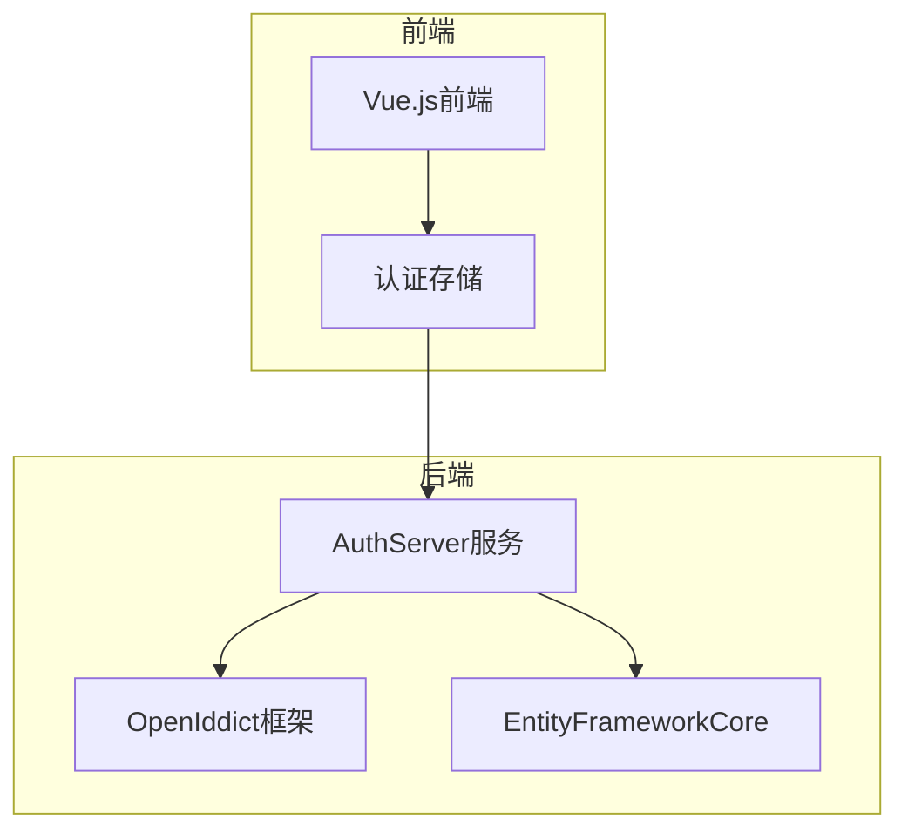

# OAuth授权流程

<cite>
**本文档引用的文件**  
- [AuthServerModule.cs](file://aspnet-core\services\LY.MicroService.AuthServer\AuthServerModule.cs)
- [AuthServerModule.Configure.cs](file://aspnet-core\services\LY.MicroService.AuthServer\AuthServerModule.Configure.cs)
- [AuthServerDataSeedContributor.cs](file://aspnet-core\services\LY.MicroService.AuthServer\DataSeeder\AuthServerDataSeedContributor.cs)
- [ClientDataSeederContributor.cs](file://aspnet-core\migrations\LY.MicroService.Applications.Single.EntityFrameworkCore\DataSeeder\ClientDataSeederContributor.cs)
- [RevocationIdentitySession.cs](file://aspnet-core\modules\openIddict\LINGYUN.Abp.OpenIddict.AspNetCore.Session\LINGYUN\Abp\OpenIddict\AspNetCore\Session\RevocationIdentitySession.cs)
- [login.vue](file://apps\vben5\apps\app-antd\src\views\_core\authentication\login.vue)
- [third-party-login.vue](file://apps\vben5\apps\app-antd\src\views\_core\authentication\third-party-login.vue)
- [auth.ts](file://apps\vben5\apps\app-antd\src\store\auth.ts)
- [OpenIddictApplicationTokenLifetimeConsts.cs](file://aspnet-core\modules\openIddict\LINGYUN.Abp.OpenIddict.Application.Contracts\LINGYUN\Abp\OpenIddict\Applications\OpenIddictApplicationTokenLifetimeConsts.cs)
- [SmsTokenExtensionGrantConsts.cs](file://aspnet-core\modules\openIddict\LINGYUN.Abp.OpenIddict.Sms\LINGYUN\Abp\OpenIddict\Sms\SmsTokenExtensionGrantConsts.cs)
- [QrCodeLoginProviderConsts.cs](file://aspnet-core\modules\identity\LINGYUN.Abp.Identity.QrCode\LINGYUN\Abp\Identity\QrCode\QrCodeLoginProviderConsts.cs)
</cite>

## 目录
1. [简介](#简介)
2. [项目结构](#项目结构)
3. [核心组件](#核心组件)
4. [架构概述](#架构概述)
5. [详细组件分析](#详细组件分析)
6. [依赖分析](#依赖分析)
7. [性能考虑](#性能考虑)
8. [故障排除指南](#故障排除指南)
9. [结论](#结论)
10. [附录](#附录)（如有必要）

## 简介
本文档详细阐述了ABP框架中实现的OAuth 2.0授权流程，包括授权码模式、隐式模式、客户端凭证模式和密码模式。文档解释了每种流程的适用场景、安全考虑和实现细节，并提供了从客户端请求到令牌颁发的完整交互流程图。同时，文档说明了如何在ABP框架中配置和自定义这些流程，以及如何处理刷新令牌和令牌撤销。

## 项目结构
项目采用模块化架构，OAuth 2.0授权功能主要由AuthServer服务实现，该服务基于OpenIddict框架。前端使用Vue.js实现，通过API与AuthServer交互。数据存储使用EntityFrameworkCore，支持多种数据库。

**图表来源**
- [AuthServerModule.cs](file://aspnet-core\services\LY.MicroService.AuthServer\AuthServerModule.cs)
- [auth.ts](file://apps\vben5\apps\app-antd\src\store\auth.ts)

**章节来源**
- [AuthServerModule.cs](file://aspnet-core\services\LY.MicroService.AuthServer\AuthServerModule.cs)
- [auth.ts](file://apps\vben5\apps\app-antd\src\store\auth.ts)

## 核心组件
核心组件包括AuthServer服务、OpenIddict框架、前端认证存储和数据库访问层。AuthServer服务负责处理所有OAuth 2.0请求，OpenIddict框架提供标准化的OAuth 2.0实现，前端认证存储管理用户会话，数据库访问层处理持久化数据。

**章节来源**
- [AuthServerModule.cs](file://aspnet-core\services\LY.MicroService.AuthServer\AuthServerModule.cs)
- [Auth