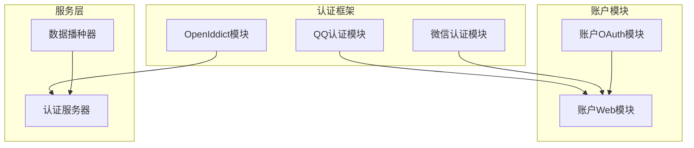
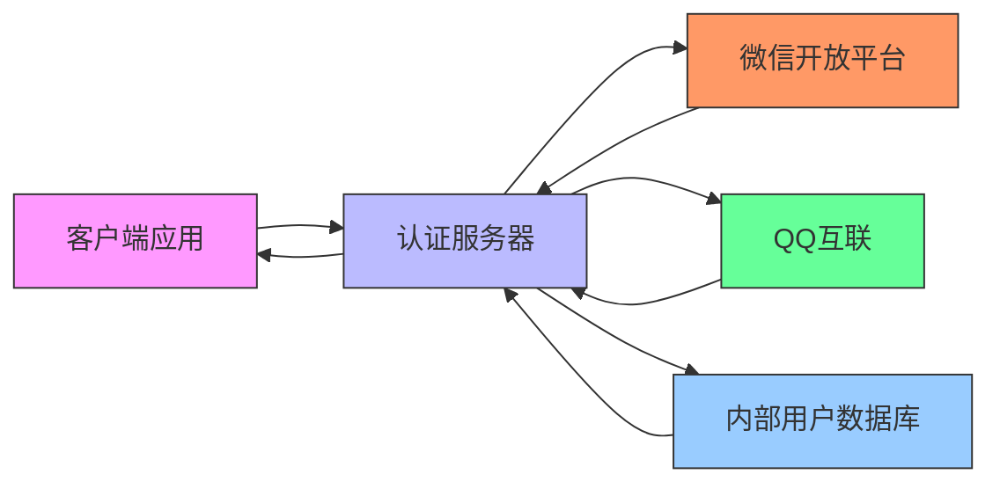
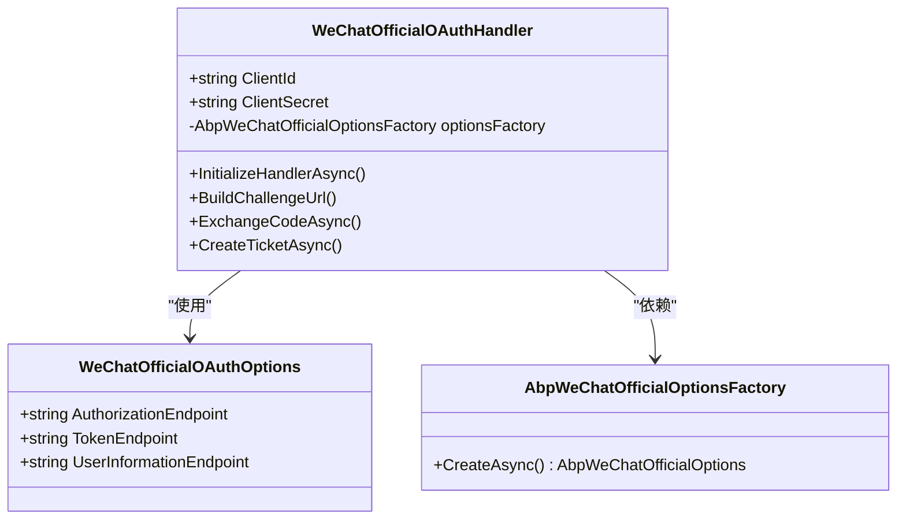
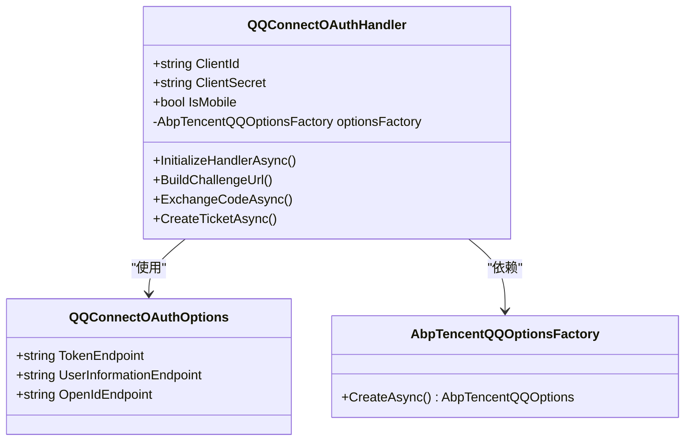
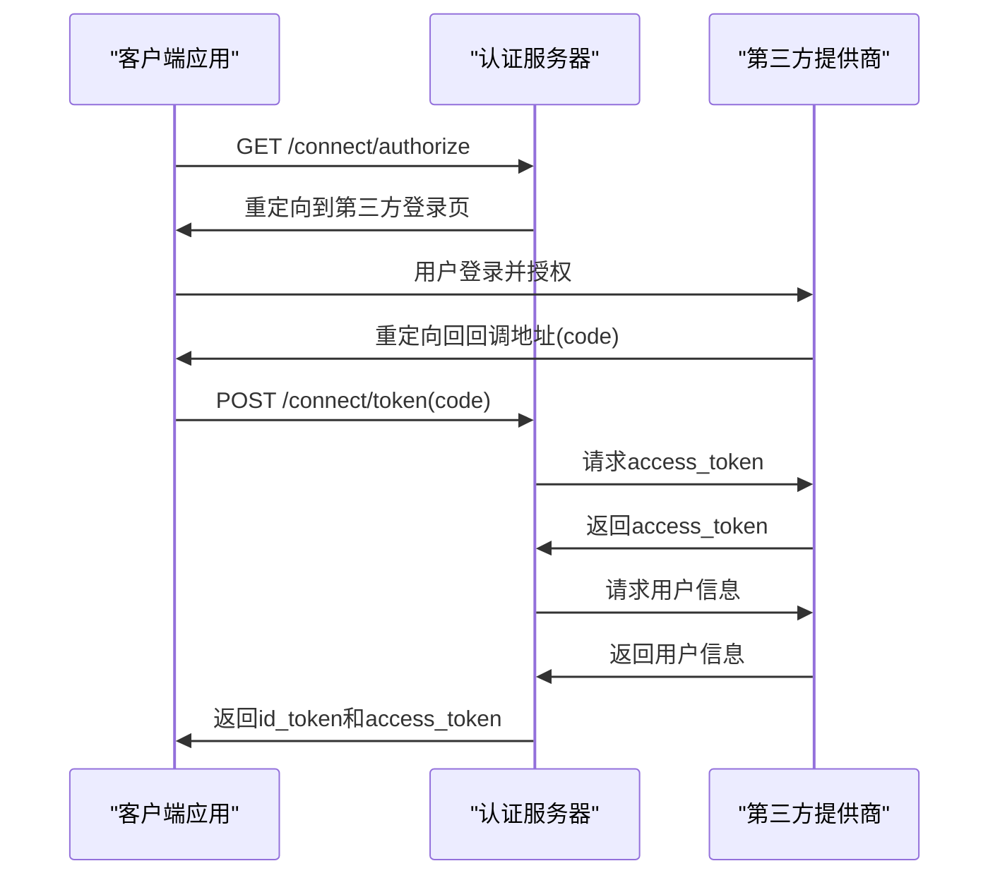
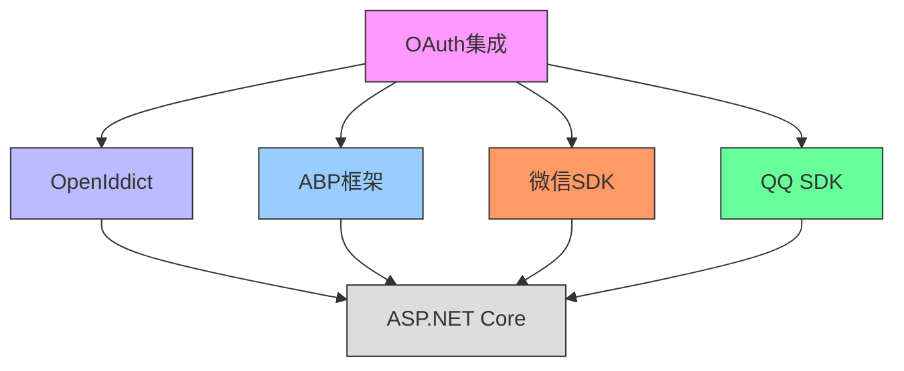

# OAuth集成

<cite>
**本文档引用的文件**   
- [AbpAccountWebOAuthModule.cs](file://aspnet-core/modules/account/LINGYUN.Abp.Account.Web.OAuth/AbpAccountWebOAuthModule.cs)
- [WeChatOfficialOAuthHandler.cs](file://aspnet-core/framework/authentication/LINGYUN.Abp.Authentication.WeChat/Microsoft/AspNetCore/Authentication/WeChat/Official/WeChatOfficialOAuthHandler.cs)
- [QQConnectOAuthHandler.cs](file://aspnet-core/framework/authentication/LINGYUN.Abp.Authentication.QQ/Microsoft/AspNetCore/Authentication/QQ/QQConnectOAuthHandler.cs)
- [ClientDataSeederContributor.cs](file://aspnet-core/migrations/LY.MicroService.Applications.Single.EntityFrameworkCore/DataSeeder/ClientDataSeederContributor.cs)
- [AuthServerModule.Configure.cs](file://aspnet-core/services/LY.MicroService.AuthServer/AuthServerModule.Configure.cs)
- [AbpAuthenticationWeChatModule.cs](file://aspnet-core/framework/authentication/LINGYUN.Abp.Authentication.WeChat/LINGYUN/Abp/Authentication/WeChat/AbpAuthenticationWeChatModule.cs)
- [AbpAuthenticationQQModule.cs](file://aspnet-core/framework/authentication/LINGYUN.Abp.Authentication.QQ/LINGYUN/Abp/Authentication/QQ/AbpAuthenticationQQModule.cs)
- [README.md](file://aspnet-core/framework/authentication/README.md)
</cite>

## 目录
1. [介绍](#介绍)
2. [项目结构](#项目结构)
3. [核心组件](#核心组件)
4. [架构概述](#架构概述)
5. [详细组件分析](#详细组件分析)
6. [依赖分析](#依赖分析)
7. [性能考虑](#性能考虑)
8. [故障排除指南](#故障排除指南)
9. [结论](#结论)

## 介绍
本项目实现了基于OAuth 2.0和OpenID Connect协议的认证系统，支持多种第三方身份提供商的集成，包括微信、QQ等社交平台。系统采用ABP框架构建，通过OpenIddict实现了完整的OAuth服务器功能，支持授权码模式、客户端凭证模式等多种授权流程。本文档将深入解析OAuth集成的实现细节，包括协议实现、第三方集成、API端点配置等方面。

## 项目结构
项目采用模块化设计，OAuth相关功能分布在多个模块中。核心认证功能位于framework/authentication目录下，包含QQ和微信认证模块。账户模块(account)提供OAuth Web集成，而OpenIddict模块则负责OAuth协议的核心实现。数据迁移模块负责客户端应用的初始化配置。

**图源**
- [AbpAccountWebOAuthModule.cs](file://aspnet-core/modules/account/LINGYUN.Abp.Account.Web.OAuth/AbpAccountWebOAuthModule.cs)
- [ClientDataSeederContributor.cs](file://aspnet-core/migrations/LY.MicroService.Applications.Single.EntityFrameworkCore/DataSeeder/ClientDataSeederContributor.cs)

**本节来源**
- [README.md](file://aspnet-core/framework/authentication/README.md#L1-L50)

## 核心组件
系统的核心组件包括第三方认证处理器、OAuth服务器配置和客户端应用管理。微信和QQ认证模块实现了标准的OAuth 2.0授权码流程，通过自定义的OAuth处理器与第三方平台交互。OpenIddict模块提供了OAuth 2.0和OpenID Connect协议的完整实现，支持多种授权模式和令牌类型。

**本节来源**
- [AbpAccountWebOAuthModule.cs](file://aspnet-core/modules/account/LINGYUN.Abp.Account.Web.OAuth/AbpAccountWebOAuthModule.cs#L30-L70)
- [AuthServerModule.Configure.cs](file://aspnet-core/services/LY.MicroService.AuthServer/AuthServerModule.Configure.cs#L364-L418)

## 架构概述
系统采用分层架构设计，前端通过标准OAuth流程与认证服务器交互，认证服务器集成第三方身份提供商，实现统一的身份认证。OpenIddict作为核心OAuth框架，处理所有标准OAuth端点请求，包括授权、令牌颁发和用户信息获取。

**图源**
- [WeChatOfficialOAuthHandler.cs](file://aspnet-core/framework/authentication/LINGYUN.Abp.Authentication.WeChat/Microsoft/AspNetCore/Authentication/WeChat/Official/WeChatOfficialOAuthHandler.cs#L1-L50)
- [QQConnectOAuthHandler.cs](file://aspnet-core/framework/authentication/LINGYUN.Abp.Authentication.QQ/Microsoft/AspNetCore/Authentication/QQ/QQConnectOAuthHandler.cs#L1-L50)

## 详细组件分析

### 微信认证组件分析
微信认证组件实现了微信公众号OAuth2.0认证流程，支持网页授权和扫码登录两种模式。组件根据用户代理自动判断使用场景，移动端优先使用微信内置浏览器授权，PC端则使用扫码登录。

#### 微信认证类图

**图源**
- [WeChatOfficialOAuthHandler.cs](file://aspnet-core/framework/authentication/LINGYUN.Abp.Authentication.WeChat/Microsoft/AspNetCore/Authentication/WeChat/Official/WeChatOfficialOAuthHandler.cs#L15-L45)
- [AbpAuthenticationWeChatModule.cs](file://aspnet-core/framework/authentication/LINGYUN.Abp.Authentication.WeChat/LINGYUN/Abp/Authentication/WeChat/AbpAuthenticationWeChatModule.cs#L5-L20)

### QQ认证组件分析
QQ认证组件实现了QQ互联OAuth2.0认证流程，支持移动端和PC端登录。组件通过QQ Connect API获取用户基本信息，包括昵称、性别和头像等。

#### QQ认证类图

**图源**
- [QQConnectOAuthHandler.cs](file://aspnet-core/framework/authentication/LINGYUN.Abp.Authentication.QQ/Microsoft/AspNetCore/Authentication/QQ/QQConnectOAuthHandler.cs#L15-L45)
- [AbpAuthenticationQQModule.cs](file://aspnet-core/framework/authentication/LINGYUN.Abp.Authentication.QQ/LINGYUN/Abp/Authentication/QQ/AbpAuthenticationQQModule.cs#L5-L20)

### OAuth授权流程分析
系统实现了标准的OAuth 2.0授权码模式流程，包括授权请求、令牌获取和用户信息获取三个主要步骤。

#### OAuth授权流程序列图

**图源**
- [WeChatOfficialOAuthHandler.cs](file://aspnet-core/framework/authentication/LINGYUN.Abp.Authentication.WeChat/Microsoft/AspNetCore/Authentication/WeChat/Official/WeChatOfficialOAuthHandler.cs#L50-L150)
- [QQConnectOAuthHandler.cs](file://aspnet-core/framework/authentication/LINGYUN.Abp.Authentication.QQ/Microsoft/AspNetCore/Authentication/QQ/QQConnectOAuthHandler.cs#L50-L150)

**本节来源**
- [WeChatOfficialOAuthHandler.cs](file://aspnet-core/framework/authentication/LINGYUN.Abp.Authentication.WeChat/Microsoft/AspNetCore/Authentication/WeChat/Official/WeChatOfficialOAuthHandler.cs#L1-L312)
- [QQConnectOAuthHandler.cs](file://aspnet-core/framework/authentication/LINGYUN.Abp.Authentication.QQ/Microsoft/AspNetCore/Authentication/QQ/QQConnectOAuthHandler.cs#L1-L174)

## 依赖分析
系统依赖于多个核心组件和第三方库来实现OAuth功能。主要依赖包括OpenIddict框架、ABP框架的核心模块以及第三方身份提供商的SDK。

**图源**
- [AbpAccountWebOAuthModule.cs](file://aspnet-core/modules/account/LINGYUN.Abp.Account.Web.OAuth/AbpAccountWebOAuthModule.cs#L1-L20)
- [AbpOpenApiOpenIddictModule.cs](file://aspnet-core/framework/open-api/LINGYUN.Abp.OpenApi.OpenIddict/LINGYUN/Abp/OpenApi/OpenIddict/AbpOpenApiOpenIddictModule.cs#L1-L12)

**本节来源**
- [AbpAccountWebOAuthModule.cs](file://aspnet-core/modules/account/LINGYUN.Abp.Account.Web.OAuth/AbpAccountWebOAuthModule.cs#L1-L106)
- [AbpOpenApiOpenIddictModule.cs](file://aspnet-core/framework/open-api/LINGYUN.Abp.OpenApi.OpenIddict/LINGYUN/Abp/OpenApi/OpenIddict/AbpOpenApiOpenIddictModule.cs#L1-L12)

## 性能考虑
OAuth集成在性能方面主要考虑令牌处理效率、第三方API调用延迟和缓存策略。系统通过以下方式优化性能：
- 使用高效的令牌验证机制
- 对第三方API调用结果进行适当缓存
- 优化数据库查询以快速检索客户端配置
- 采用异步处理模式避免阻塞

## 故障排除指南
常见问题包括第三方认证失败、令牌无效和重定向URI不匹配等。排查时应检查：
- 客户端配置是否正确
- 重定向URI是否匹配注册的地址
- 第三方应用凭证是否有效
- 网络连接是否正常
- 日志中是否有详细的错误信息

**本节来源**
- [WeChatOfficialOAuthHandler.cs](file://aspnet-core/framework/authentication/LINGYUN.Abp.Authentication.WeChat/Microsoft/AspNetCore/Authentication/WeChat/Official/WeChatOfficialOAuthHandler.cs#L150-L186)
- [QQConnectOAuthHandler.cs](file://aspnet-core/framework/authentication/LINGYUN.Abp.Authentication.QQ/Microsoft/AspNetCore/Authentication/QQ/QQConnectOAuthHandler.cs#L150-L174)

## 结论
本项目实现了功能完整的OAuth集成系统，支持多种第三方身份提供商和标准OAuth流程。通过模块化设计和ABP框架的支持，系统具有良好的可扩展性和维护性。未来可考虑增加更多第三方提供商支持和优化用户体验。