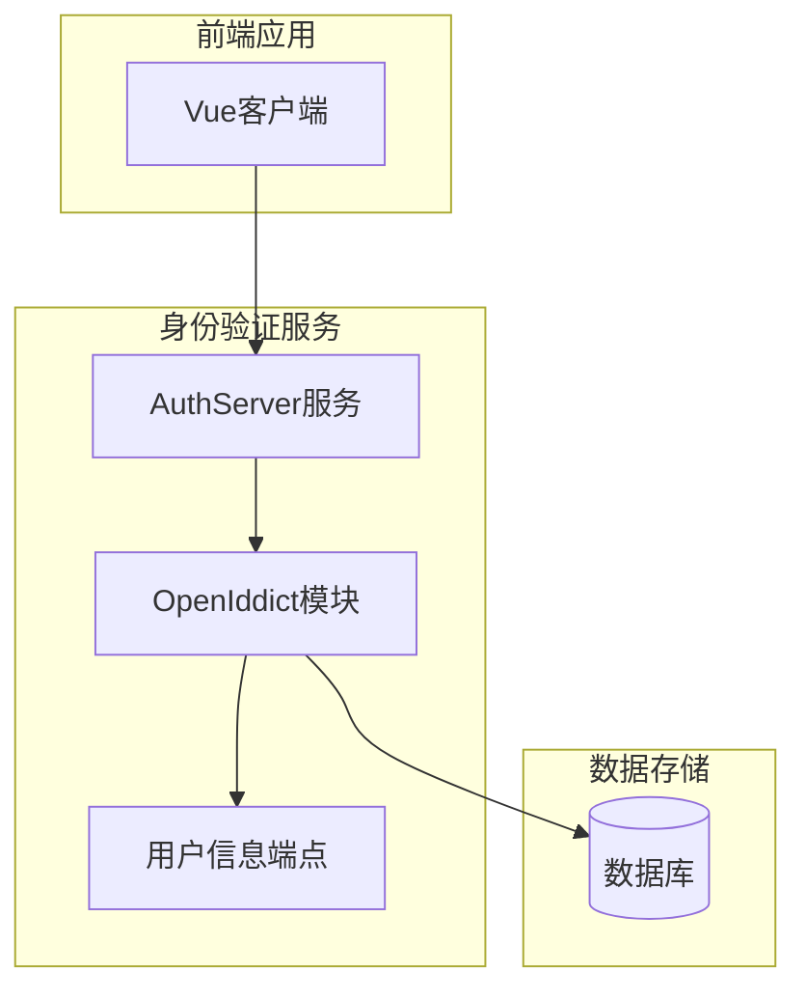
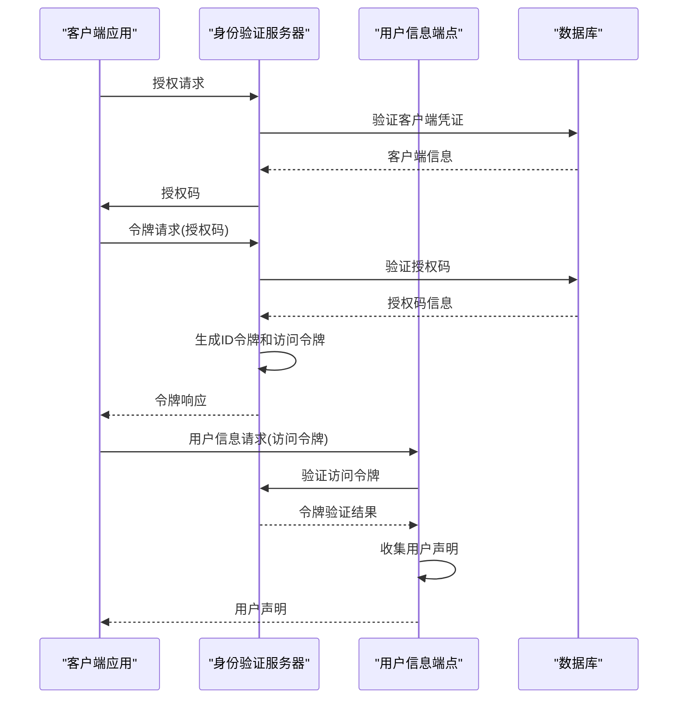
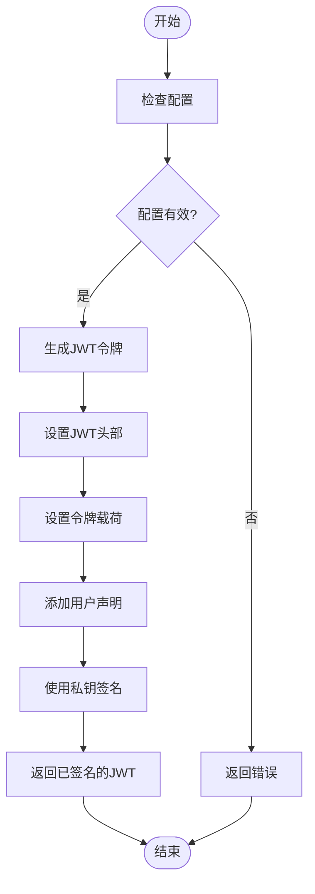
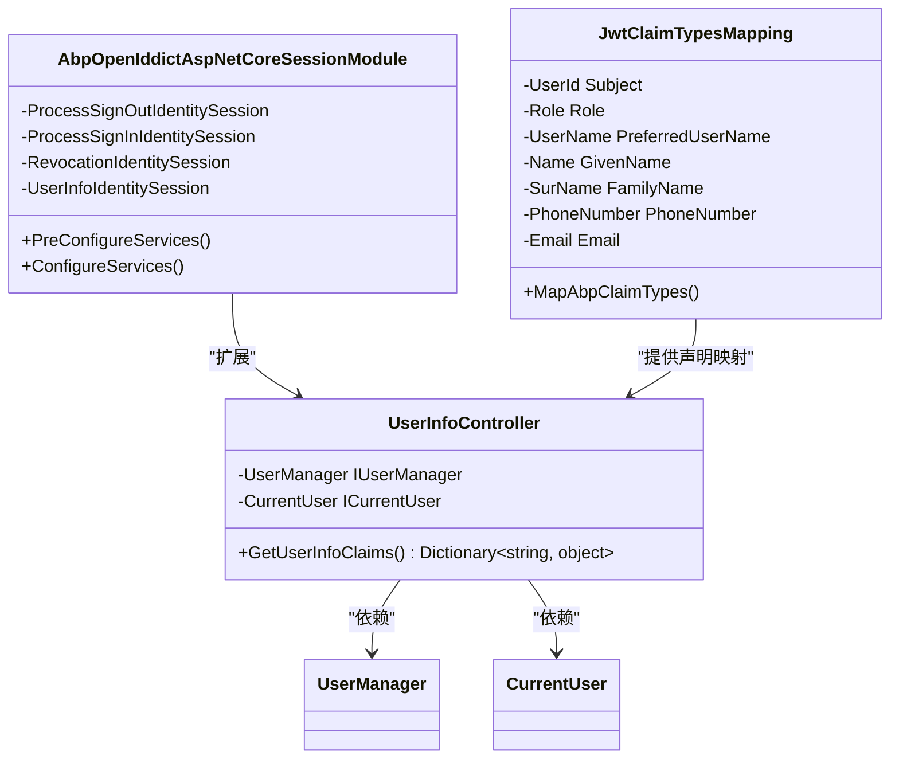
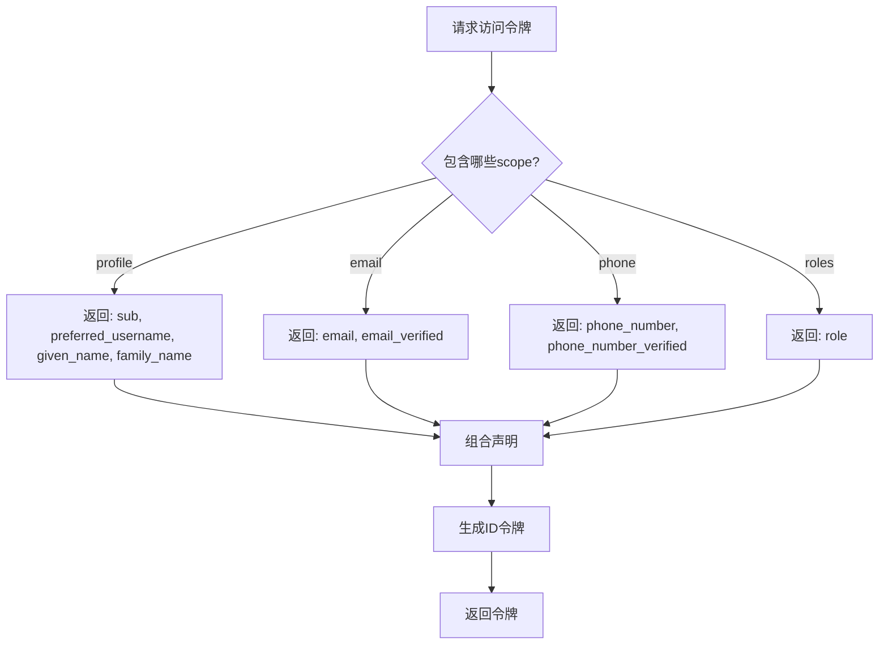
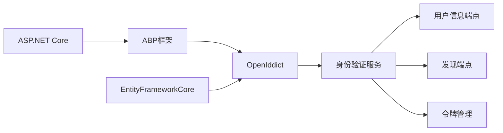

# OpenID Connect实现

<cite>
**本文档引用的文件**
- [AuthServerModule.Configure.cs](file://aspnet-core/services/LY.MicroService.AuthServer/AuthServerModule.Configure.cs)
- [UserInfoController.cs](file://aspnet-core/modules/openIddict/LINGYUN.Abp.OpenIddict.AspNetCore/LINGYUN/Abp/OpenIddict/AspNetCore/Controllers/UserInfoController.cs)
- [JwtClaimTypesMapping.cs](file://aspnet-core/framework/security/LINGYUN.Abp.Claims.Mapping/LINGYUN/Abp/Claims/Mapping/JwtClaimTypesMapping.cs)
- [IdentityServerDataSeedContributor.cs](file://aspnet-core/migrations/LY.MicroService.IdentityServer.EntityFrameworkCore/DataSeeder/IdentityServerDataSeedContributor.cs)
- [AbpOpenIddictAspNetCoreSessionModule.cs](file://aspnet-core/modules/openIddict/LINGYUN.Abp.OpenIddict.AspNetCore.Session/LINGYUN/Abp/OpenIddict/AspNetCore/Session/AbpOpenIddictAspNetCoreSessionModule.cs)
</cite>

## 目录
1. [简介](#简介)
2. [项目结构](#项目结构)
3. [核心组件](#核心组件)
4. [架构概述](#架构概述)
5. [详细组件分析](#详细组件分析)
6. [依赖分析](#依赖分析)
7. [性能考虑](#性能考虑)
8. [故障排除指南](#故障排除指南)
9. [结论](#结论)

## 简介
本项目基于ABP框架实现了OpenID Connect身份验证协议，提供了完整的身份认证和授权功能。系统使用OpenIddict作为OpenID Connect服务器实现，支持标准的OAuth 2.0和OpenID Connect流程。通过配置化的客户端管理和灵活的声明处理机制，系统能够为各种应用程序提供安全的身份验证服务。

## 项目结构
该项目采用模块化设计，将OpenID Connect相关功能分布在多个模块中。核心身份验证功能由AuthServer服务提供，而OpenID Connect的具体实现则分布在openIddict模块中。数据持久化通过EntityFrameworkCore实现，配置信息存储在数据库中。



**图示来源**
- [AuthServerModule.Configure.cs](file://aspnet-core/services/LY.MicroService.AuthServer/AuthServerModule.Configure.cs)
- [UserInfoController.cs](file://aspnet-core/modules/openIddict/LINGYUN.Abp.OpenIddict.AspNetCore/LINGYUN/Abp/OpenIddict/AspNetCore/Controllers/UserInfoController.cs)

**章节来源**
- [AuthServerModule.Configure.cs](file://aspnet-core/services/LY.MicroService.AuthServer/AuthServerModule.Configure.cs)
- [project_structure](file://project_structure)

## 核心组件
项目中的OpenID Connect实现包含几个关键组件：身份验证服务器配置、用户信息端点、发现端点、令牌生成与验证以及声明映射机制。这些组件协同工作，提供完整的身份验证和授权服务。

**章节来源**
- [AuthServerModule.Configure.cs](file://aspnet-core/services/LY.MicroService.AuthServer/AuthServerModule.Configure.cs)
- [IdentityServerDataSeedContributor.cs](file://aspnet-core/migrations/LY.MicroService.IdentityServer.EntityFrameworkCore/DataSeeder/IdentityServerDataSeedContributor.cs)

## 架构概述
系统的OpenID Connect架构基于ABP框架和OpenIddict库构建。身份验证服务器处理所有身份验证请求，包括授权码流程、隐式流程和密码流程。用户信息端点根据访问令牌返回用户声明，而发现端点提供服务器元数据。



**图示来源**
- [AuthServerModule.Configure.cs](file://aspnet-core/services/LY.MicroService.AuthServer/AuthServerModule.Configure.cs)
- [UserInfoController.cs](file://aspnet-core/modules/openIddict/LINGYUN.Abp.OpenIddict.AspNetCore/LINGYUN/Abp/OpenIddict/AspNetCore/Controllers/UserInfoController.cs)

## 详细组件分析

### ID令牌生成与验证
系统使用OpenIddict库生成符合OpenID Connect规范的ID令牌。ID令牌是JWT格式的JSON Web令牌，包含用户身份信息和令牌元数据。令牌的生命周期可以通过配置进行管理，包括身份令牌、访问令牌和刷新令牌的有效期。



**图示来源**
- [AuthServerModule.Configure.cs](file://aspnet-core/services/LY.MicroService.AuthServer/AuthServerModule.Configure.cs)
- [JwtClaimTypesMapping.cs](file://aspnet-core/framework/security/LINGYUN.Abp.Claims.Mapping/LINGYUN/Abp/Claims/Mapping/JwtClaimTypesMapping.cs)

**章节来源**
- [AuthServerModule.Configure.cs](file://aspnet-core/services/LY.MicroService.AuthServer/AuthServerModule.Configure.cs)
- [JwtClaimTypesMapping.cs](file://aspnet-core/framework/security/LINGYUN.Abp.Claims.Mapping/LINGYUN/Abp/Claims/Mapping/JwtClaimTypesMapping.cs)

### 用户信息端点和发现端点配置
用户信息端点（UserInfo Endpoint）是OpenID Connect的核心组件之一，用于在获得访问令牌后获取用户的基本信息。发现端点（Discovery Endpoint）提供服务器的元数据，包括支持的范围、端点URL和其他配置信息。



**图示来源**
- [UserInfoController.cs](file://aspnet-core/modules/openIddict/LINGYUN.Abp.OpenIddict.AspNetCore/LINGYUN/Abp/OpenIddict/AspNetCore/Controllers/UserInfoController.cs)
- [AbpOpenIddictAspNetCoreSessionModule.cs](file://aspnet-core/modules/openIddict/LINGYUN.Abp.OpenIddict.AspNetCore.Session/LINGYUN/Abp/OpenIddict/AspNetCore/Session/AbpOpenIddictAspNetCoreSessionModule.cs)
- [JwtClaimTypesMapping.cs](file://aspnet-core/framework/security/LINGYUN.Abp.Claims.Mapping/LINGYUN/Abp/Claims/Mapping/JwtClaimTypesMapping.cs)

**章节来源**
- [UserInfoController.cs](file://aspnet-core/modules/openIddict/LINGYUN.Abp.OpenIddict.AspNetCore/LINGYUN/Abp/OpenIddict/AspNetCore/Controllers/UserInfoController.cs)
- [AbpOpenIddictAspNetCoreSessionModule.cs](file://aspnet-core/modules/openIddict/LINGYUN.Abp.OpenIddict.AspNetCore.Session/LINGYUN/Abp/OpenIddict/AspNetCore/Session/AbpOpenIddictAspNetCoreSessionModule.cs)

### 身份声明映射和处理机制
系统实现了灵活的声明映射机制，将ABP框架的内部声明类型映射到标准的JWT声明类型。这种映射确保了与其他系统的兼容性，同时保持了ABP框架的内部一致性。

```mermaid
erDiagram
USER_CLAIMS {
string Type PK
string Value
}
SCOPE {
string Name PK
string Description
}
USER_CLAIMS ||--o{ SCOPE : "属于"
USER_CLAIMS {
"sub" "Subject"
"preferred_username" "Username"
"given_name" "Given Name"
"family_name" "Family Name"
"email" "Email"
"phone_number" "Phone Number"
"role" "Roles"
}
SCOPE {
"profile" "Profile Information"
"email" "Email Information"
"phone" "Phone Information"
"roles" "Role Information"
}
```

**图示来源**
- [JwtClaimTypesMapping.cs](file://aspnet-core/framework/security/LINGYUN.Abp.Claims.Mapping/LINGYUN/Abp/Claims/Mapping/JwtClaimTypesMapping.cs)
- [UserInfoController.cs](file://aspnet-core/modules/openIddict/LINGYUN.Abp.OpenIddict.AspNetCore/LINGYUN/Abp/OpenIddict/AspNetCore/Controllers/UserInfoController.cs)

**章节来源**
- [JwtClaimTypesMapping.cs](file://aspnet-core/framework/security/LINGYUN.Abp.Claims.Mapping/LINGYUN/Abp/Claims/Mapping/JwtClaimTypesMapping.cs)
- [UserInfoController.cs](file://aspnet-core/modules/openIddict/LINGYUN.Abp.OpenIddict.AspNetCore/LINGYUN/Abp/OpenIddict/AspNetCore/Controllers/UserInfoController.cs)

### 自定义ID令牌声明
系统支持自定义ID令牌中的声明，允许开发者根据业务需求添加特定的用户信息。通过配置不同的作用域（scope），可以控制返回给客户端的用户信息范围。



**图示来源**
- [UserInfoController.cs](file://aspnet-core/modules/openIddict/LINGYUN.Abp.OpenIddict.AspNetCore/LINGYUN/Abp/OpenIddict/AspNetCore/Controllers/UserInfoController.cs)
- [JwtClaimTypesMapping.cs](file://aspnet-core/framework/security/LINGYUN.Abp.Claims.Mapping/LINGYUN/Abp/Claims/Mapping/JwtClaimTypesMapping.cs)

**章节来源**
- [UserInfoController.cs](file://aspnet-core/modules/openIddict/LINGYUN.Abp.OpenIddict.AspNetCore/LINGYUN/Abp/OpenIddict/AspNetCore/Controllers/UserInfoController.cs)

## 依赖分析
系统的主要依赖包括ABP框架、OpenIddict库和EntityFrameworkCore。ABP框架提供了基础架构和服务，OpenIddict实现了OpenID Connect协议，而EntityFrameworkCore负责数据持久化。



**图示来源**
- [AuthServerModule.Configure.cs](file://aspnet-core/services/LY.MicroService.AuthServer/AuthServerModule.Configure.cs)
- [project_structure](file://project_structure)

**章节来源**
- [AuthServerModule.Configure.cs](file://aspnet-core/services/LY.MicroService.AuthServer/AuthServerModule.Configure.cs)

## 性能考虑
在高并发场景下，频繁的令牌验证可能成为性能瓶颈。建议使用缓存机制来存储已验证的令牌信息，并合理设置令牌有效期以平衡安全性和性能。此外，数据库查询优化对于提高整体系统性能至关重要。

## 故障排除指南
常见问题包括令牌验证失败、客户端配置错误和跨域资源共享(CORS)问题。检查日志文件可以帮助诊断这些问题。确保客户端ID和密钥正确配置，并且回调URL与注册的URL完全匹配。

**章节来源**
- [AuthServerModule.Configure.cs](file://aspnet-core/services/LY.MicroService.AuthServer/AuthServerModule.Configure.cs)
- [UserInfoController.cs](file://aspnet-core/modules/openIddict/LINGYUN.Abp.OpenIddict.AspNetCore/LINGYUN/Abp/OpenIddict/AspNetCore/Controllers/UserInfoController.cs)

## 结论
该项目提供了一个完整且可扩展的OpenID Connect实现，基于ABP框架和OpenIddict库。通过模块化设计和灵活的配置选项，系统能够满足各种身份验证需求。未来可以进一步增强安全性特性，如多因素认证和风险自适应认证。