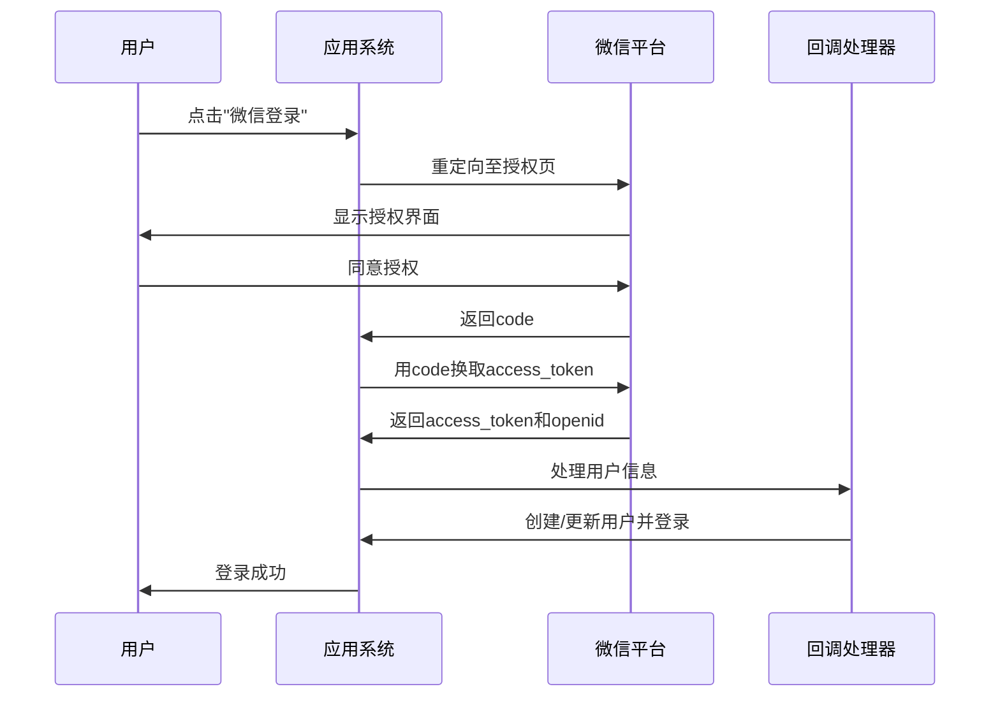
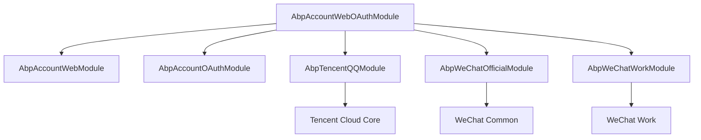

# 第三方身份提供商集成

<cite>
**本文档中引用的文件**  
- [AbpAuthenticationWeChatConsts.cs](file://aspnet-core/framework/authentication/LINGYUN.Abp.Authentication.WeChat/LINGYUN/Abp/Authentication/WeChat/AbpAuthenticationWeChatConsts.cs)
- [AbpAccountWebOAuthModule.cs](file://aspnet-core/modules/account/LINGYUN.Abp.Account.Web.OAuth/AbpAccountWebOAuthModule.cs)
- [WeChatAuthHandlerOptionsProvider.cs](file://aspnet-core/modules/account/LINGYUN.Abp.Account.Web.OAuth/ExternalProviders/WeChat/WeChatAuthHandlerOptionsProvider.cs)
- [QQAuthHandlerOptionsProvider.cs](file://aspnet-core/modules/account/LINGYUN.Abp.Account.Web.OAuth/ExternalProviders/QQ/QQAuthHandlerOptionsProvider.cs)
- [WeChatOfficialSettingNames.cs](file://aspnet-core/framework/wechat/LINGYUN.Abp.WeChat.Official/LINGYUN/Abp/WeChat/Official/Settings/WeChatOfficialSettingNames.cs)
- [TencentQQSettingNames.cs](file://aspnet-core/framework/cloud-tencent/LINGYUN.Abp.Tencent.QQ/LINGYUN/Abp/Tencent/QQ/Settings/TencentQQSettingNames.cs)
- [WeChatSettingAppService.cs](file://aspnet-core/framework/wechat/LINGYUN.Abp.WeChat.SettingManagement/LINGYUN/Abp/WeChat/SettingManagement/WeChatSettingAppService.cs)
- [AbpWeChatOfficialOptions.cs](file://aspnet-core/framework/wechat/LINGYUN.Abp.WeChat.Official/LINGYUN/Abp/WeChat/Official/AbpWeChatOfficialOptions.cs)
- [AbpTencentQQOptions.cs](file://aspnet-core/framework/cloud-tencent/LINGYUN.Abp.Tencent.QQ/LINGYUN/Abp/Tencent/QQ/AbpTencentQQOptions.cs)
- [WeChatOfficialOAuthHandler.cs](file://aspnet-core/framework/authentication/LINGYUN.Abp.Authentication.WeChat/Microsoft/AspNetCore/Authentication/WeChat/Official/WeChatOfficialOAuthHandler.cs)
</cite>

## 目录
1. [简介](#简介)
2. [项目结构](#项目结构)
3. [核心组件](#核心组件)
4. [配置客户端ID、密钥和回调URL](#配置客户端id密钥和回调url)
5. [OAuth代理实现机制](#oauth代理实现机制)
6. [第三方令牌获取与用户信息同步](#第三方令牌获取与用户信息同步)
7. [常见问题解决方案](#常见问题解决方案)

## 简介
本文档详细说明了如何在ABP框架中集成微信、QQ等第三方身份提供商。内容涵盖配置客户端ID、密钥和回调URL的步骤，解释OAuth代理的实现机制，以及如何处理第三方令牌的获取和用户信息的同步。通过具体的代码示例和配置文件片段，展示集成过程中的关键步骤。

## 项目结构
该项目基于ABP（ASP.NET Boilerplate）框架构建，支持模块化开发。主要目录包括：
- `aspnet-core`：包含核心框架和模块。
- `framework`：提供基础功能如认证、授权、日志等。
- `modules`：业务模块，如账户管理、审计日志等。
- `services`：微服务实现。
- `deploy`：部署相关脚本和配置。

### 认证模块结构
```
aspnet-core/
├── framework/
│   ├── authentication/
│   │   ├── LINGYUN.Abp.Authentication.QQ/
│   │   └── LINGYUN.Abp.Authentication.WeChat/
│   ├── wechat/
│   │   ├── LINGYUN.Abp.WeChat.Official/
│   │   └── LINGYUN.Abp.WeChat.Work/
│   └── cloud-tencent/
│       └── LINGYUN.Abp.Tencent.QQ/
└── modules/
    └── account/
        └── LINGYUN.Abp.Account.Web.OAuth/
```

**Diagram sources**
- [AbpAuthenticationWeChatConsts.cs](file://aspnet-core/framework/authentication/LINGYUN.Abp.Authentication.WeChat/LINGYUN/Abp/Authentication/WeChat/AbpAuthenticationWeChatConsts.cs)
- [AbpAccountWebOAuthModule.cs](file://aspnet-core/modules/account/LINGYUN.Abp.Account.Web.OAuth/AbpAccountWebOAuthModule.cs)

**Section sources**
- [AbpAuthenticationWeChatConsts.cs](file://aspnet-core/framework/authentication/LINGYUN.Abp.Authentication.WeChat/LINGYUN/Abp/Authentication/WeChat/AbpAuthenticationWeChatConsts.cs)
- [AbpAccountWebOAuthModule.cs](file://aspnet-core/modules/account/LINGYUN.Abp.Account.Web.OAuth/AbpAccountWebOAuthModule.cs)

## 核心组件
系统通过多个模块协同工作来实现第三方身份验证：

1. **Abp.Authentication 模块**：负责注册第三方认证处理器。
2. **WeChat 和 QQ 模块**：封装各自平台的API调用逻辑。
3. **Account.Web.OAuth 模块**：提供OAuth外部登录服务接口。
4. **SettingManagement 模块**：管理第三方应用的配置参数。

这些组件共同构成了一个可扩展的身份验证体系。

**Section sources**
- [AbpAccountWebOAuthModule.cs](file://aspnet-core/modules/account/LINGYUN.Abp.Account.Web.OAuth/AbpAccountWebOAuthModule.cs)
- [WeChatAuthHandlerOptionsProvider.cs](file://aspnet-core/modules/account/LINGYUN.Abp.Account.Web.OAuth/ExternalProviders/WeChat/WeChatAuthHandlerOptionsProvider.cs)
- [QQAuthHandlerOptionsProvider.cs](file://aspnet-core/modules/account/LINGYUN.Abp.Account.Web.OAuth/ExternalProviders/QQ/QQAuthHandlerOptionsProvider.cs)

## 配置客户端ID、密钥和回调URL
### 微信公众号配置
微信认证需要以下设置项：

| 配置项 | 描述 | 是否加密 |
|--------|------|---------|
| `WeChat.Official.AppId` | 公众号AppId | 否 |
| `WeChat.Official.AppSecret` | 公众号AppSecret | 是 |
| `WeChat.Official.Url` | 服务器消息URL | 否 |
| `WeChat.Official.Token` | 消息校验Token | 是 |
| `WeChat.Official.EncodingAESKey` | 消息加解密密钥 | 是 |

这些配置定义在 `WeChatOfficialSettingNames.cs` 中，并通过 `WeChatSettingAppService` 提供管理界面。

### QQ互联配置
QQ登录所需配置如下：

| 配置项 | 描述 | 是否加密 |
|--------|------|---------|
| `Abp.TencentCloud.QQConnect.AppId` | QQ互联AppId | 否 |
| `Abp.TencentCloud.QQConnect.AppKey` | QQ互联AppKey | 是 |
| `Abp.TencentCloud.QQConnect.IsMobile` | 是否移动端样式 | 否 |

配置名称定义于 `TencentQQSettingNames.cs`，由 `TencentCloudSettingAppService` 管理。

### 回调URL设置
不同平台使用不同的回调路径：
- 微信：`/signin-wechat`
- 企业微信：`/signin-wxwork`
- QQ：默认使用标准OAuth回调机制

这些常量定义在各自的 `Consts` 类中，例如 `AbpAuthenticationWeChatConsts.CallbackPath`。

**Section sources**
- [WeChatOfficialSettingNames.cs](file://aspnet-core/framework/wechat/LINGYUN.Abp.WeChat.Official/LINGYUN/Abp/WeChat/Official/Settings/WeChatOfficialSettingNames.cs)
- [TencentQQSettingNames.cs](file://aspnet-core/framework/cloud-tencent/LINGYUN.Abp.Tencent.QQ/LINGYUN/Abp/Tencent/QQ/Settings/TencentQQSettingNames.cs)
- [WeChatSettingAppService.cs](file://aspnet-core/framework/wechat/LINGYUN.Abp.WeChat.SettingManagement/LINGYUN/Abp/WeChat/SettingManagement/WeChatSettingAppService.cs)

## OAuth代理实现机制
### 认证流程概述


**Diagram sources**
- [WeChatOfficialOAuthHandler.cs](file://aspnet-core/framework/authentication/LINGYUN.Abp.Authentication.WeChat/Microsoft/AspNetCore/Authentication/WeChat/Official/WeChatOfficialOAuthHandler.cs)
- [AbpAuthenticationWeChatConsts.cs](file://aspnet-core/framework/authentication/LINGYUN.Abp.Authentication.WeChat/LINGYUN/Abp/Authentication/WeChat/AbpAuthenticationWeChatConsts.cs)

### 模块依赖关系


**Diagram sources**
- [AbpAccountWebOAuthModule.cs](file://aspnet-core/modules/account/LINGYUN.Abp.Account.Web.OAuth/AbpAccountWebOAuthModule.cs)

### 认证选项工厂模式
系统采用选项工厂模式动态加载配置：

```csharp
public class AbpWeChatOfficialOptionsFactory : ITransientDependency
{
    protected IOptions<AbpWeChatOfficialOptions> Options { get; }

    public AbpWeChatOfficialOptionsFactory(IOptions<AbpWeChatOfficialOptions> options)
    {
        Options = options;
    }

    public async virtual Task<AbpWeChatOfficialOptions> CreateAsync()
    {
        await Options.SetAsync(); // 从配置源异步加载
        return Options.Value;
    }
}
```

该模式确保每次请求都能获取最新的配置值，支持多租户环境下的差异化配置。

**Section sources**
- [AbpWeChatOfficialOptions.cs](file://aspnet-core/framework/wechat/LINGYUN.Abp.WeChat.Official/LINGYUN/Abp/WeChat/Official/AbpWeChatOfficialOptions.cs)
- [AbpTencentQQOptions.cs](file://aspnet-core/framework/cloud-tencent/LINGYUN.Abp.Tencent.QQ/LINGYUN/Abp/Tencent/QQ/AbpTencentQQOptions.cs)
- [AbpWeChatOfficialOptionsFactory.cs](file://aspnet-core/framework/wechat/LINGYUN.Abp.WeChat.Official/LINGYUN/Abp/WeChat/Official/AbpWeChatOfficialOptionsFactory.cs)

## 第三方令牌获取与用户信息同步
### 令牌获取流程
当用户完成授权后，系统通过以下步骤获取访问令牌：

1. 接收微信返回的临时授权码（code）
2. 调用微信API `/sns/oauth2/access_token` 换取access_token
3. 使用access_token调用 `/sns/userinfo` 获取用户基本信息

对应端点定义在 `AbpAuthenticationWeChatConsts` 中：
- TokenEndpoint: `https://api.weixin.qq.com/sns/oauth2/access_token`
- UserInfoEndpoint: `https://api.weixin.qq.com/sns/userinfo`

### 用户信息同步策略
系统通过Claims机制将第三方用户信息映射到本地账户：

```csharp
protected override async Task<AuthenticationTicket> CreateTicketAsync(
    ClaimsIdentity identity, 
    AuthenticationProperties properties, 
    OAuthTokenResponse tokens)
{
    var userInfo = await GetUserInfoAsync(tokens.AccessToken);
    
    identity.AddClaim(new Claim("wechat.openid", userInfo.OpenId));
    identity.AddClaim(new Claim("wechat.nickname", userInfo.NickName));
    identity.AddClaim(new Claim("wechat.headimgurl", userInfo.HeadImgUrl));
    
    return new AuthenticationTicket(new ClaimsPrincipal(identity), properties, Scheme.Name);
}
```

此过程在 `WeChatOfficialOAuthHandler` 中实现，确保用户信息被正确提取并附加到身份声明中。

### 特性控制与权限检查
系统使用特性（Feature）控制系统功能开关：

```csharp
if (await FeatureChecker.IsEnabledAsync(WeChatOfficialFeatures.Enable) &&
    await PermissionChecker.IsGrantedAsync(WeChatSettingPermissionNames.Official))
{
    // 允许配置微信公众号相关设置
}
```

这种双重检查机制既支持按需启用功能，又保证了安全访问控制。

**Section sources**
- [WeChatOfficialOAuthHandler.cs](file://aspnet-core/framework/authentication/LINGYUN.Abp.Authentication.WeChat/Microsoft/AspNetCore/Authentication/WeChat/Official/WeChatOfficialOAuthHandler.cs)
- [WeChatSettingAppService.cs](file://aspnet-core/framework/wechat/LINGYUN.Abp.WeChat.SettingManagement/LINGYUN/Abp/WeChat/SettingManagement/WeChatSettingAppService.cs)
- [WeChatOfficialFeatureDefinitionProvider.cs](file://aspnet-core/framework/wechat/LINGYUN.Abp.WeChat.Official/LINGYUN/Abp/WeChat/Official/Features/WeChatOfficialFeatureDefinitionProvider.cs)

## 常见问题解决方案
### 配置未生效
**问题描述**：修改AppId或AppSecret后仍无法登录。

**解决方案**：
1. 确认配置已保存至数据库或配置文件
2. 检查是否启用了正确的特性开关
3. 清除浏览器缓存或尝试无痕模式
4. 查看日志确认配置加载情况

### 回调地址不匹配
**问题描述**：微信提示"redirect_uri域名与后台配置不符"。

**解决方案**：
1. 登录微信公众平台，在"开发"->"基本配置"中核对"授权回调域"
2. 确保回调域名与实际部署环境一致
3. 不要包含协议头（http:// 或 https://）

### 消息签名验证失败
**问题描述**：服务器收到消息但验证签名失败。

**解决方案**：
1. 确认Token配置正确且前后端一致
2. 检查服务器时间是否准确（误差应在5分钟内）
3. 验证EncodingAESKey格式是否正确

### 多租户配置隔离
系统通过 `TenantSettingValueProvider` 实现租户级配置隔离，确保各租户拥有独立的第三方应用凭证。

**Section sources**
- [WeChatSettingAppService.cs](file://aspnet-core/framework/wechat/LINGYUN.Abp.WeChat.SettingManagement/LINGYUN/Abp/WeChat/SettingManagement/WeChatSettingAppService.cs)
- [WeChatOfficialSettingDefinitionProvider.cs](file://aspnet-core/framework/wechat/LINGYUN.Abp.WeChat.Official/LINGYUN/Abp/WeChat/Official/Settings/WeChatOfficialSettingDefinitionProvider.cs)