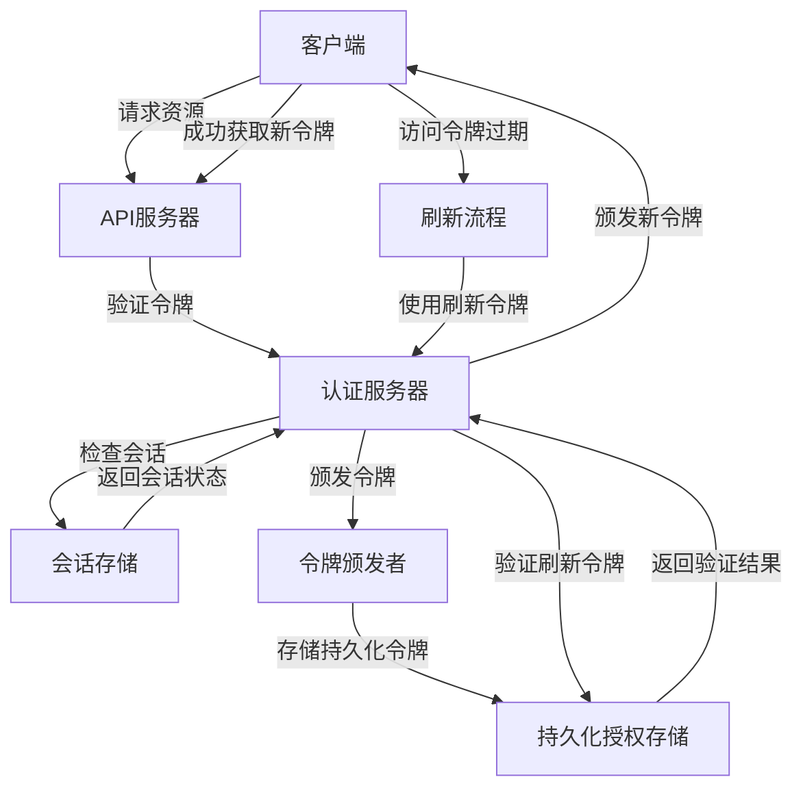
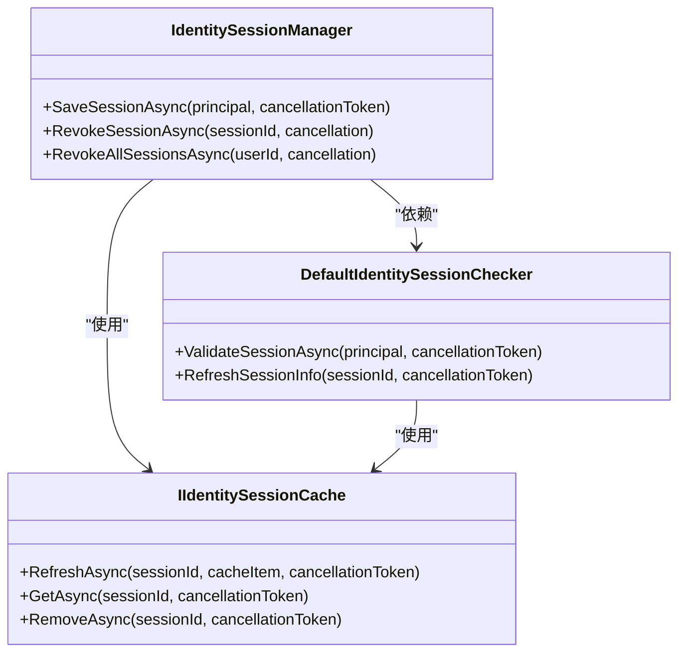
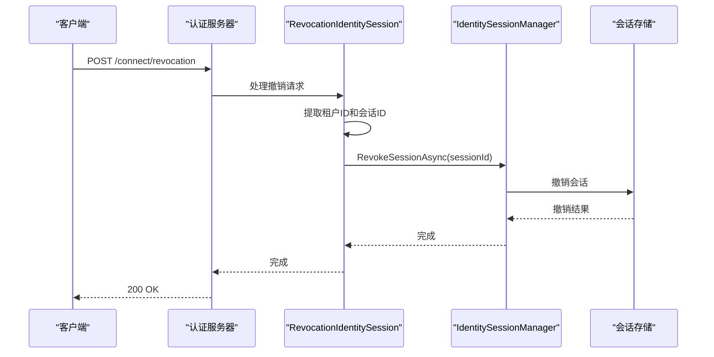
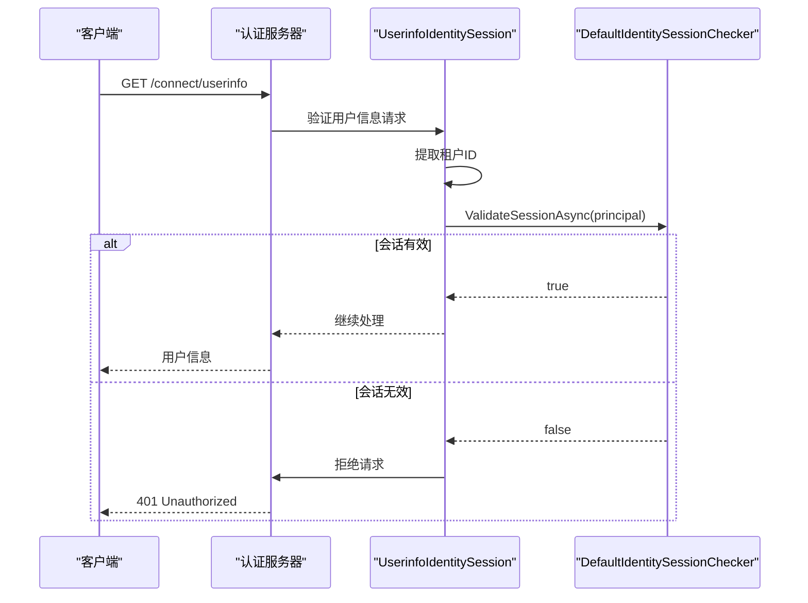
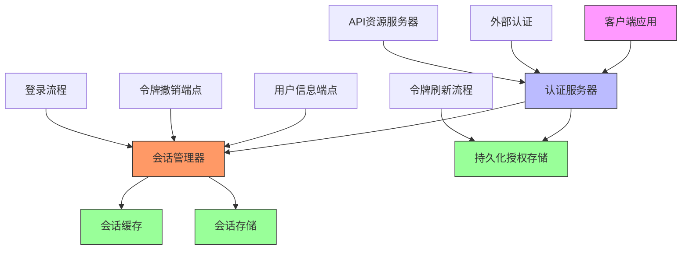

# 令牌刷新

<cite>
**本文档中引用的文件**   
- [DefaultIdentitySessionChecker.cs](file://aspnet-core\modules\identity\LINGYUN.Abp.Identity.Session\LINGYUN\Abp\Identity\Session\DefaultIdentitySessionChecker.cs)
- [RevocationIdentitySession.cs](file://aspnet-core\modules\openIddict\LINGYUN.Abp.OpenIddict.AspNetCore.Session\LINGYUN\Abp\OpenIddict\AspNetCore\Session\RevocationIdentitySession.cs)
- [UserinfoIdentitySession.cs](file://aspnet-core\modules\openIddict\LINGYUN.Abp.OpenIddict.AspNetCore.Session\LINGYUN\Abp\OpenIddict\AspNetCore\Session\UserinfoIdentitySession.cs)
- [ProcessSignInIdentitySession.cs](file://aspnet-core\modules\openIddict\LINGYUN.Abp.OpenIddict.AspNetCore.Session\LINGYUN\Abp\OpenIddict\AspNetCore\Session\ProcessSignInIdentitySession.cs)
- [AuthServerModule.Configure.cs](file://aspnet-core\services\LY.MicroService.AuthServer\AuthServerModule.Configure.cs)
- [appsettings.json](file://aspnet-core\services\LY.MicroService.AuthServer\appsettings.json)
- [WeChatOfficialOAuthHandler.cs](file://aspnet-core\framework\authentication\LINGYUN.Abp.Authentication.WeChat\Microsoft\AspNetCore\Authentication\WeChat\Official\WeChatOfficialOAuthHandler.cs)
- [WeChatWorkOAuthHandler.cs](file://aspnet-core\framework\wechat\LINGYUN.Abp.WeChat.Work.AspNetCore\Microsoft\AspNetCore\Authentication\WeChat\Work\WeChatWorkOAuthHandler.cs)
- [PersistedGrantDto.cs](file://aspnet-core\modules\identityServer\LINGYUN.Abp.IdentityServer.Application.Contracts\LINGYUN\Abp\IdentityServer\Grants\Dto\PersistedGrantDto.cs)
- [IdentitySessionManager.cs](file://aspnet-core\modules\identity\LINGYUN.Abp.Identity.Domain\LINGYUN\Abp\Identity\Session\IdentitySessionManager.cs)
</cite>

## 目录
1. [简介](#简介)
2. [核心组件](#核心组件)
3. [架构概述](#架构概述)
4. [详细组件分析](#详细组件分析)
5. [依赖关系分析](#依赖关系分析)
6. [性能考虑](#性能考虑)
7. [故障排除指南](#故障排除指南)
8. [结论](#结论)

## 简介
本项目中的令牌刷新机制基于ABP框架和OpenIddict实现，提供了一套完整的身份验证和会话管理解决方案。系统通过访问令牌（Access Token）和刷新令牌（Refresh Token）的组合来实现安全的身份验证流程。当访问令牌过期时，客户端可以使用刷新令牌获取新的访问令牌，而无需用户重新登录。该机制结合了会话管理、令牌存储和撤销功能，确保了系统的安全性和用户体验。

## 核心组件

令牌刷新机制的核心组件包括会话管理器、令牌处理器和配置服务。`IdentitySessionManager`负责管理用户会话的创建、验证和撤销；`RevocationIdentitySession`处理令牌撤销请求并终止相关用户会话；`ProcessSignInIdentitySession`在用户登录时保存会话信息；`UserinfoIdentitySession`在用户信息请求时验证会话有效性。这些组件协同工作，确保令牌刷新过程的安全性和可靠性。

**Section sources**
- [IdentitySessionManager.cs](file://aspnet-core\modules\identity\LINGYUN.Abp.Identity.Domain\LINGYUN\Abp\Identity\Session\IdentitySessionManager.cs#L62-L102)
- [RevocationIdentitySession.cs](file://aspnet-core\modules\openIddict\LINGYUN.Abp.OpenIddict.AspNetCore.Session\LINGYUN\Abp\OpenIddict\AspNetCore\Session\RevocationIdentitySession.cs#L0-L44)
- [ProcessSignInIdentitySession.cs](file://aspnet-core\modules\openIddict\LINGYUN.Abp.OpenIddict.AspNetCore.Session\LINGYUN\Abp\OpenIddict\AspNetCore\Session\ProcessSignInIdentitySession.cs#L27-L38)
- [UserinfoIdentitySession.cs](file://aspnet-core\modules\openIddict\LINGYUN.Abp.OpenIddict.AspNetCore.Session\LINGYUN\Abp\OpenIddict\AspNetCore\Session\UserinfoIdentitySession.cs#L29-L47)

## 架构概述

**Diagram sources **
- [RevocationIdentitySession.cs](file://aspnet-core\modules\openIddict\LINGYUN.Abp.OpenIddict.AspNetCore.Session\LINGYUN\Abp\OpenIddict\AspNetCore\Session\RevocationIdentitySession.cs)
- [ProcessSignInIdentitySession.cs](file://aspnet-core\modules\openIddict\LINGYUN.Abp.OpenIddict.AspNetCore.Session\LINGYUN\Abp\OpenIddict\AspNetCore\Session\ProcessSignInIdentitySession.cs)
- [UserinfoIdentitySession.cs](file://aspnet-core\modules\openIddict\LINGYUN.Abp.OpenIddict.AspNetCore.Session\LINGYUN\Abp\OpenIddict\AspNetCore\Session\UserinfoIdentitySession.cs)

## 详细组件分析

### 会话管理组件分析

#### 会话验证与刷新

**Diagram sources **
- [IdentitySessionManager.cs](file://aspnet-core\modules\identity\LINGYUN.Abp.Identity.Domain\LINGYUN\Abp\Identity\Session\IdentitySessionManager.cs#L62-L102)
- [DefaultIdentitySessionChecker.cs](file://aspnet-core\modules\identity\LINGYUN.Abp.Identity.Session\LINGYUN\Abp\Identity\Session\DefaultIdentitySessionChecker.cs#L63-L89)
- [IIdentitySessionCache.cs](file://aspnet-core\modules\identity\LINGYUN.Abp.Identity.Session\LINGYUN\Abp\Identity\Session\IIdentitySessionCache.cs#L0-L11)

#### 令牌撤销流程

**Diagram sources **
- [RevocationIdentitySession.cs](file://aspnet-core\modules\openIddict\LINGYUN.Abp.OpenIddict.AspNetCore.Session\LINGYUN\Abp\OpenIddict\AspNetCore\Session\RevocationIdentitySession.cs#L30-L44)
- [IdentitySessionManager.cs](file://aspnet-core\modules\identity\LINGYUN.Abp.Identity.Domain\LINGYUN\Abp\Identity\Session\IdentitySessionManager.cs#L62-L102)

#### 用户信息请求验证流程

**Diagram sources **
- [UserinfoIdentitySession.cs](file://aspnet-core\modules\openIddict\LINGYUN.Abp.OpenIddict.AspNetCore.Session\LINGYUN\Abp\OpenIddict\AspNetCore\Session\UserinfoIdentitySession.cs#L29-L47)
- [DefaultIdentitySessionChecker.cs](file://aspnet-core\modules\identity\LINGYUN.Abp.Identity.Session\LINGYUN\Abp\Identity\Session\DefaultIdentitySessionChecker.cs#L63-L89)

**Section sources**
- [RevocationIdentitySession.cs](file://aspnet-core\modules\openIddict\LINGYUN.Abp.OpenIddict.AspNetCore.Session\LINGYUN\Abp\OpenIddict\AspNetCore\Session\RevocationIdentitySession.cs#L0-L44)
- [UserinfoIdentitySession.cs](file://aspnet-core\modules\openIddict\LINGYUN.Abp.OpenIddict.AspNetCore.Session\LINGYUN\Abp\OpenIddict\AspNetCore\Session\UserinfoIdentitySession.cs#L29-L47)
- [DefaultIdentitySessionChecker.cs](file://aspnet-core\modules\identity\LINGYUN.Abp.Identity.Session\LINGYUN\Abp\Identity\Session\DefaultIdentitySessionChecker.cs#L63-L89)

## 依赖关系分析

**Diagram sources **
- [IdentitySessionManager.cs](file://aspnet-core\modules\identity\LINGYUN.Abp.Identity.Domain\LINGYUN\Abp\Identity\Session\IdentitySessionManager.cs#L62-L102)
- [RevocationIdentitySession.cs](file://aspnet-core\modules\openIddict\LINGYUN.Abp.OpenIddict.AspNetCore.Session\LINGYUN\Abp\OpenIddict\AspNetCore\Session\RevocationIdentitySession.cs#L0-L44)
- [UserinfoIdentitySession.cs](file://aspnet-core\modules\openIddict\LINGYUN.Abp.OpenIddict.AspNetCore.Session\LINGYUN\Abp\OpenIddict\AspNetCore\Session\UserinfoIdentitySession.cs#L29-L47)

**Section sources**
- [IdentitySessionManager.cs](file://aspnet-core\modules\identity\LINGYUN.Abp.Identity.Domain\LINGYUN\Abp\Identity\Session\IdentitySessionManager.cs#L62-L102)
- [RevocationIdentitySession.cs](file://aspnet-core\modules\openIddict\LINGYUN.Abp.OpenIddict.AspNetCore.Session\LINGYUN\Abp\OpenIddict\AspNetCore\Session\RevocationIdentitySession.cs#L0-L44)
- [UserinfoIdentitySession.cs](file://aspnet-core\modules\openIddict\LINGYUN.Abp.OpenIddict.AspNetCore.Session\LINGYUN\Abp\OpenIddict\AspNetCore\Session\UserinfoIdentitySession.cs#L29-L47)

## 性能考虑

令牌刷新机制在设计时考虑了性能优化。会话信息被缓存在Redis等分布式缓存中，减少了数据库查询的频率。`DefaultIdentitySessionChecker`中的`KeepAccessTimeSpan`和`SessionSyncTimeSpan`配置项避免了频繁更新持久化设施，提高了系统响应速度。同时，通过异步操作和任务并行处理，确保了高并发场景下的性能表现。建议根据实际负载情况调整缓存过期时间和同步间隔，以达到最佳性能平衡。

## 故障排除指南

当遇到令牌刷新问题时，首先检查日志中的错误信息。常见的问题包括：刷新令牌已过期、会话已被撤销、客户端凭证无效等。可以通过以下步骤进行排查：
1. 检查`appsettings.json`中的令牌生命周期配置是否正确
2. 验证客户端应用是否有正确的权限和范围
3. 确认用户会话是否仍然有效
4. 检查网络连接和认证服务器状态
5. 查看日志中是否有相关的安全警告或错误

对于会话相关的问题，可以使用`IPersistedGrantAppService`接口查询和管理持久化授权，帮助诊断和解决问题。

**Section sources**
- [appsettings.json](file://aspnet-core\services\LY.MicroService.AuthServer\appsettings.json#L0-L94)
- [PersistedGrantDto.cs](file://aspnet-core\modules\identityServer\LINGYUN.Abp.IdentityServer.Application.Contracts\LINGYUN\Abp\IdentityServer\Grants\Dto\PersistedGrantDto.cs#L0-L26)
- [IPersistedGrantAppService.cs](file://aspnet-core\modules\identityServer\LINGYUN.Abp.IdentityServer.Application.Contracts\LINGYUN\Abp\IdentityServer\Grants\IPersistedGrantAppService.cs#L0-L10)

## 结论

本项目的令牌刷新机制提供了一套完整、安全且高效的用户身份验证解决方案。通过结合ABP框架和OpenIddict，实现了会话管理、令牌颁发、验证和撤销的完整生命周期管理。系统支持多种认证方式，并提供了灵活的配置选项，可以根据具体需求调整令牌生命周期和安全策略。建议在生产环境中启用HTTPS，合理设置令牌过期时间，并定期审查和更新安全配置，以确保系统的安全性。