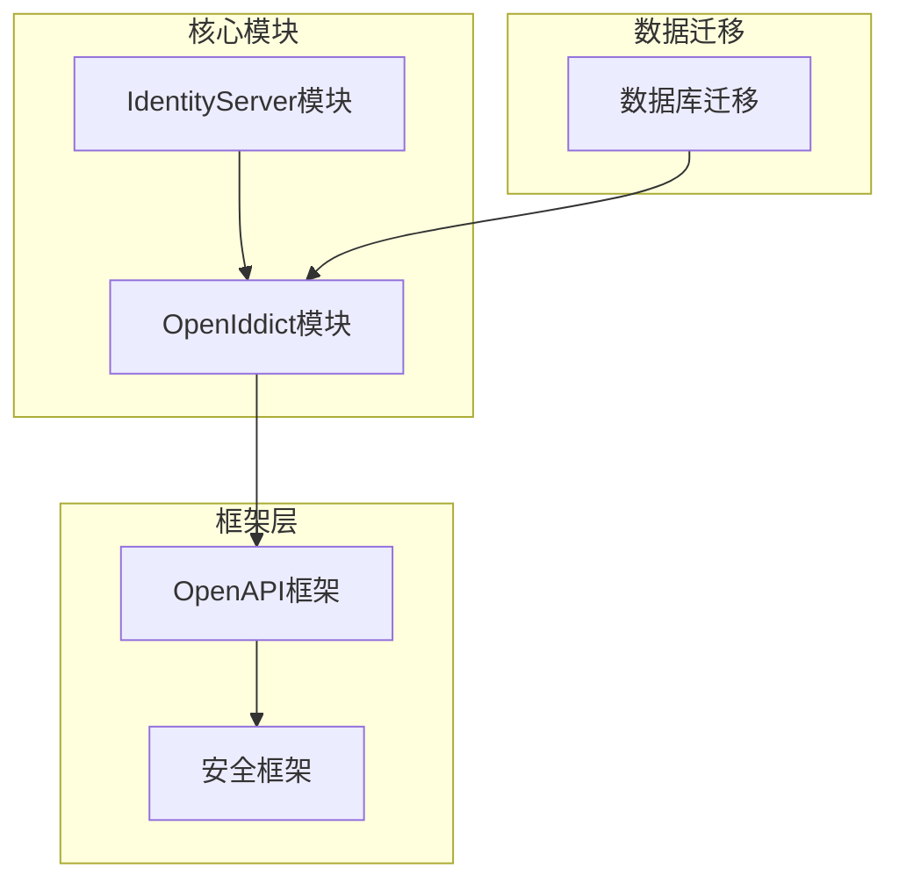
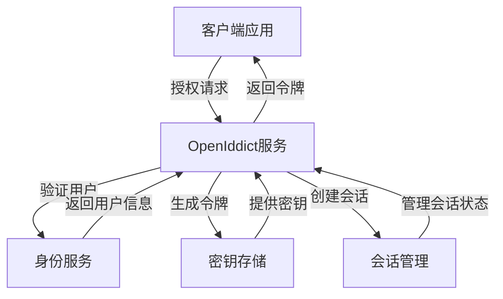
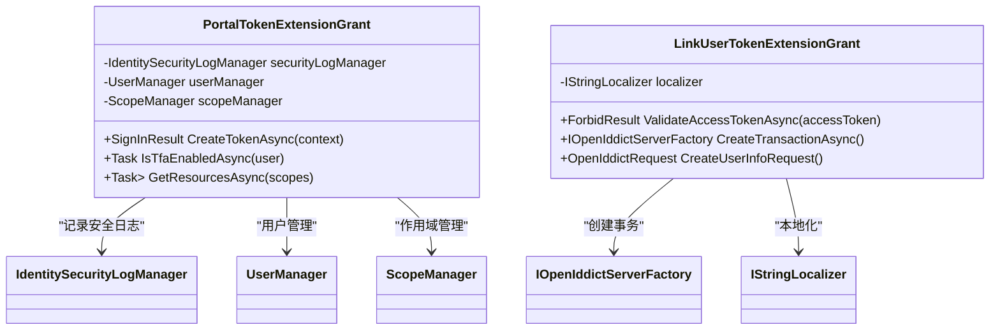
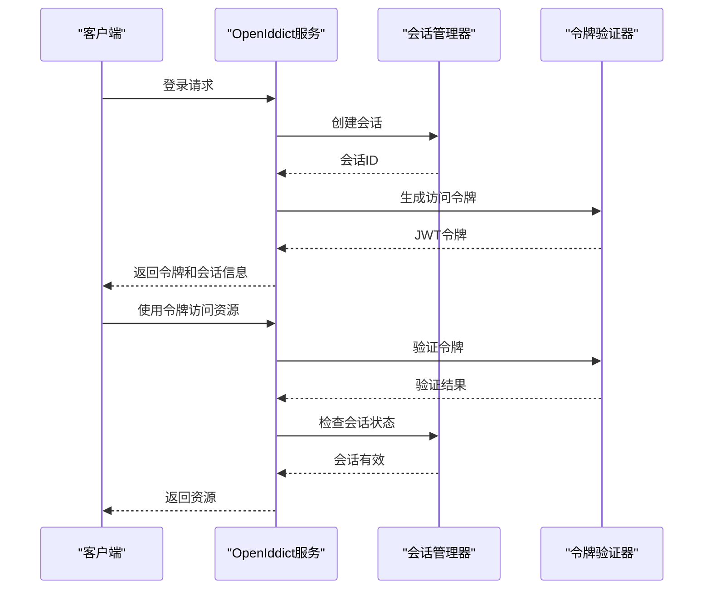
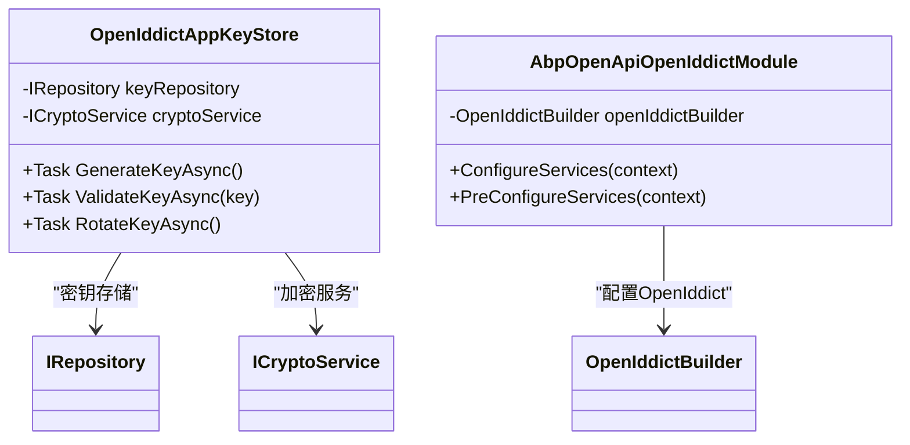
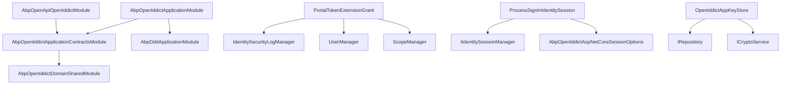

# 令牌生成

<cite>
**本文档中引用的文件**  
- [AbpOpenIddictApplicationModule.cs](file://aspnet-core/modules/openIddict/LINGYUN.Abp.OpenIddict.Application/LINGYUN/Abp/OpenIddict/AbpOpenIddictApplicationModule.cs)
- [AbpOpenIddictApplicationContractsModule.cs](file://aspnet-core/modules/openIddict/LINGYUN.Abp.OpenIddict.Application.Contracts/LINGYUN/Abp/OpenIddict/AbpOpenIddictApplicationContractsModule.cs)
- [PortalTokenExtensionGrant.cs](file://aspnet-core/modules/openIddict/LINGYUN.Abp.OpenIddict.Portal/LINGYUN/Abp/OpenIddict/Portal/PortalTokenExtensionGrant.cs)
- [LinkUserTokenExtensionGrant.cs](file://aspnet-core/modules/openIddict/LINGYUN.Abp.OpenIddict.LinkUser/LINGYUN/Abp/OpenIddict/LinkUser/LinkUserTokenExtensionGrant.cs)
- [ProcessSignInIdentitySession.cs](file://aspnet-core/modules/openIddict/LINGYUN.Abp.OpenIddict.AspNetCore.Session/LINGYUN/Abp/OpenIddict/AspNetCore/Session/ProcessSignInIdentitySession.cs)
- [AbpOpenApiOpenIddictModule.cs](file://aspnet-core/framework/open-api/LINGYUN.Abp.OpenApi.OpenIddict/LINGYUN/Abp/OpenApi/OpenIddict/AbpOpenApiOpenIddictModule.cs)
- [OpenIddictAppKeyStore.cs](file://aspnet-core/framework/open-api/LINGYUN.Abp.OpenApi.OpenIddict/LINGYUN/Abp/OpenApi/OpenIddict/OpenIddictAppKeyStore.cs)
- [AbpIdentitySessionUserInfoRequestValidator.cs](file://aspnet-core/modules/identityServer/LINGYUN.Abp.IdentityServer.Session/LINGYUN/Abp/IdentityServer/Session/AbpIdentitySessionUserInfoRequestValidator.cs)
- [SingleMigrationsDbContextModelSnapshot.cs](file://aspnet-core/migrations/LY.MicroService.Applications.Single.EntityFrameworkCore.PostgreSql/Migrations/SingleMigrationsDbContextModelSnapshot.cs)
- [20231016100545_Add-Field-With-Text-Template-Definition.Designer.cs](file://aspnet-core/migrations/LY.MicroService.Applications.Single.EntityFrameworkCore.MySql/Migrations/20231016100545_Add-Field-With-Text-Template-Definition.Designer.cs)
</cite>

## 目录
1. [简介](#简介)
2. [项目结构](#项目结构)
3. [核心组件](#核心组件)
4. [架构概述](#架构概述)
5. [详细组件分析](#详细组件分析)
6. [依赖分析](#依赖分析)
7. [性能考虑](#性能考虑)
8. [故障排除指南](#故障排除指南)
9. [结论](#结论)
10. [附录](#附录)（如有必要）

## 简介
本文档深入探讨了ABP Next Admin项目中的令牌生成机制，重点分析基于OpenIddict和IdentityServer的JWT令牌创建流程。文档详细解释了声明（claims）的组成、签名算法的选择与配置、令牌有效期设置，以及访问令牌、刷新令牌和ID令牌的生成条件和触发时机。同时，文档还涵盖了密钥管理策略和微服务架构下的令牌一致性保障机制。

## 项目结构
该项目采用模块化设计，基于ASP.NET Core构建，使用OpenIddict作为OAuth 2.0和OpenID Connect的实现框架。身份验证和令牌生成的核心逻辑分布在`openIddict`和`identityServer`模块中。

**图示来源**
- [AbpOpenIddictApplicationModule.cs](file://aspnet-core/modules/openIddict/LINGYUN.Abp.OpenIddict.Application/LINGYUN/Abp/OpenIddict/AbpOpenIddictApplicationModule.cs)
- [AbpOpenApiOpenIddictModule.cs](file://aspnet-core/framework/open-api/LINGYUN.Abp.OpenApi.OpenIddict/LINGYUN/Abp/OpenApi/OpenIddict/AbpOpenApiOpenIddictModule.cs)

**本节来源**
- [AbpOpenIddictApplicationModule.cs](file://aspnet-core/modules/openIddict/LINGYUN.Abp.OpenIddict.Application/LINGYUN/Abp/OpenIddict/AbpOpenIddictApplicationModule.cs)
- [AbpOpenApiOpenIddictModule.cs](file://aspnet-core/framework/open-api/LINGYUN.Abp.OpenApi.OpenIddict/LINGYUN/Abp/OpenApi/OpenIddict/AbpOpenApiOpenIddictModule.cs)

## 核心组件
系统的核心令牌生成组件包括OpenIddict服务、身份会话管理器和密钥存储机制。这些组件协同工作，确保令牌的安全生成和验证。

**本节来源**
- [AbpOpenIddictApplicationModule.cs](file://aspnet-core/modules/openIddict/LINGYUN.Abp.OpenIddict.Application/LINGYUN/Abp/OpenIddict/AbpOpenIddictApplicationModule.cs)
- [OpenIddictAppKeyStore.cs](file://aspnet-core/framework/open-api/LINGYUN.Abp.OpenApi.OpenIddict/LINGYUN/Abp/OpenApi/OpenIddict/OpenIddictAppKeyStore.cs)

## 架构概述
系统采用分层架构，将令牌生成逻辑与业务逻辑分离。OpenIddict处理标准的OAuth 2.0和OpenID Connect协议，而自定义模块则扩展了特定的令牌颁发逻辑。

**图示来源**
- [PortalTokenExtensionGrant.cs](file://aspnet-core/modules/openIddict/LINGYUN.Abp.OpenIddict.Portal/LINGYUN/Abp/OpenIddict/Portal/PortalTokenExtensionGrant.cs)
- [ProcessSignInIdentitySession.cs](file://aspnet-core/modules/openIddict/LINGYUN.Abp.OpenIddict.AspNetCore.Session/LINGYUN/Abp/OpenIddict/AspNetCore/Session/ProcessSignInIdentitySession.cs)

## 详细组件分析
本节深入分析令牌生成的关键组件，包括自定义令牌授予类型、会话管理和密钥存储。

### 自定义令牌授予分析
系统实现了自定义的令牌授予类型，允许通过扩展机制颁发特定用途的令牌。

#### 自定义令牌授予类

**图示来源**
- [PortalTokenExtensionGrant.cs](file://aspnet-core/modules/openIddict/LINGYUN.Abp.OpenIddict.Portal/LINGYUN/Abp/OpenIddict/Portal/PortalTokenExtensionGrant.cs)
- [LinkUserTokenExtensionGrant.cs](file://aspnet-core/modules/openIddict/LINGYUN.Abp.OpenIddict.LinkUser/LINGYUN/Abp/OpenIddict/LinkUser/LinkUserTokenExtensionGrant.cs)

**本节来源**
- [PortalTokenExtensionGrant.cs](file://aspnet-core/modules/openIddict/LINGYUN.Abp.OpenIddict.Portal/LINGYUN/Abp/OpenIddict/Portal/PortalTokenExtensionGrant.cs)
- [LinkUserTokenExtensionGrant.cs](file://aspnet-core/modules/openIddict/LINGYUN.Abp.OpenIddict.LinkUser/LINGYUN/Abp/OpenIddict/LinkUser/LinkUserTokenExtensionGrant.cs)

### 会话管理分析
系统实现了基于身份的会话管理，确保令牌生成和验证过程中的会话一致性。

#### 会话管理流程

**图示来源**
- [ProcessSignInIdentitySession.cs](file://aspnet-core/modules/openIddict/LINGYUN.Abp.OpenIddict.AspNetCore.Session/LINGYUN/Abp/OpenIddict/AspNetCore/Session/ProcessSignInIdentitySession.cs)
- [AbpIdentitySessionUserInfoRequestValidator.cs](file://aspnet-core/modules/identityServer/LINGYUN.Abp.IdentityServer.Session/LINGYUN/Abp/IdentityServer/Session/AbpIdentitySessionUserInfoRequestValidator.cs)

**本节来源**
- [ProcessSignInIdentitySession.cs](file://aspnet-core/modules/openIddict/LINGYUN.Abp.OpenIddict.AspNetCore.Session/LINGYUN/Abp/OpenIddict/AspNetCore/Session/ProcessSignInIdentitySession.cs)
- [AbpIdentitySessionUserInfoRequestValidator.cs](file://aspnet-core/modules/identityServer/LINGYUN.Abp.IdentityServer.Session/LINGYUN/Abp/IdentityServer/Session/AbpIdentitySessionUserInfoRequestValidator.cs)

### 密钥管理分析
系统通过密钥存储机制管理用于令牌签名的加密密钥，确保令牌的安全性。

#### 密钥管理类图

**图示来源**
- [OpenIddictAppKeyStore.cs](file://aspnet-core/framework/open-api/LINGYUN.Abp.OpenApi.OpenIddict/LINGYUN/Abp/OpenApi/OpenIddict/OpenIddictAppKeyStore.cs)
- [AbpOpenApiOpenIddictModule.cs](file://aspnet-core/framework/open-api/LINGYUN.Abp.OpenApi.OpenIddict/LINGYUN/Abp/OpenApi/OpenIddict/AbpOpenApiOpenIddictModule.cs)

**本节来源**
- [OpenIddictAppKeyStore.cs](file://aspnet-core/framework/open-api/LINGYUN.Abp.OpenApi.OpenIddict/LINGYUN/Abp/OpenApi/OpenIddict/OpenIddictAppKeyStore.cs)
- [AbpOpenApiOpenIddictModule.cs](file://aspnet-core/framework/open-api/LINGYUN.Abp.OpenApi.OpenIddict/LINGYUN/Abp/OpenApi/OpenIddict/AbpOpenApiOpenIddictModule.cs)

## 依赖分析
系统各组件之间存在明确的依赖关系，确保了令牌生成机制的模块化和可扩展性。

**图示来源**
- [AbpOpenIddictApplicationModule.cs](file://aspnet-core/modules/openIddict/LINGYUN.Abp.OpenIddict.Application/LINGYUN/Abp/OpenIddict/AbpOpenIddictApplicationModule.cs)
- [AbpOpenIddictApplicationContractsModule.cs](file://aspnet-core/modules/openIddict/LINGYUN.Abp.OpenIddict.Application.Contracts/LINGYUN/Abp/OpenIddict/AbpOpenIddictApplicationContractsModule.cs)

**本节来源**
- [AbpOpenIddictApplicationModule.cs](file://aspnet-core/modules/openIddict/LINGYUN.Abp.OpenIddict.Application/LINGYUN/Abp/OpenIddict/AbpOpenIddictApplicationModule.cs)
- [AbpOpenIddictApplicationContractsModule.cs](file://aspnet-core/modules/openIddict/LINGYUN.Abp.OpenIddict.Application.Contracts/LINGYUN/Abp/OpenIddict/AbpOpenIddictApplicationContractsModule.cs)

## 性能考虑
在微服务架构中，令牌生成和验证需要考虑性能和可扩展性。系统通过缓存机制和异步处理来优化性能，确保在高并发场景下的响应速度。

## 故障排除指南
当令牌生成出现问题时，应首先检查密钥配置、会话状态和数据库连接。日志记录是诊断问题的关键，特别是安全日志和身份验证日志。

**本节来源**
- [PortalTokenExtensionGrant.cs](file://aspnet-core/modules/openIddict/LINGYUN.Abp.OpenIddict.Portal/LINGYUN/Abp/OpenIddict/Portal/PortalTokenExtensionGrant.cs)
- [AbpIdentitySessionUserInfoRequestValidator.cs](file://aspnet-core/modules/identityServer/LINGYUN.Abp.IdentityServer.Session/LINGYUN/Abp/IdentityServer/Session/AbpIdentitySessionUserInfoRequestValidator.cs)

## 结论
ABP Next Admin项目通过OpenIddict实现了安全、灵活的令牌生成机制。系统支持自定义令牌授予类型、会话管理和密钥轮换，满足了现代微服务架构的安全需求。通过模块化设计，系统易于扩展和维护。

## 附录
### 令牌配置参数
| 参数 | 描述 | 默认值 | 来源 |
|------|------|--------|------|
| IdentityTokenLifetime | ID令牌有效期（秒） | 3600 | [SingleMigrationsDbContextModelSnapshot.cs](file://aspnet-core/migrations/LY.MicroService.Applications.Single.EntityFrameworkCore.PostgreSql/Migrations/SingleMigrationsDbContextModelSnapshot.cs) |
| EnableLocalLogin | 是否启用本地登录 | true | [20231016100545_Add-Field-With-Text-Template-Definition.Designer.cs](file://aspnet-core/migrations/LY.MicroService.Applications.Single.EntityFrameworkCore.MySql/Migrations/20231016100545_Add-Field-With-Text-Template-Definition.Designer.cs) |
| IncludeJwtId | 是否包含JWT ID | false | [20231016100545_Add-Field-With-Text-Template-Definition.Designer.cs](file://aspnet-core/migrations/LY.MicroService.Applications.Single.EntityFrameworkCore.MySql/Migrations/20231016100545_Add-Field-With-Text-Template-Definition.Designer.cs) |