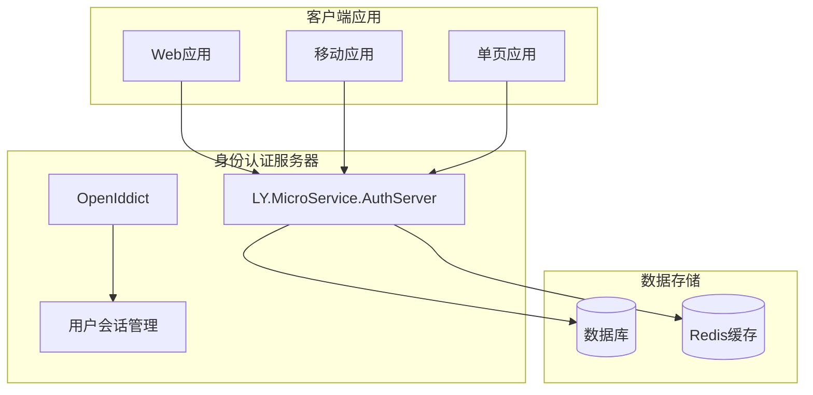
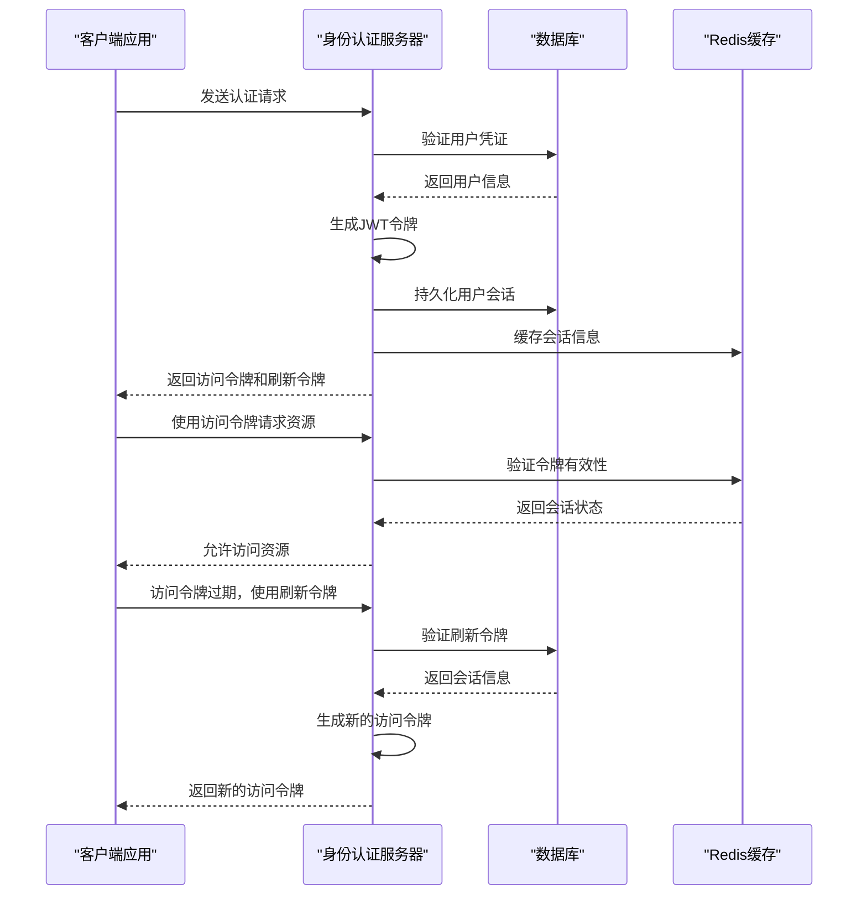
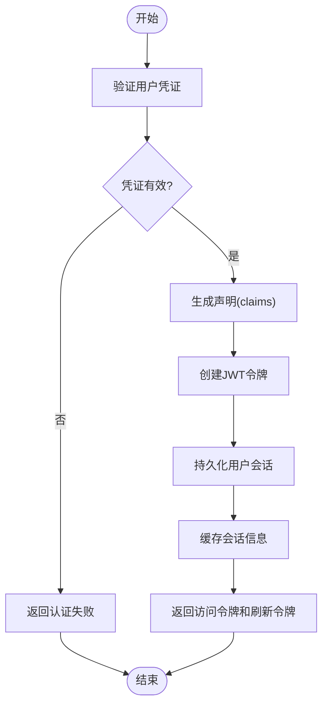

# 令牌管理

<cite>
**本文档中引用的文件**  
- [AuthServerModule.Configure.cs](file://aspnet-core/services/LY.MicroService.AuthServer/AuthServerModule.Configure.cs)
- [appsettings.json](file://aspnet-core/services/LY.MicroService.AuthServer/appsettings.json)
- [OpenIddictApplicationTokenLifetimeConsts.cs](file://aspnet-core/modules/openIddict/LINGYUN.Abp.OpenIddict.Application.Contracts/LINGYUN/Abp/OpenIddict/Applications/OpenIddictApplicationTokenLifetimeConsts.cs)
- [OpenIddictApplicationSettingsDto.cs](file://aspnet-core/modules/openIddict/LINGYUN.Abp.OpenIddict.Application.Contracts/LINGYUN/Abp/OpenIddict/Applications/OpenIddictApplicationSettingsDto.cs)
- [ProcessSignInIdentitySession.cs](file://aspnet-core/modules/openIddict/LINGYUN.Abp.OpenIddict.AspNetCore.Session/LINGYUN/Abp/OpenIddict/AspNetCore/Session/ProcessSignInIdentitySession.cs)
- [UserinfoIdentitySession.cs](file://aspnet-core/modules/openIddict/LINGYUN.Abp.OpenIddict.AspNetCore.Session/LINGYUN/Abp/OpenIddict/AspNetCore/Session/UserinfoIdentitySession.cs)
- [20231012032107_Initial-Single-Project.Designer.cs](file://aspnet-core/migrations/LY.MicroService.Applications.Single.EntityFrameworkCore.MySql/Migrations/20231012032107_Initial-Single-Project.Designer.cs)
</cite>

## 目录
1. [简介](#简介)
2. [项目结构](#项目结构)
3. [核心组件](#核心组件)
4. [架构概述](#架构概述)
5. [详细组件分析](#详细组件分析)
6. [依赖分析](#依赖分析)
7. [性能考虑](#性能考虑)
8. [故障排除指南](#故障排除指南)
9. [结论](#结论)
10. [附录](#附录)（如有必要）

## 简介
本文档详细阐述了基于OpenIddict的身份认证服务器中的令牌管理机制。文档深入解释了JWT令牌的生成、验证和刷新机制，详细描述了访问令牌、刷新令牌和ID令牌的生命周期管理。同时说明了令牌的签名算法、加密方式和安全存储策略，以及令牌撤销机制和黑名单管理。提供了关于令牌过期处理、续期流程和安全最佳实践的指导，并包含配置示例展示如何自定义令牌参数。

## 项目结构
该项目是一个基于ABP框架的微服务架构，使用OpenIddict作为身份认证和授权服务器。令牌管理的核心功能位于`LY.MicroService.AuthServer`服务中，该服务负责处理OAuth 2.0和OpenID Connect协议的令牌发放、验证和管理。



**图示来源**
- [AuthServerModule.Configure.cs](file://aspnet-core/services/LY.MicroService.AuthServer/AuthServerModule.Configure.cs#L364-L391)
- [ProcessSignInIdentitySession.cs](file://aspnet-core/modules/openIddict/LINGYUN.Abp.OpenIddict.AspNetCore.Session/LINGYUN/Abp/OpenIddict/AspNetCore/Session/ProcessSignInIdentitySession.cs#L1-L29)

**本节来源**
- [AuthServerModule.Configure.cs](file://aspnet-core/services/LY.MicroService.AuthServer/AuthServerModule.Configure.cs#L364-L391)
- [appsettings.json](file://aspnet-core/services/LY.MicroService.AuthServer/appsettings.json#L0-L94)

## 核心组件
令牌管理的核心组件包括OpenIddict服务器、用户会话管理器和令牌生命周期配置。OpenIddict负责实现OAuth 2.0和OpenID Connect协议，处理令牌的生成和验证。用户会话管理器负责持久化用户登录状态，确保会话的安全性和有效性。令牌生命周期配置允许管理员自定义各种令牌的有效期。

**本节来源**
- [AuthServerModule.Configure.cs](file://aspnet-core/services/LY.MicroService.AuthServer/AuthServerModule.Configure.cs#L364-L391)
- [OpenIddictApplicationSettingsDto.cs](file://aspnet-core/modules/openIddict/LINGYUN.Abp.OpenIddict.Application.Contracts/LINGYUN/Abp/OpenIddict/Applications/OpenIddictApplicationSettingsDto.cs#L0-L4)

## 架构概述
系统采用微服务架构，身份认证服务器作为独立的服务运行，为其他微服务提供统一的身份认证和授权功能。令牌管理采用JWT（JSON Web Token）标准，通过非对称加密算法确保令牌的安全性。用户会话信息被持久化到数据库中，同时使用Redis进行缓存以提高性能。



**图示来源**
- [AuthServerModule.Configure.cs](file://aspnet-core/services/LY.MicroService.AuthServer/AuthServerModule.Configure.cs#L364-L391)
- [ProcessSignInIdentitySession.cs](file://aspnet-core/modules/openIddict/LINGYUN.Abp.OpenIddict.AspNetCore.Session/LINGYUN/Abp/OpenIddict/AspNetCore/Session/ProcessSignInIdentitySession.cs#L1-L29)

## 详细组件分析

### 令牌生成与验证分析
令牌生成与验证是身份认证服务器的核心功能。系统使用OpenIddict框架实现OAuth 2.0和OpenID Connect协议，通过非对称加密算法（如RSA）对JWT令牌进行签名，确保令牌的完整性和防篡改性。

#### 令牌生成流程


**图示来源**
- [AuthServerModule.Configure.cs](file://aspnet-core/services/LY.MicroService.AuthServer/AuthServerModule.Configure.cs#L364-L391)
- [ProcessSignInIdentitySession.cs](file://aspnet-core/modules/openIddict/LINGYUN.Abp.OpenIddict.AspNetCore.Session/LINGYUN/Abp/OpenIddict/AspNetCore/Session/ProcessSignInIdentitySession.cs#L1-L29)

#### 令牌验证流程
```mermaid
classDiagram
    class TokenValidator {
        +