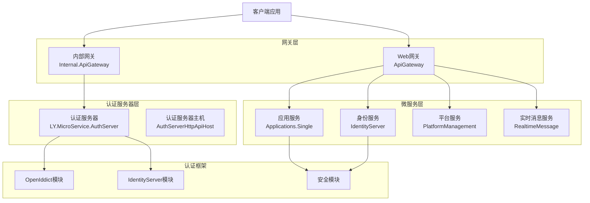
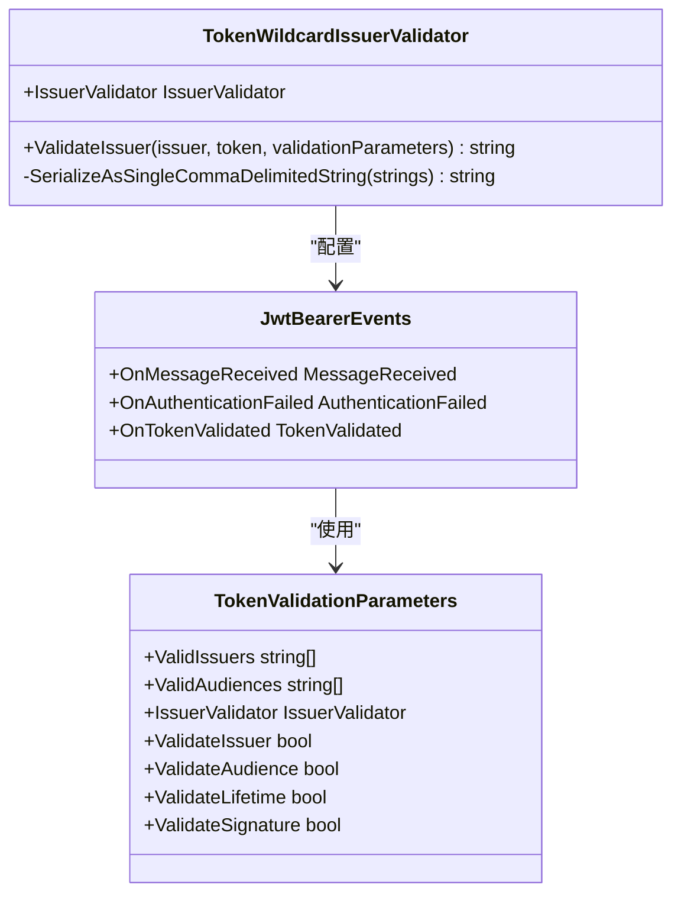
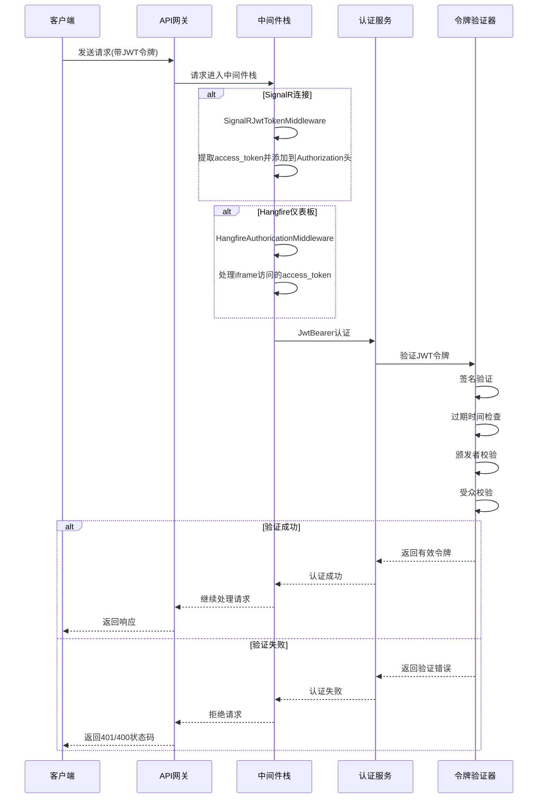
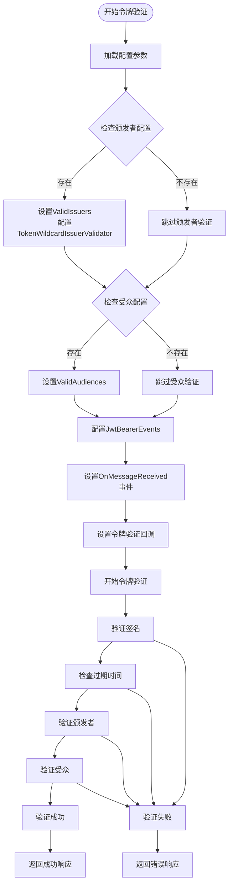
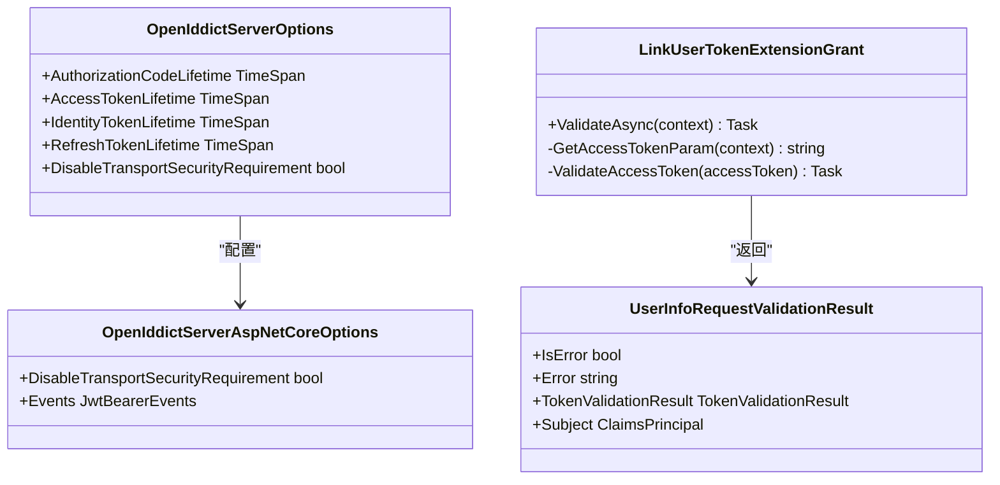
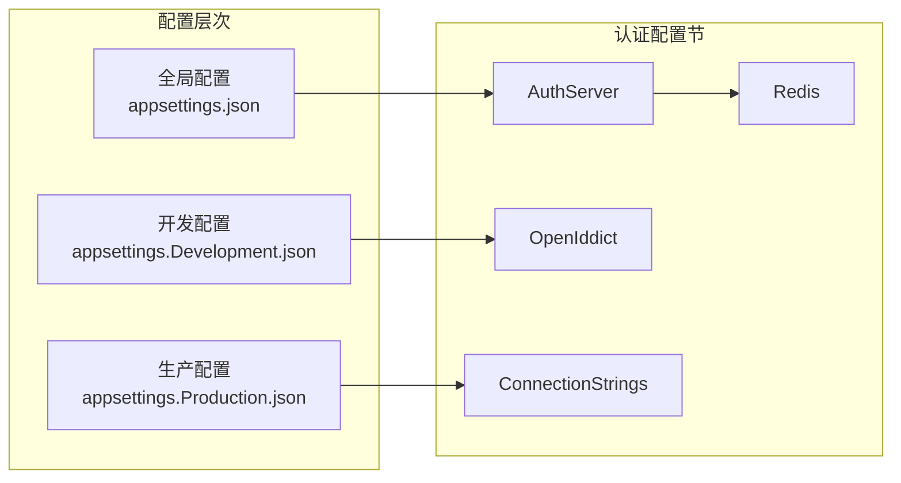
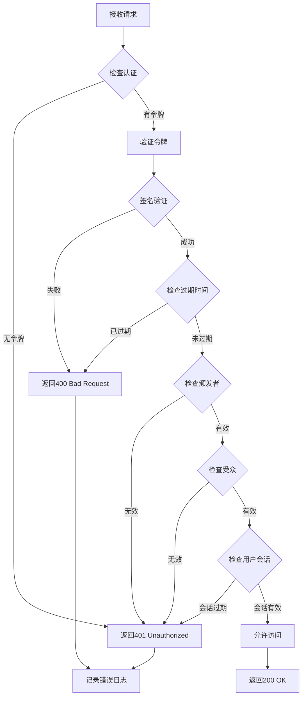

# ABP框架下的令牌验证机制详细文档

<cite>
**本文档引用的文件**
- [AuthServerModule.Configure.cs](file://aspnet-core/services/LY.MicroService.AuthServer/AuthServerModule.Configure.cs)
- [TokenWildcardIssuerValidator.cs](file://aspnet-core/framework/security/LINGYUN.Abp.Claims.Mapping/Microsoft/IdentityModel/Tokens/TokenWildcardIssuerValidator.cs)
- [SignalRJwtTokenMiddleware.cs](file://aspnet-core/framework/common/LINGYUN.Abp.AspNetCore.SignalR/Microsoft/AspNetCore/Http/SignalRJwtTokenMiddleware.cs)
- [HangfireAuthoricationMiddleware.cs](file://aspnet-core/framework/common/LINGYUN.Abp.Hangfire.Dashboard/Microsoft/AspNetCore/Http/HangfireAuthoricationMiddleware.cs)
- [AbpCookieAuthenticationHandler.cs](file://aspnet-core/services/LY.MicroService.AuthServer/Authentication/AbpCookieAuthenticationHandler.cs)
- [UserInfoIdentitySession.cs](file://aspnet-core/modules/openIddict/LINGYUN.Abp.OpenIddict.AspNetCore.Session/LINGYUN/Abp/OpenIddict/AspNetCore/Session/UserinfoIdentitySession.cs)
- [LinkUserTokenExtensionGrant.cs](file://aspnet-core/modules/openIddict/LINGYUN.Abp.OpenIddict.LinkUser/LINGYUN/Abp/OpenIddict/LinkUser/LinkUserTokenExtensionGrant.cs)
- [AbpIdentitySessionUserInfoRequestValidator.cs](file://aspnet-core/modules/identityServer/LINGYUN.Abp.IdentityServer.Session/LINGYUN/Abp/IdentityServer/Session/AbpIdentitySessionUserInfoRequestValidator.cs)
- [OpenApiAuthorizationMiddleware.cs](file://aspnet-core/framework/open-api/LINGYUN.Abp.OpenApi.Authorization/LINGYUN/Abp/OpenApi/Authorization/OpenApiAuthorizationMiddleware.cs)
- [appsettings.Development.json](file://aspnet-core/services/LY.MicroService.AuthServer.HttpApi.Host/appsettings.Development.json)
- [appsettings.json](file://aspnet-core/services/LY.MicroService.AuthServer/appsettings.json)
</cite>

## 目录
1. [简介](#简介)
2. [项目架构概览](#项目架构概览)
3. [核心认证组件](#核心认证组件)
4. [JWT令牌验证流程](#jwt令牌验证流程)
5. [OAuth2/OpenID Connect集成](#oauth2openid-connect集成)
6. [中间件架构](#中间件架构)
7. [配置管理](#配置管理)
8. [错误处理与状态码](#错误处理与状态码)
9. [环境配置示例](#环境配置示例)
10. [故障排除指南](#故障排除指南)
11. [总结](#总结)

## 简介

ABP框架下的令牌验证机制是一个基于JWT（JSON Web Token）的安全认证系统，它集成了OAuth2和OpenID Connect协议，为微服务架构提供了完整的身份验证和授权解决方案。该系统支持多种认证方式，包括JWT令牌验证、Cookie认证、以及各种扩展授权类型。

本文档详细描述了客户端请求到达API网关或微服务时，系统如何验证JWT令牌的有效性，包括签名验证、过期时间检查、颁发者和受众校验等核心功能。

## 项目架构概览

ABP框架采用分层架构设计，将认证和授权功能分布在不同的模块和服务中：



**图表来源**
- [AuthServerModule.Configure.cs](file://aspnet-core/services/LY.MicroService.AuthServer/AuthServerModule.Configure.cs#L350-L495)
- [MicroServiceApplicationsSingleModule.Configure.cs](file://aspnet-core/services/LY.MicroService.Applications.Single/MicroServiceApplicationsSingleModule.Configure.cs#L855-L886)

## 核心认证组件

### JWT验证器

ABP框架使用自定义的`TokenWildcardIssuerValidator`来处理JWT令牌的颁发者验证：



**图表来源**
- [TokenWildcardIssuerValidator.cs](file://aspnet-core/framework/security/LINGYUN.Abp.Claims.Mapping/Microsoft/IdentityModel/Tokens/TokenWildcardIssuerValidator.cs#L15-L131)
- [AuthServerModule.Configure.cs](file://aspnet-core/services/LY.MicroService.AuthServer/AuthServerModule.Configure.cs#L413-L414)

### 认证中间件架构

系统使用多个中间件来处理不同场景的认证需求：



**图表来源**
- [SignalRJwtTokenMiddleware.cs](file://aspnet-core/framework/common/LINGYUN.Abp.AspNetCore.SignalR/Microsoft/AspNetCore/Http/SignalRJwtTokenMiddleware.cs#L15-L45)
- [HangfireAuthoricationMiddleware.cs](file://aspnet-core/framework/common/LINGYUN.Abp.Hangfire.Dashboard/Microsoft/AspNetCore/Http/HangfireAuthoricationMiddleware.cs#L7-L26)

**章节来源**
- [SignalRJwtTokenMiddleware.cs](file://aspnet-core/framework/common/LINGYUN.Abp.AspNetCore.SignalR/Microsoft/AspNetCore/Http/SignalRJwtTokenMiddleware.cs#L1-L46)
- [HangfireAuthoricationMiddleware.cs](file://aspnet-core/framework/common/LINGYUN.Abp.Hangfire.Dashboard/Microsoft/AspNetCore/Http/HangfireAuthoricationMiddleware.cs#L1-L27)

## JWT令牌验证流程

### 令牌验证参数配置

ABP框架通过`TokenValidationParameters`类配置JWT令牌的验证规则：



**图表来源**
- [AuthServerModule.Configure.cs](file://aspnet-core/services/LY.MicroService.AuthServer/AuthServerModule.Configure.cs#L400-L420)
- [TokenWildcardIssuerValidator.cs](file://aspnet-core/framework/security/LINGYUN.Abp.Claims.Mapping/Microsoft/IdentityModel/Tokens/TokenWildcardIssuerValidator.cs#L25-L131)

### 颁发者验证机制

`TokenWildcardIssuerValidator`实现了灵活的颁发者验证逻辑：

1. **通配符支持**：支持使用通配符模式匹配颁发者
2. **多颁发者支持**：可以配置多个有效的颁发者
3. **格式化字符串**：支持动态替换颁发者中的占位符
4. **严格匹配**：支持精确字符串匹配

**章节来源**
- [TokenWildcardIssuerValidator.cs](file://aspnet-core/framework/security/LINGYUN.Abp.Claims.Mapping/Microsoft/IdentityModel/Tokens/TokenWildcardIssuerValidator.cs#L1-L132)

## OAuth2/OpenID Connect集成

### OpenIddict集成

ABP框架深度集成了OpenIddict作为OAuth2和OpenID Connect的实现：



**图表来源**
- [LinkUserTokenExtensionGrant.cs](file://aspnet-core/modules/openIddict/LINGYUN.Abp.OpenIddict.LinkUser/LINGYUN/Abp/OpenIddict/LinkUser/LinkUserTokenExtensionGrant.cs#L34-L63)
- [AbpIdentitySessionUserInfoRequestValidator.cs](file://aspnet-core/modules/identityServer/LINGYUN.Abp.IdentityServer.Session/LINGYUN/Abp/IdentityServer/Session/AbpIdentitySessionUserInfoRequestValidator.cs#L38-L77)

### 令牌生命周期管理

系统支持多种令牌类型的生命周期配置：

- **授权码令牌**：用于OAuth2授权流程
- **访问令牌**：用于API访问授权
- **身份令牌**：包含用户身份信息
- **刷新令牌**：用于获取新的访问令牌

**章节来源**
- [AuthServerModule.Configure.cs](file://aspnet-core/services/LY.MicroService.AuthServer/AuthServerModule.Configure.cs#L370-L390)

## 中间件架构

### 自定义中间件实现

ABP框架实现了多个专门的中间件来处理特定场景的认证需求：

#### SignalR JWT令牌中间件

```csharp
// SignalRJwtTokenMiddleware.cs
public async Task InvokeAsync(HttpContext context, RequestDelegate next)
{
    if (Options.MapJwtTokenPaths.Any(path => context.Request.Path.StartsWithSegments(path)))
    {
        if (context.User.Identity?.IsAuthenticated != true)
        {
            if (context.Request.Query.TryGetValue("access_token", out var accessToken))
            {
                context.Request.Headers.Add("Authorization", $"Bearer {accessToken}");
            }
        }
    }
    await next(context);
}
```

#### Hangfire认证中间件

```csharp
// HangfireAuthoricationMiddleware.cs
public async Task InvokeAsync(HttpContext context, RequestDelegate next)
{
    if (context.Request.Path.StartsWithSegments("/hangfire") && 
        context.User.Identity?.IsAuthenticated != true)
    {
        if (context.Request.Query.TryGetValue("access_token", out var accessTokens))
        {
            context.Request.Headers.Add("Authorization", accessTokens);
            context.Response.Cookies.Append("access_token", accessTokens);
        }
        else if (context.Request.Cookies.TryGetValue("access_token", out string tokens))
        {
            context.Request.Headers.Add("Authorization", tokens);
        }
    }
    await next(context);
}
```

**章节来源**
- [SignalRJwtTokenMiddleware.cs](file://aspnet-core/framework/common/LINGYUN.Abp.AspNetCore.SignalR/Microsoft/AspNetCore/Http/SignalRJwtTokenMiddleware.cs#L15-L45)
- [HangfireAuthoricationMiddleware.cs](file://aspnet-core/framework/common/LINGYUN.Abp.Hangfire.Dashboard/Microsoft/AspNetCore/Http/HangfireAuthoricationMiddleware.cs#L7-L26)

## 配置管理

### 应用程序配置结构

ABP框架使用分层配置系统来管理不同环境的认证设置：



**图表来源**
- [appsettings.Development.json](file://aspnet-core/services/LY.MicroService.AuthServer.HttpApi.Host/appsettings.Development.json#L80-L90)
- [appsettings.json](file://aspnet-core/services/LY.MicroService.AuthServer/appsettings.json#L1-L95)

### 关键配置参数

#### 认证服务器配置

```json
{
  "AuthServer": {
    "Authority": "http://127.0.0.1:44385",
    "Audience": "lingyun-abp-application",
    "MapInboundClaims": false,
    "RequireHttpsMetadata": false,
    "SwaggerClientId": "vue-oauth-client"
  }
}
```

#### OpenIddict生命周期配置

```json
{
  "OpenIddict": {
    "Lifetime": {
      "AuthorizationCode": "00:05:00",
      "AccessToken": "01:00:00",
      "IdentityToken": "01:00:00",
      "RefreshToken": "30.00:00:00",
      "RefreshTokenReuseLeeway": "00:05:00",
      "UserCode": "00:05:00"
    }
  }
}
```

**章节来源**
- [appsettings.Development.json](file://aspnet-core/services/LY.MicroService.AuthServer.HttpApi.Host/appsettings.Development.json#L80-L90)

## 错误处理与状态码

### 常见验证失败场景

ABP框架针对不同的验证失败情况返回相应的HTTP状态码：



### 用户会话验证

系统还实现了专门的用户会话验证机制：

```csharp
// UserInfoIdentitySession.cs
public async virtual ValueTask HandleAsync(OpenIddictServerEvents.HandleUserInfoRequestContext context)
{
    var tenantId = context.Principal.FindTenantId();
    using (CurrentTenant.Change(tenantId))
    {
        if (!await IdentitySessionChecker.ValidateSessionAsync(context.Principal))
        {
            // Errors.InvalidToken --->  401
            // Errors.ExpiredToken --->  400
            context.Reject(Errors.InvalidToken, "The user session has expired.");
        }
    }
}
```

**章节来源**
- [UserInfoIdentitySession.cs](file://aspnet-core/modules/openIddict/LINGYUN.Abp.OpenIddict.AspNetCore.Session/LINGYUN/Abp/OpenIddict/AspNetCore/Session/UserinfoIdentitySession.cs#L32-L48)

## 环境配置示例

### 开发环境配置

开发环境通常使用宽松的配置策略：

```json
{
  "AuthServer": {
    "Authority": "http://localhost:44385",
    "RequireHttpsMetadata": false,
    "DisableTransportSecurityRequirement": true
  },
  "OpenIddict": {
    "Lifetime": {
      "AccessToken": "02:00:00",
      "RefreshToken": "30.00:00:00"
    }
  }
}
```

### 生产环境配置

生产环境需要更严格的配置：

```json
{
  "AuthServer": {
    "Authority": "https://auth.example.com",
    "RequireHttpsMetadata": true,
    "DisableTransportSecurityRequirement": false
  },
  "Redis": {
    "Configuration": "redis-server:6379",
    "InstanceName": "ProductionAuth"
  },
  "ConnectionStrings": {
    "Default": "Server=prod-db;Database=AuthServer;Trusted_Connection=true;"
  }
}
```

**章节来源**
- [appsettings.Development.json](file://aspnet-core/services/LY.MicroService.AuthServer.HttpApi.Host/appsettings.Development.json#L80-L90)

## 故障排除指南

### 常见问题及解决方案

#### 1. 令牌验证失败

**症状**：客户端收到401或400状态码
**可能原因**：
- 令牌已过期
- 颁发者不匹配
- 签名验证失败
- 受众不匹配

**排查步骤**：
1. 检查令牌的过期时间
2. 验证颁发者配置是否正确
3. 确认签名密钥是否匹配
4. 检查受众配置

#### 2. SignalR连接问题

**症状**：SignalR连接失败
**解决方案**：
```csharp
// 在Startup.cs中添加
app.UseSignalRJwtToken();
```

#### 3. Hangfire访问权限

**症状**：无法访问Hangfire仪表板
**解决方案**：
```csharp
// 在Startup.cs中添加
app.UseHangfireAuthorication();
```

#### 4. 跨域问题

**症状**：CORS错误阻止API访问
**解决方案**：
```json
{
  "App": {
    "CorsOrigins": [
      "http://localhost:3100",
      "http://localhost:4200"
    ]
  }
}
```

### 日志配置

启用详细的认证日志以便调试：

```json
{
  "Serilog": {
    "MinimumLevel": {
      "Default": "Debug",
      "Override": {
        "Microsoft.AspNetCore.Authentication": "Debug",
        "OpenIddict": "Debug"
      }
    }
  }
}
```

## 总结

ABP框架下的令牌验证机制是一个功能完整、高度可配置的身份认证系统。它通过以下特性确保了系统的安全性：

1. **多层验证**：支持签名验证、过期时间检查、颁发者和受众校验
2. **灵活配置**：支持不同环境的差异化配置
3. **扩展性强**：可以通过中间件扩展支持新的认证场景
4. **错误处理完善**：针对不同类型的验证失败提供清晰的错误信息和状态码
5. **性能优化**：支持Redis缓存和数据保护

该系统为微服务架构提供了坚实的安全基础，能够满足企业级应用对身份认证和授权的各种需求。通过合理的配置和部署，可以构建出既安全又高效的分布式系统。