# 会话管理

<cite>
**本文档引用的文件**
- [IdentitySessionCleanupOptions.cs](file://aspnet-core/modules/identity/LINGYUN.Abp.Identity.Domain/LINGYUN/Abp/Identity/Session/IdentitySessionCleanupOptions.cs)
- [IdentitySessionCheckOptions.cs](file://aspnet-core/modules/identity/LINGYUN.Abp.Identity.Session/LINGYUN/Abp/Identity/Session/IdentitySessionCheckOptions.cs)
- [IdentitySessionSignInOptions.cs](file://aspnet-core/modules/identity/LINGYUN.Abp.Identity.Domain/LINGYUN/Abp/Identity/Session/IdentitySessionSignInOptions.cs)
- [IdentitySessionCleanupService.cs](file://aspnet-core/modules/identity/LINGYUN.Abp.Identity.Domain/LINGYUN/Abp/Identity/Session/IdentitySessionCleanupService.cs)
- [IdentitySessionCleanupBackgroundWorker.cs](file://aspnet-core/modules/identity/LINGYUN.Abp.Identity.Domain/LINGYUN/Abp/Identity/Session/IdentitySessionCleanupBackgroundWorker.cs)
- [DefaultIdentitySessionCache.cs](file://aspnet-core/modules/identity/LINGYUN.Abp.Identity.Session/LINGYUN/Abp/Identity/Session/DefaultIdentitySessionCache.cs)
- [DefaultIdentitySessionChecker.cs](file://aspnet-core/modules/identity/LINGYUN.Abp.Identity.Session/LINGYUN/Abp/Identity/Session/DefaultIdentitySessionChecker.cs)
- [IdentitySessionCacheItemSynchronizer.cs](file://aspnet-core/modules/identity/LINGYUN.Abp.Identity.Domain/LINGYUN/Abp/Identity/Session/IdentitySessionCacheItemSynchronizer.cs)
- [IIdentitySessionStore.cs](file://aspnet-core/modules/identity/LINGYUN.Abp.Identity.Domain/LINGYUN/Abp/Identity/Session/IIdentitySessionStore.cs)
- [IdentitySessionCacheItem.cs](file://aspnet-core/modules/identity/LINGYUN.Abp.Identity.Session/LINGYUN/Abp/Identity/Session/IdentitySessionCacheItem.cs)
- [ConcurrentLoginStrategy.cs](file://aspnet-core/modules/identity/LINGYUN.Abp.Identity.Domain.Shared/LINGYUN/Abp/Identity/ConcurrentLoginStrategy.cs)
- [IdentitySettingNames.cs](file://aspnet-core/modules/identity/LINGYUN.Abp.Identity.Domain.Shared/LINGYUN/Abp/Identity/Settings/IdentitySettingNames.cs)
- [AbpIdentitySessionModule.cs](file://aspnet-core/modules/identity/LINGYUN.Abp.Identity.Session/LINGYUN/Abp/Identity/Session/AbpIdentitySessionModule.cs)
</cite>

## 目录
1. [简介](#简介)
2. [项目结构](#项目结构)
3. [核心组件](#核心组件)
4. [架构概览](#架构概览)
5. [详细组件分析](#详细组件分析)
6. [会话存储机制](#会话存储机制)
7. [会话生命周期管理](#会话生命周期管理)
8. [并发登录控制](#并发登录控制)
9. [性能考虑](#性能考虑)
10. [最佳实践](#最佳实践)
11. [故障排除指南](#故障排除指南)
12. [结论](#结论)

## 简介

ABP框架的会话管理系统是一个高度可扩展且功能丰富的解决方案，专门设计用于处理复杂的会话管理需求。该系统提供了完整的会话超时设置、会话固定防护、并发登录控制等功能，并支持多种存储后端（内存、Redis等）。系统采用分布式架构设计，确保在高并发场景下的稳定性和性能。

会话管理系统的核心目标是：
- 提供安全可靠的会话管理机制
- 支持灵活的会话超时配置
- 实现高效的并发登录控制
- 确保会话数据的一致性和完整性
- 提供完善的会话生命周期管理

## 项目结构

会话管理系统在ABP框架中的组织结构如下：

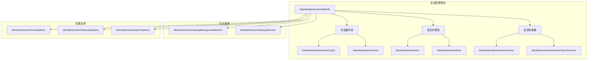

**图表来源**
- [AbpIdentitySessionModule.cs](file://aspnet-core/modules/identity/LINGYUN.Abp.Identity.Session/LINGYUN/Abp/Identity/Session/AbpIdentitySessionModule.cs#L1-L10)

**章节来源**
- [AbpIdentitySessionModule.cs](file://aspnet-core/modules/identity/LINGYUN.Abp.Identity.Session/LINGYUN/Abp/Identity/Session/AbpIdentitySessionModule.cs#L1-L10)

## 核心组件

会话管理系统包含以下核心组件：

### 1. 会话缓存层
负责会话数据的快速读写操作，支持分布式缓存（如Redis）

### 2. 会话存储层
提供会话数据的持久化存储，支持数据库存储

### 3. 会话检查器
验证会话的有效性，执行会话刷新和同步操作

### 4. 会话同步器
处理会话事件，确保缓存和存储之间的一致性

### 5. 后台清理服务
定期清理过期和不活跃的会话数据

**章节来源**
- [DefaultIdentitySessionCache.cs](file://aspnet-core/modules/identity/LINGYUN.Abp.Identity.Session/LINGYUN/Abp/Identity/Session/DefaultIdentitySessionCache.cs#L1-L58)
- [DefaultIdentitySessionChecker.cs](file://aspnet-core/modules/identity/LINGYUN.Abp.Identity.Session/LINGYUN/Abp/Identity/Session/DefaultIdentitySessionChecker.cs#L1-L105)

## 架构概览

会话管理系统采用分层架构设计，确保各组件之间的松耦合和高内聚：

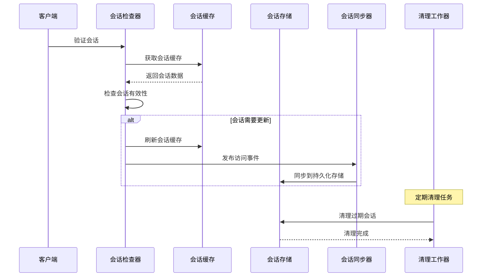

**图表来源**
- [DefaultIdentitySessionChecker.cs](file://aspnet-core/modules/identity/LINGYUN.Abp.Identity.Session/LINGYUN/Abp/Identity/Session/DefaultIdentitySessionChecker.cs#L35-L104)
- [IdentitySessionCacheItemSynchronizer.cs](file://aspnet-core/modules/identity/LINGYUN.Abp.Identity.Domain/LINGYUN/Abp/Identity/Session/IdentitySessionCacheItemSynchronizer.cs#L63-L98)

## 详细组件分析

### 会话检查器组件

会话检查器是整个会话管理系统的核心组件，负责验证会话的有效性和执行必要的维护操作：

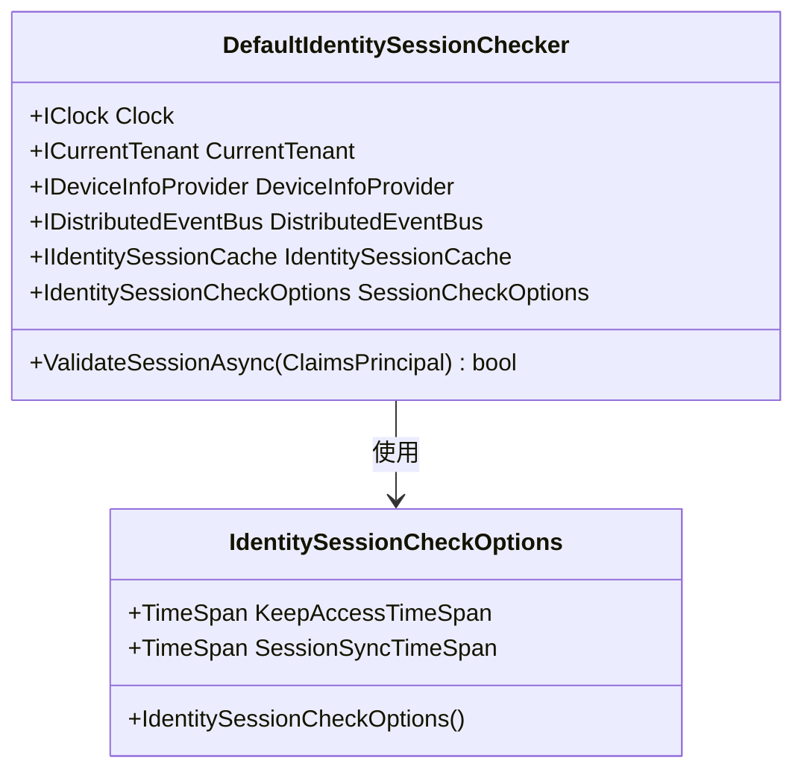

**图表来源**
- [DefaultIdentitySessionChecker.cs](file://aspnet-core/modules/identity/LINGYUN.Abp.Identity.Session/LINGYUN/Abp/Identity/Session/DefaultIdentitySessionChecker.cs#L15-L35)
- [IdentitySessionCheckOptions.cs](file://aspnet-core/modules/identity/LINGYUN.Abp.Identity.Session/LINGYUN/Abp/Identity/Session/IdentitySessionCheckOptions.cs#L6-L29)

会话检查器的主要职责包括：

1. **会话验证**：检查传入的会话标识符是否存在且有效
2. **访问时间更新**：当会话超过一定时间未访问时，自动更新最后访问时间
3. **缓存同步**：定期将缓存中的会话信息同步到持久化存储
4. **事件发布**：在会话状态发生变化时发布相应的事件

**章节来源**
- [DefaultIdentitySessionChecker.cs](file://aspnet-core/modules/identity/LINGYUN.Abp.Identity.Session/LINGYUN/Abp/Identity/Session/DefaultIdentitySessionChecker.cs#L35-L104)

### 会话缓存组件

会话缓存组件提供高性能的会话数据读写操作，支持多种缓存后端：

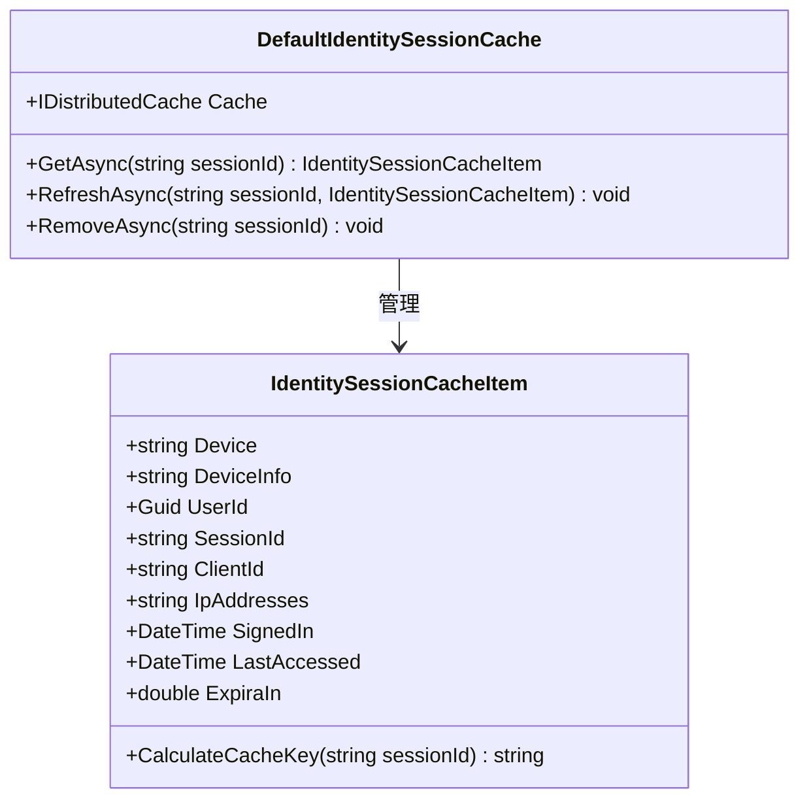

**图表来源**
- [DefaultIdentitySessionCache.cs](file://aspnet-core/modules/identity/LINGYUN.Abp.Identity.Session/LINGYUN/Abp/Identity/Session/DefaultIdentitySessionCache.cs#L13-L57)
- [IdentitySessionCacheItem.cs](file://aspnet-core/modules/identity/LINGYUN.Abp.Identity.Session/LINGYUN/Abp/Identity/Session/IdentitySessionCacheItem.cs#L6-L56)

缓存项包含以下关键信息：
- 设备信息和类型
- 用户标识和会话标识
- 客户端信息和IP地址
- 登录时间和最后访问时间
- 过期时间配置

**章节来源**
- [DefaultIdentitySessionCache.cs](file://aspnet-core/modules/identity/LINGYUN.Abp.Identity.Session/LINGYUN/Abp/Identity/Session/DefaultIdentitySessionCache.cs#L1-L58)
- [IdentitySessionCacheItem.cs](file://aspnet-core/modules/identity/LINGYUN.Abp.Identity.Session/LINGYUN/Abp/Identity/Session/IdentitySessionCacheItem.cs#L1-L81)

### 会话存储组件

会话存储组件负责会话数据的持久化存储，提供完整的CRUD操作：

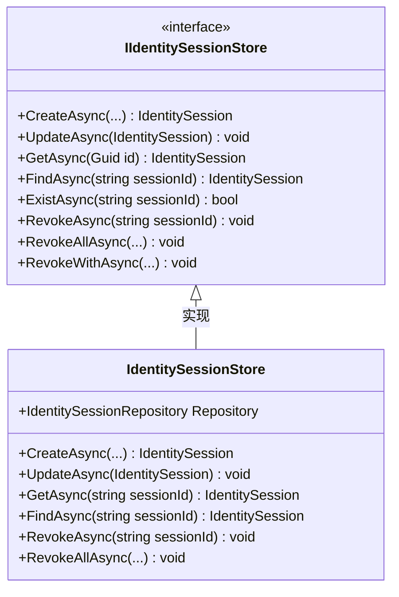

**图表来源**
- [IIdentitySessionStore.cs](file://aspnet-core/modules/identity/LINGYUN.Abp.Identity.Domain/LINGYUN/Abp/Identity/Session/IIdentitySessionStore.cs#L10-L182)

存储组件支持的操作包括：
- 会话创建和更新
- 会话查询和查找
- 会话撤销和清理
- 批量会话管理

**章节来源**
- [IIdentitySessionStore.cs](file://aspnet-core/modules/identity/LINGYUN.Abp.Identity.Domain/LINGYUN/Abp/Identity/Session/IIdentitySessionStore.cs#L1-L183)

## 会话存储机制

会话存储机制支持多种存储后端，包括内存存储和Redis分布式缓存：

### 内存存储

内存存储是最简单的存储方式，适用于单机部署场景：

```csharp
// 内存存储配置示例
services.AddDistributedMemoryCache();
```

### Redis存储

Redis存储提供分布式支持，适用于集群部署场景：

```csharp
// Redis存储配置示例
services.AddStackExchangeRedisCache(options =>
{
    options.Configuration = "localhost:6379";
});
```

### 存储配置选项

系统提供了灵活的存储配置选项：

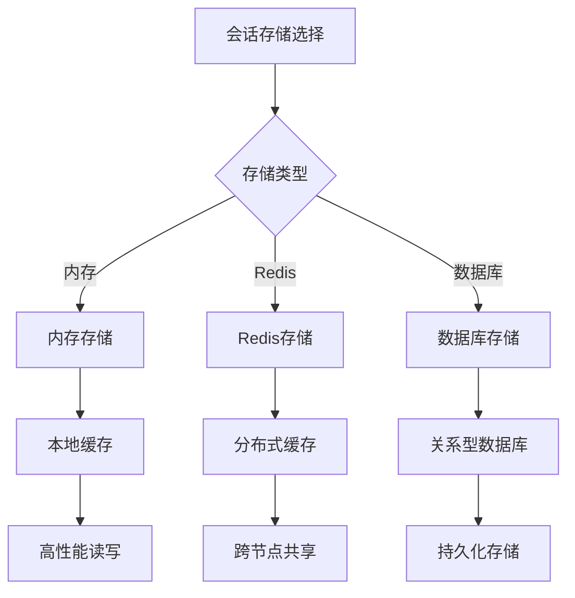

**图表来源**
- [DefaultIdentitySessionCache.cs](file://aspnet-core/modules/identity/LINGYUN.Abp.Identity.Session/LINGYUN/Abp/Identity/Session/DefaultIdentitySessionCache.cs#L13-L57)

**章节来源**
- [DefaultIdentitySessionCache.cs](file://aspnet-core/modules/identity/LINGYUN.Abp.Identity.Session/LINGYUN/Abp/Identity/Session/DefaultIdentitySessionCache.cs#L1-L58)

## 会话生命周期管理

会话生命周期管理涵盖了从会话创建到销毁的完整过程：

### 会话创建流程

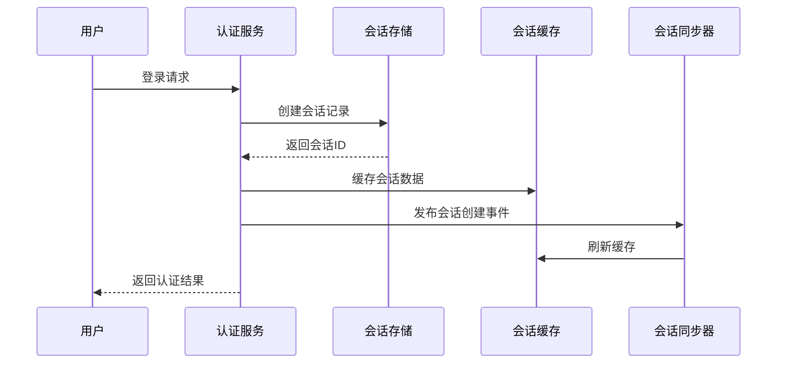

**图表来源**
- [IdentitySessionCacheItemSynchronizer.cs](file://aspnet-core/modules/identity/LINGYUN.Abp.Identity.Domain/LINGYUN/Abp/Identity/Session/IdentitySessionCacheItemSynchronizer.cs#L45-L62)

### 会话验证流程

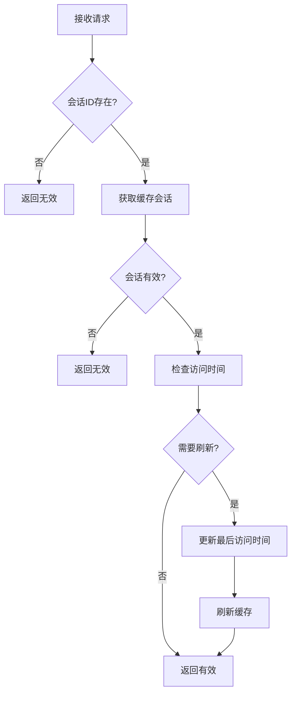

**图表来源**
- [DefaultIdentitySessionChecker.cs](file://aspnet-core/modules/identity/LINGYUN.Abp.Identity.Session/LINGYUN/Abp/Identity/Session/DefaultIdentitySessionChecker.cs#L35-L104)

### 会话清理机制

系统提供了自动化的会话清理机制：

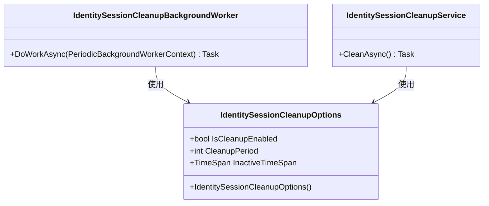

**图表来源**
- [IdentitySessionCleanupOptions.cs](file://aspnet-core/modules/identity/LINGYUN.Abp.Identity.Domain/LINGYUN/Abp/Identity/Session/IdentitySessionCleanupOptions.cs#L5-L25)
- [IdentitySessionCleanupBackgroundWorker.cs](file://aspnet-core/modules/identity/LINGYUN.Abp.Identity.Domain/LINGYUN/Abp/Identity/Session/IdentitySessionCleanupBackgroundWorker.cs#L10-L38)

**章节来源**
- [IdentitySessionCleanupOptions.cs](file://aspnet-core/modules/identity/LINGYUN.Abp.Identity.Domain/LINGYUN/Abp/Identity/Session/IdentitySessionCleanupOptions.cs#L1-L25)
- [IdentitySessionCleanupBackgroundWorker.cs](file://aspnet-core/modules/identity/LINGYUN.Abp.Identity.Domain/LINGYUN/Abp/Identity/Session/IdentitySessionCleanupBackgroundWorker.cs#L1-L38)
- [IdentitySessionCleanupService.cs](file://aspnet-core/modules/identity/LINGYUN.Abp.Identity.Domain/LINGYUN/Abp/Identity/Session/IdentitySessionCleanupService.cs#L1-L36)

## 并发登录控制

并发登录控制是会话管理系统的重要功能，支持多种策略来管理用户的并发会话：

### 并发登录策略

系统支持三种并发登录策略：

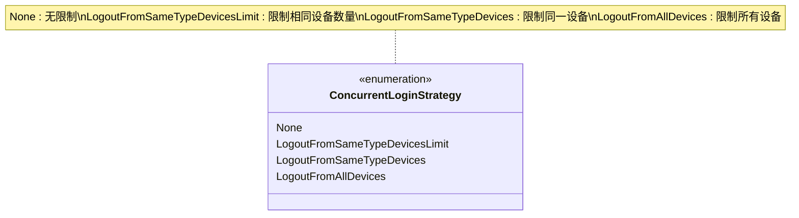

**图表来源**
- [ConcurrentLoginStrategy.cs](file://aspnet-core/modules/identity/LINGYUN.Abp.Identity.Domain.Shared/LINGYUN/Abp/Identity/ConcurrentLoginStrategy.cs#L5-L23)

### 策略实现机制

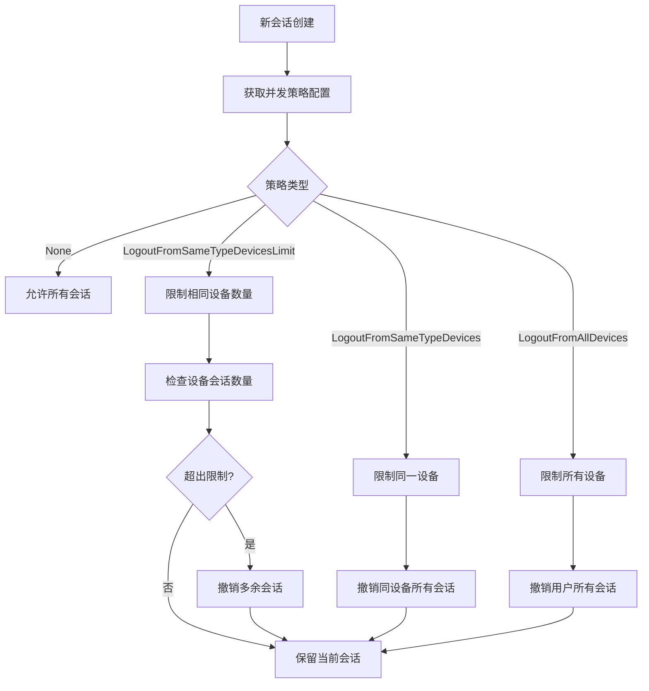

**图表来源**
- [IdentitySessionCacheItemSynchronizer.cs](file://aspnet-core/modules/identity/LINGYUN.Abp.Identity.Domain/LINGYUN/Abp/Identity/Session/IdentitySessionCacheItemSynchronizer.cs#L129-L181)

### 策略配置

每种策略都有对应的配置参数：

- **LogoutFromSameTypeDevicesLimit**：限制相同设备的最大会话数量
- **LogoutFromSameTypeDevices**：同一设备只允许一个活动会话
- **LogoutFromAllDevices**：用户只能在一个设备上登录

**章节来源**
- [ConcurrentLoginStrategy.cs](file://aspnet-core/modules/identity/LINGYUN.Abp.Identity.Domain.Shared/LINGYUN/Abp/Identity/ConcurrentLoginStrategy.cs#L1-L24)
- [IdentitySessionCacheItemSynchronizer.cs](file://aspnet-core/modules/identity/LINGYUN.Abp.Identity.Domain/LINGYUN/Abp/Identity/Session/IdentitySessionCacheItemSynchronizer.cs#L129-L181)

## 性能考虑

会话管理系统在设计时充分考虑了性能优化：

### 缓存策略优化

1. **分层缓存**：使用多级缓存减少数据库访问
2. **智能刷新**：只在必要时刷新缓存数据
3. **批量操作**：支持批量会话管理操作

### 异步处理

系统大量使用异步操作来提高性能：
- 异步会话验证
- 异步缓存刷新
- 异步事件处理

### 分布式锁

为避免并发问题，系统使用分布式锁：
- 会话创建时加锁
- 会话更新时加锁
- 会话清理时加锁

## 最佳实践

### 会话配置最佳实践

1. **合理设置超时时间**
   ```csharp
   // 推荐配置
   options.KeepAccessTimeSpan = TimeSpan.FromMinutes(1);     // 刷新间隔
   options.SessionSyncTimeSpan = TimeSpan.FromMinutes(10);   // 同步间隔
   ```

2. **选择合适的存储后端**
   - 单机部署：使用内存存储
   - 集群部署：使用Redis存储
   - 高可用要求：使用数据库存储

3. **配置并发策略**
   - 根据业务需求选择合适的并发策略
   - 设置合理的设备会话数量限制

### 性能优化建议

1. **缓存预热**：在应用启动时预加载常用会话数据
2. **监控告警**：建立会话管理系统的监控指标
3. **定期维护**：定期清理过期会话数据

### 安全考虑

1. **会话固定防护**：每次登录都生成新的会话ID
2. **IP地址跟踪**：记录和验证用户IP地址变化
3. **设备信息验证**：验证设备信息的一致性

## 故障排除指南

### 常见问题及解决方案

1. **会话验证失败**
   - 检查会话缓存是否正常
   - 验证会话数据是否一致
   - 查看日志中的错误信息

2. **并发登录问题**
   - 检查并发策略配置
   - 验证策略逻辑是否正确执行
   - 查看会话清理任务是否正常运行

3. **性能问题**
   - 监控缓存命中率
   - 检查数据库连接池配置
   - 优化查询语句

### 调试技巧

1. **启用详细日志**：设置适当的日志级别
2. **使用性能计数器**：监控关键指标
3. **模拟测试**：使用单元测试验证功能

**章节来源**
- [DefaultIdentitySessionChecker.cs](file://aspnet-core/modules/identity/LINGYUN.Abp.Identity.Session/LINGYUN/Abp/Identity/Session/DefaultIdentitySessionChecker.cs#L35-L104)
- [IdentitySessionCacheItemSynchronizer.cs](file://aspnet-core/modules/identity/LINGYUN.Abp.Identity.Domain/LINGYUN/Abp/Identity/Session/IdentitySessionCacheItemSynchronizer.cs#L45-L98)

## 结论

ABP框架的会话管理系统是一个功能完善、设计精良的企业级解决方案。它不仅提供了基本的会话管理功能，还包含了高级特性如并发控制、分布式支持和自动化清理等。

系统的主要优势包括：

1. **高度可配置**：支持多种配置选项满足不同需求
2. **高性能设计**：采用缓存和异步处理提升性能
3. **安全性保障**：提供会话固定防护和并发控制
4. **易于扩展**：模块化设计便于功能扩展
5. **分布式支持**：原生支持Redis等分布式存储

通过合理配置和使用，会话管理系统能够为企业应用提供可靠、安全、高性能的会话管理服务，是构建现代Web应用的重要基础设施。