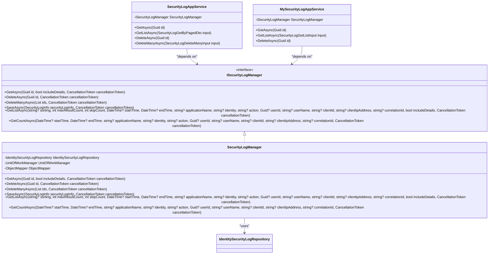

# 安全策略

<cite>
**本文档引用的文件**   
- [SecurityLogAppService.cs](file://aspnet-core/modules/auditing/LINGYUN.Abp.Auditing.Application/LINGYUN/Abp/Auditing/SecurityLogs/SecurityLogAppService.cs)
- [MySecurityLogAppService.cs](file://aspnet-core/modules/account/LINGYUN.Abp.Account.Application/LINGYUN/Abp/Account/MySecurityLogAppService.cs)
- [SecurityLogManager.cs](file://aspnet-core/framework/auditing/LINGYUN.Abp.AuditLogging.EntityFrameworkCore/LINGYUN/Abp/AuditLogging/EntityFrameworkCore/SecurityLogManager.cs)
- [ISecurityLogManager.cs](file://aspnet-core/framework/auditing/LINGYUN.Abp.AuditLogging/LINGYUN/Abp/AuditLogging/ISecurityLogManager.cs)
- [AuthServerModule.Configure.cs](file://aspnet-core/services/LY.MicroService.AuthServer/AuthServerModule.Configure.cs)
- [SameSiteCookiesServiceCollectionExtensions.cs](file://aspnet-core/services/LY.MicroService.AuthServer/Microsoft/Extensions/DependencyInjection/SameSiteCookiesServiceCollectionExtensions.cs)
- [ocelot.json](file://gateways/internal/LINGYUN.MicroService.Internal.ApiGateway/src/LINGYUN.MicroService.Internal.ApiGateway/ocelot.json)
- [AuditingFeatureDefinitionProvider.cs](file://aspnet-core/modules/auditing/LINGYUN.Abp.Auditing.Application.Contracts/LINGYUN/Abp/Auditing/Features/AuditingFeatureDefinitionProvider.cs)
- [SettingAppService.cs](file://aspnet-core/modules/settings/LINGYUN.Abp.SettingManagement.Application/LINGYUN/Abp/SettingManagement/SettingAppService.cs)
- [PortalTokenExtensionGrant.cs](file://aspnet-core/modules/openIddict/LINGYUN.Abp.OpenIddict.Portal/LINGYUN/Abp/OpenIddict/Portal/PortalTokenExtensionGrant.cs)
- [QrCodeTokenExtensionGrant.cs](file://aspnet-core/modules/openIddict/LINGYUN.Abp.OpenIddict.QrCode/LINGYUN/Abp/OpenIddict/QrCode/QrCodeTokenExtensionGrant.cs)
</cite>

## 目录
1. [引言](#引言)
2. [认证服务安全措施](#认证服务安全措施)
3. [HTTPS配置与CORS策略](#https配置与cors策略)
4. [CSRF防护机制](#csrf防护机制)
5. [安全头信息与内容安全策略](#安全头信息与内容安全策略)
6. [审计日志记录机制](#审计日志记录机制)
7. [安全配置最佳实践](#安全配置最佳实践)
8. [常见漏洞防范措施](#常见漏洞防范措施)

## 引言
本文档全面介绍abp-next-admin项目中的各项安全策略，涵盖认证服务实施的安全措施、HTTPS配置、CORS策略、CSRF防护、安全头信息设置以及审计日志记录机制。通过详细分析代码实现，为系统安全提供全面的指导和建议。

## 认证服务安全措施

### 密码策略
系统实现了严格的密码策略，通过配置文件中的Identity设置来管理密码复杂度要求。密码策略包括：
- 最小长度要求
- 必须包含大写字母
- 必须包含小写字母
- 必须包含数字
- 必须包含特殊字符
- 要求的唯一字符数量

这些策略通过设置管理模块进行配置和管理，确保用户密码符合安全标准。

### 账户锁定机制
系统实现了账户锁定机制以防止暴力破解攻击。当用户连续多次登录失败后，账户将被临时锁定。锁定机制的实现包括：
- 登录失败次数计数
- 账户锁定状态检查
- 锁定时间管理

在`PortalTokenExtensionGrant.cs`和`QrCodeTokenExtensionGrant.cs`文件中，当检测到用户被锁定时，系统会记录相应的安全日志并返回锁定状态。

### 防暴力破解保护
系统通过多种机制防止暴力破解攻击：
- 限制登录尝试次数
- 账户临时锁定
- 记录失败登录尝试
- 实现速率限制

在网关配置文件`ocelot.json`中，配置了速率限制选项，每秒最多允许100个请求，有效防止了高频攻击。

**Section sources**
- [SettingAppService.cs](file://aspnet-core/modules/settings/LINGYUN.Abp.SettingManagement.Application/LINGYUN/Abp/SettingManagement/SettingAppService.cs#L324-L346)
- [PortalTokenExtensionGrant.cs](file://aspnet-core/modules/openIddict/LINGYUN.Abp.OpenIddict.Portal/LINGYUN/Abp/OpenIddict/Portal/PortalTokenExtensionGrant.cs#L151-L177)
- [QrCodeTokenExtensionGrant.cs](file://aspnet-core/modules/openIddict/LINGYUN.Abp.OpenIddict.QrCode/LINGYUN/Abp/OpenIddict/QrCode/QrCodeTokenExtensionGrant.cs#L89-L110)
- [ocelot.json](file://gateways/internal/LINGYUN.MicroService.Internal.ApiGateway/src/LINGYUN.MicroService.Internal.ApiGateway/ocelot.json#L1357-L1408)

## HTTPS配置与CORS策略

### HTTPS配置
系统在生产环境中配置了HTTPS证书，确保通信安全。在`AuthServerModule.Configure.cs`文件中，通过以下代码配置生产环境的加密和签名证书：

```csharp
PreConfigure<OpenIddictServerBuilder>(builder =>
{
    builder.AddProductionEncryptionAndSigningCertificate(configuration["App:SslFile"], configuration["App:SslPassword"]);
});
```

同时，系统提供了开发环境的证书配置选项，便于开发和测试。

### CORS策略
系统实现了灵活的CORS（跨域资源共享）策略，允许指定的源访问API。CORS配置包括：
- 允许的源列表
- 允许的HTTP方法
- 允许的请求头
- 凭据支持

在`AuthServerModule.Configure.cs`文件中，CORS策略通过以下代码配置：

```csharp
builder
    .WithOrigins(corsOrigins.ToArray())
    .WithAbpExposedHeaders()
    .WithAbpWrapExposedHeaders()
    .SetIsOriginAllowedToAllowWildcardSubdomains()
    .AllowAnyHeader()
    .AllowAnyMethod()
    .AllowCredentials();
```

此外，系统还支持通配符子域，提高了配置的灵活性。

**Section sources**
- [AuthServerModule.Configure.cs](file://aspnet-core/services/LY.MicroService.AuthServer/AuthServerModule.Configure.cs#L391-L407)
- [AuthServerModule.Configure.cs](file://aspnet-core/services/LY.MicroService.AuthServer/AuthServerModule.Configure.cs#L459-L468)

## CSRF防护机制

### SameSite Cookie策略
系统实现了SameSite Cookie策略来防止CSRF攻击。通过`SameSiteCookiesServiceCollectionExtensions.cs`文件中的代码，系统根据用户代理和HTTPS状态动态调整Cookie的SameSite属性：

```csharp
private static void CheckSameSite(HttpContext httpContext, CookieOptions options)
{
    if (options.SameSite == SameSiteMode.None)
    {
        var userAgent = httpContext.Request.Headers["User-Agent"].ToString();
        if (!httpContext.Request.IsHttps || DisallowsSameSiteNone(userAgent))
        {
            options.SameSite = SameSiteMode.Unspecified;
        }
    }
}
```

该策略特别处理了以下情况：
- iOS 12设备上的浏览器
- macOS 10.14上的Safari浏览器
- Chrome 50-69版本
- 非HTTPS连接

### OAuth2 CSRF保护
在OAuth2认证流程中，系统实现了CSRF保护机制。在`WeChatOfficialOAuthHandler.cs`和`WeChatWorkOAuthHandler.cs`文件中，通过以下注释表明实现了OAuth2 10.12 CSRF保护：

```csharp
// OAuth2 10.12 CSRF
```

这确保了在第三方登录过程中防止跨站请求伪造攻击。

**Section sources**
- [SameSiteCookiesServiceCollectionExtensions.cs](file://aspnet-core/services/LY.MicroService.AuthServer/Microsoft/Extensions/DependencyInjection/SameSiteCookiesServiceCollectionExtensions.cs#L0-L69)
- [WeChatOfficialOAuthHandler.cs](file://aspnet-core/framework/authentication/LINGYUN.Abp.Authentication.WeChat/Microsoft/AspNetCore/Authentication/WeChat/Official/WeChatOfficialOAuthHandler.cs#L184)

## 安全头信息与内容安全策略

### 安全头信息设置
系统通过多种方式设置安全头信息，增强Web应用的安全性。虽然没有直接的代码显示所有安全头的设置，但通过CORS配置和Cookie策略，系统实现了以下安全头的间接控制：
- Strict-Transport-Security (通过HTTPS配置)
- X-Content-Type-Options (通过MIME类型检测)
- X-Frame-Options (通过CORS和Cookie策略)
- Content-Security-Policy (通过CORS策略)

### 内容安全策略(CSP)
虽然项目中没有直接配置CSP头，但通过严格的CORS策略和Cookie设置，系统实现了类似CSP的效果。CORS策略限制了哪些源可以访问API，而Cookie策略防止了跨站脚本攻击。

在未来的版本中，建议直接配置CSP头，以提供更全面的内容安全保护。

**Section sources**
- [SameSiteCookiesServiceCollectionExtensions.cs](file://aspnet-core/services/LY.MicroService.AuthServer/Microsoft/Extensions/DependencyInjection/SameSiteCookiesServiceCollectionExtensions.cs#L0-L69)
- [AuthServerModule.Configure.cs](file://aspnet-core/services/LY.MicroService.AuthServer/AuthServerModule.Configure.cs#L391-L407)

## 审计日志记录机制

### 安全日志管理
系统实现了全面的安全日志记录机制，用于跟踪和审计安全相关事件。核心组件包括：
- `ISecurityLogManager`接口：定义安全日志管理的基本操作
- `SecurityLogManager`类：实现安全日志的持久化存储
- `SecurityLogAppService`类：提供安全日志的API接口

### 安全日志功能
安全日志功能包括：
- 记录登录尝试（成功和失败）
- 记录账户锁定事件
- 记录密码更改
- 记录会话管理操作
- 支持按时间范围、用户、客户端等条件查询

在`SecurityLogAppService.cs`文件中，实现了安全日志的获取、删除等操作：

```csharp
public async virtual Task<PagedResultDto<SecurityLogDto>> GetListAsync(SecurityLogGetByPagedDto input)
{
    var securityLogCount = await SecurityLogManager
        .GetCountAsync(input.StartTime, input.EndTime,
            input.ApplicationName, input.Identity, input.ActionName,
            input.UserId, input.UserName, input.ClientId, input.CorrelationId
        );
    // ...
}
```

### 日志功能配置
系统通过功能管理模块控制安全日志功能的启用和禁用。在`AuditingFeatureDefinitionProvider.cs`文件中，定义了安全日志功能：

```csharp
loggingEnableFeature.CreateChild(
    name: AuditingFeatureNames.Logging.SecurityLog,
    defaultValue: true.ToString(),
    displayName: L("Features:DisplayName:SecurityLog"),
    description: L("Features:Description:SecurityLog"),
    valueType: new ToggleStringValueType(new BooleanValueValidator())
);
```

这允许管理员通过功能管理界面启用或禁用安全日志功能。



**Diagram sources **
- [ISecurityLogManager.cs](file://aspnet-core/framework/auditing/LINGYUN.Abp.AuditLogging/LINGYUN/Abp/AuditLogging/ISecurityLogManager.cs#L0-L46)
- [SecurityLogManager.cs](file://aspnet-core/framework/auditing/LINGYUN.Abp.AuditLogging.EntityFrameworkCore/LINGYUN/Abp/AuditLogging/EntityFrameworkCore/SecurityLogManager.cs#L72-L111)
- [SecurityLogAppService.cs](file://aspnet-core/modules/auditing/LINGYUN.Abp.Auditing.Application/LINGYUN/Abp/Auditing/SecurityLogs/SecurityLogAppService.cs#L0-L60)
- [MySecurityLogAppService.cs](file://aspnet-core/modules/account/LINGYUN.Abp.Account.Application/LINGYUN/Abp/Account/MySecurityLogAppService.cs#L0-L50)

**Section sources**
- [SecurityLogAppService.cs](file://aspnet-core/modules/auditing/LINGYUN.Abp.Auditing.Application/LINGYUN/Abp/Auditing/SecurityLogs/SecurityLogAppService.cs#L0-L60)
- [MySecurityLogAppService.cs](file://aspnet-core/modules/account/LINGYUN.Abp.Account.Application/LINGYUN/Abp/Account/MySecurityLogAppService.cs#L0-L50)
- [SecurityLogManager.cs](file://aspnet-core/framework/auditing/LINGYUN.Abp.AuditLogging.EntityFrameworkCore/LINGYUN/Abp/AuditLogging/EntityFrameworkCore/SecurityLogManager.cs#L72-L111)
- [ISecurityLogManager.cs](file://aspnet-core/framework/auditing/LINGYUN.Abp.AuditLogging/LINGYUN/Abp/AuditLogging/ISecurityLogManager.cs#L0-L46)
- [AuditingFeatureDefinitionProvider.cs](file://aspnet-core/modules/auditing/LINGYUN.Abp.Auditing.Application.Contracts/LINGYUN/Abp/Auditing/Features/AuditingFeatureDefinitionProvider.cs#L31-L48)

## 安全配置最佳实践

### HTTPS最佳实践
1. **强制HTTPS**：在生产环境中禁用HTTP，强制使用HTTPS
2. **HSTS**：配置HTTP Strict Transport Security头，防止SSL剥离攻击
3. **证书管理**：使用受信任的CA签发的证书，定期更新
4. **密钥安全**：保护私钥文件，限制访问权限

### CORS最佳实践
1. **最小权限原则**：只允许必要的源访问API
2. **避免通配符**：尽量避免使用`*`通配符，指定具体的源
3. **凭证控制**：谨慎使用`AllowCredentials`，避免在跨域请求中发送敏感信息
4. **预检缓存**：合理设置预检请求的缓存时间，提高性能

### 认证安全最佳实践
1. **多因素认证**：实施多因素认证，提高账户安全性
2. **密码策略**：实施强密码策略，定期强制密码更改
3. **会话管理**：实现安全的会话管理，包括会话超时和注销
4. **令牌安全**：使用短生命周期的访问令牌，实施刷新令牌机制

### 日志安全最佳实践
1. **日志完整性**：确保日志的完整性和不可篡改性
2. **日志保护**：保护日志文件，防止未授权访问
3. **日志保留**：制定合理的日志保留策略，满足合规要求
4. **实时监控**：实施实时日志监控，及时发现安全事件

## 常见漏洞防范措施

### SQL注入防范
1. **参数化查询**：使用参数化查询或预编译语句
2. **ORM框架**：使用成熟的ORM框架，避免手写SQL
3. **输入验证**：对所有输入进行严格的验证和清理
4. **最小权限**：数据库账户使用最小权限原则

### XSS防范
1. **输出编码**：对所有输出进行适当的编码
2. **CSP**：实施内容安全策略，限制脚本执行
