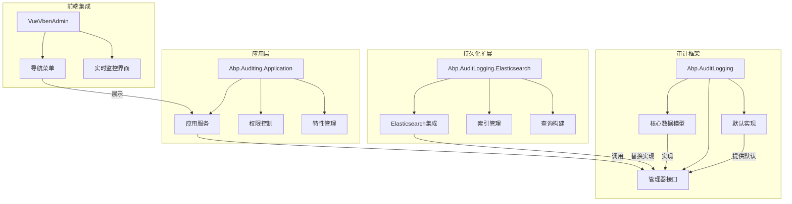
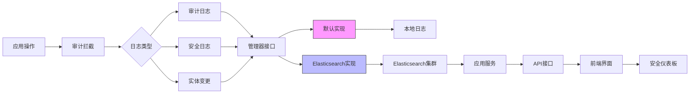
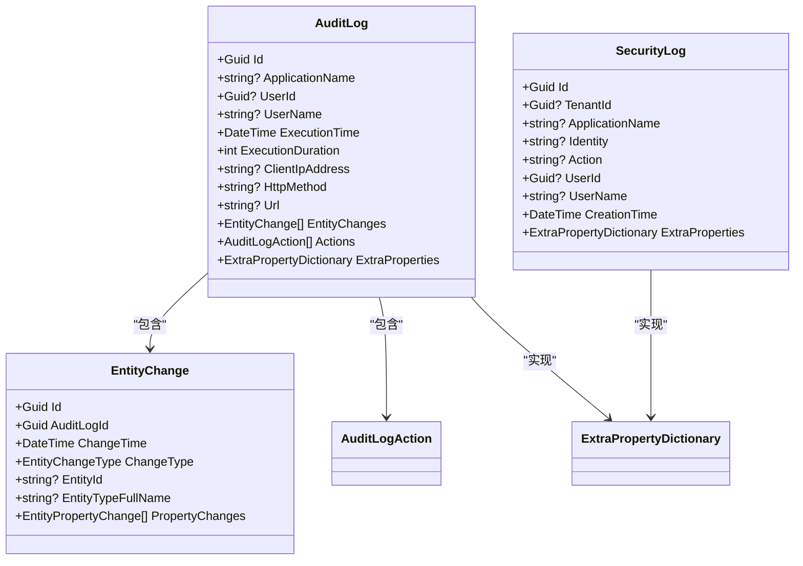
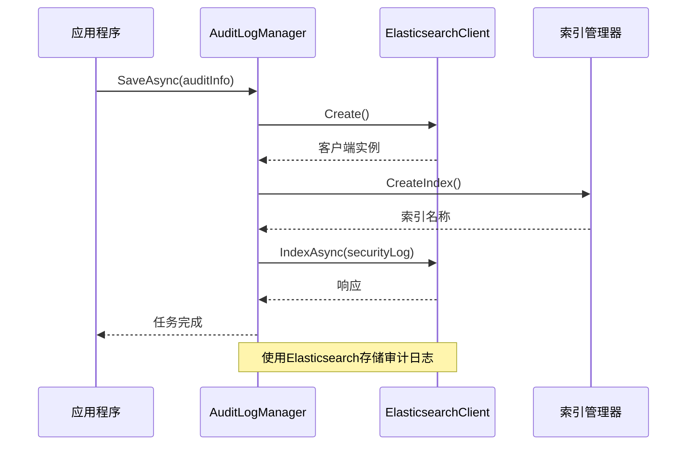
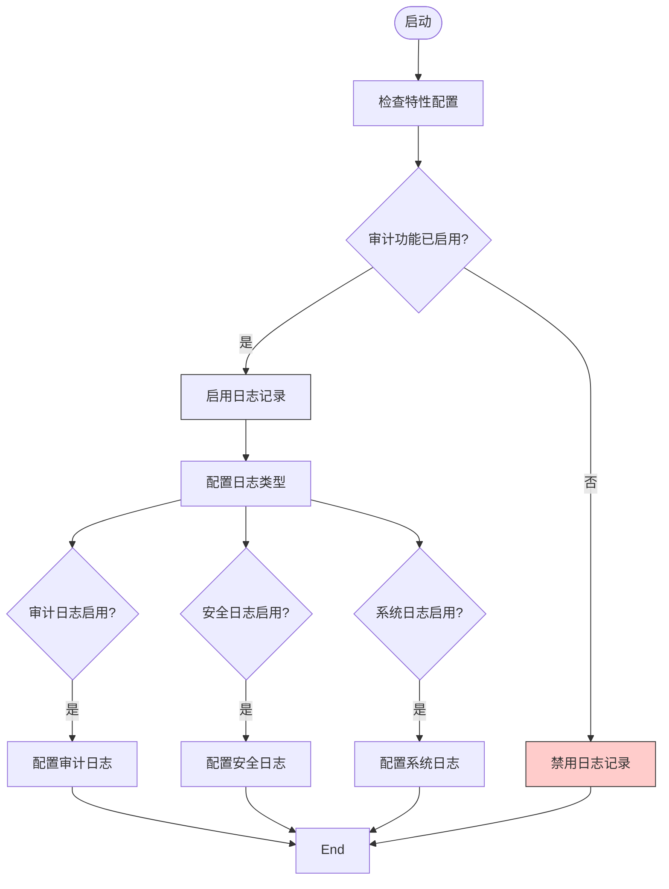
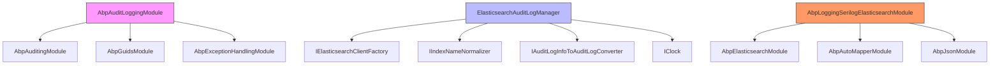

# 审计与监控

<cite>
**本文档引用的文件**
- [AbpAuditLoggingModule.cs](file://aspnet-core/framework/auditing/LINGYUN.Abp.AuditLogging/LINGYUN/Abp/AuditLogging/AbpAuditLoggingModule.cs)
- [AuditLog.cs](file://aspnet-core/framework/auditing/LINGYUN.Abp.AuditLogging/LINGYUN/Abp/AuditLogging/AuditLog.cs)
- [SecurityLog.cs](file://aspnet-core/framework/auditing/LINGYUN.Abp.AuditLogging/LINGYUN/Abp/AuditLogging/SecurityLog.cs)
- [DefaultAuditLogManager.cs](file://aspnet-core/framework/auditing/LINGYUN.Abp.AuditLogging/LINGYUN/Abp/AuditLogging/DefaultAuditLogManager.cs)
- [DefaultSecurityLogManager.cs](file://aspnet-core/framework/auditing/LINGYUN.Abp.AuditLogging/LINGYUN/Abp/AuditLogging/DefaultSecurityLogManager.cs)
- [ElasticsearchAuditLogManager.cs](file://aspnet-core/framework/auditing/LINGYUN.Abp.AuditLogging.Elasticsearch/LINGYUN/Abp/AuditLogging/Elasticsearch/ElasticsearchAuditLogManager.cs)
- [ElasticsearchSecurityLogManager.cs](file://aspnet-core/framework/auditing/LINGYUN.Abp.AuditLogging.Elasticsearch/LINGYUN/Abp/AuditLogging/Elasticsearch/ElasticsearchSecurityLogManager.cs)
- [EntityChange.cs](file://aspnet-core/framework/auditing/LINGYUN.Abp.AuditLogging/LINGYUN/Abp/AuditLogging/EntityChange.cs)
- [AuditingFeatureDefinitionProvider.cs](file://aspnet-core/modules/auditing/LINGYUN.Abp.Auditing.Application.Contracts/LINGYUN/Abp/Auditing/Features/AuditingFeatureDefinitionProvider.cs)
- [SerilogElasticsearchLoggingManager.cs](file://aspnet-core/framework/logging/LINGYUN.Abp.Logging.Serilog.Elasticsearch/LINGYUN/Abp/AuditLogging/Serilog/Elasticsearch/SerilogElasticsearchLoggingManager.cs)
- [AbpUINavigationVueVbenAdminNavigationDefinitionProvider.cs](file://aspnet-core/modules/platform/LINGYUN.Abp.UI.Navigation.VueVbenAdmin/LINGYUN/Abp/UI/Navigation/VueVbenAdmin/AbpUINavigationVueVbenAdminNavigationDefinitionProvider.cs)
</cite>

## 目录
1. [引言](#引言)
2. [项目结构](#项目结构)
3. [核心组件](#核心组件)
4. [架构概述](#架构概述)
5. [详细组件分析](#详细组件分析)
6. [依赖分析](#依赖分析)
7. [性能考虑](#性能考虑)
8. [故障排除指南](#故障排除指南)
9. [结论](#结论)

## 引言
本文档全面介绍了ABP框架中的审计与监控系统，重点阐述了安全事件日志记录机制、异常行为检测和告警系统、安全日志的存储与检索方法、安全仪表板实现以及安全事件响应流程。该系统为微服务架构提供了完整的审计跟踪和实时监控能力。

## 项目结构
审计与监控功能主要分布在框架的核心模块中，采用分层架构设计，包括基础审计日志、安全日志、实体变更跟踪和Elasticsearch集成等组件。

**图示来源**
- [AbpAuditLoggingModule.cs](file://aspnet-core/framework/auditing/LINGYUN.Abp.AuditLogging/LINGYUN/Abp/AuditLogging/AbpAuditLoggingModule.cs)
- [AbpUINavigationVueVbenAdminNavigationDefinitionProvider.cs](file://aspnet-core/modules/platform/LINGYUN.Abp.UI.Navigation.VueVbenAdmin/LINGYUN/Abp/UI/Navigation/VueVbenAdmin/AbpUINavigationVueVbenAdminNavigationDefinitionProvider.cs)

**章节来源**
- [AbpAuditLoggingModule.cs](file://aspnet-core/framework/auditing/LINGYUN.Abp.AuditLogging/LINGYUN/Abp/AuditLogging/AbpAuditLoggingModule.cs)
- [AbpUINavigationVueVbenAdminNavigationDefinitionProvider.cs](file://aspnet-core/modules/platform/LINGYUN.Abp.UI.Navigation.VueVbenAdmin/LINGYUN/Abp/UI/Navigation/VueVbenAdmin/AbpUINavigationVueVbenAdminNavigationDefinitionProvider.cs)

## 核心组件
系统的核心组件包括审计日志、安全日志、实体变更跟踪和Elasticsearch集成管理器。这些组件共同构成了完整的审计与监控体系，支持对关键操作的全面跟踪和分析。

**章节来源**
- [AuditLog.cs](file://aspnet-core/framework/auditing/LINGYUN.Abp.AuditLogging/LINGYUN/Abp/AuditLogging/AuditLog.cs)
- [SecurityLog.cs](file://aspnet-core/framework/auditing/LINGYUN.Abp.AuditLogging/LINGYUN/Abp/AuditLogging/SecurityLog.cs)
- [EntityChange.cs](file://aspnet-core/framework/auditing/LINGYUN.Abp.AuditLogging/LINGYUN/Abp/AuditLogging/EntityChange.cs)

## 架构概述
系统采用分层架构设计，从数据采集到存储再到展示形成完整闭环。通过模块化设计实现了功能解耦，支持灵活的存储后端替换。

**图示来源**
- [DefaultAuditLogManager.cs](file://aspnet-core/framework/auditing/LINGYUN.Abp.AuditLogging/LINGYUN/Abp/AuditLogging/DefaultAuditLogManager.cs)
- [ElasticsearchAuditLogManager.cs](file://aspnet-core/framework/auditing/LINGYUN.Abp.AuditLogging.Elasticsearch/LINGYUN/Abp/AuditLogging/Elasticsearch/ElasticsearchAuditLogManager.cs)
- [SerilogElasticsearchLoggingManager.cs](file://aspnet-core/framework/logging/LINGYUN.Abp.Logging.Serilog.Elasticsearch/LINGYUN/Abp/AuditLogging/Serilog/Elasticsearch/SerilogElasticsearchLoggingManager.cs)

## 详细组件分析
### 审计日志组件分析
审计日志组件负责记录所有关键业务操作的详细信息，包括请求上下文、执行时间和结果状态等。

#### 数据模型

**图示来源**
- [AuditLog.cs](file://aspnet-core/framework/auditing/LINGYUN.Abp.AuditLogging/LINGYUN/Abp/AuditLogging/AuditLog.cs)
- [SecurityLog.cs](file://aspnet-core/framework/auditing/LINGYUN.Abp.AuditLogging/LINGYUN/Abp/AuditLogging/SecurityLog.cs)
- [EntityChange.cs](file://aspnet-core/framework/auditing/LINGYUN.Abp.AuditLogging/LINGYUN/Abp/AuditLogging/EntityChange.cs)

#### 管理器实现

**图示来源**
- [ElasticsearchAuditLogManager.cs](file://aspnet-core/framework/auditing/LINGYUN.Abp.AuditLogging.Elasticsearch/LINGYUN/Abp/AuditLogging/Elasticsearch/ElasticsearchAuditLogManager.cs)
- [ElasticsearchSecurityLogManager.cs](file://aspnet-core/framework/auditing/LINGYUN.Abp.AuditLogging.Elasticsearch/LINGYUN/Abp/AuditLogging/Elasticsearch/ElasticsearchSecurityLogManager.cs)

**章节来源**
- [ElasticsearchAuditLogManager.cs](file://aspnet-core/framework/auditing/LINGYUN.Abp.AuditLogging.Elasticsearch/LINGYUN/Abp/AuditLogging/Elasticsearch/ElasticsearchAuditLogManager.cs)
- [ElasticsearchSecurityLogManager.cs](file://aspnet-core/framework/auditing/LINGYUN.Abp.AuditLogging.Elasticsearch/LINGYUN/Abp/AuditLogging/Elasticsearch/ElasticsearchSecurityLogManager.cs)

### 特性管理组件
特性管理组件提供了对审计功能的动态控制能力，支持按需启用或禁用不同类型的日志记录。

**图示来源**
- [AuditingFeatureDefinitionProvider.cs](file://aspnet-core/modules/auditing/LINGYUN.Abp.Auditing.Application.Contracts/LINGYUN/Abp/Auditing/Features/AuditingFeatureDefinitionProvider.cs)

**章节来源**
- [AuditingFeatureDefinitionProvider.cs](file://aspnet-core/modules/auditing/LINGYUN.Abp.Auditing.Application.Contracts/LINGYUN/Abp/Auditing/Features/AuditingFeatureDefinitionProvider.cs)

## 依赖分析
系统依赖关系清晰，各组件之间通过接口进行通信，实现了良好的解耦。

**图示来源**
- [AbpAuditLoggingModule.cs](file://aspnet-core/framework/auditing/LINGYUN.Abp.AuditLogging/LINGYUN/Abp/AuditLogging/AbpAuditLoggingModule.cs)
- [AbpLoggingSerilogElasticsearchModule.cs](file://aspnet-core/framework/logging/LINGYUN.Abp.Logging.Serilog.Elasticsearch/LINGYUN/Abp/AuditLogging/Serilog/Elasticsearch/AbpLoggingSerilogElasticsearchModule.cs)

**章节来源**
- [AbpAuditLoggingModule.cs](file://aspnet-core/framework/auditing/LINGYUN.Abp.AuditLogging/LINGYUN/Abp/AuditLogging/AbpAuditLoggingModule.cs)
- [AbpLoggingSerilogElasticsearchModule.cs](file://aspnet-core/framework/logging/LINGYUN.Abp.Logging.Serilog.Elasticsearch/LINGYUN/Abp/AuditLogging/Serilog/Elasticsearch/AbpLoggingSerilogElasticsearchModule.cs)

## 性能考虑
系统在设计时充分考虑了性能因素，通过异步操作、批量处理和索引优化等手段确保高并发场景下的稳定运行。

- **异步写入**: 所有日志写入操作均为异步执行，避免阻塞主业务流程
- **批量处理**: 支持批量日志写入，减少数据库连接开销
- **索引优化**: 针对常用查询字段建立Elasticsearch索引，提升查询效率
- **缓存机制**: 对频繁访问的日志数据进行缓存，降低数据库压力
- **分页查询**: 提供分页查询接口，避免一次性加载大量数据

## 故障排除指南
当遇到审计与监控相关问题时，可按照以下步骤进行排查：

1. **检查特性配置**: 确认审计功能是否已正确启用
2. **验证Elasticsearch连接**: 检查Elasticsearch集群是否可达
3. **查看日志输出**: 检查应用程序日志中是否有相关错误信息
4. **确认索引状态**: 验证Elasticsearch索引是否存在且状态正常
5. **检查权限设置**: 确保应用服务具有足够的权限访问日志数据

**章节来源**
- [DefaultAuditLogManager.cs](file://aspnet-core/framework/auditing/LINGYUN.Abp.AuditLogging/LINGYUN/Abp/AuditLogging/DefaultAuditLogManager.cs)
- [DefaultSecurityLogManager.cs](file://aspnet-core/framework/auditing/LINGYUN.Abp.AuditLogging/LINGYUN/Abp/AuditLogging/DefaultSecurityLogManager.cs)

## 结论
本系统提供了一套完整的审计与监控解决方案，涵盖了从日志采集、存储到展示的全流程。通过模块化设计和Elasticsearch集成，实现了高性能、可扩展的安全审计能力。系统支持灵活的配置管理和实时监控，能够有效满足企业级应用的安全合规需求。