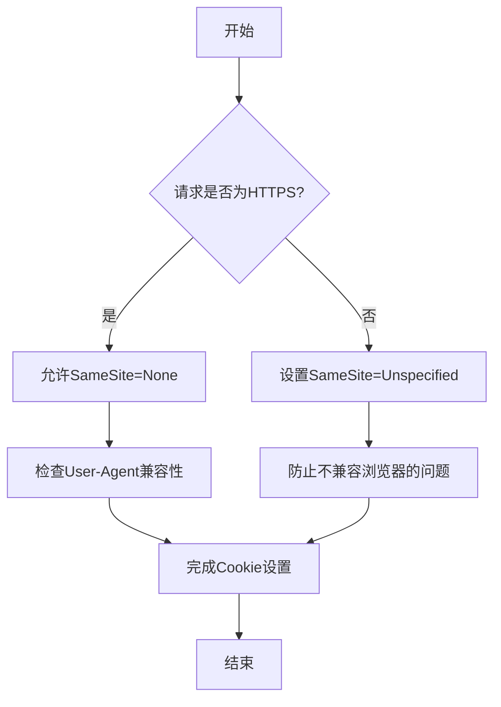
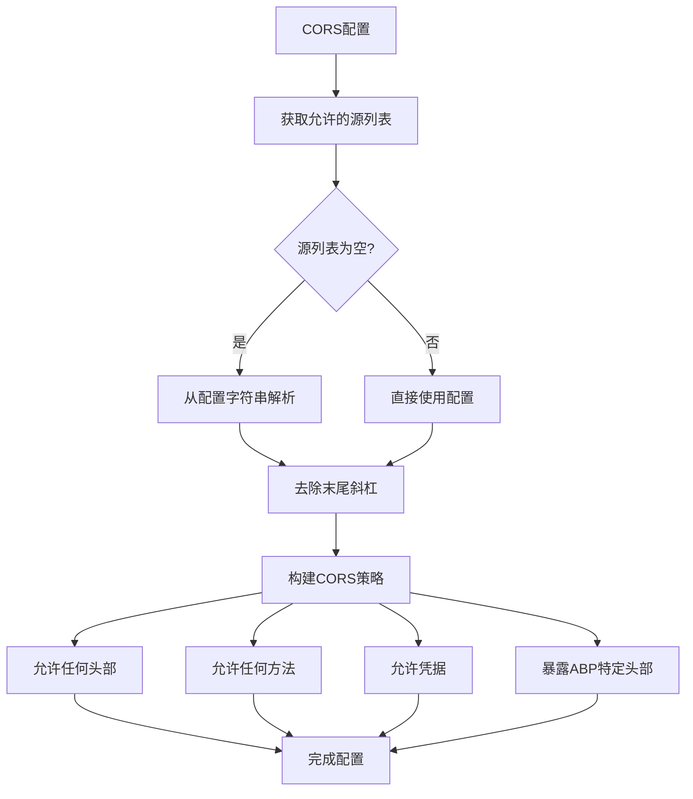
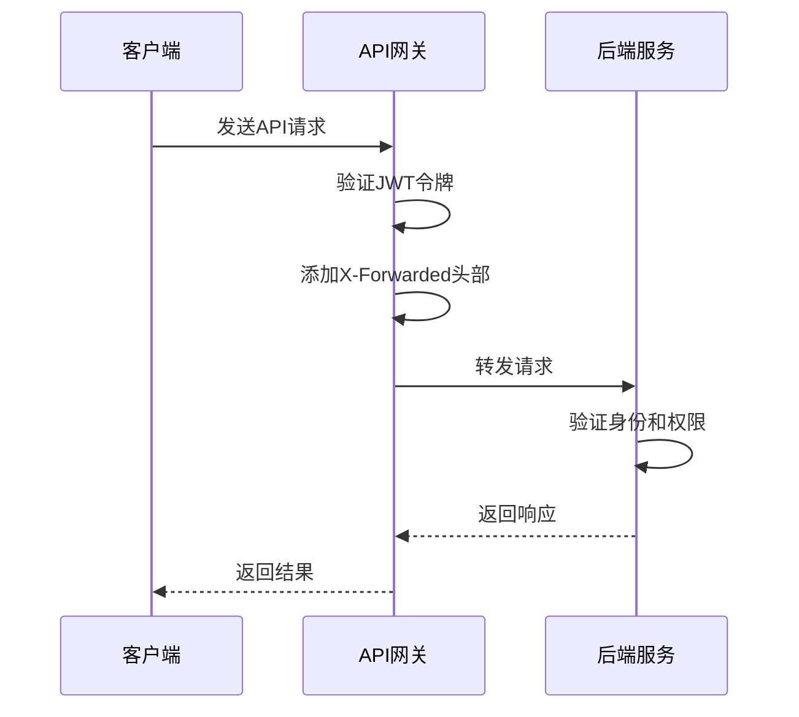
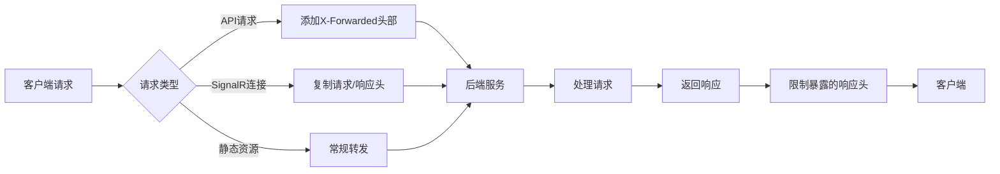
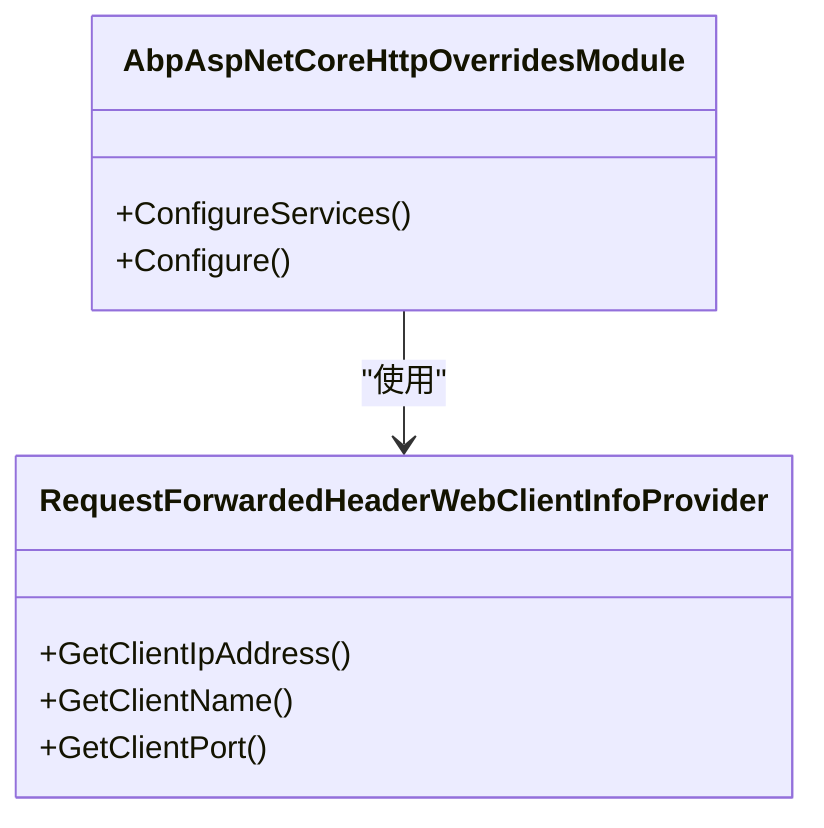
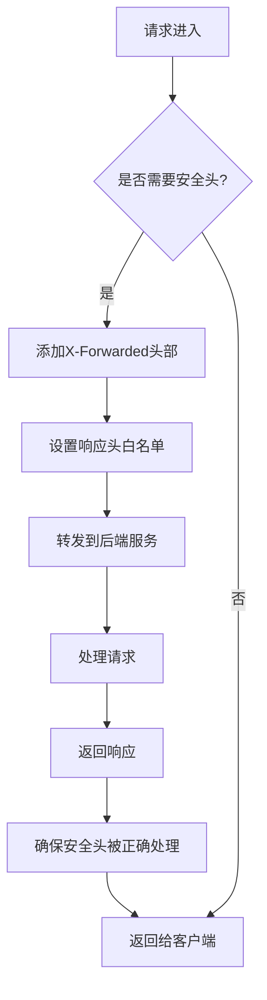

# 网络防护

<cite>
**本文档中引用的文件**  
- [SameSiteCookiesServiceCollectionExtensions.cs](file://aspnet-core\services\LY.MicroService.AuthServer\Microsoft\Extensions\DependencyInjection\SameSiteCookiesServiceCollectionExtensions.cs)
- [IdentityServerModule.Configure.cs](file://aspnet-core\services\LY.MicroService.IdentityServer\IdentityServerModule.Configure.cs)
- [AbpAspNetCoreHttpOverridesModule.cs](file://aspnet-core\framework\common\LINGYUN.Abp.AspNetCore.HttpOverrides\LINGYUN\Abp\AspNetCore\HttpOverrides\AbpAspNetCoreHttpOverridesModule.cs)
- [yarp.json](file://gateways\internal\LINGYUN.MicroService.Internal.ApiGateway\src\LINGYUN.MicroService.Internal.Gateway\yarp.json)
- [ocelot.json](file://gateways\internal\LINGYUN.MicroService.Internal.ApiGateway\src\LINGYUN.MicroService.Internal.ApiGateway\ocelot.json)
</cite>

## 目录
1. [引言](#引言)
2. [HTTPS强制重定向与HSTS头设置](#https强制重定向与hsts头设置)
3. [CORS策略配置](#cors策略配置)
4. [CSRF防护机制](#csrf防护机制)
5. [内容安全策略(CSP)与XSS防护](#内容安全策略csp与xss防护)
6. [安全头信息设置](#安全头信息设置)

## 引言
本项目是一个基于ABP框架的微服务管理平台，提供了完整的网络防护机制。系统通过多层安全策略确保Web应用的安全性，包括HTTPS强制、CORS跨域控制、CSRF防护、安全头设置等。本文档详细说明了这些安全功能的实现原理和配置方法。

## HTTPS强制重定向与HSTS头设置
系统通过Cookie策略和请求处理机制实现了对HTTPS的强制要求。当检测到非HTTPS请求时，系统会自动调整Cookie的SameSite属性以增强安全性。

在`SameSiteCookiesServiceCollectionExtensions.cs`文件中，系统实现了对SameSite Cookie策略的精细控制：

**图示来源**
- [SameSiteCookiesServiceCollectionExtensions.cs](file://aspnet-core\services\LY.MicroService.AuthServer\Microsoft\Extensions\DependencyInjection\SameSiteCookiesServiceCollectionExtensions.cs#L0-L69)

该机制特别针对以下情况进行了优化：
- iOS 12上的Safari、WkWebview和Chrome浏览器
- macOS 10.14上使用Mac OS网络堆栈的Safari浏览器
- Chrome 50-69版本

对于这些可能存在兼容性问题的浏览器，即使在HTTPS环境下也会将SameSite设置为Unspecified，以避免认证问题。

**章节来源**
- [SameSiteCookiesServiceCollectionExtensions.cs](file://aspnet-core\services\LY.MicroService.AuthServer\Microsoft\Extensions\DependencyInjection\SameSiteCookiesServiceCollectionExtensions.cs#L0-L69)

## CORS策略配置
系统通过统一的CORS配置实现了跨域资源共享的安全控制。在多个服务模块中都实现了相似的CORS策略配置。

**图示来源**
- [IdentityServerModule.Configure.cs](file://aspnet-core\services\LY.MicroService.IdentityServer\IdentityServerModule.Configure.cs#L391-L407)

CORS配置的主要特点包括：
- 支持通配子域名：通过`SetIsOriginAllowedToAllowWildcardSubdomains()`方法实现
- 暴露ABP特定头部：使用`WithAbpExposedHeaders()`和`WithAbpWrapExposedHeaders()`方法
- 允许凭据传输：通过`AllowCredentials()`方法支持身份验证信息的跨域传递
- 动态源配置：从配置文件中读取允许的源列表，支持逗号分隔的多个源

这种配置方式既保证了必要的跨域功能，又通过限制暴露的头部和严格的源验证确保了安全性。

**章节来源**
- [IdentityServerModule.Configure.cs](file://aspnet-core\services\LY.MicroService.IdentityServer\IdentityServerModule.Configure.cs#L391-L407)
- [WorkflowManagementHttpApiHostModule.Configure.cs](file://aspnet-core\services\LY.MicroService.WorkflowManagement.HttpApi.Host\WorkflowManagementHttpApiHostModule.Configure.cs#L517-L537)

## CSRF防护机制
虽然项目中没有直接的CSRF防护代码，但通过JWT认证和API网关的转发机制间接实现了CSRF防护。

在API网关配置中，系统通过YARP和Ocelot实现了请求转发和安全控制：

**图示来源**
- [yarp.json](file://gateways\internal\LINGYUN.MicroService.Internal.ApiGateway\src\LINGYUN.MicroService.Internal.Gateway\yarp.json)
- [ocelot.json](file://gateways\internal\LINGYUN.MicroService.Internal.ApiGateway\src\LINGYUN.MicroService.Internal.ApiGateway\ocelot.json)

关键安全特性：
- 使用JWT进行身份验证，避免了基于Cookie的会话管理
- API网关作为单一入口点，集中处理安全策略
- 请求转发时添加`X-Forwarded-*`头部，保留原始请求信息
- 限制响应头的暴露，只允许必要的ABP包装结果头部

**章节来源**
- [yarp.json](file://gateways\internal\LINGYUN.MicroService.Internal.ApiGateway\src\LINGYUN.MicroService.Internal.Gateway\yarp.json)
- [ocelot.json](file://gateways\internal\LINGYUN.MicroService.Internal.ApiGateway\src\LINGYUN.MicroService.Internal.ApiGateway\ocelot.json)

## 内容安全策略(CSP)与XSS防护
系统通过多层机制防范XSS攻击，主要包括输入验证、输出编码和安全头设置。

在反向代理配置中，系统实现了请求和响应的转换规则：

**图示来源**
- [yarp.json](file://gateways\internal\LINGYUN.MicroService.Internal.ApiGateway\src\LINGYUN.MicroService.Internal.Gateway\yarp.json)

安全特性包括：
- 限制暴露的响应头，只允许`_AbpWrapResult`、`_AbpDontWrapResult`和`_AbpErrorFormat`
- 对SignalR连接启用请求和响应头复制，确保实时通信的安全性
- 使用反向代理隐藏后端服务的真实地址
- 通过JWT认证确保只有授权用户才能访问API

**章节来源**
- [yarp.json](file://gateways\internal\LINGYUN.MicroService.Internal.ApiGateway\src\LINGYUN.MicroService.Internal.Gateway\yarp.json)
- [ocelot.json](file://gateways\internal\LINGYUN.MicroService.Internal.ApiGateway\src\LINGYUN.MicroService.Internal.ApiGateway\ocelot.json)

## 安全头信息设置
系统通过多种方式设置了关键的安全头信息，包括X-Content-Type-Options、X-Frame-Options等。

### X-Forwarded头部处理
系统通过`AbpAspNetCoreHttpOverridesModule`模块处理转发的请求头：

**图示来源**
- [AbpAspNetCoreHttpOverridesModule.cs](file://aspnet-core\framework\common\LINGYUN.Abp.AspNetCore.HttpOverrides\LINGYUN\Abp\AspNetCore\HttpOverrides\AbpAspNetCoreHttpOverridesModule.cs)
- [RequestForwardedHeaderWebClientInfoProvider.cs](file://aspnet-core\framework\common\LINGYUN.Abp.AspNetCore.HttpOverrides\LINGYUN\Abp\AspNetCore\WebClientInfo\RequestForwardedHeaderWebClientInfoProvider.cs)

主要功能：
- 配置`ForwardedHeadersOptions`以处理代理转发的头部
- 替换默认的客户端信息提供者，正确识别通过代理的客户端IP地址
- 支持X-Forwarded-For、X-Forwarded-Proto等标准头部

### 安全头配置
在网关级别，系统配置了多种安全相关的头部：

**图示来源**
- [yarp.json](file://gateways\internal\LINGYUN.MicroService.Internal.ApiGateway\src\LINGYUN.MicroService.Internal.Gateway\yarp.json)

安全头策略包括：
- 使用`X-Forwarded-*`头部传递原始请求信息
- 严格控制响应头的暴露，防止敏感信息泄露
- 通过网关统一处理安全策略，减轻后端服务的负担
- 支持WebSocket连接的安全转发

**章节来源**
- [AbpAspNetCoreHttpOverridesModule.cs](file://aspnet-core\framework\common\LINGYUN.Abp.AspNetCore.HttpOverrides\LINGYUN\Abp\AspNetCore\HttpOverrides\AbpAspNetCoreHttpOverridesModule.cs#L0-L26)
- [yarp.json](file://gateways\internal\LINGYUN.MicroService.Internal.ApiGateway\src\LINGYUN.MicroService.Internal.Gateway\yarp.json)