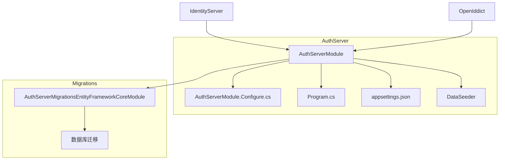

# 认证服务

<cite>
**本文档中引用的文件**   
- [AuthServerModule.cs](file://aspnet-core/services/LY.MicroService.AuthServer/AuthServerModule.cs)
- [AuthServerModule.Configure.cs](file://aspnet-core/services/LY.MicroService.AuthServer/AuthServerModule.Configure.cs)
- [Program.cs](file://aspnet-core/services/LY.MicroService.AuthServer/Program.cs)
- [appsettings.json](file://aspnet-core/services/LY.MicroService.AuthServer/appsettings.json)
- [AuthServerDataSeedContributor.cs](file://aspnet-core/services/LY.MicroService.AuthServer/DataSeeder/AuthServerDataSeedContributor.cs)
- [AuthServerMigrationsEntityFrameworkCoreModule.cs](file://aspnet-core/migrations/LY.MicroService.AuthServer.EntityFrameworkCore/AuthServerMigrationsEntityFrameworkCoreModule.cs)
- [IdentityServerHttpApiHostModule.Configure.cs](file://aspnet-core/services/LY.MicroService.IdentityServer.HttpApi.Host/IdentityServerHttpApiHostModule.Configure.cs)
</cite>

## 目录
1. [简介](#简介)
2. [项目结构](#项目结构)
3. [核心组件](#核心组件)
4. [架构概述](#架构概述)
5. [详细组件分析](#详细组件分析)
6. [依赖分析](#依赖分析)
7. [性能考虑](#性能考虑)
8. [故障排除指南](#故障排除指南)
9. [结论](#结论)

## 简介
认证服务是微服务架构中的核心安全组件，负责处理身份验证、令牌管理和安全策略。该服务基于OpenIddict框架实现OAuth 2.0和OpenID Connect协议，为整个系统提供统一的认证和授权机制。

## 项目结构
认证服务采用分层架构设计，包含数据迁移、核心业务逻辑和API主机等组件。服务通过Entity Framework Core与数据库交互，并使用Redis进行分布式缓存和会话管理。



**图表来源**
- [AuthServerModule.cs](file://aspnet-core/services/LY.MicroService.AuthServer/AuthServerModule.cs)
- [AuthServerMigrationsEntityFrameworkCoreModule.cs](file://aspnet-core/migrations/LY.MicroService.AuthServer.EntityFrameworkCore/AuthServerMigrationsEntityFrameworkCoreModule.cs)

**章节来源**
- [AuthServerModule.cs](file://aspnet-core/services/LY.MicroService.AuthServer/AuthServerModule.cs)
- [AuthServerModule.Configure.cs](file://aspnet-core/services/LY.MicroService.AuthServer/AuthServerModule.Configure.cs)

## 核心组件
认证服务的核心组件包括AuthServerModule、OpenIddict配置、身份验证流程和令牌管理机制。服务支持多种认证方式，包括密码认证、短信验证码认证和第三方登录。

**章节来源**
- [AuthServerModule.cs](file://aspnet-core/services/LY.MicroService.AuthServer/AuthServerModule.cs)
- [AuthServerModule.Configure.cs](file://aspnet-core/services/LY.MicroService.AuthServer/AuthServerModule.Configure.cs)

## 架构概述
认证服务采用微服务架构，与其他服务通过API网关进行通信。服务实现了OAuth 2.0的多种授权模式，包括授权码模式、密码模式和客户端凭证模式。

```mermaid
graph TD
    A[客户端应用] -->|授权请求| B(AuthServer)
    B -->|重定向| C[登录页面]
    C -->|凭证提交| B
    B -->|颁发令牌| A
    B