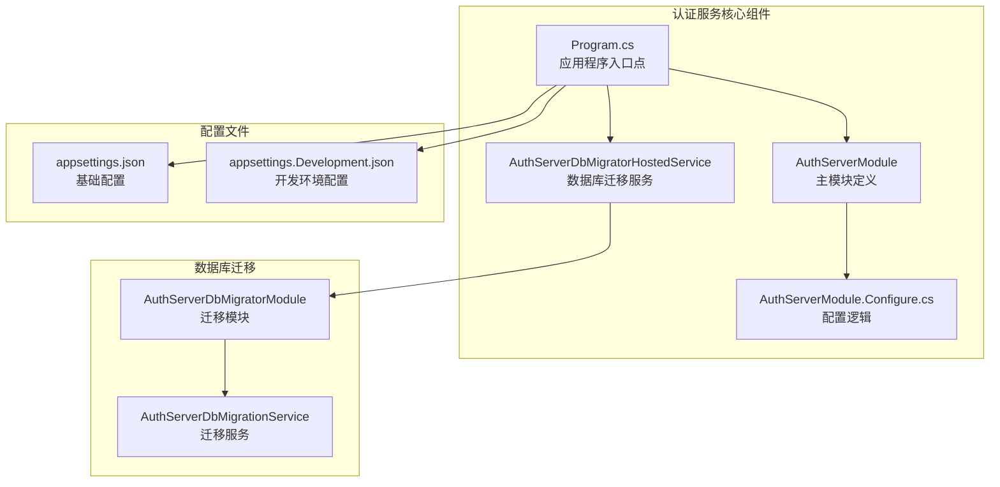
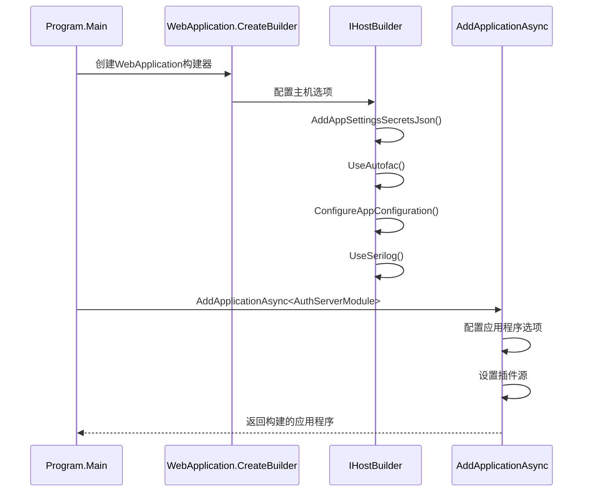
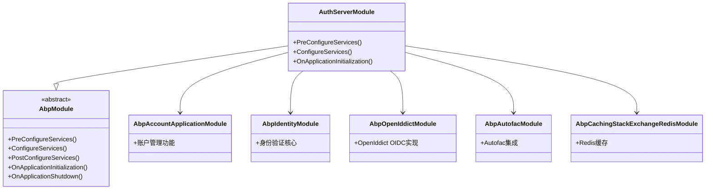
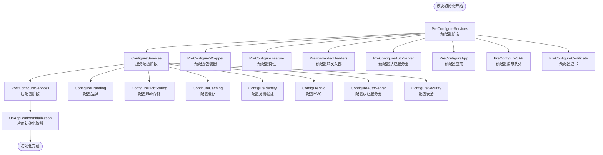
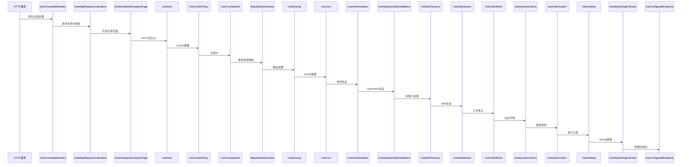
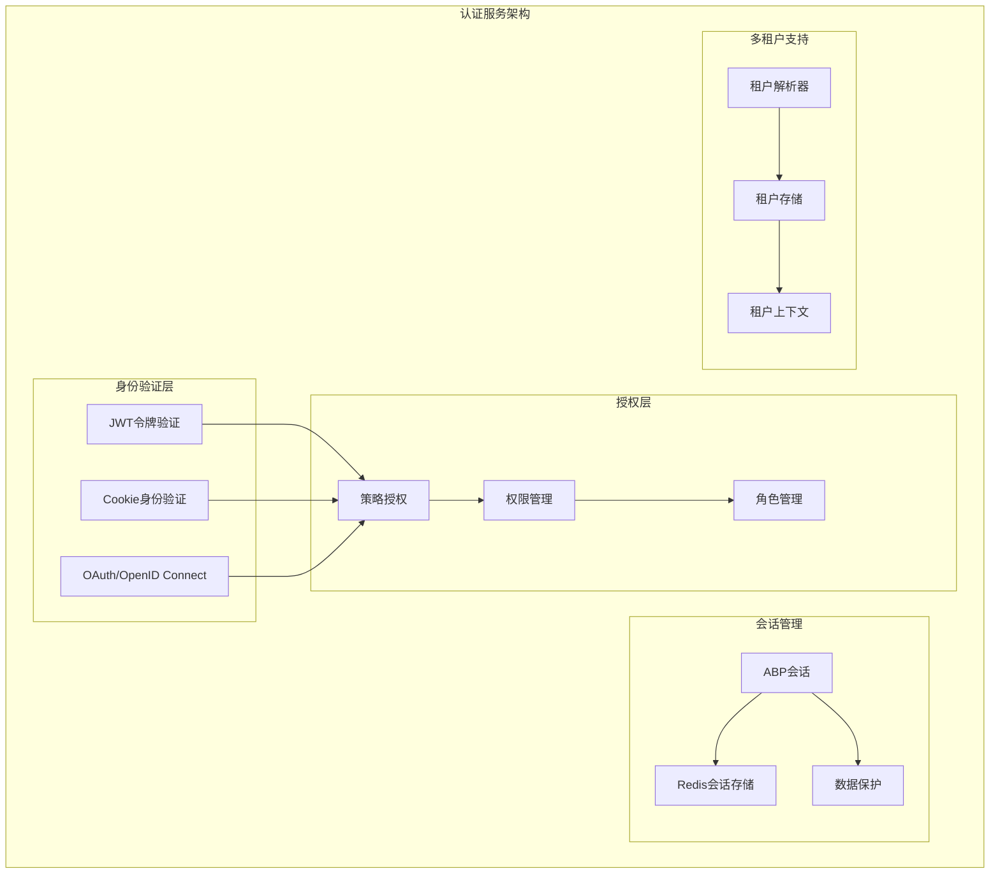

# 认证服务启动流程

<cite>
**本文档中引用的文件**
- [Program.cs](file://aspnet-core/services/LY.MicroService.AuthServer/Program.cs)
- [AuthServerModule.cs](file://aspnet-core/services/LY.MicroService.AuthServer/AuthServerModule.cs)
- [AuthServerModule.Configure.cs](file://aspnet-core/services/LY.MicroService.AuthServer/AuthServerModule.Configure.cs)
- [AuthServerDbMigratorHostedService.cs](file://aspnet-core/migrations/LY.MicroService.AuthServer.DbMigrator/AuthServerDbMigratorHostedService.cs)
- [AuthServerDbMigratorModule.cs](file://aspnet-core/migrations/LY.MicroService.AuthServer.DbMigrator/AuthServerDbMigratorModule.cs)
- [appsettings.json](file://aspnet-core/services/LY.MicroService.AuthServer/appsettings.json)
</cite>

## 目录
1. [简介](#简介)
2. [项目结构概览](#项目结构概览)
3. [启动入口点分析](#启动入口点分析)
4. [应用程序构建过程](#应用程序构建过程)
5. [模块初始化与依赖注入](#模块初始化与依赖注入)
6. [中间件配置与执行顺序](#中间件配置与执行顺序)
7. [认证服务架构](#认证服务架构)
8. [启动时序图](#启动时序图)
9. [常见问题与解决方案](#常见问题与解决方案)
10. [总结](#总结)

## 简介

本文档详细分析了ABP框架下认证服务的启动流程，从Program.cs的入口点开始，逐步说明主机构建、服务注册、中间件配置和模块初始化的完整过程。重点描述ABP框架的模块加载机制在认证服务中的应用，包括模块依赖顺序和配置阶段执行流程。

认证服务采用微服务架构，基于ABP框架构建，支持多种身份验证方式（JWT、Cookie、OAuth等），并集成了OpenIddict作为OIDC协议实现。服务启动过程涉及多个阶段：应用程序构建、模块初始化、服务注册、中间件配置和应用运行。

## 项目结构概览

认证服务位于`aspnet-core/services/LY.MicroService.AuthServer`目录下，包含以下关键组件：



**图表来源**
- [Program.cs](file://aspnet-core/services/LY.MicroService.AuthServer/Program.cs#L1-L75)
- [AuthServerModule.cs](file://aspnet-core/services/LY.MicroService.AuthServer/AuthServerModule.cs#L1-L157)

## 启动入口点分析

认证服务的启动入口点位于`Program.cs`文件中，这是一个标准的ASP.NET Core应用程序入口点：

```csharp
public async static Task<int> Main(string[] args)
{
    try
    {
        Console.Title = "AuthServer";
        Log.Information("Starting AuthServer.");
        
        var builder = WebApplication.CreateBuilder(args);
        // 配置主机选项
        builder.Host.AddAppSettingsSecretsJson()
            .UseAutofac()
            .ConfigureAppConfiguration((context, config) =>
            {
                if (context.Configuration.GetValue("AgileConfig:IsEnabled", false))
                {
                    config.AddAgileConfig(new AgileConfig.Client.ConfigClient(context.Configuration));
                }
            })
            .UseSerilog((context, provider, config) =>
            {
                config.ReadFrom.Configuration(context.Configuration);
            });
            
        // 添加ABP应用程序
        await builder.AddApplicationAsync<AuthServerModule>(options =>
        {
            // 应用程序名称配置
            AuthServerModule.ApplicationName = Environment.GetEnvironmentVariable("APPLICATION_NAME")
                ?? AuthServerModule.ApplicationName;
            options.ApplicationName = AuthServerModule.ApplicationName;
            
            // 用户机密配置
            options.Configuration.UserSecretsId = Environment.GetEnvironmentVariable("APPLICATION_USER_SECRETS_ID");
            options.Configuration.UserSecretsAssembly = typeof(AuthServerModule).Assembly;
            
            // 插件目录配置
            var pluginFolder = Path.Combine(Directory.GetCurrentDirectory(), "Modules");
            DirectoryHelper.CreateIfNotExists(pluginFolder);
            options.PlugInSources.AddFolder(pluginFolder, SearchOption.AllDirectories);
        });
        
        var app = builder.Build();
        await app.InitializeApplicationAsync();
        await app.RunAsync();
        return 0;
    }
    catch (Exception ex)
    {
        Log.Fatal(ex, "Host terminated unexpectedly!");
        return 1;
    }
    finally
    {
        Log.CloseAndFlush();
    }
}
```

**节来源**
- [Program.cs](file://aspnet-core/services/LY.MicroService.AuthServer/Program.cs#L15-L75)

## 应用程序构建过程

应用程序构建过程分为以下几个关键步骤：

### 1. 主机构建



**图表来源**
- [Program.cs](file://aspnet-core/services/LY.MicroService.AuthServer/Program.cs#L20-L45)

### 2. 主机配置

应用程序使用以下配置策略：

- **配置源优先级**：appsettings.json → 环境变量 → 用户机密 → AgileConfig
- **依赖注入容器**：使用Autofac作为IoC容器
- **日志系统**：集成Serilog进行结构化日志记录
- **插件支持**：支持动态加载Modules目录下的插件模块

### 3. ABP应用程序初始化

```csharp
await builder.AddApplicationAsync<AuthServerModule>(options =>
{
    // 应用程序名称配置
    AuthServerModule.ApplicationName = Environment.GetEnvironmentVariable("APPLICATION_NAME")
        ?? AuthServerModule.ApplicationName;
    options.ApplicationName = AuthServerModule.ApplicationName;
    
    // 用户机密配置
    options.Configuration.UserSecretsId = Environment.GetEnvironmentVariable("APPLICATION_USER_SECRETS_ID");
    options.Configuration.UserSecretsAssembly = typeof(AuthServerModule).Assembly;
    
    // 插件目录配置
    var pluginFolder = Path.Combine(Directory.GetCurrentDirectory(), "Modules");
    DirectoryHelper.CreateIfNotExists(pluginFolder);
    options.PlugInSources.AddFolder(pluginFolder, SearchOption.AllDirectories);
});
```

**节来源**
- [Program.cs](file://aspnet-core/services/LY.MicroService.AuthServer/Program.cs#L36-L50)

## 模块初始化与依赖注入

### 模块依赖关系

认证服务的核心模块`AuthServerModule`具有复杂的依赖关系：



**图表来源**
- [AuthServerModule.cs](file://aspnet-core/services/LY.MicroService.AuthServer/AuthServerModule.cs#L40-L70)

### 配置阶段执行流程

模块配置分为三个主要阶段：

1. **PreConfigureServices**：预配置阶段
2. **ConfigureServices**：服务配置阶段  
3. **OnApplicationInitialization**：应用初始化阶段



**图表来源**
- [AuthServerModule.cs](file://aspnet-core/services/LY.MicroService.AuthServer/AuthServerModule.cs#L72-L157)
- [AuthServerModule.Configure.cs](file://aspnet-core/services/LY.MicroService.AuthServer/AuthServerModule.Configure.cs#L1-L496)

**节来源**
- [AuthServerModule.cs](file://aspnet-core/services/LY.MicroService.AuthServer/AuthServerModule.cs#L72-L157)
- [AuthServerModule.Configure.cs](file://aspnet-core/services/LY.MicroService.AuthServer/AuthServerModule.Configure.cs#L40-L120)

## 中间件配置与执行顺序

### 认证中间件配置

认证服务的中间件配置在`OnApplicationInitialization`方法中完成：

```csharp
public override void OnApplicationInitialization(ApplicationInitializationContext context)
{
    var app = context.GetApplicationBuilder();
    var env = context.GetEnvironment();

    app.UseForwardedHeaders();
    app.UseMapRequestLocalization();
    if (env.IsDevelopment())
    {
        app.UseDeveloperExceptionPage();
    }
    else
    {
        app.UseHsts();
    }
    app.UseCookiePolicy();
    app.UseCorrelationId();
    app.MapAbpStaticAssets();
    app.UseRouting();
    app.UseCors();
    app.UseAuthentication();
    app.UseAbpOpenIddictValidation();
    app.UseMultiTenancy();
    app.UseAbpSession();
    app.UseUnitOfWork();
    app.UseDynamicClaims();
    app.UseAuthorization();
    app.UseAuditing();
    app.UseAbpSerilogEnrichers();
    app.UseConfiguredEndpoints();
}
```

### 中间件执行顺序



**图表来源**
- [AuthServerModule.cs](file://aspnet-core/services/LY.MicroService.AuthServer/AuthServerModule.cs#L118-L140)

### 关键认证中间件说明

1. **UseAuthentication**：启用ASP.NET Core的身份验证中间件
2. **UseAbpOpenIddictValidation**：集成OpenIddict的令牌验证
3. **UseAuthorization**：启用授权中间件进行权限控制
4. **UseAbpSession**：ABP会话管理
5. **UseDynamicClaims**：动态声明处理

**节来源**
- [AuthServerModule.cs](file://aspnet-core/services/LY.MicroService.AuthServer/AuthServerModule.cs#L118-L140)

## 认证服务架构

### 核心认证组件



### OpenIddict配置

认证服务使用OpenIddict作为OIDC协议实现：

```csharp
private void PreConfigureAuthServer()
{
    PreConfigure<OpenIddictBuilder>(builder =>
    {
        builder.AddValidation(options =>
        {
            options.UseLocalServer();
            options.UseAspNetCore();
            options.UseDataProtection();
        });
    });
}

private void ConfigureAuthServer(IConfiguration configuration)
{
    Configure<OpenIddictServerOptions>(options =>
    {
        var lifetime = configuration.GetSection("OpenIddict:Lifetime");
        options.AuthorizationCodeLifetime = lifetime.GetValue("AuthorizationCode", options.AuthorizationCodeLifetime);
        options.AccessTokenLifetime = lifetime.GetValue("AccessToken", options.AccessTokenLifetime);
        options.DeviceCodeLifetime = lifetime.GetValue("DeviceCode", options.DeviceCodeLifetime);
        options.IdentityTokenLifetime = lifetime.GetValue("IdentityToken", options.IdentityTokenLifetime);
        options.RefreshTokenLifetime = lifetime.GetValue("RefreshToken", options.RefreshTokenLifetime);
        options.RefreshTokenReuseLeeway = lifetime.GetValue("RefreshTokenReuseLeeway", options.RefreshTokenReuseLeeway);
        options.UserCodeLifetime = lifetime.GetValue("UserCode", options.UserCodeLifetime);
    });
}
```

**节来源**
- [AuthServerModule.Configure.cs](file://aspnet-core/services/LY.MicroService.AuthServer/AuthServerModule.Configure.cs#L85-L120)
- [AuthServerModule.Configure.cs](file://aspnet-core/services/LY.MicroService.AuthServer/AuthServerModule.Configure.cs#L375-L395)

## 启动时序图

以下是认证服务完整的启动时序图：

```mermaid
sequenceDiagram
participant Main as Program.Main
participant Builder as WebApplication构建器
participant Host as IHostBuilder
participant ABP as ABP应用程序
participant Module as AuthServerModule
participant Services as 服务容器
participant Middleware as 中间件管道
participant App as 应用程序实例
Main->>Builder : 创建WebApplication构建器
Builder->>Host : 配置主机选项
Host->>Host : 添加配置源
Host->>Host : 使用Autofac
Host->>Host : 配置Serilog
Main->>ABP : AddApplicationAsync<AuthServerModule>
ABP->>Module : 实例化模块
Module->>Module : PreConfigureServices
Module->>Services : 注册服务
Module->>Module : ConfigureServices
Module->>Services : 配置服务
Module->>Module : OnApplicationInitialization
ABP->>Middleware : 构建中间件管道
Middleware->>Middleware : UseForwardedHeaders
Middleware->>Middleware : UseAuthentication
Middleware->>Middleware : UseAuthorization
// ... 其他中间件
ABP->>App : InitializeApplicationAsync
App->>App : 初始化应用程序
App->>App : RunAsync
Note over Main,App : 启动成功，服务开始监听
```

**图表来源**
- [Program.cs](file://aspnet-core/services/LY.MicroService.AuthServer/Program.cs#L15-L75)
- [AuthServerModule.cs](file://aspnet-core/services/LY.MicroService.AuthServer/AuthServerModule.cs#L72-L157)

## 常见问题与解决方案

### 1. 配置缺失问题

**问题描述**：应用程序启动时找不到必要的配置项

**解决方案**：
- 检查appsettings.json文件是否存在
- 验证环境变量是否正确设置
- 确认用户机密配置是否可用

```csharp
// 检查配置源
options.Configuration.UserSecretsId = Environment.GetEnvironmentVariable("APPLICATION_USER_SECRETS_ID");
options.Configuration.UserSecretsAssembly = typeof(AuthServerModule).Assembly;
```

### 2. 数据库连接问题

**问题描述**：数据库连接失败导致应用程序无法启动

**解决方案**：
- 验证数据库连接字符串
- 确认数据库迁移服务正常运行
- 检查数据库权限设置

```csharp
// 数据库迁移服务示例
await application
    .ServiceProvider
    .GetRequiredService<AuthServerDbMigrationService>()
    .CheckAndApplyDatabaseMigrationsAsync();
```

### 3. 证书配置问题

**问题描述**：生产环境中SSL证书配置错误

**解决方案**：
- 确保证书文件存在且可访问
- 验证证书密码正确性
- 在开发环境中禁用传输安全要求

```csharp
PreConfigure<OpenIddictServerBuilder>(builder =>
{
    builder.UseAspNetCore()
        .DisableTransportSecurityRequirement();
});
```

### 4. 插件加载问题

**问题描述**：Modules目录下的插件无法正确加载

**解决方案**：
- 确认插件目录存在
- 检查插件DLL文件完整性
- 验证插件依赖项是否满足

```csharp
var pluginFolder = Path.Combine(Directory.GetCurrentDirectory(), "Modules");
DirectoryHelper.CreateIfNotExists(pluginFolder);
options.PlugInSources.AddFolder(pluginFolder, SearchOption.AllDirectories);
```

**节来源**
- [Program.cs](file://aspnet-core/services/LY.MicroService.AuthServer/Program.cs#L40-L50)
- [AuthServerModule.Configure.cs](file://aspnet-core/services/LY.MicroService.AuthServer/AuthServerModule.Configure.cs#L100-L120)

## 总结

认证服务的启动流程体现了ABP框架的强大功能和灵活性。通过模块化设计，服务能够按需加载各种功能模块，支持插件扩展机制。启动过程主要包括：

1. **应用程序构建**：使用WebApplication.CreateBuilder创建应用程序构建器
2. **主机配置**：配置Serilog、Autofac等基础设施
3. **模块初始化**：按照依赖顺序初始化各个模块
4. **服务注册**：注册认证、授权、会话等相关服务
5. **中间件配置**：按正确顺序配置认证和授权中间件
6. **应用运行**：启动HTTP服务器并开始处理请求

整个启动过程经过精心设计，确保了服务的稳定性和可维护性。通过合理的错误处理和日志记录，开发者可以快速定位和解决启动过程中出现的问题。

对于生产环境部署，建议重点关注配置管理、数据库连接、证书配置和监控指标等方面，确保认证服务能够稳定可靠地运行。