# 认证服务架构

<cite>
**本文档中引用的文件**  
- [AuthServerModule.cs](file://aspnet-core/services/LY.MicroService.AuthServer/AuthServerModule.cs)
- [appsettings.json](file://aspnet-core/services/LY.MicroService.AuthServer/appsettings.json)
- [Program.cs](file://aspnet-core/services/LY.MicroService.AuthServer/Program.cs)
- [AuthServerMigrationsEntityFrameworkCoreModule.cs](file://aspnet-core/migrations/LY.MicroService.AuthServer.EntityFrameworkCore/AuthServerMigrationsEntityFrameworkCoreModule.cs)
- [yarp.json](file://gateways/web/LY.MicroService.ApiGateway/yarp.json)
- [appsettings.Development.json](file://aspnet-core/services/LY.MicroService.AuthServer/appsettings.Development.json)
- [AuthServerModule.Configure.cs](file://aspnet-core/services/LY.MicroService.AuthServer/AuthServerModule.Configure.cs)
</cite>

## 目录
1. [简介](#简介)
2. [项目结构](#项目结构)
3. [核心组件](#核心组件)
4. [架构概述](#架构概述)
5. [详细组件分析](#详细组件分析)
6. [依赖关系分析](#依赖关系分析)
7. [性能考虑](#性能考虑)
8. [故障排除指南](#故障排除指南)
9. [结论](#结论)

## 简介
本文档详细描述了基于ABP框架的微服务架构中的认证服务（AuthServer）的设计与实现。该认证服务作为整个微服务生态系统的安全中心，负责用户身份验证、令牌管理、权限控制等核心安全功能。通过OpenIddict实现OAuth 2.0和OpenID Connect协议，为其他微服务提供统一的身份认证和授权服务。

## 项目结构
认证服务模块遵循ABP框架的分层架构设计，包含数据种子、本地化资源、UI品牌化、静态资源库等组件。服务通过模块化设计，实现了功能的解耦和可扩展性。


**图表来源**  
- [AuthServerModule.cs](file://aspnet-core/services/LY.MicroService.AuthServer/AuthServerModule.cs)
- [appsettings.json](file://aspnet-core/services/LY.MicroService.AuthServer/appsettings.json)

**本节来源**  
- [AuthServerModule.cs](file://aspnet-core/services/LY.MicroService.AuthServer/AuthServerModule.cs)
- [appsettings.json](file://aspnet-core/services/LY.MicroService.AuthServer/appsettings.json)

## 核心组件
认证服务的核心组件包括AuthServerModule、配置文件、程序入口点和数据库迁移模块。这些组件协同工作，确保认证服务的正常运行和可维护性。

**本节来源**  
- [AuthServerModule.cs](file://aspnet-core/services/LY.MicroService.AuthServer/AuthServerModule.cs)
- [Program.cs](file://aspnet-core/services/LY.MicroService.AuthServer/Program.cs)
- [appsettings.json](file://aspnet-core/services/LY.MicroService.AuthServer/appsettings.json)

## 架构概述
认证服务在微服务生态系统中扮演着身份提供者（Identity Provider）的角色，通过OpenIddict实现OAuth 2.0和OpenID Connect协议。其他微服务通过API网关访问认证服务，实现统一的身份认证和授权。


**图表来源**  
- [AuthServerModule.cs](file://aspnet-core/services/LY.MicroService.AuthServer/AuthServerModule.cs)
- [yarp.json](file://gateways/web/LY.MicroService.ApiGateway/yarp.json)

## 详细组件分析

### AuthServer模块分析
AuthServer模块是认证服务的核心，通过[DependsOn]特性声明了对多个ABP模块的依赖，包括身份认证、审计日志、缓存、事件总线等。

#### 模块依赖关系

```mermaid
classDiagram
class AuthServerModule {
+PreConfigureServices()
+ConfigureServices()
+OnApplicationInitialization()
}
AuthServerModule --> AbpSerilogEnrichersApplicationModule : "依赖"
AuthServerModule --> AbpSerilogEnrichersUniqueIdModule : "依赖"
AuthServerModule --> AbpAspNetCoreSerilogModule : "依赖"
AuthServerModule --> AbpAccountApplicationModule : "依赖"
AuthServerModule --> AbpAccountHttpApiModule : "依赖"
AuthServerModule --> AbpAccountWebOpenIddictModule : "依赖"
AuthServerModule --> AbpCachingStackExchangeRedisModule : "依赖"
AuthServerModule --> AbpIdentityAspNetCoreSessionModule : "依赖"
AuthServerModule --> AbpOpenIddictAspNetCoreSessionModule : "依赖"
AuthServerModule --> AuthServerMigrationsEntityFrameworkCoreModule : "依赖"
AuthServerModule --> AbpDataDbMigratorModule : "依赖"
AuthServerModule --> AbpAuditLoggingElasticsearchModule : "依赖"
AuthServerModule --> AbpLocalizationCultureMapModule : "依赖"
AuthServerModule --> AbpAspNetCoreMvcWrapperModule : "依赖"
AuthServerModule --> AbpAspNetCoreHttpOverridesModule : "依赖"
AuthServerModule --> AbpTelemetrySkyWalkingModule : "依赖"
AuthServerModule --> AbpExporterMiniExcelModule : "依赖"
AuthServerModule --> AbpEmailingPlatformModule : "依赖"
AuthServerModule --> AbpSmsPlatformModule : "依赖"
AuthServerModule --> AbpCAPEventBusModule : "依赖"
```


**图表来源**  
- [AuthServerModule.cs](file://aspnet-core/services/LY.MicroService.AuthServer/AuthServerModule.cs)

#### 服务初始化流程


**图表来源**  
- [Program.cs](file://aspnet-core/services/LY.MicroService.AuthServer/Program.cs)

**本节来源**  
- [AuthServerModule.cs](file://aspnet-core/services/LY.MicroService.AuthServer/AuthServerModule.cs)
- [Program.cs](file://aspnet-core/services/LY.MicroService.AuthServer/Program.cs)

### 配置文件分析
appsettings.json文件包含了认证服务的关键配置项，这些配置直接影响服务的行为和安全性。

#### 关键配置项
| 配置项 | 描述 | 影响 |
|--------|------|------|
| App.Branding.AppName | 应用名称 | 在UI中显示的品牌名称 |
| App.SslFile | SSL证书文件 | 用于HTTPS通信的证书 |
| App.SslPassword | SSL证书密码 | 证书文件的访问密码 |
| Clock.Kind | 时钟类型 | 时间处理方式（Local/UTC） |
| Forwarded.ForwardedHeaders | 转发头 | 处理代理服务器转发的请求头 |
| StringEncryption.DefaultPassPhrase | 字符串加密密钥 | 用于数据加密的默认密钥 |
| StringEncryption.InitVectorBytes | 初始化向量 | 加密算法的初始化向量 |
| StringEncryption.DefaultSalt | 盐值 | 密码哈希的盐值 |
| SkyWalking.Enable | SkyWalking启用 | 分布式追踪功能开关 |
| Serilog.MinimumLevel | 日志级别 | 日志记录的最低级别 |

**本节来源**  
- [appsettings.json](file://aspnet-core/services/LY.MicroService.AuthServer/appsettings.json)
- [appsettings.Development.json](file://aspnet-core/services/LY.MicroService.AuthServer/appsettings.Development.json)

### 服务注册与发现机制
认证服务通过API网关进行访问，API网关使用YARP（Yet Another Reverse Proxy）实现服务路由和负载均衡。

#### API网关路由配置


**图表来源**  
- [yarp.json](file://gateways/web/LY.MicroService.ApiGateway/yarp.json)

#### 内部网关认证配置
```mermaid
graph TD
subgraph "内部网关"
A[AuthServer配置] --> B[Authority: http://127.0.0.1:44385/]
A --> C[ApiName: lingyun-abp-application]
A --> D[SwaggerClientId: ApigatewayHostClient]
A --> E[SwaggerClientSecret: 1q2w3e*]
A --> F[ApiSocpes: lingyun-abp-application]
end
subgraph "字符串加密"
G[StringEncryption] --> H[DefaultPassPhrase: s46c5q55nxpeS8Ra]
G --> I[InitVectorBytes: s83ng0abvd02js84]
G --> J[DefaultSalt: sf&5)s3#]
end
```

**图表来源**  
- [appsettings.json](file://gateways/internal/LINGYUN.MicroService.Internal.ApiGateway/src/LINGYUN.MicroService.Internal.ApiGateway/appsettings.json)

**本节来源**  
- [yarp.json](file://gateways/web/LY.MicroService.ApiGateway/yarp.json)
- [appsettings.json](file://gateways/internal/LINGYUN.MicroService.Internal.ApiGateway/src/LINGYUN.MicroService.Internal.ApiGateway/appsettings.json)

### 服务启动流程
认证服务的启动流程包括模块预配置、服务配置和应用初始化三个阶段。

#### 启动流程图


**图表来源**  
- [AuthServerModule.cs](file://aspnet-core/services/LY.MicroService.AuthServer/AuthServerModule.cs)
- [Program.cs](file://aspnet-core/services/LY.MicroService.AuthServer/Program.cs)

**本节来源**  
- [AuthServerModule.cs](file://aspnet-core/services/LY.MicroService.AuthServer/AuthServerModule.cs)
- [Program.cs](file://aspnet-core/services/LY.MicroService.AuthServer/Program.cs)

## 依赖关系分析
认证服务依赖于多个外部组件和服务，包括数据库、缓存、消息队列和分布式追踪系统。


**图表来源**  
- [appsettings.Development.json](file://aspnet-core/services/LY.MicroService.AuthServer/appsettings.Development.json)
- [AuthServerMigrationsEntityFrameworkCoreModule.cs](file://aspnet-core/migrations/LY.MicroService.AuthServer.EntityFrameworkCore/AuthServerMigrationsEntityFrameworkCoreModule.cs)

**本节来源**  
- [appsettings.Development.json](file://aspnet-core/services/LY.MicroService.AuthServer/appsettings.Development.json)
- [AuthServerMigrationsEntityFrameworkCoreModule.cs](file://aspnet-core/migrations/LY.MicroService.AuthServer.EntityFrameworkCore/AuthServerMigrationsEntityFrameworkCoreModule.cs)

## 性能考虑
认证服务在设计时考虑了性能优化，包括缓存策略、数据库连接优化和分布式锁机制。

- **缓存策略**：使用Redis作为分布式缓存，配置了30天的滑动过期时间和60天的绝对过期时间。
- **数据库连接**：使用MySQL作为主数据库，通过Entity Framework Core进行数据访问。
- **分布式锁**：使用Redis实现分布式锁，确保在分布式环境下的数据一致性。
- **日志记录**：使用Serilog将日志输出到控制台和文件，便于问题排查和性能分析。

## 故障排除指南
当认证服务出现问题时，可以按照以下步骤进行排查：

1. **检查日志文件**：查看Logs目录下的日志文件，特别是Error和Fatal级别的日志。
2. **检查数据库连接**：确保MySQL数据库服务正常运行，连接字符串正确。
3. **检查Redis服务**：确保Redis服务正常运行，连接配置正确。
4. **检查SSL证书**：确保SSL证书文件存在且密码正确。
5. **检查API网关配置**：确保yarp.json中的路由配置正确。
6. **检查OpenIddict配置**：确保OpenIddict的应用程序配置正确。

**本节来源**  
- [appsettings.json](file://aspnet-core/services/LY.MicroService.AuthServer/appsettings.json)
- [appsettings.Development.json](file://aspnet-core/services/LY.MicroService.AuthServer/appsettings.Development.json)
- [yarp.json](file://gateways/web/LY.MicroService.ApiGateway/yarp.json)

## 结论
认证服务作为微服务生态系统的核心安全组件，通过OpenIddict实现了OAuth 2.0和OpenID Connect协议，为整个系统提供了统一的身份认证和授权服务。服务通过模块化设计、合理的配置管理和完善的依赖关系，确保了系统的可维护性和可扩展性。通过API网关的路由配置，实现了服务的统一访问和负载均衡。未来可以进一步优化性能，增强安全性，并完善监控和告警机制。