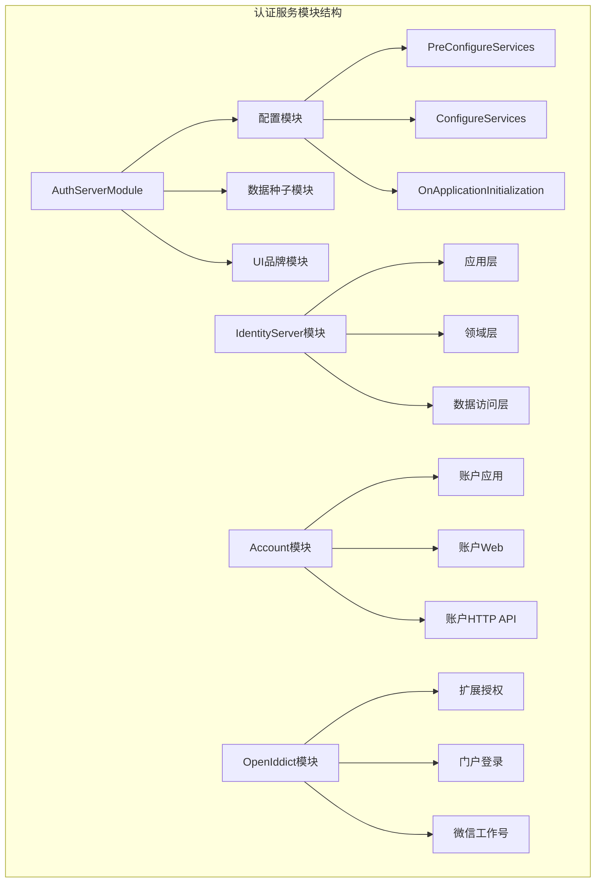
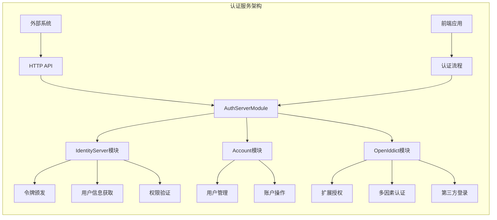
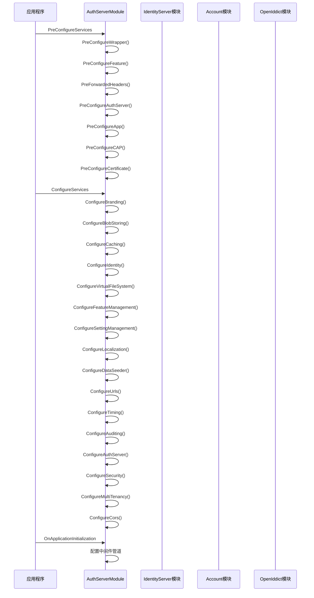
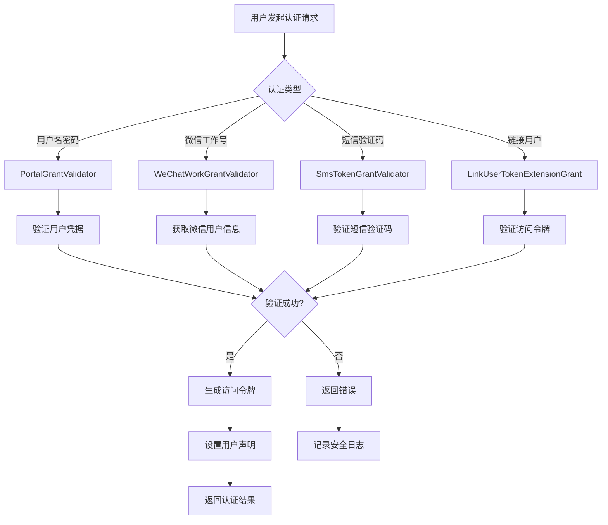
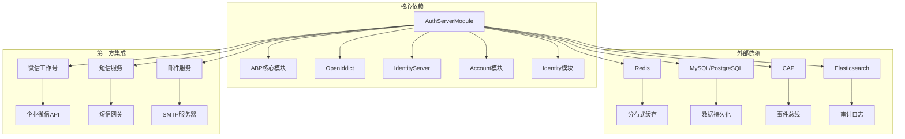

# 认证服务模块设计

<cite>
**本文档中引用的文件**
- [AuthServerModule.cs](file://aspnet-core/services/LY.MicroService.AuthServer/AuthServerModule.cs)
- [AuthServerModule.Configure.cs](file://aspnet-core/services/LY.MicroService.AuthServer/AuthServerModule.Configure.cs)
- [AbpIdentityServerApplicationModule.cs](file://aspnet-core/modules/identityServer/LINGYUN.Abp.IdentityServer.Application/LINGYUN/Abp/IdentityServer/AbpIdentityServerApplicationModule.cs)
- [AbpAccountApplicationModule.cs](file://aspnet-core/modules/account/LINGYUN.Abp.Account.Application/LINGYUN/Abp/Account/AbpAccountApplicationModule.cs)
- [AbpAccountWebIdentityServerModule.cs](file://aspnet-core/modules/account/LINGYUN.Abp.Account.Web.IdentityServer/AbpAccountWebIdentityServerModule.cs)
- [AbpIdentitySessionUserInfoRequestValidator.cs](file://aspnet-core/modules/identityServer/LINGYUN.Abp.IdentityServer.Session/LINGYUN/Abp/IdentityServer/Session/AbpIdentitySessionUserInfoRequestValidator.cs)
- [UserInfoIdentitySession.cs](file://aspnet-core/modules/openIddict/LINGYUN.Abp.OpenIddict.AspNetCore.Session/LINGYUN/Abp/OpenIddict/AspNetCore/Session/UserinfoIdentitySession.cs)
- [PortalGrantValidator.cs](file://aspnet-core/modules/identityServer/LINGYUN.Abp.IdentityServer.Portal/LINGYUN/Abp/IdentityServer/Portal/PortalGrantValidator.cs)
- [WeChatWorkGrantValidator.cs](file://aspnet-core/modules/identityServer/LINGYUN.Abp.IdentityServer.WeChat.Work/LINGYUN/Abp/IdentityServer/WeChat/Work/WeChatWorkGrantValidator.cs)
- [LinkUserTokenExtensionGrant.cs](file://aspnet-core/modules/openIddict/LINGYUN.Abp.OpenIddict.LinkUser/LINGYUN/Abp/OpenIddict/LinkUser/LinkUserTokenExtensionGrant.cs)
</cite>

## 目录
1. [简介](#简介)
2. [项目结构](#项目结构)
3. [核心组件](#核心组件)
4. [架构概览](#架构概览)
5. [详细组件分析](#详细组件分析)
6. [依赖关系分析](#依赖关系分析)
7. [性能考虑](#性能考虑)
8. [故障排除指南](#故障排除指南)
9. [结论](#结论)

## 简介

认证服务模块是基于ABP框架构建的企业级认证系统，采用微服务架构设计，支持多种认证方式和扩展功能。该模块主要负责用户身份验证、令牌颁发、权限管理和会话控制等核心功能。

本认证服务基于OpenIddict和IdentityServer技术栈，提供了完整的OAuth2.0和OpenID Connect协议实现，支持密码模式、授权码模式、刷新令牌等多种认证流程。同时集成了微信工作号、短信验证码、多因素认证等扩展认证方式。

## 项目结构

认证服务模块采用分层架构设计，主要包含以下核心目录：



**图表来源**
- [AuthServerModule.cs](file://aspnet-core/services/LY.MicroService.AuthServer/AuthServerModule.cs#L65-L97)
- [AbpIdentityServerApplicationModule.cs](file://aspnet-core/modules/identityServer/LINGYUN.Abp.IdentityServer.Application/LINGYUN/Abp/IdentityServer/AbpIdentityServerApplicationModule.cs#L1-L26)

**章节来源**
- [AuthServerModule.cs](file://aspnet-core/services/LY.MicroService.AuthServer/AuthServerModule.cs#L1-L157)

## 核心组件

### AuthServerModule - 主要认证模块

AuthServerModule是整个认证服务的核心模块，继承自AbpModule基类，负责统一管理所有认证相关的服务和配置。

```csharp
[DependsOn(
    typeof(AbpSerilogEnrichersApplicationModule),
    typeof(AbpSerilogEnrichersUniqueIdModule),
    typeof(AbpAspNetCoreSerilogModule),
    typeof(AbpAccountApplicationModule),
    typeof(AbpAccountHttpApiModule),
    typeof(AbpAccountWebOpenIddictModule),
    typeof(AbpAccountWebOAuthModule),
    typeof(AbpBlobStoringOssManagementModule),
    typeof(AbpGdprApplicationModule),
    typeof(AbpGdprHttpApiModule),
    typeof(AbpGdprWebModule),
    typeof(AbpAspNetCoreMvcUiLeptonXLiteThemeModule),
    typeof(AbpAutofacModule),
    typeof(AbpCachingStackExchangeRedisModule),
    typeof(AbpIdentityAspNetCoreSessionModule),
    typeof(AbpOpenIddictAspNetCoreSessionModule),
    typeof(AbpIdentitySessionAspNetCoreModule),
    typeof(AbpOpenIddictSmsModule),
    typeof(AbpOpenIddictWeChatModule),
    typeof(AbpOpenIddictLinkUserModule),
    typeof(AbpOpenIddictPortalModule),
    typeof(AbpOpenIddictWeChatWorkModule),
    typeof(AbpIdentityOrganizaztionUnitsModule),
    typeof(AbpPermissionManagementDomainIdentityModule),
    typeof(AuthServerMigrationsEntityFrameworkCoreModule),
    typeof(AbpDataDbMigratorModule),
    typeof(AbpAuditLoggingElasticsearchModule),
    typeof(AbpLocalizationCultureMapModule),
    typeof(AbpAspNetCoreMvcWrapperModule),
    typeof(AbpAspNetCoreHttpOverridesModule),
    typeof(AbpTelemetrySkyWalkingModule),
    typeof(AbpExporterMiniExcelModule),
    typeof(AbpEmailingPlatformModule),
    typeof(AbpSmsPlatformModule),
    typeof(AbpCAPEventBusModule)
)]
```

### IdentityServer模块 - 身份服务器

IdentityServer模块提供了标准的OAuth2.0和OpenID Connect实现，支持客户端管理、作用域配置和令牌验证等功能。

### Account模块 - 账户管理

Account模块负责用户账户相关的业务逻辑，包括用户注册、密码重置、邮箱验证等功能。

**章节来源**
- [AuthServerModule.cs](file://aspnet-core/services/LY.MicroService.AuthServer/AuthServerModule.cs#L65-L97)
- [AbpIdentityServerApplicationModule.cs](file://aspnet-core/modules/identityServer/LINGYUN.Abp.IdentityServer.Application/LINGYUN/Abp/IdentityServer/AbpIdentityServerApplicationModule.cs#L1-L26)
- [AbpAccountApplicationModule.cs](file://aspnet-core/modules/account/LINGYUN.Abp.Account.Application/LINGYUN/Abp/Account/AbpAccountApplicationModule.cs#L1-L52)

## 架构概览

认证服务采用模块化架构，各模块之间通过依赖注入和服务接口进行解耦：



**图表来源**
- [AuthServerModule.cs](file://aspnet-core/services/LY.MicroService.AuthServer/AuthServerModule.cs#L65-L97)
- [AbpAccountWebIdentityServerModule.cs](file://aspnet-core/modules/account/LINGYUN.Abp.Account.Web.IdentityServer/AbpAccountWebIdentityServerModule.cs#L1-L27)

## 详细组件分析

### 模块初始化流程

AuthServerModule的初始化过程分为三个阶段：预配置、配置和服务注册：



**图表来源**
- [AuthServerModule.cs](file://aspnet-core/services/LY.MicroService.AuthServer/AuthServerModule.cs#L85-L157)
- [AuthServerModule.Configure.cs](file://aspnet-core/services/LY.MicroService.AuthServer/AuthServerModule.Configure.cs#L50-L100)

### 依赖注入配置

模块通过依赖注入容器注册各种服务，包括：

1. **身份验证服务**：JWT令牌验证、Cookie认证等
2. **数据存储服务**：数据库连接、缓存服务等
3. **业务服务**：用户管理、权限控制等
4. **第三方集成**：微信、短信、邮件等

```csharp
private void ConfigureSecurity(IServiceCollection services, IConfiguration configuration, bool isDevelopment = false)
{
    services.ForwardIdentityAuthenticationForBearer(OpenIddictValidationAspNetCoreDefaults.AuthenticationScheme);

    services
        .AddAuthentication()
        .AddCookie(CookieAuthenticationDefaults.AuthenticationScheme, options =>
        {
            options.ExpireTimeSpan = TimeSpan.FromDays(365);
        })
        .AddJwtBearer(options =>
        {
            configuration.GetSection("AuthServer").Bind(options);

            var validIssuers = configuration.GetSection("AuthServer:ValidIssuers").Get<List<string>>();
            if (validIssuers?.Count > 0)
            {
                options.TokenValidationParameters.ValidIssuers = validIssuers;
                options.TokenValidationParameters.IssuerValidator = TokenWildcardIssuerValidator.IssuerValidator;
            }
        });

    if (!isDevelopment)
    {
        var redis = ConnectionMultiplexer.Connect(configuration["Redis:Configuration"]);
        services
            .AddDataProtection()
            .SetApplicationName("LINGYUN.Abp.Application")
            .PersistKeysToStackExchangeRedis(redis, "LINGYUN.Abp.Application:DataProtection:Protection-Keys");
    }
    services.AddSameSiteCookiePolicy();
}
```

**章节来源**
- [AuthServerModule.Configure.cs](file://aspnet-core/services/LY.MicroService.AuthServer/AuthServerModule.Configure.cs#L380-L420)

### 身份认证流程

认证流程涉及多个组件的协作，主要包括令牌颁发、用户信息获取和权限验证：



**图表来源**
- [PortalGrantValidator.cs](file://aspnet-core/modules/identityServer/LINGYUN.Abp.IdentityServer.Portal/LINGYUN/Abp/IdentityServer/Portal/PortalGrantValidator.cs#L123-L159)
- [WeChatWorkGrantValidator.cs](file://aspnet-core/modules/identityServer/LINGYUN.Abp.IdentityServer.WeChat.Work/LINGYUN/Abp/IdentityServer/WeChat/Work/WeChatWorkGrantValidator.cs#L111-L139)

### 用户信息获取和权限验证

用户信息获取通过UserInfoRequestValidator接口实现，支持多种验证方式：

```csharp
public async Task<UserInfoRequestValidationResult> ValidateRequestAsync(string accessToken)
{
    if (_httpContextAccessor.HttpContext?.User?.Identity?.IsAuthenticated == false)
    {
        _logger.LogError("User session has expired.");
        return new UserInfoRequestValidationResult
        {
            IsError = true,
            Error = Constants.ProtectedResourceErrors.ExpiredToken,
        };
    }

    // 验证访问令牌的有效性
    var tokenResult = await _tokenValidator.ValidateAccessTokenAsync(
        accessToken,
        IdentityServerConstants.StandardScopes.OpenId);

    if (tokenResult.IsError)
    {
        return new UserInfoRequestValidationResult
        {
            IsError = true,
            Error = tokenResult.Error
        };
    }

    // 检查令牌必须包含一个sub声明
    var subClaim = tokenResult.Claims.SingleOrDefault(c => c.Type == JwtClaimTypes.Subject);
    if (subClaim == null)
    {
        _logger.LogError("Token contains no sub claim");
        return new UserInfoRequestValidationResult
        {
            IsError = true,
            Error = OidcConstants.ProtectedResourceErrors.InvalidToken
        };
    }

    // 创建主体并检查用户是否仍然活跃
    var claims = tokenResult.Claims.Where(x => !Constants.Filters.ProtocolClaimsFilter.Contains(x.Type));
    var subject = Principal.Create("UserInfo", claims.ToArray());
    
    var isActiveContext = new IsActiveContext(subject, tokenResult.Client, IdentityServerConstants.ProfileIsActiveCallers.UserInfoRequestValidation);
    await _profile.IsActiveAsync(isActiveContext);

    if (isActiveContext.IsActive == false)
    {
        _logger.LogError("User is not active: {sub}", subject.GetSubjectId());
        return new UserInfoRequestValidationResult
        {
            IsError = true,
            Error = OidcConstants.ProtectedResourceErrors.InvalidToken
        };
    }

    return new UserInfoRequestValidationResult
    {
        IsError = false,
        TokenValidationResult = tokenResult,
        Subject = subject
    };
}
```

**章节来源**
- [AbpIdentitySessionUserInfoRequestValidator.cs](file://aspnet-core/modules/identityServer/LINGYUN.Abp.IdentityServer.Session/LINGYUN/Abp/IdentityServer/Session/AbpIdentitySessionUserInfoRequestValidator.cs#L38-L105)

### 扩展认证功能

系统支持多种扩展认证方式，包括：

1. **微信工作号认证**：通过企业微信获取用户信息
2. **短信验证码认证**：支持手机号+验证码登录
3. **链接用户认证**：支持用户账号关联
4. **多因素认证**：支持二次验证

```csharp
protected async virtual Task SetSuccessResultAsync(ExtensionGrantValidationContext context, IdentityUser user)
{
    var sub = await UserManager.GetUserIdAsync(user);
    Logger.LogInformation("Credentials validated for username: {username}", user.UserName);

    var additionalClaims = new List<Claim>();
    await AddCustomClaimsAsync(additionalClaims, user, context);

    context.Result = new GrantValidationResult(
        sub,
        AbpWeChatWorkGlobalConsts.AuthenticationMethod,
        additionalClaims.ToArray()
    );

    await SaveSecurityLogAsync(
        context,
        user,
        IdentityServerSecurityLogActionConsts.LoginSucceeded);
}
```

**章节来源**
- [WeChatWorkGrantValidator.cs](file://aspnet-core/modules/identityServer/LINGYUN.Abp.IdentityServer.WeChat.Work/LINGYUN/Abp/IdentityServer/WeChat/Work/WeChatWorkGrantValidator.cs#L137-L179)

## 依赖关系分析

认证服务模块的依赖关系复杂，涉及多个ABP模块和第三方库：



**图表来源**
- [AuthServerModule.cs](file://aspnet-core/services/LY.MicroService.AuthServer/AuthServerModule.cs#L65-L97)

**章节来源**
- [AuthServerModule.cs](file://aspnet-core/services/LY.MicroService.AuthServer/AuthServerModule.cs#L65-L97)

## 性能考虑

认证服务在设计时充分考虑了性能优化：

1. **缓存策略**：使用Redis缓存用户会话和令牌信息
2. **连接池**：数据库连接采用连接池管理
3. **异步处理**：大量操作采用异步模式
4. **负载均衡**：支持多实例部署和负载均衡

## 故障排除指南

### 常见集成问题

1. **令牌验证失败**
   - 检查令牌签名密钥配置
   - 验证有效发行者配置
   - 确认令牌过期时间设置

2. **用户会话过期**
   - 检查Cookie配置
   - 验证会话超时设置
   - 确认Redis连接状态

3. **第三方认证失败**
   - 验证应用配置信息
   - 检查回调URL设置
   - 确认权限范围配置

### 解决方案

```csharp
// 示例：配置令牌验证参数
Configure<JwtBearerOptions>(options =>
{
    options.TokenValidationParameters = new TokenValidationParameters
    {
        ValidateIssuer = true,
        ValidateAudience = true,
        ValidateLifetime = true,
        ValidateIssuerSigningKey = true,
        ValidIssuer = configuration["AuthServer:ValidIssuers"],
        IssuerSigningKey = new SymmetricSecurityKey(Encoding.UTF8.GetBytes(configuration["AuthServer:SecurityKey"]))
    };
});
```

**章节来源**
- [AuthServerModule.Configure.cs](file://aspnet-core/services/LY.MicroService.AuthServer/AuthServerModule.Configure.cs#L380-L420)

## 结论

认证服务模块是一个功能完整、架构清晰的企业级认证系统。它通过模块化设计实现了高度的可扩展性和可维护性，支持多种认证方式和复杂的业务场景。

主要特点包括：

1. **模块化设计**：清晰的模块边界和依赖关系
2. **协议兼容**：完全支持OAuth2.0和OpenID Connect标准
3. **扩展性强**：支持多种认证方式和第三方集成
4. **性能优化**：完善的缓存和连接池机制
5. **安全可靠**：多层次的安全防护和审计日志

该模块为现代企业应用提供了强大而灵活的身份认证解决方案，能够满足各种复杂的业务需求。