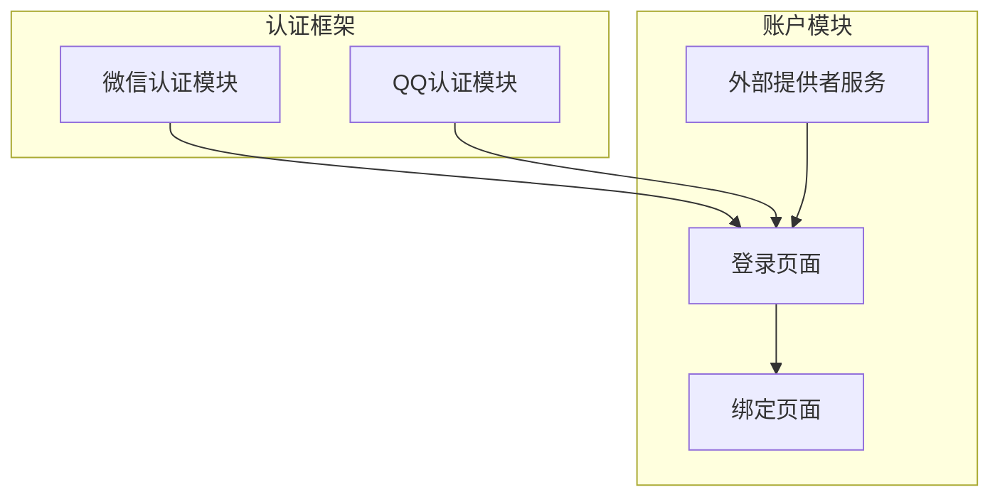
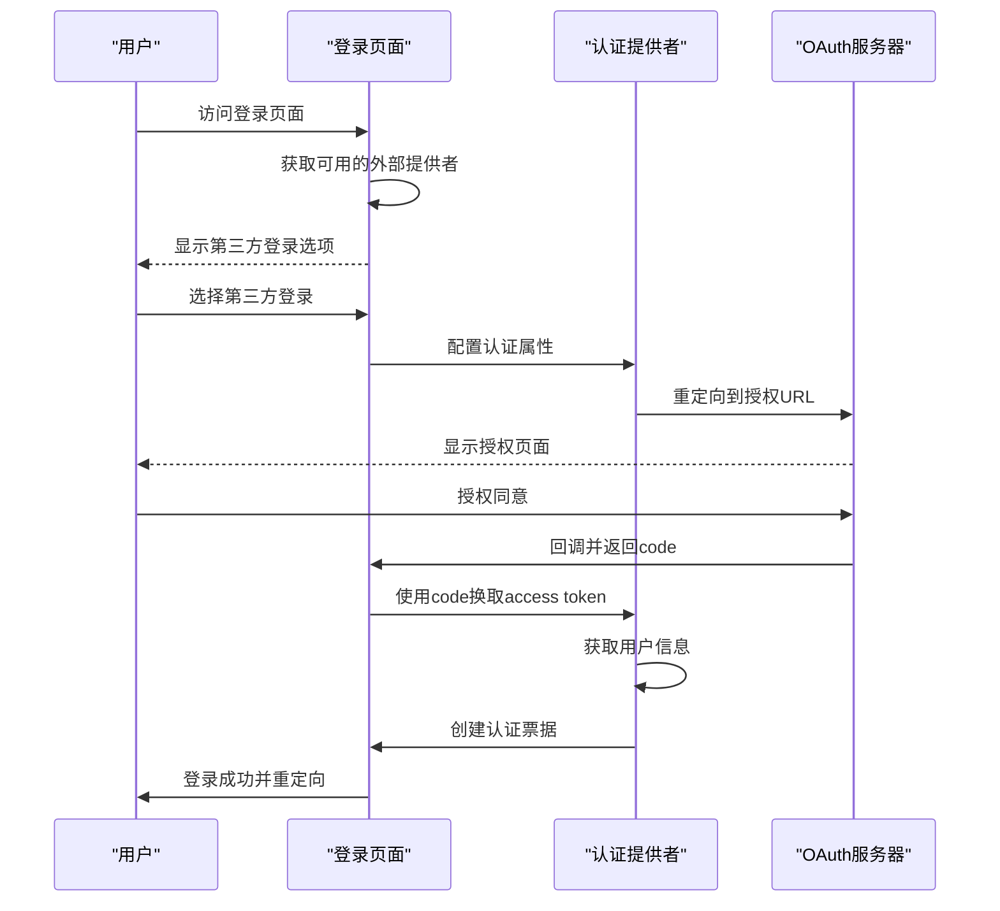
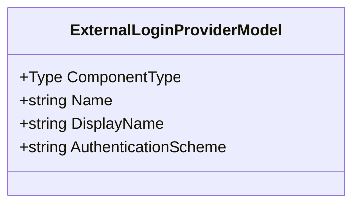
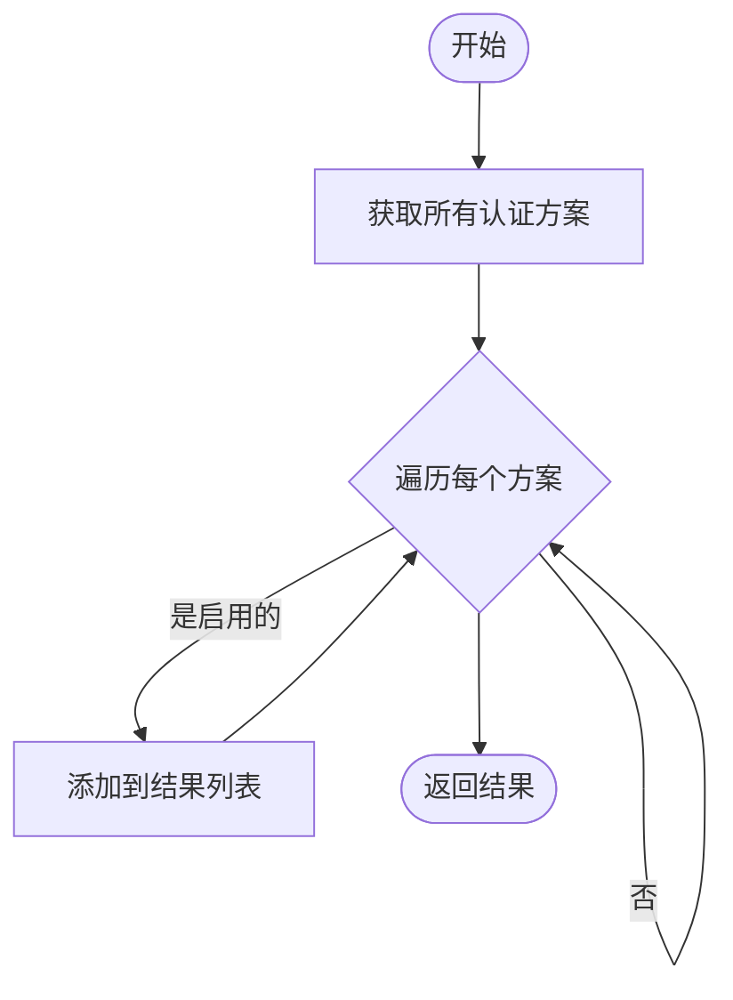
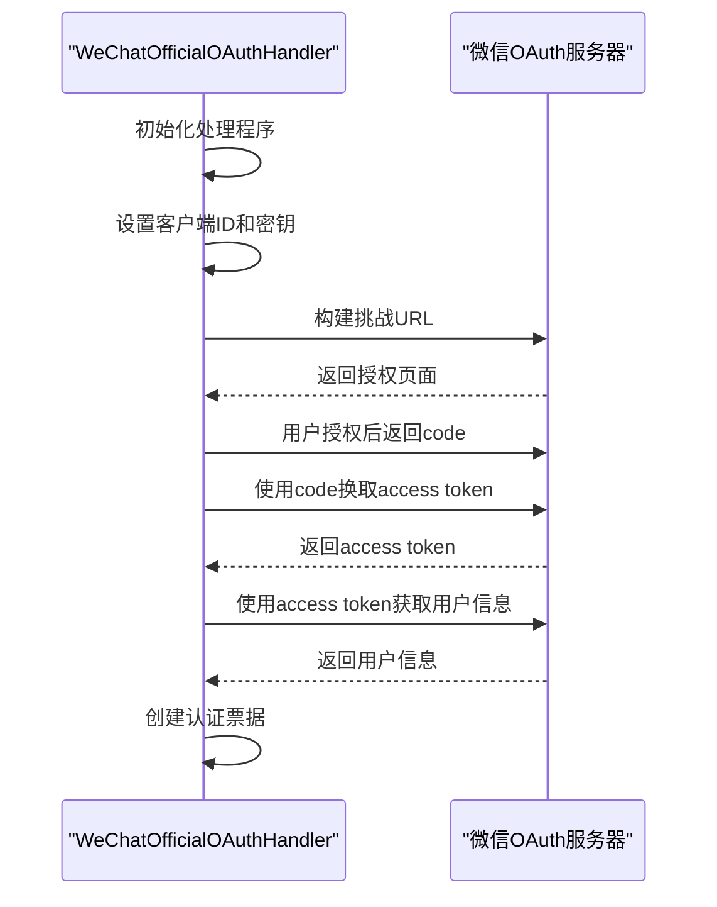
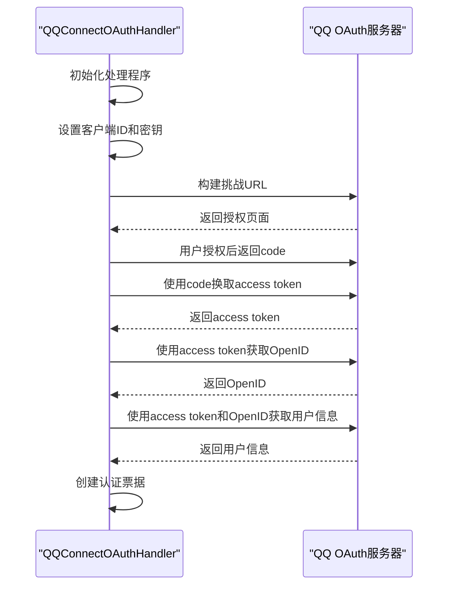
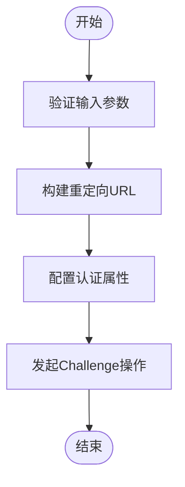
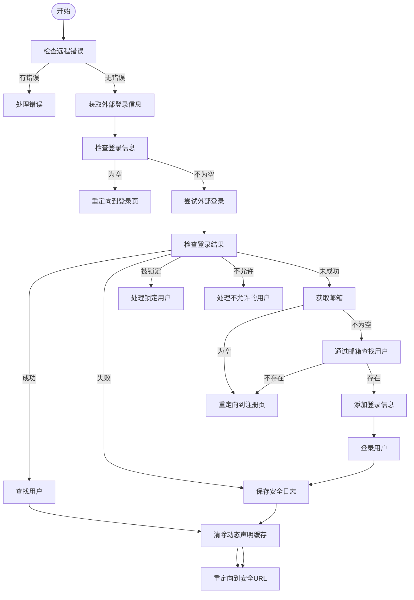
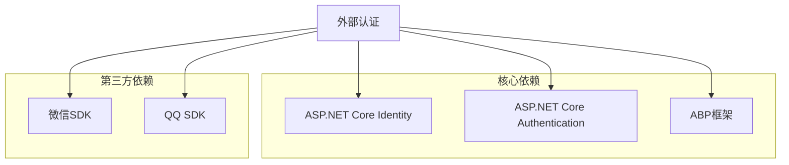

# 外部认证集成

<cite>
**本文档引用的文件**
- [Login.cshtml.cs](file://aspnet-core\modules\account\LINGYUN.Abp.Account.Web\Pages\Account\Login.cshtml.cs)
- [OAuthExternalProviderService.cs](file://aspnet-core\modules\account\LINGYUN.Abp.Account.Web.OAuth\ExternalProviders\OAuthExternalProviderService.cs)
- [WeChatOfficialOAuthHandler.cs](file://aspnet-core\framework\authentication\LINGYUN.Abp.Authentication.WeChat\Microsoft\AspNetCore\Authentication\WeChat\Official\WeChatOfficialOAuthHandler.cs)
- [QQConnectOAuthHandler.cs](file://aspnet-core\framework\authentication\LINGYUN.Abp.Authentication.QQ\Microsoft\AspNetCore\Authentication\QQ\QQConnectOAuthHandler.cs)
- [AbpAuthenticationWeChatConsts.cs](file://aspnet-core\framework\authentication\LINGYUN.Abp.Authentication.WeChat\LINGYUN\Abp\Authentication\WeChat\AbpAuthenticationWeChatConsts.cs)
- [AbpAuthenticationQQConsts.cs](file://aspnet-core\framework\authentication\LINGYUN.Abp.Authentication.QQ\LINGYUN\Abp\Authentication\QQ\AbpAuthenticationQQConsts.cs)
- [ExternalLoginBind.cshtml.cs](file://aspnet-core\modules\account\LINGYUN.Abp.Account.Web\Pages\Account\ExternalLoginBind.cshtml.cs)
- [AccountOAuthFeatureDefinitionProvider.cs](file://aspnet-core\modules\account\LINGYUN.Abp.Account.OAuth\LINGYUN\Abp\Account\OAuth\Features\AccountOAuthFeatureDefinitionProvider.cs)
</cite>

## 目录
1. [简介](#简介)
2. [项目结构](#项目结构)
3. [核心组件](#核心组件)
4. [架构概述](#架构概述)
5. [详细组件分析](#详细组件分析)
6. [依赖分析](#依赖分析)
7. [性能考虑](#性能考虑)
8. [故障排除指南](#故障排除指南)
9. [结论](#结论)

## 简介
本文档详细介绍了如何通过OAuth2/OpenID Connect协议集成微信、QQ等第三方登录。文档解释了ExternalLoginProvider模型和AuthenticationSchemeProvider的协作机制，详细说明了OnPostExternalLogin和OnGetExternalLoginCallbackAsync方法的实现，包括身份信息映射、用户关联和安全日志记录。同时提供了第三方应用配置指南和常见问题解决方案。

## 项目结构
外部认证功能主要分布在两个框架模块中：`LINGYUN.Abp.Authentication.WeChat` 和 `LINGYUN.Abp.Authentication.QQ`，以及账户模块中的相关页面和服务。这些模块实现了与微信和QQ的OAuth2集成，并通过统一的接口提供给应用程序使用。

**图表来源**
- [WeChatOfficialOAuthHandler.cs](file://aspnet-core\framework\authentication\LINGYUN.Abp.Authentication.WeChat\Microsoft\AspNetCore\Authentication\WeChat\Official\WeChatOfficialOAuthHandler.cs)
- [QQConnectOAuthHandler.cs](file://aspnet-core\framework\authentication\LINGYUN.Abp.Authentication.QQ\Microsoft\AspNetCore\Authentication\QQ\QQConnectOAuthHandler.cs)
- [Login.cshtml.cs](file://aspnet-core\modules\account\LINGYUN.Abp.Account.Web\Pages\Account\Login.cshtml.cs)

**章节来源**
- [Login.cshtml.cs](file://aspnet-core\modules\account\LINGYUN.Abp.Account.Web\Pages\Account\Login.cshtml.cs)
- [OAuthExternalProviderService.cs](file://aspnet-core\modules\account\LINGYUN.Abp.Account.Web.OAuth\ExternalProviders\OAuthExternalProviderService.cs)

## 核心组件
外部认证系统的核心组件包括外部登录提供者模型(ExternalLoginProviderModel)、外部提供者服务(OAuthExternalProviderService)以及具体的认证处理程序(如WeChatOfficialOAuthHandler和QQConnectOAuthHandler)。这些组件协同工作，实现了第三方登录的完整流程。

**章节来源**
- [ExternalLoginProviderModel.cs](file://aspnet-core\modules\account\LINGYUN.Abp.Account.Web\Models\ExternalLoginProviderModel.cs)
- [OAuthExternalProviderService.cs](file://aspnet-core\modules\account\LINGYUN.Abp.Account.Web.OAuth\ExternalProviders\OAuthExternalProviderService.cs)

## 架构概述
系统的外部认证架构基于ASP.NET Core的认证体系，通过AuthenticationSchemeProvider获取所有可用的认证方案，并根据功能开关决定是否启用特定的第三方登录。当用户选择第三方登录时，系统会重定向到相应的OAuth授权服务器，完成授权后回调处理用户信息。

**图表来源**
- [Login.cshtml.cs](file://aspnet-core\modules\account\LINGYUN.Abp.Account.Web\Pages\Account\Login.cshtml.cs)
- [WeChatOfficialOAuthHandler.cs](file://aspnet-core\framework\authentication\LINGYUN.Abp.Authentication.WeChat\Microsoft\AspNetCore\Authentication\WeChat\Official\WeChatOfficialOAuthHandler.cs)
- [QQConnectOAuthHandler.cs](file://aspnet-core\framework\authentication\LINGYUN.Abp.Authentication.QQ\Microsoft\AspNetCore\Authentication\QQ\QQConnectOAuthHandler.cs)

## 详细组件分析

### 外部登录提供者模型分析
ExternalLoginProviderModel类定义了外部登录提供者的基本信息，包括名称、显示名称、认证方案和组件类型。这个模型用于在前端展示可用的第三方登录选项。

**图表来源**
- [ExternalLoginProviderModel.cs](file://aspnet-core\modules\account\LINGYUN.Abp.Account.Web\Models\ExternalLoginProviderModel.cs)

### 外部提供者服务分析
OAuthExternalProviderService服务负责获取所有可用的外部登录提供者。它通过IAuthenticationSchemeProvider获取所有认证方案，并根据功能开关过滤出启用的提供者。

**图表来源**
- [OAuthExternalProviderService.cs](file://aspnet-core\modules\account\LINGYUN.Abp.Account.Web.OAuth\ExternalProviders\OAuthExternalProviderService.cs)

### 微信认证处理程序分析
WeChatOfficialOAuthHandler实现了微信官方OAuth2认证流程，包括构建授权URL、交换access token和创建用户票据三个主要步骤。

**图表来源**
- [WeChatOfficialOAuthHandler.cs](file://aspnet-core\framework\authentication\LINGYUN.Abp.Authentication.WeChat\Microsoft\AspNetCore\Authentication\WeChat\Official\WeChatOfficialOAuthHandler.cs)

### QQ认证处理程序分析
QQConnectOAuthHandler实现了QQ互联的OAuth2认证流程，与微信类似，但有一些特定于QQ的实现细节，如获取OpenID和用户信息的方式。

**图表来源**
- [QQConnectOAuthHandler.cs](file://aspnet-core\framework\authentication\LINGYUN.Abp.Authentication.QQ\Microsoft\AspNetCore\Authentication\QQ\QQConnectOAuthHandler.cs)

### OnPostExternalLogin方法分析
OnPostExternalLogin方法处理用户发起第三方登录请求的POST操作。它配置外部认证属性并重定向到相应的OAuth服务器。

**图表来源**
- [Login.cshtml.cs](file://aspnet-core\modules\account\LINGYUN.Abp.Account.Web\Pages\Account\Login.cshtml.cs)

### OnGetExternalLoginCallbackAsync方法分析
OnGetExternalLoginCallbackAsync方法处理OAuth服务器回调，完成用户登录或注册流程。

**图表来源**
- [Login.cshtml.cs](file://aspnet-core\modules\account\LINGYUN.Abp.Account.Web\Pages\Account\Login.cshtml.cs)

**章节来源**
- [Login.cshtml.cs](file://aspnet-core\modules\account\LINGYUN.Abp.Account.Web\Pages\Account\Login.cshtml.cs)

## 依赖分析
外部认证系统依赖于多个核心组件和第三方库，包括ASP.NET Core的身份认证系统、ABP框架的基础服务以及特定于微信和QQ的SDK。

**图表来源**
- [go.mod](file://aspnet-core\framework\authentication\LINGYUN.Abp.Authentication.WeChat\go.mod)
- [go.mod](file://aspnet-core\framework\authentication\LINGYUN.Abp.Authentication.QQ\go.mod)

**章节来源**
- [WeChatOfficialOAuthHandler.cs](file://aspnet-core\framework\authentication\LINGYUN.Abp.Authentication.WeChat\Microsoft\AspNetCore\Authentication\WeChat\Official\WeChatOfficialOAuthHandler.cs)
- [QQConnectOAuthHandler.cs](file://aspnet-core\framework\authentication\LINGYUN.Abp.Authentication.QQ\Microsoft\AspNetCore\Authentication\QQ\QQConnectOAuthHandler.cs)

## 性能考虑
外部认证系统的性能主要受网络延迟和第三方API响应时间的影响。建议实施以下优化措施：
- 对第三方API调用进行缓存
- 实现异步处理以避免阻塞主线程
- 使用连接池管理HTTP客户端
- 监控和限制并发请求

## 故障排除指南
### 常见问题及解决方案
1. **无法显示第三方登录选项**
   - 检查功能开关是否已启用
   - 确认认证方案已正确注册
   - 验证配置文件中的AppId和AppSecret

2. **回调时出现"state not valid"错误**
   - 检查Cookie策略设置
   - 确保HTTPS配置正确
   - 验证反向代理配置

3. **获取用户信息失败**
   - 检查access token是否有效
   - 验证API权限设置
   - 查看第三方平台的配额限制

**章节来源**
- [Login.cshtml.cs](file://aspnet-core\modules\account\LINGYUN.Abp.Account.Web\Pages\Account\Login.cshtml.cs)
- [WeChatOfficialOAuthHandler.cs](file://aspnet-core\framework\authentication\LINGYUN.Abp.Authentication.WeChat\Microsoft\AspNetCore\Authentication\WeChat\Official\WeChatOfficialOAuthHandler.cs)
- [QQConnectOAuthHandler.cs](file://aspnet-core\framework\authentication\LINGYUN.Abp.Authentication.QQ\Microsoft\AspNetCore\Authentication\QQ\QQConnectOAuthHandler.cs)

## 结论
本文档详细介绍了外部认证集成的实现机制，包括微信和QQ的OAuth2集成、ExternalLoginProvider模型和AuthenticationSchemeProvider的协作机制，以及OnPostExternalLogin和OnGetExternalLoginCallbackAsync方法的具体实现。通过这些组件的协同工作，系统能够安全、高效地支持第三方登录功能。